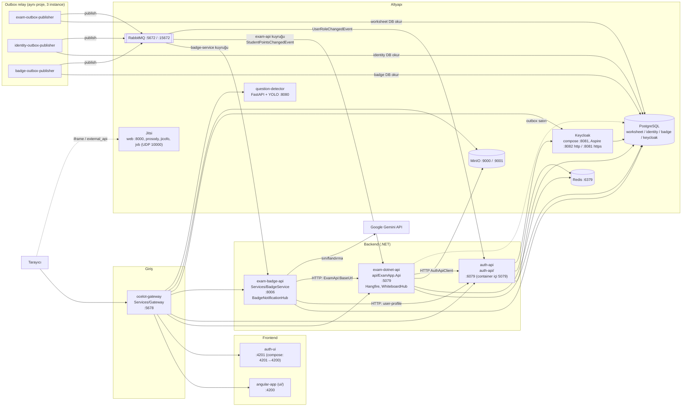

# 01 — Sistem haritası

Bu dosya ExamApp'i oluşturan tüm çalışma birimlerini (servis, worker, frontend, altyapı container'ı) tek yerde toplar: her birinin sorumluluğu, portu, bağımlılıkları ve aralarındaki HTTP/olay akışı. Ayrıntılar servis bazında [03-servisler/](03-servisler/) altında, olaylar [06-asenkron-akislar.md](06-asenkron-akislar.md) içinde, port/başlatma ayrıntısı [02-ortam-kurulumu.md](02-ortam-kurulumu.md) içindedir.

## İçindekiler

- [1. Tek cümlelik özet](#1-tek-cümlelik-özet)
- [2. Mimari diyagram](#2-mimari-diyagram)
- [3. Servis envanteri](#3-servis-envanteri)
- [4. Servisler arası çağrılar](#4-servisler-arası-çağrılar)
- [5. Ağ geçidi (gateway) yol haritası](#5-ağ-geçidi-gateway-yol-haritası)
- [6. Veritabanları ve sahiplik](#6-veritabanları-ve-sahiplik)
- [7. Mimari kurallar (değiştirmeden önce bil)](#7-mimari-kurallar-değiştirmeden-önce-bil)
- [8. Repoda ürün dışı / yan klasörler](#8-repoda-ürün-dışı--yan-klasörler)
- [Ayrı issue adayları](#ayrı-issue-adayları)
- [Doğrulanmadı](#doğrulanmadı)

## 1. Tek cümlelik özet

Tarayıcı her şeye Ocelot gateway (`:5678`) üzerinden erişir; gateway JWT'yi doğrulayıp isteği exam API'ye (`exam-dotnet-api`), kimlik servisine (`auth-api`), BadgeService'e (`exam-badge-api`), Keycloak'a, MinIO'ya, question-detector'a veya iki Angular uygulamasına yönlendirir. Servisler birbirine olay göndermek için doğrudan çağrı yerine kendi veritabanlarındaki outbox tablosuna yazar; üç OutboxPublisher instance'ı bu satırları RabbitMQ'ya taşır, BadgeService (ve iki istisna olarak exam API ile auth-api) tüketir.

## 2. Mimari diyagram

Notlar:

- Gateway, Aspire altında downstream adresleri ortam değişkenleriyle değiştirir (`AUTH_UI_HOST/PORT`, `ANGULAR_APP_HOST/PORT`, `QUESTION_DETECTOR_HOST/PORT`, `EXAM_DOTNET_API_HOST/PORT`, `EXAM_BADGE_API_HOST/PORT`): `AppHost/AppHost.cs:645`, `AppHost/AppHost.cs:837`, `AppHost/AppHost.cs:879`. Ayrıntı: [03-servisler/gateway.md](03-servisler/gateway.md).
- UI, API'yi göreli `/api/...` yollarıyla çağırır (örn. `ui/src/app/services/book.service.ts:11`) ve dev proxy'si yoktur; bu yüzden uygulama her zaman gateway üzerinden (`http://localhost:5678`) açılır. `ui/src/environments/environment.ts:3-4` içindeki `apiUrl`/`reportsApiUrl` kodda kullanılmıyor (grep ile doğrulandı); AppHost'taki aksi yöndeki yorum (`AppHost/AppHost.cs:771`) eskimiştir. Ayrıntı: [03-servisler/ui.md](03-servisler/ui.md).
- Jitsi tarafında exam API yalnızca oda/JWT üretir (`api/ExamApp.Api/Services/Video/JitsiVideoSessionProvider.cs`); medya trafiği tarayıcı ile Jitsi arasındadır. Bkz. [../../docs/jitsi-video.md](../../docs/jitsi-video.md).

## 3. Servis envanteri

Port sütunu: Aspire'da pin'lenen host portu / docker-compose host portu. Satır referansları Aspire için `AppHost/AppHost.cs`, compose için `docker-compose.yml`.

| Kaynak adı | Kod | Sorumluluk | Port (Aspire / compose) | Bağımlılıklar | Ayrıntı |
|---|---|---|---|---|---|
| `exam-dotnet-api` | `api/ExamApp.Api` | Ana backend: soru, test/çalışma kağıdı, öğrenci/öğretmen/veli/okul, booking, müsaitlik, yorum, bildirim, whiteboard hub'ı, video oturumu, Hangfire işleri, outbox yazımı, `StudentPointsChangedEvent` tüketimi | 5079 (`AppHost.cs:369`) / 5079 ve 8005 (`docker-compose.yml:10`) | worksheet DB, Redis, RabbitMQ, MinIO, Keycloak, auth-api (`AppHost.cs:385-430`, `AppHost.cs:690-704`) | [api.md](03-servisler/api.md) |
| `auth-api` | `auth-api/` | Kimlik: Keycloak ile kayıt/giriş/token, kullanıcı profili, identity DB, `LoginAttemptedEvent` vb. outbox, `UserRoleChangedEvent` tüketimi | 6079 (`AppHost.cs:571`) / `127.0.0.1:6079→5079` (`docker-compose.yml:63`) | identity DB, Redis, RabbitMQ, MinIO, Keycloak (`AppHost.cs:586-610`, `AppHost.cs:720-726`) | [auth-api.md](03-servisler/auth-api.md) |
| `exam-badge-api` | `Services/BadgeService` | İsmi yanıltıcı: rozet + puan hesaplama + bildirim + Gemini soru sınıflandırma; exam/identity outbox olaylarının neredeyse hepsini tüketir; `BadgeNotificationHub` (`/hub/badges`) | 8006 (`AppHost.cs:443`) / 8006, 5080 (`docker-compose.yml:105`) | badge DB, RabbitMQ, MinIO, exam API, auth-api, Keycloak (`AppHost.cs:448-474`, `AppHost.cs:706-718`) | [badge-service.md](03-servisler/badge-service.md) |
| `exam-outbox-publisher` | `Services/OutboxPublisher` | worksheet DB outbox'ını RabbitMQ'ya taşır | HTTP yok / 8007, 5081 (`docker-compose.yml:149`) | worksheet DB, RabbitMQ (`AppHost.cs:484-497`) | [outbox-publisher.md](03-servisler/outbox-publisher.md) |
| `identity-outbox-publisher` | aynı proje | identity DB outbox'ı | HTTP yok / 8008, 5082 (`docker-compose.yml:185`) | identity DB, RabbitMQ (`AppHost.cs:509-523`) | aynı |
| `badge-outbox-publisher` | aynı proje | badge DB outbox'ı (`StudentPointsChangedEvent`) | HTTP yok / 8009, 5083 (`docker-compose.yml:222`) | badge DB, RabbitMQ, BadgeService (`AppHost.cs:533-550`) | aynı |
| `ocelot-gateway` | `Services/Gateway` | Tek dış giriş noktası, JWT doğrulama, route, WebSocket hub auth | 5678 (`AppHost.cs:640`) / 5678 (`docker-compose.yml:493`) | exam API, BadgeService, auth-api, Keycloak, MinIO (`AppHost.cs:662-666`) | [gateway.md](03-servisler/gateway.md) |
| `angular-app` | `ui/` | Öğrenci/öğretmen/veli/admin arayüzü | 4200 (`ng serve`, endpoint deklare edilmez: `AppHost.cs:793`, `AppHost.cs:816`) / 4200 (`docker-compose.yml:257`) | gateway | [ui.md](03-servisler/ui.md) |
| `auth-ui` | `auth-ui/` | Giriş/kayıt/callback arayüzü, gateway'de `/app/*` altında | 4201 (`start:aspire`, `AppHost.cs:821`) / `4201→4200` (`docker-compose.yml:274`) | gateway | [auth-ui.md](03-servisler/auth-ui.md) |
| `question-detector` (compose: `question-detector-dev`) | `question-detector/` | Python FastAPI + YOLO; sayfa görselinden soru/şık kutularını tespit eder | 8080 (`AppHost.cs:867-870`) / 8080, 8888 (`docker-compose.yml:363`) | yok (DB/broker kullanmaz: `AppHost.cs:862`) | [question-detector.md](03-servisler/question-detector.md) |
| `postgres` / `exam-pg-container` | — | worksheet, identity, badge, keycloak veritabanları | Aspire dinamik / `5433→5432` (`docker-compose.yml:293`) | — | [04-veri-modeli.md](04-veri-modeli.md) |
| `redis` | — | Dağıtık cache, rate limit sayaçları | Aspire dinamik + RedisInsight (`AppHost.cs:31-33`) / 6379 (`docker-compose.yml:508`) | — | |
| `rabbitmq` | `rabbitmq/` | Mesaj aracısı; kullanıcı/izinler `definitions.json` ile | 5672 (`AppHost.cs:81`) / yalnız `127.0.0.1` (`docker-compose.yml:374`) | — | [06-asenkron-akislar.md](06-asenkron-akislar.md) |
| `rabbitmq-permission-sync` | `rabbitmq/sync-permissions.sh` | Yalnız compose: her `up -d`'de izinleri çalışan RabbitMQ'ya yeniden basar | — (`docker-compose.yml:405`) | rabbitmq | [02-ortam-kurulumu.md](02-ortam-kurulumu.md) |
| `minio` | — | Soru/sayfa görselleri (gateway'de `/img/*`) | 9000 API, 9001 konsol (`AppHost.cs:112-113`, `docker-compose.yml:341`) | — | |
| `keycloak` | `deploy/keycloak/` | OIDC sağlayıcı, realm `exam-realm`, roller | Aspire: 8081 HTTPS, 8082 HTTP + admin konsolu `/admin/` (`AppHost.cs:298`, `AppHost.cs:313`, `AppHost.cs:765`) / `127.0.0.1:8081→8080` (`docker-compose.yml:443`) | keycloak DB | [05-kimlik-yetki.md](05-kimlik-yetki.md) |
| `prosody`, `jicofo`, `jvb`, `jitsi-web` | — | Kendi barındırdığımız Jitsi Meet | web 8000 (`AppHost.cs:233`), jvb UDP 10000 (`AppHost.cs:208`) | birbirine (`AppHost.cs:196`, `AppHost.cs:267-269`) | [../../docs/jitsi-video.md](../../docs/jitsi-video.md) |
| `pgadmin` | — | Yalnız compose, DB yönetimi | `5051→80` (`docker-compose.yml:313`) | postgres | |

Portların tamamı ve "hangi port hangi modda" tablosu [../../.claude/rules/local-dev.md](../../.claude/rules/local-dev.md) ve [02-ortam-kurulumu.md](02-ortam-kurulumu.md) içinde.

## 4. Servisler arası çağrılar

Mimari kural (`.claude/rules/workflow-rules.md`): yeni async iş akışı outbox ile yapılır, servisten servise doğrudan çağrı eklenmez. Bugün var olan doğrudan HTTP çağrıları:

| Çağıran | Çağrılan | Ne için | Kanıt |
|---|---|---|---|
| exam API | auth-api | Kullanıcı profilini/sayısal id'yi çözmek (`AuthApiClient`), öğretmen seed'i | `AppHost/AppHost.cs:696-702` (`AuthApiBaseUrl`), `api/ExamApp.Api/Services/Teachers/Seed/TeacherSeedServiceCollectionExtensions.cs:29` |
| BadgeService | auth-api | Keycloak `sub` → sayısal user id (rapor uçlarında IDOR koruması, #165) | `Services/BadgeService/Program.cs:102-108`, `AppHost/AppHost.cs:712-716` |
| BadgeService | exam API | Gemini sınıflandırma sonucunu geri yazmak, login olaylarını iletmek | `Services/BadgeService/Services/GeminiQuestionClassifier.cs:70`, `Services/BadgeService/Consumers/LoginAttemptedConsumer.cs:69`, `api/ExamApp.Api/Controllers/LoginEventsController.cs:15` |
| exam API | BadgeService | Öğrenci sıfırlama işi (Hangfire) BadgeService verisini senkron temizler; outbox kuralının eski istisnası | `api/ExamApp.Api/Services/StudentReset/StudentResetJob.cs:11` |
| BadgeService | exam API (HTTP PUT) | Gemini sınıflandırma sonucunu geri yazar; eski istisna | `Services/BadgeService/Services/GeminiQuestionClassifier.cs:262` |
| BadgeService | Google Gemini | Soru görselinden ders/konu/zorluk | `Services/BadgeService/Services/GeminiQuestionClassifier.cs` |
| auth-api | Keycloak admin API | Kullanıcı oluşturma, rol atama vb. | `auth-api/Services/KeycloakServiceCollectionExtensions.cs:19` |
| exam API | Keycloak | Rol atama (öğretmen/öğrenci kaydı) | `api/ExamApp.Api/Controllers/TeacherController.cs:101`, `api/ExamApp.Api/Controllers/StudentController.cs:198` |
| Servis → servis kimliği | Keycloak `exam-admin` client credentials | Servis token'ı (`IServiceTokenProvider`) | `Services/BadgeService/Program.cs:115`; ayrıntı [05-kimlik-yetki.md](05-kimlik-yetki.md) |

Olay tabanlı akışların tam listesi (yayınlayan, tüketen, yan etki): [06-asenkron-akislar.md](06-asenkron-akislar.md). Kısa özet:

- **exam API → BadgeService:** `AnswerSubmittedEvent`, `QuestionCreatedEvent`, `WorksheetReminderDueEvent`, `WorksheetAccessRequested/Approved/RejectedEvent`, öğretmen başvuru/okul talebi/bağımsız öğretmen olayları, booking olayları, yorum olayları, `UserPreferredLocaleChangedEvent` (`Services/BadgeService/Program.cs:210-228`).
- **auth-api → BadgeService:** `LoginAttemptedEvent`, `UserPreferredLocaleChangedEvent`.
- **BadgeService → exam API:** `StudentPointsChangedEvent` (`api/ExamApp.Api/Program.cs:425-427`). İstisna kuralı: olayın yazdığı veri hangi servisin DB'sindeyse consumer oradadır ([../../.claude/rules/architecture.md](../../.claude/rules/architecture.md)).
- **exam API → auth-api:** `UserRoleChangedEvent` (#277) (`api/ExamApp.Api/Helpers/UserRoleChangeOutbox.cs:16`, `auth-api/Program.cs:195-197`).

## 5. Ağ geçidi (gateway) yol haritası

`Services/Gateway/ocelot.json` içindeki upstream → downstream eşlemesinin özeti (tam tablo, auth ve rate-limit ayarları: [03-servisler/gateway.md](03-servisler/gateway.md)):

| Upstream | Downstream | Satır |
|---|---|---|
| `/hub/whiteboard` | exam-dotnet-api:5079 (WebSocket) | `Services/Gateway/ocelot.json:12` |
| `/hub/badges` | exam-badge-api:8006 (WebSocket) | `Services/Gateway/ocelot.json:30` |
| `/question-detector-dev/{everything}` | question-detector-dev:8080 | `Services/Gateway/ocelot.json:48` |
| `/api/auth/dev/{everything}`, `/api/auth/users/lookup`, `/api/auth/{everything}` | auth-api:5079 | `Services/Gateway/ocelot.json:59-95` |
| `/api/school`, `/api/exam/{everything}` | exam-dotnet-api:5079 | `Services/Gateway/ocelot.json:106`, `Services/Gateway/ocelot.json:121` |
| `/hangfire`, `/hangfire/{everything}` | exam-dotnet-api:5079 | `Services/Gateway/ocelot.json:135`, `Services/Gateway/ocelot.json:154` |
| `/api/badge/{everything}` | exam-badge-api:8006 | `Services/Gateway/ocelot.json:173` |
| `/oidc-login`, `/token`, `/userinfo`, `/resources/*`, `/auth/realms/*`, `/realms/*` | keycloak:8080 | `Services/Gateway/ocelot.json:187-263` |
| `/img/{everything}` | minio:9000 | `Services/Gateway/ocelot.json:279` |
| `/app/{everything}` | auth-ui:4200 | `Services/Gateway/ocelot.json:295` |
| `/{everything}` (catch-all) | angular-app:4200 | `Services/Gateway/ocelot.json:307` |

Gateway'de yalnız dört route Bearer token ister (`/hub/whiteboard`, `/hub/badges`, `/api/exam/*`, `/api/badge/*`); hiçbir route'ta `RouteClaimsRequirement` veya rate limit yoktur, rol kontrolü downstream serviste yapılır. `/api/auth/dev/*` ve `/api/auth/users/lookup` dışarıya kapatılmıştır (yüksek öncelikli route ile `/__blocked/...`'a yönlendirilir); servisler auth-api'ye doğrudan gider. Ayrıntı ve kanıt: [03-servisler/gateway.md](03-servisler/gateway.md).

Üç dosya vardır (`ocelot.json`, `ocelot.Development.json`, `ocelot.Production.json`, her biri 313 satır); hangisinin hangi ortamda yüklendiği ve farkları gateway bölümündedir.

## 6. Veritabanları ve sahiplik

| DB adı | Aspire kaynağı | Sahibi | Kim okur |
|---|---|---|---|
| `worksheet` | `examdb` (`AppHost/AppHost.cs:24`) | exam API | exam-outbox-publisher (outbox tablosu) |
| `identity` | `identitydb` (`AppHost/AppHost.cs:25`) | auth-api | identity-outbox-publisher |
| `badge` | `badgedb` (`AppHost/AppHost.cs:26`) | BadgeService | badge-outbox-publisher |
| `keycloak` | `keycloakdb` (`AppHost/AppHost.cs:29`) | Keycloak | — |
| `finance_db` | AppHost'ta yok | finance-api (ayrı proje, bkz. [03-servisler/finance.md](03-servisler/finance.md)) | — |

Servisler başka servisin DB'sine bağlanmaz; kural ve gerekçe: [../../docs/data-ownership.md](../../docs/data-ownership.md). Şema ayrıntısı ve ER diyagramları: [04-veri-modeli.md](04-veri-modeli.md).

## 7. Mimari kurallar (değiştirmeden önce bil)

1. **Outbox zorunlu.** Async iş akışı outbox satırıyla başlar; olay aynı `SaveChanges` içinde yazılır ([../../.claude/rules/workflow-rules.md](../../.claude/rules/workflow-rules.md), [06-asenkron-akislar.md](06-asenkron-akislar.md)).
2. **Yeni consumer BadgeService'e** eklenir; istisna, olayın yazdığı tablo başka servisteyse consumer o servistedir (#225, #277).
3. **Yeni olay = RabbitMQ izni.** `rabbitmq/definitions.json` güncellenmezse consumer `ACCESS_REFUSED` alır (#328). Adımlar: [../../.claude/skills/outbox-event/SKILL.md](../../.claude/skills/outbox-event/SKILL.md).
4. **Yeni gateway route'u** üç ocelot dosyasına birden eklenir ([../../.claude/skills/gateway-route/SKILL.md](../../.claude/skills/gateway-route/SKILL.md)).
5. **Token issuer = gateway'in genel URL'i.** `Server:BaseUrl` her serviste aynı olmalı, `Keycloak:Host` yalnız metadata için (`AppHost/AppHost.cs:669-688`). Karıştırılırsa ağ hatasına benzemeyen JWT hataları çıkar.
6. **Kestrel portları kodda sabit.** exam API ve auth-api ikisi de varsayılan 5079 dinler; Aspire `Kestrel__Port` ile ayırır (`AppHost/AppHost.cs:355-370`, `AppHost/AppHost.cs:562-572`).

## 8. Repoda ürün dışı / yan klasörler

| Klasör | Ne | Not |
|---|---|---|
| `finance-api/`, `finance-app/`, `finance-ios/` | Kişisel finans takibi uygulaması | Kısa özet ve "ürünün parçası mı" değerlendirmesi: [03-servisler/finance.md](03-servisler/finance.md) |
| `.claude/skills/graft`, `.claude/helpers/graft-*.cjs` | Claude Code eklentisi (status line/hook) | `graft/` diye bir kök klasör yoktur; bkz. [08-gelistirme-pratikleri.md](08-gelistirme-pratikleri.md) |
| `k6/`, `api/k6-test.js` | Yük testleri | [08-gelistirme-pratikleri.md](08-gelistirme-pratikleri.md) |
| `automation/`, `scratch/`, `compare.py`, `data/` | Yardımcı script/deneme dosyaları | [08-gelistirme-pratikleri.md](08-gelistirme-pratikleri.md) |
| `architect.md`, `aspire-migration-agent-brief.md` | Aspire geçişi için tarihsel brief | [../../docs/aspire-migration-decisions.md](../../docs/aspire-migration-decisions.md) |

## Ayrı issue adayları

Bu dosyada yeni aday yok. Sistem haritası yazılırken görülen tutarsızlıklar (ölü compose portları, AppHost'taki eskimiş `environment.ts` yorumu, eski yöntemle kalan senkron HTTP çağrıları) [09-bilinen-sorunlar.md](09-bilinen-sorunlar.md#ayrı-issue-adayları) içindeki birleşik listede O5, D6 ve H9/H10 olarak yer alır.

## Doğrulanmadı

- Diyagramdaki "exam API → Keycloak rol atama" okunun hangi HTTP istemcisiyle yapıldığı (`AddHttpClient()` varsayılanı mı, Keycloak admin client'ı mı) bu dosyada izlenmedi; bkz. [05-kimlik-yetki.md](05-kimlik-yetki.md).
- Çalışma anında ağ trafiği izlenmedi; çağrı okları koddan ve AppHost/compose tanımlarından çıkarıldı.
