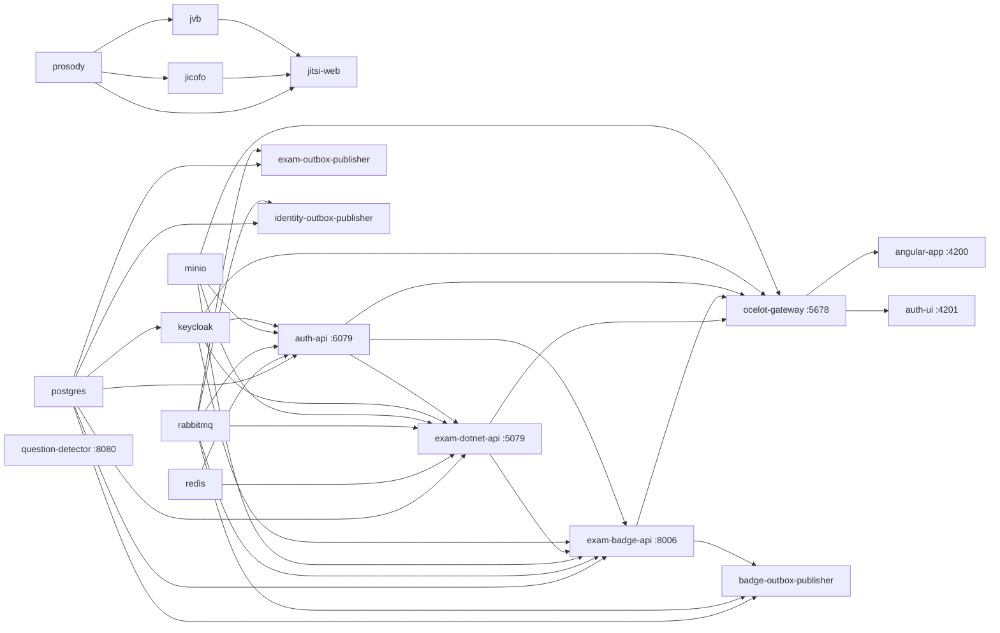

# 02 — Ortam kurulumu (Aspire ve docker-compose)

**Bu dosya neyi anlatır.** ExamApp'i boş bir makinede sıfırdan ayağa kaldırmanın iki yolunu anlatır: .NET Aspire AppHost (günlük geliştirmede asıl yol) ve docker-compose (yedek yol). Ön koşulları, her kaynağın portunu, `.env` anahtarlarını ve AppHost parametrelerini listeler. Keycloak realm importu, RabbitMQ kullanıcıları ve izin senkronu, Postgres veritabanlarının nasıl oluştuğu, MinIO bucket'ı, migration ve seed davranışı, ilk admin kullanıcısı ve bilinen tuzaklar da burada. Komutlar ve URL'ler koddan doğrulandı. Ayrıntısı zaten başka yerde yazılmış konularda o dokümana bağlantı verilir: [`.claude/rules/local-dev.md`](../../.claude/rules/local-dev.md) (kurallar, port tablosu, RabbitMQ izin matrisi), [`docs/local-development.md`](../../docs/local-development.md) (Aspire başlangıç rehberi), [`docs/aspire-migration-decisions.md`](../../docs/aspire-migration-decisions.md) (Aspire kararları) ve [`docs/jitsi-video.md`](../../docs/jitsi-video.md) (Jitsi). Bu dosya onların yerine geçmez, hepsini tek akışta birleştirir. Yazıldığı tarihte o dokümanlarda kodla uyuşmayan yerler bulundu. Bunlar aşağıda **"Fark"** diye işaretlendi ve dosyanın sonunda listelendi.

Bu dosyadaki hiçbir parola, secret veya token değeri yazılmamıştır. Dev-only değerin hangi dosyada ve hangi anahtarda durduğu belirtilir.

## İçindekiler

1. [Hangi yolu seçmeli](#1-hangi-yolu-seçmeli)
2. [Ön koşullar](#2-ön-koşullar)
3. [Yol 1: .NET Aspire AppHost](#3-yol-1-net-aspire-apphost)
   - 3.1 [Dosyalar](#31-dosyalar)
   - 3.2 [Sıfırdan başlatma](#32-sıfırdan-başlatma)
   - 3.3 [AppHost parametreleri](#33-apphost-parametreleri)
   - 3.4 [Parametreleri user-secrets ile ezme](#34-parametreleri-user-secrets-ile-ezme)
   - 3.5 [Aspire kaynakları ve portları](#35-aspire-kaynakları-ve-portları)
   - 3.6 [Başlangıç bağımlılık grafiği](#36-başlangıç-bağımlılık-grafiği)
   - 3.7 [Tek kaynağı Aspire CLI ile yeniden başlatma](#37-tek-kaynağı-aspire-cli-ile-yeniden-başlatma)
4. [Yol 2: docker-compose](#4-yol-2-docker-compose)
   - 4.1 [Dosyalar](#41-dosyalar)
   - 4.2 [Sıfırdan başlatma](#42-sıfırdan-başlatma)
   - 4.3 [`.env` anahtarları](#43-env-anahtarları)
   - 4.4 [Compose servisleri ve portları](#44-compose-servisleri-ve-portları)
   - 4.5 [`dockerfiles/` klasörü](#45-dockerfiles-klasörü)
5. [Port karşılaştırması: local-dev.md, compose ve Aspire](#5-port-karşılaştırması-local-devmd-compose-ve-aspire)
6. [Altyapı bileşenleri tek tek](#6-altyapı-bileşenleri-tek-tek)
   - 6.1 [Keycloak ve realm importu](#61-keycloak-ve-realm-importu)
   - 6.2 [RabbitMQ kullanıcıları ve izinleri](#62-rabbitmq-kullanıcıları-ve-izinleri)
   - 6.3 [PostgreSQL ve init scriptleri](#63-postgresql-ve-init-scriptleri)
   - 6.4 [MinIO bucket kurulumu](#64-minio-bucket-kurulumu)
   - 6.5 [Redis](#65-redis)
   - 6.6 [Jitsi](#66-jitsi)
   - 6.7 [question-detector](#67-question-detector)
   - 6.8 [finance-* servisleri](#68-finance--servisleri)
7. [ui ve auth-ui dev'de nasıl çalışır](#7-ui-ve-auth-ui-devde-nasıl-çalışır)
8. [Migration'lar ve seed verisi](#8-migrationlar-ve-seed-verisi)
9. [İlk admin kullanıcısı](#9-ilk-admin-kullanıcısı)
10. [Sağlık kontrolü: her şey ayağa kalktı mı](#10-sağlık-kontrolü-her-şey-ayağa-kalktı-mı)
11. [Bilinen tuzaklar](#11-bilinen-tuzaklar)
12. [Sık hata ve çözüm tablosu](#12-sık-hata-ve-çözüm-tablosu)
13. [Doğrulanmadı](#13-doğrulanmadı)
14. [Ayrı issue adayları](#14-ayrı-issue-adayları)

---

## 1. Hangi yolu seçmeli

| | Aspire AppHost | docker-compose |
|---|---|---|
| Durum | Günlük geliştirmenin asıl yolu. [`docs/local-development.md`](../../docs/local-development.md) "replacing manual `docker-compose up` for day-to-day work" der. devops-aspire agent hafızası da yerelde AppHost'un çalıştığını kaydetmiş (`project_aspire_is_primary_orchestrator.md`). | Yedek yol. Dosyalar korunur ve çalışır ([`docs/local-development.md`](../../docs/local-development.md) "Fallback: docker-compose"). |
| .NET servisleri | Host üzerinde process olarak (`AddProject`) | Her biri ayrı SDK container'ında `dotnet watch run` ile |
| Angular | Host üzerinde `ng serve` (`AddJavaScriptApp`) | Node 20 container'ında `yarn start` |
| question-detector | Container (`AddDockerfile`) | Container |
| Gözlemlenebilirlik | Aspire dashboard: log, trace, metrik | `docker-compose logs` |
| Keycloak sürümü | 26.7.0 (`AppHost/AppHost.cs:299`) | 24.0.1 (`docker-compose.yml:425`) |

İki yol **aynı anda çalıştırılamaz**. 5079, 5678, 6079, 8006, 5672, 9000/9001, 8000, 8080 ve 10000/udp portlarını ikisi de sabit kullanır. Birini başlatmadan önce ötekini durdurun. Bu kural [`docs/local-development.md:88`](../../docs/local-development.md) ile aynıdır, port listesinin ayrıntısı için [§5](#5-port-karşılaştırması-local-devmd-compose-ve-aspire)'e bakın.

---

## 2. Ön koşullar

| Araç | Sürüm | Neden / kaynak |
|---|---|---|
| .NET SDK | **10.0.x** | Bütün .NET projeleri `net10.0` hedefler: `api/ExamApp.Api/ExamApp.Api.csproj:4`, `auth-api/ExamApp.Api.csproj:4`, `Services/BadgeService/BadgeService.csproj:4`, `Services/Gateway/Gateway.csproj:4`, `Services/OutboxPublisher/OutboxPublisherService.csproj:4`, `ServiceDefaults/ExamApp.ServiceDefaults.csproj:4`, `AppHost/ExamApp.AppHost.csproj:24`. Repoda **`global.json` yok**, yani SDK sürümü sabitlenmemiş. Makinedeki en yeni SDK kullanılır. |
| Aspire | AppHost SDK `Aspire.AppHost.Sdk/13.5.0` (`AppHost/ExamApp.AppHost.csproj:1`), hosting paketleri 13.5.0. Keycloak paketi preview: `13.5.0-preview.1.26417.10` (`AppHost/ExamApp.AppHost.csproj:16`). | Aspire workload kurulmaz, SDK NuGet'ten gelir. `AspireUseCliBundle=true` (`AppHost/ExamApp.AppHost.csproj:27`). `aspire` CLI (`aspire run`, `aspire ps`, `aspire resource ...`) ayrıca kurulmalıdır. Kurulum yöntemi repoda yazmıyor (**Doğrulanmadı**). |
| Docker Desktop (veya Podman) | Güncel | İki yol için de gerekli. Aspire'ın DCP'si Docker veya Podman'ı kendisi bulur ([`docs/local-development.md:12`](../../docs/local-development.md)). |
| Node.js + npm/yarn | Node 20 önerilir | Compose'daki UI imajı `node:20` (`dockerfiles/ui/Dockerfile.ui:2`, `dockerfiles/auth-ui/Dockerfile.auth-ui:2`). Angular 19.1.4 (`ui/package.json:19`, `auth-ui/package.json:18`). Aspire, `ng serve`'ü host üzerinde çalıştırır, bu yüzden Node yerelde kurulu olmalıdır. |
| Python | 3.11 (container içinde) | `question-detector/Dockerfile:1` = `python:3.11-slim`. İki yolda da question-detector container içinde koşar, host'ta Python **zorunlu değildir**. Host'ta yalnızca `rabbitmq/generate-password-hashes.py` (parola hash'i üretmek) ve standalone `python main.py` için gerekir. **Fark:** [`docs/local-development.md:14`](../../docs/local-development.md) "Python 3.12 … Aspire's `AddUvicornApp` runs `pip`/`uvicorn` on the host" der. AppHost artık `AddDockerfile` kullanıyor (`AppHost/AppHost.cs:867`). |
| `dotnet-ef` (isteğe bağlı) | — | Yalnızca migration üretmek için gerekir. Uygulama migration'ları başlangıçta kendisi uygular ([§8](#8-migrationlar-ve-seed-verisi)). |

---

## 3. Yol 1: .NET Aspire AppHost

### 3.1 Dosyalar

| Dosya | İçerik |
|---|---|
| `AppHost/AppHost.cs` | Bütün kaynak grafiği (infra container'ları, .NET projeleri, Angular, question-detector, Jitsi). 882 satır, ayrıntılı yorumlu. |
| `AppHost/appsettings.json` | `Parameters` bölümü (`AppHost/appsettings.json:9-32`), yani bütün dev-only kimlik bilgileri. Değerleri burada okuyun, bu dokümana kopyalanmadı. |
| `AppHost/aspire.config.json` | Aspire CLI'a hangi AppHost projesinin çalıştırılacağını söyler: `"appHost": { "path": "ExamApp.AppHost.csproj" }` (`AppHost/aspire.config.json:2-4`). |
| `AppHost/ExamApp.AppHost.csproj` | Proje referansları (`:4-11`). auth-api'nin csproj adı da `ExamApp.Api.csproj` olduğu için ona `AspireProjectMetadataTypeName="AuthApi"` verilmiş (`:11`). `UserSecretsId` tanımlı (`:28`). |
| `AppHost/Properties/launchSettings.json` | Dashboard URL'leri: `https` profili `https://localhost:17047` ve `http://localhost:15224`, `http` profili `http://localhost:15224`. |
| `ServiceDefaults/Extensions.cs` | OpenTelemetry, `/health` ve `/alive` uç noktaları (`ServiceDefaults/Extensions.cs:18-19`). Uç noktalar yalnız Development ortamında map'lenir (`:113-119`). |
| `ExamApp.slnx` | Kökteki tek solution. AppHost ve ServiceDefaults dahil. |

### 3.2 Sıfırdan başlatma

Aşağıdaki adımları bir terminalde sırayla uygulayın. Adım adım ayrıntı [`docs/local-development.md`](../../docs/local-development.md) "Starting everything" bölümünde.

```bash
# 1) Angular bağımlılıkları — Aspire npm install YAPMAZ (WithNpm(install: false), AppHost/AppHost.cs:817, :822)
cd ui && npm install          # ui/'de yalnız yarn.lock var; tercihen: yarn install
cd ../auth-ui && npm install  # auth-ui/'de hem package-lock.json hem yarn.lock var

# 2) AppHost'u başlat (iki eşdeğer yol)
cd ../AppHost
dotnet run          # launchSettings "https" profili → dashboard https://localhost:17047
# veya
aspire run          # AppHost/aspire.config.json'daki projeyi çalıştırır
```

İlk çalıştırmada beklenenler:
- Postgres, Redis, RabbitMQ, MinIO, Keycloak, Jitsi (4 imaj) ve pgAdmin/RedisInsight imajları çekilir. question-detector imajı `question-detector/Dockerfile`'dan build edilir. Bu build torch CPU wheel'lerini indirdiği için uzun sürer (`question-detector/Dockerfile:24-31`).
- Adlandırılmış volume'lar oluşturulur: `examapp-postgres-data` (`AppHost/AppHost.cs:18`), `examapp-redis-data` (`:32`), `examapp-minio-data` (`:111`), `examapp-keycloak-data` (`:325`), Jitsi için `examapp-jitsi-*` (`:174-175`, `:195`, `:222`, `:266`). RabbitMQ'nun kalıcı volume'u **yoktur**. Her AppHost başlangıcında temiz kurulur (`AppHost/AppHost.cs:87-91`).
- HTTPS dev sertifikasına güvenmeniz istenebilir. Etkileşimsiz bir shell'de bu adım takılır ([`docs/local-development.md:36`](../../docs/local-development.md)).
- Konsol, dashboard için tek kullanımlık bir giriş linki basar (`/login?t=...`).

Kod tarafında başka adım gerekmez. Migration'lar ve realm importu otomatik uygulanır ([§6.1](#61-keycloak-ve-realm-importu), [§8](#8-migrationlar-ve-seed-verisi)).

### 3.3 AppHost parametreleri

Parametreler `builder.AddParameter(...)` ile tanımlanır, değerleri `AppHost/appsettings.json` → `Parameters` bölümünden gelir. `secret: true` olan parametreler dashboard loglarında maskelenir. **Değerler burada yazılmadı.** Hepsi dev-only ve `AppHost/appsettings.json:10-31` içinde.

| Parametre | Secret | Tanım | Kim kullanır | Eşleşmesi gereken yer |
|---|---|---|---|---|
| `postgres-user` | hayır | `AppHost/AppHost.cs:14` | Postgres, Keycloak `KC_DB_USERNAME` (`:344`) | `.env` `POSTGRES_USER` (compose yolu) |
| `postgres-password` | evet | `:15` | Postgres, Keycloak `KC_DB_PASSWORD` (`:345`) | `.env` `POSTGRES_PASSWORD` |
| `rabbitmq-user` | hayır | `:39` | RabbitMQ admin (`:81`) | `rabbitmq/definitions.json` `rabbituser` |
| `rabbitmq-password` | evet | `:40` | RabbitMQ admin | `definitions.json` içindeki `rabbituser` `password_hash` değeri (bkz. [§6.2](#62-rabbitmq-kullanıcıları-ve-izinleri)) |
| `rabbitmq-exam-outbox-password` | evet | `:52` | `exam-outbox-publisher` (`:495`) | `.env` `RABBITMQ_EXAM_OUTBOX_PASSWORD` + `definitions.json` hash |
| `rabbitmq-identity-outbox-password` | evet | `:54` | `identity-outbox-publisher` (`:521`) | `RABBITMQ_IDENTITY_OUTBOX_PASSWORD` + hash |
| `rabbitmq-badge-outbox-password` | evet | `:56` | `badge-outbox-publisher` (`:545`) | `RABBITMQ_BADGE_OUTBOX_PASSWORD` + hash |
| `rabbitmq-badge-service-password` | evet | `:58` | `exam-badge-api` (`:459`) | `RABBITMQ_BADGE_SERVICE_PASSWORD` + hash |
| `rabbitmq-exam-api-password` | evet | `:60` | `exam-dotnet-api` (`:426`) | `RABBITMQ_EXAM_API_PASSWORD` + hash |
| `rabbitmq-auth-api-password` | evet | `:64` | `auth-api` (`:606`) | `RABBITMQ_AUTH_API_PASSWORD` + hash |
| `minio-root-user` | hayır | `:104` | MinIO, api/auth-api/badge `MinioConfig__AccessKey` | `.env` `MINIO_ROOT_USER` |
| `minio-root-password` | evet | `:105` | MinIO, `MinioConfig__SecretKey` | `.env` `MINIO_ROOT_PASSWORD` |
| `jitsi-jwt-app-id` | hayır | `:134` | prosody/jitsi-web `JWT_APP_ID`, api `Video__Jitsi__AppId` | `.env` `JITSI_JWT_APP_ID` |
| `jitsi-jwt-app-secret` | evet | `:135` | prosody/jitsi-web `JWT_APP_SECRET`, api `Video__Jitsi__AppSecret` | `.env` `JITSI_JWT_APP_SECRET` |
| `jitsi-room-secret` | evet | `:136` | api `Video__Jitsi__RoomSecret` (`:413`) | `.env` `JITSI_ROOM_SECRET` |
| `jicofo-auth-password` | evet | `:137` | prosody, jicofo | `.env` `JICOFO_AUTH_PASSWORD` |
| `jvb-auth-password` | evet | `:138` | prosody, jvb | `.env` `JVB_AUTH_PASSWORD` |
| `jicofo-component-secret` | evet | `:139` | prosody, jicofo | `.env` `JICOFO_COMPONENT_SECRET` |
| `keycloak-admin-username` | hayır | `:277` | Keycloak bootstrap admin | `.env` `KEYCLOAK_ADMIN` |
| `keycloak-admin-password` | evet | `:278` | Keycloak bootstrap admin | `.env` `KEYCLOAK_ADMIN_PASSWORD` |
| `keycloak-client-secret` | evet | `:286` | api/badge/auth-api `Keycloak__ClientSecret` (`:693`, `:709`, `:723`) | `deploy/keycloak/dev-import/realm-export.json` içindeki `exam-client` `secret` alanı + `.env` `KEYCLOAK_CLIENT_SECRET` |
| `keycloak-admin-client-secret` | evet | `:287` | `Keycloak__AdminClientSecret` (`:694`, `:710`, `:724`) | realm-export içindeki `exam-admin` `secret` alanı + `.env` `KEYCLOAK_ADMIN_CLIENT_SECRET` |

Redis için `AppHost/appsettings.json`'da parametre yoktur. `builder.AddRedis("redis")` (`AppHost/AppHost.cs:31`) kendi parolasını üretir ve bağlantı dizesini `Redis__Configuration` olarak api ve auth-api'ye geçirir (`:392`, `:588`). Üretilen parolanın nerede saklandığı (AppHost user-secrets mı, her başlangıçta yeniden mi üretildiği) **Doğrulanmadı**.

Parametre adının kuralı: RabbitMQ **kullanıcı adları** parametre değildir, AppHost.cs içinde sabit literal'dir (`AppHost/AppHost.cs:51-64`). Yalnız parolalar parametredir.

### 3.4 Parametreleri user-secrets ile ezme

AppHost'un `UserSecretsId`'si var (`AppHost/ExamApp.AppHost.csproj:28`). Development ortamında user-secrets `appsettings.json`'ın üstüne yazılır. Böylece bir değeri commit'e girmeden değiştirebilirsiniz:

```bash
cd AppHost
dotnet user-secrets set "Parameters:keycloak-client-secret" "<değer>"
dotnet user-secrets set "Parameters:keycloak-admin-client-secret" "<değer>"
dotnet user-secrets list
```

Bu yöntem [`.claude/rules/local-dev.md:50-55`](../../.claude/rules/local-dev.md)'te de anlatılır. Tipik kullanımı şudur: Keycloak volume'unuz eski bir secret ile import edilmişse, yeniden import etmek yerine eski değeri burada verirsiniz. Parametreyi ezdiğinizde eşleşmesi gereken öteki tarafı da ([§3.3](#33-apphost-parametreleri) son sütun) güncelleyin. Güncellemezseniz hata alakasız görünür. Örneğin Keycloak secret'ı uyuşmazsa `invalid_client_credentials` döner (`AppHost/AppHost.cs:280-285`).

### 3.5 Aspire kaynakları ve portları

"Sabit", portun AppHost.cs'te sabitlendiği anlamına gelir. "Dinamik" portu Aspire atar, URL'yi dashboard'dan alın.

| Kaynak adı | Tür | Host portu | Kaynak satırı | Not |
|---|---|---|---|---|
| `postgres` | `AddPostgres` | **dinamik** | `AppHost/AppHost.cs:17-19` | DB'ler: `worksheet` (`examdb`), `identity` (`identitydb`), `badge` (`badgedb`), `keycloak` (`keycloakdb`) (`:24-29`) |
| `postgres` pgAdmin | `WithPgAdmin()` | dinamik | `:19` | |
| `redis` + RedisInsight | `AddRedis` | dinamik | `:31-33` | |
| `rabbitmq` | `AddRabbitMQ` | AMQP **5672** sabit, management UI dinamik | `:81-84` | 5672 sabit, çünkü MassTransit `cfg.Host(host, "/")` port okumaz (`:66-70`) |
| `minio` | `AddContainer("minio/minio")` | API **9000**, console **9001** | `:107-113` | |
| `prosody` | container | port yok | `:150-175` | ağ alias'ı `meet.jitsi` (`:151`) |
| `jicofo` | container | port yok | `:177-196` | |
| `jvb` | container | **10000/udp** (`isProxied: false`) | `:198-223` | |
| `jitsi-web` | container | **8000** → 80 | `:227-269` | Compose'dan farklı olarak 0.0.0.0'a bind olur, yani LAN'dan erişilebilir (`:228-232`) |
| `keycloak` | `AddKeycloak` | **8081** (primary, HTTPS'e döner, container 8443) ve **8082** → 8080 (`http-plain`) | `:298`, `:313` | Bütün iç bağlantılar `http-plain`'i kullanır (`:348`). Admin console: `http://localhost:8082/admin/` (`:764-765`) |
| `exam-dotnet-api` | `AddProject` | **5079** | `:354-430` | `isProxied: false` ve `Kestrel__Port=5079` (`:369-370`) |
| `exam-badge-api` | `AddProject` | **8006** | `:438-474` | `:443-444` |
| `exam-outbox-publisher` | `AddProject` | yok (worker) | `:484-497` | DB `worksheet` |
| `identity-outbox-publisher` | `AddProject` (aynı proje) | yok | `:509-523` | DB `identity` |
| `badge-outbox-publisher` | `AddProject` (aynı proje) | yok | `:533-550` | DB `badge`, `WaitFor(badgeService)` (`:550`) |
| `auth-api` | `AddProject` | **6079**, yalnız loopback | `:562-610` | `Kestrel__BindLoopbackOnly=true` (`:581`) |
| `ocelot-gateway` | `AddProject` | **5678** (external) | `:633-666` | Downstream host/port env override'ları (`:643-661`, `:836-840`, `:878-880`) |
| `angular-app` | `AddJavaScriptApp` (`start`) | **4200** (`ng serve` varsayılanı) | `:816-819` | Aspire endpoint'i bilinçli olarak tanımlanmadı (`:793-807`) |
| `auth-ui` | `AddJavaScriptApp` (`start:aspire`) | **4201** | `:821-824` | `auth-ui/package.json:7` |
| `question-detector` | `AddDockerfile` | **8080** | `:867-870` | Kaynak kodu bind mount ile, `uvicorn --reload` |
| Aspire dashboard | — | `https://localhost:17047` veya `http://localhost:15224` | `AppHost/Properties/launchSettings.json` | |

**Fark:** [`docs/local-development.md:54`](../../docs/local-development.md) Keycloak admin console'u "Aspire-assigned port" ile ve realm'ı `deploy/keycloak/import/realm-export.json` yoluyla anlatır. Güncel kodda port 8082 (`/admin/`), realm yolu da `deploy/keycloak/dev-import/` (`AppHost/AppHost.cs:331`). Aynı dosyanın 59. satırı question-detector için "Aspire-assigned port" der. Kodda port 8080'e sabitlenmiş (`AppHost/AppHost.cs:870`). Aynı dosyanın 88. satırı Postgres 5433'ün iki yolda da sabit olduğunu ima eder. Aspire'da Postgres portu dinamiktir (`AppHost/AppHost.cs:17`, port parametresi verilmemiş).

### 3.6 Başlangıç bağımlılık grafiği

Oklar `WaitFor` ilişkisini gösterir: "A → B" demek "B, A sağlıklı olana kadar bekler" demek.



Kaynaklar: `AppHost/AppHost.cs:346`, `:427-430`, `:471-474`, `:496-497`, `:522-523`, `:546-550`, `:607-610`, `:662-666`, `:703-704`, `:717-718`, `:726`, `:732`, `:196`, `:223`, `:267-269`, `:819`, `:824`. question-detector hiçbir kaynağı beklemez, onu bekleyen kaynak da yoktur. `exam-dotnet-api`, Jitsi'yi bilerek beklemez, çünkü yalnızca token imzalar (`AppHost/AppHost.cs:400-405`).

### 3.7 Tek kaynağı Aspire CLI ile yeniden başlatma

devops-aspire agent hafızasının kuralı (`feedback_restart_single_resource_via_cli.md`): AppHost çalışırken tek bir kaynak düşerse onu **Aspire CLI ile** yeniden başlatın. O projenin klasöründe elle `dotnet run` **çalıştırmayın**. Elle başlatılan process DCP'nin denetiminin dışında kalır, AppHost'un enjekte ettiği konfigürasyonu (bağlantı dizeleri, OTLP, Ocelot override'ları) almaz ve DCP'nin kaynağı yeniden ayağa kaldırma girişimiyle çakışabilir.

Önerilen sıra (bu doküman için çalıştırılmadı):

```bash
aspire ps                                  # çalışan AppHost'u bul
aspire describe <kaynak-adı>               # ör. exam-badge-api — Finished/crash mi, yoksa yavaş mı başlıyor?
aspire resource <kaynak-adı> restart       # yalnız o kaynağı yeniden başlat
aspire describe <kaynak-adı>               # birkaç saniye sonra Running/Healthy ve URL'leri doğrula
```

Kaynak adları [§3.5](#35-aspire-kaynakları-ve-portları)'teki ilk sütundur (`exam-dotnet-api`, `exam-badge-api`, `auth-api`, `ocelot-gateway`, `rabbitmq`, ...). Tek kaynağın yeniden başlatılması işe yaramazsa bütün AppHost'u yeniden başlatın: `aspire stop`, ardından `AppHost/` içinde `aspire run` veya `dotnet run`.

Tipik kullanım: `rabbitmq/definitions.json`'ı AppHost çalışırken değiştirdiyseniz `aspire resource rabbitmq restart` gerekir, çünkü çalışan bir node dosyayı yeniden okumaz (`AppHost/AppHost.cs:87-91`, [`.claude/rules/local-dev.md:132-136`](../../.claude/rules/local-dev.md)).

Process'leri elle incelerken dikkat edin: `api/ExamApp.Api` ve `auth-api` aynı adla, `ExamApp.Api.dll` olarak derlenir. Bunları dll adına göre değil, `Get-CimInstance Win32_Process -Filter "Name='dotnet.exe'"` çıktısındaki CommandLine yoluna (`\api\ExamApp.Api\bin\` ile `\auth-api\bin\`) göre ayırın (agent hafızası `reference_authapi_namesake.md`).

---

## 4. Yol 2: docker-compose

### 4.1 Dosyalar

| Dosya | İçerik |
|---|---|
| `docker-compose.yml` | Servis tanımları, imajlar, portlar, ortam değişkenleri (`${VAR}` ile `.env`'den). |
| `docker-compose.override.yml` | Her servisin **çalıştırma komutu** (`command:`) ve Keycloak'ın realm importu ile tema mount'u. `docker-compose up` bu dosyayı otomatik birleştirir. |
| `.env.example` | `.env` şablonu. `.env` git-ignored (`.gitignore:56-59`). |
| `dockerfiles/*` | Servis imajları ([§4.5](#45-dockerfiles-klasörü)). |
| `rabbitmq/` | `definitions.json`, `rabbitmq.conf`, `sync-permissions.sh`, `generate-password-hashes.py`. |
| `deploy/keycloak/dev-import/realm-export.json` | Dev realm. Override dosyası bunu mount eder. |

### 4.2 Sıfırdan başlatma

```bash
cp .env.example .env      # tek seferlik; var olan .env'i EZER — bkz. local-dev.md:33-39
docker-compose up -d      # docker-compose.yml + docker-compose.override.yml birlikte
docker-compose ps
```

Komut [`.claude/rules/local-dev.md:8-11`](../../.claude/rules/local-dev.md) ile aynıdır.

Önemli ayrıntılar:
- `dockerfiles/*` imajlarının hepsi `CMD ["sleep", "infinity"]` ile biter (ör. `dockerfiles/api/Dockerfile.api:57`, `dockerfiles/ui/Dockerfile.ui:32`). Servisi gerçekten başlatan komut `docker-compose.override.yml`'dedir (`:4-31`). Compose'u `-f docker-compose.yml` ile override'sız çalıştırırsanız .NET ve UI container'ları hiçbir şey yapmadan bekler.
- Kaynak kodu container'a bind mount edilir (ör. `./api:/app`, `docker-compose.yml:41`) ve `dotnet watch run` ile koşar. İlk başlangıç uzun sürer, çünkü `dotnet nuget locals all --clear && dotnet restore` (`docker-compose.override.yml:4`, `:7`) her başlangıçta NuGet cache'ini temizler.
- `rabbitmq-permission-sync` tek seferlik bir container'dır. `Exited (0)` durumunda kalması normaldir. Altı RabbitMQ istemcisi onun başarıyla bitmesini bekler (`service_completed_successfully`, ör. `docker-compose.yml:47-48`).
- `.env` içindeki zorunlu anahtarlar `${VAR:?...}` sözdizimiyle tanımlıdır. Biri eksikse compose "`<VAR>` .env icinde tanimli olmali" hatasıyla durur (ör. `docker-compose.yml:20`).

### 4.3 `.env` anahtarları

Değerler `.env.example`'da (dev-only). Burada yalnızca anahtar adı ve amacı var.

| Anahtar | `.env.example` satırı | Amacı / kim okur |
|---|---|---|
| `POSTGRES_USER` | `:7` | Postgres süper kullanıcısı. Bütün .NET bağlantı dizeleri ve Keycloak `KC_DB_USERNAME` (`docker-compose.yml:17`, `:434`). |
| `POSTGRES_PASSWORD` | `:8` | Aynı kullanıcının parolası. |
| `POSTGRES_DB` | `:9` | İlk açılışta oluşan varsayılan DB (`worksheet`) ve healthcheck (`docker-compose.yml:291`, `:298`). |
| `PGADMIN_DEFAULT_EMAIL` | `:12` | pgAdmin girişi (`docker-compose.yml:310`). |
| `PGADMIN_DEFAULT_PASSWORD` | `:13` | pgAdmin parolası. |
| `MINIO_ROOT_USER` | `:16` | MinIO root ve servislerin `MinioConfig__AccessKey` değeri. |
| `MINIO_ROOT_PASSWORD` | `:17` | MinIO root parolası ve `MinioConfig__SecretKey`. |
| `RABBITMQ_DEFAULT_USER` | `:26` | `rabbituser` admin. Resmi imaj `load_definitions` açıkken bunu yok sayar (`docker-compose.yml:381-388`). Yine de `rabbitmq-permission-sync` bununla login olur (`:412`). |
| `RABBITMQ_DEFAULT_PASS` | `:27` | Admin parolası. `definitions.json`'daki hash ile eşleşmeli. |
| `RABBITMQ_EXAM_OUTBOX_PASSWORD` | `:37` | `exam_outbox_pub` (`docker-compose.yml:161`). |
| `RABBITMQ_IDENTITY_OUTBOX_PASSWORD` | `:38` | `identity_outbox_pub` (`:198`). |
| `RABBITMQ_BADGE_OUTBOX_PASSWORD` | `:39` | `badge_outbox_pub` (`:234`). |
| `RABBITMQ_BADGE_SERVICE_PASSWORD` | `:40` | `badge_service` (`:127`). |
| `RABBITMQ_EXAM_API_PASSWORD` | `:41` | `exam_api` (`:39`). |
| `RABBITMQ_AUTH_API_PASSWORD` | `:42` | `auth_api` (`:85`). |
| `KEYCLOAK_ADMIN` | `:45` | Keycloak bootstrap admin kullanıcısı (`docker-compose.yml:429`). |
| `KEYCLOAK_ADMIN_PASSWORD` | `:46` | Bootstrap admin parolası. |
| `KEYCLOAK_CLIENT_SECRET` | `:52` | `exam-client` secret'ı. api, auth-api ve badge `Keycloak__ClientSecret` (`docker-compose.yml:20`, `:74`, `:128`). |
| `KEYCLOAK_ADMIN_CLIENT_SECRET` | `:53` | `exam-admin` secret'ı. `Keycloak__AdminClientSecret`. |
| `REDIS_PASSWORD` | `:56` | `redis-server --requirepass` (`docker-compose.yml:509`) ve api'nin `Redis__Configuration` değeri (`:24`). |
| `JITSI_PUBLIC_URL` | `:68` | jitsi-web `PUBLIC_URL` ve api `Video__Jitsi__PublicBaseUrl` (`docker-compose.yml:28`, `:627`). |
| `JICOFO_COMPONENT_SECRET` | `:72` | prosody ile jicofo arası. |
| `JICOFO_AUTH_PASSWORD` | `:73` | jicofo `focus` kullanıcısı. |
| `JVB_AUTH_PASSWORD` | `:74` | jvb `jvb` kullanıcısı. |
| `JITSI_JWT_APP_ID` | `:79` | Jitsi JWT `iss` değeri ve `JWT_APP_ID`. |
| `JITSI_JWT_APP_SECRET` | `:80` | Jitsi JWT HS256 imza anahtarı (en az 32 bayt). |
| `JITSI_ROOM_SECRET` | `:81` | api `Video__Jitsi__RoomSecret`. Oda adı türetmede kullanılır, ayrıntı için [`docs/jitsi-video.md`](../../docs/jitsi-video.md). |

`.env`'de **olmayan** ama seed için gereken anahtar: `SeedData__Password`. Bu değer bilerek `.env`'e yazılmaz, ortam değişkeni veya user-secrets ile verilir (`.env.example:58-62`).

**Fark:** `.env.example:49` Keycloak secret'larının `deploy/keycloak/import/realm-export.json` ile eşleşmesi gerektiğini söyler. Doğru yol `deploy/keycloak/dev-import/realm-export.json`'dır ([`.claude/rules/local-dev.md:21-28`](../../.claude/rules/local-dev.md), `docker-compose.override.yml:59`).

### 4.4 Compose servisleri ve portları

"Gerçekte dinlenen" sütunu, uygulama koduna (Kestrel `ConfigureKestrel` ve override komutları) bakılarak çıkarıldı.

| Servis (container adı) | `ports:` (host:container) | Gerçekte dinlenen | Kaynak |
|---|---|---|---|
| `exam-dotnet-api` | `8005:8005`, `5079:5079` | **5079** (HTTP). Kestrel `ListenAnyIP(Kestrel:Port ?? 5079)` `ASPNETCORE_URLS`'i ezer (`api/ExamApp.Api/Program.cs:71-75`). Override de `--urls=http://+:5079` verir. 8005'te bir şey dinlemiyor. | `docker-compose.yml:9-11`, `docker-compose.override.yml:4` |
| `auth-api` | `127.0.0.1:6079:5079` | 5079 (container içi), host'ta yalnız loopback | `docker-compose.yml:62-63` |
| `exam-badge-api` | `8006:8006`, `5080:5080` | **8006** (HTTP). `Kestrel:Port` varsayılanı 8006 (`Services/BadgeService/Program.cs:59-63`). 5080'de bir şey dinlemiyor. | `docker-compose.yml:104-106` |
| `exam-outbox-publisher` | `8007:8007`, `5081:5081` | **hiçbiri**: `Host.CreateApplicationBuilder` ile kurulan worker, HTTP sunucusu yok (`Services/OutboxPublisher/Program.cs:7`) | `docker-compose.yml:148-150` |
| `identity-outbox-publisher` | `8008:8008`, `5082:5082` | hiçbiri (aynı worker) | `:184-186` |
| `badge-outbox-publisher` | `8009:8009`, `5083:5083` | hiçbiri (aynı worker) | `:221-223` |
| `angular-app` | `4200:4200` | 4200 | `:256-257` |
| `auth-ui` | `4201:4200` | container 4200, host 4201 | `:273-274` |
| `exam_pg_container` | `5433:5432` | Postgres 14 | `:286`, `:292-293` |
| `pgadmin` | `5051:80` | | `:312-313` |
| `minio` | `9000:9000`, `9001:9001` | | `:340-342` |
| `question-detector-dev` | `8888:8888`, `8080:8080` | 8080 (uvicorn). 8888 boş (Jupyter için ayrılmış) | `:362-364`, override `:31` |
| `rabbitmq` | `127.0.0.1:5672`, `127.0.0.1:15672` | | `:374-380` |
| `rabbitmq-permission-sync` | yok | tek seferlik | `:405-422` |
| `keycloak` | `127.0.0.1:8081:8080` | | `:442-443` |
| `ocelot-gateway` | `5678:5678` | 5678 | `:492-493` |
| `redis` | `6379:6379` | | `:507-508` |
| `prosody`, `jicofo` | yok | yalnız `mynetwork` | `:523-581` |
| `jvb` | `10000:10000/udp` | | `:587-588` |
| `jitsi-web` | `127.0.0.1:8000:80` | | `:618-619` |

Ağ: tek bir bridge ağı, `mynetwork` (`docker-compose.yml:698-700`). Sabit subnet ve ocelot için sabit IP örneği yorum satırında bekliyor (`:701-709`).

### 4.5 `dockerfiles/` klasörü

| Klasör | Base imaj | Compose'da kullanılıyor mu |
|---|---|---|
| `api/Dockerfile.api` | `mcr.microsoft.com/dotnet/sdk:10.0` (`:2`). `dotnet-ef`, `sqlpackage`, `gh` kurulu. `CMD sleep infinity` | evet, `exam-dotnet-api` |
| `auth-api/Dockerfile.auth-api` | sdk:10.0 | evet |
| `badge/Dockerfile.badge` | sdk:10.0 | evet |
| `outboxpub/Dockerfile.outboxpub` | sdk:10.0 | evet (üç publisher da) |
| `gateway/Dockerfile.ocelot` | sdk:10.0. `ASPNETCORE_ENVIRONMENT Development` (`:36`) olduğu için gateway `ocelot.Development.json`'ı seçer (`Services/Gateway/Program.cs:19-23`) | evet |
| `ui/Dockerfile.ui`, `auth-ui/Dockerfile.auth-ui` | `node:20` + global `@angular/cli` | evet |
| `finance-api/`, `finance-ui/` | sdk:10.0 / node:20 | **hayır**: compose'da servis yok ([§6.8](#68-finance--servisleri)) |
| `k6/`, `nginx/` | `grafana/k6`, `nginx` | hayır (compose'da yorum satırı, `docker-compose.yml:322-334`, `:662-670`) |

Bunlar **geliştirme imajlarıdır**: kaynak kodu içermezler, bind mount beklerler. Prod imajları `deploy/dockerfiles/` altındadır (bkz. [08-gelistirme-pratikleri.md](08-gelistirme-pratikleri.md)).

---

## 5. Port karşılaştırması: local-dev.md, compose ve Aspire

[`.claude/rules/local-dev.md:162-186`](../../.claude/rules/local-dev.md) port tablosu ile koddaki gerçek durumun karşılaştırması:

| Servis | local-dev.md | Compose (kod) | Aspire (kod) | Uyum |
|---|---|---|---|---|
| exam-dotnet-api | 5079 HTTP, 8005 HTTPS | 5079 HTTP. 8005 publish ediliyor ama dinlenmiyor | 5079 | **Fark:** 8005 "HTTPS" değil, ölü port |
| ocelot-gateway | 5678 | 5678 | 5678 | uyumlu |
| auth-api | 6079 (127.0.0.1) | 6079 → 5079, loopback | 6079, loopback bind | uyumlu |
| exam-badge-api | 5080 HTTP, 8006 HTTPS | **8006 HTTP**. 5080 dinlenmiyor | 8006 HTTP | **Fark:** HTTP portu 8006, 5080 ölü |
| exam-outbox-publisher | 5081 HTTP, 8007 HTTPS | hiçbiri (worker) | yok | **Fark:** HTTP sunucusu yok |
| identity-outbox-publisher | 5082, 8008 | hiçbiri | yok | **Fark** (aynı) |
| badge-outbox-publisher | 5083, 8009 | hiçbiri | yok | **Fark** (aynı) |
| angular-app | 4200 | 4200 | 4200 | uyumlu |
| auth-ui | 4201 | 4201 → 4200 | 4201 | uyumlu |
| keycloak | 8081 | 8081 → 8080 (HTTP) | 8081 → 8443 (HTTPS), **8082** → 8080 (HTTP, admin console) | Aspire'da admin console 8082'de. local-dev.md bunu yalnız 46. satırda anar, tabloda yok |
| PostgreSQL | 5433 | 5433 | **dinamik** | Aspire'da dashboard'dan alın |
| pgAdmin | 5051 | 5051 | dinamik | Aspire'da dashboard'dan alın |
| RabbitMQ AMQP | 5672 | 5672 (loopback) | 5672 | uyumlu (Aspire'da loopback kısıtı **Doğrulanmadı**) |
| RabbitMQ UI | 15672 | 15672 (loopback) | dinamik | Aspire'da dashboard'dan alın |
| Redis | 6379 | 6379 | dinamik | Aspire'da dashboard'dan alın |
| MinIO API/UI | 9000 / 9001 | 9000 / 9001 | 9000 / 9001 | uyumlu |
| question-detector | 8080 | 8080 (+8888) | 8080 | uyumlu |
| jitsi-web | 8000 (127.0.0.1) | 127.0.0.1:8000 | 0.0.0.0:8000 | Aspire'da loopback kısıtı yok (`AppHost/AppHost.cs:228-232`) |
| jvb | 10000/udp | 10000/udp | 10000/udp | uyumlu |
| Aspire dashboard | — | — | 17047 (https) / 15224 (http) | local-dev.md'de yok |

Sonuç: istemcinin konuştuğu portlar (5678, 4200, 4201, 8000, 9000/9001) iki yolda aynıdır. Tablo 5080/5081/5082/5083 ve 8005/8007/8008/8009 portlarını HTTP/HTTPS diye listeler. Kodda bu portlarda dinleyen bir şey yok.

---

## 6. Altyapı bileşenleri tek tek

### 6.1 Keycloak ve realm importu

**İki klasör, iki amaç** ([`.claude/rules/local-dev.md:17-24`](../../.claude/rules/local-dev.md)):

| Klasör | İçerik | Kim kullanır |
|---|---|---|
| `deploy/keycloak/dev-import/realm-export.json` | Git'te izlenen dev realm `exam-realm` (`:3`). Dev-only client secret'ları içerir. | `docker-compose.override.yml:59` (`/opt/keycloak/data/import`'a mount), `AppHost/AppHost.cs:331` (`WithRealmImport`) |
| `deploy/keycloak/import/` | **Boş kalmalı.** Prod import yolu. Ops kendi gerçek realm'ını buraya koyar. | `deploy/docker-compose.prod.yml` ve Azure deploy workflow'u (`AppHost/AppHost.cs:326-330`) |

Dev realm'ın içeriği (`deploy/keycloak/dev-import/realm-export.json`'dan okunarak çıkarıldı):
- Realm rolleri: `Admin`, `Teacher`, `Student`, `Parent`, `exam-service` ve Keycloak'ın varsayılanları.
- Client'lar: `exam-client`, `exam-admin` ve Keycloak'ın yerleşik client'ları. Secret alanları `:776`, `:823`, `:929`, `:1022` satırlarında, değerleri burada verilmedi.
- Identity provider: `google`.
- `registrationAllowed: true` (`:32`).
- Kullanıcılar (`:547`): `service-account-exam-admin` (`exam-service` rolü, `:550`) ve `admin` (`Admin` rolü, `:576`), bkz. [§9](#9-ilk-admin-kullanıcısı).

Rol ve client'ların anlamı için [05-kimlik-yetki.md](05-kimlik-yetki.md).

**`--import-realm` davranışı.**
- Compose: `command: start-dev --http-enabled=true --hostname-strict=false --import-realm` (`docker-compose.override.yml:36`). Keycloak açılışta `/opt/keycloak/data/import` içindeki JSON'ları içe aktarır.
- Aspire: `WithRealmImport("../deploy/keycloak/dev-import")` (`AppHost/AppHost.cs:331`). Aspire'ın klasörü bind mount edip `--import-realm` eklediği varsayılıyor, iç işleyişi **Doğrulanmadı**.
- **Realm zaten varsa import atlanır.** Var olan realm üzerine yazılmaz ([`.claude/rules/local-dev.md:41-44`](../../.claude/rules/local-dev.md)). Yani `realm-export.json`'daki bir değişiklik (yeni client, yeni secret, yeni rol) mevcut bir kurulumda **görünmez**.

**Var olan volume tuzağı.** Realm, Keycloak'ın kendi veritabanında saklanır: iki yolda da Postgres'teki `keycloak` DB'si (`KC_DB=postgres`, `docker-compose.yml:431-435`, `AppHost/AppHost.cs:336-345`). Bunun sonuçları:
- Aspire'da `examapp-keycloak-data` volume'unu silmek tek başına realm'ı **sıfırlamaz**. Realm `examapp-postgres-data` içindeki `keycloak` DB'sinde durur. Temiz import için `keycloak` veritabanını düşürmek (DROP) gerekir. Postgres volume'unu silmek de olur, ama o zaman bütün uygulama verisi gider.
- Compose'da Keycloak'ın ayrı bir volume'u yok. Realm `./postgres/examdata` bind mount'undaki `keycloak` DB'sinde.
- Secret'lar değiştiyse (ör. #238 sonrası) seçenekler [`.claude/rules/local-dev.md:41-58`](../../.claude/rules/local-dev.md)'te: admin console'dan secret'ı güncellemek, eski secret'ı `.env`'de veya user-secrets'ta tutmak, ya da Keycloak DB'sini düşürüp yeniden import etmek.

**Hostname / issuer.** Bu bölüm ortam kurulumunu ilgilendirdiği kadarıyla anlatılır. Ayrıntısı [05-kimlik-yetki.md](05-kimlik-yetki.md)'de.
- Aspire: `KC_HOSTNAME=http://localhost:5678` (`AppHost/AppHost.cs:757`), yani token `iss` değeri gateway URL'sidir. Bütün servislerin `Server__BaseUrl` değeri de gateway'dir (`:695`, `:711`, `:725`, `:731`). Admin console `KC_HOSTNAME_ADMIN=http://localhost:8082` üzerinden açılır (`:765`). İç metadata çağrıları `Keycloak__Host` = `http-plain` endpoint'i üzerinden yapılır (`:692`).
- Compose: `KC_HOSTNAME: localhost`, `KC_HOSTNAME_PORT: 8081` (`docker-compose.yml:437-438`). Oysa `api/ExamApp.Api/appsettings.json:87` `Keycloak:Authority` olarak `http://localhost:5678/realms/exam-realm` bekler. AppHost yorumu bunu compose tarafında "ayrı, önceden var olan bir boşluk" olarak not eder (`AppHost/AppHost.cs:745-749`). Compose'da uçtan uca login'in bu haliyle çalışıp çalışmadığı **Doğrulanmadı**.

**Tema.** `deploy/keycloak/keycloak-themes/my-theme` iki yolda da `/opt/keycloak/themes/my-theme`'e mount edilir (`docker-compose.override.yml:53`, `AppHost/AppHost.cs:321`). Tema cache'i kapalıdır, bu yüzden `.ftl` değişiklikleri sayfa yenilemeyle görünür. Kökteki `./keycloak-themes/` eski ve kullanılmayan bir kopyadır, ona mount etmeyin (#186, `AppHost/AppHost.cs:314-318`).

**Sürüm farkı.** Compose 24.0.1, Aspire 26.7.0 kullanır. Aspire'ın `opentelemetry` feature'ı 24'te bulunmadığı için sürüm yükseltildi. Dev realm'ın 26.x ile sorunsuz import edildiği kararlar dokümanında "Unresolved #1" olarak açık duruyor ([`docs/aspire-migration-decisions.md:27`](../../docs/aspire-migration-decisions.md), `:52`). `SeedFixtures/README.md` "yerel Aspire, Keycloak 26.7" ölçümünden söz ettiği için realm'ın pratikte yüklendiği anlaşılıyor (`api/ExamApp.Api/Data/SeedFixtures/README.md:183`), ama bu dokümanda ayrıca doğrulanmadı.

### 6.2 RabbitMQ kullanıcıları ve izinleri

Tek doğruluk kaynağı `rabbitmq/definitions.json`. Kullanıcılar, vhost `/` ve izinler orada tanımlı. Kullanıcı satırları: `rabbituser` (administrator, `:9`), `exam_outbox_pub` (`:16`), `identity_outbox_pub` (`:23`), `badge_outbox_pub` (`:30`), `badge_service` (`:37`), `exam_api` (`:44`), `auth_api` (`:51`). Toplam 7 kullanıcı, 7 izin kaydı var.

- `rabbitmq/rabbitmq.conf:11`: `management.load_definitions = /etc/rabbitmq/definitions.json`. Her node açılışında kullanıcıları ve izinleri **upsert** eder, dosyadan çıkarılanları silmez (`rabbitmq/rabbitmq.conf:5-10`).
- İki yol da iki dosyayı salt okunur mount eder: `docker-compose.yml:394-395`, `AppHost/AppHost.cs:83-84`.
- Kullanıcı → servis eşlemesi: compose'da `RabbitMQ__Username` literal'leri (`docker-compose.yml:38`, `:84`, `:126`, `:160`, `:197`, `:233`), Aspire'da `AppHost/AppHost.cs:51-64`.

İzin matrisi (kim hangi exchange'e yazabilir, kim hangi kuyruğu okuyabilir) [`.claude/rules/local-dev.md:82-99`](../../.claude/rules/local-dev.md)'te ve [06-asenkron-akislar.md](06-asenkron-akislar.md)'de anlatılır. Burada tekrar edilmedi. **Fark:** local-dev.md'deki tablo ve parola listesi (`:101-104`) `auth_api` kullanıcısını ve `RABBITMQ_AUTH_API_PASSWORD` anahtarını içermez. Bu kullanıcı #277 ile eklendi (`docker-compose.yml:76-85`).

**`rabbitmq-permission-sync` (yalnız compose, #328).** Sorun şu: çalışan bir RabbitMQ node'u `definitions.json` değişince dosyayı yeniden okumaz, `docker-compose up -d` de container'ı yeniden yaratmaz. Sonuç `ACCESS_REFUSED` olur. Çözüm olarak `alpine:3.20` üzerinde tek seferlik bir container (`docker-compose.yml:405-422`) `rabbitmq/sync-permissions.sh`'ı çalıştırır. Script şunları yapar:
1. Gerekirse `curl` ve `jq` kurar (`:30-32`). Bunun için container ilk yaratılırken internet erişimi gerekir.
2. Admin parolasını argv'ye koymaz, 0600 izinli bir curlrc dosyasıyla geçirir (`:34-38`).
3. `definitions.json`'dan yalnız `permissions` bloğunu, admin hariç, alır (`:42`).
4. Management API'yi 60 deneme × 2 sn bekler (`:45-55`).
5. `POST /api/definitions` ile izinleri upsert eder.

Kullanıcılara, parolalara, kuyruklara ve exchange'lere dokunmaz. Aspire'da bu container yoktur ve gerekmez, çünkü RabbitMQ her AppHost açılışında temiz kurulur (`AppHost/AppHost.cs:87-91`).

**Parola değiştirme (iki yolda da elle).** Üç yer birlikte güncellenir: `.env` veya AppHost parametresi, `definitions.json`'daki `password_hash` (`python3 rabbitmq/generate-password-hashes.py` ile üretilir), ve mevcut volume'daki kullanıcının silinmesi. Ayrıntısı [`.claude/rules/local-dev.md:141-160`](../../.claude/rules/local-dev.md)'te. `rabbituser` admin parolası `definitions.json`'dan gelir. `.env`'deki `RABBITMQ_DEFAULT_PASS` tek başına login parolasını **değiştirmez**.

**Prod farklıdır.** `deploy/docker-compose.prod.yml` `definitions.json` kullanmaz. Kullanıcıları `deploy/scripts/rabbitmq-init.sh` ile bir `rabbitmq-init` job'ı oluşturur (`deploy/docker-compose.prod.yml:75-86`).

### 6.3 PostgreSQL ve init scriptleri

Hangi veritabanı nasıl oluşuyor:

| DB | Sahibi | Aspire | Compose |
|---|---|---|---|
| `worksheet` | exam-dotnet-api (+ exam-outbox-publisher okur) | `AddDatabase("examdb", databaseName: "worksheet")` (`AppHost/AppHost.cs:24`) | `POSTGRES_DB` ile ilk açılışta (`docker-compose.yml:291`) |
| `identity` | auth-api (+ identity-outbox-publisher) | `AppHost/AppHost.cs:25` | Init script yok. EF `Migrate()` veritabanı yoksa oluşturur (`auth-api/Program.cs:238`). Bu davranış EF Core'a ait, bu repoda ayrıca **Doğrulanmadı** |
| `badge` | BadgeService (+ badge-outbox-publisher) | `AppHost/AppHost.cs:26` | Aynı şekilde `MigrateAsync()` (`Services/BadgeService/Program.cs:294`) |
| `keycloak` | Keycloak | `AppHost/AppHost.cs:29` | **Belirsiz**, aşağıya bakın |

**Init scriptleri:**
- `docker-compose.yml:296` `./postgres/init-scripts`'i `/docker-entrypoint-initdb.d`'ye mount eder, ama **`postgres/init-scripts/` klasörü repoda yok** ve git geçmişinde de hiç olmamış. Docker boş bir klasör yaratır, hiçbir script çalışmaz. Kararlar dokümanı compose'un `keycloak` DB'sini "postgres/init-scripts entry" ile oluşturduğunu söyler ([`docs/aspire-migration-decisions.md:29`](../../docs/aspire-migration-decisions.md)). O dosya repoda yok. Temiz bir klonda compose Keycloak'ının `keycloak` DB'sini bulup bulamadığı **Doğrulanmadı**. Mevcut geliştirici makinelerinde DB `./postgres/examdata` içinde zaten var olabilir. Elle oluşturmak gerekirse: `docker exec -it exam_pg_container psql -U <POSTGRES_USER> -c 'CREATE DATABASE keycloak;'` ve ardından `docker-compose restart keycloak`.
- `deploy/postgres/init/01-create-databases.sql` **prod içindir** (`deploy/docker-compose.prod.yml:34` `./postgres/init` mount eder). Oluşturduğu DB'ler: `worksheet_v2`, `auth_db`, `badge`, `catalog`, `finance_db`, `keycloak` (`deploy/postgres/init/01-create-databases.sql:9-31`). Bu adlar dev adlarından (`worksheet`, `identity`) farklıdır. Script yalnız volume boşken çalışır (`:2`).
- `postgres/*.sql` (`exam-scripts.sql`, `3. sınıf fen bilimleri yolculuğu.sql`, `3. sınıf türkçe yolculuğu.sql`) **otomatik çalışmaz**. Bunlar elle çalıştırılan sorgu ve içerik yükleme scriptleri. Örneğin Türkçe dosyası bir `DO $$` bloğuyla test/kitap kayıtları ekler.

**Bağlantı (host'tan):**
- Compose: `localhost:5433`, kullanıcı ve parola `.env`'den.
- Aspire: port dinamik. Dashboard'daki `postgres` kaynağından veya pgAdmin linkinden alın. Seed CLI'ları için bağlantı dizesini ortam değişkeniyle verin (`api/ExamApp.Api/Data/SeedFixtures/README.md:45-48`).

Veri volume'ları: compose `./postgres/examdata` (git-ignored, `.gitignore:103-104`), Aspire `examapp-postgres-data`. Aspire volume'u daha eski bir AppHost sürümüyle (Aspire'ın rastgele kullanıcısıyla) oluşturulduysa volume'u silip yeniden başlatın ([`docs/aspire-migration-decisions.md:29`](../../docs/aspire-migration-decisions.md)).

### 6.4 MinIO bucket kurulumu

Elle bucket kurmak **gerekmez**. Bucket adı `MinioConfig:BucketName` = `exam-questions` (`api/ExamApp.Api/appsettings.json:83`, `auth-api/appsettings.json:33`, `Services/BadgeService/appsettings.Development.json:20`). İlk dosya yüklemesinde `MinIOService` bucket'ın varlığına bakar, yoksa oluşturur ve **anonim okuma** (`s3:GetObject`) politikası uygular (`api/ExamApp.Api/Services/MinIOService.cs:131-158`). Gerekçe: görseller gateway'in `/img/{everything}` rotasıyla imzasız URL'den servis edilir. Yükleme sonucu `/img/{bucket}/{dosya}` döner (`:168`).

Sonuçlar:
- Taze bir kurulumda ilk görsel yüklemesine kadar bucket yoktur. `/img/...` istekleri 404 döner, bu normaldir.
- Bucket'ı MinIO console'dan (`http://localhost:9001`) elle oluşturursanız public politika **uygulanmaz**, çünkü kod politikayı yalnız kendi oluşturduğu bucket'a uygular. Görseller 403 döner. Böyle bir durumda bucket'ı silin ve kodun oluşturmasına izin verin, ya da `mc anonymous set download` ile politikayı elle verin (`MinIOService.cs:138-141` yorumu).
- Kimlik bilgileri: Aspire'da `minio-root-*` parametreleri, compose'da `MINIO_ROOT_*`. Volume: compose `./minio-data` (`docker-compose.yml:348`), Aspire `examapp-minio-data`.

### 6.5 Redis

- Compose: `redis:7`, `--requirepass ${REDIS_PASSWORD}` (`docker-compose.yml:503-511`). Volume yok, veri container ile birlikte gider. api'ye `Redis__Configuration=redis:6379,password=...` verilir (`:24`). **auth-api'nin compose bloğunda `Redis__Configuration` yok** (`docker-compose.yml:64-85`). auth-api `appsettings.json` içindeki değeri kullanır, ama oradaki değerin parola içerip içermediği ve auth-api'nin Redis'e bağlanabildiği **Doğrulanmadı**.
- Aspire: `AddRedis("redis").WithDataVolume("examapp-redis-data").WithRedisInsight()` (`AppHost/AppHost.cs:31-33`). Bağlantı dizesi api ve auth-api'ye `Redis__Configuration` olarak geçer (`:392`, `:588`).
- Standalone `dotnet run` örneği için [`docs/local-development.md:67-74`](../../docs/local-development.md).

### 6.6 Jitsi

Jitsi'nin dört container'ı (`prosody`, `jicofo`, `jvb`, `jitsi-web`) iki yolda da tanımlı ve aynı imaj sürümünü kullanıyor (`stable-9584`). Tarayıcı `http://localhost:8000`'e **doğrudan** gider, gateway'den geçmez. JWT doğrulaması, moderatör yetkisi (`JICOFO_ENABLE_AUTO_OWNER=false`), `JVB_ADVERTISE_IPS`, BOSH/WebSocket ayarları ve LAN kurulumu [`docs/jitsi-video.md`](../../docs/jitsi-video.md)'de ayrıntılı. Bu dosya o konuları tekrar etmez.

Kurulumu ilgilendiren noktalar:
- `.env` ve AppHost parametreleri [§3.3](#33-apphost-parametreleri) ve [§4.3](#43-env-anahtarları)'te.
- Compose `./jitsi-data/*` bind mount'larını kullanır (git-ignored, `.gitignore:97`). Aspire `examapp-jitsi-*` named volume'larını kullanır. Jitsi config dosyaları ilk açılışta bu volume'lara yazılır. Bir env değerini (ör. `JWT_APP_SECRET`) sonradan değiştirirseniz eski config volume'da kalabilir. Bu durumda volume'u silmek gerekebilir (**Doğrulanmadı**, docker-jitsi-meet'in genel davranışı).
- Aspire'da jitsi-web 0.0.0.0'a bind olur (`AppHost/AppHost.cs:228-232`).
- Akışın kendisi için: [07-uctan-uca-akislar.md](07-uctan-uca-akislar.md).

### 6.7 question-detector

| | Compose | Aspire |
|---|---|---|
| Tanım | `question-detector-dev` servisi, build context kök dizin, `question-detector/Dockerfile` (`docker-compose.yml:352-369`) | `AddDockerfile("question-detector", "..", "question-detector/Dockerfile")` (`AppHost/AppHost.cs:867`) |
| Kaynak kodu | `./question-detector:/app` bind | `.WithBindMount("../question-detector", "/app")` (`:868`) |
| Komut | `uvicorn main:app --host 0.0.0.0 --port 8080 --reload` (`docker-compose.override.yml:31`) | aynı (`AppHost/AppHost.cs:869`) |
| Port | 8080 (+8888) | 8080 |
| Gateway rotası | `/question-detector-dev/{everything}` → `question-detector-dev:8080` (`Services/Gateway/ocelot.Development.json`) | `QUESTION_DETECTOR_HOST=localhost`, `PORT=8080` override (`AppHost/AppHost.cs:878-880`) |

Postgres veya RabbitMQ bağımlılığı yok (`AppHost/AppHost.cs:862-864`). Endpoint'ler: `/predict`, `/send-to-fix`, `/send-to-fix-for-answers`, `/read-qr` (`question-detector/main.py:169`, `:246`, `:347`, `:352`). Neden container olduğu: Windows'ta pyzbar'ın `libiconv.dll` yükleme sorunu yaşanıyor (`AppHost/AppHost.cs:843-853`). Dockerfile torch'u CPU index'inden kurar, aksi halde CUDA wheel'leri Aspire'ın build zaman aşımına takılır (`question-detector/Dockerfile:24-31`). Servisin içi için [03-servisler/question-detector.md](03-servisler/question-detector.md).

### 6.8 finance-* servisleri

`finance-api/`, `finance-app/`, `finance-ios/` repoda duruyor, ama **ne compose'da ne Aspire'da** tanımlılar. `docker-compose.yml`, `docker-compose.override.yml`, `AppHost/AppHost.cs` ve `deploy/docker-compose.prod.yml` içinde "finance" geçmiyor (grep ile doğrulandı). Geriye kalan izler:
- `dockerfiles/finance-api/` ve `dockerfiles/finance-ui/` var, ama bunları kullanan bir compose servisi yok.
- Prod init scripti `finance_db` veritabanını oluşturuyor (`deploy/postgres/init/01-create-databases.sql:25-27`).
- `finance-api/finance-api/Program.cs:126` kendi migration'ını uyguluyor.
- `finance-api/finance-api/appsettings.json.example` tek şablon.

Kararlar dokümanı bu servisleri bilinçli olarak kapsam dışı bırakır: finance-api'de kimlik doğrulama yok ([`docs/aspire-migration-decisions.md:42`](../../docs/aspire-migration-decisions.md), `:54`). Aynı doküman "commented out of every compose file" der. Güncel dosyalarda yorum satırı olarak bile yoklar. Ayrıntı için [03-servisler/finance.md](03-servisler/finance.md).

---

## 7. ui ve auth-ui dev'de nasıl çalışır

**Uygulamayı her zaman gateway üzerinden açın: `http://localhost:5678`.**

- Angular servisleri API'yi **göreli yolla** çağırır, ör. `'/api/exam/admin'` (`ui/src/app/services/admin.service.ts:57`) ve `'/api/exam/auth'` (`ui/src/app/services/auth.service.ts:49`). İki projede de dev-server **proxy config yok**: `angular.json`'da `proxyConfig` tanımı yok, `proxy*.json` dosyası da yok. Bu yüzden `http://localhost:4200`'ü doğrudan açarsanız `/api/...` istekleri `ng serve`'e gider ve başarısız olur. Gateway ise `/api/exam/*`, `/api/auth/*`, `/api/badge/*` gibi yolları servislere, `/{everything}` catch-all'u `angular-app:4200`'e yönlendirir (`Services/Gateway/ocelot.Development.json`).
- `environment.ts` dosyalarındaki `apiUrl: 'http://localhost:5079/api'` (`ui/src/environments/environment.ts:3`, `auth-ui/src/environments/environment.ts:3`) ve `reportsApiUrl: 'http://127.0.0.1:8006/api'` (`ui/src/environments/environment.ts:4`) `src/` altında hiçbir yerde `environment.apiUrl`/`environment.reportsApiUrl` olarak kullanılmıyor (grep sonucu 0). Kararlar dokümanının "Angular apps work because environment.ts hardcodes 5079/5678" tespiti ([`docs/aspire-migration-decisions.md:33`](../../docs/aspire-migration-decisions.md)) bu yüzden bugün geçerli değil. Gerçek bağımlılık gateway'in 5678'de olması ve rotaların doğru çözülmesi.
- `environment.prod.ts` eski container adlarına işaret ediyor (`ui/src/environments/environment.prod.ts:3-4`). Bu da kullanılmıyor görünüyor.
- **auth-ui** `baseHref: "/app/"` ile build edilir (`auth-ui/angular.json:31`, `auth-ui/src/app/app.config.ts:18`). Gateway'in `/app/{everything}` rotası auth-ui'ye gider. Login sayfası `http://localhost:5678/app/login`, Google/OIDC akışı `/oidc-login` gateway middleware'i üzerinden yürür (`auth-ui/src/app/pages/login/login.component.ts:58`). Callback ayrıntısı için [03-servisler/auth-ui.md](03-servisler/auth-ui.md) ve [05-kimlik-yetki.md](05-kimlik-yetki.md).
- Scriptler:
  - `ui`: `start` = `ng serve --host 0.0.0.0 --disable-host-check` (`ui/package.json:6`), port 4200.
  - `auth-ui`: `start` (compose, container içinde 4200) ve `start:aspire` (`--port 4201`, `auth-ui/package.json:7`).
- Aspire, ng serve process'lerine endpoint tanımlamaz. Gateway'e `ANGULAR_APP_HOST/PORT=localhost/4200` ve `AUTH_UI_HOST/PORT=localhost/4201` literal'leri verilir (`AppHost/AppHost.cs:836-840`).
- Compose'da `yarn install && yarn start` container içinde çalışır (`docker-compose.override.yml:25`, `:28`) ve `./ui:/app` bind mount'una yazar ([§11](#11-bilinen-tuzaklar), tuzak 9).

---

## 8. Migration'lar ve seed verisi

**Migration'lar başlangıçta otomatik uygulanır**:

| Servis | Çağrı | Davranış |
|---|---|---|
| exam-dotnet-api | `context.Database.Migrate()` (`api/ExamApp.Api/Program.cs:496`) | Fail-fast: hata olursa `LogCritical` yazar ve exception fırlatır, uygulama açılmaz (`:497-502`). Seed komut modunda `--no-migrate` ile atlanabilir (`:482-483`). |
| auth-api | `Database.Migrate()` (`auth-api/Program.cs:238`) | Fail-fast (`:239-244`). |
| BadgeService | `await dbContext.Database.MigrateAsync()` (`Services/BadgeService/Program.cs:294`) | Ardından `BadgeSeeder.SeedAsync` çalışır (`:296`). |
| OutboxPublisher (3 instance) | **yok** | Migration uygulamaz. Tablolar sahibi servisin migration'ıyla oluşur. Aspire'da yalnız `badge-outbox-publisher` sahibini bekler (`WaitFor(badgeService)`, `AppHost/AppHost.cs:548-550`). Öteki ikisi bekleme yapmaz ([§11](#11-bilinen-tuzaklar)). |
| finance-api | `MigrateAsync()` (`finance-api/finance-api/Program.cs:126`) | Orkestrasyonda değil. |

Compose'da exam-dotnet-api ve auth-api ayrıca `dotnet ef database update` da çalıştırır (`docker-compose.override.yml:4`, `:7`). Bu çift uygulama zararsızdır, ama başlangıcı yavaşlatır. Migration üretme ve isimlendirme için [04-veri-modeli.md](04-veri-modeli.md).

**Başlangıç seed'leri (otomatik, idempotent):**
- İl/ilçe referans verisi: `ReferenceDataSeed.Initialize` (`api/ExamApp.Api/Program.cs:506-520`, sınıf `api/ExamApp.Api/Data/ReferenceDataSeed.cs:15`). Hata olursa loglanır, uygulama durmaz.
- Rozet tanımları: `BadgeSeeder` (`Services/BadgeService/Data/BadgeSeeder.cs:14`).

**Elle çalıştırılan test verisi (exam API komut modu, Kestrel açılmaz):** `dotnet run -- <komut>` biçiminde çağrılır (`api/ExamApp.Api/Program.cs:28`, `:523-529`).

| Komut | Sınıf | Not |
|---|---|---|
| `seed-schools` | `api/ExamApp.Api/Services/Schools/Seed/SchoolSeedCommand.cs:25` | MEB okul CSV'si `Data/SeedFixtures/` altında, git'e girmez |
| `seed-teachers` | `api/ExamApp.Api/Services/Teachers/Seed/TeacherSeedCommand.cs:24` | Ortak parola `SeedData__Password` ile verilir (`.env.example:58-62`) |
| `seed-tutors` | `api/ExamApp.Api/Services/Teachers/Seed/TutorSeedCommand.cs:24` | bağımsız öğretmenler |
| `seed-cleanup` | `api/ExamApp.Api/Services/Seed/Cleanup/SeedCleanupCommand.cs:21` | üç sistemden geri alma |

Seed komutları kullanıcıları auth-api'nin `POST /api/auth/dev/seed-users` uç noktasıyla oluşturur (`auth-api/Controllers/DevSeedController.cs:17-34`). Bu uç nokta `Service` policy'si ister ve yalnız Development/Staging'de kayıtlıdır (`:12`). Bütün seçenekler, filtreler ve Aspire'da bağlantı dizesinin nasıl verileceği [`api/ExamApp.Api/Data/SeedFixtures/README.md`](../../api/ExamApp.Api/Data/SeedFixtures/README.md)'de. Yerel API çalışırken `bin/Debug` kilitliyse `-c Release` kullanın (`:51`).

`postgres/*.sql` içerik scriptleri otomatik çalışmaz ([§6.3](#63-postgresql-ve-init-scriptleri)).

---

## 9. İlk admin kullanıcısı

Dev realm'da hazır bir admin kullanıcısı var: `admin` / `admin@examapp.local`, `Admin` realm rolüyle (`deploy/keycloak/dev-import/realm-export.json:576-597`). Kimlik bilgisi `"temporary": true` ve `requiredActions: ["UPDATE_PASSWORD"]` olarak tanımlı. Geçici parolanın değeri bu dosyanın `credentials[0].value` alanında, burada verilmedi.

Bunu Keycloak bootstrap admin'iyle (`KEYCLOAK_ADMIN` / `keycloak-admin-username`) karıştırmayın. O kullanıcı **master** realm'ın yöneticisidir ve yalnız Keycloak admin console'a girer (compose `http://localhost:8081`, Aspire `http://localhost:8082/admin/`). Uygulamaya giriş yapamaz.

Uygulama içi kayıt oluşma yolu (koddan çıkarıldı):
- auth-api `POST /api/auth/login` (password grant, `auth-api/Controllers/AuthController.cs:409-476`) yalnız token döner, **yerel `Users` satırı oluşturmaz**.
- Yerel `Users` satırını OIDC code exchange (`POST /api/auth/exchange`, `:523`) içindeki `EnsureLocalUserAsync` oluşturur (`:575`, `:604-630`).
- `UPDATE_PASSWORD` required action varken password grant'in Keycloak tarafından reddedilmesi beklenir ("Account is not fully set up").

Bu yüzden önerilen ilk giriş şöyle (**Doğrulanmadı**, uçtan uca denenmedi):
1. `http://localhost:5678/app/login` → Keycloak yönlendirmeli giriş (`/oidc-login`) → `admin` ile girin.
2. Keycloak geçici parolayı değiştirmenizi ister. Yeni parola belirleyin.
3. Callback, `exchange` uç noktasını çağırır ve yerel `Users` satırı oluşur.

Alternatif: Keycloak admin console'da `exam-realm` → Users → `admin` → Credentials'tan kalıcı bir parola verin ve required action'ı kaldırın.

Yeni öğretmen hesapları kayıtta `Pending` başlar ve **admin onayı** gerektirir (#287, `api/ExamApp.Api/Services/TeacherService.cs:268`). İlk admin hesabı bu yüzden öğretmen akışlarını test etmek için de gerekli. Rol modeli için [05-kimlik-yetki.md](05-kimlik-yetki.md).

---

## 10. Sağlık kontrolü: her şey ayağa kalktı mı

`/health` ve `/alive` yalnız **Development** ortamında map'lenir (`ServiceDefaults/Extensions.cs:113-119`). `MapDefaultEndpoints()` çağıran servisler: api (`api/ExamApp.Api/Program.cs:586`), auth-api (`auth-api/Program.cs:271`), BadgeService (`Services/BadgeService/Program.cs:318`). Gateway `AddServiceDefaults()` çağırır (`Services/Gateway/Program.cs:10`), ama `MapDefaultEndpoints()` **çağırmaz**, bu yüzden gateway'de `/health` yoktur. Projede `FallbackPolicy` tanımı yok, dolayısıyla `/health` anonim erişilebilir olmalı (grep ile bakıldı, çalıştırılarak denenmedi).

Aşağıdaki kontrol listesini sırayla uygulayın. Hiçbiri bu doküman yazılırken çalıştırılmadı.

```bash
# 0) Orkestratör
aspire ps && aspire describe exam-dotnet-api      # Aspire: dashboard'da tüm kaynaklar Running / Healthy
docker-compose ps                                  # compose: hepsi Up; rabbitmq-permission-sync "Exited (0)"

# 1) .NET servisleri (Development)
curl -s http://localhost:5079/health               # exam-dotnet-api → Healthy
curl -s http://localhost:6079/health               # auth-api (yalnız loopback) → Healthy
curl -s http://localhost:8006/health               # BadgeService → Healthy

# 2) Gateway rotaları
curl -sI http://localhost:5678/                    # angular-app catch-all → 200
curl -sI http://localhost:5678/app/login           # auth-ui → 200
curl -s  http://localhost:5678/realms/exam-realm/.well-known/openid-configuration   # Keycloak, gateway üzerinden → JSON, "issuer"
curl -s -o /dev/null -w '%{http_code}\n' http://localhost:5678/api/exam/health     # yetkisiz 401 beklenir (decisions.md:10)

# 3) Altyapı arayüzleri (tarayıcı)
#   Keycloak admin:  compose http://localhost:8081   | Aspire http://localhost:8082/admin/
#   RabbitMQ UI:     compose http://localhost:15672  | Aspire dashboard linki → Queues: badge-service, exam-api, auth-api kuyrukları
#   MinIO console:   http://localhost:9001
#   Jitsi:           http://localhost:8000
#   question-detector: http://localhost:8080/docs   (FastAPI varsayılan Swagger; kapatılmadıysa)
```

Beklenen sinyaller:
- `issuer` alanı Aspire'da `http://localhost:5678/realms/exam-realm` olmalı (`AppHost/AppHost.cs:757`). Farklıysa token doğrulaması 401 ile düşer.
- RabbitMQ'da `badge-service`, `exam-api` ve `auth-api` kuyrukları görünmeli. Kuyruk adları agent hafızası ve AppHost yorumlarından alındı (`AppHost/AppHost.cs:414-417`, `:596-599`). Görünmüyorsa ilgili servis loglarında `ACCESS_REFUSED` arayın.
- Outbox publisher loglarında sürekli `relation "OutboxMessages" does not exist` görürseniz sahip servisin migration'ı henüz bitmemiştir ([§11](#11-bilinen-tuzaklar)).
- Uçtan uca duman testi: `http://localhost:5678` → giriş → bir sayfa yüklenir ve `/api/exam/...` istekleri 200 döner.

---

## 11. Bilinen tuzaklar

Her madde kaynağıyla birlikte verildi. devops-aspire agent hafızasından gelen maddeler ayrıca belirtildi.

1. **Aspire'da "dead-end proxy".** `ListenAnyIP` ile manuel bind eden projelerde DCP'nin loopback proxy'si istekleri hiçbir yere iletmez ve istekler sonsuza kadar asılı kalır. Bu yüzden her HTTP projesi `isProxied: false` ve `Kestrel__Port` ile sabitlendi (`AppHost/AppHost.cs:363-370`, `:636-640`). Yeni bir proje eklerken aynı deseni uygulayın.
2. **`UseHttpsRedirection` ölü porta yönlendiriyor.** Projede `ASPNETCORE_HTTPS_PORT` launchSettings'ten kalan bir porta işaret ediyordu. Aspire'da boş string verilerek çözüldü (`AppHost/AppHost.cs:371-380`).
3. **auth-api loopback bind.** Aspire'da auth-api yalnız `127.0.0.1` ve `::1` dinler. auth-api'ye erişen bir **container** kaynağı eklerseniz erişim kopar (`AppHost/AppHost.cs:578-580`).
4. **Ocelot'un statik downstream host'ları.** `ocelot*.json` compose host adlarını tutar. Aspire'da Gateway `Program.cs`'i bunları `*_HOST/*_PORT` env'leriyle bellekte değiştirir (`Services/Gateway/Program.cs:33-45`). Yeni bir downstream servis eklerken hem `ocelot*.json`'a hem `OverrideDownstreamHost` çağrısına hem de AppHost env'ine ekleme yapın ([`docs/aspire-migration-decisions.md:5-12`](../../docs/aspire-migration-decisions.md)).
5. **Keycloak primary endpoint'i HTTPS'e döner.** Ocelot ise Keycloak'a `http` ile gider. Bu yüzden `http-plain` (8082) ayrıca tanımlandı. Ocelot'u 8443'e yöneltirseniz "response ended prematurely" hatası alırsınız (`AppHost/AppHost.cs:300-313`).
6. **`KC_HOSTNAME` literal'dir.** Bir container'ı `isProxied:false` bir proje endpoint'ine bağlamak DCP tunnel hatası verir (`AppHost/AppHost.cs:751-757`). Gateway portu değişirse bu literal'i de elle güncelleyin.
7. **npm install otomatik değil.** `WithNpm(install: false)` (`AppHost/AppHost.cs:808-817`) yüzünden `package.json` değiştiğinde `npm install` komutunu elle çalıştırmanız gerekir.
8. **`ui/`'de yalnız `yarn.lock` var.** `npm install` yeni bir `package-lock.json` üretir ve sürümler yarn'dan sapabilir. `yarn install` tercih edilebilir (dosya listesi gözlemi, sürüm farkı **Doğrulanmadı**).
9. **Compose ve Aspire aynı `node_modules`'u paylaşır.** Compose `./ui:/app` bind mount'una Linux container içinden `yarn install` yazar (`docker-compose.override.yml:25`). Ardından Windows host'ta Aspire `ng serve` çalıştırınca native ikililer (ör. esbuild) platform uyuşmazlığıyla patlayabilir. Yol değiştirince `node_modules`'u silip yeniden kurun (**Doğrulanmadı**).
10. **İki yol aynı anda çalışmaz.** Sabit portlar çakışır ([§1](#1-hangi-yolu-seçmeli)).
11. **RabbitMQ izinleri compose'da kendiliğinden yenilenmez.** `definitions.json`'a yeni bir event eklediyseniz `up -d` sync container'ını çalıştırır. Ama zaten `ACCESS_REFUSED` almış servis yeniden başlatılmalıdır: `docker-compose restart exam-badge-api` ([`.claude/rules/local-dev.md:128-131`](../../.claude/rules/local-dev.md)). Aspire'da `aspire resource rabbitmq restart`.
12. **Keycloak realm'ı yeniden import edilmez.** Realm Postgres'teki `keycloak` DB'sindedir, Keycloak volume'unda değil ([§6.1](#61-keycloak-ve-realm-importu)).
13. **Outbox publisher'ların başlangıç sırası.** Aspire'da `exam-outbox-publisher` exam-dotnet-api'yi, `identity-outbox-publisher` auth-api'yi beklemez (`AppHost/AppHost.cs:496-497`, `:522-523`). Yalnız `badge-outbox-publisher` sahibini bekler (`:548-550`). Temiz bir DB'de ilk saniyelerde "relation does not exist" logları normaldir (**Doğrulanmadı**, AppHost yorumundaki gerekçeden çıkarım).
14. **Elle `dotnet run` yerine `aspire resource <ad> restart` kullanın.** Kaynak: agent hafızası `feedback_restart_single_resource_via_cli.md`, ayrıntısı [§3.7](#37-tek-kaynağı-aspire-cli-ile-yeniden-başlatma).
15. **`ExamApp.Api.dll` iki projede aynı adla derlenir.** Process'leri yola göre ayırın. Kaynak: agent hafızası `reference_authapi_namesake.md`.
16. **İlk `dotnet run`'da sertifika güven penceresi çıkar.** Etkileşimsiz bir shell'de takılır ([`docs/local-development.md:36`](../../docs/local-development.md)).
17. **`appsettings.Development.json` git-ignored** (`.gitignore:75`). Tek istisna `Services/BadgeService/appsettings.Development.json`, o izleniyor. Taze bir klonda öteki servislerin Development dosyası yoktur, değerler compose env'lerinden veya AppHost'tan gelir. Compose'daki `exam-outbox-publisher` bloğunda `ConnectionStrings__DefaultConnection` **yok** (`docker-compose.yml:151-161`), izlenen `Services/OutboxPublisher/appsettings.json`'da da bağlantı dizesi yok. Taze klonda bu publisher'ın DB'ye bağlanamaması beklenir (**Doğrulanmadı**). Agent hafızası (`project_dual_outbox_publisher_pattern.md`) bu servisin git-ignored bir Development dosyasına dayandığını not eder.
18. **Keycloak sürüm farkı** (24.0.1 / 26.7.0). Bir yolda çalışan realm ayarı ötekinde farklı davranabilir ([§6.1](#61-keycloak-ve-realm-importu)).
19. **`seed-*` komutları ve Aspire bağlantısı.** `appsettings`'teki `exam_pg_container` host adı Aspire'da çözülmez. Bağlantı dizesini env ile verin (`api/ExamApp.Api/Data/SeedFixtures/README.md:45-48`).
20. **question-detector'ın ilk build'i uzun sürer.** torch indirilir. Aspire'ın build zaman aşımına takılırsa ("context canceled") Dockerfile'daki CPU index satırının yerinde olduğunu kontrol edin (`question-detector/Dockerfile:24-31`).

---

## 12. Sık hata ve çözüm tablosu

| Belirti | Olası neden | Çözüm |
|---|---|---|
| compose: `KEYCLOAK_CLIENT_SECRET .env icinde tanimli olmali` (veya başka bir anahtar) | `.env` yok veya eski | `cp .env.example .env`. Var olan `.env`'e yalnız eksik satırı ekleyin ([`local-dev.md:33-39`](../../.claude/rules/local-dev.md)) |
| Login'de `invalid_client` / `invalid_client_credentials` | `.env` veya AppHost parametresi ile Keycloak'taki client secret uyuşmuyor (realm eski secret ile import edilmiş) | [`local-dev.md:41-58`](../../.claude/rules/local-dev.md): console'dan secret'ı güncelleyin, user-secrets ile eski değeri verin ya da Keycloak DB'sini düşürüp yeniden import edin |
| API'ler her token'a 401 dönüyor | Token `iss` değeri ile servislerin beklediği `Server:BaseUrl/realms/exam-realm` farklı | Aspire: `KC_HOSTNAME` gateway URL'si mi kontrol edin (`AppHost/AppHost.cs:757`). `/.well-known/openid-configuration` içindeki `issuer` değerine bakın |
| `ACCESS_REFUSED - configure access to exchange ...` | Yeni bir event exchange'i için izin henüz uygulanmamış | compose: `docker-compose up -d` (sync çalışır), ardından ilgili servisi `restart` edin. Aspire: `aspire resource rabbitmq restart`. İzin `definitions.json`'da yoksa önce oraya ekleyin |
| RabbitMQ `ACCESS_REFUSED - Login was refused` | Parola ile `definitions.json` `password_hash` uyuşmuyor ya da volume'da eski kullanıcı kalmış | Hash'i yeniden üretin, kullanıcıyı silin, yeniden başlatın ([`local-dev.md:141-160`](../../.claude/rules/local-dev.md)) |
| `rabbitmq-permission-sync` exit 1: "management API not reachable/authorized" | `.env` admin parolası volume'daki `rabbituser` ile uyuşmuyor ya da RabbitMQ açılmadı | `rabbitmq/sync-permissions.sh:51`. Parolayı eşleyin veya `./rabbitmq/data`'yı silin (kuyruktaki mesajlar gider) |
| `http://localhost:4200` açılıyor ama veri gelmiyor, `/api/...` 404 | Uygulama gateway dışından açılmış, proxy yok | `http://localhost:5678` kullanın ([§7](#7-ui-ve-auth-ui-devde-nasıl-çalışır)) |
| `localhost:5079` (veya 5678, 6079) isteği asılı kalıyor (Aspire) | DCP proxy'si porta bağlanmış | Yeni eklenen bir kaynaksa `isProxied: false` verin. `netstat -ano` ile portu kimin tuttuğuna bakın ([§11](#11-bilinen-tuzaklar) madde 1) |
| Ocelot `ConnectionToDownstreamServiceError` / "No such host is known (auth-api:5079)" | Compose host adı Aspire'da çözülmüyor, override eksik | AppHost'a `*_HOST/*_PORT` env'ini ekleyin ve `OverrideDownstreamHost` çağrısını yapın (`Services/Gateway/Program.cs:33-43`). Servis-servis çağrısıysa ilgili `*BaseUrl`'i verin (`AppHost/AppHost.cs:696-702`) |
| Keycloak admin console Aspire'da gateway'e yönleniyor veya açılmıyor | `KC_HOSTNAME` admin'i de gateway'e yönlendiriyor | `http://localhost:8082/admin/` kullanın (`AppHost/AppHost.cs:759-765`) |
| Aspire Keycloak hemen çıkıyor: `opentelemetry is an unrecognized feature` | İmaj etiketi 26 altına düşürülmüş | `WithImageTag("26.7.0")` olarak bırakın veya `.WithDisabledFeatures("opentelemetry")` ekleyin ([`decisions.md:52`](../../docs/aspire-migration-decisions.md)) |
| Aspire `angular-app` / `auth-ui` "Running" ama sayfa yok, veya Aspire başlangıçta npm adımında takılıyor | `node_modules` eksik ya da yanlış platform için kurulu | İlgili klasörde `npm install` (veya `yarn install`). Compose sonrası `node_modules`'u silin |
| `/img/...` 403 | Bucket elle oluşturulmuş, public politika yok | Bucket'ı silip koda oluşturtun veya `mc anonymous set download` ([§6.4](#64-minio-bucket-kurulumu)) |
| `/img/...` 404 (taze kurulum) | Henüz bir yükleme yapılmamış | Normal. İlk yükleme bucket'ı oluşturur |
| Uygulama açılmıyor: `Database migration failed — aborting startup.` | Migration hatası veya DB'ye erişilemiyor | Logdaki iç exception'a bakın. Bağlantı dizesini (Aspire'da `ConnectionStrings__DefaultConnection`) kontrol edin. Fail-fast tasarım gereğidir (`api/ExamApp.Api/Program.cs:487-502`) |
| Aspire Postgres'te kimlik doğrulama hatası (`password authentication failed for user "examuser"`) | `examapp-postgres-data` volume'u eski bir AppHost'un rastgele kullanıcısıyla oluşmuş | Volume'u silin ([`decisions.md:29`](../../docs/aspire-migration-decisions.md)) |
| compose Keycloak: `database "keycloak" does not exist` | `postgres/init-scripts` repoda yok ([§6.3](#63-postgresql-ve-init-scriptleri)) | `CREATE DATABASE keycloak;` ile oluşturup `docker-compose restart keycloak` (**Doğrulanmadı**, belirtinin kendisi gözlenmedi) |
| `.NET` ve UI container'ları "Up" ama port cevap vermiyor (compose) | `docker-compose.override.yml` devre dışı, imajlar `sleep infinity` | `docker-compose up -d`'yi `-f` vermeden çalıştırın ki override birleştirilsin |
| Jitsi odasına girilemiyor / "authentication failed" | JWT secret'ı ile prosody config'i uyuşmuyor veya Jitsi container'ları henüz hazır değil | [`docs/jitsi-video.md`](../../docs/jitsi-video.md). Secret değiştiyse Jitsi config volume'larını silin |
| question-detector Aspire build'i "context canceled" | torch CUDA wheel'leri indiriliyor | `question-detector/Dockerfile:24-31` satırlarının yerinde olduğundan emin olun |
| Tek bir servis çöktü (Aspire) | — | `aspire describe <ad>`, ardından `aspire resource <ad> restart` ([§3.7](#37-tek-kaynağı-aspire-cli-ile-yeniden-başlatma)) |

---

## 13. Doğrulanmadı

1. `aspire` CLI'ın nasıl kurulacağı ve `aspire run`'ın repo kökünden mi `AppHost/`'tan mı çalıştırılması gerektiği. Yalnız `AppHost/aspire.config.json`'ın varlığına dayanılarak `AppHost/` önerildi.
2. Aspire'ın Redis için ürettiği parolanın nerede saklandığı.
3. `WithRealmImport`'un iç işleyişi: bind mount ve `--import-realm` bayrağı.
4. Compose yolunda token issuer'ın 8081 ile 5678 arasında uyuşmazlığı ve compose'da uçtan uca login'in çalışıp çalışmadığı.
5. Dev realm'ın Keycloak 26.7.0'da sorunsuz import edildiği (kararlar dokümanında açık madde, `SeedFixtures/README.md` dolaylı kanıt).
6. EF `Migrate()`'in compose'da `identity` ve `badge` veritabanlarını sıfırdan oluşturduğu (EF Core davranışı, burada çalıştırılmadı).
7. Temiz bir klonda compose Keycloak'ının `keycloak` DB'sini bulup bulamadığı (`postgres/init-scripts` yok).
8. Compose'daki `exam-outbox-publisher`'ın taze bir klonda bağlantı dizesi olmadan başarısız olduğu.
9. Compose'daki auth-api'nin `Redis__Configuration` env'i olmadan Redis'e bağlanıp bağlanamadığı.
10. Aspire RabbitMQ'nun 5672'yi loopback'e mi yoksa bütün arayüzlere mi publish ettiği.
11. İlk admin'in `UPDATE_PASSWORD` ile password grant'te reddedilmesi ve önerilen ilk giriş akışının uçtan uca çalışması.
12. Jitsi config volume'larının secret değişikliğinde silinmesi gerekip gerekmediği.
13. Compose ile Aspire arasında `node_modules` platform çakışması ve `ui/`'de npm ile yarn sürüm sapması.
14. Aspire'da outbox publisher'ların başlangıçta "relation does not exist" logu basması.
15. [§10](#10-sağlık-kontrolü-her-şey-ayağa-kalktı-mı)'daki komutların hiçbiri bu doküman için çalıştırılmadı. Beklenen çıktılar koddan çıkarıldı. question-detector `/docs` uç noktasının açık olduğu da varsayım.

## 14. Ayrı issue adayları

`gh issue list --state all --search "<anahtar>"` ile arandı ("exam-outbox-publisher", "init-scripts", "local-development.md", "keycloak 26", "admin realm"). Aşağıdakilerin hiçbiri için açık bir issue bulunamadı.

1. **`postgres/init-scripts` repoda yok.** `docker-compose.yml:296` bu klasörü `/docker-entrypoint-initdb.d`'ye mount ediyor, ama klasör git'te hiç olmamış. Sonuç: temiz bir klonda compose Postgres'i yalnız `worksheet` DB'sini oluşturur, Keycloak'ın `keycloak` DB'si oluşmaz. [`docs/aspire-migration-decisions.md:29`](../../docs/aspire-migration-decisions.md) bu dosyanın var olduğunu varsayıyor.
2. **Compose'daki `exam-outbox-publisher`'da bağlantı dizesi yok.** `docker-compose.yml:151-161`'de `ConnectionStrings__DefaultConnection` tanımı yok, `Services/OutboxPublisher/appsettings.json`'da da yok. Servis git-ignored bir `appsettings.Development.json`'a dayanıyor. Öteki iki publisher bu değeri env ile alıyor (`:192`, `:227`).
3. **`.claude/rules/local-dev.md` port tablosu kodla uyuşmuyor** (`:166-172`). 8005, 5080, 5081/8007, 5082/8008 ve 5083/8009 portları HTTP/HTTPS diye listelenmiş, oysa kod bu portlarda dinlemiyor: Kestrel `ListenAnyIP` ile `ASPNETCORE_URLS`'i eziyor, outbox publisher'lar HTTP sunucusu olmayan worker'lar. BadgeService'in HTTP portu 8006, 5080 değil. Aynı dosyada Aspire Keycloak 8082 ve Aspire'ın dinamik portları (Postgres, Redis, RabbitMQ UI, pgAdmin) eksik. Compose'daki ölü `ports:` eşlemeleri de (`docker-compose.yml:10`, `:106`, `:149-150`, `:185-186`, `:222-223`) temizlenmeye aday.
4. **`.claude/rules/local-dev.md` `auth_api` RabbitMQ kullanıcısını içermiyor** (tablo `:82-89`, parola listesi `:101-104`). Kullanıcı #277 ile eklendi (`rabbitmq/definitions.json:51`, `docker-compose.yml:84-85`).
5. **`docs/local-development.md` güncel değil.**
   - `:14` ve `:26`: question-detector için `AddUvicornApp`, host'ta Python 3.12 ve pip yazıyor. Güncel kod `AddDockerfile` kullanıyor (`AppHost/AppHost.cs:867`).
   - `:54`: realm yolu `deploy/keycloak/import`, admin console "Aspire-assigned port" yazıyor. Doğrusu `dev-import` ve 8082.
   - `:59`: question-detector "Aspire-assigned port" yazıyor. Kodda 8080.
   - `:88`: Postgres 5433'ün iki yolda da sabit olduğunu ima ediyor. Aspire'da port dinamik.
   - Jitsi ve Aspire dashboard portları tabloda yok.
6. **`.env.example:49` eski yolu gösteriyor.** Keycloak secret'larının eşleşmesi gereken dosyayı `deploy/keycloak/import/realm-export.json` diye veriyor, doğrusu `deploy/keycloak/dev-import/realm-export.json`.
7. **`docs/aspire-migration-decisions.md` iki yerde güncel değil.**
   - `:33` ve `:53`: Angular uygulamalarının `environment.ts`'deki `localhost:5079` sayesinde çalıştığını söylüyor. `environment.apiUrl` kodda hiç kullanılmıyor, Angular göreli `/api/...` yollarıyla gateway'e dayanıyor (`ui/src/app/services/admin.service.ts:57`).
   - `:42`: finance-api'nin compose dosyalarında "yorum satırı olarak" durduğunu söylüyor. Artık hiç yok.
   - `environment.ts` ve `environment.prod.ts` içindeki kullanılmayan `apiUrl`/`reportsApiUrl` alanları kafa karıştırıyor.
8. **Compose'da Keycloak issuer ile servislerin beklediği issuer farklı.** `KC_HOSTNAME_PORT: 8081` (`docker-compose.yml:437-438`), oysa `Keycloak:Authority` `http://localhost:5678/realms/exam-realm` (`api/ExamApp.Api/appsettings.json:87`). AppHost yorumu (`AppHost/AppHost.cs:745-749`) bunu "pre-existing gap" diye not ediyor. Compose yolunda token doğrulaması kırık olabilir.
9. **Aspire'da `jitsi-web` 0.0.0.0'a bind oluyor** (`AppHost/AppHost.cs:228-232`). Compose'da yalnız loopback'e açık. Kod yorumu bunu "known gap" diye işaretliyor, ama bunun için açılmış bir issue yok.
10. **Aspire başlangıç sırası eksik.** `exam-outbox-publisher` ve `identity-outbox-publisher` sahip servislerin migration'ını beklemiyor (`AppHost/AppHost.cs:496-497`, `:522-523`). `badge-outbox-publisher` için bu sorun `WaitFor(badgeService)` ile çözülmüş (`:548-550`).
11. **Compose'da auth-api'ye `Redis__Configuration` env'i verilmiyor** (`docker-compose.yml:64-85`). exam-dotnet-api'ye #228 ile veriliyor (`:24`). auth-api `appsettings.json`'daki parolasız değere düşüyor olabilir.
