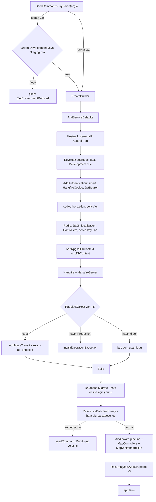
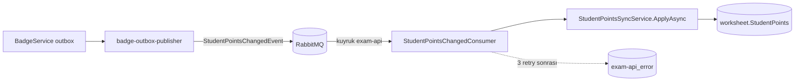

# exam-dotnet-api (`api/ExamApp.Api`)

**Bu dosya neyi anlatır:** Ürünün ana iş API'si olan `api/ExamApp.Api` projesini (Aspire kaynak adı `exam-dotnet-api`, port 5079) devralan geliştirici için anlatır. Konular: dizin yapısı ve katmanlar, `Program.cs` içindeki DI kayıtları ve middleware sırası, kimlik doğrulama ve policy'ler, veritabanı, Redis, MinIO, SignalR, MassTransit consumer'ı, outbox yazımı, Hangfire ve arka plan işleri, i18n, hata yönetimi, rate limiting, controller ve servis envanteri, konfigürasyon anahtarları, testler ve agent hafızaları. Şu konular başka dosyalarda: veri modelinin ayrıntısı [04-veri-modeli.md](../04-veri-modeli.md), Keycloak ve rol modeli [05-kimlik-yetki.md](../05-kimlik-yetki.md), olayların uçtan uca akışı [06-asenkron-akislar.md](../06-asenkron-akislar.md). Ortak sözleşmeler (event'ler, outbox satırı, localization altyapısı) [foundation.md](foundation.md) dosyasında.

## İçindekiler

1. [Özet kart](#1-özet-kart)
2. [Dizin yapısı ve katmanlar](#2-dizin-yapısı-ve-katmanlar)
3. [Program.cs: açılış sırası, DI ve middleware pipeline](#3-programcs-açılış-sırası-di-ve-middleware-pipeline)
4. [Kimlik doğrulama ve yetkilendirme](#4-kimlik-doğrulama-ve-yetkilendirme)
5. [Veritabanı (AppDbContext)](#5-veritabanı-appdbcontext)
6. [Redis](#6-redis)
7. [MinIO](#7-minio)
8. [SignalR: WhiteboardHub](#8-signalr-whiteboardhub)
9. [MassTransit consumer'ı (StudentPointsChangedConsumer)](#9-masstransit-consumerı-studentpointschangedconsumer)
10. [Outbox yazımı](#10-outbox-yazımı)
11. [Arka plan işleri: Hangfire ve HostedService](#11-arka-plan-işleri-hangfire-ve-hostedservice)
12. [Localization / i18n](#12-localization--i18n)
13. [Hata yönetimi](#13-hata-yönetimi)
14. [Rate limiting](#14-rate-limiting)
15. [Controller tablosu](#15-controller-tablosu)
16. [Önemli servis sınıfları](#16-önemli-servis-sınıfları)
17. [Komut modu (seed CLI)](#17-komut-modu-seed-cli)
18. [Konfigürasyon anahtarları](#18-konfigürasyon-anahtarları)
19. [Testler](#19-testler)
20. [Agent hafızaları](#20-agent-hafızaları)
21. [Yeni endpoint nasıl eklenir (kısa reçete)](#21-yeni-endpoint-nasıl-eklenir-kısa-reçete)
22. [Ayrı issue adayları](#ayrı-issue-adayları)
23. [Doğrulanmadı listesi](#doğrulanmadı-listesi)

---

## 1. Özet kart

| Özellik | Değer | Kaynak |
|---|---|---|
| Proje | `api/ExamApp.Api/ExamApp.Api.csproj` (aynı dosya adı `auth-api/ExamApp.Api.csproj` için de kullanılıyor, karıştırmayın) | `ExamApp.slnx:3`, `ExamApp.slnx:10` |
| Framework | .NET 10 (`net10.0`), EF Core 10 + Npgsql, Hangfire 1.8, MassTransit 8.4, Minio 6, StackExchange Redis | `api/ExamApp.Api/ExamApp.Api.csproj:16-40` |
| Proje referansları | `ExamApp.Foundation`, `ExamApp.ServiceDefaults` | `api/ExamApp.Api/ExamApp.Api.csproj:52-53` |
| Port | Kestrel `Kestrel:Port`, varsayılan 5079 (`ListenAnyIP`) | `api/ExamApp.Api/Program.cs:71-76` |
| Aspire kaynağı | `exam-dotnet-api`, 5079'a sabit, `isProxied: false` | `AppHost/AppHost.cs:354-370` |
| docker-compose servisi | `exam-dotnet-api` (`8005` ve `5079` port eşlemesi) | `docker-compose.yml:4-14` |
| Veritabanı | PostgreSQL `worksheet` (Aspire'da `examdb`), bağlantı adı `DefaultConnection` | `AppHost/AppHost.cs:24`, `AppHost/AppHost.cs:385`, `api/ExamApp.Api/Program.cs:377` |
| Swagger | Yalnızca Development | `api/ExamApp.Api/Program.cs:551-555` |
| Hangfire dashboard | `/hangfire` | `api/ExamApp.Api/Program.cs:576-582` |
| SignalR hub | `/hub/whiteboard` | `api/ExamApp.Api/Hubs/WhiteboardHub.cs:52` |
| Sağlık uçları | `MapDefaultEndpoints()` (ServiceDefaults) | `api/ExamApp.Api/Program.cs:586` |
| RabbitMQ kuyruğu | `exam-api` (dead-letter `exam-api_error`) | `api/ExamApp.Api/Program.cs:437` |

Gateway üzerinden dışarı açılan route'lar `Services/Gateway/ocelot*.json` içinde (`exam-dotnet-api:5079`, örn. `Services/Gateway/ocelot.json:9`). Ayrıntı için [gateway.md](gateway.md).

Yerel çalıştırma ve ortam kurulumu için [02-ortam-kurulumu.md](../02-ortam-kurulumu.md) ve [`.claude/rules/local-dev.md`](../../../.claude/rules/local-dev.md).

## 2. Dizin yapısı ve katmanlar

```
api/
├── ExamApp.Api/                 # bu dosyanın konusu
│   ├── Program.cs               # host kurulumu, DI, pipeline, recurring job'lar (615 satır)
│   ├── StartupConfigDump.cs     # Development'ta açılışta konfigürasyonu maskeleyerek basar
│   ├── appsettings.json         # tek appsettings dosyası (appsettings.Development.json yok)
│   ├── Properties/launchSettings.json
│   ├── Controllers/             # 21 dosya: 19 aktif controller + BaseController + yorum satırı GameController
│   ├── Services/                # iş kuralları; alan başına alt klasör (Worksheets, Bookings, AdminUsers ...)
│   │   └── Interfaces/          # eski düz servislerin arayüzleri (IExamService, IQuestionService ...)
│   ├── Data/                    # AppDbContext + entity sınıfları + seed sınıfları
│   ├── Migrations/              # EF Core migration'ları (~199 dosya)
│   ├── Models/
│   │   ├── Dtos/<Alan>/         # request/response DTO'ları (Admin, Bookings, Video, Whiteboard ...)
│   │   └── Constants/           # ConfigConstants, ExamClaimTypes
│   ├── Helpers/                 # middleware, rate limiter'lar, claim dönüştürücü, culture provider'lar, maskeler
│   ├── Hubs/                    # WhiteboardHub (SignalR)
│   ├── Consumers/               # StudentPointsChangedConsumer (MassTransit)
│   ├── Resources/               # <alan>.<dil>.json mesaj sözlüğü + README.md
│   └── .claude/agent-memory/    # yalnızca angular-dev hafızası var (bkz. bölüm 20)
├── ExamApp.Foundation/          # paylaşılan kütüphane, bkz. foundation.md
├── examination.sln, ExamApp.Api/ExamApp.Api.sln   # eski solution dosyaları; kökteki ExamApp.slnx kullanılıyor
└── *.sql, k6-test.js, ExamApp.Api.zip ...          # tarihî yardımcı dosyalar
```

Katmanlar ve sorumlulukları:

| Katman | Klasör | Sorumluluk | Not |
|---|---|---|---|
| HTTP | `Controllers/` | Model binding, yetki attribute'ları, servis çağrısı, HTTP durum eşlemesi | Çoğu controller `BaseController`'dan türer. Bu sınıf `[Authorize]` ve `[UserProfileUnavailableFilter]` taşır (`api/ExamApp.Api/Controllers/BaseController.cs:17-19`). |
| İş kuralı | `Services/` | Domain kuralları, EF sorguları, outbox yazımı, Hangfire işleri | Yeni kod alan klasörüne (`Services/<Alan>/I<X>Service.cs` + implementasyon) yazılıyor. Eski servisler (`ExamService`, `QuestionService`, `StudentService`, `TeacherService` ...) `Services/` kökünde, arayüzleri `Services/Interfaces/` altında. |
| Veri | `Data/` | `AppDbContext`, entity'ler, `BaseEntity` (audit + soft delete) | Ayrıntı için [04-veri-modeli.md](../04-veri-modeli.md). |
| Sözleşme | `Models/Dtos/` | API'nin dış sözleşmesi | Entity doğrudan dönülmez. |
| Yardımcılar | `Helpers/` | `ExceptionHandlingMiddleware`, `KeycloakRoleTransformer`, `*RateLimiting`, culture provider'lar, `SignalRQueryToken`, `CommentBodySanitizer`, `WorksheetAccess` | |
| Gerçek zamanlı | `Hubs/` | `WhiteboardHub` | Durum bellekte tutulur: `Services/Whiteboard/WhiteboardStore.cs`. |
| Mesajlaşma | `Consumers/` | RabbitMQ'dan gelen olayların tüketimi | Şimdilik tek consumer var. |
| i18n | `Resources/` | Client'a dönen bütün metinler | `api/ExamApp.Api/Resources/README.md` |

## 3. Program.cs: açılış sırası, DI ve middleware pipeline

### 3.1 Açılış sırası



| Adım | Referans |
|---|---|
| Komut modu ayrıştırma; komut varsa argümanlar `IConfiguration`'a geçirilmez | `api/ExamApp.Api/Program.cs:30-42` |
| Komut modunda ortam kontrolü ve `--connection` override'ı | `api/ExamApp.Api/Program.cs:44-66` |
| `builder.AddServiceDefaults()` (OpenTelemetry, sağlık, resilience, service discovery) | `api/ExamApp.Api/Program.cs:68`; ayrıntı için [service-defaults-apphost.md](service-defaults-apphost.md) |
| Kestrel portu | `api/ExamApp.Api/Program.cs:71-76` |
| Development'ta maskeli konfigürasyon dökümü | `api/ExamApp.Api/Program.cs:78-81`, maskeleme `api/ExamApp.Api/StartupConfigDump.cs:67-153` |
| Development dışında boş ya da `devOnly` önekli `Keycloak:ClientSecret` / `AdminClientSecret` ile açılmayı reddetme (#238) | `api/ExamApp.Api/Program.cs:91-105` |
| Veritabanı migration'ı (fail-fast) | `api/ExamApp.Api/Program.cs:489-504` |
| İl/ilçe referans seed'i (fail-soft) | `api/ExamApp.Api/Program.cs:508-521` |

> Açılışta `Database.Migrate()` çalıştığı için şema değişikliği uygulama açılırken uygulanır. Bu yol tek instance için tasarlanmış (`api/ExamApp.Api/Program.cs:485`). Migration üretimi için [`.claude/skills/ef-migration/SKILL.md`](../../../.claude/skills/ef-migration/SKILL.md).

### 3.2 DI kayıtları (gruplu)

| Grup | Kayıtlar | Referans |
|---|---|---|
| Kimlik | `KeycloakSettings` options, `IKeycloakService`, `IClaimsTransformation` → `KeycloakRoleTransformer` | `api/ExamApp.Api/Program.cs:85`, `:229-230` |
| Altyapı | `IMinIoService` (singleton), `AddHttpClient`, `AddHttpContextAccessor`, `ImageHelper` | `api/ExamApp.Api/Program.cs:224-231`, `:288` |
| Worksheet/test | `IExamService`, `IWorksheetAssignmentService`, `ITestSessionService`, `IWorksheetAuthoringService`, `IWorksheetDetailService`, `IWorksheetReminderService`, `IWorksheetCalendarService`, `IWorksheetReminderDispatcher`, `IWorksheetAccessRequestService`, `IWorksheetResponsibleTeacherResolver`, `IWorksheetCommentService` | `api/ExamApp.Api/Program.cs:232-243` |
| Booking/video/whiteboard | `IBookingService`, `IRecurringAvailabilityService`, `AddVideoSessions`, `AddWhiteboard` | `api/ExamApp.Api/Program.cs:244-250` |
| Pratik | `IPracticeSessionService`, `DailyQuestionsOptions` (ValidateOnStart), `IDailyQuestionSetService` | `api/ExamApp.Api/Program.cs:251-257` |
| Kullanıcılar | `ILoginEventService`, `IStudentService`, `ILeaderboardService`, `IStudentPointsSyncService`, `ITeacherService`, `IParentService`, `IUserRoleChangeRecorder` | `api/ExamApp.Api/Program.cs:258-261`, `:284-287` |
| Soru bankası | `ISubjectService`, `IBookService`, `IQuestionService`, `IQuestionClassificationService`, `IQuestionQueryService`, `IQuestionOwnershipGuard` | `api/ExamApp.Api/Program.cs:262-267` |
| auth-api istemcisi | `IAuthApiClient` | `api/ExamApp.Api/Program.cs:268` |
| Dashboard | `DashboardOptions` (IANA saat dilimi doğrulaması), `ILocalDayCalendar`, `ITeacherActivityCache` | `api/ExamApp.Api/Program.cs:271-283` |
| Tenancy (okul kapsamı) | `UserProfileCacheService`, `ISchoolContextResolver`, `IUserProfileProvider`, `ISchoolAccessPolicy` | `api/ExamApp.Api/Program.cs:289-292` |
| Program/çalışma | `IProgramService`, `IStudyItemService`, `ITopicStudyLinkService` | `api/ExamApp.Api/Program.cs:293-298` |
| Öğretmen onayı | `IApprovedTeacherGuard`, `AddApprovedTeacherAuthorization()` | `api/ExamApp.Api/Program.cs:295-297` |
| Admin | `GeminiCacheOptions`, `ITaxonomyService`, `ISchoolService`, `AddSchoolSeed`, `AddTeacherSeed`, `ILocationService`, `IClassifierCacheService`, `IDashboardService`, `ITeacherApprovalService`, `TeacherSchoolRequestOptions`, `IAdminUserDirectory`, `IAdmin*Service`'ler, audit servisleri, `AdminDataAccessLogOptions`, `SuspendedTeacherBookingSweepOptions` ve job'ları | `api/ExamApp.Api/Program.cs:301-351` |
| Öğrenci sıfırlama | `IServiceTokenProvider` (singleton), `IBadgeResetApiClient`, `StudentResetJob`, `IStudentResetScheduler` | `api/ExamApp.Api/Program.cs:354-358` |
| Rate limiter'lar | `Add*RateLimiting()` çağrıları | `api/ExamApp.Api/Program.cs:325`, `:336-341`, `:359-367` |
| EF Core | `builder.AddNpgsqlDbContext<AppDbContext>("DefaultConnection")` (Aspire client integration, retry-on-failure açık) | `api/ExamApp.Api/Program.cs:369-377` |
| Hangfire | PostgreSQL storage, şema `hangfire`, kuyruklar `default` ve `question-transfer` | `api/ExamApp.Api/Program.cs:380-396` |
| MassTransit | Bkz. bölüm 9 | `api/ExamApp.Api/Program.cs:405-447` |
| Soru aktarımı | `IQuestionTransferService`, `QuestionTransferJobRunner` | `api/ExamApp.Api/Program.cs:450-451` |
| Request localization | Bkz. bölüm 12 | `api/ExamApp.Api/Program.cs:460-476` |

> Retry-on-failure açık olduğu için elle `BeginTransaction()` açan kod `Database.CreateExecutionStrategy().Execute(...)` içinde çalışmalı (`api/ExamApp.Api/Program.cs:371-376`). Yeni transaction yazarken bu desene uyun.

### 3.3 Middleware pipeline sırası

| Sıra | Middleware | Referans | Not |
|---|---|---|---|
| 1 | `UseSwagger` / `UseSwaggerUI` | `api/ExamApp.Api/Program.cs:551-555` | Yalnızca Development |
| 2 | `ExceptionHandlingMiddleware` | `api/ExamApp.Api/Program.cs:557` | Bkz. bölüm 13 |
| 3 | `UseHttpsRedirection` | `api/ExamApp.Api/Program.cs:558` | Aspire `ASPNETCORE_HTTPS_PORT=""` vererek bu adımı etkisiz bırakıyor (`AppHost/AppHost.cs:371-380`) |
| 4 | `UseAuthentication` | `api/ExamApp.Api/Program.cs:559` | |
| 5 | `UseAuthorization` | `api/ExamApp.Api/Program.cs:560` | |
| 6 | `UseRequestLocalization` | `api/ExamApp.Api/Program.cs:569` | Bilinçli olarak auth'tan **sonra** çalışıyor: kullanıcının kayıtlı dil tercihi claim'e ihtiyaç duyuyor (`api/ExamApp.Api/Program.cs:562-568`) |
| 7 | `UseRateLimiter` | `api/ExamApp.Api/Program.cs:573` | Auth'tan sonra, çünkü partition anahtarı `sub`. Localization'dan sonra, çünkü 429 metni çevriliyor. |
| 8 | `UseHangfireDashboard("/hangfire")` | `api/ExamApp.Api/Program.cs:576-582` | Development'ta `HangfireDashboardDevAuthFilter`, diğer ortamlarda async `HangfireDashboardAuthFilter` |
| 9 | `MapControllers` | `api/ExamApp.Api/Program.cs:584` | |
| 10 | `MapWhiteboardHub` | `api/ExamApp.Api/Program.cs:585` | |
| 11 | `MapDefaultEndpoints` | `api/ExamApp.Api/Program.cs:586` | ServiceDefaults sağlık uçları |

`UseRouting`, `UseCors` ve `UseExceptionHandler` çağrılmıyor. CORS gateway tarafında çözülüyor; ayrıntı için [gateway.md](gateway.md).

## 4. Kimlik doğrulama ve yetkilendirme

Keycloak realm'i, client'lar ve rol modeli [05-kimlik-yetki.md](../05-kimlik-yetki.md) dosyasında. Burada yalnızca API tarafındaki kurulum var.

### 4.1 Şemalar

| Şema | Ne zaman | Referans |
|---|---|---|
| `smart` (policy scheme, varsayılan) | Yol `/hangfire` ile başlıyorsa `HangfireCookie`, diğer bütün isteklerde `JwtBearer` | `api/ExamApp.Api/Program.cs:107-118` |
| `HangfireCookie` | `examapp_hangfire` adlı HttpOnly cookie, path `/hangfire`, 30 dk sliding | `api/ExamApp.Api/Program.cs:119-128` |
| `JwtBearer` | Keycloak access token | `api/ExamApp.Api/Program.cs:129-168` |

JWT ayarları:

- `Authority` ve `ValidIssuer` = `{Server:BaseUrl}/realms/{Keycloak:Realm}`. Token'daki issuer, tarayıcının gördüğü gateway adresidir (`api/ExamApp.Api/Program.cs:131`, `:143`).
- `MetadataAddress` = `{Keycloak:Host}/realms/{Keycloak:Realm}/.well-known/openid-configuration`. Anahtarlar Keycloak'ın iç adresinden çekilir (`api/ExamApp.Api/Program.cs:132`). Aspire'da `Server__BaseUrl` gateway'in public URL'sine, `Keycloak__Host` Keycloak'ın iç endpoint'ine bağlanır (`AppHost/AppHost.cs:690-695`). Bu iki adres karıştırılırsa ağ sorunuyla ilgisiz görünen JWT hataları çıkar (`AppHost/AppHost.cs:684-685`).
- `ValidAudiences` = `Keycloak:ValidAudiences`, yoksa `["account"]` (`api/ExamApp.Api/Program.cs:137-138`).
- `RequireHttpsMetadata = false`, `SaveToken = true`. `AuthApiClient`, SignalR isteklerinde token'ı buradan alıp auth-api'ye iletir (`api/ExamApp.Api/Program.cs:147-150`).
- `OnMessageReceived`: yalnızca `/hub/whiteboard` yolunda ve `Authorization` header'ı yokken `?access_token=` kabul edilir (`api/ExamApp.Api/Program.cs:159-166`, `api/ExamApp.Api/Helpers/SignalRQueryToken.cs`).

Rol claim'leri: `KeycloakRoleTransformer`, `realm_access.roles` dizisini `ClaimTypes.Role` claim'lerine çevirir. `[Authorize(Roles=...)]` bunun sayesinde çalışır (`api/ExamApp.Api/Helpers/KeycloakRoleTransformer.cs:14-41`).

### 4.2 Policy'ler

| Policy adı | Kural | Tanım |
|---|---|---|
| `ServiceToService` | `ServicePrincipal.IsService(user, Keycloak:ServiceClients)` | `api/ExamApp.Api/Program.cs:173-175` |
| `TeacherOrService` | `Teacher` rolü veya servis hesabı | `api/ExamApp.Api/Program.cs:177-180` |
| `TeacherAdminOrService` | `Teacher`, `Admin` veya servis hesabı (soru görseli/sınıflandırma) | `api/ExamApp.Api/Services/Questions/QuestionOwnershipGuard.cs:21-24` |
| `AdminOrService` | `Admin` veya servis hesabı (classifier-cache işaretçisi) | `api/ExamApp.Api/Services/Questions/QuestionOwnershipGuard.cs:26-28` |
| `ApprovedTeacher` (`ApprovedTeacherPolicies.TeacherCapability`) | Çağıran `Teacher` rolündeyse öğretmen hesabı **onaylı** olmalı. `Admin`/`SuperAdmin`, servis hesabı ve Teacher rolü olmayanlar muaf. | `api/ExamApp.Api/Services/Teachers/Authorization/ApprovedTeacherAuthorization.cs:28`, `api/ExamApp.Api/Services/Teachers/Authorization/ApprovedTeacherAuthorizationServiceCollectionExtensions.cs:16-18` |
| `ApprovedTeacherOrStudent` (`TeacherOrStudentCapability`) | Davranış `ApprovedTeacher` ile aynı. Hem Teacher hem Student rolü olan onaysız öğretmen de takılır (security review L4). Ad yalnızca belgeleme amaçlı. | `api/ExamApp.Api/Services/Teachers/Authorization/ApprovedTeacherAuthorization.cs:30-36`, `api/ExamApp.Api/Services/Teachers/Authorization/ApprovedTeacherAuthorizationServiceCollectionExtensions.cs:20-23` |

`ApprovedTeacher` handler'ı: `ApprovedTeacherAuthorizationHandler` profili `IUserProfileProvider` ile yükler, onayı `IApprovedTeacherGuard.CheckAsync` ile kontrol eder (`api/ExamApp.Api/Services/Teachers/Authorization/ApprovedTeacherAuthorization.cs:64-131`). Onaysız öğretmen için `ApprovedTeacherAuthorizationResultHandler` 403 ile `TeacherNotApproved` gövdesi döner (`api/ExamApp.Api/Services/Teachers/Authorization/ApprovedTeacherAuthorizationResultHandler.cs:27`).

> **Önemli desen (issue #287 review H1):** `ApprovedTeacher*` policy'leri tek başına **rol kapısı değil**. Teacher rolü olmayan herkes bu policy'den geçer. Bu yüzden uçlarda policy'nin yanına her zaman bir `[Authorize(Roles = "...")]` de konur. İkisi AND olarak değerlendirilir (örn. `api/ExamApp.Api/Controllers/ExamController.cs:186-187`).

Servis hesabı kararı: `ServicePrincipal.IsService` önce `exam-service` realm rolüne, sonra `azp`/`client_id` claim'inin `Keycloak:ServiceClients` içinde olup olmadığına (yoksa `exam-admin` varsayılır), en son eski `preferred_username` eşleşmesine bakar. Ayrıntı için [foundation.md](foundation.md#security).

`BaseController` ayrıca şunları sağlar: `KeyCloakId` (`sub`), `IsServiceAccount`, `IsAdmin`, `GetAuthenticatedUserAsync()`. Servis hesabı için sahte bir `Role = "Service"` profili döner. Kullanıcı token'larında profil sağlayıcısı hata verirse istek fail-closed şekilde 503'e düşer, sahte profil üretilmez (`api/ExamApp.Api/Controllers/BaseController.cs:17-60`).

Hangfire dashboard yetkisi:

- Production: `HangfireDashboardAuthFilter`. Admin veya SuperAdmin girer. Teacher ancak onaylı öğretmen hesabıyla girer. Hata olursa erişim kapalı kalır (`api/ExamApp.Api/Services/QuestionTransfer/HangfireDashboardAuthFilter.cs:14-50`).
- Development: kimliği doğrulanmış her kullanıcı girer (`api/ExamApp.Api/Services/QuestionTransfer/HangfireDashboardDevAuthFilter.cs:9-15`).
- Tarayıcıda dashboard'a girmek için önce `POST /api/question-transfer/hangfire/login` ile `HangfireCookie` oluşturulur (`api/ExamApp.Api/Controllers/QuestionTransferController.cs:349-365`).

## 5. Veritabanı (AppDbContext)

- **Tek DbContext:** `ExamApp.Api.Data.AppDbContext` (`api/ExamApp.Api/Data/AppDbContext.cs:8`). Veritabanı `worksheet`. Aspire'da `examdb` kaynağına bağlanır (`AppHost/AppHost.cs:24`). Hangfire aynı bağlantıyı `hangfire` şemasıyla kullanır (`api/ExamApp.Api/Program.cs:380-390`).
- **Entity klasörü:** `api/ExamApp.Api/Data/` (entity'ler, `BaseEntity`, `ISchoolScoped`, seed sınıfları). Migration'lar `api/ExamApp.Api/Migrations/` altında.
- **Audit ve soft delete:** `SaveChanges` / `SaveChangesAsync` override'ları `ApplyAuditInfo()` çağırır. Bu metot `BaseEntity` için Create/Update/Delete zaman ve kullanıcı alanlarını doldurur. `Deleted` durumunu `Modified + IsDeleted = true` durumuna çevirir (`api/ExamApp.Api/Data/AppDbContext.cs:20-56`). Kullanıcı kimliği `SetCurrentUser(int)` ile verilir (`api/ExamApp.Api/Data/AppDbContext.cs:15-18`). Bunu servisler çağırır, örn. `api/ExamApp.Api/Services/Bookings/BookingService.cs:153`. `BaseEntity`'den türeyen her entity'ye `!IsDeleted` global query filter'ı eklenir (`api/ExamApp.Api/Data/AppDbContext.cs:828-851`).
  - Tuzak (agent hafızası): `SaveChanges(bool acceptAllChangesOnSuccess)` overload'u override edilmediği için audit'i atlar (`savechanges-bool-overload-skips-audit.md`).
- **Outbox tablosu:** `DbSet<OutboxMessage> OutboxMessages` (`api/ExamApp.Api/Data/AppDbContext.cs:88`). Tip Foundation'dan geliyor. Okuyup yayınlayan servis `exam-outbox-publisher` ([outbox-publisher.md](outbox-publisher.md)).

DbSet'lerin kısa listesi (`api/ExamApp.Api/Data/AppDbContext.cs:57-141`). Ayrıntı, ilişkiler ve ER diyagramı için [04-veri-modeli.md](../04-veri-modeli.md):

| Alan | DbSet'ler |
|---|---|
| Kullanıcılar | `Students`, `Teachers`, `Parents`, `LoginEvents` |
| Okul/konum | `Schools`, `Provinces`, `Districts` |
| Taksonomi | `Grades`, `Subjects`, `GradeSubjects`, `TeacherSubjects`, `Topics`, `SubTopics`, `LearningOutcomes`, `LearningOutcomeDetails`, `ClassifierCacheConfigs` |
| Soru bankası | `Questions`, `Answers`, `Passage`, `QuestionSubTopics`, `Books`, `BookTests` |
| Worksheet/test | `Worksheets`, `TestQuestions`, `TestInstances`, `TestInstanceQuestions`, `TestPrototypes`, `TestPrototypeDetail`, `WorksheetAssignments`, `WorksheetReminders`, `WorksheetAccessRequests`, `WorksheetAccessGrants`, `WorksheetComments`, `WorksheetCommentReports` |
| Pratik | `PracticeSessions`, `PracticeSessionQuestions`, `DailyQuestionSets`, `DailyQuestionSetItems` |
| Oyunlaştırma (eski) | `StudentPoints`, `StudentPointHistories`, `Rewards`, `StudentRewards`, `Leaderboards`, `SpecialEvents`, `StudentSpecialEvents`, `StudentBadges` |
| Program/çalışma | `ProgramSteps`, `ProgramStepOptions`, `ProgramStepActions`, `UserPrograms`, `UserProgramSchedules`, `UserProgramStudyPageSchedules`, `StudyItems`, `StudyItemImages`, `TopicStudyLinks`, `TopicStudyLinkAudits` |
| Booking | `TeacherAvailabilitySlots`, `Bookings`, `RecurringAvailabilityRules` |
| Soru aktarımı | `QuestionTransferJobs`, `QuestionTransferImportMaps`, `QuestionTransferExportBundles`, `QuestionTransferExportMaps` |
| Admin audit | `AdminDataAccessLogs`, `AdminUserActionLogs` |
| Outbox | `OutboxMessages` |

> Yeni geliştiriciyi şaşırtabilecek isimler: `WorksheetQuestion`, `TestQuestions` DbSet'iyle; `WorksheetInstance`, `TestInstances` DbSet'iyle eşleniyor. Kodda "test" ve "worksheet" aynı kavram için kullanılıyor.

## 6. Redis

| Kullanım | Ayrıntı | Referans |
|---|---|---|
| `IDistributedCache` | `AddStackExchangeRedisCache`, `Redis:Configuration` ve `Redis:InstanceName` | `api/ExamApp.Api/Program.cs:187-193` |
| Tek multiplexer | `IRedisConnectionProvider` hem cache hem rate limit sayacı için ortak bağlantı | `api/ExamApp.Api/Program.cs:195-198`, `api/ExamApp.Api/Helpers/RedisConnectionProvider.cs:23-40` |
| Kullanıcı profil önbelleği | `UserProfileCacheService`: anahtar Keycloak `sub`, varsayılan 1 saat mutlak süre | `api/ExamApp.Api/Services/UserProfileCacheService.cs:6-33` |
| Dil tercihi | `UserPreferredLocaleCultureProvider` **yalnızca** bu önbelleğe bakar; cache miss'te auth-api'ye gitmez | `api/ExamApp.Api/Helpers/UserPreferredLocaleCultureProvider.cs` |
| Dağıtık rate limit sayacı | `RedisFixedWindowCounterStore` (fail-open, timeout `RateLimiting:AdminUserList:StoreTimeoutMilliseconds`). `Redis:Configuration` boşsa süreç içi `InMemoryFixedWindowCounterStore` kullanılır. | `api/ExamApp.Api/Helpers/FixedWindowCounterStore.cs:43-132`, `api/ExamApp.Api/Helpers/AdminUserListRateLimiting.cs:83-99` |
| Profil önbelleğinin geçersiz kılınması | Okul değişikliğinden sonra gecikmeli ikinci silme Hangfire ile yapılır | `api/ExamApp.Api/Services/AdminUsers/AdminSchoolMembershipSync.cs:94` |

Aspire `Redis__Configuration`'ı Redis kaynağının connection string'ine bağlar (`AppHost/AppHost.cs:392`). docker-compose'da parola `.env` içindeki `REDIS_PASSWORD` anahtarından gelir (`docker-compose.yml:24`).

## 7. MinIO

- `MinIoService` (singleton, `IMinIoService`) `MinioConfig` bölümünü okur (`api/ExamApp.Api/Services/MinIOService.cs:19-30`).
- `UploadFileAsync(stream, fileName, bucketName?, contentType?)` bucket yoksa oluşturur ve **anonim okuma (`s3:GetObject`) policy'si** uygular. Görseller gateway'in `/img/*` route'u üzerinden imzasız URL ile sunulur. Dönen değer `/img/{bucket}/{object}` biçiminde (`api/ExamApp.Api/Services/MinIOService.cs:104-170`). Gateway route'u: `Services/Gateway/ocelot.json:270-283` (downstream `minio:9000`).
- `GetFileStreamAsync(fileUrl)` ve `DeleteFileByUrlAsync(fileUrl)` URL'den bucket ve nesne adını çıkarır (`api/ExamApp.Api/Services/MinIOService.cs:39-100`).

Kullanılan bucket'lar:

| Bucket | Yazan | Referans |
|---|---|---|
| `MinioConfig:BucketName` (varsayılan `exam-questions`) | Soru, şık ve paragraf görselleri; soru aktarımı import/export zip ve json dosyaları | `api/ExamApp.Api/Services/QuestionService.cs:87`, `api/ExamApp.Api/Services/QuestionTransfer/QuestionTransferJobRunner.cs:261-268`, `:400`, `api/ExamApp.Api/Controllers/QuestionTransferController.cs:94-97` |
| `study-pages` | Çalışma sayfası görselleri | `api/ExamApp.Api/Services/StudyItemService.cs:551`, `api/ExamApp.Api/Services/QuestionService.cs:396` |
| `worksheets` | Worksheet arka plan görseli | `api/ExamApp.Api/Services/Worksheets/WorksheetAuthoringService.cs:129` |
| `exams` | Worksheet kapak görseli | `api/ExamApp.Api/Services/Worksheets/WorksheetAuthoringService.cs:354` |
| `student-avatars` | Öğrenci avatarı | `api/ExamApp.Api/Controllers/StudentController.cs:158` |

Aspire `MinioConfig__AccessKey`, `MinioConfig__SecretKey` ve `MinioConfig__Endpoint` değerlerini MinIO kaynağından enjekte eder (`AppHost/AppHost.cs:393-399`). docker-compose'da bu değerler `.env` içindeki `MINIO_ROOT_USER` ve `MINIO_ROOT_PASSWORD` anahtarlarından gelir (`docker-compose.yml:18-19`).

## 8. SignalR: WhiteboardHub

- Hub sınıfı `WhiteboardHub : Hub<IWhiteboardClient>`, yol `/hub/whiteboard` (`api/ExamApp.Api/Hubs/WhiteboardHub.cs:48-52`).
- Yetki: `[Authorize(Roles = "Teacher,Student")]` ve `ApprovedTeacherOrStudent` (`api/ExamApp.Api/Hubs/WhiteboardHub.cs:48-49`).
- Metotlar: `JoinBoard(bookingId)`, `SendElements(bookingId, elements)`, `SendPointer(bookingId, pointer)`, `LeaveBoard(bookingId)`, `OnDisconnectedAsync` (`api/ExamApp.Api/Hubs/WhiteboardHub.cs:83`, `:136`, `:162`, `:180`, `:191`).
- Kayıt: `AddWhiteboard()`. Bu metot `WhiteboardOptions`'ı doğrular, yalnızca bu hub için `MaximumReceiveMessageSize` ayarlar, `EnableDetailedErrors = false` yapar ve `IWhiteboardStore`, `IWhiteboardSessionCloser` (singleton), `IWhiteboardAccessService` (scoped) ile `WhiteboardCleanupService` (HostedService) kayıtlarını ekler (`api/ExamApp.Api/Services/Whiteboard/WhiteboardServiceCollectionExtensions.cs:19-45`).
  - Tuzak: `AddHubOptions<WhiteboardHub>` çağrılmazsa hub'a özel ayarlar yok sayılır ve global 32 KB sınırı kullanılır (`api/ExamApp.Api/Services/Whiteboard/WhiteboardServiceCollectionExtensions.cs:27-31`; agent hafızası `signalr-per-hub-options-gotcha.md`).
- Map: `MapWhiteboardHub()`. Transport varsayılan olarak yalnızca WebSockets (`Whiteboard:AllowedTransports`), `CloseOnAuthenticationExpiration = true` (`api/ExamApp.Api/Services/Whiteboard/WhiteboardServiceCollectionExtensions.cs:54-62`). Gateway `/negotiate` yolunu eşlemediği için istemci `skipNegotiation` ile bağlanır.
- Durum bellekte tutulur, kalıcı değildir (`api/ExamApp.Api/Services/Whiteboard/WhiteboardStore.cs:118`). Bu yüzden API'yi birden fazla replica ile çalıştırmak sahneyi böler. Bkz. [Doğrulanmadı listesi](#doğrulanmadı-listesi).

Uçtan uca whiteboard akışı için [07-uctan-uca-akislar.md](../07-uctan-uca-akislar.md). Açık güvenlik takibi #311.

## 9. MassTransit consumer'ı (StudentPointsChangedConsumer)



- Kurulum: `RabbitMQ:Host` doluysa `AddMassTransit` ile consumer ve definition kaydedilir. `exam-api` receive endpoint'i açılır, `PublishFaults = false` (least privilege, #279) (`api/ExamApp.Api/Program.cs:416-447`).
- `RabbitMQ:Host` yoksa: Production'da açılış hata verir. Diğer ortamlarda bus kurulmaz ve uyarı loglanır (`api/ExamApp.Api/Program.cs:405-411`, `:588-592`). Host tanımlı olup kullanıcı adı veya parola eksikse açılış hata verir (`api/ExamApp.Api/Program.cs:418-423`).
- Consumer (`api/ExamApp.Api/Consumers/StudentPointsChangedConsumer.cs:24-69`):
  - `TotalPoints > StudentPoints:Sync:MaxTotalPoints` (varsayılan 10.000.000, `api/ExamApp.Api/Services/StudentPoints/StudentPointsSyncService.cs:31`) olan mesajlar uyarı loglanarak ack'lenir, yani atılır (`:46-52`).
  - Normal yolda `IStudentPointsSyncService.ApplyAsync` çağrılır. Bu metot versiyonlu (`EventVersion.Normalize`) koşullu bir upsert yapar ve idempotent'tir (`api/ExamApp.Api/Services/StudentPoints/StudentPointsSyncService.cs:57-71`).
  - Beklenmeyen hatada exception yeniden fırlatılır.
- Retry: `StudentPointsChangedConsumerDefinition`, 1 sn, 5 sn ve 15 sn aralıklı 3 deneme. Sonrasında mesaj `exam-api_error` kuyruğuna gider (`api/ExamApp.Api/Consumers/StudentPointsChangedConsumer.cs:75-85`).
- Aspire'da kullanıcı `exam_api`, parola `rabbitmq-exam-api-password` parametresinden gelir. İzinler `rabbitmq/definitions.json` içinde (`AppHost/AppHost.cs:59-60`, `:418-426`).

Liderlik tablosu bu tabloyu okur (`LeaderboardService`, `GET /api/leaderboard`). Olayın üretici tarafı [badge-service.md](badge-service.md) ve [06-asenkron-akislar.md](../06-asenkron-akislar.md) dosyalarında.

## 10. Outbox yazımı

API RabbitMQ'ya **doğrudan publish etmez**. Olaylar iş verisiyle aynı transaction içinde `OutboxMessages` tablosuna yazılır. `exam-outbox-publisher` bu satırları okuyup yayınlar. Satır biçimi:

```csharp
_context.OutboxMessages.Add(new OutboxMessage
{
    Type = OutboxEventRegistry.NameFor<TEvent>(),  // FullName; registry'de olmayan tip yayınlanamaz
    Content = JsonSerializer.Serialize(evt),
    ...
});
await _context.SaveChangesAsync(ct);               // iş verisiyle aynı SaveChanges
```

Exam API'nin yazdığı olaylar ve yazma noktaları:

| Event | Yazan yer |
|---|---|
| `AnswerSubmittedEvent` | `api/ExamApp.Api/Services/Worksheets/TestSessionService.cs:492-499`, `api/ExamApp.Api/Services/Practice/PracticeSessionService.cs:449`, `:548-551` |
| `QuestionCreatedEvent` | `api/ExamApp.Api/Services/QuestionService.cs:326-332`, `:826-832` |
| `WorksheetReminderDueEvent` | `api/ExamApp.Api/Services/Worksheets/IWorksheetReminderDispatcher.cs:75-77` (Hangfire job'ı içinde) |
| `WorksheetAccessRequestedEvent` | `api/ExamApp.Api/Services/Worksheets/WorksheetAccessRequestService.cs:152-154` |
| `WorksheetAccessRequestApprovedEvent` / `...RejectedEvent` | `api/ExamApp.Api/Services/Worksheets/WorksheetAccessRequestService.cs:380-382` (generic yardımcı) |
| `WorksheetCommentCreatedEvent` / `WorksheetCommentRepliedEvent` | `api/ExamApp.Api/Services/Worksheets/WorksheetCommentService.cs:1072` civarı (tip seçimi) |
| `WorksheetCommentHiddenEvent` | `api/ExamApp.Api/Services/Worksheets/WorksheetCommentService.cs:598-600` |
| `TeacherApplicationSubmittedEvent` | `api/ExamApp.Api/Services/TeacherService.cs:490-492` |
| `IndependentTeacherRegisteredEvent` | `api/ExamApp.Api/Services/TeacherService.cs:377-379` |
| `TeacherSchoolRequestSubmittedEvent` | `api/ExamApp.Api/Services/TeacherService.cs:394-396` |
| `TeacherApplicationDecidedEvent` | `api/ExamApp.Api/Services/TeacherApprovals/TeacherApprovalService.cs:460-462` |
| `BookingRequestCreatedEvent` | `api/ExamApp.Api/Services/Bookings/BookingService.cs:548-550` |
| `BookingDecisionEvent` | `api/ExamApp.Api/Services/Bookings/BookingService.cs:800-802`, `api/ExamApp.Api/Services/Bookings/TeacherUnavailableBookingRejection.cs:98-100` |
| `BookingTeacherUnavailableEvent` (ve askıda `BookingDecisionEvent`) | `api/ExamApp.Api/Services/AdminUsers/AdminTeacherSuspensionService.cs:314-316` (generic yardımcı) |
| `UserRoleChangedEvent` | `api/ExamApp.Api/Helpers/UserRoleChangeOutbox.cs:38`; çağıranlar `api/ExamApp.Api/Services/UserRoles/UserRoleChangeRecorder.cs:33`, `api/ExamApp.Api/Services/Parents/ParentService.cs:32` |

`LoginAttemptedEvent` ve `UserPreferredLocaleChangedEvent` auth-api'de, `StudentPointsChangedEvent` BadgeService'te üretilir. Kim tükettiği ve izin matrisi [06-asenkron-akislar.md](../06-asenkron-akislar.md) dosyasında. Yeni olay eklemek için [`.claude/skills/outbox-event/SKILL.md`](../../../.claude/skills/outbox-event/SKILL.md).

## 11. Arka plan işleri: Hangfire ve HostedService

Hangfire sunucusu API sürecinin içinde çalışır. Kuyruklar `default` ve `question-transfer` (`api/ExamApp.Api/Program.cs:393-396`).

**Recurring job'lar** (`Program.cs` sonunda kaydedilir):

| Job id | Hedef | Cron anahtarı (varsayılan) | Referans |
|---|---|---|---|
| `classifier-cache-reconcile` | `IClassifierCacheService.RefreshIfStaleAsync(0)`: Gemini sınıflandırıcı önbelleğini taksonomiyle karşılaştırır | `Classifier:ReconcileCron` (`0 * * * *`) | `api/ExamApp.Api/Program.cs:596-599` |
| `AdminDataAccessLogRetentionJob.RecurringJobId` | KVKK saklama süresi dolan admin erişim kayıtlarını parti parti siler | `AdminDataAccessLog:Cron` (`30 3 * * *`) | `api/ExamApp.Api/Program.cs:602-605` |
| `SuspendedTeacherBookingSweepJob.RecurringJobId` | Askıdaki öğretmende kalmış `Pending` talepleri kapatır (#331) | `SuspendedTeacherBookingSweep:Cron` (`*/5 * * * *`) | `api/ExamApp.Api/Program.cs:608-611` |

**Tek seferlik / zamanlanmış job'lar:**

| İş | Tetikleyen | Referans |
|---|---|---|
| Soru aktarımı export/import (`question-transfer` kuyruğu) | `QuestionTransferService` | `api/ExamApp.Api/Services/QuestionTransfer/QuestionTransferService.cs:83`, `:106`, `api/ExamApp.Api/Services/QuestionTransfer/QuestionTransferJobRunner.cs:37-68` |
| Worksheet hatırlatıcısı (`WorksheetReminderDueEvent` outbox'a yazılır) | `WorksheetReminderService` → `IWorksheetReminderDispatcher` | `api/ExamApp.Api/Services/Worksheets/WorksheetReminderService.cs:76`, `api/ExamApp.Api/Services/Worksheets/IWorksheetReminderDispatcher.cs:41` |
| Öğrenci aktivite sıfırlama (BadgeService'e servis token'ıyla HTTP çağrısı) | `StudentResetScheduler` → `StudentResetJob` | `api/ExamApp.Api/Services/StudentReset/StudentResetScheduler.cs:104` |
| Taksonomi değişince sınıflandırıcı önbelleğini yenileme | `TaxonomyService` | `api/ExamApp.Api/Services/Taxonomy/TaxonomyService.cs:460` |
| Okul değişikliği sonrası profil önbelleğini ikinci kez silme | `AdminSchoolMembershipSync` | `api/ExamApp.Api/Services/AdminUsers/AdminSchoolMembershipSync.cs:94` |

**HostedService'ler:**

| Sınıf | Görev | Referans |
|---|---|---|
| `WhiteboardCleanupService` (`BackgroundService`) | Bellek içi tahta durumunu periyodik temizler (`Whiteboard:SweepIntervalSeconds`, varsayılan 60) | `api/ExamApp.Api/Services/Whiteboard/WhiteboardCleanupService.cs:19`, `api/ExamApp.Api/Services/Whiteboard/WhiteboardOptions.cs:67` |
| `JsonLocalizationStartupValidator` (Foundation) | Mesaj sözlüğünü açılışta yükler; hatalı veya çift anahtar varsa açılış durur | `api/ExamApp.Foundation/Localization/JsonLocalizationServiceCollectionExtensions.cs:55-82` |
| Hangfire server, MassTransit bus | Framework tarafından eklenir | `api/ExamApp.Api/Program.cs:393`, `:425` |

## 12. Localization / i18n

Genel i18n kuralları için [`docs/i18n-migration.md`](../../i18n-migration.md) ve [`api/ExamApp.Api/Resources/README.md`](../../../api/ExamApp.Api/Resources/README.md). Altyapı Foundation'dadır ([foundation.md](foundation.md#localization)).

- `AddJsonLocalization(options => options.ResourcesPath = "Resources")`. `Resources/<alan>.<dil>.json` dosyaları dil başına tek bir sözlükte birleştirilir. Aynı anahtar iki dosyada geçerse açılış hata verir (`api/ExamApp.Api/Program.cs:204-209`).
- Kullanım: `IStringLocalizer<Messages>` enjekte edilir, `localizer["questions.notFound"]` şeklinde çağrılır. DataAnnotations hata mesajları da aynı sözlükten gelir: DTO'daki `ErrorMessage` alanına çeviri anahtarı yazılır (`api/ExamApp.Api/Program.cs:216-221`).
- Mevcut alanlar (her biri `tr` ve `en`): `admin`, `auth`, `booking`, `classifier`, `common`, `exam`, `loginEvents`, `practice`, `program`, `questions`, `school`, `student`, `study`, `studyLinks`, `taxonomy`, `teacher`, `worksheets` (`api/ExamApp.Api/Resources/`).
- İstek kültürü sırası: (1) `NormalizedAcceptLanguageCultureProvider`, (2) `UserPreferredLocaleCultureProvider` (Redis profil önbelleği), (3) varsayılan `tr-TR`. Desteklenen diller `SupportedLocales`'tan gelir (`api/ExamApp.Api/Program.cs:453-476`).
- `GET /api/auth/culture` seçilen kültürü ve kaynağını (`header` / `profile` / `default`) döner (`api/ExamApp.Api/Controllers/AuthController.cs:145-147`).
- Servis ctor'larındaki `IStringLocalizer<Messages>? localizer = null` parametresi DI dışında (birim testlerde) `FallbackMessageLocalizer.Instance`'a düşer (örn. `api/ExamApp.Api/Controllers/LoginEventsController.cs:30-35`).
- Bütünlük testi: `tests/ExamApp.Api.Tests/Localization/ResourcesIntegrityTests.cs`.

## 13. Hata yönetimi

- `ExceptionHandlingMiddleware` yalnızca `UnauthorizedAccessException` yakalar ve bunu **403** + `{ message }` olarak döner. Servis katmanında bu exception sahiplik veya erişim ihlali anlamında kullanılır. 401 dönülseydi UI'ın refresh ve logout akışı tetiklenirdi (#255) (`api/ExamApp.Api/Helpers/ExceptionHandlingMiddleware.cs:16-23`). Diğer exception'lar yeniden fırlatılır (`:24-27`) ve ASP.NET Core'un varsayılan 500 davranışına kalır. Global `ProblemDetails` / `UseExceptionHandler` yok.
- Controller deseni: servisler `KeyNotFoundException`, `InvalidOperationException` veya alan özelinde sonuç tipleri döner. Controller bunları `NotFound`, `BadRequest`, `Forbid` olarak eşler ve metni sözlükten alır. Durum eşleme testleri `tests/ExamApp.Api.Tests/Controllers/ControllerAuthStatusMappingTests.cs` içinde.
- `UserProfileUnavailableFilter`: profil sağlayıcısı (auth-api) hata verirse istek fail-closed 503 döner (`api/ExamApp.Api/Controllers/BaseController.cs:18`, `api/ExamApp.Api/Helpers/UserProfileUnavailable.cs`).
- `DbUpdateExceptionClassifier`: unique/FK ihlallerini ayırt eden yardımcı (`api/ExamApp.Api/Helpers/DbUpdateExceptionClassifier.cs`).
- Rate limit reddi: 429 + `Retry-After` + çevrilmiş mesaj (bkz. bölüm 14).

## 14. Rate limiting

ASP.NET Core rate limiter yalnızca `[EnableRateLimiting(...)]` taşıyan uçlarda devrededir. Ortak ayarlar (`RejectionStatusCode = 429`, jenerik `OnRejected`) `AddAdminUserListRateLimiting` içinde kurulur (`api/ExamApp.Api/Helpers/AdminUserListRateLimiting.cs:101-109`). Partition anahtarı kullanıcının `sub` claim'idir.

| Policy | Helper | Sayaç | Config bölümü (appsettings varsayılanı) | Kullanıldığı uç |
|---|---|---|---|---|
| `admin-user-list` | `Helpers/AdminUserListRateLimiting.cs:71` | Dağıtık (Redis) | `RateLimiting:AdminUserList` (30 / 60 sn) | `GET /api/admin/teacher-applications`, `teacher-applications/{id}`, `teachers`, `students` (`api/ExamApp.Api/Controllers/AdminController.cs:186`, `:213`, `:270`, `:300`) |
| `admin-password-reset` | `Helpers/AdminPasswordResetRateLimiting.cs:37` | Süreç içi | `RateLimiting:AdminPasswordReset` (10 / 60) | Admin şifre sıfırlama |
| `admin-account-status` | `Helpers/AdminAccountStatusRateLimiting.cs:38` | Süreç içi | `RateLimiting:AdminAccountStatus` (20 / 60) | Hesap durumu, öğretmen askıya alma |
| `admin-student-school` | `Helpers/AdminStudentSchoolRateLimiting.cs:36` | Süreç içi | `RateLimiting:AdminStudentSchool` (20 / 60) | Öğrenci ve öğretmen okul değişikliği |
| `StudentSelfResetRateLimiting.Policy` | `Helpers/StudentSelfResetRateLimiting.cs` | Süreç içi | `RateLimiting:StudentSelfReset` (1 / 3600) | `POST /api/student/me/reset` (`api/ExamApp.Api/Controllers/StudentController.cs:93`) |
| `StudyLinkWriteRateLimiting.Policy` | `Helpers/StudyLinkWriteRateLimiting.cs` | Süreç içi | `RateLimiting:StudyLinkWrite` (30 / 60) | Çalışma linki yazma uçları |
| `TeacherActivityRateLimiting.Policy` | `Helpers/TeacherActivityRateLimiting.cs` | Dağıtık | `RateLimiting:TeacherActivity` (60 / 60) | `GET /api/teacher/own-activity-summary`, `students-activity-summary` |
| `WorksheetCommentWriteRateLimiting.Policy` | `Helpers/WorksheetCommentWriteRateLimiting.cs` | Dağıtık | `RateLimiting:WorksheetCommentWrite` (10 / 60) | Yorum yazma, raporlama, gizleme |
| `WorksheetCommentReadRateLimiting.Policy` | `Helpers/WorksheetCommentReadRateLimiting.cs` | Dağıtık | `RateLimiting:WorksheetCommentRead` (60 / 60) | Yorum okuma |
| `daily-questions` | `Helpers/DailyQuestionsRateLimiting.cs:39` | Dağıtık | `RateLimiting:DailyQuestions` (appsettings'te yok; kod varsayılanı 30 / 60, `:26-29`) | `GET /api/practice/daily`, `POST /api/practice/daily/start` |

"Dağıtık" olanlar `IFixedWindowCounterStore` kullanır. Redis'e ulaşılamazsa istekler geçirilir (fail-open). "Süreç içi" olanlar replica başına sayar.

## 15. Controller tablosu

Notlar:

- "Base" sütunu `BaseController` mı, `ControllerBase` mi olduğunu gösterir. `BaseController`'dan türeyenlerde sınıf düzeyinde `[Authorize]` vardır; attribute'u olmayan uçlar da kimlik doğrulama ister.
- `[controller]` route'ları ASP.NET Core'da büyük/küçük harf duyarsızdır: `api/Student` ile `api/student` aynı route'tur.
- "AT" = `ApprovedTeacher`, "ATS" = `ApprovedTeacherOrStudent` policy'si.

| Dosya | Route prefix | Base | Ana endpoint'ler | Yetki | İlgili servis(ler) |
|---|---|---|---|---|---|
| `Controllers/AdminController.cs` | `api/admin` (`:31`) | Base | Taksonomi CRUD (`taxonomy`, `subjects`, `topics`, `subtopics`), `schools` CRUD, `provinces`, `districts`, `teacher-applications` (liste, detay, approve, reject), `teachers` / `students` listeleri, `reset-password`, `account-status` (PATCH), `students/{id}/school`, `teachers/{id}/school`, `teachers/{id}/suspend` / `unsuspend`, `dashboard/summary`, `dashboard/trends`, `classifier-cache` (GET, POST refresh) (`:87-615`) | Sınıf: `Roles = "Admin"` (`:32`); listelerde rate limit | `ITaxonomyService`, `IClassifierCacheService`, `ISchoolService`, `IDashboardService`, `ILocationService`, `ITeacherApprovalService`, `IAdminTeacherService`, `IAdminStudentService`, `IAdminDataAccessAuditService`, `IAdminPasswordResetService`, `IAdminAccountStatusService`, `IAdminStudentSchoolService`, `IAdminTeacherSuspensionService`, `IAdminTeacherSchoolService` (`:35-48`) |
| `Controllers/AuthController.cs` | `api/auth` (`:22`) | ControllerBase | `POST refresh` (profili auth-api'den yenileyip Redis'e yazar), `GET culture`, `POST logout`, `POST refresh-token` (`:56`, `:146`, `:172`, `:189`) | `refresh`, `culture`, `logout`: `[Authorize]`. `refresh-token`: **anonim**, HttpOnly `refresh_token` cookie'si ile çalışır (`:189-216`). | `UserProfileCacheService`, `IUserProfileProvider`, `IKeycloakService` |
| `Controllers/BookingController.cs` | `api/booking` (`:18`) | Base | `slots` (POST, `mine`, DELETE), `recurring-rules` (POST, `mine`, DELETE), `teachers/{teacherId}/slots`, `requests` (POST), `requests/teacher`, `requests/student`, `requests/{id}/approve` / `reject`, `requests/{id}/video-session` (`:41-232`) | Öğretmen uçları: `Roles = "Teacher"` + AT. Talep oluşturma: `Roles = "Student"`. Slot görüntüleme: `[Authorize]`. | `IBookingService`, `IRecurringAvailabilityService`, `IVideoSessionProvider` (Jitsi) |
| `Controllers/BooksController.cs` | `api/books` (`:9`) | Base | `GET` (liste), `GET {bookId}/tests` | Kimliği doğrulanmış her kullanıcı | `IBookService` |
| `Controllers/ExamController.cs` | `api/worksheet` (`:20`) | Base | Hatırlatıcı (`{id}/reminder` GET/PUT/DELETE), `calendar/me`, `{id}`, `{id}/detail`, `from-mistakes/{instanceId}`, `student-worksheets`, `assignments` (POST, `active`, `{id}/assignments/overview`), `access-requests` (POST, `incoming`, `count`, approve/reject), `DELETE access-grants`, `CompletedTests`, `latest`, `popular`, `list`, `questions`, test oturumu (`start-test/{testId}`, `test-instance/{id}`, `test-canvas-instance*`, `save-answer`, `end-test/{id}`), `POST` (oluştur/güncelle), `bulk-import`, `student/statistics`, `grades`, `DELETE {id}`, `{id}/copy`, `{id}/background-image`, `{id}/visibility` (`:65-840`) | Uca göre değişir: öğrenci uçları `Roles = "Student"`; ortak uçlar `Roles = "Student,Teacher[,Admin]"` + ATS; yazma ve atama uçları `Roles = "Teacher[,Admin]"` + AT (örn. `:658-660`, `:685-687`) | `IExamService`, `IStudentService`, `IWorksheetAssignmentService`, `ITestSessionService`, `IWorksheetAuthoringService`, `IWorksheetDetailService`, `IWorksheetReminderService`, `IWorksheetCalendarService`, `IWorksheetAccessRequestService` (`:26-34`) |
| `Controllers/GameController.cs` | (yok) | - | **Dosyanın tamamı yorum satırı**, endpoint üretmez | - | - |
| `Controllers/LeaderboardController.cs` | `api/leaderboard` (`:20`) | Base | `GET` (okul bazlı liderlik, `StudentPoints` üzerinden) (`:39`) | `[Authorize]` | `ILeaderboardService` |
| `Controllers/LoginEventsController.cs` | `api/login-events` (`:19`) | Base | `POST` (giriş olayı kaydı) (`:37`) | `Policy = "ServiceToService"` (`:20`) | `ILoginEventService` |
| `Controllers/ParentController.cs` | `api/parent` (`:13`) | Base | `POST register`, `GET check-parent` (`:34`, `:87`) | `[Authorize]` | `IParentService`, `IKeycloakService` |
| `Controllers/PracticeController.cs` | `api/practice` (`:20`) | Base | `sessions` (POST, GET), `daily`, `daily/start`, `sessions/{id}`, `sessions/{id}/review`, `sessions/{id}/next`, `sessions/{id}/answer`, `sessions/{id}/end` (`:48-188`) | Sınıf: `Roles = "Student"` (`:22`); `daily*` uçlarında rate limit | `IPracticeSessionService`, `IDailyQuestionSetService`, `IStudentService` |
| `Controllers/ProgramController.cs` | `api/program` (`:15`) | ControllerBase | `steps` (anonim, `:34`), `create`, `my-programs`, `{id}`, `{id}/study-pages`, `.../complete` (PUT/DELETE), `DELETE {id}` (`:33-139`) | Sınıf: `Roles = "Student"` (`:17`) | `IProgramService` |
| `Controllers/QuestionsController.cs` | `api/questions` (`:23`) | Base | `classifier-cache`, `{id}`, `passages`, `bytest/{testid}`, `POST`, `save`, `attach-study-page`, `{questionId}/correct-answer`, `{questionId}/classification`, `{id}/image`, `DELETE test/{testId}/question/{questionId}` (`:70-258`) | Sınıf: AT (`:29`); uçlar `Roles = "Teacher,Admin"` (`:41`), `AdminOrService` (`:71`), `TeacherAdminOrService` (`:198`, `:234`). Sahiplik ayrıca `IQuestionOwnershipGuard` ile denetlenir. | `IMinIoService`, `IQuestionService`, `IQuestionQueryService`, `IQuestionClassificationService`, `IClassifierCacheService`, `IQuestionOwnershipGuard` (`:32-39`) |
| `Controllers/QuestionTransferController.cs` | `api/question-transfer` (`:23`) | ControllerBase | `exports` (POST), `imports` (POST), `imports/preview`, `exports/sources`, `exports/{sourceKey}/bundles`, `.../download`, `.../map`, `.../index`, `.../package`, `jobs`, `jobs/{id}`, `jobs/{id}/download`, `hangfire/login`, `hangfire/logout` (`:63-367`) | Sınıf: `Roles = "Teacher,Admin"` + AT (`:24-26`); Hangfire uçlarında ek olarak `Roles = "Teacher,Admin,SuperAdmin"` | `IQuestionTransferService`, `IMinIoService`, `IUserProfileProvider` |
| `Controllers/SchoolController.cs` | `api/school` (`:16`) | ControllerBase | `GET` (okul listesi, kayıt formu için) (`:27`) | `[AllowAnonymous]` (`:17`) | `ISchoolService` |
| `Controllers/StudentController.cs` | `api/student` (`:26`) | Base | `me/last-login`, `me/reset` (POST/GET), `update-grade`, `update-avatar`, `register`, `check-student`, `grades`, `profile`, `lookup`, `update-theme` (`:79-330`) | `me/*`, `update-grade`: `Roles = "Student"`; `lookup`: `Roles = "Teacher"` + AT (`:319-321`); diğerleri `[Authorize]` | `IStudentService`, `IKeycloakService`, `UserProfileCacheService`, `IStudentResetScheduler`, `ILoginEventService`, `IMinIoService` |
| `Controllers/StudyItemsController.cs` | `api/study-items` ve eski takma ad `api/study-pages` (`:18-19`) | Base | `GET`, `GET {id}`, `POST`, `PUT {id}`, `attach-image-by-subtopics`, `DELETE {id}` (`:37-129`) | Okuma: `Roles = "Teacher,Student"` + ATS; yazma: `Roles = "Teacher"` + AT; `attach-image-by-subtopics`: `TeacherOrService` + AT (`:102-104`) | `IStudyItemService` |
| `Controllers/StudyLinksController.cs` | `api/study-links` (`:27`) | Base | `GET`, `GET {id}`, `POST`, `PUT {id}`, `DELETE {id}`, `PUT reorder`, `GET for-result/{testInstanceId}` (`:44-134`) | Yönetim uçları: `Roles = "Admin,Teacher"` (`:30`) + AT; yazmada rate limit | `ITopicStudyLinkService` |
| `Controllers/SubjectController.cs` | `api/subject` (`:10`) | Base | `GET`, `topics/{subjectId}`, `subtopics/{topicId}`, `by-grade/{gradeId}`, `topics` (`:20-48`) | Kimliği doğrulanmış her kullanıcı | `ISubjectService` |
| `Controllers/TeacherController.cs` | `api/teacher` (`:20`) | Base | `register`, `check-teacher`, `update-theme`, `dashboard-summary`, `worksheets-overview`, `lagging-students`, `own-activity-summary`, `students-activity-summary`, `tutor-profile` (GET/PUT), `search`, `{id}/public-profile` (`:55-354`) | `register`, `check-teacher`, `update-theme`: `[Authorize]`; dashboard ve aktivite uçları: `Roles = "Teacher"` + AT (+ rate limit) | `ITeacherService`, `UserProfileCacheService`, `IKeycloakService`, `IApprovedTeacherGuard` |
| `Controllers/WorksheetCommentsController.cs` | `api/worksheet/{worksheetId:int}/comments` (`:27`) | Base | `GET`, `{rootId}/replies`, `POST`, `{commentId}/report`, `{commentId}/hide`, `{commentId}/unhide`, `reports`, ayrıca mutlak route `~/api/admin/comments/reports` (`:40-156`) | Okuma: `Roles = "Student,Teacher,Admin"` + ATS + okuma limiti; yazma: `Roles = "Student,Teacher"` + yazma limiti; moderasyon: `Roles = "Teacher,Admin"` (`:112`) | `IWorksheetCommentService` |
| `Controllers/BaseController.cs` | - | - | Uç yok; ortak yardımcılar (bkz. bölüm 4) | `[Authorize]` | `IUserProfileProvider`, `ISchoolContextResolver` |
| `Hubs/WhiteboardHub.cs` | `/hub/whiteboard` | Hub | `JoinBoard`, `SendElements`, `SendPointer`, `LeaveBoard` | `Roles = "Teacher,Student"` + ATS | `IWhiteboardAccessService`, `IWhiteboardStore` |

Video görüşmenin ayrı bir controller'ı yok. Uç `POST /api/booking/requests/{id}/video-session` (`api/ExamApp.Api/Controllers/BookingController.cs:232`), detaylar [`docs/jitsi-video.md`](../../jitsi-video.md) dosyasında.

## 16. Önemli servis sınıfları

| Sınıf | Dosya | Sorumluluk |
|---|---|---|
| `ExamService` | `api/ExamApp.Api/Services/ExamService.cs:19` | Eski "worksheet" servisi: listeleme, istatistik, cevap kaydı (`SaveAnswer`). Parçalar zamanla `Services/Worksheets/*` altına taşınıyor. |
| `TestSessionService` | `api/ExamApp.Api/Services/Worksheets/TestSessionService.cs:19` | Öğrencinin test çözme oturumu: instance başlatma, soru ve sonuç okuma, cevap kaydı. `AnswerSubmittedEvent` yazar (`:492-499`). |
| `WorksheetAuthoringService` | `api/ExamApp.Api/Services/Worksheets/WorksheetAuthoringService.cs:17` | Worksheet oluşturma, güncelleme, silme (tekli ve toplu) ve arka plan görseli. |
| `WorksheetAssignmentService` | `api/ExamApp.Api/Services/Worksheets/WorksheetAssignmentService.cs:14` | Atama ve atama ilerlemesi okumaları. |
| `WorksheetAccessRequestService` | `api/ExamApp.Api/Services/Worksheets/WorksheetAccessRequestService.cs:26` | Atama izni talebi, onayı ve reddi (#13); her adımda outbox olayı yazar. |
| `WorksheetCommentService` | `api/ExamApp.Api/Services/Worksheets/WorksheetCommentService.cs:28` | Yorum ve soru thread'leri, raporlama, gizleme, okul kapsamı (#105, #305, #326). |
| `WorksheetReminderService` / `WorksheetReminderDispatcher` | `api/ExamApp.Api/Services/Worksheets/WorksheetReminderService.cs:19`, `api/ExamApp.Api/Services/Worksheets/IWorksheetReminderDispatcher.cs:29` | "Planla ve Hatırlat": Hangfire'a zamanlanmış iş koyar; iş çalışınca outbox'a olay yazar. Sınıf `I...` adlı dosyada duruyor. |
| `QuestionService` | `api/ExamApp.Api/Services/QuestionService.cs:17` | Soru, şık ve paragraf CRUD; MinIO görsel yükleme; `QuestionCreatedEvent`. |
| `QuestionQueryService`, `QuestionClassificationService`, `QuestionOwnershipGuard` | `api/ExamApp.Api/Services/Questions/` | Soru okuma, sınıflandırma güncelleme, sahiplik kontrolü (#287). |
| `ClassifierCacheService` | `api/ExamApp.Api/Services/Classifier/ClassifierCacheService.cs:19` | Taksonomiyi Gemini context cache'e yükler ve işaretçiyi `ClassifierCacheConfigs`'te tutar (BadgeService'teki sınıflandırıcı kullanır). |
| `TaxonomyService` | `api/ExamApp.Api/Services/Taxonomy/TaxonomyService.cs:17` | Ders, konu ve alt konu CRUD; değişiklikte önbellek yenileme job'ı planlar. |
| `BookingService`, `RecurringAvailabilityService` | `api/ExamApp.Api/Services/Bookings/BookingService.cs:36`, `api/ExamApp.Api/Services/Bookings/RecurringAvailabilityService.cs:37` | Özel ders slotları, haftalık tekrarlayan kurallar, talep onay/ret, booking olayları. |
| `JitsiVideoSessionProvider` | `api/ExamApp.Api/Services/Video/JitsiVideoSessionProvider.cs:32` | Jitsi oda adı ve JWT üretir. Jitsi'ye HTTP çağrısı yapmaz. |
| `WhiteboardAccessService`, `WhiteboardStore` | `api/ExamApp.Api/Services/Whiteboard/` | Booking'e katılım hakkı kontrolü ve bellek içi sahne. |
| `PracticeSessionService`, `DailyQuestionSetService` | `api/ExamApp.Api/Services/Practice/` | Serbest pratik (#62) ve "Günün soruları" (#99). Günlük cevaplarda `AnswerSubmittedEvent` `TestInstanceId = -sessionId` ile yazılır (agent hafızası). |
| `StudentService` | `api/ExamApp.Api/Services/StudentService.cs:15` | Öğrenci kaydı, profil, lookup (en fazla 500 kayıt). |
| `TeacherService` | `api/ExamApp.Api/Services/TeacherService.cs:22` | Öğretmen kaydı, başvuru ve okul talebi olayları, dashboard ve aktivite raporları (#56, #222, #235, #265). |
| `TeacherApprovalService`, `ApprovedTeacherGuard` | `api/ExamApp.Api/Services/TeacherApprovals/TeacherApprovalService.cs:24`, `api/ExamApp.Api/Services/Teachers/ApprovedTeacherGuard.cs:53` | Öğretmen başvurusunun admin kararı ve "hesap onaylı mı" kontrolü (istek başına önbellekli). |
| `Admin*Service` | `api/ExamApp.Api/Services/AdminUsers/` | Admin kullanıcı listeleri, şifre sıfırlama, hesap durumu, okul değişikliği, askıya alma. Hepsi audit yazar. |
| `UserProfileProvider` | `api/ExamApp.Api/Services/UserProfileProvider.cs:15` | Profili önce Redis'ten, yoksa auth-api'den (`AuthApiClient`) alır. Dönen profilin `sub` değeri uyuşmazsa `UserProfileSubjectMismatchException` fırlatır. |
| `AuthApiClient` | `api/ExamApp.Api/Services/AuthApiClient.cs:21` | auth-api'ye HTTP istemcisi (`AuthApiBaseUrl`); "kendi profilim" çağrısını kullanıcının token'ıyla yapar. |
| `KeycloakService` | `api/ExamApp.Api/Services/KeycloakService.cs:18` | Keycloak admin ve token çağrıları (refresh, logout, rol). |
| `SchoolContextResolver`, `SchoolAccessPolicy` | `api/ExamApp.Api/Services/SchoolContextResolver.cs:31`, `api/ExamApp.Api/Services/Tenancy/SchoolAccessPolicy.cs:23` | Tenant (okul) bağlamını DB'den doğrulayarak çözer. Varsayılan kural okul eşitliği; bağımsız öğretmen istisnası var (#189, #190, #192). |
| `LeaderboardService`, `StudentPointsSyncService` | `api/ExamApp.Api/Services/Leaderboards/LeaderboardService.cs:21`, `api/ExamApp.Api/Services/StudentPoints/StudentPointsSyncService.cs:57` | Okul bazlı liderlik ve BadgeService'ten gelen puan senkronu. |
| `StudentResetScheduler`, `StudentResetJob`, `BadgeResetApiClient`, `ServiceTokenProvider` | `api/ExamApp.Api/Services/StudentReset/` | Öğrencinin kendi aktivitesini sıfırlaması: Hangfire job'ı, BadgeService'e client-credentials token'ıyla HTTP çağrısı (`BadgeApiBaseUrl`). |
| `QuestionTransferService`, `QuestionTransferJobRunner` | `api/ExamApp.Api/Services/QuestionTransfer/` | Soru bankası zip export ve import, MinIO'da bundle, map ve index dosyaları. |
| `MinIoService` | `api/ExamApp.Api/Services/MinIOService.cs:19` | Bkz. bölüm 7. |

## 17. Komut modu (seed CLI)

`dotnet run -- <komut>` çalıştırıldığında host kurulur, migration ve il/ilçe seed'i çalışır, sonra komut yürütülür ve süreç Kestrel açılmadan çıkar (`api/ExamApp.Api/Program.cs:28-66`, `:523-530`). Komutlar yalnızca Development ve Staging'de çalışır (`api/ExamApp.Api/Services/Seed/SeedCommands.cs:15-16`).

| Komut | Sınıf |
|---|---|
| `seed-schools` | `api/ExamApp.Api/Services/Schools/Seed/SchoolSeedCommand.cs:25` |
| `seed-teachers` | `api/ExamApp.Api/Services/Teachers/Seed/TeacherSeedCommand.cs:24` |
| `seed-tutors` | `api/ExamApp.Api/Services/Teachers/Seed/TutorSeedCommand.cs:24` |
| `seed-cleanup` | `api/ExamApp.Api/Services/Seed/Cleanup/SeedCleanupCommand.cs:21` |

Ortak seçenekler `--connection` ve `--no-migrate`. Seed hesapları auth-api'nin dev seed ucunu kullanır (`DevSeedUsersContracts`, bkz. [foundation.md](foundation.md)). Bilinen tuzaklar agent hafızasında: `keycloak-bulk-seed-users.md`, `seed-cleanup-keycloak-search.md`, `seed-resilience-orphan-adoption.md`.

## 18. Konfigürasyon anahtarları

Tek dosya `api/ExamApp.Api/appsettings.json`. `appsettings.Development.json` veya başka bir ortam dosyası **yok**. Ortama özgü değerler Aspire (`AppHost/AppHost.cs`) veya docker-compose (`docker-compose.yml`, `.env`) üzerinden env değişkeni olarak gelir (`__` = `:`). Değerler burada yazılmadı; sır olan anahtarlar işaretlendi.

| Anahtar | Amaç | Kaynak (appsettings / Aspire / compose) |
|---|---|---|
| `Kestrel:Port` | Dinlenen port (varsayılan 5079) | kod `Program.cs:71`; Aspire `Kestrel__Port` (`AppHost/AppHost.cs:370`) |
| `ConnectionStrings:DefaultConnection` (**sır içerir**) | `worksheet` DB ve Hangfire | appsettings (parola boş); Aspire `WithReference(examDb, "DefaultConnection")` (`AppHost/AppHost.cs:385`); compose `POSTGRES_USER` / `POSTGRES_PASSWORD` (`docker-compose.yml:17`) |
| `Server:BaseUrl` | JWT issuer ve authority tabanı (tarayıcının gördüğü gateway adresi) | Aspire `Server__BaseUrl` = gateway URL (`AppHost/AppHost.cs:695`) |
| `Keycloak:Host` | OIDC metadata ve admin API için Keycloak iç adresi | appsettings; Aspire (`AppHost/AppHost.cs:692`) |
| `Keycloak:Realm` | Realm adı | appsettings |
| `Keycloak:ClientId`, `Keycloak:ClientSecret` (**sır**) | Kullanıcı token akışları için client | appsettings (secret boş); Aspire (`AppHost/AppHost.cs:693`); compose `.env` içindeki `KEYCLOAK_CLIENT_SECRET` (`docker-compose.yml:20`) |
| `Keycloak:AdminClientId`, `Keycloak:AdminClientSecret` (**sır**) | Admin API ve servis hesabı (client credentials) | appsettings (secret boş); Aspire (`AppHost/AppHost.cs:694`); compose `.env` içindeki `KEYCLOAK_ADMIN_CLIENT_SECRET` (`docker-compose.yml:21`) |
| `Keycloak:TokenUrl`, `UserUrl`, `RealmRolesUrl`, `LogoutUrl`, `RedirectUri`, `Authority`, `ExcludedRoles` | `KeycloakService` yol şablonları ve rol filtresi | appsettings; `api/ExamApp.Api/Helpers/KeycloakSettings.cs` |
| `Keycloak:ValidAudiences` | JWT audience listesi (yoksa `account`) | kod `Program.cs:137` |
| `Keycloak:ServiceClients` | Servis hesabı sayılan `azp` listesi (yoksa `exam-admin`) | kod `Program.cs:170`; appsettings'te yok |
| `Redis:Configuration` (**sır içerebilir**), `Redis:InstanceName` | Redis bağlantısı | appsettings; Aspire (`AppHost/AppHost.cs:392`); compose `.env` içindeki `REDIS_PASSWORD` (`docker-compose.yml:24`) |
| `MinioConfig:Endpoint`, `AccessKey` (**sır**), `SecretKey` (**sır**), `BucketName`, `BaseUrl` | MinIO | appsettings; Aspire (`AppHost/AppHost.cs:393-399`); compose `.env` içindeki `MINIO_ROOT_USER` / `MINIO_ROOT_PASSWORD` |
| `RabbitMQ:Host`, `RabbitMQ:Username`, `RabbitMQ:Password` (**sır**) | MassTransit bus (yoksa bus kurulmaz) | Aspire (`AppHost/AppHost.cs:418-426`); compose (`docker-compose.yml:32-` civarı) |
| `AuthApiBaseUrl` | auth-api tabanı | appsettings (compose hostname); Aspire (`AppHost/AppHost.cs:702`) |
| `BadgeApiBaseUrl` | BadgeService tabanı (öğrenci sıfırlama) | appsettings (compose hostname); **Aspire'da set edilmiyor** (bkz. issue adayları) |
| `Video:Provider`, `JoinWindowBeforeMinutes`, `JoinWindowAfterMinutes` | Video görüşme katılım penceresi | appsettings; `api/ExamApp.Api/Services/Video/VideoOptions.cs:14-26` |
| `Video:Jitsi:PublicBaseUrl`, `AppId`, `XmppDomain`, `TokenLifetimeMinutes`, `AppSecret` (**sır**), `RoomSecret` (**sır**) | Jitsi JWT üretimi | appsettings (sırlar yok); Aspire (`AppHost/AppHost.cs:410-413`); compose `.env` içindeki `JITSI_JWT_APP_SECRET`, `JITSI_ROOM_SECRET` (`docker-compose.yml:28-31`) |
| `Whiteboard:*` (`MaxReceiveMessageBytes`, `MaxSceneElements`, `MessagesPerSecond`, `AllowedTransports`, `SweepIntervalSeconds` ...) | Tahta sınırları | kod varsayılanları `api/ExamApp.Api/Services/Whiteboard/WhiteboardOptions.cs:16-81`; appsettings'te yok |
| `Gemini:BaseUrl`, `Model`, `Ttl`, `ApiKey` (**sır**) | Sınıflandırıcı context cache | appsettings (ApiKey boş); `api/ExamApp.Api/Services/Classifier/GeminiCacheOptions.cs:10` |
| `Classifier:ReconcileCron` | Önbellek uzlaştırma job'ının cron'u | kod `Program.cs:599` |
| `Dashboard:TimeZone`, `Dashboard:TeacherActivityCacheSeconds` | Dashboard gün sınırı ve aktivite önbelleği | appsettings; `api/ExamApp.Api/Services/Dashboard/LocalDayCalendar.cs:14` |
| `DailyQuestions:QuestionCount`, `RecentAnswerExclusionDays` | Günün soruları | appsettings; `api/ExamApp.Api/Services/Practice/DailyQuestionsOptions.cs:8` |
| `TeacherApprovals:SchoolRequestCooldownHours` | Retten sonra yeni okul talebi için bekleme süresi | appsettings |
| `AdminDataAccessLog:RetentionDays`, `DeleteBatchSize`, `Cron` | KVKK saklama job'ı | appsettings |
| `SuspendedTeacherBookingSweep:Cron`, `BatchSize` | Askı süpürme job'ı | appsettings |
| `StudentPoints:Sync:MaxTotalPoints` | Consumer üst sınırı | kod varsayılanı (`StudentPointsSyncService.cs:31`) |
| `RateLimiting:<Policy>:PermitLimit`, `WindowSeconds`, `StoreTimeoutMilliseconds` | Bölüm 14 | appsettings |
| `Jwt:Issuer`, `Jwt:Audience` (+ `Jwt:Key` sabiti) | **Kullanılmıyor**: yalnızca `ConfigConstants`'ta sabit olarak var, okuyan kod yok | appsettings; `api/ExamApp.Api/Models/Constants/ConfigConstants.cs:7-9` |
| `Logging:LogLevel:*` | Log seviyeleri | appsettings |

ServiceDefaults'un (OTel exporter, service discovery) okuduğu anahtarlar [service-defaults-apphost.md](service-defaults-apphost.md) dosyasında.

## 19. Testler

Genel test pratikleri için [08-gelistirme-pratikleri.md](../08-gelistirme-pratikleri.md) ve [`tests/README.md`](../../../tests/README.md). Ortak paketler (xUnit v3, NSubstitute, Shouldly, coverlet) `tests/Directory.Build.props` içinde.

### 19.1 `tests/ExamApp.Api.Tests` (birim)

- Referans: `api/ExamApp.Api` + `Microsoft.EntityFrameworkCore.Sqlite` + `Microsoft.AspNetCore.TestHost` (`tests/ExamApp.Api.Tests/ExamApp.Api.Tests.csproj`).
- Yaklaşık 188 `.cs` dosyası: `Controllers/` (25), `Services/` (~133, `Video` ve `Whiteboard` alt klasörleri dahil), `Helpers/` (17), `Models/` (3), `Data/` (2), `Localization/` (1), `Support/` (7).
- Test doubles:
  - `Support/TestDb.cs`: bellek içi SQLite `AppDbContext`. Gerçek ilişkisel davranış, query filter'lar ve soft delete çalışır.
  - `Support/StubHttp.cs`: `IHttpClientFactory` sahtesi.
  - `Support/FixedTimeProvider.cs`, `Support/TestRetryingExecutionStrategy.cs`, `Support/BookingSeed.cs`.
  - Hangfire ve diğer bağımlılıklar NSubstitute ile.
- Kapsadığı konular (dosya adlarından): controller durum eşlemesi, `BaseController`'ın fail-closed ve okul kapsamı davranışı, `ApprovedTeacherAuthorization`, `KeycloakRoleTransformer`, culture provider'lar, rate limiter'lar, `StartupConfigDump` maskelemesi, `SignalRQueryToken`, `WorksheetAccess`, DTO doğrulamaları, Resources bütünlüğü ve servis davranışları.
- Çalıştırma: `dotnet test tests/ExamApp.Api.Tests`

### 19.2 `tests/ExamApp.Api.IntegrationTests` (entegrasyon, **Testcontainers**)

- Paketler: `Testcontainers.PostgreSql`, `Respawn`, `Microsoft.AspNetCore.Mvc.Testing`, `Microsoft.AspNetCore.SignalR.Client` (`tests/ExamApp.Api.IntegrationTests/ExamApp.Api.IntegrationTests.csproj`).
- `IntegrationApiFactory : WebApplicationFactory<Program>` gerçek API'yi geçici bir `postgres:16-alpine` container'ına karşı ayağa kaldırır. Gerçek pipeline (routing, EF, migration'lar, `KeycloakRoleTransformer`, policy'ler) korunur. Yalnızca dış uçlar değiştirilir (`tests/ExamApp.Api.IntegrationTests/Infrastructure/IntegrationApiFactory.cs:13-23`):
  - Ortam `Testing`. Gerekli env değişkenleri (Keycloak, MinIO, rate limit pencereleri, `Whiteboard__AllowedTransports` ...) host oluşmadan önce set edilir (`:27-74`).
  - MinIO → `FakeMinIoService`, auth-api → `FakeUserDirectory` + `FakeAuthApiProfiles`, Keycloak hesapları → `FakeKeycloakAccounts`, Redis → `AddDistributedMemoryCache` + `InMemoryFixedWindowCounterStore` (`:86-125`).
  - RabbitMQ → `AddMassTransitTestHarness` + gerçek `StudentPointsChangedConsumer` ve definition (`:129-134`).
  - Kimlik → `TestAuthHandler` (şema `Test`). Kimlik `X-Test-Auth` (sub), `X-Test-Username`, `X-Test-Azp` ve `X-Test-Roles` header'larından okunur (`tests/ExamApp.Api.IntegrationTests/Infrastructure/TestAuthHandler.cs:11-23`).
  - Her test sınıfından önce Respawn ile `public` şeması sıfırlanır (`tests/ExamApp.Api.IntegrationTests/Infrastructure/IntegrationTestBase.cs:26-39`). Tek bir paylaşılan factory kullanılır (`IntegrationCollection`).
- 29 test dosyası. Kapsam: admin uçları (hesap durumu, şifre sıfırlama, okul, öğrenci, öğretmen, taksonomi, audit ve rate limit), booking yarışları ve DB kısıtları (`*PostgresTests`), günün soruları, exam uçları, liderlik puan senkronu (`LeaderboardPointsSyncTests`), login events, veri migration'larının backfill testleri (`Migration*Tests`), soru yetkilendirmesi, kayıt rol eksklüzivitesi, rol yetkilendirme matrisi, öğretmen onay kapısı, askıya alma, whiteboard hub (`WhiteboardHubEndpointsTests`), yorum uçları.
- Çalıştırma: Docker gerekir. `dotnet test tests/ExamApp.Api.IntegrationTests`. Tam koşu yaklaşık 11 dakika sürer (agent hafızası).
- Tuzaklar (agent hafızası):
  - `Factory.WithWebHostBuilder` ile ikinci bir host açmayın. Hangfire'ın statik `JobStorage`'ı dispose olur ve ilgisiz testler kırılır. Config'e bağlı davranışı paylaşılan factory'de env değişkeniyle ayarlayın ve her test için benzersiz bir `sub` kullanın (`integration-withwebhostbuilder-hangfire.md`).
  - Master'da önceden kırık testler var: `ExamEndpointsTests.Latest_worksheets_lists_newest_first` ve `TeacherActivityEndpointsTests.Days_outside_1_to_90_is_rejected_with_400` (3 vaka). Durumları 2026-09-30 tarihli kayda göre (`integration-test-preexisting-failure-latest.md`). Güncel durum **Doğrulanmadı**.
  - API (veya AppHost) çalışırken `bin/` DLL'leri kilitli olur, `dotnet test` ve `dotnet ef` başarısız olur (`build-lock-running-api.md`; `tests/README.md` "Running" notu).

> CI (`.github/workflows/`) altında `dotnet test` çalıştıran bir workflow yok. Mevcut workflow'lar deploy (`azure-vm-acr-deploy.yml`, `gcp-gke-deploy.yml`) ve `gitleaks.yml`. Testler yerelde çalıştırılıyor.

## 20. Agent hafızaları

| Konum | İçerik |
|---|---|
| `api/ExamApp.Api/.claude/agent-memory/` | Yalnızca `angular-dev/` var (grafik stili tercihi, kırık `ng test` spec'leri). API ile ilgisiz; muhtemelen yanlış çalışma dizininden yazılmış. UI hafızaları için [ui.md](ui.md). |
| `.claude/agent-memory/dotnet-api-dev/` (ana çalışma kopyasında; worktree'de yok) | Backend agent'ının 27 notu. İndeks `MEMORY.md`. |

`dotnet-api-dev` hafızasından devralan için en önemli notlar:

- **Migration ve DB:** `aspire-postgres-connection-for-migrations.md` (yerel stack Aspire; `dotnet ef` için connection string override edilmeli), `enum-column-nonzero-default-sentinel.md`, `enum-member-add-empty-migration.md`, `seed-hasdata-disabled-data-migrations.md` (`*Seed.cs` modele bağlı değil; seed düzeltmesi migration içinde elle yazılır), `soft-delete-client-cascade-fk.md`, `savechanges-bool-overload-skips-audit.md`.
- **Build ve araçlar:** `build-lock-running-api.md`, `dotnet-add-package-hangs.md` (VPN dışında `dotnet add package` takılır), `bash-heredoc-python-edits.md`, `secret-guard-accesstoken-false-positive.md`.
- **Domain:** `leaderboard-points-source.md` (#225 öncesi durumu anlatır; artık `StudentPointsChangedConsumer` yazıyor), `teacher-reports-live-in-exam-api.md`, `worksheet-retired-is-soft-delete.md`, `worksheet-question-order-not-1-based.md` (`Helpers/WorksheetQuestionNumbering`), `practice-answer-event-negative-instance-id.md`, `assignment-data-fix-soft-delete.md`, `live-session-teacher-account-gate.md`.
- **Kimlik:** `keycloak-service-account-detection.md` (KC 26; yerel realm'de `exam-service` rolü yok), `keycloak-bulk-seed-users.md`, `admin-user-list-account-status.md`.
- **Seed CLI:** `cli-command-mode-seed-schools.md`, `seed-cleanup-keycloak-search.md`, `seed-resilience-orphan-adoption.md`. ServiceDefaults'un 10 sn deneme timeout'u bütün HttpClient'lara uygulanır; uzun veya idempotent olmayan çağrılarda `RemoveAllResilienceHandlers()` kullanılır.
- **Test:** `integration-withwebhostbuilder-hangfire.md`, `integration-test-preexisting-failure-latest.md`, `badgeservice-data-migration-testing.md`.
- **SignalR:** `signalr-per-hub-options-gotcha.md`.

Agent ekibinin genel yapısı için [08-gelistirme-pratikleri.md](../08-gelistirme-pratikleri.md) ve [`.claude/README.md`](../../../.claude/README.md).

## 21. Yeni endpoint nasıl eklenir (kısa reçete)

Ayrıntılı prosedür: [`.claude/skills/dotnet-endpoint/SKILL.md`](../../../.claude/skills/dotnet-endpoint/SKILL.md). Mimari kurallar: [`.claude/rules/architecture.md`](../../../.claude/rules/architecture.md).

1. **Controller:** Mevcut alan controller'ını kullanın, yoksa `Controllers/<Alan>Controller.cs` açıp `BaseController`'dan türetin. Böylece `[Authorize]`, `KeyCloakId` ve `GetAuthenticatedUserAsync()` hazır gelir.
2. **DTO:** `Models/Dtos/<Alan>/` altına yazın. Skill metni `Models/<Domain>/` diyor; mevcut kod `Models/Dtos/<Alan>/` kullanıyor. Validation attribute'larında `ErrorMessage` olarak çeviri anahtarı verin.
3. **Servis:** `Services/<Alan>/I<X>Service.cs` + implementasyon. İş kuralı ve sahiplik veya okul kapsamı kontrolü (`ISchoolAccessPolicy`, sahiplik guard'ları) servise yazılır. `CancellationToken ct` alın ve EF çağrılarına geçirin.
4. **DI:** `Program.cs` içindeki ilgili gruba `AddScoped<I..., ...>()` ekleyin (bölüm 3.2).
5. **Yetki:** Rol attribute'u **ve** öğretmen özelliğiyse `ApprovedTeacherPolicies.TeacherCapability` (ya da `TeacherOrStudentCapability`). İkisi birlikte gerekir (bölüm 4.2). Servis-servis uçları için `Policy = "ServiceToService"`.
6. **Metinler:** Client'a dönen her mesaj `Resources/<alan>.tr.json` ve `.en.json` dosyalarına anahtar olarak eklenir. Aynı anahtarın iki dosyada geçmesi açılışı durdurur.
7. **Asenkron yan etki:** Olay gerekiyorsa outbox'a yazın (bölüm 10, `outbox-event` skill'i). Başka servise senkron HTTP ile yazmayın.
8. **Kötüye kullanım riski varsa:** Mevcut `*RateLimiting` helper'larından birini kopyalayıp `[EnableRateLimiting]` ekleyin (bölüm 14).
9. **Şema:** Değişiklik varsa `ef-migration` skill'i.
10. **Gateway:** Dışarıdan çağrılacaksa `gateway-route` skill'i ile `Services/Gateway/ocelot*.json` dosyalarının üçüne de route ekleyin.
11. **Test:** Servis için `tests/ExamApp.Api.Tests` (SQLite `TestDb`). Yetki matrisi ve uçtan uca davranış için `tests/ExamApp.Api.IntegrationTests` (`X-Test-*` header'ları).
12. **Doğrulama:** `dotnet build api/ExamApp.Api` (API çalışıyorsa `-o <geçici dizin>` ile).

---

## Ayrı issue adayları

Aşağıdakiler belgelerken fark edildi; düzeltilmedi. `gh issue list --state all --search ...` ile arandı, eşleşen issue bulunamadı (security etiketli açık issue'lar #311, #316, #320, #326, #333, #347 farklı konularda).

1. **`BadgeApiBaseUrl` Aspire'da set edilmiyor.** appsettings'teki değer docker-compose hostname'i (`api/ExamApp.Api/appsettings.json`, `BadgeApiBaseUrl`); `BadgeResetApiClient` bunu okuyor (`api/ExamApp.Api/Services/StudentReset/BadgeResetApiClient.cs:31`). AppHost exam API'ye `AuthApiBaseUrl` veriyor (`AppHost/AppHost.cs:702`), `BadgeApiBaseUrl` vermiyor ve `WithReference(badgeService)` da yok (`AppHost/AppHost.cs:354-430`, `:690-704`). Aspire altında öğrenci aktivite sıfırlamanın BadgeService adımı başarısız olabilir (Doğrulanmadı).
2. **Varsayılan MinIO bucket'ı herkese açık ve soru aktarımı paketleri aynı bucket'ta.** `UploadFileAsync` yeni bucket'a anonim `s3:GetObject` policy'si uyguluyor (`api/ExamApp.Api/Services/MinIOService.cs:138-158`). Export bundle'ları ve import zip'leri varsayılan bucket'a (`exam-questions`) tahmin edilebilir adlarla yazılıyor: `question-transfer/exports/{sourceKey}/bundle-0001.zip`, `index.json` (`api/ExamApp.Api/Services/QuestionTransfer/QuestionTransferJobRunner.cs:261-268`). Gateway `/img/{everything}` route'u MinIO'ya kimlik doğrulamasız gidiyor (`Services/Gateway/ocelot.json:270-283`). Bu durumda soru bankası paketleri anonim olarak indirilebilir (Doğrulanmadı: gateway route'unda auth yok gibi görünüyor, canlı ortamda denenmedi).
3. **Kullanılmayan `Jwt` konfigürasyonu.** `Jwt:Issuer` / `Jwt:Audience` appsettings'te, `Jwt:Key` ise `ConfigConstants` içinde sabit olarak duruyor ama okuyan kod yok (`api/ExamApp.Api/Models/Constants/ConfigConstants.cs:7-9`). Kimlik doğrulamanın Keycloak dışında bir JWT ile de yapıldığı izlenimini veriyor.
4. **Generic 500 yönetimi yok.** `ExceptionHandlingMiddleware` yalnızca `UnauthorizedAccessException` yakalıyor, diğerlerini yeniden fırlatıyor (`api/ExamApp.Api/Helpers/ExceptionHandlingMiddleware.cs:24-27`). `UseExceptionHandler` / `ProblemDetails` yok; 500 gövdesi ortama göre değişir ve tutarlı bir hata sözleşmesi yok.
5. **Hangfire login ucunda SuperAdmin çelişkisi.** `QuestionTransferController` sınıf düzeyinde `Roles = "Teacher,Admin"` istiyor (`api/ExamApp.Api/Controllers/QuestionTransferController.cs:24`). `hangfire/login` ise `Roles = "Teacher,Admin,SuperAdmin"` diyor (`:352`). Attribute'lar AND olarak değerlendirildiği için Admin rolü olmayan bir SuperAdmin giriş yapamaz. Bu da dashboard filtresiyle (`HangfireDashboardAuthFilter.cs:23`) çelişiyor.
6. **docker-compose'daki 8005 eşlemesi ölü.** Compose `ASPNETCORE_URLS=http://+:8005` veriyor ve `8005:8005` eşliyor (`docker-compose.yml:10-14`). Ancak `Program.cs` `ListenAnyIP(Kestrel:Port ?? 5079)` ile URL ayarını eziyor (`api/ExamApp.Api/Program.cs:71-76`). Gateway zaten 5079'a gidiyor (`Services/Gateway/ocelot.json:9`). Yanıltıcı bir yapılandırma.
7. **CI'da test çalışmıyor.** `.github/workflows/` altında `dotnet test` yok; yalnızca deploy ve gitleaks var. `tests/README.md` "Layout (96 tests)" tablosu da güncel değil (şu an ~188 birim test dosyası ve 29 entegrasyon test dosyası var).
8. **Agent hafızası yanlış konumda.** `api/ExamApp.Api/.claude/agent-memory/angular-dev/` UI agent'ının notlarını içeriyor. `ui/.claude/agent-memory` altına taşınmalı.
9. **`IWorksheetReminderDispatcher.cs` hem arayüzü hem `WorksheetReminderDispatcher` sınıfını içeriyor** (`api/ExamApp.Api/Services/Worksheets/IWorksheetReminderDispatcher.cs:29`). Dosya adından sınıf bulunamıyor. Küçük bir okunabilirlik borcu.

## Doğrulanmadı listesi

- `BadgeApiBaseUrl` Aspire altında gerçekten çözülemiyor mu? ServiceDefaults service discovery'si (`ServiceDefaults/Extensions.cs:27`, `:35`) `exam-badge-api` hostname'ini referans olmadan çözmez gibi görünüyor, ama denenmedi.
- MinIO bucket'ları ve `/img/*` üzerinden export zip'lerinin anonim indirilebilirliği canlı ortamda denenmedi. Bucket önceden başka bir policy ile oluşturulmuşsa durum farklı olabilir.
- WhiteboardHub durumu bellek içi olduğu için API'nin birden fazla replica ile çalışmasının sahneyi böleceği koddan çıkarıldı. Deploy manifest'lerinde (`deploy/`) replica sayısı kontrol edilmedi.
- Entegrasyon testlerinde önceden kırık 2 test (4 vaka) bilgisi 2026-09-30 tarihli agent hafızasından geliyor. Bu worktree'de test koşulmadı.
- Birim test dosya sayıları `find` ile sayıldı (yaklaşık 188); test (metot) sayısı çıkarılmadı.
- `WorksheetCommentService` içindeki Created/Replied outbox yazımının tam satır aralığı yalnızca tip seçimi satırıyla (`:1072`) doğrulandı.
