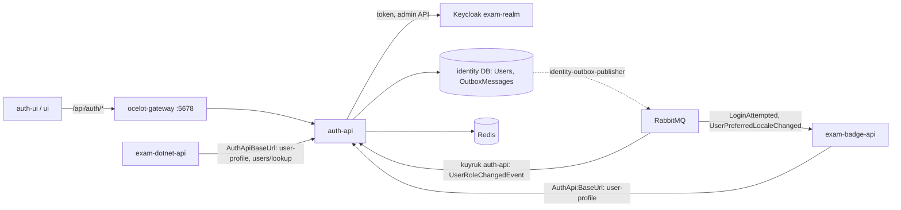
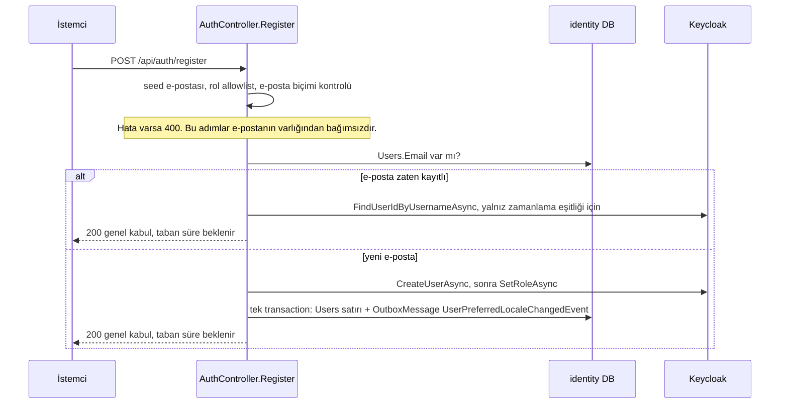

# auth-api (identity servisi)

**Bu dosya neyi anlatır:** `auth-api/` klasöründeki ASP.NET Core servisini, yani Keycloak'ın önünde duran ince "identity" katmanını servis seviyesinde anlatır: dizin yapısı, `Program.cs` içindeki DI ve middleware sırası, Keycloak ile nasıl konuştuğu (admin client ile kullanıcı oluşturma, rol atama, token alma/yenileme, şifre sıfırlama), uçların tablosu, consumer'lar, komut modu, kendi `identity` veritabanı, outbox'a yazdığı event'ler, konfigürasyon anahtarları ve testler. Kimlik akışının bütünü (Keycloak client'ları, roller, auth-ui callback'i, gateway yetkilendirmesi) [05-kimlik-yetki.md](../05-kimlik-yetki.md) dosyasındadır. Bu dosya o akışın auth-api'ye düşen kısmını anlatır.

## İçindekiler

- [1. Özet kart](#1-özet-kart)
- [2. Dizin yapısı](#2-dizin-yapısı)
- [3. Program.cs: açılış, DI ve middleware](#3-programcs-açılış-di-ve-middleware)
- [4. Keycloak entegrasyonu](#4-keycloak-entegrasyonu)
- [5. Controller'lar ve uçlar](#5-controllerlar-ve-uçlar)
- [6. Komutlar, consumer'lar, servisler, helper'lar](#6-komutlar-consumerlar-servisler-helperlar)
- [7. identity veritabanı ve AppDbContext](#7-identity-veritabanı-ve-appdbcontext)
- [8. Outbox: auth-api'nin yayınladığı event'ler](#8-outbox-auth-apinin-yayınladığı-eventler)
- [9. Konfigürasyon anahtarları](#9-konfigürasyon-anahtarları)
- [10. Ortamlara göre çalıştırma](#10-ortamlara-göre-çalıştırma)
- [11. Testler](#11-testler)
- [12. auth-api/docs klasörü ve diğer dosyalar](#12-auth-apidocs-klasörü-ve-diğer-dosyalar)
- [13. Doğrulanmadı](#13-doğrulanmadı)
- [14. Ayrı issue adayları](#14-ayrı-issue-adayları)

---

## 1. Özet kart

| Özellik | Değer | Kaynak |
|---|---|---|
| Proje dosyası | `auth-api/ExamApp.Api.csproj`. Adı exam API ile aynıdır, AppHost'ta `AspireProjectMetadataTypeName="AuthApi"` ile ayrılır | `auth-api/ExamApp.Api.csproj:1`, `AppHost/ExamApp.AppHost.csproj:11` |
| Hedef framework | `net10.0` | `auth-api/ExamApp.Api.csproj:4` |
| Kök namespace | `ExamApp.Api` (exam API ile aynı, ayrı assembly) | `auth-api/Program.cs:1-5` |
| Proje referansları | `api/ExamApp.Foundation` (contract'lar, `OutboxMessage`, `ServicePrincipal`, lokalizasyon), `ServiceDefaults` | `auth-api/ExamApp.Api.csproj:51-54` |
| Kestrel portu | `Kestrel:Port`, varsayılan `5079` | `auth-api/Helpers/KestrelBinding.cs:23-25` |
| Aspire'da | `auth-api` kaynağı, host portu `6079`, yalnız loopback | `AppHost/AppHost.cs:562-582` |
| docker-compose'da | `auth-api` container'ı, `127.0.0.1:6079:5079` | `docker-compose.yml:51-63` |
| Veritabanı | PostgreSQL `identity` (prod compose'da `auth_db`) | `AppHost/AppHost.cs:25`, `deploy/docker-compose.prod.yml:231` |
| Mesajlaşma | RabbitMQ consumer (kuyruk `auth-api`) + outbox (ayrı `identity-outbox-publisher` process'i yayınlar) | `auth-api/Program.cs:179-217`, `AppHost/AppHost.cs:509-524` |
| Önbellek | Redis (`AddStackExchangeRedisCache`) | `auth-api/Program.cs:130-136` |
| Dış istemci erişimi | Yalnız gateway üzerinden `/api/auth/*` | [gateway.md](gateway.md) |

Servisin görevi kısaca şudur:

1. Angular uygulamaları (auth-ui, ui) için **BFF** gibi davranır. Keycloak token uç noktasını sunucu tarafında `client_secret` ile çağırır: password grant, authorization code exchange, refresh.
2. Keycloak admin API'si ile kullanıcı oluşturur, rol atar, oturum kapatır, siler, parola sıfırlar.
3. Kendi `identity` DB'sinde yerel bir `Users` tablosu tutar. Sayısal `Users.Id` buradan çıkar ve exam API ile BadgeService bu id'yi `GET /api/auth/user-profile` ile çözer.
4. Login denemelerini ve dil tercihi değişikliklerini outbox'a yazar. Exam API'nin yayınladığı `UserRoleChangedEvent`'i tüketir.



---

## 2. Dizin yapısı

| Yol | İçerik |
|---|---|
| `auth-api/Program.cs` | Açılış: komut modu, DI, auth, rate limit, MassTransit, migration, middleware. [Bölüm 3](#3-programcs-açılış-di-ve-middleware) |
| `auth-api/StartupConfigDump.cs` | Development'ta etkin konfigürasyonu maskeli basar. Beş kopyasından biridir (#228). |
| `auth-api/Controllers/` | `AuthController` (tüm `api/auth/*`), `DevSeedController` (`api/auth/dev/*`), `BaseController` (kullanılmayan taban) |
| `auth-api/Commands/` | `PrivilegedUserAuditCommand`, yani `dotnet run -- audit-privileged-users` |
| `auth-api/Consumers/` | `UserRoleChangedConsumer` + `UserRoleChangedConsumerDefinition` |
| `auth-api/Services/` | `KeycloakService` (Keycloak HTTP istemcisi, 1300 satır), `KeycloakAdminTokenCache`, `KeycloakServiceCollectionExtensions`, `DevUserSeedService`, `PrivilegedUserAuditService`, `Interfaces/` |
| `auth-api/Helpers/` | Ayar sınıfları (`KeycloakSettings`, `RegistrationSettings`, `PrivilegedAuditSettings`), `AuthRateLimiting`, `AuthErrorHandling`, `AuthLocalization`, `KestrelBinding`, `KeycloakException`, `KeycloakRoleTransformer`, `KeycloakPasswordHasher`, `ExceptionHandlingMiddleware`, `NormalizedAcceptLanguageCultureProvider`, `ImageHelper`, `DevSeedEnvironmentException` |
| `auth-api/Data/AppDbContext.cs` | `BaseEntity`, `User`, `UserRole` enum, `AppDbContext` |
| `auth-api/Data/Book.cs` | `Book`, `BookTest`: DbSet'i olmayan eski sınıflar (ölü kod) |
| `auth-api/Migrations/` | 42 migration. İlk 2025 migration'ları exam API'nin eski şemasından kalmadır. Güncel model snapshot'ta yalnız `Users` ve `OutboxMessages` vardır. |
| `auth-api/Models/` | `Dtos/` (Login, Register, TokenResponse, KeycloakRole*, KeycloakSeed*), `Requests/`, `Responses/`, `Audit/`, `Constants/` |
| `auth-api/Resources/auth.{tr,en}.json` | İstemciye giden mesajların sözlüğü (#231) |
| `auth-api/docs/privileged-user-audit.md` | Audit komutunun kullanım dokümanı |
| `auth-api/docker-compose.yaml` | **Kullanımdan kalktı**, dosyanın ilk satırı bunu söylüyor. Kök `docker-compose.yml` kullanılır. |
| `auth-api/ExamApp.Api.http`, `ExamApp.Api.sln`, `nuget.config`, `Properties/launchSettings.json` | Yerel geliştirme yardımcıları. `launchSettings` `http` profili `5079`, `https` profili `7246` |

Dockerfile: compose için `dockerfiles/auth-api/Dockerfile.auth-api` (`docker-compose.yml:53-54`). Prod imajı `deploy/` altındaki ortak `dotnet-web.Dockerfile` ile üretilir (`deploy/docker-compose.prod.yml:218-226`).

---

## 3. Program.cs: açılış, DI ve middleware

### 3.1 Açılış sırası

| Adım | Ne yapar | Satır |
|---|---|---|
| Komut modu | İlk argüman `audit-privileged-users` ise web host **kurulmaz**. Konfigürasyon okunur, komut çalışır, çıkış kodu döner. Komut argümanları `IConfiguration`'a sızmasın diye builder'a boş `args` verilir. | `auth-api/Program.cs:17-42` |
| ServiceDefaults | `builder.AddServiceDefaults()`: OpenTelemetry, health, standart resilience handler. Ayrıntı: [service-defaults-apphost.md](service-defaults-apphost.md) | `auth-api/Program.cs:44` |
| Kestrel | `KestrelBinding.Configure`: `Kestrel:BindLoopbackOnly=true` ise `ListenLocalhost`, değilse `ListenAnyIP` (#100) | `auth-api/Program.cs:48-53`, `auth-api/Helpers/KestrelBinding.cs:33-40` |
| Config dump | Yalnız Development'ta `StartupConfigDump.Print` | `auth-api/Program.cs:55-58` |
| `KeycloakSettings` | `Keycloak` bölümü `IOptions<KeycloakSettings>`'e bağlanır | `auth-api/Program.cs:60-62` |
| **Secret fail-fast** | Development dışında `Keycloak:ClientSecret` veya `Keycloak:AdminClientSecret` boşsa ya da `devOnly` ile başlıyorsa `InvalidOperationException` fırlatılır (#238). Ayrıntı [Bölüm 9.2](#92-secret-fail-fast-kontrolü). | `auth-api/Program.cs:68-82` |
| `RegistrationSettings` | `Registration` bölümü | `auth-api/Program.cs:85` |
| JWT Bearer | Ayrıntı [Bölüm 3.3](#33-jwt-doğrulama) | `auth-api/Program.cs:87-113` |
| Authorization | `Service` policy'si: `ServicePrincipal.IsService(user, Keycloak:ServiceClients)` | `auth-api/Program.cs:115-123` |
| Forwarded headers + rate limit | `AddAuthForwardedHeaders`, `AddAuthRateLimiting` | `auth-api/Program.cs:127-128` |
| Redis | `Redis:Configuration`, `Redis:InstanceName` | `auth-api/Program.cs:130-136` |
| Lokalizasyon, hata yönetimi | `AddAuthLocalization`, `AddAuthErrorHandling` | `auth-api/Program.cs:143-145` |
| MVC | `AddControllers` (`ReferenceHandler.IgnoreCycles`), Swagger | `auth-api/Program.cs:147-153` |
| HTTP client'lar | Varsayılan `AddHttpClient()` ve resilience handler'ı **kaldırılmış** `KeycloakAdmin` named client'ı | `auth-api/Program.cs:154-156` |
| Keycloak servisleri | `KeycloakAdminTokenCache` (singleton), `IKeycloakService` (scoped) | `auth-api/Program.cs:158-159` |
| Dev seed | `IDevUserSeedService` yalnız Development/Staging'de kaydedilir | `auth-api/Program.cs:162-165` |
| Claims transform | `KeycloakRoleTransformer`: `realm_access.roles` değerlerini `ClaimTypes.Role` claim'ine çevirir | `auth-api/Program.cs:166`, `auth-api/Helpers/KeycloakRoleTransformer.cs:7-29` |
| EF Core | `AppDbContext`, Npgsql, `ConnectionStrings:DefaultConnection` | `auth-api/Program.cs:170-171` |
| MassTransit | `RabbitMQ:Host` doluysa kurulur. Production'da boşsa açılış durur (EF design-time hariç). Host doluysa Username/Password zorunludur. | `auth-api/Program.cs:179-217` |

### 3.2 Build sonrası ve middleware sırası

| Sıra | Adım | Satır |
|---|---|---|
| 1 | Production dışında `ForwardedHeaders` listeleri boşsa uyarı loglanır | `auth-api/Program.cs:225-230` |
| 2 | **`Database.Migrate()`**, fail-fast: hata olursa `LogCritical` ve rethrow | `auth-api/Program.cs:233-246` |
| 3 | `UseAuthErrorHandling()`: en dıştaki exception handler, stack trace sızdırmaz (#231) | `auth-api/Program.cs:250` |
| 4 | Development'ta Swagger | `auth-api/Program.cs:253-257` |
| 5 | `UseForwardedHeaders()`: IP'yi okuyan her şeyden önce gelir | `auth-api/Program.cs:260` |
| 6 | `ExceptionHandlingMiddleware`: `UnauthorizedAccessException` alırsa düz metinle 401 döner | `auth-api/Program.cs:261`, `auth-api/Helpers/ExceptionHandlingMiddleware.cs:12-24` |
| 7 | `UseRequestLocalization()`: `Accept-Language` değerinden `CurrentUICulture` | `auth-api/Program.cs:263` |
| 8 | `UseHttpsRedirection()` | `auth-api/Program.cs:264` |
| 9 | `UseRateLimiter()`: auth'tan önce gelir, yani limit aşan istek JWT doğrulanmadan 429 alır | `auth-api/Program.cs:267` |
| 10 | `UseAuthentication()`, `UseAuthorization()` | `auth-api/Program.cs:268-269` |
| 11 | `MapControllers()`, `MapDefaultEndpoints()` (health) | `auth-api/Program.cs:270-271` |
| 12 | RabbitMQ yoksa "Users.Role senkronlanmaz" uyarısı | `auth-api/Program.cs:277-281` |

> Migration açılışta otomatik uygulanır. docker-compose ayrıca `dotnet ef database update` da çalıştırır (`docker-compose.override.yml:6-7`). Migration üretme reçetesi: [04-veri-modeli.md](../04-veri-modeli.md) ve `.claude/skills/ef-migration/SKILL.md`.

### 3.3 JWT doğrulama

| Ayar | Değer | Satır |
|---|---|---|
| `Authority` | `{Server:BaseUrl}/realms/{Keycloak:Realm}`, yani gateway'in public URL'i | `auth-api/Program.cs:90` |
| `MetadataAddress` | `{Keycloak:Host}/realms/{Keycloak:Realm}/.well-known/openid-configuration`. Keycloak'a iç adresten gider. | `auth-api/Program.cs:91` |
| `ValidIssuer` | `{Server:BaseUrl}/realms/{Keycloak:Realm}` | `auth-api/Program.cs:94-95` |
| `Audience` | `"account"` (kodda sabit) | `auth-api/Program.cs:97` |
| `RequireHttpsMetadata` | `false` (kodda sabit) | `auth-api/Program.cs:98` |
| `OnAuthenticationFailed` | Yalnız sebep loglanır, Warning seviyesinde. Token veya header loglanmaz. | `auth-api/Program.cs:103-111` |

`Server:BaseUrl` ile `Keycloak:Host` arasındaki fark (issuer ile metadata adresi) AppHost'ta uzun bir yorumla anlatılır (`AppHost/AppHost.cs:668-686`). İkisini karıştırmak ağ sorunu gibi görünen bir 401 üretir. Bütün resim [05-kimlik-yetki.md](../05-kimlik-yetki.md) dosyasındadır.

---

## 4. Keycloak entegrasyonu

Bütün Keycloak çağrıları `auth-api/Services/KeycloakService.cs` içindedir. Arayüz `auth-api/Services/Interfaces/IKeycloakService.cs` dosyasındadır.

### 4.1 İki HTTP client

| Client | Kullanım | Resilience | Satır |
|---|---|---|---|
| Varsayılan (`factory.CreateClient()`) | Token istekleri, tekil admin çağrıları (create user, set role, logout, delete) | ServiceDefaults standart handler'ı: 10 sn attempt timeout ve 3 retry | `auth-api/Services/KeycloakService.cs:35` |
| `KeycloakAdmin` named client | Toplu admin işlemleri (partial import, sayfalı arama, seed onarımı, parola sıfırlama, hesap durumu taraması) | **Kaldırıldı** (`RemoveAllResilienceHandlers`), timeout 30 dk. Sebep: partial import idempotent değildir ve yeniden gönderilen parti Keycloak'tan 409 alır. | `auth-api/Services/KeycloakService.cs:24-25`, `auth-api/Services/KeycloakServiceCollectionExtensions.cs:15-23` |

`AddKeycloakAdminHttpClient()` çağrısı `AddServiceDefaults()`'tan **sonra** gelmelidir (`auth-api/Services/KeycloakServiceCollectionExtensions.cs:13`).

### 4.2 URL çözümü

- Taban URL `Keycloak:Host` alanıdır. Boşsa `Keycloak:Authority` değerinin scheme ve authority kısmı kullanılır. İkisi de yoksa `KeycloakException` fırlatılır (`auth-api/Services/KeycloakService.cs:41-56`).
- Göreli yollar (`TokenUrl`, `UserUrl`, `RealmRolesUrl`, `LogoutUrl`) bu tabana eklenir (`auth-api/Services/KeycloakService.cs:58-71`).
- İstisna: `RefreshTokenAsync` URL'i `$"{Host}/{TokenUrl}"` diye elle kurar, `BuildKeycloakUri` kullanmaz (`auth-api/Services/KeycloakService.cs:439-452`).

### 4.3 Admin token

- `exam-admin` client'ı ile `client_credentials` grant kullanılır (`auth-api/Services/KeycloakService.cs:92-140`).
- `KeycloakAdminTokenCache` singleton'dır. Token süresi `expires_in - 10 sn` kadardır. Önbellek anahtarı `TokenUrl|AdminClientId`'dir. Eşzamanlı ilk istekler tek bir token isteğinde birleşir (`auth-api/Services/KeycloakAdminTokenCache.cs:7-13`, `auth-api/Services/KeycloakService.cs:86-90`).
- Service account'un realm yetkileri (`manage-realm`, daraltma planı) için bkz. [`docs/auth-hardening.md`](../../../docs/auth-hardening.md), "Remaining" maddesi 2.

### 4.4 İşlem tablosu

| İşlem | Metot | Keycloak çağrısı | Satır |
|---|---|---|---|
| Password grant ile login | `LoginAsync` | `POST {TokenUrl}`, `grant_type=Keycloak:GrantType` (varsayılan `password`), `exam-client` + secret | `auth-api/Services/KeycloakService.cs:326-339` |
| Authorization code exchange | `ExchangeTokenAsync` | `POST {TokenUrl}`, `authorization_code` + `Keycloak:RedirectUri`. `RedirectUri` boşsa exception fırlatır. | `auth-api/Services/KeycloakService.cs:142-160` |
| Refresh | `RefreshTokenAsync` | `POST {Host}/{TokenUrl}`, `refresh_token` | `auth-api/Services/KeycloakService.cs:439-452` |
| Token hatası sınıflandırma | `PostTokenRequestAsync`, `ClassifyTokenError` | `invalid_grant` hatası `InvalidGrant` olur. Ağ hatası, timeout, devre kesici ve 5xx `ProviderUnavailable` olur. Geri kalanı `Unexpected`'tır. | `auth-api/Services/KeycloakService.cs:169-236` |
| Kullanıcı oluşturma | `CreateUserAsync` | `POST {UserUrl}`, kalıcı password credential ile. 409 `Conflict`, 400 `Validation` olur. Id `Location` header'ından okunur. | `auth-api/Services/KeycloakService.cs:379-422` |
| Rol atama (tekil) | `SetRoleAsync` | Realm rol kataloğu okunur. Kullanıcının **diğer** uygulama rolleri (Student/Teacher/Parent) silinir, yeni rol eklenir. Rol yığılması bu şekilde önlenir. | `auth-api/Services/KeycloakService.cs:238-324` |
| Oturum kapatma | `LogoutAsync` | `POST admin/.../users/{id}/logout` | `auth-api/Services/KeycloakService.cs:341-357` |
| Kullanıcı silme | `DeleteUserAsync`, `TryDeleteUserAsync` | `DELETE {UserUrl}/{id}` | `auth-api/Services/KeycloakService.cs:359-373`, `:1175` |
| Realm rolleri | `GetRealmRolesAsync`, `GetRealmRoleAsync` | `GET {RealmRolesUrl}` | `auth-api/Services/KeycloakService.cs:454`, `:549` |
| Kullanıcının realm rolleri | `GetUserRealmRoleNamesAsync` | `GET users/{id}/role-mappings/realm`. Consumer bu metodu kullanır. | `auth-api/Services/KeycloakService.cs:651` |
| Hesap durumu (enabled) | `GetUsersEnabledAsync` | 4 ve üzeri id'de devre dışı kullanıcıları sayfalı tarar. Sonuçsuzsa kullanıcı başına GET yapar, en fazla 8 paralel (#152). Okunamayan kullanıcı sonuçta yer almaz. | `auth-api/Services/KeycloakService.cs:763-861` |
| Kullanıcı arama | `SearchUsersAsync` | Sayfalı infix arama, sayfa boyutu 500 (#218) | `auth-api/Services/KeycloakService.cs:1148` |
| Seed kullanıcısı | `CreateSeedUserAsync`, `PartialImportUsersAsync`, `AddRealmRoleMappingAsync`, `EnsureUserAttributesAsync` | Dev seed için (#217) | `auth-api/Services/KeycloakService.cs:597`, `:694`, `:637`, `:1248` |
| **Şifre sıfırlama** | `ResetPasswordAsync` | `PUT {UserUrl}/{id}/reset-password` (`temporary=false`). **Tek çağıran** dev seed'in `ResetPassword` seçeneğidir. Son kullanıcıya açık bir "şifremi unuttum" ucu yoktur, bu akış Keycloak'ın kendi ekranlarındadır. | `auth-api/Services/KeycloakService.cs:1285-1303`, `auth-api/Services/DevUserSeedService.cs:465` |
| Audit için okuma | `GetUsersInRoleAsync`, `GetGroupsInRoleAsync`, `GetGroupMembersAsync`, `GetSubGroupsAsync`, `GetRealmRoleCompositesAsync`, `GetUserCredentialTypesAsync`, `GetUserFederatedIdentityProvidersAsync` | Salt okunur (#267) | `auth-api/Services/KeycloakService.cs:1008-1124` |
| Uygulanmamış | `GetAccessTokenAsync`, `GetUserInfoAsync`, `ValidateTokenAsync`, `GetUserIdFromTokenAsync`, `GetUserNameFromTokenAsync` | `NotImplementedException` | `auth-api/Services/KeycloakService.cs:424-437`, `:517-525` |

### 4.5 Hata türleri

`KeycloakFailureKind` değerleri: `Unexpected=0`, `InvalidGrant=1`, `ProviderUnavailable=2`, `Conflict=3`, `Validation=4` (`auth-api/Helpers/KeycloakException.cs:9-33`). HTTP karşılıkları:

- Controller içinde: `InvalidGrant` 401, `ProviderUnavailable` 503 döner. Yanıtta yalnız yerelleştirilmiş `{ message }` vardır (`auth-api/Controllers/AuthController.cs:853-868`).
- Global handler'da da aynı eşleme vardır. Diğer her şey 500 ProblemDetails olur ve gövdede `detail` yoktur (`auth-api/Helpers/AuthErrorHandling.cs:39-69`).

---

## 5. Controller'lar ve uçlar

Gateway'den gelen yol `/api/auth/{everything}` olarak auth-api'ye aynen iletilir. `dev/*` ve `users/lookup` yolları gateway'de **engellidir**, bkz. [gateway.md](gateway.md#5-route-tablosu).

### 5.1 `AuthController` (`[Route("api/[controller]")]`, yani `api/auth`)

| Metot ve yol | Yetki | Rate limit | Ne yapar | Satır |
|---|---|---|---|---|
| `POST /api/auth/login` | Anonim | `auth-attempts` | Keycloak password grant. Access token ve filtrelenmiş realm rolleri döner. Başarılı veya başarısız her denemede `LoginAttemptedEvent` outbox'a yazılır. Başarısız denemede doğrulanmamış e-posta `AttemptedIdentifier` alanına gider, 256 karaktere kırpılır. **Refresh cookie set etmez**, bkz. [issue adayları](#14-ayrı-issue-adayları). | `auth-api/Controllers/AuthController.cs:409-476` |
| `POST /api/auth/exchange` | Anonim | `auth-attempts` | Authorization code exchange (auth-ui callback). `EnsureLocalUserAsync` ile ilk girişte yerel `Users` satırını açar ve rolü senkronlar. `refresh_token` cookie'sini `HttpOnly`, `Secure`, `SameSite=Strict`, `Path=/` ile yazar. `LoginAttemptedEvent` üretir. | `auth-api/Controllers/AuthController.cs:523-597` |
| `POST /api/auth/refresh-token` | Anonim (cookie) | Yok | `refresh_token` cookie'si ile Keycloak refresh yapar. Yeni refresh token gelirse cookie'yi günceller. `{ accessToken, expiresIn }` döner. | `auth-api/Controllers/AuthController.cs:478-520` |
| `POST /api/auth/register` | Anonim | `auth-attempts` | Kayıt (#240). Yanıt e-postanın kayıtlı olup olmadığını ele vermez. Ayrıntı [5.3](#53-register-akışı). | `auth-api/Controllers/AuthController.cs:91-219` |
| `POST /api/auth/complete-profile` | `[Authorize]` | Yok | Rolü olmayan SSO kullanıcısı rolünü bir kez seçer: Student, Teacher veya Parent. Önce Keycloak'ta `SetRoleAsync` çalışır. Keycloak hatasında 502 döner. Sonra koşullu `ExecuteUpdateAsync` (`Role` boşsa) çalışır. Rol zaten varsa 409, yerel satır yoksa 404 döner. | `auth-api/Controllers/AuthController.cs:651-728` |
| `PUT /api/auth/me/locale` | `[Authorize]` | Yok | Dil tercihi (#181). `SupportedLocales.TryNormalize` ile normalize edilir. Değer gerçekten değişirse `UserPreferredLocaleChangedEvent` aynı `SaveChanges` içinde outbox'a yazılır. | `auth-api/Controllers/AuthController.cs:736-797` |
| `GET /api/auth/user-profile` | `[Authorize]` | Yok | `sub` claim'ine göre yerel profil: `Id`, `KeycloakId`, `FullName`, `Email`, `Role`, `Avatar`, `PreferredLocale`. Exam API ve BadgeService sayısal id'yi buradan alır. | `auth-api/Controllers/AuthController.cs:70-77`, `:900-923` |
| `POST /api/auth/refresh` | `[Authorize]` | Yok | `user-profile` ile aynı gövdeyi döner (profil yenileme) | `auth-api/Controllers/AuthController.cs:60-68` |
| `POST /api/auth/logout` | `[Authorize]` | Yok | Keycloak admin API ile kullanıcının oturumlarını kapatır, `refresh_token` cookie'sini siler, 204 döner | `auth-api/Controllers/AuthController.cs:393-405` |
| `POST /api/auth/users/lookup` | `Service` policy | Yok | Toplu id'den ad, e-posta ve KeycloakId çözümü (#219). Yalnız servislere açıktır. `IncludeAccountStatus=true` iken en fazla 100 id kabul eder ve Keycloak `enabled` alanını 5 sn bütçe ile fail-soft okur (#152). | `auth-api/Controllers/AuthController.cs:304-386` |
| `GET /api/auth/roles` | `[Authorize(Roles = "Admin")]` | Yok | Realm rol kataloğu (#240'tan beri anonime kapalı) | `auth-api/Controllers/AuthController.cs:804-815` |

Login ve exchange yanıtındaki roller şu filtreden geçer: `Keycloak:ExcludedRoles` listesi, `default-roles*` önekli roller ve `uma_` içeren roller atılır (`auth-api/Controllers/AuthController.cs:445-459`, `:549-564`).

### 5.2 `DevSeedController` (`api/auth/dev`, `Service` policy)

| Metot ve yol | Ne yapar | Satır |
|---|---|---|
| `POST /api/auth/dev/seed-users` | Seed alanındaki e-postalarla toplu test kullanıcısı oluşturur veya onarır (#217). İki mod vardır: tekil admin API ya da partial import. | `auth-api/Controllers/DevSeedController.cs:34-58` |
| `POST /api/auth/dev/seed-users/cleanup` | Seed hesaplarını Keycloak'tan ve identity'den kaldırır (#218). Varsayılan `DryRun=true`'dur. | `auth-api/Controllers/DevSeedController.cs:65-89` |

Beş koruma katmanı vardır (`auth-api/Controllers/DevSeedController.cs:10-16`):

1. DI kaydı yalnız Development/Staging'de yapılır. Kayıt yoksa servis null çözülür ve 404 döner.
2. Controller ortamı kendisi de kontrol eder.
3. `Service` policy'si.
4. Servis içinde ortam guard'ı vardır (`DevSeedEnvironmentException` olursa 404 döner).
5. Gateway `/api/auth/dev/*` yolunu engeller. Exam API'nin seed CLI'ı bu uca `AuthApiBaseUrl` üzerinden doğrudan gelir.

### 5.3 Register akışı



Kurallar ve satırları:

- **Allowlist:** yalnız `Student`, `Teacher`, `Parent` (`auth-api/Controllers/AuthController.cs:800`). Seed alanındaki e-postalar reddedilir (`:101-104`). E-posta biçimi `IsWellFormedRegistrationEmail` ile kontrol edilir (`:235-247`).
- **Enumeration koruması:** yeni kayıt, yerel DB'de kayıtlı e-posta, Keycloak 409, Keycloak 400 ve eşzamanlı unique ihlali aynı 200 gövdesini döner. 200 ve 500 yanıtları `Registration:MinimumResponseMilliseconds` (varsayılan 1500 ms) dolmadan dönmez (`:252-283`).
- **Yetim kullanıcı önleme:** Keycloak kullanıcısı oluştuktan sonraki yerel yazım `CancellationToken.None` ile yapılır. Hata olursa bu istekte oluşturulan Keycloak kullanıcısı `TryDeleteRegisteredKeycloakUserAsync` ile silinir (`:139-216`, `:285-301`).
- Register'ın yanında exam API'nin kendi register uçları da vardır (Teacher/Student/ParentController). Onlar Keycloak rolünü değiştirdiğinde `UserRoleChangedEvent` yazar. Ayrıntı [api.md](api.md) ve [05-kimlik-yetki.md](../05-kimlik-yetki.md).

### 5.4 `BaseController`

`[Authorize]` taşır ve `GetAuthenticatedUserAsync` metodunu sağlar (`auth-api/Controllers/BaseController.cs:12-21`). Bugün hiçbir controller bundan türemez: `AuthController : ControllerBase` (`auth-api/Controllers/AuthController.cs:28`). Ölü koddur.

---

## 6. Komutlar, consumer'lar, servisler, helper'lar

### 6.1 Komut: `audit-privileged-users` (#267)

- `cd auth-api && dotnet run -- audit-privileged-users [--format table|csv|json]` (`auth-api/Commands/PrivilegedUserAuditCommand.cs:37-48`).
- Keycloak'ta `Admin` ve `exam-service` rollerine doğrudan, grup üzerinden veya kompozit rolle bağlı hesapları listeler. Bu hesapları identity `Users` ile eşleştirip sınıflandırır (`auth-api/Services/PrivilegedUserAuditService.cs:24`, `:58`, `:250`).
- **Salt okunur**, ortam guard'ı yoktur, Production'da da çalışır. Çıkış kodları: 0 bulgu yok, 1 kullanım hatası, 2 `UNEXPLAINED` hesap veya dolaylı yetki var, 3 çalışma hatası (`auth-api/Commands/PrivilegedUserAuditCommand.cs:27-31`).
- Bilinen meşru hesaplar `PrivilegedAudit__KnownAccounts__<n>` ile **Keycloak id (sub)** olarak verilir, kullanıcı adı kabul edilmez (`auth-api/Helpers/PrivilegedAuditSettings.cs:9-16`).
- Ayrıntı: `auth-api/docs/privileged-user-audit.md`.

### 6.2 Consumer: `UserRoleChangedConsumer` (#277 madde 4)

- Exam API'nin outbox'ından gelen `UserRoleChangedEvent`'i (`api/ExamApp.Api/Helpers/UserRoleChangeOutbox.cs:38`) RabbitMQ'daki `auth-api` kuyruğundan tüketir (`auth-api/Program.cs:207-214`).
- Eşleştirme `KeycloakId` ile yapılır, sayısal id ile **değil**: iki servisin `Users.Id` uzayları ayrıdır (`auth-api/Consumers/UserRoleChangedConsumer.cs:20-22`).
- **Güvenlik:** event'teki `NewRole` değerine güvenilmez. Event yalnız tetikleyicidir. Gerçek rol `GetUserRealmRoleNamesAsync` ile Keycloak'tan taze okunur. Yalnız allowlist'teki bir rol (Student/Teacher/Parent) `Users.Role` alanına yazılır. Keycloak'ta uygulama rolü yoksa `Users.Role` değişmez (`auth-api/Consumers/UserRoleChangedConsumer.cs:24-36`, `:100-128`).
- Tazelik kısayolu kasıtlı olarak yoktur. `RoleUpdatedAtUtc` yalnız teşhis içindir ve mikrosaniyeye yuvarlanır (`:38-49`, `:143-147`).
- Kullanıcı bulunamazsa `UserNotFoundForRoleSyncException` fırlatılır. `UserRoleChangedConsumerDefinition` 1 sn, 5 sn ve 15 sn aralıklarla 3 retry dener, sonra mesaj `auth-api_error` kuyruğuna düşer (`:155-176`). `PublishFaults=false` (`auth-api/Program.cs:211`).
- RabbitMQ kullanıcısı `auth_api` en az yetkiyle tanımlanmıştır: kendi kuyruğunu okur, event exchange'ine publish edemez (`docker-compose.yml:76-85`, `rabbitmq/definitions.json:51`). İzin matrisi için bkz. [06-asenkron-akislar.md](../06-asenkron-akislar.md).

### 6.3 Servisler

| Sınıf | Görev | Satır |
|---|---|---|
| `KeycloakService` | [Bölüm 4](#4-keycloak-entegrasyonu) | `auth-api/Services/KeycloakService.cs:15` |
| `KeycloakAdminTokenCache` | Admin token önbelleği (singleton) | `auth-api/Services/KeycloakAdminTokenCache.cs:13` |
| `DevUserSeedService` | Dev seed ve cleanup. Akış: ortam guard'ı, doğrulama, identity ön yükleme, Keycloak (admin API veya partial import), identity upsert, isteğe bağlı outbox event. Var olan Keycloak kullanıcısı için `Existing`, `Adopted` veya `SkippedForeign` kararı verir. | `auth-api/Services/DevUserSeedService.cs:15-29`, `:52-53`, `:136` |
| `PrivilegedUserAuditService` | Audit sınıflandırması, e-posta ve kullanıcı adı maskeleme | `auth-api/Services/PrivilegedUserAuditService.cs:22` |

### 6.4 Helper'lar

| Sınıf | Görev | Satır |
|---|---|---|
| `AuthRateLimiting` | `auth-attempts` policy'si: IP başına fixed window, varsayılan 10 istek / 60 sn, kuyruk 0. Aşılırsa 429, `Retry-After` header'ı ve düz metin döner. | `auth-api/Helpers/AuthRateLimiting.cs:19-75`, `:183-184` |
| `AuthRateLimiting.AddAuthForwardedHeaders` | Yalnız `X-Forwarded-For`, `ForwardLimit=1`. `KnownNetworks` ve `KnownProxies` ile pinlenir. İkisi de boşsa XFF her kaynaktan kabul edilir. **Production'da ikisi de boşsa açılış durur.** Geçersiz IP veya CIDR ya da `/0` ağı reddedilir. | `auth-api/Helpers/AuthRateLimiting.cs:106-181` |
| `AuthErrorHandling` | Global exception handler ve ProblemDetails sadeleştirme (#231) | `auth-api/Helpers/AuthErrorHandling.cs:16-69` |
| `AuthLocalization` | JSON sözlük (`Resources/`) + yalnız `Accept-Language` provider'ı. Varsayılan dil `tr`. | `auth-api/Helpers/AuthLocalization.cs:13-39` |
| `KestrelBinding` | Port ve loopback bind (#100) | `auth-api/Helpers/KestrelBinding.cs:21-41` |
| `KeycloakRoleTransformer` | `realm_access.roles` değerlerini `ClaimTypes.Role` claim'ine çevirir. `[Authorize(Roles="Admin")]` ve `ServicePrincipal` rol kontrolü bunun sayesinde çalışır. | `auth-api/Helpers/KeycloakRoleTransformer.cs:5-29` |
| `KeycloakPasswordHasher` | Partial import için Keycloak uyumlu `pbkdf2-sha512` hash'i, 210.000 iterasyon | `auth-api/Helpers/KeycloakPasswordHasher.cs:18-23` |
| `ExceptionHandlingMiddleware` | `UnauthorizedAccessException` alırsa düz metinle 401 döner | `auth-api/Helpers/ExceptionHandlingMiddleware.cs:1-26` |
| `ImageHelper` | Base64 ve URL regex'leri. Singleton olarak kaydedilir ama hiçbir yerde inject edilmez. | `auth-api/Helpers/ImageHelper.cs:6`, `auth-api/Program.cs:167` |

---

## 7. identity veritabanı ve AppDbContext

Kısa özet burada. Tablolar, kolonlar ve ER diyagramı [04-veri-modeli.md](../04-veri-modeli.md) dosyasındadır.

| Konu | Değer | Satır |
|---|---|---|
| DB adı | Aspire ve compose'da `identity`, prod compose'da `auth_db` | `AppHost/AppHost.cs:25`, `docker-compose.yml:71`, `deploy/docker-compose.prod.yml:231` |
| DbSet'ler | `Users`, `OutboxMessages` (`ExamApp.Foundation.Persistence.OutboxMessage`) | `auth-api/Data/AppDbContext.cs:83-84` |
| `User` | `Id` (int, PK), `KeycloakId` (max 50), `FullName`, `Email`, `PasswordHash` (kullanılmıyor), `AvatarUrl`, `Role` (string), `PreferredLocale` (max 8, DB varsayılanı `tr`), `IsSeedData`, `RoleUpdatedAtUtc` | `auth-api/Data/AppDbContext.cs:21-67`, `:137-141` |
| `BaseEntity` | `CreateTime`, `CreateUserId`, `UpdateTime`, `UpdateUserId`, `DeleteTime`, `DeleteUserId`, `IsDeleted` | `auth-api/Data/AppDbContext.cs:10-19` |
| Audit damgası | `SaveChanges` ve `SaveChangesAsync` override'ları `ApplyAuditInfo` çağırır. `Deleted` durumu soft delete'e çevrilir. | `auth-api/Data/AppDbContext.cs:91-127` |
| Global filtre | `BaseEntity`'den türeyen her entity'ye `!IsDeleted` filtresi | `auth-api/Data/AppDbContext.cs:143-167` |
| İndeks | Model snapshot'ta `Users` için **unique indeks yoktur**, bkz. [issue adayları](#14-ayrı-issue-adayları) | `auth-api/Migrations/AppDbContextModelSnapshot.cs:25-94` |
| Son migration'lar | `AddOutboxRetryColumns`, `AddUserPreferredLocale`, `AddUserIsSeedData`, `AddUserRoleUpdatedAtUtc` | `auth-api/Migrations/20260908075226_AddOutboxRetryColumns.cs` ve sonrası |

---

## 8. Outbox: auth-api'nin yayınladığı event'ler

auth-api RabbitMQ'ya **publish etmez**. Event'i `OutboxMessages` tablosuna iş verisiyle aynı transaction içinde yazar. Ayrı `identity-outbox-publisher` process'i aynı tabloyu okuyup yayınlar. Bu process, generic `Services/OutboxPublisher` projesinin identity DB'ye bağlı ikinci örneğidir (`AppHost/AppHost.cs:498-524`). Bkz. [outbox-publisher.md](outbox-publisher.md).

| Event | Nerede yazılır | Ne zaman | Tüketen | Satır |
|---|---|---|---|---|
| `LoginAttemptedEvent` | `AuthController.WriteLoginAttemptedEventAsync` | Her `login` ve `exchange` denemesinde (başarılı ve başarısız). `EventId` outbox satırının `Id`'siyle aynıdır. Şifre ve token taşınmaz. Yazım hatası login yanıtını bozmaz (`TryWrite...`). | BadgeService `LoginAttemptedConsumer`. Bu consumer olayı exam API'nin `POST /api/login-events` ucuna köprüler. | `auth-api/Controllers/AuthController.cs:824-847`, `:876-887`, `Services/BadgeService/Consumers/LoginAttemptedConsumer.cs:12-31` |
| `UserPreferredLocaleChangedEvent` | `Register` (yeni kullanıcı, varsayılan dil), `UpdatePreferredLocale` (yalnız değer değişince), `DevUserSeedService` | Kullanıcı açılınca veya dil değişince | BadgeService `UserPreferredLocaleChangedConsumer` | `auth-api/Controllers/AuthController.cs:171-181`, `:781-791`, `auth-api/Services/DevUserSeedService.cs:695-697`, `Services/BadgeService/Consumers/UserPreferredLocaleChangedConsumer.cs:26` |

- `Type` kolonuna `OutboxEventRegistry.NameFor<T>()` ile namespace ve sınıf adı (`FullName`) yazılır. Yeni event eklenirse registry'ye de eklenmelidir (`api/ExamApp.Foundation/Contracts/OutboxEventRegistry.cs:17-39`).
- `OutboxMessage` alanları: `Id`, `Type`, `Content`, `CreatedAt`, `ProcessedAt`, `RetryCount`, `NextAttemptAt`, `Error` (`api/ExamApp.Foundation/Persistence/OutboxMessage.cs:5-28`).
- Publisher'ın RabbitMQ kullanıcısı `identity_outbox_pub`'dur ve yalnız bu iki event'in exchange'ine configure ve write yetkisi vardır (`AppHost/AppHost.cs:516-521`, `rabbitmq/definitions.json:23`).
- Yeni event ekleme reçetesi: `.claude/skills/outbox-event/SKILL.md`. Olay listesinin tamamı [06-asenkron-akislar.md](../06-asenkron-akislar.md) dosyasındadır.

---

## 9. Konfigürasyon anahtarları

Bu tabloda değer yoktur, yalnız anahtar ve amacı vardır. Env değişkeni biçimi `Bolum__Anahtar` şeklindedir.

### 9.1 Anahtar tablosu

| Anahtar | Amaç | Okunduğu yer |
|---|---|---|
| `Kestrel:Port` | Dinleme portu (varsayılan 5079, Aspire 6079) | `auth-api/Helpers/KestrelBinding.cs:23` |
| `Kestrel:BindLoopbackOnly` | `true` ise yalnız 127.0.0.1 ve ::1 dinlenir (Aspire'da açık) | `auth-api/Helpers/KestrelBinding.cs:24`, `AppHost/AppHost.cs:581` |
| `Server:BaseUrl` | Public gateway URL'i. JWT `Authority` ve `ValidIssuer` buradan kurulur. **`appsettings.json` içinde yoktur**, env ile verilmelidir. | `auth-api/Program.cs:90-95` |
| `Keycloak:Host` | Keycloak iç adresi: metadata adresi ve tüm admin/token çağrılarının tabanı | `auth-api/Program.cs:91`, `auth-api/Services/KeycloakService.cs:43` |
| `Keycloak:Realm` | Realm adı (`exam-realm`) | `auth-api/Program.cs:90` |
| `Keycloak:Authority` | `Host` boşsa KeycloakService'in taban URL'i için yedek | `auth-api/Services/KeycloakService.cs:49` |
| `Keycloak:TokenUrl`, `UserUrl`, `RealmRolesUrl`, `LogoutUrl` | Keycloak'a göre göreli yollar | `auth-api/Helpers/KeycloakSettings.cs:5-17` |
| `Keycloak:RedirectUri` | Code exchange'deki `redirect_uri`. Keycloak client ayarıyla birebir aynı olmalıdır. | `auth-api/Services/KeycloakService.cs:144-155` |
| `Keycloak:ClientId` / `Keycloak:ClientSecret` | `exam-client`. Login, exchange ve refresh için kullanılır. **Secret env ile verilir.** | `auth-api/Services/KeycloakService.cs:326-339` |
| `Keycloak:AdminClientId` / `Keycloak:AdminClientSecret` | `exam-admin` (client_credentials). Admin API için kullanılır. **Secret env ile verilir.** | `auth-api/Services/KeycloakService.cs:92-106` |
| `Keycloak:GrantType` | Login grant'ı (varsayılan `password`) | `auth-api/Helpers/KeycloakSettings.cs:9` |
| `Keycloak:ExcludedRoles` | Login ve exchange yanıtından atılan sistem rolleri | `auth-api/Controllers/AuthController.cs:452` |
| `Keycloak:ServiceClients` | `Service` policy'sinin kabul ettiği `azp`/`client_id` listesi. Boşsa `exam-admin` kullanılır. `appsettings.json` içinde yoktur. | `auth-api/Program.cs:115`, `api/ExamApp.Foundation/Security/ServicePrincipal.cs:35-37` |
| `Keycloak:Audience`, `Keycloak:RequireHttpsMetadata` | `KeycloakSettings` içinde tanımlıdır ama JWT kurulumu bunları **okumaz**, değerler `Program.cs` içinde sabittir | `auth-api/Helpers/KeycloakSettings.cs:13-14`, `auth-api/Program.cs:97-98` |
| `ConnectionStrings:DefaultConnection` | identity DB. Parola env ile verilir. | `auth-api/Program.cs:171` |
| `Redis:Configuration`, `Redis:InstanceName` | Dağıtık önbellek | `auth-api/Program.cs:130-136` |
| `RabbitMQ:Host`, `RabbitMQ:Username`, `RabbitMQ:Password` | Consumer bus'ı. Host boşsa bus kurulmaz, Production'da açılış durur. | `auth-api/Program.cs:179-205` |
| `RateLimiting:AuthAttempts:PermitLimit`, `WindowSeconds` | `auth-attempts` policy limiti | `auth-api/Helpers/AuthRateLimiting.cs:33-34` |
| `ForwardedHeaders:KnownProxies`, `ForwardedHeaders:KnownNetworks` | XFF güven listesi. Production'da en az biri zorunludur. | `auth-api/Helpers/AuthRateLimiting.cs:142-143` |
| `Registration:MinimumResponseMilliseconds` | Register yanıtının taban süresi | `auth-api/Helpers/RegistrationSettings.cs:8-16` |
| `PrivilegedAudit:KnownAccounts` | Audit komutunda meşru sayılan Keycloak sub listesi | `auth-api/Helpers/PrivilegedAuditSettings.cs:16` |
| `Jwt:Issuer`, `Jwt:Audience` (+ prod'da `Jwt__Key`) | **Kullanılmıyor.** Sabitler `Models/Constants/ConfigConstants.cs` içinde tanımlı ama hiçbir yerde okunmuyor. | `auth-api/appsettings.json:25-28`, `deploy/docker-compose.prod.yml:232` |
| `MinioConfig:*` | **Kullanılmıyor.** Yalnız config dump'ta görünür, `Minio` paketi referanslıdır ama kodda kullanılmaz. | `auth-api/appsettings.json:29-35`, `auth-api/StartupConfigDump.cs:21` |
| `AuthApiBaseUrl` | auth-api kendisi okumaz. Exam API ve seed CLI'ın auth-api adresi olarak aynı anahtar adı kullanılır. | `auth-api/appsettings.json:8`, `AppHost/AppHost.cs:702` |

### 9.2 Secret fail-fast kontrolü

`appsettings.json` içinde `Keycloak:ClientSecret` ve `Keycloak:AdminClientSecret` alanları bilerek boş bırakılmıştır (`auth-api/appsettings.json:46`, `:48`). Development dışındaki bir ortamda:

- değer boşsa veya `devOnly` önekiyle başlıyorsa açılış `InvalidOperationException` ile durur (`auth-api/Program.cs:68-82`). Amaç, sessiz bir `invalid_client` veya 401 almamaktır.
- Dev-only değerler `.env.example` dosyasındaki `KEYCLOAK_CLIENT_SECRET` ve `KEYCLOAK_ADMIN_CLIENT_SECRET` anahtarlarındadır (compose) ya da AppHost parametrelerindedir (Aspire). Kurulumu ve eski secret'ı koruma seçeneğini [`.claude/rules/local-dev.md`](../../../.claude/rules/local-dev.md) (Issue #238 bölümü) anlatır.
- Service account sertleştirmesinin geri kalanı (`exam-service` rolü, audience, legacy fallback'ler) için bkz. [`docs/auth-hardening.md`](../../../docs/auth-hardening.md).
- Çıplak `dotnet run` için isteğe bağlı bir `UserSecretsId` tanımlıdır (`auth-api/ExamApp.Api.csproj:7-11`). Asıl kaynak `.env` ya da AppHost parametreleridir.

---

## 10. Ortamlara göre çalıştırma

| Ortam | Nasıl | Env kaynağı | Not |
|---|---|---|---|
| Aspire | AppHost'taki `auth-api` kaynağı | `AppHost/AppHost.cs:562-610` (port, loopback, DB, Redis, MinIO, RabbitMQ), `:720-726` (Keycloak host ve secret'lar, `Server__BaseUrl` = gateway endpoint) | `ASPNETCORE_HTTPS_PORT=""` verilir, böylece `UseHttpsRedirection` ölü bir 7246 portuna yönlendirmez (`AppHost/AppHost.cs:583-586`) |
| docker-compose | `auth-api` servisi, `dotnet watch run --urls=http://+:5079` | `docker-compose.yml:51-96`, `docker-compose.override.yml:6-7` | `ASPNETCORE_ENVIRONMENT=Development`. `Server__BaseUrl` tanımlı değil, bkz. [Doğrulanmadı](#13-doğrulanmadı) |
| Prod compose | `ASPNETCORE_ENVIRONMENT=Production` | `deploy/docker-compose.prod.yml:218-265` | `ForwardedHeaders__*` tanımlı değil, bkz. [issue adayları](#14-ayrı-issue-adayları) |

Kurulum adımları için bkz. [02-ortam-kurulumu.md](../02-ortam-kurulumu.md) ve [`.claude/rules/local-dev.md`](../../../.claude/rules/local-dev.md).

---

## 11. Testler

Proje: `tests/AuthApi.Tests/AuthApi.Tests.csproj`. Bu proje `auth-api/ExamApp.Api.csproj`'a referans verir ve SQLite ile `Microsoft.AspNetCore.TestHost` kullanır. Ortak paketler (xUnit v3, NSubstitute, Shouldly, coverlet) `tests/Directory.Build.props` içindedir.

```bash
dotnet test tests/AuthApi.Tests
```

> **Dikkat:** `AuthApi.Tests` projesi `ExamApp.slnx` içinde **yok** (`ExamApp.slnx:22-29`). Bu yüzden `tests/README.md` içindeki `dotnet test ExamApp.slnx` komutu bu testleri çalıştırmaz. Projeyi doğrudan hedefleyin. AppHost çalışırken servis DLL'leri kilitlenir, önce ilgili servisi durdurun (`tests/README.md`).

| Dosya | Test sayısı (`[Fact]`/`[Theory]`) | Kapsam |
|---|---|---|
| `Controllers/AuthControllerTests.cs` | 26 | Login ve exchange outbox event'i, kimlik sızdırmama, 401/503 eşlemesi (#84, #231) |
| `Controllers/LoginErrorResponseTests.cs` | 12 | Yanlış parolada stack trace dönmemesi, yerelleştirilmiş mesaj (#231) |
| `Controllers/RegisterEnumerationAndRolesTests.cs` | 22 | Register enumeration koruması, rol allowlist'i, unique ihlali yolu (#240) |
| `Controllers/UsersLookupAuthorizationTests.cs` | 13 | `users/lookup` yalnız `Service` policy'sine açık (#219) |
| `Consumers/UserRoleChangedConsumerTests.cs` | 10 | Event'e güvenmeme, Keycloak'tan taze okuma, allowlist (#277) |
| `Hosting/KestrelBindingTests.cs` | 3 | Loopback ve any-IP seçimi (#100) |
| `RateLimiting/AuthRateLimitingTests.cs` | 13 | IP başına limit, 429, forwarded headers doğrulaması (#84, #100) |
| `Services/DevUserSeedServiceTests.cs` | 26 | Seed oluşturma, idempotency, yabancı hesap koruması, ortam guard'ı (#217) |
| `Services/DevUserSeedCleanupTests.cs` | 16 | Seed temizliği, dry-run, kapsam kilidi (#218) |
| `Services/KeycloakAdminHttpClientTests.cs` | 1 | `KeycloakAdmin` client'ında resilience handler olmaması |
| `Services/KeycloakAdminTokenCacheTests.cs` | 4 | Token önbelleği süre ve anahtar yenileme, birleştirme (#152) |
| `Services/KeycloakServiceAccountStatusTests.cs` | 14 | `GetUsersEnabledAsync` fail-soft davranışı (#152) |
| `Services/KeycloakServiceCreateUserTests.cs` | 4 | 409 durumunun `Conflict` sayılması (#240) |
| `Services/KeycloakServiceRoleMembersTests.cs` | 12 | Rol üyeleri sayfalama (#267) |
| `Services/KeycloakServiceSearchTests.cs` | 7 | Infix arama sayfalama, silme 404/204 (#218) |
| `Services/KeycloakServiceTokenErrorTests.cs` | 10 | Token hatası sınıflandırması (#231) |
| `Services/PrivilegedUserAuditTests.cs` | 25 | Audit sınıflandırma, maskeleme, çıkış kodları (#267) |
| `Services/StartupConfigDumpTests.cs` | 1 | Config dump parola maskeleme (#228) |
| `Support/TestDb.cs` | 0 | İzole in-memory SQLite `AppDbContext` |

`KeycloakRoleTransformer` testi auth-api'de değil, `tests/ExamApp.Api.Tests` içindedir (`tests/README.md`, Layout tablosu). Test pratikleri için bkz. [08-gelistirme-pratikleri.md](../08-gelistirme-pratikleri.md).

---

## 12. auth-api/docs klasörü ve diğer dosyalar

- `auth-api/docs/privileged-user-audit.md`: audit komutunun neden var olduğu (#240 öncesinde register ile `Admin` rolü alınabiliyordu), kullanım, çıkış kodları, yapılandırma ve sonuç sınıfları. Klasördeki tek dosyadır.
- `auth-api/docker-compose.yaml`: eski kopyadır, kullanılmaz (dosyanın 1. satırı).
- `auth-api/ExamApp.Api.http`: elle istek denemeleri için.

---

## 13. Doğrulanmadı

1. **docker-compose'da JWT issuer:** kök `docker-compose.yml` içindeki `auth-api` servisi `Server__BaseUrl` vermiyor (`docker-compose.yml:64-85`). `auth-api/appsettings.json` içinde de `Server` bölümü yok. `appsettings.Development.json` gitignore'da (`.gitignore:131`) ve repoda yok. Bu durumda `Authority` ve `ValidIssuer` `/realms/exam-realm` olur ve `[Authorize]` uçlar compose'da 401 dönebilir. Çalıştırılarak doğrulanmadı. Geliştiricinin makinesinde gitignore'lu bir `appsettings.Development.json` olabilir.
2. **docker-compose'da `ServiceDefaults` referansı:** compose yalnız `./auth-api` ve `./api/ExamApp.Foundation` klasörlerini mount ediyor (`docker-compose.yml:86-88`). `auth-api/ExamApp.Api.csproj:53` ise `..\ServiceDefaults` projesine referans veriyor. Container'da build'in bu referansı nasıl çözdüğü doğrulanmadı.
3. **Prod'da açılış:** `deploy/docker-compose.prod.yml` ve `deploy/gcp/k8s/apps.yaml` içinde `ForwardedHeaders__KnownNetworks/KnownProxies` yok. `ASPNETCORE_ENVIRONMENT=Production` ile `AddAuthForwardedHeaders` açılışı durdurmalı (`auth-api/Helpers/AuthRateLimiting.cs:115-120`). Bu sonuç koddan çıkarıldı, çalıştırılmadı.
4. `KeycloakService` metotlarının satır aralıkları outline'dan alındı. Gövdelerin hepsi satır satır okunmadı, okunmayanlar: `GetUsersEnabledAsync`, partial import, audit okumaları.

## 14. Ayrı issue adayları

Bu adaylar için `gh issue list --state all --search ...` ile arama yapıldı. Eşleşen açık issue bulunmadı.

1. **Password grant login refresh cookie'si yazmıyor.** `POST /api/auth/login` yanıtı yalnız access token döner ve `refresh_token` cookie'si set etmez (`auth-api/Controllers/AuthController.cs:409-476`). `exchange` ise yazar (`:582-589`). auth-ui ve ui login'den sonra `/api/auth/refresh-token` çağırıyor (`auth-ui/src/app/services/auth.service.ts:76`, `:294`). Password ile giren kullanıcının token yenilemesi 401 alır. Login ayrıca `EnsureLocalUserAsync` çağırmaz, yerel satırı açmaz.
2. **`Users` tablosunda unique indeks yok.** Model snapshot'ta `Email` veya `KeycloakId` için indeks yok (`auth-api/Migrations/AppDbContextModelSnapshot.cs:25-94`). Register'daki "eşzamanlı unique ihlali" yolu (`auth-api/Controllers/AuthController.cs:203-210`, `:227-228`) Postgres'te hiç tetiklenmez. Eşzamanlı iki register veya iki ilk `exchange` (`:604-642`) çift satır üretebilir.
3. **Prod compose ve k8s'te `ForwardedHeaders` eksik.** Production'da auth-api açılmayabilir. Ayrıntı yukarıda, Doğrulanmadı madde 3.
4. **Kullanılmayan konfigürasyon ve ölü kod:** `Jwt:*` (prod `Jwt__Key` dahil), `MinioConfig:*`, `Minio` paketi, `ImageHelper` kaydı, `BaseController`, `Data/Book.cs`, `KeycloakSettings.Audience/RequireHttpsMetadata`, `NotImplementedException` atan beş metot (`auth-api/Services/KeycloakService.cs:424-437`, `:517-525`). Okuyanı yanıltıyor. Prod'a gereksiz secret (`Jwt__Key`) taşınıyor.
5. **Çelişkili yorum:** `User.RoleUpdatedAtUtc` XML yorumu "login/register/complete-profile bu kolonu DOKUNMAZ" ve "tazelik koruması burada tutulur" diyor (`auth-api/Data/AppDbContext.cs:57-66`). Kod ise `EnsureLocalUserAsync` (`auth-api/Controllers/AuthController.cs:631`, `:640`) ve `CompleteProfile` (`:719`) içinde damgalıyor. Consumer da tazelik kısayolunun kasıtlı olarak olmadığını söylüyor (`auth-api/Consumers/UserRoleChangedConsumer.cs:38-49`).
6. **`AuthApi.Tests` çözümde yok.** `ExamApp.slnx` içinde değil (`ExamApp.slnx:22-29`). `tests/README.md` "whole suite" için `dotnet test ExamApp.slnx` öneriyor. `.github/workflows/` altında test koşan bir workflow da yok, yalnız deploy ve gitleaks var.
7. **`KeycloakService` client'ların default header'ını değiştiriyor.** `SetRoleAsync`, `LogoutAsync`, `DeleteUserAsync`, `CreateUserAsync` ve `GetRealmRolesAsync`, `_http.DefaultRequestHeaders.Authorization` alanını mutasyona uğratıyor (`auth-api/Services/KeycloakService.cs:249`, `:348`, `:363`, `:403`, `:464`). `AuthorizeAdminAsync` de aynısını `_adminHttp` için yapıyor (`:531-535`). Bu nedenle aynı örnekte sonradan yapılan token istekleri admin bearer'ını taşır. Servis scoped olduğu için risk düşük. Ancak `GetUsersEnabledAsync` istek bazlı header kullanıyor, yani yaklaşım tutarsız.
8. **Yorumdaki servis adı yanlış.** `AttemptedIdentifierMaxLength` yorumu "exam API'deki `LoginEvent`" diyor (`auth-api/Controllers/AuthController.cs:31-34`). Doğrudan tüketici BadgeService `LoginAttemptedConsumer`'dır, exam API'ye HTTP ile yazar. Kolon gerçekten exam API'de, yani yorum yarı doğru.
