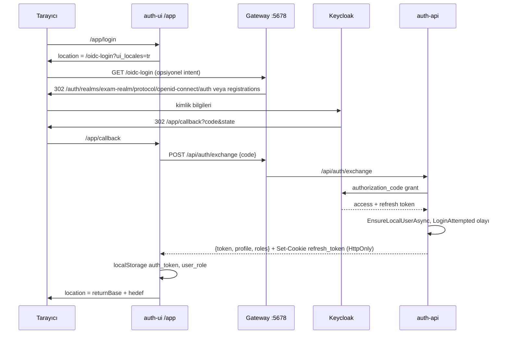

# `auth-ui/` — Giriş, kayıt ve OIDC callback uygulaması

Bu dosya, `/app/` yolu altında servis edilen küçük Angular uygulamasını (`auth-ui/`) anlatır: hangi sayfaları var, Keycloak ile nasıl konuştuğu (doğrudan değil, gateway ve auth-api üzerinden), OIDC callback'inde `code` → token takasının ve yönlendirmenin nasıl yapıldığı, token'ın ana uygulamaya (`ui/`) nasıl aktarıldığı, profil tamamlama (rol seçimi), çıkış, environment ve testler. Ana uygulamanın kimlik tarafı için [ui.md](ui.md) §10, Keycloak/rol modeli için [`../05-kimlik-yetki.md`](../05-kimlik-yetki.md), backend uçları için [auth-api.md](auth-api.md).

## İçindekiler

1. [Özet tablo](#1-özet-tablo)
2. [Neden ayrı bir uygulama ve nasıl servis ediliyor](#2-neden-ayrı-bir-uygulama-ve-nasıl-servis-ediliyor)
3. [Dizin yapısı](#3-dizin-yapısı)
4. [Routing](#4-routing)
5. [Keycloak ile konuşma: `/oidc-login` ve gateway](#5-keycloak-ile-konuşma-oidc-login-ve-gateway)
6. [Callback: kod takası ve yönlendirme](#6-callback-kod-takası-ve-yönlendirme)
7. [Token'ın ana uygulamaya aktarılması](#7-tokenın-ana-uygulamaya-aktarılması)
8. [Profil tamamlama (`complete-profile`)](#8-profil-tamamlama-complete-profile)
9. [Çıkış (`logout`)](#9-çıkış-logout)
10. [Eski form tabanlı login/register](#10-eski-form-tabanlı-loginregister)
11. [HTTP interceptor'ları](#11-http-interceptorları)
12. [Dil (ui_locales)](#12-dil-ui_locales)
13. [Environment ve konfigürasyon](#13-environment-ve-konfigürasyon)
14. [Testler](#14-testler)
15. [Doğrulanmadı](#15-doğrulanmadı)
16. [Ayrı issue adayları](#16-ayrı-issue-adayları)

---

## 1. Özet tablo

| Konu | Değer | Kaynak |
|---|---|---|
| Paket adı | `exam-app` (ui ile aynı ad) | `auth-ui/package.json:2` |
| Angular | 19.1.4, CLI 19.1.5, Material 19.1 | `auth-ui/package.json:14-26`, `:42-44` |
| Builder | `@angular-devkit/build-angular:application`, `baseHref: "/app/"` | `auth-ui/angular.json:22`, `:31` |
| Base href | `APP_BASE_HREF = '/app/'` | `auth-ui/src/app/app.config.ts:18` |
| SSR | Yok (yalnız `main.ts`) | `auth-ui/src/main.ts:1-6` |
| Dev port | 4200 (container içinde); host'ta 4201 (compose port eşlemesi), Aspire `start:aspire` → 4201 | `auth-ui/package.json:6-7`, `docker-compose.yml:274` |
| Gateway yolu | `/app/{everything}` → `auth-ui:4200` | `Services/Gateway/ocelot.json:286-295` |
| i18n | Yok (metinler Türkçe sabit); yalnız Keycloak dili için `ui_locales` | `auth-ui/src/app/services/locale-hint.service.ts` |
| Test | Karma + Jasmine, 12 spec dosyası | `auth-ui/angular.json:85-86` |

## 2. Neden ayrı bir uygulama ve nasıl servis ediliyor

`auth-ui`, oturum açmadan önce çalışan ekranları (login yönlendirmesi, OIDC callback, profil tamamlama, çıkış) ana uygulamadan ayırır. İki uygulama da **gateway'in tek origin'inden** servis edilir:

- `http://localhost:5678/app/*` → `auth-ui` (`Services/Gateway/ocelot.json:286-295`)
- `http://localhost:5678/*` → `angular-app` = `ui` (`Services/Gateway/ocelot.json:298-307`)

Aynı origin olduğu için iki uygulama aynı `localStorage`'ı görür; token aktarımı bu sayede çalışır (§7). `localhost:4201`'e doğrudan girmek bu paylaşımı ve göreli `/api/...` çağrılarını kırar.

| Ortam | Nasıl | Kaynak |
|---|---|---|
| docker-compose | `auth-ui` servisi, `dockerfiles/auth-ui/Dockerfile.auth-ui` (Node 20 + global CLI, `sleep infinity`), `./auth-ui:/app` bind mount, override'da `yarn install && yarn start`, port `4201:4200` | `docker-compose.yml:267-282`, `docker-compose.override.yml:27-28` |
| Aspire | `AddJavaScriptApp("auth-ui", "../auth-ui", "start:aspire")` + `WithNpm(install: false)`; gateway'e `AUTH_UI_HOST=localhost`, `AUTH_UI_PORT=4201` | `AppHost/AppHost.cs:821-840` |
| Prod | `deploy/dockerfiles/angular-spa.Dockerfile` (`APP_DIR=auth-ui`) → nginx | `deploy/docker-compose.prod.yml:433-442` |

`auth-ui/vite.config.js:3-11` `base: '/app/'`, `allowedHosts: ['angular-app','auth-ui']` tanımlar; Angular CLI dev-server'ının bu dosyayı okuyup okumadığı **Doğrulanmadı** (bkz. [ui.md](ui.md) §3). `auth-ui/src/index.html:5` `<base href="/">` içerir; build'de `angular.json` `baseHref: "/app/"` bunu ezer, `APP_BASE_HREF` provider'ı da router'ı `/app/`'e bağlar.

## 3. Dizin yapısı

```
auth-ui/
├── angular.json, package.json, package-lock.json, yarn.lock, vite.config.js
├── public/            # ui'den kopyalanmış görseller (çoğu kullanılmıyor)
└── src/
    ├── main.ts, index.html, styles.scss
    ├── environments/environment.ts, environment.prod.ts
    └── app/
        ├── app.config.ts, app.routes.ts, app.component.ts (yalnız <router-outlet>)
        ├── pages/
        │   ├── callback/          # OIDC dönüşü, kod takası, yönlendirme
        │   ├── login/             # /oidc-login'e yönlendirir
        │   ├── logout/            # oturumu kapatır, /login'e döner
        │   ├── complete-profile/  # rol seçimi + rol formu (Student/Teacher/Parent)
        │   ├── register/          # eski form tabanlı kayıt (§10)
        │   ├── landing/           # route'ta yok
        │   └── public/public-layout/
        ├── services/  auth.service.ts, locale-hint.service.ts, cache.service.ts, external-navigation.service.ts (boş dosya)
        ├── shared/    guards/auth.guard.ts, interceptors/{auth,auth-error}.interceptor.ts, utils/{request-url,http-error-message}.ts
        ├── models/registration.model.ts
        ├── state/app.state.ts
        └── home/      # route'ta yok
```

## 4. Routing

`auth-ui/src/app/app.routes.ts:9-22`. Tüm sayfalar `PublicLayoutComponent` çocuğudur; tarayıcıdaki tam yol `/app/<path>`'tir.

| Route (tarayıcı) | Komponent | Görev | Guard |
|---|---|---|---|
| `/app/callback` | `CallbackComponent` | `code` → token takası, rol bazlı yönlendirme | — |
| `/app/logout` | `LogoutComponent` | Yerel + sunucu oturumunu kapatır | — |
| `/app/register` | `RegisterComponent` | Eski form tabanlı kayıt (§10) | — |
| `/app/login` | `LoginComponent` | `/oidc-login?ui_locales=..`'e tam sayfa yönlendirme | — |
| `/app/complete-profile` | `CompleteProfileComponent` | Rolü olmayan hesap için rol seçimi + profil | — |
| `/app/**` | → `tests` | Bilinmeyen yol | — |

`authGuard` tanımlı (`auth-ui/src/app/shared/guards/auth.guard.ts:7-13`) ama hiçbir route'ta kullanılmıyor. `**` → `tests` yönlendirmesinde `auth-ui` içinde `tests` rotası yoktur (§16).

## 5. Keycloak ile konuşma: `/oidc-login` ve gateway

`auth-ui` Keycloak'a **doğrudan HTTP isteği atmaz** ve client secret taşımaz. Akış tarayıcı yönlendirmeleriyle ve auth-api (BFF) üzerinden yürür:

1. `LoginComponent.ngOnInit` tam sayfa navigasyonla `/oidc-login?ui_locales=<tr|en>`'e gider (`auth-ui/src/app/pages/login/login.component.ts:51-59`, `:92-102`).
2. Gateway, Ocelot'tan **önce** çalışan bir middleware'de `/oidc-login`'i yakalar ve Keycloak authorization endpoint'ine 302 döner (`Services/Gateway/Program.cs:175-219`):
   - `client_id` = `Keycloak:ClientId` (varsayılan `exam-client`), `redirect_uri` = `Keycloak:RedirectUri` (varsayılan `<Server:BaseUrl>/app/callback`; `Services/Gateway/appsettings.json:21`), `response_type=code`, `scope=openid`.
   - `state` = `Server:BaseUrl` (dönüş tabanı). `?intent=student|teacher|parent` gelirse `state = "<BaseUrl>~<intent>"` olur ve uç `auth` yerine `registrations` olur (Keycloak'ın kayıt formu) (`Services/Gateway/Program.cs:197-212`). Landing navbar'ındaki kayıt linkleri bunu kullanır (`ui/src/app/pages/public/landing/navbar/navbar.component.html:48-50`).
   - Not: `ui_locales` gibi diğer query parametreleri bu middleware tarafından Keycloak URL'ine **eklenmiyor**; yalnız `client_id`, `redirect_uri`, `response_type`, `scope`, `state` yazılıyor (`Services/Gateway/Program.cs:208-212`). `LoginComponent` yorumu (`login.component.ts:84-91`) Ocelot route'unun `AddQueriesToRequest: true` ile query'leri ilettiğini söylüyor (`Services/Gateway/ocelot.json:178-192`), ama middleware Ocelot'tan önce `return` ettiği için o route'a hiç ulaşılmıyor. Keycloak login ekranının dili bu nedenle `ui_locales`'ten değil başka bir kaynaktan (Keycloak locale cookie'si / tarayıcı) geliyor olabilir — **Doğrulanmadı**, §16.
3. Kullanıcı Keycloak'ta giriş yapar; Keycloak `/app/callback?code=...&state=...`'e döner.
4. `auth-ui` kodu `POST /api/auth/exchange` ile auth-api'ye verir; token takasını auth-api yapar (`auth-api/Controllers/AuthController.cs:523-600`).

PKCE yok ve `state` doğrulanmıyor — açık güvenlik issue'su **#347** (bkz. §16).



## 6. Callback: kod takası ve yönlendirme

`auth-ui/src/app/pages/callback/callback.component.ts:76-128`:

- `state` `~` ile ikiye ayrılır: `returnBase` ve `intent` (`student|teacher|parent`) (`:80-83`).
- `code` yoksa `/login`'e (auth-ui) döner (`:124-126`).
- `exchangeCodeForToken(code)` (`auth-ui/src/app/services/auth.service.ts:237-247`): önce önceki kullanıcının önbellek kalıntılarını siler (`clearCachedUser()`), `auth_token` ve `user_role = roles[0]` yazar. `user` profil kaydını **yazmaz**; ana uygulama ilk açılışta `refreshProfile()` ile çeker (bkz. [ui.md](ui.md) §10).
- Hedef seçimi (`:97-111`):

| Durum | Hedef |
|---|---|
| `roles` içinde `Admin` | `returnBase + '/admin/dashboard'` (issue #86) |
| `Student`/`Teacher`/`Parent` rollerinden biri var | `returnBase + '/dashboard'` |
| Uygulama rolü yok, `intent` var | `returnBase + '/app/complete-profile?role=<intent>'` |
| Uygulama rolü yok, `intent` yok | `returnBase + '/app/complete-profile'` |

  Navigasyon `window.location.href = (returnBase + dest) || '/login'` ile tam sayfa yapılır (`:111`); `returnBase` doğrulanmadan kullanıldığı için açık yönlendirme riski vardır (#347).
- Hata: `httpErrorMessage()` ile backend'in yerelleştirilmiş `message`'ı snackbar'da gösterilir, 2 sn sonra `/login` (`:113-122`; `auth-ui/src/app/shared/utils/http-error-message.ts:7-18`).
- `checkUserSession()` (`:64-74`) hiçbir yerden çağrılmıyor (ölü kod) ve `console.log('Unknown role')` basıyor. `:84`'teki `console.log('Callback params:', params, ...)` `code`'u konsola yazar (#347 kabul kriterinde kaldırılması isteniyor).

## 7. Token'ın ana uygulamaya aktarılması

Aktarım için ayrı bir mekanizma (postMessage, query string, cookie) yoktur: **aynı origin `localStorage`** kullanılır.

| Anahtar | auth-ui yazar | ui okur |
|---|---|---|
| `auth_token` | `exchangeCodeForToken` (`auth.service.ts:242`), `login` (`:78`), `applyRefreshedSession` (`:269`), complete-profile `applySession` (`complete-profile.component.ts:274-277`) | `ui` interceptor'ları, SignalR `accessTokenFactory`, `AuthService.getToken()` |
| `user_role` | `exchangeCodeForToken` (`:243`), `applySession` (`:278`) | `ui` `EnhancedLayoutComponent`, eski `hasRole()` |
| `user` | `login` (`:81`), `applySession` (yalnız önbellek aynı kullanıcıya aitse merge; `:280-296`) | `ui` `AuthService.user` signal |
| `app-locale` | `LocaleHintService.rememberPreferredLocale` (`locale-hint.service.ts:49-60`) | `ui` `LocaleService` |
| Cookie `refresh_token` | auth-api `Set-Cookie` (HttpOnly; JS göremez) | `ui` `POST /api/auth/refresh-token` (`withCredentials`) |

Önbellek tutarlılığı: `isCachedUserCurrent()` JWT `sub` ile `user.keycloakId`'yi karşılaştırır (`auth-ui/src/app/services/auth.service.ts:205-224`); A çıkıp B girdiğinde eski profil başlıkta görünmesin diye (issue #22). Aynı mantık `ui`'de de var.

## 8. Profil tamamlama (`complete-profile`)

`auth-ui/src/app/pages/complete-profile/complete-profile.component.ts`:

- Rol belirleme (`:93-109`): önce `?role=` intent'i, yoksa JWT'de zaten atanmış realm rolü (admin tarafından yaratılmış / yarım kalmış kayıt). İkisi de yoksa adım 1'de rol seçici açılır.
- Okul ve sınıf listeleri anonim uçlardan gelir: `GET /api/school`, `GET /api/exam/worksheet/grades` (`auth-ui/src/app/services/auth.service.ts:99-106`).
- Gönderim (`:251-270`, servis `auth.service.ts:108-125`):

| Rol | Uç | Gövde |
|---|---|---|
| Student | `POST /api/exam/student/register` | `studentNumber`, `schoolId`, `gradeId` |
| Teacher | `POST /api/exam/teacher/register` | `schoolId` (bağımsızsa `null`), `isIndependentTutor` |
| Parent | `POST /api/exam/parent/register` | `{}` |

  Bu uçlar realm rolünü atar, profil satırını oluşturur ve oturum cookie'sini yeniler; yanıttaki `accessToken` (yeni rol içeren) `auth_token`'a yazılır (`applySession`, `:272-297`).
- Başarı: Parent → `/dashboard`, diğerleri → `/tests` (tam sayfa, `:197`).
- Özel durumlar (`:181-241`):
  - Teacher + `teacherAccountApproved === false` → hesap onayı bekleniyor kartı; "Devam" → `/teacher-approval-pending` (issue #287; sabit `:22`, `:120-126`).
  - Teacher + `schoolApprovalPending` → okul onayı bilgilendirme kartı (issue #234).
  - Teacher 429 → reddedilen okul talebinden sonra 24 saat bekleme mesajı (issue #277).
  - Teacher 409 → mevcut kaydın okulu/bağımsızlığı değiştirilemez (#234). Student 409 gövdeli → sunucu mesajı (#259). Gövdesiz 409 → "zaten tamamlanmış", yönlendir.
  - 404 → hesap profili çözülemedi, formda kal (#255). 401 → `/login`.

Ana uygulamada da benzer bir rol sihirbazı vardır (`ui` `/register`, `RegisterWizardComponent`; `ui/src/app/app.routes.ts:79`); `ui` profil eksik olduğunda oraya yönlendirir. İki akışın ilişkisi ve hangisinin kanonik olduğu **Doğrulanmadı**.

## 9. Çıkış (`logout`)

- `ui`'deki menüden çıkış `window.location.href = '/app/logout'` (`ui/src/app/components/enhanced-layout/enhanced-layout.component.ts:526`).
- `LogoutComponent` (`auth-ui/src/app/pages/logout/logout.component.ts:38-69`): adım animasyonu, sonra `AuthService.logout()` beklenir, ardından `/login` (auth-ui) → `/oidc-login`.
- `AuthService.logout()` (`auth-ui/src/app/services/auth.service.ts:132-157`): token'ı önce alır, `auth_token`, `user_role`, `user_avatar`, `user`, `student` anahtarlarını **senkron** siler, sonra `POST /api/exam/auth/logout`'u Authorization başlığını elle ekleyerek best-effort dener (2 sn timeout, hata yutulur). Sunucu logout'u beklenir ki Keycloak oturumu kapanmadan `/oidc-login`'e gidilip sessizce yeniden giriş yapılmasın (`logout.component.ts:58-60`).

## 10. Eski form tabanlı login/register

- `LoginComponent`'te form alanları ve `onSubmit()` (`/api/auth/login` ile password-grant BFF çağrısı) hâlâ duruyor ama şablon yalnız "Giriş yapılıyor..." metnidir (`login.component.ts:26-27`, `:104-123`); form kullanılmıyor. `onSubmit` rolü sabit `'Student'` alıyor (`:110`).
- `RegisterComponent` (`/app/register`) `POST /api/auth/register` ile ad/soyad/e-posta/şifre/rol gönderir; yanıt e-postanın kayıtlı olup olmadığını belli etmez (issue #240) (`auth-ui/src/app/pages/register/register.component.ts:56-96`). auth-api tarafındaki yoruma göre Keycloak-native kayıt artık bu ucu kullanmıyor (`auth-api/Controllers/AuthController.cs:572-574`); bu sayfanın UI'dan linklenip linklenmediği **Doğrulanmadı** (`ui` içinde `/app/register` linki bulunmadı).
- `auth.service.ts:53-74`'te doğrudan Keycloak token endpoint'ine password grant yapan **yorum satırına alınmış** eski kod var; client secret yer tutucu olarak geçiyor, gerçek değer yok.

## 11. HTTP interceptor'ları

`auth-ui/src/app/app.config.ts:19`: `authInterceptor`, `authErrorInterceptor`.

| Interceptor | Davranış | Kaynak |
|---|---|---|
| `authInterceptor` | Cross-origin'e dokunmaz. Exclude (pathname tam eşleşme): `/api/auth/refresh-token`, `/api/auth/login`, `/api/auth/register`, `/api/auth/exchange`, `/api/exam/auth/logout` → yalnız `withCredentials`. Diğerlerinde token varsa ve 200 sn içinde doluyorsa `refreshToken()`, sonra Bearer ekler. **Token yoksa `ui`'deki gibi logout çağırmaz** (anonim sayfalar) | `auth-ui/src/app/shared/interceptors/auth.interceptor.ts:12-69` |
| `authErrorInterceptor` | 401'de (`/api/auth/login`, `/api/auth/exchange` hariç) `/login`'e navigasyon; refresh denemez | `auth-ui/src/app/shared/interceptors/auth-error.interceptor.ts:11-30` |

`request-url.util.ts` `ui`'deki dosyanın kopyasıdır (`auth-ui/src/app/shared/utils/request-url.util.ts`); birlikte güncellenmeli. `auth-error.interceptor`'ın kimlik ucu kontrolü ise hâlâ `endsWith` kullanıyor (`:13-16`).

`refreshToken()` (`auth-ui/src/app/services/auth.service.ts:293-305`) `ui`'deki tek uçuş (single-flight) korumasına sahip değildir ve hata durumunda `localStorage.clear()` çağırır (dil ve renk şeması tercihleri de silinir) — §16.

## 12. Dil (ui_locales)

`auth-ui`'de Transloco yoktur. `LocaleHintService` (`auth-ui/src/app/services/locale-hint.service.ts:32-98`) Keycloak login ekranının dilini seçer: `localStorage['app-locale']` → `navigator.languages` → `'tr'`. Desteklenen kodlar `['tr','en']` elle tutulur (`:11`); `ui/src/app/models/locale.ts` ve backend `SupportedLocales` ile senkron kalmalı. `kc_locale` bilinçli olarak kullanılmıyor (session'sız ilk istekte yok sayılıyor) (`login.component.ts:84-91`). Gateway middleware'inin `ui_locales`'i Keycloak'a iletip iletmediği için §5 ve §16'ya bakın.

## 13. Environment ve konfigürasyon

- `auth-ui/src/environments/environment.ts:1-4` (`apiUrl: http://localhost:5079/api`) ve `environment.prod.ts:1-4`. **Hiçbir yerde kullanılmıyor**; tüm çağrılar göreli `/api/...` (grep: `environment` import'u yok).
- Uygulama tarafında başka konfigürasyon yok. OIDC parametreleri (realm, client, redirect URI, base URL) gateway'dedir: `Services/Gateway/appsettings.json:14-24` (`Keycloak:Realm`, `ClientId`, `RedirectUri`, `ClientCallbackUrl`), `Server:BaseUrl` (`Services/Gateway/ocelot.json:312`); prod'da `deploy/docker-compose.prod.yml:245`, `:460` (`PUBLIC_BASE_URL`). Gateway ayrıntısı: [gateway.md](gateway.md).
- Keycloak'ta `exam-client`'in izinli redirect URI'leri realm export'undadır (`deploy/keycloak/import/realm-export.json`); ayrıntı [`../05-kimlik-yetki.md`](../05-kimlik-yetki.md).

## 14. Testler

12 spec dosyası (`find auth-ui/src -name "*.spec.ts"`):

| Spec | Kapsam |
|---|---|
| `pages/callback/callback.component.spec.ts` | Rol/intent bazlı hedef seçimi, hata yolu |
| `pages/complete-profile/complete-profile.component.spec.ts` (522 satır) | Rol belirleme, rol başına istek, 409/429/404/401 dalları, onay kartları |
| `pages/login/login.component.spec.ts` | `/oidc-login` + `ui_locales` yönlendirmesi (`redirect()` spy'lanır) |
| `pages/register/register.component.spec.ts`, `pages/public/public-layout/...spec.ts`, `home/home.component.spec.ts`, `app.component.spec.ts` | Oluşturma / temel |
| `services/auth.service.spec.ts` (345 satır) | Oturum anahtarları, logout, exchange, refresh |
| `services/locale-hint.service.spec.ts` | Dil önceliği |
| `shared/interceptors/auth.interceptor.spec.ts`, `auth-error.interceptor.spec.ts` | Exclude listeleri, cross-origin, 401 |
| `shared/utils/http-error-message.spec.ts` | Mesaj çıkarımı |

Çalıştırma: `cd auth-ui && npx ng test --watch=false --browsers=ChromeHeadless`. Bilinen tuzak (agent hafızası `auth-error-interceptor-exclude`): `complete-profile` `imports: [MatSnackBarModule]` kendi `MatSnackBar`'ını sağlar; spy için `spyOn(fixture.debugElement.injector.get(MatSnackBar), 'open')` kullanın. Tam test koşusunun geçtiği **Doğrulanmadı** (bu doküman için koşturulmadı).

## 15. Doğrulanmadı

- `auth-ui/vite.config.js`'in Angular CLI dev-server tarafından okunup okunmadığı.
- Keycloak login ekranının dilinin gerçekte nereden belirlendiği (`ui_locales` gateway middleware'inde düşüyor görünüyor, §5).
- `auth-ui` `**` → `tests` yönlendirmesinin çalışma anındaki davranışı (döngü / hata) (§4, §16).
- `/app/register` sayfasına UI'dan bir link olup olmadığı ve `ui` `/register` sihirbazı ile `auth-ui` `complete-profile`'ın hangisinin kanonik olduğu (§8, §10).
- Spec'lerin tamamının geçtiği (§14).

## 16. Ayrı issue adayları

1. **Açık yönlendirme + PKCE yok + `state` doğrulanmıyor + `code` loglanıyor** — `auth-ui/src/app/pages/callback/callback.component.ts:80-111`, `:84`. Zaten açık: **#347**.
2. **`LoginComponent` yanlış localStorage anahtarını okuyor** — `auth-ui/src/app/pages/login/login.component.ts:52` `access_token` okur; uygulama token'ı `auth_token`'da tutar (`auth-ui/src/app/services/auth.service.ts:41`). "Geçerli token varsa doğrudan `/dashboard`" dalı hiçbir zaman çalışmaz; oturumu açık kullanıcı da her seferinde Keycloak'a gider (Keycloak SSO cookie'si varsa sessizce döner). Eşleşen issue bulunamadı.
3. **`/oidc-login` middleware'i `ui_locales`'i Keycloak'a iletmiyor** — `Services/Gateway/Program.cs:208-212` yalnız sabit parametreleri yazar; `login.component.ts:84-91` yorumu ve issue #186'nın varsaydığı Ocelot `AddQueriesToRequest` route'u (`Services/Gateway/ocelot.json:178-192`) middleware `return` ettiği için hiç çalışmaz. **Doğrulanmadı** (canlı denenmedi); doğrulanırsa Keycloak ekranı tercih edilen dilde açılmıyor demektir.
4. **`**` → `tests` yönlendirmesi auth-ui'de var olmayan rotaya** — `auth-ui/src/app/app.routes.ts:21`. `/app/tests` yine `**`'a düşer (olası yönlendirme döngüsü veya router hatası). `ui`'nin `/tests`'i kastedildiyse tam sayfa navigasyon gerekir.
5. **`refreshToken()` tek uçuş değil ve `localStorage.clear()` çağırıyor** — `auth-ui/src/app/services/auth.service.ts:293-305`. Paralel isteklerde refresh token rotasyonu birbirini geçersiz kılabilir (ui'de #241 ile çözülen sorun); hata yolunda kullanıcının `app-locale` ve `color-scheme` tercihleri de silinir.
6. **Ölü kod** — `checkUserSession()` (`callback.component.ts:64-74`), kullanılmayan `authGuard`, `landing/`, `home/`, boş `services/external-navigation.service.ts`, `services/cache.service.ts` (304 satır, referans yok — grep), kullanılmayan `environment` dosyaları, `public/` altındaki ui kopyası görseller; ayrıca `package.json` `ui` ile aynı paket adını (`exam-app`) ve gereksiz bağımlılıkları (ngrx, ngx-charts, quill, xlsx, signalr) taşıyor (`auth-ui/package.json:2`, `:14-39`).
7. **Dev Dockerfile'da `npm set strict-ssl false`** — `dockerfiles/auth-ui/Dockerfile.auth-ui:8` (ui ile aynı; bkz. [ui.md](ui.md) §21).
