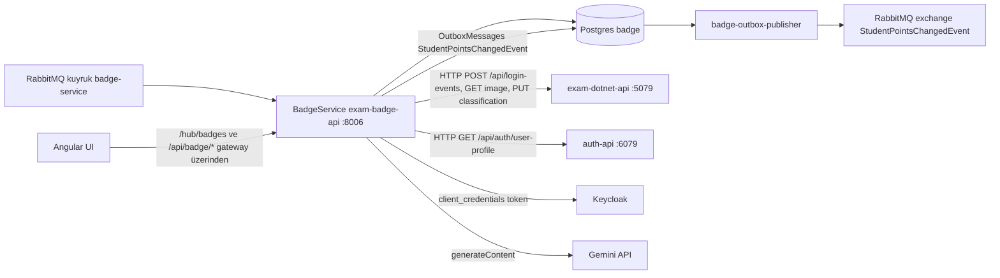
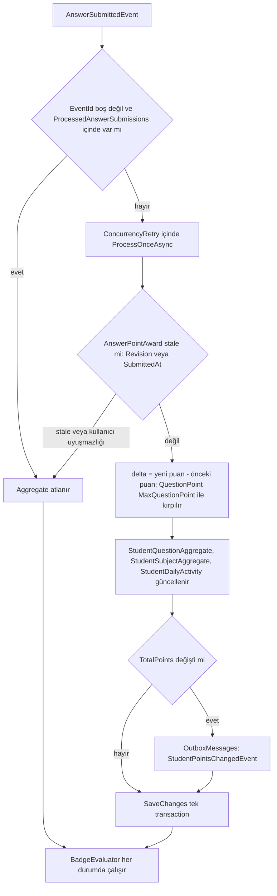

# BadgeService (`Services/BadgeService`)

**Bu dosya neyi anlatır:** `Services/BadgeService` projesinin (Aspire/compose kaynak adı `exam-badge-api`) iç yapısını anlatır. Adı yanıltıcıdır: yalnız rozet hesaplamaz, exam API ve auth-api'nin outbox'ından gelen **neredeyse tüm** olayları tüketir. Bunlar puan/rozet toplama, uygulama içi bildirimler (SignalR + `Notifications` tablosu), login audit köprüsü, dil tercihi kopyası ve Gemini ile soru sınıflandırmadır. Tek istisna `StudentPointsChangedEvent`; onu exam API tüketir. Kaynak: `.claude/rules/architecture.md:9` ve `.claude/rules/architecture.md:13`. Olay listesinin tamamı, kimin yayınladığı ve RabbitMQ izin matrisi [06-asenkron-akislar.md](../06-asenkron-akislar.md) dosyasındadır. Burada servis seviyesinde kalınır.

## İçindekiler

1. [Özet kart](#özet-kart)
2. [Dizin yapısı](#dizin-yapısı)
3. [Program.cs: başlangıç sırası](#programcs-başlangıç-sırası)
4. [MassTransit kurulumu](#masstransit-kurulumu)
5. [Consumer tablosu](#consumer-tablosu)
6. [Puan ve aggregate hesabı](#puan-ve-aggregate-hesabı)
7. [Rozet kuralları](#rozet-kuralları)
8. [BadgeService'in kendi outbox'ı](#badgeservicein-kendi-outboxı)
9. [GeminiQuestionClassifier](#geminiquestionclassifier)
10. [SignalR hub'ı](#signalr-hubı)
11. [Controller'lar](#controllerlar)
12. [Security klasörü ve kimlik doğrulama](#security-klasörü-ve-kimlik-doğrulama)
13. [Arka plan işleri ve komut modu](#arka-plan-işleri-ve-komut-modu)
14. [Veritabanı ve migration'lar](#veritabanı-ve-migrationlar)
15. [Konfigürasyon anahtarları](#konfigürasyon-anahtarları)
16. [Testler](#testler)
17. [Sık yapılan değişiklikler için tarif](#sık-yapılan-değişiklikler-için-tarif)
18. [Doğrulanmadı](#doğrulanmadı)
19. [Ayrı issue adayları](#ayrı-issue-adayları)

---

## Özet kart

| Konu | Değer | Kanıt |
|---|---|---|
| Proje | `Services/BadgeService/BadgeService.csproj` (ASP.NET Core, net10.0) | `AppHost/ExamApp.AppHost.csproj:5` |
| Aspire kaynak adı | `exam-badge-api` | `AppHost/AppHost.cs:438` |
| HTTP portu | 8006 (Kestrel `ListenAnyIP`, varsayılan 8006) | `Services/BadgeService/Program.cs:59-64`, `AppHost/AppHost.cs:443-444` |
| Veritabanı | Postgres `badge` (AppHost kaynak adı `badgedb`) | `AppHost/AppHost.cs:26`, `AppHost/AppHost.cs:448` |
| RabbitMQ kullanıcısı | `badge_service` | `AppHost/AppHost.cs:57`, `AppHost/AppHost.cs:458-459` |
| Receive endpoint (kuyruk) | `badge-service` (hata kuyruğu `badge-service_error`) | `Services/BadgeService/Program.cs:238` |
| SignalR hub | `/hub/badges` | `Services/BadgeService/Program.cs:316` |
| Gateway önekleri | `/api/badge/{everything}` → `/api/{everything}`, `/hub/badges` (ws) | `Services/Gateway/ocelot.json:165-177`, `Services/Gateway/ocelot.json:21-37` |
| Bağımlılıklar (Aspire) | postgres, rabbitmq, minio, exam-dotnet-api, keycloak, auth-api | `AppHost/AppHost.cs:471-474`, `AppHost/AppHost.cs:717-718` |
| Senkron dış çağrılar | exam API (`ExamApi:BaseUrl`), auth-api (`AuthApi:BaseUrl`), Keycloak token ucu, Gemini | aşağıdaki bölümler |



## Dizin yapısı

| Yol | İçerik |
|---|---|
| `Program.cs` | Host kurulumu, DI, JWT, MassTransit, SignalR, migration + seed, komut modu |
| `BadgeDbContext.cs` | EF Core context, tüm tablo ve index tanımları |
| `Consumers/` | MassTransit consumer'ları ve her birinin `*ConsumerDefinition` sınıfı (retry/partition). Ayrıca yardımcılar: `CommentNotificationCoalescer`, `CommentHiddenNeutralizer`, `CommentNotificationSupport`, `NotificationRecipientResolver`, `BookingWhenText` |
| `Services/` | İş mantığı: `AnswerSubmissionAggregationService`, `BadgeEvaluator`, `BadgeRuleEvaluator`, `BadgeRuleTypeCatalog`, `BadgeDefinitionAdminService`, `ActivityAnalytics`, `StudentReportService`, `UserResetService`, `StudentPointsOutbox`, `GeminiQuestionClassifier`, `ServiceTokenProvider`, bildirim metni/lokalizasyon, retention servisleri, `ConcurrencyRetry` |
| `Entities/` | EF entity'leri (bkz. [Veritabanı](#veritabanı-ve-migrationlar)) |
| `Controllers/` | `BadgeDefinitionsAdminController`, `NotificationsController`, `ReportsController`, `ResetController` |
| `Hubs/BadgeNotificationHub.cs` | SignalR hub |
| `Security/` | Rol dönüştürücü, rapor IDOR kontrolü, SignalR query token kuralı, çağıran kimliği çözücü |
| `Commands/StudentPointsBackfillCommand.cs` | `backfill-student-points` CLI komutu |
| `Data/BadgeSeeder.cs` | Varsayılan rozet tanımları (insert-if-missing) |
| `Models/` | DTO'lar (rapor, admin, sınıflandırma sonucu) |
| `Resources/notifications.{tr,en}.json` | Bildirim metinleri; mekanizma `Services/BadgeService/Resources/README.md` içinde |
| `Migrations/` | 20 EF migration (`20250513125615_InitBadgeSchema` → `20260930152643_AddHiddenCommentTombstoneAndNotificationIndexes`) |
| `StartupConfigDump.cs` | Development'ta açılışta konfigürasyonu maskeleyerek konsola basar |
| `badge-samples.json` | Bir öğrencinin rapor çıktısına ait örnek JSON (`summary` + `badgeProgress`). Kod tarafından okunmaz; repo genelinde `badge-samples` adı hiçbir dosyada geçmiyor, csproj'da da yok (`Services/BadgeService/BadgeService.csproj`). Sadece referans/örnek veridir |
| `appsettings.json`, `appsettings.Development.json` | Konfigürasyon (Development dosyası repoda izleniyor; secret alanları boş) |
| `.devcontainer/`, `app.sln`, `nuget.config`, `msbuild.rsp`, `BadgeService.http` | Geliştirici kolaylıkları |

## Program.cs: başlangıç sırası

`Services/BadgeService/Program.cs` top-level statements kullanır. Sıra şöyledir:

1. **Komut modu tespiti** (`Program.cs:21-55`): argümanlarda `backfill-student-points` varsa komut parse edilir. Ortam guard'ı uygulanır (Production'da `--allow-production` yoksa çıkış yapılır, `--confirm` yoksa dry-run'a zorlanır). Komut argümanları `IConfiguration`'a sızmasın diye `WebApplication.CreateBuilder` boş args ile çağrılır (`Program.cs:37`).
2. `builder.AddServiceDefaults()` (`Program.cs:57`). OpenTelemetry, health check, standart resilience handler ve service discovery ekler; bkz. [service-defaults-apphost.md](service-defaults-apphost.md).
3. **Kestrel portu** `Kestrel:Port`, varsayılan 8006, `ListenAnyIP` (`Program.cs:59-64`). Bu yüzden AppHost portu sabitlemek zorundadır (`AppHost/AppHost.cs:439-444`).
4. Development'ta `StartupConfigDump.Print` (`Program.cs:66-69`). `Keycloak`, `ConnectionStrings`, `Redis`, `RabbitMQ`, `MinioConfig`, `QuestionAnalyzer`, `Server`, `Cors` bölümlerini sır maskeleyerek basar (`Services/BadgeService/StartupConfigDump.cs:15-25`, maskeleme `StartupConfigDump.cs:86-154`).
5. **Development dışı secret guard'ı** (`Program.cs:76-92`). `Keycloak:ClientSecret` / `Keycloak:AdminClientSecret` boşsa ya da `devOnly` önekiyle başlıyorsa açılışta `InvalidOperationException` fırlatılır.
6. DI kayıtları (`Program.cs:96-149`): controller'lar, Swagger, `IMemoryCache`, adlandırılmış `auth-api-caller-identity` HttpClient'ı (5 sn timeout), domain servisleri, Gemini, `AnswerPoints` / retention options (`ValidateOnStart`), JSON lokalizasyonu.
7. `BadgeDbContext`: Npgsql, `ConnectionStrings:DefaultConnection` (`Program.cs:152-155`).
8. JWT Bearer (`Program.cs:159-191`), `KeycloakRoleTransformer` (`Program.cs:197`), `Service` yetkilendirme politikası (`Program.cs:199-206`).
9. MassTransit (`Program.cs:210-267`); bkz. sonraki bölüm.
10. `AddSignalR()` (`Program.cs:271`).
11. Pipeline: Development'ta Swagger (`Program.cs:279-283`), `UseHttpsRedirection` (`Program.cs:286`), auth (`Program.cs:288-289`).
12. **Migration + seed her açılışta**: `Database.MigrateAsync()` ve ardından `BadgeSeeder.SeedAsync` (`Program.cs:291-297`). `badge-outbox-publisher`'ın Aspire'da `WaitFor(badgeService)` beklemesinin sebebi budur: `OutboxMessages` tablosunu bu migration yaratır (`AppHost/AppHost.cs:548-550`).
13. Komut modundaysa backfill çalışır ve süreç çıkış koduyla biter (`Program.cs:299-314`). Kestrel ve bus başlamaz.
14. `MapHub<BadgeNotificationHub>("/hub/badges")`, `MapControllers()`, `MapDefaultEndpoints()` (`Program.cs:316-318`). `/health` ve `/alive` yalnız Development'ta açılır (`ServiceDefaults/Extensions.cs:113-123`).

## MassTransit kurulumu

| Öğe | Değer | Kanıt |
|---|---|---|
| Transport | RabbitMQ, vhost `/`, host `RabbitMQ:Host` (port yok, 5672 varsayılır) | `Services/BadgeService/Program.cs:230-236`, port açıklaması `AppHost/AppHost.cs:66-70` |
| Kimlik bilgisi | `RabbitMQ:Username` / `RabbitMQ:Password`. **Boşsa `guest` / `guest`'e düşer** | `Services/BadgeService/Program.cs:234-235` |
| Receive endpoint | Tek endpoint `badge-service`. 17 consumer bağlı | `Services/BadgeService/Program.cs:238-265` |
| Fault yayını | `e.PublishFaults = false`. Hata alan mesaj yalnız `badge-service_error` kuyruğuna gider; `Fault<T>` publish edilmez (en az yetki, #279) | `Services/BadgeService/Program.cs:240-243`, `rabbitmq/definitions.json` içindeki `badge_service` izin yorumu |
| Global retry / redelivery | **Yok.** Endpoint seviyesinde `UseMessageRetry` / `UseDelayedRedelivery` / `UseInMemoryOutbox` çağrısı yok. Retry yalnız consumer definition'larında | `Services/BadgeService/Program.cs:210-267` |
| Consumer bazlı retry | Çoğu definition `r.Immediate(3)`. `AnswerSubmittedConsumerDefinition` 1 sn / 5 sn / 15 sn aralıklı ve partition'lı | aşağıdaki tablo |
| Partition | `AnswerSubmittedEvent` UserId'ye göre 8 partition (aynı kullanıcı sıralı işlenir) | `Services/BadgeService/Consumers/AnswerSubmittedConsumerDefinition.cs:27-44` |
| Kayıt tutarlılık testi | Her `IConsumer<T>` için `Program.cs`'de `ConfigureConsumer<T>` bulunduğunu kaynak metin üzerinden doğrular | `tests/BadgeService.Tests/ProgramConsumerWiringTests.cs` |

> **Yeni consumer eklerken iki adım gerekir.** `x.AddConsumer<...>()` (`Program.cs:212-228`) ve `e.ConfigureConsumer<...>(context)` (`Program.cs:246-264`). Biri eksik kalırsa mesaj hiç tüketilmez; #157'de bu yaşandı. `ProgramConsumerWiringTests` bu durumu yakalar. Ayrıca `rabbitmq/definitions.json` içindeki `badge_service` `configure`/`read` regex'ine yeni exchange eklenmelidir, yoksa bind başarısız olur. Ayrıntı için [06-asenkron-akislar.md](../06-asenkron-akislar.md).

## Consumer tablosu

Kısaltmalar: **N** = `Notifications` tablosuna satır, **SR** = SignalR push. Bütün consumer'lar `badge-service` endpoint'indedir. Tüketilen event'lerin sözleşmeleri `api/ExamApp.Foundation/Contracts/` altındadır. Hangi servisin yayınladığı da yazılmıştır: exam API (worksheet DB outbox → `exam-outbox-publisher`) veya auth-api (identity DB outbox → `identity-outbox-publisher`).

| Consumer (dosya:satır) | Event | Yayınlayan | Ne yapar | Yazdığı tablo(lar) | Dış çağrı / SignalR | Retry (definition) |
|---|---|---|---|---|---|---|
| `Consumers/AnswerSubmittedConsumer.cs:37` | `AnswerSubmittedEvent` | exam API | Puan/istatistik aggregate'lerini günceller (`AnswerSubmissionAggregationService.ProcessAsync`), ardından **her teslimde** rozetleri değerlendirir (`BadgeEvaluator.EvaluateAnswerSubmittedAsync`) (`AnswerSubmittedConsumer.cs:48-58`) | `ProcessedAnswerSubmissions`, `AnswerPointAwards`, `StudentQuestionAggregates`, `StudentSubjectAggregates`, `StudentDailyActivities`, `OutboxMessages` (`StudentPointsChangedEvent`), `StudentBadgeProgresses`, `BadgeEarned`, `Notifications` (`BadgeEarned`) | SR `BadgeEarned` → `Clients.User(ClientId)` (`Services/BadgeEvaluator.cs:147-155`) | 1s/5s/15s + 8 partition (`AnswerSubmittedConsumerDefinition.cs:36-40`) |
| `Consumers/QuestionCreatedConsumer.cs:8` | `QuestionCreatedEvent` | exam API | `QuestionAnalyzer:AIActive` false ise atlar (`QuestionCreatedConsumer.cs:21`, `:31-35`). `ClassificationSource == "AI"` ise atlar (`:38-42`). Aksi halde Gemini ile sınıflandırır (`:46`) | yok (BadgeService DB'ye yazmaz) | exam API `GET /api/questions/classifier-cache`, `GET /api/questions/{id}/image`, `PUT /api/questions/{id}/classification`; Gemini `generateContent` | **Definition yok** (`Program.cs:213`). Retry yok, hata doğrudan `badge-service_error` |
| `Consumers/WorksheetReminderDueConsumer.cs:21` | `WorksheetReminderDueEvent` | exam API (Hangfire hatırlatma işi) | Öğrenciye hatırlatma bildirimi. Idempotency `(Type, SourceReminderId)` | `Notifications` (Type `WorksheetReminderDue`, `:23`, `:79`) | SR `ReminderDue` → `Clients.User(UserKeycloakId)` (`:101`) | Immediate(3) (`WorksheetReminderDueConsumerDefinition.cs:20`) |
| `Consumers/WorksheetAccessRequestedConsumer.cs:21` | `WorksheetAccessRequestedEvent` | exam API | Sınav sahibine "atama izni talebi" bildirimi | `Notifications` (Type `WorksheetAccessRequested`, `SourceAccessRequestId`) (`:23`, `:81`) | SR `AccessRequestUpdate` → `Clients.User(TargetKeycloakId)` (`:103`) | Immediate(3) |
| `Consumers/WorksheetAccessDecisionConsumer.cs:25-27` | `WorksheetAccessRequestApprovedEvent`, `WorksheetAccessRequestRejectedEvent` | exam API | Talebi yapan öğretmene onay/ret bildirimi. Tek sınıf, iki `Consume` | `Notifications` (Type `WorksheetAccessApproved` / `WorksheetAccessRejected`) (`:29-30`, `:108`) | SR `AccessRequestUpdate` (`:131`) | Immediate(3) |
| `Consumers/LoginAttemptedConsumer.cs:31` | `LoginAttemptedEvent` | auth-api | Köprü: exam API'ye `POST /api/login-events` yazar (servis token'ıyla). Kalıcı kayıt exam API'dedir (`:69-101`). PII (`AttemptedIdentifier`) ledger'a ve exception mesajına konmaz | `ProcessedLoginAttempts` (EventId unique, POST başarılı olduktan sonra) (`:103-127`) | exam API `POST /api/login-events` (`:92`) | Immediate(3) |
| `Consumers/TeacherApplicationSubmittedConsumer.cs:26` | `TeacherApplicationSubmittedEvent` | exam API | Bağımsız öğretmen başvurusu → admin bildirimi | `Notifications` (Type `TeacherApplicationSubmitted`, `SourceTeacherApplicationId`) (`:28`, `:84`) | SR `TeacherApplicationSubmitted` → `Clients.Group("role:Admin")` (`:103`) | Immediate(3) |
| `Consumers/TeacherApplicationDecisionConsumer.cs:28` | `TeacherApplicationDecidedEvent` | exam API | Başvuru sahibine onay/ret bildirimi. Ret gerekçesi ve admin kimliği metne konmaz | `Notifications` (Type `TeacherApplicationApproved` / `TeacherApplicationRejected`, `SourceEventId`) (`:30-31`, `:101-102`) | SR `TeacherApplicationDecided` → `Clients.User(TargetKeycloakId)` (`:122`) | Immediate(3) |
| `Consumers/TeacherSchoolRequestSubmittedConsumer.cs:31` | `TeacherSchoolRequestSubmittedEvent` | exam API | Okul bağlantısı talebi → admin bildirimi. Dedup `(Type, SourceEventId)` | `Notifications` (Type `TeacherSchoolRequestSubmitted`) (`:33`, `:97-98`) | SR `TeacherSchoolRequestSubmitted` → admin grubu (`:118`) | Immediate(3) (definition aynı dosyada, `:144-151`) |
| `Consumers/IndependentTeacherRegisteredConsumer.cs:29` | `IndependentTeacherRegisteredEvent` | exam API | **Bilinçli olarak yalnız log** yazar. Bildirim ve SignalR yoktur (`:6-17`) | yok | yok | Immediate(3) |
| `Consumers/BookingRequestCreatedConsumer.cs:22` | `BookingRequestCreatedEvent` | exam API | Öğretmene randevu talebi bildirimi | `Notifications` (Type `BookingRequestCreated`, `SourceBookingId`) (`:24`, `:80`) | SR `BookingUpdate` → `Clients.User(TargetKeycloakId)` (`:102`) | Immediate(3) |
| `Consumers/BookingDecisionConsumer.cs:22` | `BookingDecisionEvent` | exam API | Öğrenciye onay/ret bildirimi. Alıcı sub'ı gerekirse `NotificationRecipientResolver` ile çözülür (`:69`) | `Notifications` (Type `BookingApproved` / `BookingRejected`) (`:24-25`, `:98`) | SR `BookingUpdate` (`:119`) | Immediate(3) |
| `Consumers/BookingTeacherUnavailableConsumer.cs:27` | `BookingTeacherUnavailableEvent` | exam API (öğretmen askıya alınınca, öğrenci başına) | "Öğretmen geçici olarak müsait değil" bildirimi. Metinde öğretmen adı ve neden yok | `Notifications` (Type `BookingTeacherUnavailable`, `SourceEventId`) (`:29`, `:88`) | SR `BookingUpdate` (kind `teacherUnavailable`) (`:32`, `:106`) | Immediate(3) |
| `Consumers/UserPreferredLocaleChangedConsumer.cs:26` | `UserPreferredLocaleChangedEvent` | auth-api (kayıt, `PUT /me/locale`); exam API seed komutları da yazar | Dil tercihini yerel kopyaya upsert eder. Eski event yeniyi ezmez (`ChangedAtUtc` karşılaştırması) (`:55-83`) | `UserLocalePreferences` | yok | Immediate(3) |
| `Consumers/WorksheetCommentCreatedConsumer.cs:21` | `WorksheetCommentCreatedEvent` | exam API | Öğretmene yorum bildirimi. `CommentNotificationCoalescer` ile (alıcı, Type, RootCommentId) başına tek okunmamış satıra birleştirir (`:50`, `:78`). Yorum gizliyse metni nötrler (`:94-97`) | `Notifications`, `NotificationEventLogs` | SR `WorksheetCommentCreated` (`:102`) | Immediate(3) |
| `Consumers/WorksheetCommentRepliedConsumer.cs:18` | `WorksheetCommentRepliedEvent` | exam API | Kök yorumun öğrenci yazarına cevap bildirimi. Birleştirme ve nötrleme aynıdır (`:50`, `:90`, `:106-109`) | `Notifications`, `NotificationEventLogs` | SR `WorksheetCommentReplied` (`:114`) | Immediate(3) |
| `Consumers/WorksheetCommentHiddenConsumer.cs:21` | `WorksheetCommentHiddenEvent` | exam API (moderasyon) | Önce tombstone yazar, sonra o yoruma işaret eden bildirimlerin başlık/gövdesini nötr metne çevirir (okunmuşlar dahil) (`:45-47`). Sıra bozulmasında Created/Replied tombstone'a bakar | `HiddenCommentTombstones`, `Notifications` (UPDATE) | yok | Immediate(3) |

Ortak bildirim deseni (Booking/Worksheet/Teacher consumer'ları):
- Önce `AnyAsync` ile duplicate kontrolü yapılır (ör. `BookingRequestCreatedConsumer.cs:52`).
- Ardından `Notifications.Add` + `SaveChangesAsync` çalışır. Eşzamanlı ikinci teslim `Notifications` üzerindeki filtreli unique index'e takılır ve no-op olur (`BadgeDbContext.cs:119-155`).
- Satır commit edildikten sonra SignalR push yapılır.
- Metinler `INotificationTextFactory` + `Resources/notifications.<dil>.json` dosyalarından, alıcının `UserLocalePreference` kaydına göre seçilir (`Program.cs:143-149`).
- Alıcı Keycloak sub'ı event'te gelir. Gelmezse `NotificationRecipientResolver` önce `UserLocalePreferences`, sonra eski `Notifications` satırlarına bakar (`Consumers/NotificationRecipientResolver.cs:12-41`). Çözülemezse exception fırlatılır ve mesaj retry'a girer.
- Notification idempotency index'i global `(Type, SourceEventId)` olduğundan bildirim event'leri tek alıcı taşır. Birden çok alıcı varsa üretici her alıcı için ayrı event yazar. Kaynak: `C:/Users/mustafa.sahin/examapp/.claude/agent-memory/event-integration-dev/project_notification-event-single-recipient.md` (agent hafızası, repoda değil).

## Puan ve aggregate hesabı

Akış: `AnswerSubmittedConsumer` → `AnswerSubmissionAggregationService.ProcessAsync` (`Services/AnswerSubmissionAggregationService.cs:72-94`).



Kurallar:
- **Katman 1, EventId dedup.** `ProcessedAnswerSubmissions` ledger'ı kullanılır (`Services/AnswerSubmissionAggregationService.cs:74-83`, `:130-138`). Yalnız `PK_ProcessedAnswerSubmissions` ihlali duplicate sayılır. Diğer unique ihlalleri yukarı fırlatılır (`:262-269`).
- **Katman 2, "soru başına bir kez, son cevap sayılır" (#279).** `AnswerPointAwards` satırı `(TestInstanceId, QuestionId)` anahtarıyla tutulur. Önce `Revision` (exam API'de atomik sayaç), o yoksa `SubmittedAt` karşılaştırılır. Gelecek tarihli (>5 dk) `SubmittedAt` reddedilir (`:167-250`).
- **Puan.** Doğru cevapta `min(QuestionPoint, AnswerPoints:MaxQuestionPoint)`, yanlışta 0. Aggregate'e yalnız **delta** uygulanır (`:213-224`, `:307`). Varsayılan tavan 100'dür (`Services/AnswerPointOptions.cs:21`, `appsettings.json:17-19`).
- **Sayaçlar.** `TotalQuestions`, `CorrectQuestions` ve streak "son cevap" kuralına tabi değildir; stale olmayan her mesajda artar (`:57-63`, `:289-304`).
- **Günlük aktivite skoru** `QuestionCount*10 + CorrectCount*5 + min(dakika, 60)` formülüyle hesaplanır (`:399-408`).
- **Yatay ölçek.** Aggregate tablolarında Postgres `xmin` concurrency token'ı vardır (`BadgeDbContext.cs:88-98`). `ConcurrencyRetry` varsayılan 3 deneme yapar (`Services/ConcurrencyRetry.cs`).
- Rapor uçları bu aggregate'leri `StudentReportService` ve `ActivityAnalytics` (streak/aktif gün) ile okur.

## Rozet kuralları

- Rozetler tablo güdümlüdür (`BadgeDefinitions`). Kural tipi `RuleType` ve JSON `RuleConfigJson` ile tanımlanır.
- `BadgeEvaluator.EvaluateAnswerSubmittedAsync` (`Services/BadgeEvaluator.cs:40-156`) şu sırayla çalışır:
  1. Yalnız `IsActive` tanımları okur. Cache yoktur; admin değişikliği bir sonraki değerlendirmede geçerli olur (`:58-64`).
  2. `StudentBadgeProgress` satırlarını günceller.
  3. Kazanılan rozet için `BadgeEarned` ve `Notifications` (Type `BadgeEarned`) satırlarını aynı `SaveChanges`'te yazar (`:133-145`).
  4. Commit sonrası SignalR `BadgeEarned` gönderir (`:147-155`).
- Kazanılmış bir rozet, eşik sonradan yükseltilse bile geri alınmaz (`:110-115`).
- Kural tipleri `BadgeRuleEvaluator.TryEvaluateRule` içinde değerlendirilir (`Services/BadgeRuleEvaluator.cs:11-141`):

| RuleType (büyük/küçük harf duyarsız) | Config alanları | Mevcut değer |
|---|---|---|
| `AnswerCount` | `target` \| `count` | `StudentQuestionAggregate.TotalQuestions` |
| `CorrectStreak` | `target` \| `streak` | `BestCorrectStreak` |
| `TotalStudyTimeMinutes` | `target` \| `minutes` \| `targetMinutes` | `TotalTimeSeconds / 60` |
| `TotalCorrectAnswers` | `target` \| `count` \| `correct` | `CorrectQuestions` |
| `SubjectAnswerCount` | `target` + `subjectId` \| `subjectName` | ders aggregate'i `TotalQuestions` |
| `SubjectCorrectCount` | `target` + ders | ders `CorrectQuestions` |
| `SubjectStudyTimeMinutes` | `target` + ders | ders süre/60 |
| `ActiveDays` | `target` \| `days` | `ActivitySummary.TotalActiveDays` |
| `DailyStreak` (eski takma adlar: `StudyStreak`, `ActivityStreak`) | `target` \| `days` \| `streak` | `ActivitySummary.BestStreak` |

- Admin API'nin kabul ettiği kanonik tipler ve alan doğrulaması `Services/BadgeRuleTypeCatalog.cs:29-37` içindedir. Takma adlar admin'e sunulmaz (`:22-26`).
- **Seed** `Data/BadgeSeeder.cs:16-71`. Tek yönlüdür: `Code` yoksa ekler, varsa hiç dokunmaz, böylece admin düzenlemeleri korunur. Satır satır kaydeder (çoklu replika yarışı). Seed edilen yollar `first-answer`, `correct-streak-5`, `question-hunter-1..5`, `accuracy-journey-1..3`, `study-time-1..8`, ders başına (Türkçe, Matematik, Fen Bilimleri, Sosyal Bilgiler) `subject-<anahtar>-mastery/expert/time`, `streak-1..4` ve `active-days-1..3` (`Data/BadgeSeeder.cs:77-265`).
- **`badge-samples.json`** bu kuralların örnek rapor çıktısıdır (`pathKey`, `targetValue` vb.). Çalışma zamanında kullanılmaz.

## BadgeService'in kendi outbox'ı

- BadgeService **tüketici olduğu kadar üreticidir** da. `StudentPointsChangedEvent` (mutlak puan + `UpdatedAtUtc` versiyonu) `BadgeDbContext.OutboxMessages` tablosuna yazılır (`Services/StudentPointsOutbox.cs:15-32`, `BadgeDbContext.cs:28-31`).
- Tablo şeması exam API ile aynıdır (`ExamApp.Foundation.Persistence.OutboxMessage`). Böylece aynı `OutboxPublisherService` üçüncü instance olarak (`badge-outbox-publisher`) bu tabloyu okuyabilir. Bkz. [outbox-publisher.md](outbox-publisher.md).
- Outbox'a yazan yerler:
  1. Puan değişince `AnswerSubmissionAggregationService` (`:125-128`).
  2. Kullanıcı sıfırlanınca `UserResetService`. `TotalPoints = 0` yazılır ki uçuştaki eski event satırı geri getirmesin (`Services/UserResetService.cs:9-18`).
  3. `backfill-student-points` komutu (`Commands/StudentPointsBackfillCommand.cs:12-27`).
- Tüketicisi exam API'nin `exam-api` kuyruğudur (`.claude/rules/architecture.md:13`).
- RabbitMQ'da bu exchange'e **yalnız** `badge_outbox_pub` yazabilir. BadgeService'in kendi kullanıcısı `badge_service` yazamaz (`AppHost/AppHost.cs:454-457`).

## GeminiQuestionClassifier

Dosya: `Services/BadgeService/Services/GeminiQuestionClassifier.cs`. Eski n8n "analyze-question" iş akışının süreç içi karşılığıdır (`:9-16`).

Akış (`ClassifyAndPersistAsync`, `:74-117`):
1. `Gemini:ApiKey` boşsa veya `ExamApi:BaseUrl` boşsa uyarı loglar ve **sessizce döner**; exception yoktur (`:76-85`).
2. `IServiceTokenProvider` ile Keycloak client_credentials token'ı alır (`:87`).
3. Taksonomi cache işaretçisini exam API'den alır: `GET /api/questions/classifier-cache` (`cachedContentName`, `model`). Alamazsa `Gemini:CachedContent` / `Gemini:Model` konfigürasyonuna düşer (`:119-146`). İkisi de yoksa atlar (`:92-98`).
4. Soru görselini çeker: `GET /api/questions/{id}/image?variant=v1` (`:148-163`).
5. Gemini `POST {BaseUrl}/{model}:generateContent?key=...` çağrısını yapar. İstek görsel + Türkçe prompt + JSON `responseSchema` içerir (`:165-204`). API key query string'de gönderilir (`:192`).
6. Sonucu normalleştirir: en fazla 3 pozitif alt konu, zorluk 1-10 aralığına kırpılır (`:230-242`).
7. Sonucu exam API'ye yazar: `PUT /api/questions/{id}/classification`, `classificationSource = "AI"` (`:244-270`). Bu PUT, "consumer başka servise senkron HTTP yapmaz" kuralının bilinen, miras kalmış istisnasıdır; örnek alınmamalıdır (agent hafızası `event-integration-dev/project_exam-api-consumer-exception.md`).

Konfigürasyon (`Services/GeminiOptions.cs:6-21`, bölüm `Gemini`):

| Anahtar | Varsayılan | Not |
|---|---|---|
| `Gemini:BaseUrl` | `https://generativelanguage.googleapis.com/v1beta` | |
| `Gemini:Model` | `models/gemini-3.5-flash-lite` | Cache ile aynı model olmalı |
| `Gemini:ApiKey` | boş | **Değer repoda yok.** Prod'da `deploy/docker-compose.prod.yml` `Gemini__ApiKey` ortam değişkeninden gelir. AppHost bu anahtarı **vermez**; Aspire altında sınıflandırma için user-secrets/env ile elle verilmelidir |
| `Gemini:CachedContent` | boş (`appsettings.json`), Development'ta bir cache adı | exam API işaretçisi öncelikli |
| `Gemini:TimeoutSeconds` | 60 | Bkz. [Ayrı issue adayları](#ayrı-issue-adayları): standart resilience handler daha kısa timeout uygular |
| `QuestionAnalyzer:AIActive` | `appsettings.json`'da `false`, Development'ta `true` | `QuestionCreatedConsumer` kapısı (`appsettings.json:14-16`, `appsettings.Development.json:47-49`) |

## SignalR hub'ı

- `Hubs/BadgeNotificationHub.cs:13-59`, `[Authorize]`. Adı "Badge" olsa da tüm uygulama içi bildirimler buradan push edilir.
- Bağlanırken `Admin` rolündekiler `role:Admin` grubuna eklenir (`:20`, `:30-49`).
- Özel `IUserIdProvider` yoktur. `Clients.User(x)` çağrısındaki `x`, JWT `NameIdentifier` claim'idir, yani **Keycloak sub GUID'i**. Event'ler bu yüzden alıcının Keycloak sub'ını taşır (agent hafızası `event-integration-dev/project_signalr-user-targeting.md`).
- WebSocket token'ı `access_token` query parametresinden alınır. Bu yalnız `/hub/badges` yolunda ve `Authorization` header'ı **yokken** yapılır (`Security/SignalRQueryToken.cs:5-25`, `Program.cs:179-190`).
- İstemciye gönderilen metot adları:

| Metot | Gönderen |
|---|---|
| `BadgeEarned` | `Services/BadgeEvaluator.cs:149` |
| `ReminderDue` | `Consumers/WorksheetReminderDueConsumer.cs:101` |
| `AccessRequestUpdate` | `WorksheetAccessRequestedConsumer.cs:103`, `WorksheetAccessDecisionConsumer.cs:131` |
| `BookingUpdate` | `BookingRequestCreatedConsumer.cs:102`, `BookingDecisionConsumer.cs:119`, `BookingTeacherUnavailableConsumer.cs:106` |
| `TeacherApplicationSubmitted` (grup) | `TeacherApplicationSubmittedConsumer.cs:103` |
| `TeacherSchoolRequestSubmitted` (grup) | `TeacherSchoolRequestSubmittedConsumer.cs:118` |
| `TeacherApplicationDecided` | `TeacherApplicationDecisionConsumer.cs:122` |
| `WorksheetCommentCreated` / `WorksheetCommentReplied` | `WorksheetCommentCreatedConsumer.cs:102`, `WorksheetCommentRepliedConsumer.cs:114` |

Birden fazla BadgeService replikası çalıştırılırsa SignalR backplane (ör. Redis) **yoktur** (`Program.cs:271`, sade `AddSignalR()`). Push yalnız ilgili replikaya bağlı istemcilere gider. Bu yüzden servis tek replika varsayar.

## Controller'lar

Gateway üzerinden önek `/api/badge/...` olur; gateway bunu `/api/...` olarak iletir (`Services/Gateway/ocelot.json:165-177`).

| Controller (dosya:satır) | Route (servis içi) | Yetki | Uçlar |
|---|---|---|---|
| `Controllers/NotificationsController.cs:17-19` | `api/notifications` | `[Authorize]`; sahiplik `NameIdentifier` (sub) ile, route'tan user id alınmaz (`:31`, `:46`) | `GET me` (`:34`), `GET me/unread-count` (`:61`), `POST {id}/read` (`:73`; başkasının satırına `NotFound`) |
| `Controllers/ReportsController.cs:14-16` | `api/reports` | `[Authorize]` + IDOR kontrolü: kendi verisi veya Admin (`:67-90`, `Security/ReportAccess.cs`) | `GET users/{userId}/badge-progress` (`:32`), `GET users/{userId}/activity?startUtc&endUtc` (`:46`) |
| `Controllers/BadgeDefinitionsAdminController.cs:20-22` | `api/admin/badge-definitions` | `[Authorize(Roles = "Admin")]` | `GET rule-types` (`:32`), `GET` liste (`:42`), `GET {id}` (`:58`), `POST` (`:65`), `PUT {id}` (`:89`), `POST {id}/deactivate` (`:115`), `POST {id}/activate` (`:128`). Mantık `Services/BadgeDefinitionAdminService.cs` |
| `Controllers/ResetController.cs:10-12` | `api/reset` | `[Authorize(Policy = "Service")]`: `exam-service` rolü veya `Keycloak:ServiceClients` listesindeki `azp`. Liste boşsa `exam-admin` kabul edilir (`api/ExamApp.Foundation/Security/ServicePrincipal.cs:24-42`) | `DELETE users/{userId}` (`:21`). exam API `StudentResetJob` çağırır (`api/ExamApp.Api/Services/StudentReset/BadgeResetApiClient.cs:43-45`) |

## Security klasörü ve kimlik doğrulama

| Dosya | Görev |
|---|---|
| `Security/KeycloakRoleTransformer.cs` | `realm_access.roles` değerlerini `ClaimTypes.Role` olarak ekler. `api/ExamApp.Api/Helpers/KeycloakRoleTransformer.cs` ile bilinçli kopyadır; Foundation'a ASP.NET framework referansı eklememek için böyle yapılmıştır (`:7-25`) |
| `Security/AuthApiCallerIdentityResolver.cs` | Çağıranın token'ını auth-api `GET /api/auth/user-profile` ucuna iletip sayısal user id'yi bulur. `IMemoryCache` pozitif sonucu 15 dk, negatif sonucu 60 sn tutar. Hata durumunda `null` döner ve controller 403'e çevirir (fail-closed) (`:9-34`). HttpClient adı `auth-api-caller-identity`, timeout 5 sn (`Program.cs:105-108`) |
| `Security/ICallerIdentityResolver.cs` | Yukarıdakinin arayüzü |
| `Security/ReportAccess.cs` | `CanView(callerUserId, requestedUserId, isAdmin)`: saf kural (`:15-22`) |
| `Security/SignalRQueryToken.cs` | Query token kuralı (yukarıda) |

JWT doğrulaması (`Program.cs:159-191`):
- `Authority` ve `ValidIssuer` değeri `{Server:BaseUrl}/realms/{Keycloak:Realm}`; yani issuer **gateway'in public URL'i** olmalıdır.
- `MetadataAddress` değeri `{Keycloak:Host}/realms/{Realm}/.well-known/openid-configuration`; anahtarlar Keycloak'tan doğrudan çekilir.
- Audience `Keycloak:ValidAudiences`, varsayılan `account`.
- `RequireHttpsMetadata = false`.
- URL topolojisinin gerekçesi `AppHost/AppHost.cs:668-686` ve `docs/aspire-migration-decisions.md` "Keycloak URL topology" bölümündedir. Rol/client ayrıntısı için [05-kimlik-yetki.md](../05-kimlik-yetki.md).

Servisten servise token (`Services/ServiceTokenProvider.cs:14-150`):
- Keycloak `client_credentials` grant kullanılır.
- Önce `Keycloak:AdminClientId` / `AdminClientSecret` (`exam-admin`) denenir, yoksa `ClientId` / `ClientSecret`'e düşülür (`:61-71`).
- Token, bitimine 30 sn kalana kadar bellekte cache'lenir (`:36-41`, `:126-128`).
- Kullananlar: `GeminiQuestionClassifier`, `LoginAttemptedConsumer`.

## Arka plan işleri ve komut modu

BadgeService'te Hangfire yoktur; hafif `BackgroundService`'ler kullanılır.

| Servis | Ne yapar | Config bölümü | Kanıt |
|---|---|---|---|
| `ProcessedAnswerSubmissionRetentionService` | `ProcessedAnswerSubmissions` ledger'ında eski satırları partiler halinde siler | `ProcessedAnswerSubmissionRetention` (`RetentionDays` 30, `DeleteBatchSize` 5000, `Interval` 06:00:00) | `Program.cs:128-133`, `Services/ProcessedAnswerSubmissionRetentionOptions.cs:12-30`, `appsettings.json:20-24` |
| `NotificationEventLogRetentionService` | Yorum birleştirme idempotency defteri `NotificationEventLogs` için aynı işi yapar | `NotificationEventLogRetention` (30 gün / 5000 / 6 saat; appsettings'te yok, varsayılanlar geçerli) | `Program.cs:136-141`, `Services/NotificationEventLogRetentionService.cs:12-26` |
| `backfill-student-points` CLI | Her `StudentQuestionAggregate` için outbox'a `StudentPointsChangedEvent` yazar | Argümanlar `--dry-run`, `--allow-production`, `--confirm` | `Program.cs:19-55`, `Program.cs:299-314`, `Commands/StudentPointsBackfillCommand.cs:12-40` |

Çalıştırma örneği (Development): `dotnet run --project Services/BadgeService -- backfill-student-points --dry-run`.

## Veritabanı ve migration'lar

- **DB**: Postgres `badge`. Sahiplik tablosu için `docs/data-ownership.md`, ER diyagramı için [04-veri-modeli.md](../04-veri-modeli.md).
- **Tablolar** (`BadgeDbContext.cs:12-31`): `BadgeDefinitions`, `BadgeEarned`, `StudentQuestionAggregates`, `StudentSubjectAggregates`, `StudentDailyActivities`, `StudentBadgeProgresses`, `Notifications`, `ProcessedLoginAttempts`, `ProcessedAnswerSubmissions`, `AnswerPointAwards`, `UserLocalePreferences`, `NotificationEventLogs`, `HiddenCommentTombstones`, `OutboxMessages`.
- **Kritik index'ler** (`BadgeDbContext.cs:35-210`):
  - `BadgeDefinitions.Code` unique.
  - Aggregate unique'leri: `UserId`; `(UserId, SubjectId)`; `(UserId, ActivityDate)`.
  - `Notifications` üzerinde filtreli unique'ler: `(Type, SourceReminderId)`, `(Type, SourceAccessRequestId)`, `(Type, SourceTeacherApplicationId)` (yalnız `TeacherApplicationSubmitted`), `(Type, SourceEventId)`, `(UserId, SourceBadgeDefinitionId)` (yalnız `BadgeEarned`), okunmamış yorum birleştirme index'i `(UserId, UserKeycloakId, Type, RootCommentId)`.
- **Migration uygulama**: servis her açılışta `MigrateAsync` çalıştırır (`Program.cs:291-297`). Ayrı migration job'u yoktur.
- **Yeni migration**: Aspire çalışırken Debug bin'leri kilitli olduğu için Release konfigürasyonu kullanılır (agent hafızası `event-integration-dev/feedback_ef-release-config.md`):

  ```bash
  dotnet ef migrations add <Ad> --project Services/BadgeService --configuration Release
  ```

## Konfigürasyon anahtarları

Değerler yazılmamıştır. Dev-only değerlerin nerede durduğu "Kaynak" sütunundadır.

| Anahtar | Kullanan | Kaynak (Aspire / compose / prod) |
|---|---|---|
| `ConnectionStrings:DefaultConnection` | `Program.cs:154` | AppHost `WithReference(badgeDb, "DefaultConnection")` (`AppHost/AppHost.cs:448`) / `docker-compose.yml:119` (`.env`'deki `POSTGRES_*`) / prod compose |
| `Kestrel:Port` | `Program.cs:59` | AppHost `Kestrel__Port=8006` (`AppHost/AppHost.cs:444`) |
| `RabbitMQ:Host`, `RabbitMQ:Username`, `RabbitMQ:Password` | `Program.cs:232-235` | AppHost `AppHost.cs:450-459` (parola parametresi `rabbitmq-badge-service-password`) / `docker-compose.yml:125-127` (`.env`) |
| `Server:BaseUrl` | JWT issuer (`Program.cs:163`, `:172`) | AppHost gateway endpoint'i (`AppHost/AppHost.cs:711`); `appsettings.Development.json:28-30` |
| `Keycloak:Host`, `Keycloak:Realm`, `Keycloak:ValidAudiences` | JWT metadata/audience (`Program.cs:163-168`) | AppHost `Keycloak__Host` (`AppHost/AppHost.cs:708`); Realm `appsettings.Development.json:33` |
| `Keycloak:TokenUrl`, `Keycloak:ClientId`, `Keycloak:ClientSecret`, `Keycloak:AdminClientId`, `Keycloak:AdminClientSecret` | `ServiceTokenProvider.cs:53-71`; secret guard `Program.cs:76-92` | Secret'lar AppHost parametreleri `keycloak-client-secret` / `keycloak-admin-client-secret` (`AppHost/AppHost.cs:709-710`); compose'da `.env` `KEYCLOAK_CLIENT_SECRET` / `KEYCLOAK_ADMIN_CLIENT_SECRET` (`docker-compose.yml:128-129`) |
| `Keycloak:ServiceClients` | `Service` politikası (`Program.cs:199-206`) | Hiçbir appsettings/compose dosyasında set edilmiyor; varsayılan `exam-admin` |
| `ExamApi:BaseUrl` | `LoginAttemptedConsumer.cs:69`, `GeminiQuestionClassifier.cs:70` | AppHost `ExamApi__BaseUrl` = exam API endpoint'i (`AppHost/AppHost.cs:470`); `appsettings.json:8-10` (`http://api:8080`, eski değer), `appsettings.Development.json:56-58`; prod `deploy/docker-compose.prod.yml` |
| `AuthApi:BaseUrl` | `AuthApiCallerIdentityResolver` | AppHost `AuthApi__BaseUrl` (`AppHost/AppHost.cs:716`); `docker-compose.yml:116` |
| `MinioConfig:*` | Yalnız `StartupConfigDump` basar; **kodda kullanılmıyor** | AppHost MinIO root kimliğini yine de verir (`AppHost/AppHost.cs:460-466`) |
| `QuestionAnalyzer:AIActive` | `QuestionCreatedConsumer.cs:21` | appsettings; prod `BADGE_AI_ACTIVE` |
| `Gemini:*` | `GeminiOptions` | yukarıdaki tablo |
| `AnswerPoints:MaxQuestionPoint` | `AnswerPointOptions` (`[Range(1, int.MaxValue)]`, `ValidateOnStart`) | `appsettings.json:17-19` |
| `ProcessedAnswerSubmissionRetention:*`, `NotificationEventLogRetention:*` | retention servisleri | `appsettings.json:20-24` / varsayılan |
| `OTEL_EXPORTER_OTLP_ENDPOINT` | ServiceDefaults | Aspire otomatik verir |

## Testler

- Proje: `tests/BadgeService.Tests` (xUnit; `Microsoft.AspNetCore.TestHost`, `Microsoft.EntityFrameworkCore.Sqlite`, `Testcontainers.PostgreSql`) (`tests/BadgeService.Tests/BadgeService.Tests.csproj:4-12`).
- Yaklaşık 338 `[Fact]` / `[Theory]` özniteliği vardır (40 dosyada `grep -c` toplamı; theory satırları tek sayılır).
- Varsayılan test DB'si bellek içi SQLite'tır (`tests/BadgeService.Tests/Support/BadgeTestDb.cs:16-26`). `xmin` token'ı yalnız Npgsql'de uygulanır (`BadgeDbContext.cs:91-98`).
- **Gerçek eşzamanlılık testleri Postgres ister.** `WorksheetCommentCoalescingPostgresTests` Testcontainers kullanır, yani Docker gerekir.
- Yardımcılar: `Support/BadgeEvaluatorFactory.cs`, `Support/StubHttp.cs` (HttpClient stub'ı).

| Alan | Test dosyaları |
|---|---|
| Puan/aggregate/idempotency | `AnswerSubmissionAggregationServiceTests`, `AnswerSubmittedIdempotencyTests`, `AnswerPointAwardTests`, `AnswerSubmittedPartitioningTests`, `DailyPracticeAnswerStreakTests`, `ActivityAnalyticsTests` |
| Rozet | `BadgeEvaluatorTests`, `BadgeEarnedNotificationTests`, `BadgeRuleTypeCatalogTests`, `BadgeSeederTests`, `BadgeDefinitionAdminServiceTests`, `BadgeDefinitionsAdmin*AuthorizationTests` |
| Outbox/backfill | `StudentPointsOutboxTests`, `StudentPointsBackfillCommandFlagTests` |
| Consumer'lar | `ConsumerTests`, `Booking*ConsumerTests`, `TeacherApplication*ConsumerTests`, `TeacherSchoolRequestSubmittedConsumerTests`, `LoginAttemptedConsumerTests`, `UserPreferredLocaleChangedConsumerTests`, `WorksheetAccessRequestedConsumerTests`, `WorksheetComment*Tests` |
| Kablolama | `ProgramConsumerWiringTests` (her consumer endpoint'e bağlı mı) |
| Güvenlik | `ReportAccessTests`, `ReportsControllerAuthorizationTests`, `SignalRQueryTokenTests`, `AuthApiCallerIdentityResolverTests`, `StartupConfigDumpTests` |
| Diğer | `GeminiQuestionClassifierTests`, `NotificationTextFactoryTests`, `UserLocaleResolverTests`, `ProcessedAnswerSubmissionRetentionTests` |

Çalıştırma (Aspire açıkken Release önerilir):

```bash
dotnet test tests/BadgeService.Tests -c Release
```

CI'da test çalıştıran bir workflow yoktur (`.github/workflows/` altında yalnız deploy ve gitleaks var). Bkz. [08-gelistirme-pratikleri.md](../08-gelistirme-pratikleri.md).

## Sık yapılan değişiklikler için tarif

**Yeni bildirim tüketen consumer:**
1. Contract'ı `api/ExamApp.Foundation/Contracts/` altına ekle.
2. Contract'ı `OutboxEventRegistry` listesine ekle.
3. Üretici, event'i outbox'a aynı transaction'da yazmalı.
4. `Consumers/<Ad>Consumer.cs` ve `<Ad>ConsumerDefinition.cs` oluştur (`Immediate(3)`).
5. Consumer'ı `Program.cs`'te iki yerde kaydet.
6. `Notifications` idempotency'si için `SourceEventId` doldur.
7. Metni `Resources/notifications.{tr,en}.json` dosyalarına ekle.
8. `rabbitmq/definitions.json` izinlerini güncelle (üretici publisher kullanıcısı ve `badge_service`).
9. Ayrıntılar için [06-asenkron-akislar.md](../06-asenkron-akislar.md).

**Yeni rozet kural tipi:**
1. `BadgeRuleEvaluator.TryEvaluateRule` içine `case` ekle.
2. `BadgeRuleTypeCatalog` içine şema ekle.
3. Gerekirse `BadgeSeeder` içine yeni `Code` ekle. Seeder mevcut satırı güncellemez.

## Doğrulanmadı

- `badge-samples.json` dosyasının hangi amaçla eklendiği (ör. UI tasarımı için örnek) kodda belirtilmiyor. Yalnız hiçbir yerde okunmadığı doğrulandı.
- Test sayısı (~338) `[Fact]` / `[Theory]` satırlarının sayımıdır; çalıştırılarak doğrulanmadı.
- `Gemini:TimeoutSeconds` (60 sn) değerinin standart resilience handler tarafından fiilen kısaltıldığı, kütüphane varsayılanlarına dayanan bir çıkarımdır (aşağıda); çalışma zamanında gözlenmedi.

## Ayrı issue adayları

`gh issue list --state all` ile "QuestionCreatedConsumer retry", "Gemini", "resilience", "guest RabbitMQ", "BadgeService MinIO" aramaları yapıldı. Eşleşen açık issue bulunmadı.

1. **`QuestionCreatedConsumer`'ın retry'ı yok.** `Program.cs:213` definition'sız kayıt yapıyor ve endpoint'te global retry yok. Kodun yorumu "Let MassTransit retry / dead-letter" diyor (`Consumers/QuestionCreatedConsumer.cs:51`), ama geçici bir Gemini/exam API hatası tek denemede `badge-service_error` kuyruğuna düşüyor. Diğer consumer'lar `Immediate(3)` alıyor.
2. **Gemini HTTP çağrısı standart resilience handler'a tabi.** `ServiceDefaults/Extensions.cs:29-33` tüm HttpClient'lara `AddStandardResilienceHandler()` ekliyor. Microsoft.Extensions.Http.Resilience varsayılanları deneme başına 10 sn, toplam 30 sn timeout'tur ve POST dahil retry yapar. Sonuçları:
   - `GeminiQuestionClassifier.cs:168` içindeki 60 sn `client.Timeout` etkisiz kalır; uzun Gemini yanıtları kesilir.
   - `generateContent` ve `POST /api/login-events` (`LoginAttemptedConsumer.cs:92`) handler tarafından yeniden gönderilebilir.
   
   auth-api ve exam API'de benzer client'lar için handler bilinçli olarak kaldırılmış (`auth-api/Services/KeycloakServiceCollectionExtensions.cs:9-13`, `api/ExamApp.Api/Services/Teachers/Seed/TeacherSeedServiceCollectionExtensions.cs:22`). BadgeService'te böyle bir istisna yok.
3. **Gemini API key URL query string'inde gönderiliyor** (`GeminiQuestionClassifier.cs:192`). HttpClient/OTel URL loglama redaksiyonu kapatılırsa key loglara düşebilir. `x-goog-api-key` header'ı daha güvenli.
4. **RabbitMQ `guest` fallback'i.** `Program.cs:234-235` kullanıcı adı/parola yoksa `guest` kullanıyor. Agent hafızasına göre exam API'de bu fallback kaldırılmış ve parola zorunlu. Tutarsızlık var; yanlış konfigürasyon sessizce varsayılan kullanıcıyla bağlanmayı denetir.
5. **BadgeService'e gereksiz MinIO root kimliği veriliyor.** `AppHost/AppHost.cs:460-466` ve `:473` (`WaitFor(minio)`) MinIO root kimliğini veriyor, `deploy/docker-compose.prod.yml` de aynısını yapıyor. Oysa BadgeService kodunda `MinioConfig` yalnız `StartupConfigDump`'ta geçiyor. En az yetki ilkesine aykırı.
6. **Servisten servise token için `exam-admin` (admin) client'ı tercih ediliyor** (`Services/ServiceTokenProvider.cs:61-66`). Yalnız exam API'nin birkaç ucunu çağıran bir servis için geniş yetkili bir client. Doğrulanmadı: `exam-admin` client'ının Keycloak'taki gerçek yetki kapsamı; [05-kimlik-yetki.md](../05-kimlik-yetki.md) ile karşılaştırılmalı.
7. **Yorum/kod çelişkisi.** `AnswerSubmissionAggregationService.cs:101-103` "evaluator da çalıştırılmamalı — çağıran false döndüğünde bunu atlar" diyor. Oysa `AnswerSubmittedConsumer.cs:52-57` dönüş değerini kullanmıyor ve evaluator'ı her zaman çalıştırıyor (bu bilinçli; `AnswerSubmittedConsumer.cs:13-22`). Yanıltıcı yorum düzeltilmeli.
8. **`appsettings.json` içindeki `ExamApi:BaseUrl` eski bir değer** (`http://api:8080`, `appsettings.json:9`). Hiçbir ortamın hostname/portuyla eşleşmiyor. Development, Aspire ve prod bu değeri override ediyor; override olmayan bir ortamda sessizce yanlış hosta gider.
9. **SignalR backplane yok** (`Program.cs:271`). Yatay ölçeklemede push'lar kaybolur. Bilinen kısıt olarak not edilmeli ya da backplane eklenmeli.
10. **`.claude/rules/local-dev.md:169` port tablosu `exam-badge-api` için "5080 (HTTP), 8006 (HTTPS)" diyor.** Oysa 8006 düz HTTP (`docker-compose.yml:109`, `AppHost/AppHost.cs:443`). 5080 compose'da yayınlanıyor, ama servis o portu dinlemiyor.
