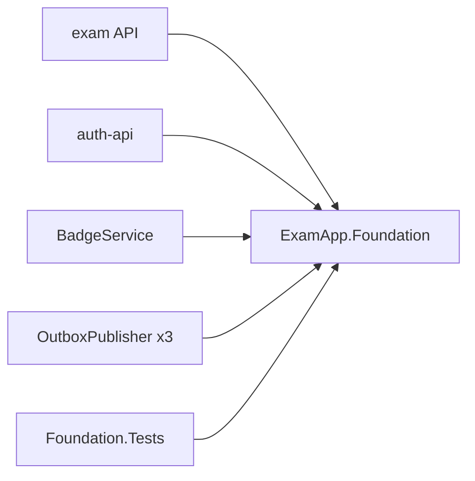

# ExamApp.Foundation (`api/ExamApp.Foundation`)

**Bu dosya neyi anlatır:** Backend servislerinin ortak kullandığı `ExamApp.Foundation` sınıf kütüphanesini anlatır. Kütüphane dört parçadan oluşur: event sözleşmeleri (`Contracts`), outbox satır tipi (`Persistence`), JSON tabanlı mesaj yerelleştirmesi (`Localization`) ve küçük güvenlik yardımcıları (`Security`). Bu dosyada her parçanın içeriği, kütüphaneyi hangi projelerin referans aldığı ve testleri var. Olayların kim tarafından hangi kuyruğa yayınlandığı ve RabbitMQ izinleri [06-asenkron-akislar.md](../06-asenkron-akislar.md) dosyasında. Bu kütüphanenin exam API'de nasıl kullanıldığı [api.md](api.md) dosyasında.

## İçindekiler

1. [Özet kart](#1-özet-kart)
2. [Kim referans veriyor](#2-kim-referans-veriyor)
3. [Contracts: event sözleşmeleri](#3-contracts-event-sözleşmeleri)
4. [Persistence: OutboxMessage](#4-persistence-outboxmessage)
5. [Localization](#localization)
6. [Security](#security)
7. [Testler: tests/ExamApp.Foundation.Tests](#7-testler-testsexamappfoundationtests)
8. [Değişiklik yaparken dikkat](#8-değişiklik-yaparken-dikkat)
9. [Ayrı issue adayları](#ayrı-issue-adayları)
10. [Doğrulanmadı listesi](#doğrulanmadı-listesi)

---

## 1. Özet kart

| Özellik | Değer | Kaynak |
|---|---|---|
| Proje | `api/ExamApp.Foundation/ExamApp.Foundation.csproj` | `ExamApp.slnx:4` |
| Framework | `net10.0`, `Nullable` ve `ImplicitUsings` açık | `api/ExamApp.Foundation/ExamApp.Foundation.csproj:4-6` |
| Paket kimliği | `PackageId` `ExamApp.Foundation`, `Version` `1.5.0` (repo içinde NuGet paketi olarak değil, `ProjectReference` ile kullanılıyor) | `api/ExamApp.Foundation/ExamApp.Foundation.csproj:7-8` |
| Bağımlılıklar | Yalnızca `Microsoft.Extensions.FileProviders.Physical`, `Hosting.Abstractions`, `Localization.Abstractions`. **EF Core, ASP.NET Core veya MassTransit bağımlılığı yok.** | `api/ExamApp.Foundation/ExamApp.Foundation.csproj:15-19` |
| Ayrı solution | `api/ExamApp.Foundation/ExamApp.Foundation.sln` (eski); kökteki `ExamApp.slnx` kullanılıyor | |

Dizin yapısı:

```
api/ExamApp.Foundation/
├── ExamApp.Foundation.csproj
├── Contracts/      # 20 event sınıfı + OutboxEventRegistry + EventVersion + DevSeedUsersContracts
├── Persistence/    # OutboxMessage
├── Localization/   # JSON mesaj sözlüğü (IStringLocalizer implementasyonu) + SupportedLocales
└── Security/       # ServicePrincipal, DisplayTextSanitizer, SeedDataConventions
```

Kütüphanenin bilerek dar tutulduğu görülüyor: bağımlılıklar yalnızca soyutlamalardan oluşuyor. Event sınıfları düz POCO; `OutboxMessage` bir EF entity'si gibi kullanılıyor ama EF'e bağımlı değil. Her servis bu tipi kendi `DbContext`'inde eşliyor.

## 2. Kim referans veriyor

`ProjectReference` taraması (`grep -rn "ExamApp.Foundation" --include=*.csproj`):

| Proje | Referans satırı | Kullandığı parçalar |
|---|---|---|
| exam API (`api/ExamApp.Api`) | `api/ExamApp.Api/ExamApp.Api.csproj:52` | Hepsi: event'leri outbox'a yazar ve `StudentPointsChangedEvent` tüketir; `OutboxMessage` (`api/ExamApp.Api/Data/AppDbContext.cs:88`); `AddJsonLocalization` (`api/ExamApp.Api/Program.cs:209`); `SupportedLocales`; `ServicePrincipal` (`api/ExamApp.Api/Program.cs:175`); `SeedDataConventions`; `EventVersion` |
| auth-api (`auth-api`) | `auth-api/ExamApp.Api.csproj:52` | `LoginAttemptedEvent` ve `UserPreferredLocaleChangedEvent` üretir, `UserRoleChangedEvent` tüketir; `OutboxMessage` (`auth-api/Data/AppDbContext.cs:84`); `AddJsonLocalization` (`auth-api/Helpers/AuthLocalization.cs:17`); `SupportedLocales`; `ServicePrincipal` (`auth-api/Program.cs`); `SeedDataConventions` ve `DevSeedUsersContracts` (dev seed ucu) |
| BadgeService (`Services/BadgeService`) | `Services/BadgeService/BadgeService.csproj:30` | Event'lerin çoğunu tüketir, `StudentPointsChangedEvent` üretir; `OutboxMessage` (`Services/BadgeService/BadgeDbContext.cs:31`); `AddJsonLocalization` (`Services/BadgeService/Program.cs:147`); `DisplayTextSanitizer` (`Services/BadgeService/Consumers/CommentNotificationSupport.cs`); `EventVersion`; `ServicePrincipal` |
| OutboxPublisher (`Services/OutboxPublisher`) | `Services/OutboxPublisher/OutboxPublisherService.csproj:27` | `OutboxMessage` (`Services/OutboxPublisher/Data/AppDbContext.cs:8`) ve `OutboxEventRegistry.Resolve` (`Services/OutboxPublisher/Publishers/OutboxProcessor.cs:111`) |
| `tests/ExamApp.Foundation.Tests` | `tests/ExamApp.Foundation.Tests/ExamApp.Foundation.Tests.csproj:12` | Bölüm 7 |

Gateway, question-detector ve `finance-*` projeleri Foundation'ı **referans almıyor**. `tests/ExamApp.Api.Tests` ve `tests/ExamApp.Api.IntegrationTests` kütüphaneye API projesi üzerinden geçişli olarak erişiyor.



OutboxPublisher tek bir proje ama AppHost'ta üç ayrı instance olarak çalışıyor: `exam-outbox-publisher`, `identity-outbox-publisher` ve `badge-outbox-publisher` (`AppHost/AppHost.cs:484`, `:509`, `:533`). Üçü de aynı `OutboxEventRegistry`'yi kullanır. Ayrıntı için [outbox-publisher.md](outbox-publisher.md).

## 3. Contracts: event sözleşmeleri

### 3.1 OutboxEventRegistry

`api/ExamApp.Foundation/Contracts/OutboxEventRegistry.cs`

- Yayınlanabilir olayların tek listesi `KnownEvents` (`:17-39`). Burada olmayan bir tip `NameFor` ile yazılabilir. Ancak publisher tarafında `Resolve` tipi önce `FullName` ile, sonra eski `AssemblyQualifiedName` biçiminin baş kısmıyla, en son `Type.GetType` ile arar (`:59-74`). Bulunamazsa `null` döner ve satır dead-letter'a düşer.
- `NameFor<T>()` ve `NameFor(Type)` metotları `Type.FullName` döner (namespace + sınıf adı, assembly yok) (`:45-52`). Üreticiler `OutboxMessage.Type` alanına bu değeri yazar.
- Sonuç: event sınıfının **adını veya namespace'ini değiştirmek yayınlanmamış satırları kırar.** Registry bu yüzden derleme zamanında tek bir doğruluk noktası sağlar.

### 3.2 EventVersion

`api/ExamApp.Foundation/Contracts/EventVersion.cs:17-26`

`Normalize(DateTime)` değeri UTC'ye çevirir (`Unspecified` olan UTC kabul edilir) ve mikrosaniyeye aşağı yuvarlar. PostgreSQL `timestamptz` mikrosaniye tuttuğu için, aynı event tekrar geldiğinde 100 ns'lik tick farkı versiyonu "daha yeni" gösterirdi. Bu metodu hem üretici (BadgeService `StudentPointsOutbox`) hem tüketici (exam API `StudentPointsSyncService`) kullanır.

### 3.3 Event listesi

Bütün sınıflar `ExamApp.Foundation.Contracts` namespace'inde, `public class` olarak tanımlı ve `{ get; set; }` property'leri var. "Üretir" ve "Tüketir" sütunları `grep` ile bulunan kullanım yerlerinden çıkarıldı. Consumer'ların ne yaptığı [06-asenkron-akislar.md](../06-asenkron-akislar.md) ve [badge-service.md](badge-service.md) dosyalarında.

| Event (dosya:satır) | Ana alanlar | Üretir | Tüketir |
|---|---|---|---|
| `AnswerSubmittedEvent` (`Contracts/AnswerSubmittedEvent.cs:5`) | `EventId`, `UserId`, `QuestionId`, `SubjectId`, `TopicId`, `SubTopicId`, `TestInstanceId`, `TestInstanceQuestionId`, `SelectedAnswerId`, `IsCorrect`, `QuestionPoint`, `DifficultyLevel`, `TimeTakenInSeconds`, `SubmittedAt`, `Revision` | exam API (`TestSessionService`, `PracticeSessionService`) | BadgeService `AnswerSubmittedConsumer` |
| `QuestionCreatedEvent` (`Contracts/QuestionCreatedEvent.cs:5`) | `QuestionId`, `SubjectId`, `TopicId`, `ClassificationSource`, `CreatedAt`, `Text` | exam API (`QuestionService`) | BadgeService `QuestionCreatedConsumer` (sınıflandırıcı) |
| `WorksheetReminderDueEvent` (`Contracts/WorksheetReminderDueEvent.cs:13`) | `ReminderId`, `WorksheetId`, `StudentId`, `UserId`, `UserKeycloakId`, `WorksheetName`, `ScheduledFor`, `RemindBeforeMinutes` | exam API (`WorksheetReminderDispatcher`) | BadgeService `WorksheetReminderDueConsumer` |
| `WorksheetAccessRequestedEvent` (`Contracts/WorksheetAccessRequestedEvent.cs:13`) | `RequestId`, `WorksheetId`, `WorksheetName`, `RequesterUserId`, `RequesterName`, `OwnerUserId`, `TargetKeycloakId`, `Note`, `RequestedAt` | exam API (`WorksheetAccessRequestService`) | BadgeService `WorksheetAccessRequestedConsumer` |
| `WorksheetAccessRequestApprovedEvent` (`Contracts/WorksheetAccessRequestApprovedEvent.cs:13`) | `RequestId`, `WorksheetId`, `WorksheetName`, `RequesterUserId`, `TargetKeycloakId`, `DecidedAt` | exam API | BadgeService `WorksheetAccessDecisionConsumer` |
| `WorksheetAccessRequestRejectedEvent` (`Contracts/WorksheetAccessRequestRejectedEvent.cs:13`) | Approved ile aynı alanlar | exam API | BadgeService `WorksheetAccessDecisionConsumer` |
| `LoginAttemptedEvent` (`Contracts/LoginAttemptedEvent.cs:5`) | `EventId`, `KeycloakUserId`, `AttemptedIdentifier`, `Role`, `OccurredAtUtc`, `Success` | auth-api (`auth-api/Controllers/AuthController.cs`) | BadgeService `LoginAttemptedConsumer` |
| `TeacherApplicationSubmittedEvent` (`Contracts/TeacherApplicationSubmittedEvent.cs:15`) | `TeacherId`, `UserId`, `ApplicantName`, `SubmittedAt` | exam API (`TeacherService`) | BadgeService `TeacherApplicationSubmittedConsumer` |
| `TeacherApplicationDecidedEvent` (`Contracts/TeacherApplicationDecidedEvent.cs:18`) | `EventId`, `TeacherId`, `TargetKeycloakId`, `Approved`, `IsIndependentTutor`, `DecidedAtUtc` | exam API (`TeacherApprovalService`) | BadgeService `TeacherApplicationDecisionConsumer` |
| `TeacherSchoolRequestSubmittedEvent` (`Contracts/TeacherSchoolRequestSubmittedEvent.cs:23`) | `EventId`, `TeacherId`, `UserId`, `RequestedSchoolId`, `RequestedSchoolName`, `ApplicantName`, `IsNewRegistration`, `SubmittedAtUtc` | exam API (`TeacherService`) | BadgeService `TeacherSchoolRequestSubmittedConsumer` |
| `IndependentTeacherRegisteredEvent` (`Contracts/IndependentTeacherRegisteredEvent.cs:15`) | `TeacherId`, `UserId`, `IsNewRegistration`, `RegisteredAt` | exam API (`TeacherService`) | BadgeService `IndependentTeacherRegisteredConsumer` |
| `BookingRequestCreatedEvent` (`Contracts/BookingRequestCreatedEvent.cs:13`) | `BookingId`, `TeacherId`, `TeacherUserId`, `TargetKeycloakId`, `StudentId`, `StudentName`, `AvailabilitySlotId`, `Date`, `StartTime`, `EndTime`, `RequestedAt` | exam API (`BookingService`) | BadgeService `BookingRequestCreatedConsumer` |
| `BookingDecisionEvent` (`Contracts/BookingDecisionEvent.cs:18`) | `BookingId`, `TeacherId`, `TeacherName`, `StudentId`, `StudentUserId`, `TargetKeycloakId`, `Approved`, `RejectionReason`, `Date`, `StartTime`, `EndTime`, `DecidedAt`, `TeacherUnavailable` | exam API (`BookingService`, `TeacherUnavailableBookingRejection`, `AdminTeacherSuspensionService`, `SuspendedTeacherBookingSweepJob`) | BadgeService `BookingDecisionConsumer` |
| `BookingTeacherUnavailableEvent` (`Contracts/BookingTeacherUnavailableEvent.cs:18`) | `EventId`, `TeacherId`, `StudentUserId`, `TargetKeycloakId`, `BookingIds`, `UnavailableSinceUtc` | exam API (`AdminTeacherSuspensionService`) | BadgeService `BookingTeacherUnavailableConsumer` |
| `UserPreferredLocaleChangedEvent` (`Contracts/UserPreferredLocaleChangedEvent.cs:20`) | `UserId`, `KeycloakId`, `PreferredLocale`, `ChangedAtUtc` | auth-api (`AuthController`, `DevUserSeedService`) | BadgeService `UserPreferredLocaleChangedConsumer` (bildirim dili) |
| `StudentPointsChangedEvent` (`Contracts/StudentPointsChangedEvent.cs:15`) | `UserId`, `TotalPoints`, `UpdatedAtUtc` | BadgeService (`StudentPointsOutbox`) | exam API `StudentPointsChangedConsumer` |
| `UserRoleChangedEvent` (`Contracts/UserRoleChangedEvent.cs:36`) | `EventId`, `KeycloakId`, `UserId` (yalnızca log), `NewRole`, `ChangedAtUtc` | exam API (`UserRoleChangeOutbox`) | auth-api `UserRoleChangedConsumer` |
| `WorksheetCommentCreatedEvent` (`Contracts/WorksheetCommentCreatedEvent.cs:18`) | `EventId`, `CommentId`, `RootCommentId`, `WorksheetId`, `QuestionId`, `QuestionOrder`, `WorksheetTitle`, `AuthorRole`, `AuthorDisplayName`, `RecipientUserId`, `RecipientKeycloakId`, `CreatedAtUtc` | exam API (`WorksheetCommentService`) | BadgeService `WorksheetCommentCreatedConsumer` |
| `WorksheetCommentRepliedEvent` (`Contracts/WorksheetCommentRepliedEvent.cs:13`) | Created ile aynı alanlar | exam API | BadgeService `WorksheetCommentRepliedConsumer` |
| `WorksheetCommentHiddenEvent` (`Contracts/WorksheetCommentHiddenEvent.cs:12`) | `EventId`, `CommentId`, `RootCommentId`, `WorksheetId` | exam API | BadgeService `WorksheetCommentHiddenConsumer` |

Sözleşmelerde göze çarpan desenler:

- **Eşleştirme anahtarı Keycloak `sub`.** Servislerin `Users.Id` değerleri farklı veritabanlarında, farklı sequence'lardan geliyor. Bu yüzden servisler arası eşleştirmede `KeycloakId` / `TargetKeycloakId` kullanılıyor. Sayısal `UserId` yalnızca log ve korelasyon için taşınıyor. Gerekçe `UserRoleChangedEvent` doc-comment'inde yazılı (`api/ExamApp.Foundation/Contracts/UserRoleChangedEvent.cs:5-35`).
- **`EventId`** idempotency için kullanılıyor. Olmayan eski event'lerde (örn. `BookingRequestCreatedEvent`) tüketiciler başka bir doğal anahtar kullanıyor.
- **Payload minimum tutuluyor:** e-posta veya token taşınmıyor (`api/ExamApp.Foundation/Contracts/UserRoleChangedEvent.cs:24`).
- **`DevSeedUsersContracts.cs` bir event değil.** auth-api'nin dev-only `POST /api/auth/dev/seed-users` ve `/seed-users/cleanup` uçları için HTTP request/response DTO'ları burada: `DevSeedUsersRequest`, `DevSeedUserItem`, `DevSeedUsersResponse`, `DevSeedUserResult`, `DevSeedCleanupRequest`, `DevSeedCleanupResponse`, `DevSeedCleanupUser` (`api/ExamApp.Foundation/Contracts/DevSeedUsersContracts.cs:6-12`, `auth-api/Controllers/DevSeedController.cs:17-65`). Üretici exam API'nin `seed-teachers`, `seed-tutors` ve `seed-cleanup` komutları ([api.md](api.md#17-komut-modu-seed-cli)).

## 4. Persistence: OutboxMessage

`api/ExamApp.Foundation/Persistence/OutboxMessage.cs:5-28`

| Alan | Anlam |
|---|---|
| `Id` (`Guid`, varsayılan `NewGuid`) | Satır kimliği |
| `Type` | `OutboxEventRegistry.NameFor<T>()` değeri (FullName) |
| `Content` | Event'in JSON gövdesi |
| `CreatedAt` (varsayılan `UtcNow`) | Yazılma zamanı |
| `ProcessedAt` | Yayınlanma zamanı; `null` ise bekliyor |
| `RetryCount` | Başarısız yayın denemesi sayısı |
| `NextAttemptAt` | Exponential backoff ile en erken yeniden deneme zamanı |
| `Error` | Son hata; dead-letter'da da dolu kalır |

- Sınıfta EF attribute'u yok. Her servis bu tipi kendi `DbContext`'inde `DbSet<OutboxMessage>` olarak eşliyor (bölüm 2 tablosu). Tablo kolonları ve indeksler için [04-veri-modeli.md](../04-veri-modeli.md).
- Csproj açıklamasında "persistence layer for OutboxMessage **and EF context**" yazıyor (`api/ExamApp.Foundation/ExamApp.Foundation.csproj:11`). Kütüphanede bir EF context yok; açıklama eski.
- Retry, backoff ve `FOR UPDATE SKIP LOCKED` ile satır talep etme mantığı OutboxPublisher'da ([outbox-publisher.md](outbox-publisher.md)).

<a id="localization"></a>
## 5. Localization

Amaç: client'a giden bütün metinleri resx yerine JSON dosyalarında tutmak. Böylece bir dil eklemek veya metin düzeltmek derleme gerektirmez. UI da Transloco ile JSON kullanıyor (`api/ExamApp.Foundation/Localization/JsonLocalizationServiceCollectionExtensions.cs:11-15`). Kullanım kuralları (anahtar biçimi, dosya adlandırma) `api/ExamApp.Api/Resources/README.md` ve [`docs/i18n-migration.md`](../../i18n-migration.md) dosyalarında.

| Dosya | Görev |
|---|---|
| `Localization/JsonLocalizationServiceCollectionExtensions.cs:24-58` | `AddJsonLocalization(options)`. `JsonResourceStore`'u singleton olarak yükler. `IStringLocalizerFactory`, `IStringLocalizer<>` ve `IStringLocalizer` kayıtlarını ekler. `JsonLocalizationStartupValidator` hosted service'iyle sözlüğü açılışta yükler; böylece hatalı dosya açılışta fark edilir (`:53-82`). |
| `Localization/JsonLocalizationOptions.cs:8-28` | `ResourcesPath` (varsayılan `Resources`), `ThrowOnDuplicateKeys` (varsayılan `true`), `FileProvider` (varsayılan ContentRoot) |
| `Localization/JsonResourceStore.cs:26` | `{ResourcesPath}/**/<alan>.<dil>.json` dosyalarının hepsini okur ve dil başına tek bir sözlükte birleştirir. İç içe JSON nokta ile düzleştirilir (`questions.notFound`). Çift anahtar varsa hata fırlatır. Kültür zinciri `en-US` → `en` → varsayılan `tr` (`:122`, `:143-180`). |
| `Localization/JsonStringLocalizer.cs:21`, `:76` | `IStringLocalizer` ve `IStringLocalizer<T>` implementasyonu |
| `Localization/JsonStringLocalizerFactory.cs:13` | Factory |
| `Localization/Messages.cs:11` | Marker tipi. Her yerde `IStringLocalizer<Messages>` enjekte edilir; controller başına ayrı localizer tipi yok. |
| `Localization/FallbackMessageLocalizer.cs:21-31` | DI dışında kurulan nesneler (birim testler) için son çare. Çıktı klasöründeki `Resources`'ı okur ve varsayılan dile kilitlenir. Üretimde kullanılmaz. |
| `Localization/SupportedLocales.cs:13-81` | Desteklenen diller tek bir yerde: `Default = "tr"`, `All = ["tr", "en"]`, culture eşlemesi `tr` → `tr-TR`, `en` → `en-US`. `Normalize`, `TryNormalize`, `ToCultureName`, `IsSupported` metotları var. Yeni bir dil eklemek buradan başlar; RequestLocalization'ın `SupportedCultures` listesi de buradan üretilir. |

Kullanan servisler: exam API (`api/ExamApp.Api/Program.cs:209`, `:462`), auth-api (`auth-api/Helpers/AuthLocalization.cs:15-25`), BadgeService (`Services/BadgeService/Program.cs:147`). Her servisin kendi `Resources/` klasörü var.

<a id="security"></a>
## 6. Security

| Sınıf | Görev | Kullanan |
|---|---|---|
| `ServicePrincipal` (`Security/ServicePrincipal.cs:22-48`) | "Bu çağıran güvenilir bir servis mi?" sorusunun tek karar noktası. Kontroller sırasıyla: (1) `exam-service` realm rolü (`ServiceRole`, `:24`); (2) `azp` veya `client_id` claim'inin izinli listede olması (liste verilmezse `exam-admin`); (3) eski `preferred_username` = `exam-admin` / `service-account-exam-admin`. Üçüncü kontrol geçiş dönemi için bırakılmış ve (1) yerleşince kaldırılması gerekiyor (`:8-20`). | exam API policy'leri (`ServiceToService`, `TeacherOrService`, `TeacherAdminOrService`, `AdminOrService`, ApprovedTeacher muafiyeti), `BaseController.IsServiceAccount`, auth-api, BadgeService |
| `DisplayTextSanitizer` (`Security/DisplayTextSanitizer.cs:12-14`) | Bildirim başlığı ve gövdesi gibi tek satırlık görüntüleme metinlerini temizler. Bidi override ve sıfır genişlikli karakterleri ayıklar, kontrol karakterlerini boşluğa çevirir, NFC normalizasyonu ve trim uygular, metni `maxLength`'e keser (surrogate çiftlerini bölmeden). Hiçbir girdiyi reddetmez (#105 security D2). Yorum gövdesi için reddeden versiyon exam API'deki `Helpers/CommentBodySanitizer.cs`. | BadgeService `CommentNotificationSupport` |
| `SeedDataConventions` (`Security/SeedDataConventions.cs:11-33`) | Test verisi hesaplarının ortak sözleşmesi. E-posta alanı `seed.examapp.local`, yerel kısmın öneki `seed.`, Keycloak sahiplik attribute'u `seed_origin` = `examapp-seed`, `IsSeedEmail()`. auth-api'nin dev seed ucu yalnızca bu alandaki e-postaları kabul eder; gerçek kullanıcı hesapları bu yoldan değiştirilemez. | exam API seed planları (`TeacherSeedPlan`, `TutorSeedPlan`), auth-api (`DevUserSeedService`, `AuthController`, `PrivilegedUserAuditService`) |

Yerel realm'de `exam-service` rolü tanımlı değil. Bu yüzden servis tespiti bugün `azp` kontrolüyle yapılıyor (agent hafızası `keycloak-service-account-detection.md`). Kimlik modelinin bütünü [05-kimlik-yetki.md](../05-kimlik-yetki.md) dosyasında.

## 7. Testler: tests/ExamApp.Foundation.Tests

- Proje: `tests/ExamApp.Foundation.Tests/ExamApp.Foundation.Tests.csproj`. Ortak ayarlar `tests/Directory.Build.props` içinde: xUnit v3, NSubstitute, Shouldly, coverlet, `net10.0`. Ek paketler `Microsoft.Extensions.Configuration`, `DependencyInjection`, `Hosting.Abstractions`, `Logging` ve `FileProviders.Abstractions`.
- Tamamen birim testi; Docker veya DB gerekmez.
- Çalıştırma: `dotnet test tests/ExamApp.Foundation.Tests`

| Dosya | `[Fact]` / `[Theory]` | Ne test ediliyor |
|---|---|---|
| `Contracts/EventVersionTests.cs` | 3 / 0 | UTC çevirimi ve mikrosaniye yuvarlama |
| `Contracts/OutboxEventRegistryTests.cs` | 7 / 1 | `NameFor` = FullName; `Resolve` için gidiş-dönüş, eski AQN ve kısa assembly adı biçimleri; yorum (#105) ve booking (#298) event'lerinin registry'de olması; bilinmeyen veya boş tip için `null` |
| `Localization/JsonLocalizationTests.cs` | 18 / 0 | Dosya birleştirme, iç içe anahtar düzleştirme, çift anahtar hatası, kültür fallback zinciri, factory ve DI kaydı, fallback localizer |
| `Localization/SupportedLocalesTests.cs` | 14 / 10 | `Normalize` / `TryNormalize` (bölge eki, alt çizgi, büyük harf, desteklenmeyen dil), culture eşlemesi |
| `Security/DisplayTextSanitizerTests.cs` | 7 / 0 | Bidi ve sıfır genişlikli karakter ayıklama, kontrol karakterleri, kesme, surrogate güvenliği |
| `Security/ServicePrincipalTests.cs` | 9 / 1 | null veya anonim principal, `exam-service` rolü, `azp` ve `client_id` izin listesi, büyük/küçük harf duyarsızlığı, `exam-admin` varsayılanı, eski `preferred_username`, normal kullanıcı |

`SeedDataConventions` için ayrı bir test dosyası yok. Seed e-posta kuralı exam API ve auth-api tarafındaki seed testlerinde dolaylı olarak kontrol ediliyor olabilir (Doğrulanmadı).

`tests/README.md` "Layout" tablosunda bu proje için yalnızca `ServicePrincipal` ve `OutboxEventRegistry` listeleniyor; tablo güncel değil.

## 8. Değişiklik yaparken dikkat

1. **Yeni event:** sınıfı `Contracts/` altına ekleyin, `OutboxEventRegistry.KnownEvents`'e kaydedin, `OutboxEventRegistryTests`'e bir `Resolve` testi ekleyin. RabbitMQ izin matrisini (`rabbitmq/definitions.json`) ve tüketiciyi güncelleyin. Adım adım prosedür [`.claude/skills/outbox-event/SKILL.md`](../../../.claude/skills/outbox-event/SKILL.md) dosyasında.
2. **Event'i yeniden adlandırmak veya namespace'ini değiştirmek** yayınlanmamış outbox satırlarını ve MassTransit mesaj tipini (exchange adı tip adından türetilir) kırar. Gerekirse eski adı da çözen bir geçiş planı yapın.
3. **Alan eklemek** geriye uyumludur (JSON). **Alan silmek veya tipini değiştirmek** eski satırları ve sürümü geride kalan tüketicileri kırar. Foundation'ı paylaşan dört servis farklı zamanlarda deploy edilebilir.
4. **Foundation değişince** dört servisin hepsi yeniden derlenir. Çalışan bir servis `ExamApp.Foundation.dll` dosyasını kilitler (agent hafızası `build-lock-running-api.md`).
5. Kütüphaneye EF Core, ASP.NET Core veya MassTransit bağımlılığı eklemekten kaçının. Bugünkü dar bağımlılık seti bilinçli görünüyor (bölüm 1).

---

## Ayrı issue adayları

`gh issue list --state all --search ...` ile arandı; eşleşen issue bulunamadı.

1. **`OutboxEventRegistry.Resolve` son çare olarak `Type.GetType(storedType)` kullanıyor** (`api/ExamApp.Foundation/Contracts/OutboxEventRegistry.cs:72-73`). Bu yol registry'de olmayan bir tipin de çözülmesine izin veriyor ve doc-comment'teki "registry is the single place that knows the set of publishable events" iddiasıyla çelişiyor (`:9-13`). Outbox satırlarını yalnızca servislerin kendi kodu yazdığı için risk düşük, ama yine de beklenmeyen bir tipin deserialize edilip yayınlanmasının kapısı açık. Eski satırlar temizlendiyse bu fallback kaldırılabilir.
2. **Csproj açıklaması eski:** "persistence layer for OutboxMessage and EF context" yazıyor, ama kütüphanede bir EF context yok (`api/ExamApp.Foundation/ExamApp.Foundation.csproj:11`).
3. **`ServicePrincipal`'daki eski `preferred_username` kontrolü** geçiş dönemi için bırakılmış (`api/ExamApp.Foundation/Security/ServicePrincipal.cs:19-20`, `:44-47`). Realm'e `exam-service` rolü eklenip kontrol kaldırılmadıkça, kullanıcı adı `exam-admin` olan bir kullanıcı hesabının servis sayılma riski teorik olarak sürer. Keycloak'ta bu adla kullanıcı kaydının engellenip engellenmediği Doğrulanmadı.
4. **`tests/README.md` "Layout" tablosu güncel değil** ("96 tests"; Foundation için yalnızca iki sınıf listeleniyor).
5. **`SeedDataConventions` için doğrudan test yok.** Dev seed ucunun güvenlik sınırı bu regex'e dayanıyor (`api/ExamApp.Foundation/Security/SeedDataConventions.cs:27-33`).

## Doğrulanmadı listesi

- auth-api ve BadgeService içinde `ServicePrincipal`'ın tam kullanım satırları çıkarılmadı; yalnızca `auth-api/Program.cs` ve `Services/BadgeService/Program.cs` dosyalarında geçtiği doğrulandı.
- `SeedDataConventions` regex'inin exam API ve auth-api seed testlerinde dolaylı olarak kontrol edilip edilmediği.
- MassTransit exchange adının event FullName'inden türetildiği bilgisi framework'ün varsayılan davranışına dayanıyor. Servislerde özel bir entity name formatter tanımlanıp tanımlanmadığı kontrol edilmedi.
- Keycloak'ta `exam-admin` kullanıcı adının self-registration ile alınıp alınamayacağı.
