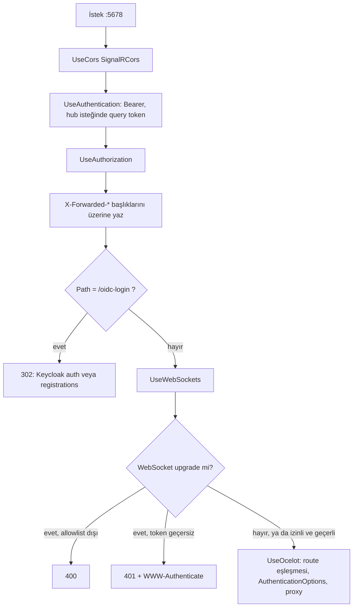
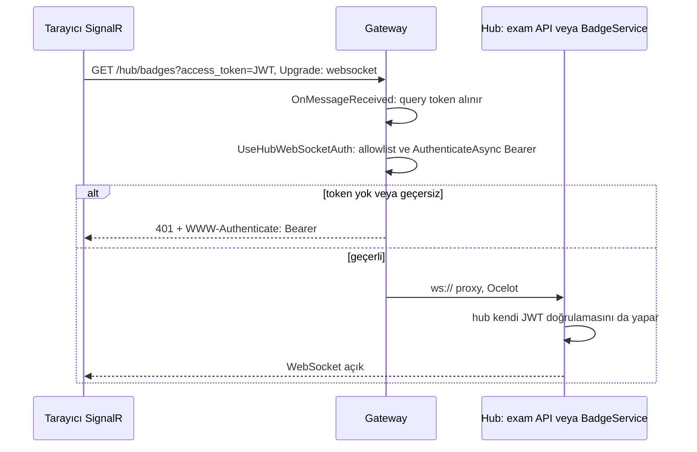

# Gateway (Ocelot, `Services/Gateway`)

**Bu dosya neyi anlatır:** Tarayıcı trafiğinin tek giriş noktası olan Ocelot gateway'ini servis seviyesinde anlatır. Konular: `Program.cs` içindeki pipeline, üç `ocelot*.json` dosyasının farkları, **tüm route'ların tablosu** (upstream, downstream servis ve port, kimlik doğrulama), SignalR ve WebSocket hub auth'u, CORS, gateway'deki JWT doğrulama ayarları, Aspire'ın downstream adresleri nasıl override ettiği, yeni route ekleme ve testler. Kimlik akışının bütünü (Keycloak client'ları, roller, token akışı, auth-ui callback'i) [05-kimlik-yetki.md](../05-kimlik-yetki.md) dosyasındadır. Bu dosya yalnız gateway'e düşen kısmı anlatır.

## İçindekiler

- [1. Özet kart](#1-özet-kart)
- [2. Dizin yapısı](#2-dizin-yapısı)
- [3. Program.cs pipeline'ı](#3-programcs-pipelineı)
- [4. ocelot.json dosyaları ve farkları](#4-ocelotjson-dosyaları-ve-farkları)
- [5. Route tablosu](#5-route-tablosu)
- [6. Gateway'de JWT doğrulama](#6-gatewayde-jwt-doğrulama)
- [7. WebSocket ve SignalR hub auth](#7-websocket-ve-signalr-hub-auth)
- [8. CORS](#8-cors)
- [9. /oidc-login yönlendirme middleware'i](#9-oidc-login-yönlendirme-middlewarei)
- [10. Aspire'da downstream adres override'ı](#10-aspireda-downstream-adres-overrideı)
- [11. Konfigürasyon anahtarları](#11-konfigürasyon-anahtarları)
- [12. Yeni route ekleme reçetesi](#12-yeni-route-ekleme-reçetesi)
- [13. Testler](#13-testler)
- [14. Doğrulanmadı](#14-doğrulanmadı)
- [15. Ayrı issue adayları](#15-ayrı-issue-adayları)

---

## 1. Özet kart

| Özellik | Değer | Kaynak |
|---|---|---|
| Proje | `Services/Gateway/Gateway.csproj`, `net10.0`, `Ocelot` 24.0.0, `ServiceDefaults` referansı | `Services/Gateway/Gateway.csproj:4`, `:12`, `:17` |
| Port | `Kestrel:Port`, varsayılan **5678**, `ListenAnyIP` | `Services/Gateway/Program.cs:12-17` |
| Aspire kaynağı | `ocelot-gateway`, port 5678 sabit, `isProxied: false`, dış endpoint | `AppHost/AppHost.cs:633-667` |
| docker-compose | `ocelot-gateway` container'ı, `5678:5678`, `dotnet watch run --urls=http://+:5678` | `docker-compose.yml:487-501`, `docker-compose.override.yml:12-13` |
| Prod | `deploy/dockerfiles/gateway.Dockerfile`. `ocelot.Production.json` dosyası imajda `ocelot.json` adıyla kopyalanır. | `deploy/docker-compose.prod.yml:444-473`, `deploy/dockerfiles/gateway.Dockerfile:13-18` |
| Kimlik doğrulama | JwtBearer şeması `"Bearer"`. Route bazında `AuthenticationOptions` ile uygulanır. | `Services/Gateway/Program.cs:86-129` |
| Rol bazlı yetki | **Gateway'de yok.** Hiçbir route'ta `RouteClaimsRequirement` yok, roller downstream servislerde kontrol edilir. | `Services/Gateway/ocelot.json` (tüm dosya) |
| Rate limit, QoS | **Gateway'de yok.** Hiçbir route'ta `RateLimitOptions` veya `QoSOptions` yok. Login brute-force koruması auth-api'dedir. | `auth-api/Helpers/AuthRateLimiting.cs:12-14` |

Kural: Angular uygulamaları servis portlarına hiçbir zaman doğrudan gitmez, her şey `localhost:5678` üzerinden geçer (`.claude/skills/gateway-route/SKILL.md:8`). Port tablosunun tamamı [`.claude/rules/local-dev.md`](../../../.claude/rules/local-dev.md) dosyasında, servis haritası [01-sistem-haritasi.md](../01-sistem-haritasi.md) dosyasındadır.

---

## 2. Dizin yapısı

| Dosya | İçerik |
|---|---|
| `Services/Gateway/Program.cs` | Tüm pipeline. Controller yoktur. |
| `Services/Gateway/HubWebSocketAuthExtensions.cs` | WebSocket upgrade allowlist'i ve Bearer kontrolü |
| `Services/Gateway/StartupConfigDump.cs` | Development'ta etkin config'i maskeli basar. Bölümler: `Keycloak`, `ConnectionStrings`, `Redis`, `RabbitMQ`, `MinioConfig`, `Server`, `Cors` (`Services/Gateway/StartupConfigDump.cs:15-24`). Beş kopyadan biridir (#228). |
| `Services/Gateway/ocelot.json`, `ocelot.Development.json`, `ocelot.Production.json` | Route tanımları, [Bölüm 4](#4-ocelotjson-dosyaları-ve-farkları) |
| `Services/Gateway/appsettings.json` | `Server`, `Keycloak` ve log seviyeleri. `appsettings.Development.json` gitignore'dadır (`.gitignore:131`). |
| `Services/Gateway/Properties/launchSettings.json` | `http` profili 5678, `https` profili 7264 |
| `Services/Gateway/Gateway.http` | Şablondan kalmış `weatherforecast` isteği, işlevsiz |
| `Services/Gateway/.devcontainer/devcontainer.json` | Repoda olmayan `../../../docker-compose.yaml` dosyasına işaret ediyor, güncel değil |
| `Services/Gateway.Tests/` ve `tests/Gateway.Tests/` | İki ayrı test projesi, [Bölüm 13](#13-testler) |

---

## 3. Program.cs pipeline'ı



| Sıra | Adım | Satır |
|---|---|---|
| 1 | `AddServiceDefaults()` | `Services/Gateway/Program.cs:10` |
| 2 | Kestrel `ListenAnyIP(Kestrel:Port)` | `Services/Gateway/Program.cs:12-17` |
| 3 | Ocelot dosyası seçimi: `ocelot.{Environment}.json` varsa o dosya, yoksa `ocelot.json`. CWD'ye göre göreli okunur. | `Services/Gateway/Program.cs:19-23` |
| 4 | Dosya `JsonNode` olarak okunur, downstream host override'ları uygulanır ([Bölüm 10](#10-aspireda-downstream-adres-overrideı)), sonuç `AddJsonStream` ile config'e eklenir | `Services/Gateway/Program.cs:32-45`, `:47-79` |
| 5 | Development'ta `StartupConfigDump.Print` | `Services/Gateway/Program.cs:81-84` |
| 6 | `AddAuthentication().AddJwtBearer("Bearer", ...)` | `Services/Gateway/Program.cs:86-129` |
| 7 | CORS policy `SignalRCors` | `Services/Gateway/Program.cs:142-156` |
| 8 | `AddOcelot()` | `Services/Gateway/Program.cs:158` |
| 9 | `UseCors("SignalRCors")`, `UseAuthentication()`, `UseAuthorization()` | `Services/Gateway/Program.cs:162-164` |
| 10 | `X-Forwarded-For`, `-Proto`, `-Port` ve `-Host` değerleri gateway'in gördüğü değerlerle **üzerine yazılır**, istemcinin gönderdiği başlığa eklenmez. auth-api'nin IP rate limit'i bu davranışa güvenir (`auth-api/Helpers/AuthRateLimiting.cs:77-81`). | `Services/Gateway/Program.cs:166-174` |
| 11 | `/oidc-login` middleware'i, [Bölüm 9](#9-oidc-login-yönlendirme-middlewarei) | `Services/Gateway/Program.cs:176-224` |
| 12 | `UseWebSockets()` | `Services/Gateway/Program.cs:226` |
| 13 | `UseHubWebSocketAuth()`, Ocelot'tan **önce** gelmelidir | `Services/Gateway/Program.cs:229` |
| 14 | `await app.UseOcelot()` | `Services/Gateway/Program.cs:231` |
| 15 | `public partial class Program;`: `WebApplicationFactory<Program>` testleri için | `Services/Gateway/Program.cs:235` |

`MapDefaultEndpoints()` çağrılmıyor. ServiceDefaults'un health uçları gateway'de map edilmemiş. Bu metot zaten yalnız Development'ta map eder (`ServiceDefaults/Extensions.cs:109-121`). Bu yüzden `/health` isteği Ocelot'un catch-all route'una düşer (bkz. [service-defaults-apphost.md](service-defaults-apphost.md)).

---

## 4. ocelot.json dosyaları ve farkları

Hangi dosyanın yüklendiği:

| Ortam | `ASPNETCORE_ENVIRONMENT` | Yüklenen dosya | Kaynak |
|---|---|---|---|
| Aspire (yerel) | Development (Aspire varsayılanı, **Doğrulanmadı**) | `ocelot.Development.json` | `Services/Gateway/Program.cs:21-23` |
| docker-compose | Development (Dockerfile `ENV`) | `ocelot.Development.json` | `dockerfiles/gateway/Dockerfile.ocelot` (`ENV ASPNETCORE_ENVIRONMENT Development`) |
| Prod imajı | Production | `ocelot.json` adıyla kopyalanmış `ocelot.Production.json`. Diğer `ocelot.*.json` dosyaları silinir. | `deploy/dockerfiles/gateway.Dockerfile:16-18`, `deploy/docker-compose.prod.yml:450`, `:456` |

Üç dosyada da 21 route ve aynı `GlobalConfiguration.BaseUrl = http://localhost:5678` var (`Services/Gateway/ocelot.json:311-313`). Farklar `diff` ile çıkarıldı:

| Fark | `ocelot.json` | `ocelot.Development.json` | `ocelot.Production.json` |
|---|---|---|---|
| `/app/{everything}` downstream path | `/{everything}` (`/app` öneki atılır) | **`/app/{everything}`** (önek korunur, `ocelot.Development.json:287`) | `/{everything}` |
| question-detector host | `question-detector-dev` (`ocelot.json:44`) | `question-detector-dev` | **`exam-question-detector`** (`ocelot.Production.json:44`) |
| MinIO host | `minio` (`ocelot.json:275`) | `minio` | **`exam-minio`** (`ocelot.Production.json:275`) |
| Girinti | 2 boşluk | 2 boşluk | 4 boşluk. `diff -w` ile yalnız yukarıdaki iki host farkı kalır. |

auth-ui `baseHref` değeri `/app/` (`auth-ui/angular.json:31`). Dev sunucusu (`ng serve`) `/app/...` yolunu beklediği için Development dosyası öneki korur. Prod'da auth-ui'nin sunucusu öneksiz yol bekliyor olmalı. Bu sonuç önek davranışından çıkarıldı, prod sunucu yapılandırması okunmadı, **Doğrulanmadı**. Production dosyasındaki host adları prod compose ve k8s servis adlarıyla uyumludur (`deploy/docker-compose.prod.yml`).

> Not: Route değişikliği gerektiğinde **üç dosyanın üçünü de** güncelleyin. `tests/Gateway.Tests` her WebSocket route'unun üç dosyada da `Bearer` taşıdığını doğrular, ama diğer route'lar için böyle bir tutarlılık testi yok.

---

## 5. Route tablosu

Tablo `ocelot.json` üzerinden çıkarıldı. Satır, ilgili route'un `UpstreamPathTemplate` satırıdır. Downstream host:port sütunu docker-compose ve prod değerini gösterir. Aspire'da bu değerler env ile override edilir ([Bölüm 10](#10-aspireda-downstream-adres-overrideı)). "Metot: hepsi" ifadesi `UpstreamHttpMethod` alanının tanımlanmadığı anlamına gelir. Priority alanında büyük sayı önce eşleşir. Tanımsızsa Ocelot varsayılanı geçerlidir (**Doğrulanmadı**: Ocelot 24 varsayılan değeri).

| # | Upstream | Metot | Downstream servis | Downstream host:port, path | Gateway auth | Priority | Satır |
|---|---|---|---|---|---|---|---|
| 1 | `/hub/whiteboard` | GET | exam API (SignalR) | `ws://exam-dotnet-api:5079/hub/whiteboard`, `UseWebSockets` | **Bearer** | tanımsız | `ocelot.json:12` |
| 2 | `/hub/badges` | GET | BadgeService (SignalR) | `ws://exam-badge-api:8006/hub/badges`, `UseWebSockets` | **Bearer** | tanımsız | `ocelot.json:30` |
| 3 | `/question-detector-dev/{everything}` | hepsi | question-detector | `question-detector-dev:8080/{everything}` (prod: `exam-question-detector`) | Yok | tanımsız | `ocelot.json:48` |
| 4 | `/api/auth/dev/{everything}` | hepsi | auth-api, **engelli** | `auth-api:5079/__blocked/api/auth/dev/{everything}` (auth-api'de karşılığı yok, 404 döner) | Yok | 2 | `ocelot.json:59` |
| 5 | `/api/auth/users/lookup` | hepsi | auth-api, **engelli** | `/__blocked/api/auth/users/lookup` | Yok | 2 | `ocelot.json:71` |
| 6 | `/api/auth/users/lookup/` | hepsi | auth-api, **engelli** | `/__blocked/api/auth/users/lookup/` | Yok | 2 | `ocelot.json:83` |
| 7 | `/api/auth/{everything}` | hepsi | auth-api | `auth-api:5079/api/auth/{everything}` | Yok. auth-api kendisi doğrular. | tanımsız | `ocelot.json:95` |
| 8 | `/api/school` | GET | exam API | `exam-dotnet-api:5079/api/school` | Yok (public okul listesi) | 1 | `ocelot.json:106` |
| 9 | `/api/exam/{everything}` | hepsi | exam API | `exam-dotnet-api:5079/api/{everything}` (`/exam` öneki atılır) | **Bearer** | tanımsız | `ocelot.json:121` |
| 10 | `/hangfire` | GET, POST, PUT, DELETE, OPTIONS | exam API (Hangfire dashboard) | `exam-dotnet-api:5079/hangfire` | Yok. Dashboard filtresi exam API'de. | 1 | `ocelot.json:135` |
| 11 | `/hangfire/{everything}` | GET, POST, PUT, DELETE, OPTIONS | exam API | `exam-dotnet-api:5079/hangfire/{everything}` | Yok | 1 | `ocelot.json:154` |
| 12 | `/api/badge/{everything}` | hepsi | BadgeService | `exam-badge-api:8006/api/{everything}` (`/badge` öneki atılır) | **Bearer** | tanımsız | `ocelot.json:173` |
| 13 | `/oidc-login` | GET | Keycloak | `keycloak:8080/realms/exam-realm/protocol/openid-connect/auth`. **Ölü route:** middleware Ocelot'tan önce yanıtlar ([Bölüm 9](#9-oidc-login-yönlendirme-middlewarei)). | Yok | tanımsız | `ocelot.json:187` |
| 14 | `/token` | POST | Keycloak | `keycloak:8080/realms/exam-realm/protocol/openid-connect/token` | Yok | tanımsız | `ocelot.json:202` |
| 15 | `/userinfo` | GET | Keycloak | `keycloak:8080/realms/exam-realm/protocol/openid-connect/userinfo` | Yok (Keycloak doğrular) | tanımsız | `ocelot.json:217` |
| 16 | `/resources/{everything}` | GET | Keycloak (tema ve statik dosyalar) | `keycloak:8080/resources/{everything}` | Yok | tanımsız | `ocelot.json:231` |
| 17 | `/auth/realms/{everything}` | GET, POST, PUT, DELETE, OPTIONS | Keycloak | `keycloak:8080/realms/{everything}` (`/auth` öneki atılır). `/oidc-login` yönlendirmesi bu yolu kullanır. | Yok | tanımsız | `ocelot.json:245` |
| 18 | `/realms/{everything}` | GET, POST | Keycloak | `keycloak:8080/realms/{everything}`. Issuer `{Server:BaseUrl}/realms/...` olduğu için OIDC discovery ve JWKS buradan gider. | Yok | tanımsız | `ocelot.json:263` |
| 19 | `/img/{everything}` | GET, POST | MinIO | `minio:9000/{everything}` (prod: `exam-minio`) | Yok | tanımsız | `ocelot.json:279` |
| 20 | `/app/{everything}` | hepsi | auth-ui | `auth-ui:4200/{everything}` (Development: `/app/{everything}`) | Yok | 0 | `ocelot.json:295` |
| 21 | `/{everything}` | hepsi | ui (angular-app) | `angular-app:4200/{everything}`, catch-all | Yok | 0 | `ocelot.json:307` |

Tabloyla ilgili notlar:

- **`users/lookup` ve `dev/*` engelleri:** Priority 2 route'lar `/api/auth/{everything}` route'undan önce eşleşir ve isteği auth-api'de var olmayan `/__blocked/...` yoluna gönderir. Bu nedenle bu uçlara dışarıdan erişilemez. Aynı uçlar auth-api'de ayrıca `Service` policy ile korunur (`auth-api/Controllers/AuthController.cs:304`, `auth-api/Controllers/DevSeedController.cs:19`). Exam API ve seed CLI auth-api'ye `AuthApiBaseUrl` ile doğrudan gelir. Ayrıntı: [auth-api.md](auth-api.md#5-controllerlar-ve-uçlar).
- **`AuthenticationOptions` taşıyan route'lar:** 1, 2, 9 ve 12. Geri kalanlar gateway'de kimliksiz geçer. auth-api, Keycloak ve exam API'nin Hangfire filtresi kendi doğrulamalarını yapar (`api/ExamApp.Api/Program.cs:575-581`).
- **`AddQueriesToRequest: true` ve `AddHeadersToRequest: true`** (`ocelot.json:191`, `:206`, `:268`, `:284`) boolean olarak yazılmış. Ocelot bu alanlarda claim'den başlık ve sorgu dönüşümü için sözlük bekler. Boolean değerin yok sayıldığı varsayılıyor, **Doğrulanmadı**.
- Route ekleme sırasında `UpstreamHttpMethod` alanını boş bırakmak bütün metotları açar. Reçete için bkz. [Bölüm 12](#12-yeni-route-ekleme-reçetesi).

Gateway yetkilendirmesinin kimlik akışı içindeki yeri (hangi token, hangi issuer, hangi servis rolü kontrol eder) [05-kimlik-yetki.md](../05-kimlik-yetki.md) dosyasındadır.

---

## 6. Gateway'de JWT doğrulama

| Ayar | Değer | Satır |
|---|---|---|
| Şema adı | `"Bearer"`. Ocelot route'larındaki `AuthenticationProviderKey` bu ada bağlanır. | `Services/Gateway/Program.cs:87` |
| `MetadataAddress` | `{Keycloak:Host}/realms/{Keycloak:Realm}/.well-known/openid-configuration`, Keycloak iç adresi | `Services/Gateway/Program.cs:89` |
| `Authority` | `{Server:BaseUrl}/realms/{Keycloak:Realm}` | `Services/Gateway/Program.cs:90` |
| `Audience` | `"account"` (kodda sabit) | `Services/Gateway/Program.cs:91` |
| `RequireHttpsMetadata` | `false` (kodda sabit, prod dahil) | `Services/Gateway/Program.cs:92` |
| `ValidateIssuer` / `ValidIssuer` | `true` / `{Server:BaseUrl}/realms/{Keycloak:Realm}` | `Services/Gateway/Program.cs:93-97` |
| `OnMessageReceived` | Yalnız `/hub/badges` ve `/hub/whiteboard` yollarında `access_token` query parametresini token olarak kullanır | `Services/Gateway/Program.cs:104-116` |
| `OnAuthenticationFailed` | Yalnız sebep loglanır, Warning seviyesinde, `Gateway.Jwt` kategorisinde. Token loglanmaz. | `Services/Gateway/Program.cs:119-127` |

- `AddAuthentication()` varsayılan şema belirtmiyor. Kayıtlı tek şema `Bearer` olduğu için .NET bu şemayı varsayılan sayar. Sonuç olarak `UseAuthentication()` Bearer taşıyan her isteği (public route'lar dahil) doğrulamaya çalışır, ama yalnız `AuthenticationOptions` taşıyan route'lar 401 döner. Bu, .NET 7+ framework davranışından çıkarıldı. Testle **Doğrulanmadı**.
- `Server:BaseUrl` (issuer) ve `Keycloak:Host` (metadata) ayrımı auth-api, exam API ve BadgeService'te de aynıdır. Uyuşmazlık "ilgisiz görünen 401" üretir (`AppHost/AppHost.cs:668-686`).
- Programda yorum satırına alınmış eski bir staging şeması duruyor (`Services/Gateway/Program.cs:132-139`).

---

## 7. WebSocket ve SignalR hub auth

**Sorun:** Ocelot'un WebSocket kolu (`UseWebSockets: true` taşıyan route'lar) `AuthenticationOptions` alanını uygulamıyor. Token'sız bir upgrade isteği doğrudan backend'e proxy'leniyor ve gateway'de 500'e dönüşüyordu (`Services/Gateway/HubWebSocketAuthExtensions.cs:3-10`, issue #311 L6).

**Çözüm iki parçalıdır:**

1. **Query string token'ının okunması** (`Services/Gateway/Program.cs:104-116`). Tarayıcıdaki SignalR istemcisi WebSocket upgrade isteğine `Authorization` header'ı ekleyemez. Token'ı `?access_token=...` olarak gönderir. JwtBearer'ın `OnMessageReceived` olayı yalnız iki hub yolunda bu parametreyi `context.Token` alanına koyar. Header'a fiziksel olarak taşımaz, doğrulama aynı Bearer handler'ıyla yapılır. BadgeService ve exam API kendi hub'larında aynı deseni kullanır (`Services/Gateway/Program.cs:100-103`).
2. **`UseHubWebSocketAuth()` middleware'i**, Ocelot'tan önce (`Services/Gateway/Program.cs:229`):
   - WebSocket isteği değilse dokunmaz (`Services/Gateway/HubWebSocketAuthExtensions.cs:20`).
   - Yol `AllowedHubPaths = ["/hub/badges", "/hub/whiteboard"]` listesinde değilse **400** döner (`:14`, `:22-26`). Bu kural, başka bir route WebSocket'e açılırsa auth'un atlanmasını engeller.
   - Yol izinliyse `AuthenticateAsync("Bearer")` çağrılır. Başarısızsa `ChallengeAsync` ile **401** ve `WWW-Authenticate` döner (`:28-33`).
   - Başarılıysa `context.User` atanır ve istek Ocelot'a geçer (`:35-38`).



Hub'ların servis tarafı için bkz. [api.md](api.md) (whiteboard, `MapWhiteboardHub`, `api/ExamApp.Api/Program.cs:584`) ve [badge-service.md](badge-service.md). Bu iki hub'ın uçtan uca akışları [07-uctan-uca-akislar.md](../07-uctan-uca-akislar.md) dosyasındadır. Açık takip maddeleri (bağlantı sınırları, e2e doğrulama) issue #311'dedir.

---

## 8. CORS

- Policy adı `SignalRCors` ve **tüm isteklere** uygulanır (`Services/Gateway/Program.cs:142-156`, `:162`).
- Origin listesi `Cors:AllowedOrigins` alanından okunur. Boşsa `http://localhost:4200`, `http://localhost:4201` ve `http://localhost:3000` kullanılır (`Services/Gateway/Program.cs:146-149`).
- `AllowAnyMethod`, `AllowAnyHeader` ve `AllowCredentials` açıktır (`Services/Gateway/Program.cs:151-154`). Refresh token cookie'si ve SignalR bu sayede çalışır.
- Prod'da `Cors__AllowedOrigins__0: ${PUBLIC_BASE_URL}` verilir (`deploy/docker-compose.prod.yml:461`, `deploy/gcp/k8s/apps.yaml:736`).
- Normal kullanımda tarayıcı UI'yı da gateway'den (aynı origin, `:5678`) aldığı için CORS çoğu istekte devreye girmez. Liste, UI'nin doğrudan `ng serve` portundan açıldığı durumlar içindir.

---

## 9. /oidc-login yönlendirme middleware'i

Keycloak giriş ve kayıt ekranına gidişi gateway'in kendisi üretir. Ocelot'taki `/oidc-login` route'u (`ocelot.json:187`) bu yüzden hiç çalışmaz.

| Adım | Ayrıntı | Satır |
|---|---|---|
| Config kontrolü | `Server:BaseUrl`, `Keycloak:Realm` ve `Keycloak:ClientCallbackUrl` boşsa konsola uyarı yazılır. `ClientCallbackUrl` **yalnız bu boşluk kontrolünde** kullanılır, URL üretiminde kullanılmaz. | `Services/Gateway/Program.cs:180-192` |
| Değerler | `host = Server:BaseUrl ?? http://localhost:5678`, `realm ?? exam-realm`, `clientId = Keycloak:ClientId ?? exam-client`, `redirectUri = Keycloak:RedirectUri ?? {host}/app/callback` | `Services/Gateway/Program.cs:193-196` |
| `intent` | `?intent=student`, `teacher` veya `parent` ise kayıt niyeti sayılır. `state` değeri `"{host}~{intent}"` olur. Değilse `state = host` | `Services/Gateway/Program.cs:198-206` |
| Uç | Kayıtta `registrations`, girişte `auth` | `Services/Gateway/Program.cs:208-211` |
| Yönlendirme | `{host}/auth/realms/{realm}/protocol/openid-connect/{endpoint}?client_id=...&redirect_uri=...&response_type=code&scope=openid&state=...`. Bu adres gateway'deki `/auth/realms/{everything}` route'u üzerinden Keycloak'a döner (route 17). | `Services/Gateway/Program.cs:213-219` |

`state` değerinin tahmin edilebilir olması ve PKCE kullanılmaması issue **#347**'de (açık) takip ediliyor. Callback tarafı (auth-ui `/app/callback`, ardından `POST /api/auth/exchange`) [auth-ui.md](auth-ui.md) ve [05-kimlik-yetki.md](../05-kimlik-yetki.md) dosyalarında anlatılır.

---

## 10. Aspire'da downstream adres override'ı

**Sorun:** Ocelot'un `DownstreamHostAndPorts` alanları statik host ve port çiftleridir. Bu değerler docker-compose container adlarına göre yazılmıştır (`exam-dotnet-api`, `auth-api`, `keycloak` ...). Aspire'da servisler host process olarak, farklı portlarda koşar ve bu adlar çözülmez.

**Çözüm:** `Program.cs` dosyayı okuduktan sonra, `Host` alanı bilinen bir "sentinel" ada eşit olan her `DownstreamHostAndPorts` girdisini env değişkenlerindeki değerlerle bellekte değiştirir (`Services/Gateway/Program.cs:25-45`, `:47-79`). Env değişkeni yoksa (çıplak `dotnet run` veya docker-compose) dosya olduğu gibi kullanılır (`:51-54`).

| Sentinel host (json) | Env değişkenleri | AppHost'taki değer | Satır |
|---|---|---|---|
| `exam-dotnet-api` | `EXAM_DOTNET_API_HOST` / `_PORT` | `examDotnetApiHttp` endpoint'i (5079) | `Services/Gateway/Program.cs:33`, `AppHost/AppHost.cs:645-646` |
| `exam-badge-api` | `EXAM_BADGE_API_HOST` / `_PORT` | `badgeServiceHttp` (8006) | `Services/Gateway/Program.cs:34`, `AppHost/AppHost.cs:647-648` |
| `auth-ui` | `AUTH_UI_HOST` / `_PORT` | Sabit `localhost` / `4201` | `Services/Gateway/Program.cs:35`, `AppHost/AppHost.cs:836-838` |
| `angular-app` | `ANGULAR_APP_HOST` / `_PORT` | Sabit `localhost` / `4200` | `Services/Gateway/Program.cs:36`, `AppHost/AppHost.cs:839-840` |
| `auth-api` | `AUTH_API_HOST` / `_PORT` | `authApiHttp` (6079) | `Services/Gateway/Program.cs:37`, `AppHost/AppHost.cs:655-656` |
| `keycloak` | `KEYCLOAK_HOST` / `_PORT` | `keycloakHttp` | `Services/Gateway/Program.cs:38`, `AppHost/AppHost.cs:657-658` |
| `minio` | `MINIO_HOST` / `_PORT` | `minioApiEndpoint` (9000) | `Services/Gateway/Program.cs:39`, `AppHost/AppHost.cs:659-660` |
| `question-detector-dev` | `QUESTION_DETECTOR_HOST` / `_PORT` | Sabit `localhost` / `8080` | `Services/Gateway/Program.cs:43`, `AppHost/AppHost.cs:878-880` |

Gateway kaynağına giden diğer env'ler:

| Env | Değer | Satır |
|---|---|---|
| `Kestrel__Port` | `5678` | `AppHost/AppHost.cs:641` |
| `Keycloak__Host` | Keycloak'ın Aspire endpoint'i | `AppHost/AppHost.cs:728-732` |
| `Server__BaseUrl` | Gateway'in kendi `http` endpoint'i, yani public issuer tabanı | `AppHost/AppHost.cs:688`, `:731` |
| `WaitFor` | exam API, BadgeService, auth-api, Keycloak, MinIO | `AppHost/AppHost.cs:662-667` |

Dikkat edilecek noktalar:

- Sentinel eşleşmesi JSON'daki `Host` değerine göre yapılır. Production dosyasındaki `exam-minio` ve `exam-question-detector` adları sentinel listesinde yok. Bu bir sorun değil, çünkü Aspire Development dosyasını kullanır.
- Yeni bir downstream servis eklenirse üç şey birlikte yapılmalıdır: json'a host adı yazılır, `Program.cs`'e `OverrideDownstreamHost` satırı eklenir, AppHost'a env eklenir. Aksi halde Aspire'da 502 alınır.
- Neden bu yöntemin seçildiği `docs/aspire-migration-decisions.md` dosyasında ve AppHost yorumlarında anlatılır (`AppHost/AppHost.cs:615-631`). Genel Aspire kuralı için bkz. [service-defaults-apphost.md](service-defaults-apphost.md).

---

## 11. Konfigürasyon anahtarları

Değer yazılmadı, yalnız anahtar ve amacı verildi.

| Anahtar | Amaç | Satır |
|---|---|---|
| `Kestrel:Port` | Dinleme portu (varsayılan 5678) | `Services/Gateway/Program.cs:12` |
| `Server:BaseUrl` | Public URL. JWT `Authority` ve `ValidIssuer`, `/oidc-login` host'u | `Services/Gateway/appsettings.json:10-12`, `Services/Gateway/Program.cs:90`, `:193` |
| `Keycloak:Host` | Metadata, yani JWKS adresi | `Services/Gateway/appsettings.json:15`, `Services/Gateway/Program.cs:89` |
| `Keycloak:Realm` | Realm adı | `Services/Gateway/appsettings.json:16` |
| `Keycloak:ClientId` | `/oidc-login` yönlendirmesindeki `client_id` | `Services/Gateway/appsettings.json:22`, `Services/Gateway/Program.cs:195` |
| `Keycloak:RedirectUri` | `/oidc-login` yönlendirmesindeki `redirect_uri` | `Services/Gateway/appsettings.json:21`, `Services/Gateway/Program.cs:196` |
| `Keycloak:ClientCallbackUrl` | Yalnız boşluk uyarısı için okunur, işlevsel değil | `Services/Gateway/appsettings.json:23`, `Services/Gateway/Program.cs:189` |
| `Keycloak:Authority`, `TokenUrl`, `UserUrl`, `RealmRolesUrl`, `LogoutUrl`, `ExcludedRoles` | Gateway kodunda **okunmuyor**. auth-api'nin `appsettings.json` dosyasından kopyalanmış kalıntılar. | `Services/Gateway/appsettings.json:13-29` |
| `Cors:AllowedOrigins` | CORS origin listesi | `Services/Gateway/Program.cs:146` |
| `*_HOST` / `*_PORT` env'leri | Aspire downstream override'ı, [Bölüm 10](#10-aspireda-downstream-adres-overrideı) | `Services/Gateway/Program.cs:33-43` |
| `Logging:LogLevel:Ocelot` | `Warning` | `Services/Gateway/appsettings.json:6` |

Gateway hiçbir client secret taşımaz. Token alma işini auth-api yapar.

---

## 12. Yeni route ekleme reçetesi

Prosedürün kendisi `.claude/skills/gateway-route/SKILL.md` dosyasındadır. Bu bölüm o skill'i bu dokümandaki bulgularla tamamlar:

1. Route'u **üç** `ocelot*.json` dosyasına da ekleyin. Production dosyası 4 boşluk girintilidir ve bazı host adları farklıdır ([Bölüm 4](#4-ocelotjson-dosyaları-ve-farkları)).
2. Downstream host olarak **container adını ve container portunu** kullanın, örneğin `auth-api:5079` veya `exam-badge-api:8006`. Skill'deki port listesi bu dosyalarla uyuşmuyor (aşağıdaki issue adayı 1).
3. Korumalı uç için `"AuthenticationOptions": { "AuthenticationProviderKey": "Bearer" }` ekleyin. Rol kontrolü gateway'de yok, downstream'de `[Authorize(Roles=...)]` veya policy ile yapılmalıdır.
4. Daha genel bir route'u gölgelemek veya engellemek gerekiyorsa `Priority` kullanın. `/__blocked/...` deseni için bkz. route 4-6.
5. Yeni bir downstream **host** ekliyorsanız Aspire için `Program.cs`'e `OverrideDownstreamHost` satırı ve AppHost'a `*_HOST`/`*_PORT` env'i ekleyin ([Bölüm 10](#10-aspireda-downstream-adres-overrideı)).
6. Route WebSocket ise `HubWebSocketAuthExtensions.AllowedHubPaths` listesine ekleyin, aksi halde gateway 400 döner. `OnMessageReceived` içindeki hub yolu kontrolüne de ekleyin (`Services/Gateway/Program.cs:108`). `tests/Gateway.Tests` testi `Bearer` alanının varlığını kontrol eder.
7. Gateway üzerinden doğrulayın: `curl -i http://localhost:5678/<upstream-path>`.

---

## 13. Testler

İki ayrı test projesi var ve ikisi de `Gateway.Tests` adını taşıyor:

| | `Services/Gateway.Tests/` | `tests/Gateway.Tests/` |
|---|---|---|
| csproj | Kendi `PropertyGroup`'u, xUnit **2.9.2**, `Microsoft.NET.Test.Sdk` 18.10.1 (`Services/Gateway.Tests/Gateway.Tests.csproj:3-15`) | `tests/Directory.Build.props` kullanır: xUnit **v3**, Shouldly, NSubstitute. Ek olarak `Microsoft.AspNetCore.Mvc.Testing` (`tests/Gateway.Tests/Gateway.Tests.csproj:3-11`) |
| `ExamApp.slnx` içinde mi | **Hayır** | Evet (`ExamApp.slnx:28`) |
| Test dosyası | `HubWebSocketAuthTests.cs` | `GatewayWebSocketAuthTests.cs` |
| Yaklaşım | **Birim:** minimal bir `WebApplication` + TestServer kurulur. Yalnız `UseHubWebSocketAuth()` middleware'i sahte bir Bearer handler'ı ve sahte `IHttpWebSocketFeature` ile çalıştırılır (`Services/Gateway.Tests/HubWebSocketAuthTests.cs:21-44`, `:100-126`). | **Entegrasyon:** gerçek `Program.cs`, Ocelot ve JwtBearer `WebApplicationFactory<Program>` ile in-process çalışır. Gerçek Kestrel portunda sahte bir echo hub'ına proxy'lenir. Simetrik anahtarla imzalanmış JWT kullanılır (`tests/Gateway.Tests/GatewayWebSocketAuthTests.cs:20-26`, `:123-200`). |
| Kapsam | Token'sız upgrade 401 + challenge, geçersiz token 401, geçerli token geçer, hub dışı upgrade 400, WS olmayan istek etkilenmez (`:54-98`) | Token'sız 401 ve downstream'e ulaşmaz, çöp token 401, geçerli query token ile proxy ve echo, listede olmayan hub yolu 400, hub dışı yol 400, **üç gerçek ocelot dosyasında her WS route'u `Bearer` taşır** (`:38-121`) |
| Not | — | Testler CWD'yi geçici bir dizine çevirir, bu yüzden `DisableParallelization = true` ile koşar (`:17-18`, `:140-143`) |

Çalıştırma:

```bash
dotnet test tests/Gateway.Tests
dotnet test Services/Gateway.Tests   # slnx dışında; ayrıca çalıştırılmalı
```

Kapsamın iki projede örtüştüğü yerler: 401, 400 ve geçerli token senaryolarının hepsi `tests/Gateway.Tests` içinde gerçek pipeline ile de test ediliyor. `Services/Gateway.Tests` yalnız middleware'i izole eder. HTTP route'ları (engelli `users/lookup`, `dev/*`, `AuthenticationOptions` taşıyan REST route'ları, Aspire override fonksiyonu) için test **yok**. Test pratikleri için bkz. [08-gelistirme-pratikleri.md](../08-gelistirme-pratikleri.md).

---

## 14. Doğrulanmadı

1. Aspire'ın gateway'i `ASPNETCORE_ENVIRONMENT=Development` ile başlattığı, dolayısıyla `ocelot.Development.json` dosyasının yüklendiği. AppHost bu değeri açıkça set etmiyor, Aspire'ın varsayılanına dayanılıyor.
2. Boolean değerli `AddQueriesToRequest` ve `AddHeadersToRequest` alanlarının Ocelot 24 tarafından sessizce yok sayıldığı. Açılışta hata vermediği varsayılıyor.
3. Ocelot 24'te `Priority` tanımsız olduğunda kullanılan varsayılan değer ve buna bağlı eşleşme sırası, örneğin `/api/auth/{everything}` ile `/{everything}` arasında.
4. Tek şema kaydında `UseAuthentication()`'ın Bearer'ı varsayılan saydığı ve public route'larda da token doğrulamaya çalıştığı. Bu, framework davranışından çıkarıldı.
5. Prod'da auth-ui'nin `/app` öneki atılmış yolu nasıl servis ettiği. Prod auth-ui sunucu yapılandırması okunmadı.
6. docker-compose'da gateway container'ının `../../ServiceDefaults` proje referansını nasıl çözdüğü. Yalnız `./Services/Gateway:/app` mount ediliyor (`docker-compose.yml:494-495`, `Services/Gateway/Gateway.csproj:17`).

## 15. Ayrı issue adayları

Bu adaylar için `gh issue list --state all --search ...` ile arama yapıldı. `state`/PKCE konusu #347 ile, WebSocket auth konusu #311 ile zaten takipte. Aşağıdakiler için eşleşen issue bulunmadı.

1. **`gateway-route` skill'indeki port listesi yanlış.** Skill auth-api için `6079`, badge için `5080`, outbox-publisher için `5081` diyor (`.claude/skills/gateway-route/SKILL.md:14-15`). `ocelot*.json` dosyaları ise container portlarını kullanıyor: `auth-api:5079`, `exam-badge-api:8006` (`Services/Gateway/ocelot.json:95`, `:173`). Outbox publisher HTTP route'u da yok. Skill'i izleyen biri yanlış port yazıp 502 alır.
2. **`Services/Gateway.Tests` çözümde değil ve xUnit sürümü farklı.** `ExamApp.slnx` içinde değil, kendi xUnit 2.9.2 sürümünü kullanıyor. `tests/Gateway.Tests` ile aynı adı ve namespace'i taşıyor ve kapsamı büyük ölçüde onun alt kümesi. `dotnet test ExamApp.slnx` bu projeyi çalıştırmaz. `.github/workflows/` altında test koşan bir workflow da yok. Projeyi birleştirmek veya silmek gerekiyor.
3. **Ölü veya yanıltıcı yapılandırma.** `/oidc-login` Ocelot route'u middleware yüzünden hiç çalışmıyor (`Services/Gateway/ocelot.json:187`, `Services/Gateway/Program.cs:176-224`). `Keycloak:ClientCallbackUrl` yalnız boşluk uyarısı için okunuyor (`Services/Gateway/Program.cs:189`). `appsettings.json` içindeki `Authority`, `TokenUrl`, `UserUrl` ve diğerleri okunmuyor. `Gateway.http` ve `.devcontainer/devcontainer.json` güncel değil. Prod compose ve k8s hâlâ `Keycloak__ClientCallbackUrl` veriyor (`deploy/docker-compose.prod.yml:460`).
4. **`RequireHttpsMetadata = false` kodda sabit.** Prod dahil her ortamda Keycloak metadata'sı ve JWKS HTTP üzerinden çekilebiliyor (`Services/Gateway/Program.cs:92`, aynısı `auth-api/Program.cs:98`). Prod'da metadata iç ağdan (`http://keycloak:8080`) geldiği için risk sınırlı. Yine de config'e bağlanması gerekir.
5. **`/img/{everything}` MinIO'nun kök S3 API'sini kimliksiz açıyor.** GET ve POST metotları açık, bucket kısıtı yok (`Services/Gateway/ocelot.json:279`, downstream `/{everything}`). UI yalnız `/img/study-pages/...` gibi okuma yolları kullanıyor (`ui/src/app/pages/study-pages/study-page-editor.component.ts:460`). Yetkisiz yazmayı MinIO'nun imza zorunluluğu ve bucket policy'si engeller, ama gerekenden geniş bir yüzey açılmış. Route'u bucket ve GET ile daraltmak gerekir.
6. **Gateway'de rate limit yok.** `/token` route'u Keycloak token uç noktasını (`ocelot.json:202`), `/auth/realms/*` route'u ise Keycloak login formlarını (`:245`) doğrudan açıyor. auth-api'deki IP rate limit'i (`auth-api/Helpers/AuthRateLimiting.cs`) bu yolları kapsamıyor. Brute-force koruması bu yollarda yalnız Keycloak'ın kendi brute-force ayarına kalıyor, bu ayar realm export'ta kontrol edilmedi.
7. **Health uçları map edilmemiş.** `MapDefaultEndpoints()` çağrılmıyor (`Services/Gateway/Program.cs:160-233`), diğer .NET servisleri çağırıyor (`auth-api/Program.cs:271`). Bu metot health uçlarını yalnız Development'ta map eder (`ServiceDefaults/Extensions.cs:109-121`). Sonuç olarak Aspire dashboard'unda gateway'in health durumu görünmez ve `/health` isteği Ocelot'un catch-all route'una düşer. Bu etki koddan çıkarıldı, gözlenmedi.
