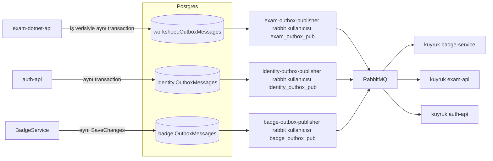

# OutboxPublisher (`Services/OutboxPublisher`)

**Bu dosya neyi anlatır:** Bu dosya `Services/OutboxPublisher` (`OutboxPublisherService.csproj`) worker'ını anlatır. Bu worker transactional outbox desenindeki "relay" görevini yapar: bir Postgres veritabanındaki `OutboxMessages` tablosunu poll eder ve bekleyen satırları RabbitMQ'ya MassTransit ile publish eder. Kod tek ve generic'tir. Aynı proje/imaj **üç ayrı instance** olarak, farklı veritabanlarına bağlanarak çalışır: `exam-outbox-publisher`, `identity-outbox-publisher`, `badge-outbox-publisher`. Hangi event'in hangi outbox'a yazıldığı, kimin tükettiği ve RabbitMQ izin matrisi [06-asenkron-akislar.md](../06-asenkron-akislar.md) dosyasındadır. Bu dosyada servis seviyesinde kalınır.

## İçindekiler

1. [Özet kart](#özet-kart)
2. [Dizin yapısı](#dizin-yapısı)
3. [Program.cs](#programcs)
4. [Polling döngüsü: OutboxProcessor](#polling-döngüsü-outboxprocessor)
5. [Worker.cs hakkında](#workercs-hakkında)
6. [Event tipi çözümleme](#event-tipi-çözümleme)
7. [Hata, yeniden deneme, dead-letter ve temizlik](#hata-yeniden-deneme-dead-letter-ve-temizlik)
8. [Teslim garantisi](#teslim-garantisi)
9. [Üç instance: aynı kod, farklı konfigürasyon](#üç-instance-aynı-kod-farklı-konfigürasyon)
10. [Konfigürasyon anahtarları](#konfigürasyon-anahtarları)
11. [İşletim notları](#işletim-notları)
12. [Testler](#testler)
13. [Doğrulanmadı](#doğrulanmadı)
14. [Ayrı issue adayları](#ayrı-issue-adayları)

---

## Özet kart

| Konu | Değer | Kanıt |
|---|---|---|
| Proje tipi | `Microsoft.NET.Sdk.Worker`, net10.0, `Host.CreateApplicationBuilder`. HTTP endpoint'i yok | `Services/OutboxPublisher/OutboxPublisherService.csproj:1`, `Services/OutboxPublisher/Program.cs:7` |
| Barındırılan servis | `OutboxProcessor` (`BackgroundService`) | `Services/OutboxPublisher/Program.cs:29` |
| Okuduğu tablo | `ConnectionStrings:DefaultConnection` ile bağlanılan DB'deki `"OutboxMessages"` | `Services/OutboxPublisher/Program.cs:11-14`, `Services/OutboxPublisher/Publishers/OutboxProcessor.cs:80-89` |
| Yazdığı yer | RabbitMQ, MassTransit `IPublishEndpoint.Publish`. Exchange adı `<Namespace>:<TypeName>`, ör. `ExamApp.Foundation.Contracts:AnswerSubmittedEvent` | `OutboxProcessor.cs:123`, `rabbitmq/definitions.json` (`exam_outbox_pub` yorumu) |
| Paylaşılan kod | `ExamApp.Foundation` (`OutboxMessage`, `OutboxEventRegistry`, event contract'ları) | `OutboxPublisherService.csproj:27`, `api/ExamApp.Foundation/Persistence/OutboxMessage.cs`, `api/ExamApp.Foundation/Contracts/OutboxEventRegistry.cs` |
| Instance'lar | `exam-outbox-publisher` (DB `worksheet`), `identity-outbox-publisher` (DB `identity`), `badge-outbox-publisher` (DB `badge`) | `AppHost/AppHost.cs:484`, `:509`, `:533` |



## Dizin yapısı

| Yol | İçerik |
|---|---|
| `Program.cs` | Host, DbContext, MassTransit, options ve hosted service kaydı (37 satır) |
| `Publishers/OutboxProcessor.cs` | Polling, publish, retry/dead-letter, purge. Asıl iş burada |
| `Publishers/OutboxOptions.cs` | `Outbox` config bölümü ve backoff hesabı |
| `Data/AppDbContext.cs` | Tek `DbSet<OutboxMessage> OutboxMessages`. Migration yoktur; tablo yazan servisin migration'ıyla gelir |
| `Worker.cs` | Şablondan kalan, **kayıtlı olmayan** örnek worker (aşağıda) |
| `appsettings.json` | Yalnız logging ayarı. Connection string ve RabbitMQ bilgisi yok |
| `Properties/launchSettings.json` | `DOTNET_ENVIRONMENT=Development` |
| `.devcontainer/devcontainer.json`, `app.sln`, `nuget.config` | Geliştirici kolaylıkları |

> **"Publishers klasörü" adı yanıltıcı olabilir.** İçinde event başına ayrı publisher sınıfları yoktur. Yalnız generic `OutboxProcessor` ve `OutboxOptions` bulunur. Event tipine özel kod yazılmaz; tip çözümlemesi `OutboxEventRegistry` üzerinden yapılır.

## Program.cs

`Services/OutboxPublisher/Program.cs`:

| Satır | Ne yapar |
|---|---|
| `:7` | `Host.CreateApplicationBuilder(args)`: Kestrel yok, port dinlemez |
| `:9` | `AddServiceDefaults()`: OTel, health check kaydı, resilience, service discovery. `MapDefaultEndpoints` çağrılmaz, çünkü HTTP pipeline yok. Health check'ler kaydedilir ama dışarı açılmaz |
| `:11-14` | `AppDbContext`: Npgsql, `ConnectionStrings:DefaultConnection` |
| `:16-26` | MassTransit `UsingRabbitMq`. Host `RabbitMQ:Host`, vhost `/`, `RabbitMQ:Username` / `RabbitMQ:Password`. **Consumer yok, receive endpoint yok.** Yalnız publish yapar. BadgeService'in aksine `guest` fallback'i yoktur |
| `:28` | `OutboxOptions` ← `Outbox` bölümü |
| `:29` | `AddHostedService<OutboxProcessor>()` |
| `:30-34` | Logging provider'larını temizler ve yalnız Console ekler. ServiceDefaults'un OTel log provider'ını da sildiği için worker logları Aspire dashboard'una OTLP ile gitmeyebilir (bkz. [Doğrulanmadı](#doğrulanmadı)) |

## Polling döngüsü: OutboxProcessor

Dosya: `Services/OutboxPublisher/Publishers/OutboxProcessor.cs`.

```mermaid
sequenceDiagram
  participant L as "ExecuteAsync döngüsü"
  participant DB as "Postgres OutboxMessages"
  participant R as "OutboxEventRegistry"
  participant MQ as "RabbitMQ"
  loop "her tur"
    L->>DB: "BEGIN; SELECT ... FOR UPDATE SKIP LOCKED LIMIT BatchSize"
    alt "satır yok"
      L->>DB: "ROLLBACK"
      L->>L: "PollInterval kadar bekle"
    else "satır var"
      loop "her mesaj"
        L->>R: "Resolve(Type)"
        alt "tip bulunamadı"
          L->>L: "dead-letter: RetryCount = MaxRetries"
        else "tip bulundu"
          L->>MQ: "Publish(event, eventType)"
          alt "başarılı"
            L->>L: "ProcessedAt = now, Error = null"
          else "hata"
            L->>L: "RetryCount++, NextAttemptAt = now + backoff"
          end
        end
      end
      L->>DB: "SaveChanges; COMMIT"
      L->>L: "batch dolu ise beklemeden devam, değilse PollInterval bekle"
    end
    L->>DB: "PurgeIfDue: ProcessedAt < now - Retention olan satırları sil"
  end
```

Ayrıntılar:
- **Döngü** (`OutboxProcessor.cs:40-67`): `ProcessBatchAsync` ardından `PurgeIfDueAsync` çalışır.
  - İşlenen satır sayısı `BatchSize`'dan azsa `PollInterval` (varsayılan 5 sn) beklenir.
  - Batch tam doluysa beklemeden yeni tura geçilir; birikmiş kuyruk hızla boşaltılır (`:53-55`).
  - Beklenmeyen hata loglanır ve `PollInterval` kadar beklenir (`:61-65`). Döngü ölmez.
- **Satır sahiplenme** (`:69-91`): Her tur kendi DB transaction'ında çalışır. Sorgu şudur:

  ```sql
  SELECT "Id", "Type", "Content", "CreatedAt", "ProcessedAt", "RetryCount", "NextAttemptAt", "Error"
  FROM "OutboxMessages"
  WHERE "ProcessedAt" IS NULL
    AND "RetryCount" < @MaxRetries
    AND ("NextAttemptAt" IS NULL OR "NextAttemptAt" <= @now)
  ORDER BY "CreatedAt"
  LIMIT @BatchSize
  FOR UPDATE SKIP LOCKED
  ```

  `FOR UPDATE SKIP LOCKED` sayesinde **aynı DB'ye bağlı birden fazla publisher replikası** aynı satırı almaz (`:14-18`). Sorgu `FromSqlRaw` ile compose edilmeden çalıştırılır; böylece kilit ifadesi korunur (`:77`).
- **Publish** (`:109-132`): Sırasıyla şunlar yapılır:
  1. `OutboxEventRegistry.Resolve(message.Type)` ile tip çözülür.
  2. `JsonSerializer.Deserialize(message.Content, eventType)` ile içerik açılır.
  3. `publisher.Publish(@event, eventType, ct)` ile gönderilir. Runtime tipiyle publish edildiği için exchange adı somut sözleşme tipidir.
  4. Başarıda `ProcessedAt = DateTime.UtcNow`, `Error = null` yazılır (`:125-126`).
- **İşaretleme ve commit** (`:104-106`): Batch'teki tüm durum değişiklikleri (`ProcessedAt`, `RetryCount`, `NextAttemptAt`, `Error`) tek `SaveChangesAsync` ile yazılır, ardından `CommitAsync` çağrılır. Satırlar silinmez; yalnız işaretlenir. Silme işi purge'ün görevidir.
- **Sıra**: `ORDER BY "CreatedAt"` tek batch ve tek replika içinde yaklaşık oluşturulma sırasını verir. Retry'a düşen bir satır sonraki satırların önüne geçemez; global sıra garantisi yoktur. Sıraya duyarlı tüketiciler (ör. puan) versiyon alanıyla korunur (bkz. [badge-service.md](badge-service.md#puan-ve-aggregate-hesabı)).

`OutboxMessage` alanları (`api/ExamApp.Foundation/Persistence/OutboxMessage.cs:5-28`): `Id` (Guid), `Type` (sözleşmenin `FullName`'i), `Content` (JSON), `CreatedAt`, `ProcessedAt`, `RetryCount`, `NextAttemptAt`, `Error`.

## Worker.cs hakkında

`Services/OutboxPublisher/Worker.cs:3-23`, `dotnet new worker` şablonunun saniyede bir "Worker running at" logu basan örneğidir. `Program.cs` içinde `AddHostedService<Worker>()` **yoktur**; yalnız `OutboxProcessor` kayıtlıdır (`Program.cs:29`). Yani polling döngüsü `Worker.cs`'de değil, `Publishers/OutboxProcessor.cs:40-67` içindedir. `Worker.cs` ölü koddur (bkz. [Ayrı issue adayları](#ayrı-issue-adayları)).

## Event tipi çözümleme

`api/ExamApp.Foundation/Contracts/OutboxEventRegistry.cs`:
- **Üretici** `OutboxEventRegistry.NameFor<T>()` ile `Type.FullName` yazar (namespace + sınıf, assembly yok) (`:44-52`). Örnek: `Services/BadgeService/Services/StudentPointsOutbox.cs:26`.
- **Publisher** `Resolve(storedType)` çağrısını yapar (`:54-74`). Sırası şöyledir:
  1. Bilinen listede `FullName` ile tam eşleşme (`:64-65`).
  2. Eski format `AssemblyQualifiedName`: ilk virgüle kadar olan kısım listede aranır (`:67-70`).
  3. Son çare `Type.GetType(storedType)` (`:72-73`).
  4. Hiçbiri tutmazsa `null` döner ve satır dead-letter olur.
- **Bilinen event listesi** (`:17-39`, 20 tip): `AnswerSubmittedEvent`, `QuestionCreatedEvent`, `WorksheetReminderDueEvent`, `WorksheetAccessRequestedEvent`, `WorksheetAccessRequestApprovedEvent`, `WorksheetAccessRequestRejectedEvent`, `LoginAttemptedEvent`, `TeacherApplicationSubmittedEvent`, `TeacherApplicationDecidedEvent`, `TeacherSchoolRequestSubmittedEvent`, `IndependentTeacherRegisteredEvent`, `BookingRequestCreatedEvent`, `BookingDecisionEvent`, `BookingTeacherUnavailableEvent`, `UserPreferredLocaleChangedEvent`, `StudentPointsChangedEvent`, `UserRoleChangedEvent`, `WorksheetCommentCreatedEvent`, `WorksheetCommentRepliedEvent`, `WorksheetCommentHiddenEvent`.
- **Yeni event eklerken** şu adımlar izlenir:
  1. Tip bu listeye eklenir. Eklenmezse publisher onu "Unresolved event type" diye dead-letter eder.
  2. İlgili publisher RabbitMQ kullanıcısının `configure`/`write` regex'ine (`rabbitmq/definitions.json`) exchange adı eklenir. Eklenmezse publish `ACCESS_REFUSED` ile başarısız olur ve retry/dead-letter yoluna girer.
  
  Tablo ve izinler: [06-asenkron-akislar.md](../06-asenkron-akislar.md), `.claude/rules/local-dev.md:80-100`.

## Hata, yeniden deneme, dead-letter ve temizlik

| Durum | Davranış | Kanıt |
|---|---|---|
| Tip çözülemedi | **Hemen** dead-letter: `RetryCount = MaxRetries`, `NextAttemptAt = null`, `Error = "Unresolved event type: '...'"`. Log seviyesi Error | `OutboxProcessor.cs:111-116`, `:155-161` |
| Deserialize/publish hatası | `RetryCount++`, `Error` alanına exception mesajı yazılır (en fazla 4000 karakter). `NextAttemptAt = now + backoff`, log seviyesi Warning | `OutboxProcessor.cs:128-153`, `:22`, `:186-187` |
| `RetryCount >= MaxRetries` | Dead-letter: `NextAttemptAt = null`, log seviyesi Error. Satır tabloda kalır ama sorgu filtresi (`RetryCount < MaxRetries`) yüzünden bir daha alınmaz | `OutboxProcessor.cs:139-146`, `:84` |
| Backoff | `RetryBackoffBase × 2^(attempt-1)`, en fazla `RetryBackoffMax`. Üs 20 ile sınırlı (taşma yok), attempt ≤ 0 ise 1 sayılır. Varsayılanlarla 10s, 20s, 40s, ... 30 dk | `Publishers/OutboxOptions.cs:29-40` |
| DB/genel hata (bağlantı vb.) | Tur loglanır, transaction dispose ile geri alınır, `PollInterval` beklenir | `OutboxProcessor.cs:61-65` |
| Purge | Yalnız `ProcessedAt != null && ProcessedAt < now - Retention` satırları `ExecuteDeleteAsync` ile silinir. `PurgeInterval`'da bir kez çalışır; `Retention <= 0` ise kapalıdır. **Dead-letter satırları purge edilmez** | `OutboxProcessor.cs:165-184` |

Dead-letter satırını elle yeniden kuyruğa almak için SQL örneği. Bu satırı yazan değil, ilgili DB'de çalıştırılmalıdır:

```sql
UPDATE "OutboxMessages"
SET "RetryCount" = 0, "NextAttemptAt" = NULL, "Error" = NULL
WHERE "Id" = '<guid>';
```

Bu bir işletim tarifidir; kodda böyle bir araç yoktur. Önce `Error` sütunu okunmalı ve kök neden (eksik registry kaydı, RabbitMQ izni) giderilmelidir.

## Teslim garantisi

- **En az bir kez (at-least-once).** Publish, DB transaction'ı **commit edilmeden önce** yapılır (`OutboxProcessor.cs:99-105`). Publish başarılı olup `SaveChanges`/`Commit` başarısız olursa (bağlantı kopması, süreç ölmesi) satır işlenmemiş kalır ve bir sonraki turda **yeniden publish edilir**.
- Bu yüzden **tüm tüketiciler idempotent olmalıdır**. Projede bu kurala uyulur: BadgeService consumer'ları `EventId` veya doğal anahtar dedup'ı yapar (`Services/BadgeService/Consumers/LoginAttemptedConsumer.cs:19-25`, bkz. [badge-service.md](badge-service.md#consumer-tablosu)).
- Batch içindeki satır kilitleri, publish süresince transaction açık kaldığı için tutulur. Yavaş bir broker bu satırları diğer replikalara kapatır. `SKIP LOCKED` kilitli satırları atlar, beklemez.
- MassTransit publisher confirm ayarı açıkça yapılandırılmamış; kütüphane varsayılanı geçerlidir (bkz. [Doğrulanmadı](#doğrulanmadı)).

## Üç instance: aynı kod, farklı konfigürasyon

Kod tamamen konfigürasyon güdümlüdür. Yalnız `ConnectionStrings:DefaultConnection` ve `RabbitMQ:*` okunur; hangi instance'ın hangi DB'ye bakacağı tamamen ortamdan gelir. Kodda instance'a özel dal yoktur. Gerekçe: #84 (identity DB'nin kendi relay'i) ve #225 (badge DB'nin relay'i). Multi-DB-aware tek publisher yazmak yerine aynı proje N kez deploy edilir. Kaynak: `AppHost/AppHost.cs:499-507`, agent hafızası `C:/Users/mustafa.sahin/examapp/.claude/agent-memory/devops-aspire/project_dual_outbox_publisher_pattern.md` (repoda değil). `docs/data-ownership.md:18-27` worksheet DB'deki bu paylaşımın bilinçli olduğunu, publisher'a ayrı DB verilmemesi gerektiğini anlatır.

### Aspire (AppHost/AppHost.cs)

Üç `AddProject<Projects.OutboxPublisherService>(...)` çağrısı vardır; resource adları farklı olduğu sürece aynı proje tipi birden çok kez eklenebilir.

| Resource | Satır | `DefaultConnection` | RabbitMQ kullanıcısı / parola parametresi | WaitFor |
|---|---|---|---|---|
| `exam-outbox-publisher` | `AppHost/AppHost.cs:484-497` | `examDb` → Postgres DB `worksheet` (`:24`, `:485`) | `exam_outbox_pub` / `rabbitmq-exam-outbox-password` (`:51-52`, `:494-495`) | postgres, rabbitmq |
| `identity-outbox-publisher` | `AppHost/AppHost.cs:509-523` | `identityDb` → `identity` (`:25`, `:510`) | `identity_outbox_pub` / `rabbitmq-identity-outbox-password` (`:53-54`, `:520-521`) | postgres, rabbitmq |
| `badge-outbox-publisher` | `AppHost/AppHost.cs:533-550` | `badgeDb` → `badge` (`:26`, `:534`) | `badge_outbox_pub` / `rabbitmq-badge-outbox-password` (`:55-56`, `:544-545`) | postgres, rabbitmq, **exam-badge-api**: tabloyu onun migration'ı yaratır (`:548-550`) |

Üçünde de `RabbitMQ__Host` ortak `rabbitmq` endpoint'inin host'una set edilir (`:487-490`, `:512-515`, `:536-539`). Port verilmez, 5672 varsayılır (`:66-70`).

`identity-outbox-publisher`, auth-api'yi **beklemez** (`:522-523`). auth-api migration'ı tamamlanmadan ilk turlar "relation does not exist" hatasıyla loglanabilir; döngü kendini toparlar (`OutboxProcessor.cs:61-65`). Prod compose'da bu sıra `depends_on: auth-api` ile çözülmüştür (`deploy/docker-compose.prod.yml:379-380`).

### docker-compose (dev, `docker-compose.yml`)

| Servis | Satır | Build | `ConnectionStrings__DefaultConnection` | RabbitMQ |
|---|---|---|---|---|
| `exam-outbox-publisher` | `docker-compose.yml:143-173` | `./dockerfiles/outboxpub/Dockerfile.outboxpub` | **Set edilmiyor** (`:151-161`) | `exam_outbox_pub` (`:159-161`) |
| `identity-outbox-publisher` | `docker-compose.yml:179-210` | aynı Dockerfile | `Database=identity` (`:192`) | `identity_outbox_pub` (`:196-198`) |
| `badge-outbox-publisher` | `docker-compose.yml:216-248` | aynı Dockerfile | `Database=badge` (`:227`) | `badge_outbox_pub` (`:232-234`); ayrıca `depends_on: exam-badge-api` (`:245-246`) |

Notlar:
- Dev compose'da "aynı imaj" ifadesi tam doğru değildir. Üçü de aynı **Dockerfile**'dan (`dockerfiles/outboxpub/Dockerfile.outboxpub`) build edilir. Bu Dockerfile yalnız .NET SDK + araçları kurup `CMD ["sleep", "infinity"]` ile bekler. Kaynak `./Services/OutboxPublisher:/app` ve `./api/ExamApp.Foundation` bind-mount ile gelir (`docker-compose.yml:162-164`). Komut `docker-compose.override.yml:15-22` içinden `dotnet watch run` ile verilir.
- **`exam-outbox-publisher` compose'da connection string almaz.** Bind-mount edilen klasördeki **gitignore'lu** bir `appsettings.Development.json`'a güvenir (`.gitignore:75`). Diğer iki instance aynı klasörü mount ettiği için onlar env ile override eder (agent hafızası `project_dual_outbox_publisher_pattern.md`). Temiz bir klon bu dosyaya sahip değildir.
- Compose'daki `ports` (8007/5081, 8008/5082, 8009/5083) ve `ASPNETCORE_URLS` değerleri worker için anlamsızdır, çünkü süreç HTTP dinlemez (`Program.cs:7`). `.claude/rules/local-dev.md:170-172` bu portları "HTTP/HTTPS" diye listeler; bunlar yalnız rezerve host portlarıdır.

### Prod (`deploy/docker-compose.prod.yml`, `deploy/docker-compose.prod.images.yml`)

- Burada gerçekten **tek imaj** vardır. Üç servis de `deploy/dockerfiles/dotnet-worker.Dockerfile` ile `PROJECT_PATH: Services/OutboxPublisher/OutboxPublisherService.csproj` build eder (`deploy/docker-compose.prod.yml:323-330`, `:355-362`, `:392-399`).
- İmaj modunda üçü de `${ACR_LOGIN_SERVER}/exam-outbox-publisher:${IMAGE_TAG}` imajını kullanır (`deploy/docker-compose.prod.images.yml:19-28`).
- Farkları yalnız ortam değişkenleridir. Prod DB adları: `worksheet_v2` (`:334`), `auth_db` (`:366`), `badge` (`:403`). Dev'deki `worksheet` / `identity` adlarından **farklıdır**; [04-veri-modeli.md](../04-veri-modeli.md) ile birlikte okunmalıdır.
- Sıralama: `identity-outbox-publisher` `auth-api`'ye (`:379-380`), `badge-outbox-publisher` `exam-badge-api`'ye (`:416-417`) `depends_on` ile bağlıdır.

### Hangi outbox'a ne yazılır (servis seviyesi özet)

Kesin liste 06'dadır. Burada yalnız RabbitMQ izinlerinden okunan kısa özet verilir (`rabbitmq/definitions.json:70-92`):

| Instance | Publish edebildiği exchange'ler |
|---|---|
| `exam_outbox_pub` | worksheet DB event'leri (AnswerSubmitted, QuestionCreated, WorksheetReminderDue, WorksheetAccess*, TeacherApplication*, TeacherSchoolRequestSubmitted, IndependentTeacherRegistered, Booking*, UserPreferredLocaleChanged, UserRoleChanged, WorksheetComment*) |
| `identity_outbox_pub` | `LoginAttemptedEvent`, `UserPreferredLocaleChangedEvent` |
| `badge_outbox_pub` | yalnız `StudentPointsChangedEvent` (bu exchange'e yazabilen tek kullanıcı) |

Hiçbirinin `read` izni yoktur (`"read": "^$"`). Publisher kuyruk tüketemez.

## Konfigürasyon anahtarları

| Anahtar | Varsayılan | Kaynak |
|---|---|---|
| `ConnectionStrings:DefaultConnection` | yok (appsettings'te yok) | Aspire `WithReference(..., connectionName: "DefaultConnection")`; compose/prod env (parola `.env` `POSTGRES_PASSWORD`) |
| `RabbitMQ:Host` | yok | Aspire `RabbitMQ__Host`; compose `rabbitmq` |
| `RabbitMQ:Username` | yok | instance'a özel literal (`exam_outbox_pub` vb.) |
| `RabbitMQ:Password` | yok | Aspire parametresi `rabbitmq-*-outbox-password` (dev-only değerler `AppHost/appsettings.json` `Parameters`); compose `.env` `RABBITMQ_*_PASSWORD` (`.env.example`) |
| `Outbox:PollInterval` | `00:00:05` | `Publishers/OutboxOptions.cs:9` |
| `Outbox:BatchSize` | 20 | `:12` |
| `Outbox:MaxRetries` | 10 | `:15` |
| `Outbox:RetryBackoffBase` | `00:00:10` | `:18` |
| `Outbox:RetryBackoffMax` | `00:30:00` | `:21` |
| `Outbox:Retention` | `7.00:00:00` (0 ise purge kapalı) | `:24` |
| `Outbox:PurgeInterval` | `01:00:00` | `:27` |

`Outbox:*` değerleri hiçbir appsettings veya compose dosyasında override edilmiyor; üç instance da varsayılanlarla çalışır. Bir instance'a özel ayar vermek için ör. `Outbox__BatchSize=50` env'i yalnız o resource'a eklenir.

## İşletim notları

- **Bir instance'ın çalışıp çalışmadığını görmek:** açılışta `OutboxProcessor started: poll {Poll}s, batch {Batch}, maxRetries {MaxRetries}` logu basılır (`OutboxProcessor.cs:42-44`). Aspire'da `aspire describe exam-outbox-publisher`, compose'da `docker logs exam-outbox-publisher` kullanılır.
- **Takılı/dead-letter mesaj sorgusu** ilgili DB'de çalıştırılır:

  ```sql
  SELECT "Id", "Type", "RetryCount", "NextAttemptAt", "Error", "CreatedAt"
  FROM "OutboxMessages"
  WHERE "ProcessedAt" IS NULL
  ORDER BY "CreatedAt";
  ```

- **RabbitMQ izin hatası** (`ACCESS_REFUSED`) publish hatası olarak `Error` sütununa düşer. `rabbitmq/definitions.json` değişikliğinden sonra Aspire'da rabbitmq resource'u yeniden başlatılmalıdır (`AppHost/AppHost.cs:87-91`). Compose için `.claude/rules/local-dev.md` geçerlidir.
- **Health:** worker'da HTTP olmadığı için `/health` yoktur. Aspire dashboard'unda süreç durumu dışında hazırlık sinyali görünmez.

## Testler

Proje: `tests/OutboxPublisher.Tests`. `Testcontainers.PostgreSql` 4.0.0, EF Core Relational, Npgsql kullanır (`tests/OutboxPublisher.Tests/OutboxPublisher.Tests.csproj:4-11`). `InternalsVisibleTo` ile `internal` `ProcessBatchAsync` / `PurgeIfDueAsync` doğrudan çağrılır (`Services/OutboxPublisher/OutboxPublisherService.csproj:22-24`).

| Dosya | Kapsam |
|---|---|
| `OutboxProcessorTests.cs` | Gerçek Postgres (`postgres:16-alpine` Testcontainer, `:21`). Geçerli mesaj publish edilip işaretleniyor mu (`:70`). Çözülemeyen tip hemen dead-letter oluyor mu (`:89`). Başarısız publish backoff ile deneniyor ve dead-letter'a düşüyor mu (`:104`). Backoff penceresindeki satır atlanıyor mu (`:123`). Batch boyutu ve `CreatedAt` sırası korunuyor mu (`:139`). `FOR UPDATE SKIP LOCKED` SQL'i gerçek Postgres'te çalıştığı için SQLite kullanılmaz |
| `OutboxOptionsTests.cs` | Backoff: üstel artış (`:19`), tavan (`:23`), taşmama (`:30`), ≤0 attempt (`:37`), varsayılanların makullüğü (`:41`) |
| `RecordingPublishEndpoint.cs` | Publish edilen mesajları kaydeden / hata fırlatabilen sahte `IPublishEndpoint` (`:6-50`) |

Çalıştırmak için Docker gerekir:

```bash
dotnet test tests/OutboxPublisher.Tests -c Release
```

Registry çözümleme testleri ayrı projededir: `tests/ExamApp.Foundation.Tests/Contracts/OutboxEventRegistryTests.cs`.

## Doğrulanmadı

- `Program.cs:30-34` içindeki `ClearProviders()` çağrısının ServiceDefaults'un eklediği OpenTelemetry log provider'ını kaldırıp kaldırmadığı ve dolayısıyla worker loglarının Aspire dashboard'unda "Structured logs" altında görünüp görünmediği çalışma zamanında kontrol edilmedi. Konsol logları dashboard'da yine görünür.
- MassTransit 8.4.1 RabbitMQ transport'unda publisher confirm'in varsayılan olarak açık olduğu kütüphane bilgisine dayanır; bu repoda açıkça ayarlanmadığı doğrulandı (`Program.cs:16-26`).
- Temiz bir klonda compose ile `exam-outbox-publisher`'ın connection string bulamayıp başarısız olacağı kodu okuyarak çıkarılan bir sonuçtur (env ve izlenen appsettings'te anahtar yok); çalıştırılarak denenmedi.

## Ayrı issue adayları

`gh issue list --state all` ile "outbox", "exam-outbox-publisher ConnectionStrings", "Type.GetType outbox", "Worker.cs" aramaları yapıldı. Eşleşen issue bulunmadı.

1. **Dev compose'da `exam-outbox-publisher` connection string'i yok** (`docker-compose.yml:151-161`). Gitignore'lu `Services/OutboxPublisher/appsettings.Development.json`'a bağımlı. Temiz klonda worksheet outbox'ı relay edilmez. Bu durumda puan, bildirim ve sınıflandırma olayları hiç akmaz. Diğer iki instance gibi env ile verilmeli.
2. **`OutboxEventRegistry.Resolve` son çare olarak `Type.GetType(storedType)` kullanıyor** (`api/ExamApp.Foundation/Contracts/OutboxEventRegistry.cs:72-73`). `OutboxMessages` tablosuna yazabilen biri publisher sürecinde yüklü herhangi bir tipi JSON'dan oluşturup publish ettirebilir. Kayıt listesinin "tek kaynak" amacıyla da çelişir. Allowlist dışı tip için `null` dönmek daha güvenli. RabbitMQ izinleri exchange seviyesinde sınırlama yapıyor; risk düşük.
3. **Dead-letter satırları için görünürlük yok.** Kalıcı olarak tabloda kalıyorlar (purge yalnız işlenmişleri siliyor, `OutboxProcessor.cs:178-180`). Metrik, health check veya alarm yok. Sessiz veri kaybı yalnız log taramasıyla fark ediliyor.
4. **`Worker.cs` ölü şablon kodu** (`Services/OutboxPublisher/Worker.cs`). Kayıtlı değil, ama "polling döngüsü burada" yanılgısına yol açıyor. Silinmeli.
5. **`.claude/rules/local-dev.md:170-172` publisher'lar için "HTTP/HTTPS" portları listeliyor**; compose'da da `ports` ve `ASPNETCORE_URLS` var (`docker-compose.yml:148-153` vb.). Worker HTTP dinlemiyor. Doküman ve compose sadeleştirilmeli.
6. **`Services/OutboxPublisher/.devcontainer/devcontainer.json` var olmayan `../../../docker-compose.yaml` dosyasına işaret ediyor**; repodaki dosya `docker-compose.yml`. Devcontainer açılmaz (Doğrulanmadı: VS Code'un uzantı varyantını tolere edip etmediği).
7. **Aspire'da `identity-outbox-publisher` auth-api'yi beklemiyor** (`AppHost/AppHost.cs:522-523`). `badge-outbox-publisher` ise `exam-badge-api`'yi bekliyor (`:550`). Prod compose'daki `depends_on: auth-api` (`deploy/docker-compose.prod.yml:379-380`) ile tutarlı olması için `WaitFor(authApi)` eklenmeli. Şu haliyle sorun yalnız açılışta "relation does not exist" log gürültüsü olarak görülür.
