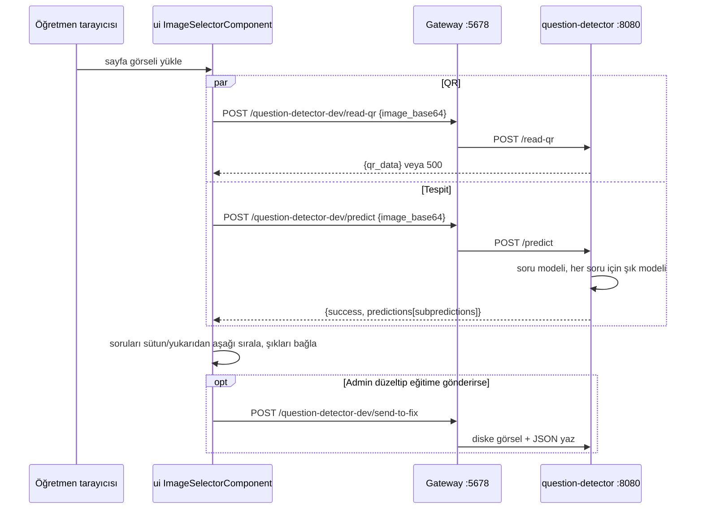

# `question-detector/` — YOLO tabanlı soru/şık tespit servisi (Python)

Bu dosya, sayfa görüntüsündeki soru ve şık kutularını YOLOv8 ile bulan, QR kod okuyan ve öğretmen/admin düzeltmelerini eğitim verisi olarak diske yazan küçük Python servisini anlatır: framework, endpoint'ler ve girdi/çıktı formatları, kullanılan model dosyaları (dev ve prod'da farklı!), kim çağırıyor, Dockerfile'lar ve bağımlılıklar, gateway yönlendirmesi, eğitim scriptleri ve yeniden eğitim akışı. Soru tespitinin uçtan uca akışı için [`../07-uctan-uca-akislar.md`](../07-uctan-uca-akislar.md); tespit edilen kutuların UI'da nasıl yerleştirildiği (layout algoritması) için [`../../question-layout-algorithm-analysis.md`](../../question-layout-algorithm-analysis.md).

## İçindekiler

1. [Özet tablo](#1-özet-tablo)
2. [Dizin yapısı](#2-dizin-yapısı)
3. [Uygulama (`main.py`)](#3-uygulama-mainpy)
4. [Endpoint'ler ve veri formatları](#4-endpointler-ve-veri-formatları)
5. [Model dosyaları](#5-model-dosyaları)
6. [Kim çağırıyor](#6-kim-çağırıyor)
7. [Çalıştırma: docker-compose, Aspire, prod](#7-çalıştırma-docker-compose-aspire-prod)
8. [Bağımlılıklar](#8-bağımlılıklar)
9. [Eğitim verisi ve yeniden eğitim](#9-eğitim-verisi-ve-yeniden-eğitim)
10. [Testler](#10-testler)
11. [Doğrulanmadı](#11-doğrulanmadı)
12. [Ayrı issue adayları](#12-ayrı-issue-adayları)

---

## 1. Özet tablo

| Konu | Değer | Kaynak |
|---|---|---|
| Dil / framework | Python 3.11, **FastAPI** + uvicorn | `question-detector/main.py:1`, `:15`; `question-detector/Dockerfile:1` |
| Model kütüphanesi | `ultralytics` (YOLOv8), CPU-only torch | `question-detector/main.py:6`, `question-detector/requirements.txt` |
| QR | `pyzbar` (sistem paketi `libzbar0`) | `question-detector/main.py:14`, `question-detector/Dockerfile:12` |
| Port | 8080 (container içi ve host) | `docker-compose.yml:362-364`, `AppHost/AppHost.cs:867-870` |
| Gateway yolu | `/question-detector-dev/{everything}` → `/{everything}`, **kimlik doğrulaması yok** | `Services/Gateway/ocelot.json:39-49`, `Services/Gateway/ocelot.Production.json:38-49` |
| Veritabanı / broker | Yok. Durum yalnız dosya sistemi (`data/`) | `AppHost/AppHost.cs:862-864`, `question-detector/main.py:26-45` |
| Çağıran | Yalnız `ui` (`QuestionDetectorService`); .NET servislerinden çağrı yok | §6 |
| Test | Yok | §10 |

## 2. Dizin yapısı

```
question-detector/
├── main.py                 # FastAPI uygulaması (tek dosya)
├── Dockerfile              # dev imajı (kaynak kopyalamaz, CMD yok)
├── requirements.txt        # dev (torch CPU index + sabit sürümler)
├── requirements.prod.txt   # prod (sürümsüz)
├── commands.sh             # eğitim/predict komut notları (çalıştırılabilir script değil)
├── README.md               # boş
├── yolov8n.pt              # YOLOv8n temel ağırlığı (6.5 MB)
├── YOLOv8/yolov8n/         # eski bir eğitimin args.yaml + grafikleri
├── scripts/                # JSON → YOLO label dönüştürücüler, deneme predict'leri
├── data/
│   ├── dataset.yaml, dataset-answers.yaml, data-only-questions.yaml   # YOLO dataset tanımları (Colab yolları)
│   ├── questions/runs/<run>/weights/{best,last}.pt   # soru modeli eğitimleri (train4, train5, train32, train20251206-22)
│   ├── answers/runs/<run>/weights/{best,last}.pt     # şık modeli eğitimleri (train-answers-v4 … v11)
│   ├── questions/images, answers/images, crops/, json/ # /send-to-fix* ile biriken eğitim verisi (gitignore)
│   └── images/
├── runs/detect/…           # daha eski yerel eğitimler (.pt'ler tracked)
├── .devcontainer/devcontainer.json, .vscode/launch.json
└── prediction.json, predictions.json   # deneme çıktıları
```

`.gitignore` `question-detector/runs/`, `data/questions/`, `data/answers/`, `data/images/`, `data/crops/`, `data/json/*.json` yollarını yok sayar (`.gitignore` "question-detector" bloğu), ama `.pt` ağırlıkları daha önce zorla eklenmiş olduğu için tracked'dir (`git ls-files question-detector | grep .pt` → 50+ dosya; `data` ~215 MB, `runs` ~235 MB). Prod imajı bu tracked ağırlıklara bağımlıdır (§5).

## 3. Uygulama (`main.py`)

- `app = FastAPI()` (`question-detector/main.py:15`); logging `INFO` (`:19-24`).
- Başlangıçta dizinleri oluşturur ve boş JSON indekslerini yazar: `data/questions/images`, `data/answers/images`, `data/crops`, `data/json/questions.json`, `data/json/answers.json` (`:26-45`). Çalışma dizini `/app` olmalı (Dockerfile `WORKDIR /app`, compose `working_dir: /app`).
- CORS: `allow_origins=["*"]` + `allow_credentials=True` + tüm metot/header (`:71-77`).
- Modeller modül yüklenirken bir kez yüklenir (`:87-112`): `model` (soru) ve `sub_model` (şık). Yol çözümü `resolve_model_path(env, deployed, legacy)`: önce ortam değişkeni (`QUESTION_MODEL_PATH`, `ANSWER_MODEL_PATH`), sonra imajdaki `/app/models/*.pt`, yoksa repo içindeki eski yol.
- Pydantic modelleri (`:48-67`): `ImageData { image_base64 }`, `AnswerBox { x, y, width, height }`, `QuestionBox { x, y, width, height, answers: AnswerBox[] }`, `UploadQuestionsRequest { answerCount, imageData: ImageData, questions: QuestionBox[] }`.
- Kimlik doğrulama, rate limit, istek boyutu sınırı yok.

## 4. Endpoint'ler ve veri formatları

Tüm uçlar `POST`, JSON gövde. Gateway üzerinden tam yol `/question-detector-dev/<uç>`.

### `POST /predict` — soru + şık tespiti (`main.py:169-243`)

İstek: `{ "image_base64": "data:image/png;base64,...." }` (`data:` öneki opsiyonel).

İşleyiş: görseli RGB'ye çevirir, soru modelini `conf=0.25` ile koşturur; `class_id == 0` olan her kutuyu kırpıp şık modeline verir ve alt kutuların koordinatlarını ana görsele göre öteler (`:209-236`).

Yanıt (hata olsa bile HTTP 200):

```json
{
  "success": true,
  "predictions": [
    {
      "class_id": 0, "x": 120, "y": 340, "width": 610, "height": 420,
      "subpredictions": [
        { "class_id": 0, "x": 150, "y": 600, "width": 130, "height": 60 }
      ]
    }
  ]
}
```

Koordinatlar piksel, sol-üst köşe + genişlik/yükseklik, tamsayı. `subpredictions` yalnız `class_id == 0` kutularında bulunur. Hata: `{ "success": false, "error": "<mesaj>" }` (`:242-243`). UI tarafındaki tip: `ui/src/app/models/prediction.ts` (`Prediction`, `PredictionList`).

Sınıflar: dataset tanımlarında `names: ['question', 'answers']` (`question-detector/data/dataset.yaml`, `dataset-answers.yaml`). UI soru modelinde `class_id === 0`'ı soru, şık modelinde `class_id === 0`'ı şık olarak alır (`ui/src/app/pages/image-selector/image-selector.component.ts:1854-1880`); `json_to_yolo_answers.py` şık etiketlerini de `class_id = 0` ile yazar (`question-detector/scripts/json_to_yolo_answers.py:53`).

### `POST /read-qr` — QR okuma (`main.py:352-377`)

İstek: `ImageData`. Yanıt: `{ "qr_data": "<ilk QR'ın metni>" }`. QR yoksa 404 atmaya çalışır ama genel `except` bunu yakalayıp **500**'e çevirir (`:369-377`; §12).

### `POST /send-to-fix` — düzeltilmiş soru kutularını eğitim verisi olarak kaydet (`main.py:246-344`)

İstek: `UploadQuestionsRequest`. Her sorunun `answers` sayısı `answerCount`'a eşit değilse 400 (`:249-255`; ama bu da genel `except` ile 500'e döner).

Yan etkiler (hepsi diske):
- Tam görsel `data/questions/images/<uuid>.jpg`.
- Her soru kırpıntısı `data/crops/<uuid>.jpg_q<n>.jpg`.
- Şıkları olan her soru için kırpıntı + göreli şık kutuları `upload_answers_logic` ile `data/answers/images/` ve `data/json/answers.json`'a eklenir (`:298-319`, `:115-167`).
- Soru kutuları `data/json/questions.json`'a eklenir (`:324-330`).

Yanıt: `{ "success": true, "added": <n>, "imageFile": "<uuid>.jpg", "crops": [...] }`.

### `POST /send-to-fix-for-answers` — yalnız şık kutularını kaydet (`main.py:347-349`)

İstek: `UploadQuestionsRequest` (her eleman bir şık kutusu). `upload_answers_logic` ile `data/answers/images/` + `data/json/answers.json`. Yanıt: `{ success, added, imageFile }`.

### UI'nın çağırdığı ama olmayan uç

`/headerlist` — `ui/src/app/services/question-detector.service.ts:16-18` çağırır, `main.py`'de yok (§12).

## 5. Model dosyaları

| Ortam | Soru modeli | Şık modeli | Nereden |
|---|---|---|---|
| Dev (docker-compose / Aspire, bind mount) | `data/questions/runs/train5/weights/best.pt` | `data/answers/runs/train-answers-v10/weights/best.pt` | `resolve_model_path` fallback (`question-detector/main.py:99-109`); `/app/models/` bind mount'ta yok |
| Prod imajı | `data/questions/runs/train20251206-22/weights/best.pt` → `/app/models/question-best.pt` | `data/answers/runs/train-answers-v11/weights/best.pt` → `/app/models/answer-best.pt` | `deploy/dockerfiles/question-detector.Dockerfile` (COPY satırları) |

**Dev ve prod farklı ağırlık sürümleri kullanıyor.** Dev'de prod ile aynı modeli kullanmak için `QUESTION_MODEL_PATH` / `ANSWER_MODEL_PATH` ortam değişkenlerini verin (compose'ta tanımlı değil). Hangi modelin daha iyi olduğu **Doğrulanmadı**. `main.py:80-85`'te önceki denemelerin yolları yorum satırı olarak duruyor.

## 6. Kim çağırıyor

- **Yalnız `ui`.** `.NET` tarafında (api, auth-api, Services) `question-detector` çağrısı yok (grep; tek eşleşme gateway'in host override yorumu `Services/Gateway/Program.cs:40-43`).
- `ui/src/app/services/question-detector.service.ts:12-40`: `predict` → `/predict`, `readQrData` → `/read-qr`, `sendtoFix` → `/send-to-fix` (hatayı `{ success:false, status, message }`'a çevirir), `sendtoFixForAnswer` → `/send-to-fix-for-answers`, `getContents` → `/headerlist` (yok).
- Kullanan komponent: `ImageSelectorComponent` (`ui/src/app/pages/image-selector/image-selector.component.ts:155`). Görsel yüklendiğinde/değiştiğinde `predict()` çağrılır (`:648`, `:787`, `:859`); `predict()` paralel olarak `/read-qr` ve `/predict` atar (`:1842-1880`). Bu komponent hem `/imageselect` rotasında hem de soru oluşturma ekranı `QuestionCanvasComponent`'in içinde gömülüdür (`ui/src/app/pages/question/question-canvas.component.html:221`; `/questioncanvas`, `/questioncanvas/:id`).
- Eğitim verisi gönderimi (`sendToFix`) UI'da yalnız Admin'e açıktır (`ui/src/app/pages/question/question-canvas.component.ts:107-108`, `:367-371`) — ama bu yalnız istemci kontrolüdür; servis ve gateway route'u kimliksizdir (§12).



## 7. Çalıştırma: docker-compose, Aspire, prod

| Ortam | Tanım | Ayrıntı |
|---|---|---|
| docker-compose | `question-detector-dev` (`docker-compose.yml:352-369`) | `context: .`, `dockerfile: question-detector/Dockerfile`, `./question-detector:/app` bind mount, `working_dir: /app`, port `8888` (Jupyter için ayrılmış) ve `8080`. Komut override'da: `uvicorn main:app --host 0.0.0.0 --port 8080 --reload` (`docker-compose.override.yml:30-31`) |
| Aspire | `AddDockerfile("question-detector", "..", "question-detector/Dockerfile")` + `WithBindMount("../question-detector", "/app")` + `WithArgs("uvicorn", ...)` + `WithHttpEndpoint(port: 8080, targetPort: 8080)` (`AppHost/AppHost.cs:867-870`). Gateway'e `QUESTION_DETECTOR_HOST=localhost`, `QUESTION_DETECTOR_PORT=8080` (`:878-880`) | Host süreci (`AddUvicornApp`) yerine container seçildi: Windows'ta pyzbar'ın `libzbar-64.dll`/`libiconv.dll` yüklenemiyordu (`AppHost/AppHost.cs:843-854`). Dockerfile'da COPY/CMD olmadığı için kaynak bind mount, komut `WithArgs` ile verilir (`:855-861`) |
| Prod | `question-detector` servisi, `deploy/dockerfiles/question-detector.Dockerfile`, container adı `exam-question-detector`, port expose edilmez (yalnız iç ağ) (`deploy/docker-compose.prod.yml:153-160`) | `requirements.prod.txt` + yalnız `main.py` ve iki ağırlık kopyalanır; `CMD uvicorn main:app --host 0.0.0.0 --port 8080`. Prod gateway route'u `exam-question-detector:8080`'e gider (`Services/Gateway/ocelot.Production.json:38-49`) |

Gateway host override'ı: Ocelot JSON'undaki sentinel host `question-detector-dev`, ortam değişkenleriyle değiştirilir (`Services/Gateway/Program.cs:40-43`). Ayrıntı: [gateway.md](gateway.md).

Yerel (container'sız) çalıştırma: `commands.sh`'deki `source venv/bin/activate` + `uvicorn main:app --host 0.0.0.0 --port 8080` notu ve `.vscode/launch.json` (debugpy + uvicorn `--reload`). Windows host'ta pyzbar DLL sorunu nedeniyle önerilmez.

İlk build uzun sürer: torch CPU wheel'leri ayrı index'ten kurulur, aksi halde ultralytics ~2.5 GB CUDA wheel'i indirir ve Aspire build timeout'una takılır (`question-detector/Dockerfile:24-31`).

## 8. Bağımlılıklar

| Dosya | İçerik | Kullanan |
|---|---|---|
| `requirements.txt` | `torch==2.5.1`, `torchvision==0.20.1`, `fastapi==0.115.6`, `uvicorn[standard]==0.34.0`, `pillow==11.1.0`, `ultralytics==8.3.55`, `pyzbar==0.1.9` | `question-detector/Dockerfile` (dev, Aspire) |
| `requirements.prod.txt` | `--index-url` PyTorch CPU + `--extra-index-url` PyPI; `torch`, `torchvision`, `torchaudio`, `fastapi`, `uvicorn`, `pillow`, `ultralytics`, `pyzbar` — **sürüm sabitlenmemiş** | `deploy/dockerfiles/question-detector.Dockerfile` |

Sistem paketleri: dev Dockerfile `libgl1`, `libglib2.0-0`, `libzbar0`, `tesseract-ocr`, `tesseract-ocr-tur`, `tree` kurar (`question-detector/Dockerfile:4-15`); prod Dockerfile tesseract kurmaz. `main.py` tesseract/OCR kullanmıyor (AppHost yorumundaki "QR/OCR" ifadesine rağmen; `AppHost/AppHost.cs:843`).

## 9. Eğitim verisi ve yeniden eğitim

Eğitim boru hattı otomatik değildir; `commands.sh` bir komut defteri gibi kullanılmış (yerel CPU ve Google Colab `/content/drive/...` yollarıyla). Tipik akış:

1. UI'dan Admin `send-to-fix` ile düzeltilmiş kutuları gönderir → `data/json/questions.json`, `data/json/answers.json` ve görseller birikir (§4).
2. JSON → YOLO label dönüşümü:
   - `scripts/json_to_yolo_only_questions.py` — `questions.json` → soru etiketleri (`class 0`), Colab yolu sabit (`:7`).
   - `scripts/json_to_yolo_answers.py` — `answers.json` → şık etiketleri; **yalnızca tam 4 kutusu olan görseller** yazılır (`:45-57`), yani model 4 şıklı sorular üzerinde eğitilir.
   - `scripts/json_to_yolo.py` — eski birleşik dönüştürücü (`/app/data/json/questionsv2.json`, soru = 0, şık = 1; `:7-13`).
3. Eğitim (`commands.sh`), örnek: `yolo detect train data=data/dataset.yaml model=<önceki best.pt> epochs=50 imgsz=640 batch=1 project=runs/detect name=<yeni-ad> device=cpu`. Şık modeli için `data=data/dataset-answers.yaml`. Önceki eğitimin `best.pt`'sinden devam edilir (fine-tune zinciri: `train-answers-v2 → v3 …`).
4. Dataset YAML'ları (`data/dataset.yaml`, `data/dataset-answers.yaml`) `path`'i Colab Drive'a sabitlenmiş; yerelde çalıştırmadan önce düzenlenmeli. `data-only-questions.yaml` tek sınıflı (`names: ['question']`).
5. Yeni modeli devreye almak için: dev'de `main.py`'deki legacy yolu ya da `QUESTION_MODEL_PATH`/`ANSWER_MODEL_PATH`; prod'da `deploy/dockerfiles/question-detector.Dockerfile`'daki COPY satırları güncellenir.
6. Deneme scriptleri: `scripts/predict_to_json.py`, `predict_to_pixel_json.py`, `test-pred.py` — sabit model/görsel yollarıyla tek görsel üzerinde predict yapıp JSON yazar (`prediction.json`, `predictions.json` bunların çıktısı).

Kalite metrikleri (mAP vb.) her eğitim klasörünün `results.csv`/grafiklerinde (Ultralytics standart çıktısı); hangi run'ın neden seçildiğine dair kayıt yok — **Doğrulanmadı**.

## 10. Testler

Servis için birim/entegrasyon testi yok (`question-detector/` altında test dosyası yok). UI tarafında `QuestionDetectorService` için spec de yok; `question-canvas.component.spec.ts` `ImageSelectorComponent`'i sahte nesneyle değiştirir (`ui/src/app/pages/question/question-canvas.component.spec.ts:19`, `:581`).

## 11. Doğrulanmadı

- Dev (`train5`/`train-answers-v10`) ve prod (`train20251206-22`/`train-answers-v11`) modellerinden hangisinin daha doğru olduğu ve seçim gerekçesi (§5, §9).
- `/send-to-fix-for-answers`'ın UI'dan fiilen tetiklenip tetiklenmediği: `ImageSelectorComponent.sendToFixForAnswer()` (`ui/src/app/pages/image-selector/image-selector.component.ts:1814-1840`) şablonlarda çağrılmıyor (grep) ve gönderdiği gövdede `answerCount` ile `questions[].answers` alanları yok; Pydantic bu isteği 422 ile reddeder (canlı denenmedi).
- Prod'da `requirements.prod.txt` sürümsüz olduğu için imajın hangi ultralytics/torch sürümleriyle kurulduğu.

## 12. Ayrı issue adayları

Mevcut issue araması (`question-detector`, `headerlist`) eşleşme vermedi; ilgili kapalı issue: #78 ("Soru Kaydet ekranında No Such file or directory").

1. **Kimliksiz, dışa açık, diske yazan uçlar** — gateway route'unda `AuthenticationOptions` yok (`Services/Gateway/ocelot.json:39-49`, `Services/Gateway/ocelot.Production.json:38-49`); servisin kendisinde de auth yok, CORS `*` + credentials (`question-detector/main.py:71-77`). Herhangi biri `/question-detector-dev/send-to-fix` ile sınırsız boyutta görseli sunucu diskine yazdırabilir (disk doldurma, eğitim verisi zehirleme) ve `/predict` ile CPU'yu tüketebilir. UI'daki "yalnız Admin" kontrolü (`question-canvas.component.ts:107`) yalnız istemci tarafıdır.
2. **Hata kodları yutuluyor** — `/read-qr` 404'ü ve `/send-to-fix` 400'ü genel `except Exception` tarafından 500'e çevriliyor (`question-detector/main.py:369-377`, `:249-255` + `:342-344`); `/predict` hatada 200 + `success:false` döner (`:242-243`). Ayrıca 500 gövdesinde ham exception metni (`str(e)`) istemciye döner.
3. **UI var olmayan `/headerlist` ucuna istemci metodu taşıyor** — `ui/src/app/services/question-detector.service.ts:16-18`.
4. **`/send-to-fix-for-answers` istemci gövdesi şemaya uymuyor** — `ui/src/app/pages/image-selector/image-selector.component.ts:1822-1830` vs `question-detector/main.py:64-67` (bkz. §11).
5. **Dev/prod model sürüm farkı ve sürümsüz prod bağımlılıkları** — `question-detector/main.py:99-109` vs `deploy/dockerfiles/question-detector.Dockerfile`; `question-detector/requirements.prod.txt`. Dev'de görülen tespit davranışı prod'dakinden farklı olabilir; prod imajı her build'de farklı kütüphane sürümü çekebilir.
6. **Repo şişkinliği** — 50+ `.pt` ağırlığı (`last.pt`'ler ve eski run'lar dahil) gitignore'a rağmen tracked (`data` ~215 MB, `runs` ~235 MB); yalnız iki `best.pt` prod'da kullanılıyor. Git LFS / artefakt deposu değerlendirilebilir.
7. **Kırık devcontainer** — `question-detector/.devcontainer/devcontainer.json:3-5` `../../docker-compose.yaml`'a işaret ediyor; repodaki dosya `docker-compose.yml`.
8. **`send-to-fix` dosya yazımı eşzamanlılık güvenli değil** — `data/json/*.json` `r+` ile okunup baştan yazılıyor (`question-detector/main.py:149-154`, `:325-330`); eşzamanlı iki istek kayıt kaybettirebilir. (`--reload` ile tek worker'da düşük olasılık.)
