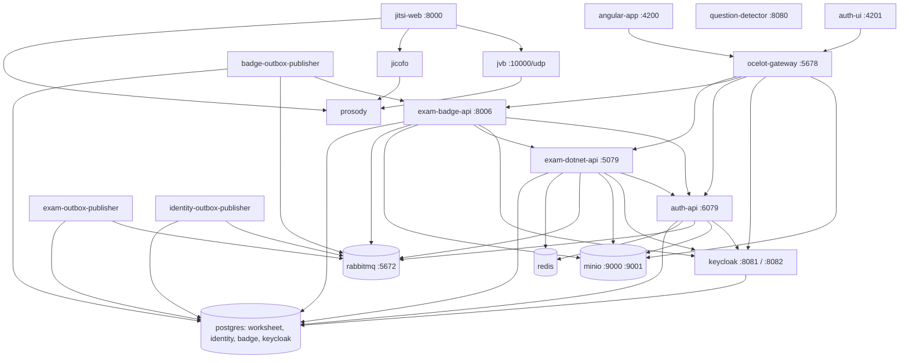

# ServiceDefaults ve AppHost (Aspire orkestrasyonu)

**Bu dosya neyi anlatır:** Bu dosya iki projeyi anlatır.
- `ServiceDefaults/`: .NET servislerinin ortak OpenTelemetry, health check, resilience ve service discovery ayarlarını içerir.
- `AppHost/`: .NET Aspire AppHost'tur. Yerel geliştirmede bütün sistemi (Postgres, Redis, RabbitMQ, MinIO, Keycloak, Jitsi, .NET servisleri, Angular uygulamaları, question-detector) ayağa kaldırır.

AppHost bölümü, `AppHost/AppHost.cs` içindeki **her resource'un** adını, imajını/projesini, portunu, bağımlılıklarını (`WithReference` / `WaitFor`), verilen ortam değişkeni **anahtarlarını** ve parametrelerini `path:line` ile listeler. [01-sistem-haritasi.md](../01-sistem-haritasi.md) bu tabloya dayanır. Ortamı kurma adımları için [02-ortam-kurulumu.md](../02-ortam-kurulumu.md), `docs/local-development.md` ve `.claude/rules/local-dev.md`; tasarım kararları için `docs/aspire-migration-decisions.md`.

## İçindekiler

1. [ServiceDefaults](#servicedefaults)
2. [AppHost projesi](#apphost-projesi)
3. [Parametreler](#parametreler)
4. [Resource dökümü](#resource-dökümü)
5. [Bağımlılık grafiği](#bağımlılık-grafiği)
6. [Resource ayrıntıları ve ortam değişkenleri](#resource-ayrıntıları-ve-ortam-değişkenleri)
7. [Port özeti ve compose ile karşılaştırma](#port-özeti-ve-compose-ile-karşılaştırma)
8. [Desenler ve tuzaklar](#desenler-ve-tuzaklar)
9. [Yeni bir resource eklerken](#yeni-bir-resource-eklerken)
10. [Doğrulanmadı](#doğrulanmadı)
11. [Ayrı issue adayları](#ayrı-issue-adayları)

---

## ServiceDefaults

Proje: `ServiceDefaults/ExamApp.ServiceDefaults.csproj`. `IsAspireSharedProject=true`, `FrameworkReference Microsoft.AspNetCore.App` (`ServiceDefaults/ExamApp.ServiceDefaults.csproj:7-11`). Paketler: `Microsoft.Extensions.Http.Resilience` 10.8.0, `Microsoft.Extensions.ServiceDiscovery` 10.8.0, OpenTelemetry 1.15.x (`:13-19`).

Kod: `ServiceDefaults/Extensions.cs`. Namespace `Microsoft.Extensions.Hosting`, bu yüzden ayrı `using` gerekmez (`:11`).

| Metot | Satır | Ne yapar |
|---|---|---|
| `AddServiceDefaults<TBuilder>()` | `:21-45` | Sırasıyla `ConfigureOpenTelemetry`, `AddDefaultHealthChecks`, `AddServiceDiscovery` çağırır ve **tüm** `HttpClient`'lara `ConfigureHttpClientDefaults` ile `AddStandardResilienceHandler()` + `AddServiceDiscovery()` ekler (`:29-36`) |
| `ConfigureOpenTelemetry` | `:47-79` | Loglar: OTel logger (`IncludeFormattedMessage`, `IncludeScopes`) (`:49-53`). Metrikler: ASP.NET Core, HttpClient, Runtime (`:56-61`). Trace: `ApplicationName` kaynağı, ASP.NET Core (`/health` ve `/alive` hariç), HttpClient (`:62-74`) |
| `AddOpenTelemetryExporters` | `:81-98` | `OTEL_EXPORTER_OTLP_ENDPOINT` doluysa `UseOtlpExporter()` çağırır (`:83-88`). Aspire bu değişkeni kendisi verir; standalone `dotnet run`'da genelde boştur ve export yapılmaz. Azure Monitor satırı yorum halindedir |
| `AddDefaultHealthChecks` | `:100-107` | Tek check ekler: `self` (her zaman Healthy, tag `live`) |
| `MapDefaultEndpoints(WebApplication)` | `:109-126` | **Yalnız Development'ta** `/health` (tüm check'ler) ve `/alive` (`live` tag'li) uçlarını map'ler. Production'da health endpoint yoktur |

Kim kullanıyor:

| Proje | `AddServiceDefaults` | `MapDefaultEndpoints` |
|---|---|---|
| `api/ExamApp.Api` | `api/ExamApp.Api/Program.cs:68` | `api/ExamApp.Api/Program.cs:586` |
| `auth-api` | `auth-api/Program.cs:44` | `auth-api/Program.cs:271` |
| `Services/BadgeService` | `Services/BadgeService/Program.cs:57` | `Services/BadgeService/Program.cs:318` |
| `Services/Gateway` | `Services/Gateway/Program.cs:10` | **çağrılmıyor** (Gateway'de `/health` yok) |
| `Services/OutboxPublisher` | `Services/OutboxPublisher/Program.cs:9` | yok (worker, HTTP pipeline yok) |

Önemli yan etkiler:
- **Standart resilience handler her HttpClient'a uygulanır.** Microsoft.Extensions.Http.Resilience varsayılanlarına göre bu retry, circuit breaker ve deneme başına/toplam timeout anlamına gelir. Uzun süren veya tekrar edilmemesi gereken çağrılarda handler bilinçli olarak kaldırılır:
  - auth-api Keycloak admin client'ı: `auth-api/Services/KeycloakServiceCollectionExtensions.cs:9-13`, `auth-api/Services/KeycloakService.cs:19`.
  - exam API öğretmen seed client'ı: `api/ExamApp.Api/Services/Teachers/Seed/TeacherSeedServiceCollectionExtensions.cs:22`.
  
  Testleri: `tests/AuthApi.Tests/Services/KeycloakAdminHttpClientTests.cs`, `tests/ExamApp.Api.Tests/Services/TeacherSeedHttpClientResilienceTests.cs`. Kaldırma, `AddServiceDefaults()`'tan **sonra** kayıt edilmelidir. Yeni bir uzun süreli HTTP client eklerken bu desene bakın. BadgeService'teki eksik istisna için bkz. [badge-service.md](badge-service.md#ayrı-issue-adayları).
- **Service discovery** etkindir. Ancak servisler URL'leri `ExamApi:BaseUrl`, `AuthApiBaseUrl` gibi düz konfigürasyon anahtarlarından okur ve AppHost bunlara somut endpoint değerleri basar. Yani pratikte `http://exam-dotnet-api` gibi logical-name çözümlemesine güvenilmez (ör. `AppHost/AppHost.cs:467-470`).
- Trace'e `MassTransit` veya EF Core kaynağı eklenmemiştir (`:64`). RabbitMQ publish/consume span'leri dashboard'da görünmeyebilir (bkz. [Doğrulanmadı](#doğrulanmadı)).

## AppHost projesi

| Dosya | İçerik |
|---|---|
| `AppHost/ExamApp.AppHost.csproj` | SDK `Aspire.AppHost.Sdk/13.5.0`, net10.0, `UserSecretsId` (`:1`, `:22-29`). Proje referansları: `api/ExamApp.Api`, `Services/BadgeService`, `Services/OutboxPublisher`, `Services/Gateway`, `auth-api`. Sonuncusu `AspireProjectMetadataTypeName="AuthApi"` ile ayrıştırılır, çünkü iki csproj da `ExamApp.Api.csproj` adını taşır (`:3-12`). Hosting paketleri: JavaScript, Keycloak (`13.5.0-preview.1.26417.10`, preview), PostgreSQL, RabbitMQ, Redis (`:14-20`) |
| `AppHost/AppHost.cs` | 882 satırlık tek dosya; tüm resource'lar burada |
| `AppHost/appsettings.json` | `Parameters` bölümü: tüm parametrelerin **dev-only** varsayılan değerleri (`:9-32`) |
| `AppHost/aspire.config.json` | `aspire` CLI için AppHost yolu |
| `AppHost/Properties/launchSettings.json` | Dashboard: `http` profili `http://localhost:15224`, `https` profili `https://localhost:17047`. OTLP ve resource service URL'leri burada (`:3-28`) |

Çalıştırma: `cd AppHost && dotnet run` veya `aspire run`. Ayrıntı ve ilk çalıştırma notları `docs/local-development.md` "Starting everything" bölümündedir. Angular `node_modules` elle kurulur (`AppHost/AppHost.cs:808-815`).

## Parametreler

Tümü `builder.AddParameter` ile tanımlanır. Değerleri `AppHost/appsettings.json` → `Parameters` (dev-only) veya user-secrets'ten gelir. **Değerler burada yazılmaz.** `secret: true` olanlar dashboard'da maskelenir. RabbitMQ servis parolalarının `.env.example` içindeki `RABBITMQ_*_PASSWORD` değerleri ve `rabbitmq/definitions.json` içindeki `password_hash` ile eşleşmesi gerekir (`AppHost/AppHost.cs:42-50`). Keycloak client secret'larının da `deploy/keycloak/dev-import/realm-export.json` ile eşleşmesi gerekir (`AppHost/AppHost.cs:280-285`).

| Parametre | Secret | Tanım (AppHost.cs) | Kullanan resource'lar |
|---|---|---|---|
| `postgres-user` | hayır | `:14` | postgres, keycloak (`KC_DB_USERNAME`) |
| `postgres-password` | evet | `:15` | postgres, keycloak (`KC_DB_PASSWORD`) |
| `rabbitmq-user` | hayır | `:39` | rabbitmq (admin kullanıcı) |
| `rabbitmq-password` | evet | `:40` | rabbitmq |
| `rabbitmq-exam-outbox-password` | evet | `:52` | exam-outbox-publisher |
| `rabbitmq-identity-outbox-password` | evet | `:54` | identity-outbox-publisher |
| `rabbitmq-badge-outbox-password` | evet | `:56` | badge-outbox-publisher |
| `rabbitmq-badge-service-password` | evet | `:58` | exam-badge-api |
| `rabbitmq-exam-api-password` | evet | `:60` | exam-dotnet-api |
| `rabbitmq-auth-api-password` | evet | `:64` | auth-api |
| `minio-root-user` | hayır | `:104` | minio, exam-dotnet-api, exam-badge-api, auth-api |
| `minio-root-password` | evet | `:105` | aynı |
| `jitsi-jwt-app-id` | hayır | `:134` | prosody, jitsi-web, exam-dotnet-api |
| `jitsi-jwt-app-secret` | evet | `:135` | prosody, jitsi-web, exam-dotnet-api |
| `jitsi-room-secret` | evet | `:136` | exam-dotnet-api |
| `jicofo-auth-password` | evet | `:137` | prosody, jicofo |
| `jvb-auth-password` | evet | `:138` | prosody, jvb |
| `jicofo-component-secret` | evet | `:139` | prosody, jicofo |
| `keycloak-admin-username` | hayır | `:277` | keycloak |
| `keycloak-admin-password` | evet | `:278` | keycloak |
| `keycloak-client-secret` | evet | `:286` | exam-dotnet-api, exam-badge-api, auth-api |
| `keycloak-admin-client-secret` | evet | `:287` | exam-dotnet-api, exam-badge-api, auth-api |

RabbitMQ servis **kullanıcı adları** parametre değil, kodda sabit literal'dir: `exam_outbox_pub`, `identity_outbox_pub`, `badge_outbox_pub`, `badge_service`, `exam_api`, `auth_api` (`AppHost/AppHost.cs:51-63`).

## Resource dökümü

Sıra `AppHost.cs`'deki tanım sırasıdır. "Port" sütunu host portudur. "dinamik" Aspire'ın atadığı port demektir, kodda sabitlenmemiştir. "WaitFor" sütunu sonradan yeniden atamalarla (`resource = resource.With...`) eklenenler dahil tüm bağımlılıkları içerir.

| # | Resource adı | Tür | İmaj / proje | Host portu → hedef | WithReference | WaitFor | Tanım satırları |
|---|---|---|---|---|---|---|---|
| 1 | `postgres` | Postgres container (`AddPostgres`) | Aspire varsayılan postgres imajı (tag kodda yok) | dinamik → 5432 | - | - | `AppHost/AppHost.cs:17-20` |
| 1a | pgAdmin | container (`WithPgAdmin`) | Aspire varsayılanı | dinamik | - | - | `:19` |
| 2 | `examdb` | Postgres DB (`worksheet`) | - | - | - | - | `:24` |
| 3 | `identitydb` | Postgres DB (`identity`) | - | - | - | - | `:25` |
| 4 | `badgedb` | Postgres DB (`badge`) | - | - | - | - | `:26` |
| 5 | `keycloakdb` | Postgres DB (`keycloak`) | - | - | - | - | `:29` |
| 6 | `redis` | Redis container (`AddRedis`) | Aspire varsayılanı | dinamik | - | - | `:31-33` |
| 6a | Redis Insight | container (`WithRedisInsight`) | Aspire varsayılanı | dinamik | - | - | `:33` |
| 7 | `rabbitmq` | RabbitMQ container (`AddRabbitMQ`) | Aspire varsayılanı (management) | **5672** → 5672 (AMQP); management UI dinamik | - | - | `:81-85` |
| 8 | `minio` | container (`AddContainer`) | `minio/minio` (tag yok, latest) | **9000** → 9000 (`api`), **9001** → 9001 (`console`) | - | - | `:107-115` |
| 9 | `prosody` | container | `jitsi/prosody:stable-9584` | yayın yok; ağ alias'ı `meet.jitsi` | - | - | `:150-175` |
| 10 | `jicofo` | container | `jitsi/jicofo:stable-9584` | yayın yok | - | prosody | `:177-196` |
| 11 | `jvb` | container | `jitsi/jvb:stable-9584` | **10000/udp** → 10000 (`media`, `isProxied: false`) | - | prosody | `:198-223` |
| 12 | `jitsi-web` | container | `jitsi/web:stable-9584` | **8000** → 80 (`http`; tüm arayüzler) | - | prosody, jicofo, jvb | `:227-269` |
| 13 | `keycloak` | Keycloak (`AddKeycloak`) | Keycloak imajı, tag `26.7.0` | **8081** → birincil endpoint (run modunda HTTPS 8443'e geçer, bkz. yorum `:300-312`); **8082** → 8080 (`http-plain`, tüm iç bağlantılar bunu kullanır) | `keycloakdb` | postgres | `:298-348`, `:757`, `:765` |
| 14 | `exam-dotnet-api` | .NET project | `api/ExamApp.Api` (`Projects.ExamApp_Api`) | **5079** (`http`, `isProxied: false`) | `examdb` (connectionName `DefaultConnection`), `redis`, `rabbitmq`, `keycloak` | postgres, redis, rabbitmq, minio, keycloak, auth-api | `:354-432`, `:690-704` |
| 15 | `exam-badge-api` | .NET project | `Services/BadgeService` (`Projects.BadgeService`) | **8006** (`http`, `isProxied: false`) | `badgedb` (`DefaultConnection`), `rabbitmq`, `keycloak` | postgres, rabbitmq, minio, exam-dotnet-api, keycloak, auth-api | `:438-474`, `:706-718` |
| 16 | `exam-outbox-publisher` | .NET project (worker) | `Services/OutboxPublisher` (`Projects.OutboxPublisherService`) | yok | `examdb` (`DefaultConnection`), `rabbitmq` | postgres, rabbitmq | `:484-497` |
| 17 | `identity-outbox-publisher` | .NET project (worker) | aynı proje | yok | `identitydb` (`DefaultConnection`), `rabbitmq` | postgres, rabbitmq | `:509-523` |
| 18 | `badge-outbox-publisher` | .NET project (worker) | aynı proje | yok | `badgedb` (`DefaultConnection`), `rabbitmq` | postgres, rabbitmq, exam-badge-api | `:533-550` |
| 19 | `auth-api` | .NET project | `auth-api/ExamApp.Api.csproj` (`Projects.AuthApi`) | **6079** (`http`, `isProxied: false`; yalnız loopback) | `identitydb` (`DefaultConnection`), `redis`, `rabbitmq`, `keycloak` | postgres, redis, rabbitmq, minio, keycloak | `:562-612`, `:720-726` |
| 20 | `ocelot-gateway` | .NET project | `Services/Gateway` (`Projects.Gateway`) | **5678** (`http`, `isProxied: false`, `WithExternalHttpEndpoints`) | `exam-dotnet-api`, `exam-badge-api`, `keycloak` | exam-dotnet-api, exam-badge-api, auth-api, keycloak, minio | `:633-666`, `:728-732`, `:836-840`, `:878-880` |
| 21 | `angular-app` | JavaScript app (`AddJavaScriptApp`) | `../ui`, script `start` | endpoint tanımlı değil; `ng serve` varsayılanı 4200 | `ocelot-gateway` | ocelot-gateway | `:816-819` |
| 22 | `auth-ui` | JavaScript app | `../auth-ui`, script `start:aspire` (`--port 4201`, `auth-ui/package.json:7`) | endpoint tanımlı değil; 4201 | `ocelot-gateway` | ocelot-gateway | `:821-824` |
| 23 | `question-detector` | Dockerfile container (`AddDockerfile`) | `question-detector/Dockerfile` (context repo kökü) | **8080** → 8080 (`http`) | - | - | `:867-870` |

AppHost'ta **olmayanlar**:
- compose'daki `rabbitmq-permission-sync` yardımcı servisi yoktur. Aspire RabbitMQ'yu her açılışta kalıcı volume olmadan başlatır, `load_definitions` izinleri o sırada uygular (`AppHost/AppHost.cs:87-91`).
- `finance-*` ve `graft/` AppHost'ta yer almaz.

## Bağımlılık grafiği

Oklar "bekler / referans verir" yönündedir (A → B: A, B'yi bekler veya B'ye referans verir). Postgres DB alt kaynakları sadeleştirilmiştir.

Notlar:
- Gateway, `question-detector`, `angular-app` ve `auth-ui`'yi **beklemez**. Onlara yalnız literal host/port env'iyle yönlendirme yapar (`:836-840`, `:878-880`).
- `exam-dotnet-api` Jitsi'yi bilerek beklemez. Jitsi'ye yalnız token imzalar, HTTP çağrısı yapmaz (`:400-409`).
- Başlangıç sırası özetle: postgres/redis/rabbitmq/minio → keycloak → auth-api → exam-dotnet-api → exam-badge-api → ocelot-gateway → angular-app/auth-ui. Bunu `WaitFor` zinciri belirler. `exam-dotnet-api` auth-api'yi beklediği için (`:704`) auth-api, exam API'den önce sağlıklı olmalıdır.

## Resource ayrıntıları ve ortam değişkenleri

Yalnız anahtarlar yazılmıştır. Değer bir parametreden geliyorsa parametre adı, başka bir resource'un endpoint'inden geliyorsa kaynağı belirtilir. Literal ve sır olmayan değerler gerektiğinde yazılmıştır.

### postgres ve veritabanları (`:14-29`)
- `AddPostgres("postgres", userName: postgres-user, password: postgres-password)`, volume `examapp-postgres-data`, `WithPgAdmin()` (`:17-19`).
- `postgresEndpoint = postgres.GetEndpoint("tcp")` (`:20`). Keycloak'a host/port olarak verilir.
- DB'ler: resource adları AppHost'a özeldir, `databaseName` gerçek DB adıdır (`:22-29`). `keycloakdb`, compose'daki init-script ihtiyacını ortadan kaldırır (`:27-28`).

### redis (`:31-33`)
- Volume `examapp-redis-data`, `WithRedisInsight()`.
- Servisler Redis'i `ConnectionStrings` kuralıyla değil, `Redis__Configuration` env'iyle alır. Bu değer `redis.Resource.ConnectionStringExpression`'dan gelir (`:392`, `:588`).

### rabbitmq (`:66-91`)
- `AddRabbitMQ("rabbitmq", rabbitmq-user, rabbitmq-password, port: 5672)` ve `WithManagementPlugin()`.
- **5672'ye sabitlenme sebebi**: MassTransit kurulumları (`cfg.Host(host, "/")`) port okumaz (`:66-70`).
- Bind mount'lar (salt okunur): `../rabbitmq/definitions.json` → `/etc/rabbitmq/definitions.json`, `../rabbitmq/rabbitmq.conf` → `/etc/rabbitmq/rabbitmq.conf` (`:83-84`).
- Kalıcı volume yoktur. Her açılışta temiz başlar ve definitions'ı yeniden uygular. Çalışırken `definitions.json` değişirse `aspire resource rabbitmq restart` gerekir (`:87-91`).
- `rabbitmqEndpoint = rabbitmq.GetEndpoint("tcp")` (`:85`). Servislere `RabbitMQ__Host` olarak bu endpoint'in **Host** özelliği verilir.

### minio (`:93-115`)
- Hosting integration kullanılmaz, düz container'dır. Gerekçe: CommunityToolkit MinIO entegrasyonu deprecated (`:93-103`, `docs/aspire-migration-decisions.md` "MinIO" bölümü).
- Args: `server /data --console-address :9001` (`:108`).
- Env: `MINIO_ROOT_USER` (`minio-root-user`), `MINIO_ROOT_PASSWORD` (`minio-root-password`) (`:109-110`).
- Volume `examapp-minio-data` → `/data` (`:111`).
- Endpoint'ler `api` 9000, `console` 9001 (`:112-113`). `minioApiEndpoint` (`:115`) servislere `MinioConfig__Endpoint = host:port` olarak verilir.

### Jitsi: prosody, jicofo, jvb, jitsi-web (`:117-269`)
Ayrıntı ve gerekçeler `docs/jitsi-video.md` içindedir. Tarayıcı jitsi-web'e doğrudan `http://localhost:8000` adresinden gider; gateway'den geçmez (`:122-125`).

| Resource | Env anahtarları | Volume'lar |
|---|---|---|
| `prosody` (`:150-175`) | `XMPP_DOMAIN`, `XMPP_AUTH_DOMAIN`, `XMPP_GUEST_DOMAIN`, `XMPP_MUC_DOMAIN`, `XMPP_INTERNAL_MUC_DOMAIN`, `XMPP_MODULES`, `XMPP_MUC_MODULES`, `XMPP_INTERNAL_MUC_MODULES`, `XMPP_RECORDER_DOMAIN`, `JICOFO_COMPONENT_SECRET` (`jicofo-component-secret`), `JICOFO_AUTH_USER` (`focus`), `JICOFO_AUTH_PASSWORD` (`jicofo-auth-password`), `JVB_AUTH_USER` (`jvb`), `JVB_AUTH_PASSWORD` (`jvb-auth-password`), `JWT_APP_ID` (`jitsi-jwt-app-id`), `JWT_APP_SECRET` (`jitsi-jwt-app-secret`), `JWT_ACCEPTED_ISSUERS` (`jitsi-jwt-app-id`), `JWT_ACCEPTED_AUDIENCES` (`jitsi`), `ENABLE_AUTH`, `ENABLE_GUESTS`, `AUTH_TYPE` (`jwt`), `TZ` | `examapp-jitsi-prosody-config` → `/config`, `examapp-jitsi-prosody-plugins-custom` → `/prosody-plugins-custom` |
| `jicofo` (`:177-196`) | `XMPP_DOMAIN`, `XMPP_AUTH_DOMAIN`, `XMPP_INTERNAL_MUC_DOMAIN`, `XMPP_SERVER` (`prosody`), `JICOFO_COMPONENT_SECRET`, `JICOFO_AUTH_USER`, `JICOFO_AUTH_PASSWORD`, `JICOFO_RESERVATION_ENABLED`, `JICOFO_AUTH_TYPE`, `JICOFO_ENABLE_AUTO_OWNER` (`false`: moderatörlük JWT affiliation'dan gelir), `TZ` | `examapp-jitsi-jicofo` → `/config` |
| `jvb` (`:198-223`) | `XMPP_AUTH_DOMAIN`, `XMPP_INTERNAL_MUC_DOMAIN`, `XMPP_SERVER`, `JVB_AUTH_USER`, `JVB_AUTH_PASSWORD`, `JVB_BREWERY_MUC`, `JVB_PORT` (`10000`), `JVB_TCP_HARVESTER_DISABLED`, `JVB_ADVERTISE_IPS` (`127.0.0.1`; LAN/prod'da gerçek IP), `TZ` | `examapp-jitsi-jvb` → `/config` |
| `jitsi-web` (`:227-269`) | `XMPP_DOMAIN`, `XMPP_AUTH_DOMAIN`, `XMPP_GUEST_DOMAIN`, `XMPP_BOSH_URL_BASE` (`http://prosody:5280`), `XMPP_MUC_DOMAIN`, `XMPP_RECORDER_DOMAIN`, `PUBLIC_URL` (`http://localhost:8000`), `TZ`, `DISABLE_HTTPS`, `ENABLE_HTTP_REDIRECT`, `ENABLE_XMPP_WEBSOCKET` (`0`), `BOSH_RELATIVE` (`1`), `ENABLE_RECORDING`, `ENABLE_LETSENCRYPT`, `ENABLE_AUTH`, `ENABLE_GUESTS`, `AUTH_TYPE`, `JWT_APP_ID`, `JWT_APP_SECRET`, `JWT_ACCEPTED_ISSUERS`, `JWT_ACCEPTED_AUDIENCES` | `examapp-jitsi-web` → `/config` |

`ENABLE_XMPP_WEBSOCKET=0` ve `BOSH_RELATIVE=1` kombinasyonunun gerekçesi, HTTP-only `PUBLIC_URL` ile bozuk `wss://http://...` üretilmesidir (`:244-256`).

### keycloak (`:271-348`, `:734-765`)
- `AddKeycloak("keycloak", port: 8081, keycloak-admin-username, keycloak-admin-password)`, `.WithImageTag("26.7.0")` (`:298-299`).
  - compose'daki 24.0.1'den bilinçli sapmadır: `AddKeycloak` `opentelemetry` feature'ını açar ve bu 26 öncesinde yoktur (`:289-297`).
  - `realm-export.json` 26.x'e karşı doğrulanmamıştır (`:296-297`).
- `http-plain` endpoint'i 8082 → 8080 (`:313`). Gerekçe: birincil endpoint run modunda HTTPS'e geçer, Ocelot route'ları ise `http` bekler (`:300-312`).
- Tema bind mount: `../deploy/keycloak/keycloak-themes/my-theme` → `/opt/keycloak/themes/my-theme` (`:321`). Kök dizindeki `keycloak-themes/` eski kalıntıdır, kullanılmaz (`:316-317`).
- Env:
  - Tema cache'i kapalı: `KC_SPI_THEME_CACHE_THEMES`, `KC_SPI_THEME_CACHE_TEMPLATES`, `KC_SPI_THEME_STATIC_MAX_AGE` (`:322-324`).
  - DB: `KC_DB` (`postgres`), `KC_DB_URL_HOST` / `KC_DB_URL_PORT` (postgres endpoint'inden), `KC_DB_URL_DATABASE` (`keycloak`), `KC_DB_USERNAME` (`postgres-user`), `KC_DB_PASSWORD` (`postgres-password`) (`:337-345`).
  - `KC_HOSTNAME` (`http://localhost:5678`, gateway public URL'i; issuer'ı sabitler) (`:757`).
  - `KC_HOSTNAME_ADMIN` (`http://localhost:8082`; admin konsolu `http://localhost:8082/admin/`) (`:765`).
- Volume `examapp-keycloak-data` (`:325`).
- Realm importu `../deploy/keycloak/dev-import`. Prod import yolu `deploy/keycloak/import` git'te boş kalmalıdır (`:326-331`).
- `WithReference(keycloakDb)` (`:336`), `WaitFor(postgres)` (`:346`).
- `keycloakHttp = keycloak.GetEndpoint("http-plain")` (`:348`). Bütün servislerin `Keycloak__Host` değeri ve gateway'in `KEYCLOAK_HOST/PORT` değeri buradan gelir.
- URL topolojisi (`:668-686`): issuer `{Server:BaseUrl}/realms/{realm}` biçimindedir ve `Server:BaseUrl` = gateway public URL'i. `Keycloak:Host` yalnız metadata/anahtar çekmek içindir. İkisini karıştırmak "ağla ilgisiz görünen" 401'lere yol açar. Ayrıntı: [05-kimlik-yetki.md](../05-kimlik-yetki.md).

### exam-dotnet-api (`:350-432`, `:690-704`)

| Env anahtarı | Değerin kaynağı | Satır |
|---|---|---|
| `Kestrel__Port` | `5079` | `:370` |
| `ASPNETCORE_HTTPS_PORT` | boş (HTTPS yönlendirmesini no-op yapar) | `:380` |
| `ConnectionStrings__DefaultConnection` | `WithReference(examDb, connectionName: "DefaultConnection")` | `:385` |
| (redis, rabbitmq referans env'leri) | `WithReference(redis)`, `WithReference(rabbitmq)` | `:386-387` |
| `Redis__Configuration` | redis connection string expression | `:392` |
| `MinioConfig__AccessKey` / `MinioConfig__SecretKey` | `minio-root-user` / `minio-root-password` | `:393-394` |
| `MinioConfig__Endpoint` | minio `api` endpoint host:port | `:395-399` |
| `Video__Jitsi__PublicBaseUrl` | `http://localhost:8000` | `:410` |
| `Video__Jitsi__AppId` / `AppSecret` / `RoomSecret` | `jitsi-jwt-app-id` / `jitsi-jwt-app-secret` / `jitsi-room-secret` | `:411-413` |
| `RabbitMQ__Host` | rabbitmq tcp endpoint host | `:418-421` |
| `RabbitMQ__Username` / `RabbitMQ__Password` | `exam_api` / `rabbitmq-exam-api-password` | `:425-426` |
| (keycloak referans env'leri) | `WithReference(keycloak)` | `:691` |
| `Keycloak__Host` | keycloak `http-plain` endpoint | `:692` |
| `Keycloak__ClientSecret` / `Keycloak__AdminClientSecret` | `keycloak-client-secret` / `keycloak-admin-client-secret` | `:693-694` |
| `Server__BaseUrl` | gateway `http` endpoint | `:695` |
| `AuthApiBaseUrl` | auth-api `http` endpoint (exam API'nin `AuthApiClient`'ı) | `:702` |

WaitFor: postgres, redis, rabbitmq, minio (`:427-430`), keycloak, auth-api (`:703-704`).

### exam-badge-api (`:434-474`, `:706-718`)

| Env anahtarı | Değerin kaynağı | Satır |
|---|---|---|
| `Kestrel__Port` | `8006` | `:444` |
| `ASPNETCORE_HTTPS_PORT` | boş | `:447` |
| `ConnectionStrings__DefaultConnection` | `WithReference(badgeDb, "DefaultConnection")` | `:448` |
| (rabbitmq referans env'leri) | `WithReference(rabbitmq)` | `:449` |
| `RabbitMQ__Host` | rabbitmq endpoint host | `:450-453` |
| `RabbitMQ__Username` / `RabbitMQ__Password` | `badge_service` / `rabbitmq-badge-service-password` | `:458-459` |
| `MinioConfig__AccessKey` / `SecretKey` / `Endpoint` | minio parametreleri / endpoint | `:460-466` |
| `ExamApi__BaseUrl` | exam-dotnet-api `http` endpoint | `:470` |
| `Keycloak__Host`, `Keycloak__ClientSecret`, `Keycloak__AdminClientSecret` | keycloak `http-plain` / secret parametreleri | `:707-710` |
| `Server__BaseUrl` | gateway endpoint | `:711` |
| `AuthApi__BaseUrl` | auth-api endpoint | `:716` |

WaitFor: postgres, rabbitmq, minio, exam-dotnet-api (`:471-474`), keycloak, auth-api (`:717-718`). Servisin iç yapısı: [badge-service.md](badge-service.md).

### Outbox publisher'lar (`:476-550`)

| Resource | Env anahtarları | Satır |
|---|---|---|
| `exam-outbox-publisher` | `ConnectionStrings__DefaultConnection` (examDb), rabbitmq ref, `RabbitMQ__Host`, `RabbitMQ__Username` (`exam_outbox_pub`), `RabbitMQ__Password` (`rabbitmq-exam-outbox-password`) | `:484-497` |
| `identity-outbox-publisher` | aynı anahtarlar; identityDb, `identity_outbox_pub`, `rabbitmq-identity-outbox-password` | `:509-523` |
| `badge-outbox-publisher` | aynı anahtarlar; badgeDb, `badge_outbox_pub`, `rabbitmq-badge-outbox-password`; ek olarak `WaitFor(badgeService)` | `:533-550` |

Aynı projenin üç kez eklenme deseni: [outbox-publisher.md](outbox-publisher.md#üç-instance-aynı-kod-farklı-konfigürasyon).

### auth-api (`:552-612`, `:720-726`)

| Env anahtarı | Değerin kaynağı | Satır |
|---|---|---|
| `Kestrel__Port` | `6079` | `:572` |
| `Kestrel__BindLoopbackOnly` | `true` (#100: LAN'dan doğrudan erişim ve sahte `X-Forwarded-For` ile rate limit atlatmayı engeller) | `:573-581` |
| `ASPNETCORE_HTTPS_PORT` | boş | `:585` |
| `ConnectionStrings__DefaultConnection` | `WithReference(identityDb, "DefaultConnection")` | `:586` |
| `Redis__Configuration` | redis (ayrıca `WithReference(redis)`) | `:587-588` |
| `MinioConfig__AccessKey` / `SecretKey` / `Endpoint` | minio | `:589-595` |
| `RabbitMQ__Host`, `RabbitMQ__Username` (`auth_api`), `RabbitMQ__Password` (`rabbitmq-auth-api-password`) | rabbitmq (ayrıca `WithReference(rabbitmq)`) | `:600-606` |
| `Keycloak__Host`, `Keycloak__ClientSecret`, `Keycloak__AdminClientSecret`, `Server__BaseUrl` | keycloak / parametreler / gateway | `:721-725` |

WaitFor: postgres, redis, rabbitmq, minio (`:607-610`), keycloak (`:726`).

> **Dikkat** (`:578-580`): auth-api loopback'e bağlandığı için auth-api'ye erişmesi gereken bir **container** resource eklenirse erişim kopar. O durumda `Kestrel__BindLoopbackOnly` kaldırılıp `ForwardedHeaders__KnownNetworks` / `KnownProxies` ile pinlenmelidir.

### ocelot-gateway (`:614-666`, `:728-732`, `:836-840`, `:878-880`)

Gateway `ocelot*.json` içindeki compose host adlarını (`exam-dotnet-api`, `auth-api` vb.) `*_HOST` / `*_PORT` env'leriyle runtime'da değiştirir (`Services/Gateway/Program.cs:30-43`, `docs/aspire-migration-decisions.md` "Ocelot" bölümü).

| Env anahtarı | Değerin kaynağı | Satır |
|---|---|---|
| (exam-dotnet-api, exam-badge-api referans env'leri) | `WithReference(examDotnetApi)`, `WithReference(badgeService)` | `:634-635` |
| `Kestrel__Port` | `5678` | `:641` |
| `EXAM_DOTNET_API_HOST` / `EXAM_DOTNET_API_PORT` | exam-dotnet-api endpoint | `:645-646` |
| `EXAM_BADGE_API_HOST` / `EXAM_BADGE_API_PORT` | exam-badge-api endpoint | `:647-648` |
| `AUTH_API_HOST` / `AUTH_API_PORT` | auth-api endpoint | `:655-656` |
| `KEYCLOAK_HOST` / `KEYCLOAK_PORT` | keycloak `http-plain` | `:657-658` |
| `MINIO_HOST` / `MINIO_PORT` | minio `api` | `:659-660` |
| (keycloak referans env'leri) | `WithReference(keycloak)` | `:729` |
| `Keycloak__Host` / `Server__BaseUrl` | keycloak `http-plain` / gateway'in kendi endpoint'i | `:730-731` |
| `AUTH_UI_HOST` / `AUTH_UI_PORT` | `localhost` / `4201` (literal) | `:837-838` |
| `ANGULAR_APP_HOST` / `ANGULAR_APP_PORT` | `localhost` / `4200` (literal) | `:839-840` |
| `QUESTION_DETECTOR_HOST` / `QUESTION_DETECTOR_PORT` | `localhost` / `8080` (literal; ocelot'taki sentinel `question-detector-dev`) | `:879-880` |

`WithExternalHttpEndpoints()` (`:642`). WaitFor: exam-dotnet-api, exam-badge-api, auth-api, keycloak, minio (`:662-666`), keycloak (`:732`).

### angular-app ve auth-ui (`:767-824`)
- `AddJavaScriptApp("angular-app", "../ui", "start")` (`:816`) ve `AddJavaScriptApp("auth-ui", "../auth-ui", "start:aspire")` (`:821`). Script'ler `ui/package.json:6` ve `auth-ui/package.json:7` içindedir.
- `WithNpm(install: false)`: `npm install` elle yapılır (`:808-815`).
- **`WithHttpEndpoint` bilinçli olarak yok.** DCP'nin yarım bağlanan proxy'si istekleri askıda bırakıyordu (`:793-807`).
- `WithReference(ocelotGateway)` + `WaitFor(ocelotGateway)` (`:818-819`, `:823-824`). Buradan verilen env'ler yalnız `ng serve` sürecine ulaşır, tarayıcı bundle'ına gitmez. Tarayıcı tarafı `environment.ts` içindeki sabit `localhost:5079` / `localhost:5678` adreslerine güvenir (`:771-780`).

### question-detector (`:842-870`)
- `AddDockerfile("question-detector", "..", "question-detector/Dockerfile")` (`:867`).
- `WithBindMount("../question-detector", "/app")` (`:868`).
- `WithArgs("uvicorn", "main:app", "--host", "0.0.0.0", "--port", "8080", "--reload")` (`:869`).
- `WithHttpEndpoint(port: 8080, targetPort: 8080)` (`:870`).
- Container olmasının sebebi Windows'ta pyzbar DLL yükleme sorunudur (`:843-853`). DB ve broker referansı yoktur (`:862-864`). Servis ayrıntısı: [question-detector.md](question-detector.md).

## Port özeti ve compose ile karşılaştırma

| Resource | Aspire host portu | docker-compose (`docker-compose.yml`) | Not |
|---|---|---|---|
| ocelot-gateway | 5678 | 5678 | public giriş |
| exam-dotnet-api | 5079 | 5079 | |
| auth-api | 6079 (loopback) | 6079 | |
| exam-badge-api | 8006 | 8006 (+5080 yayınlı ama dinlenmiyor) | `docker-compose.yml:104-109` |
| angular-app / auth-ui | 4200 / 4201 | 4200 / 4201 | |
| keycloak | 8081 (birincil), 8082 (`http-plain`, admin konsolu) | 8081 | |
| postgres | dinamik | 5433 | Aspire'da sabit değil; bağlantı bilgisini dashboard'dan alın |
| redis | dinamik | 6379 | |
| rabbitmq | 5672 (AMQP), UI dinamik | 5672 / 15672 (`127.0.0.1`) | |
| minio | 9000 / 9001 | 9000 / 9001 | |
| question-detector | 8080 | 8080 | |
| jitsi-web | 8000 (tüm arayüzler) | 8000 (`127.0.0.1`) | `AppHost/AppHost.cs:228-232` "known gap" |
| jvb | 10000/udp | 10000/udp | |
| outbox publisher'lar | yok | 8007-8009 / 5081-5083 (kullanılmıyor) | worker |
| Aspire dashboard | 15224 (http) / 17047 (https) | - | `AppHost/Properties/launchSettings.json` |

Aynı sabit portları kullandıkları için Aspire ve compose aynı anda çalıştırılamaz (`docs/local-development.md` "Fallback: docker-compose").

## Desenler ve tuzaklar

AppHost yorumlarında belgelenmiş tekrarlayan desenler:

1. **`Kestrel__Port` + `WithHttpEndpoint(port, isProxied: false)` birlikte kullanılır.** .NET servislerinin `Program.cs`'i `ConfigureKestrel(ListenAnyIP(Kestrel:Port ?? varsayılan))` yaptığı için Aspire'ın `ASPNETCORE_URLS`'i yok sayılır. Port pinlenmezse exam API ve auth-api ikisi de 5079'a düşer. `isProxied: false` olmazsa DCP'nin loopback proxy'si istekleri askıda bırakır (`AppHost/AppHost.cs:355-369`, `:636-640`).
2. **`ASPNETCORE_HTTPS_PORT=""`.** `UseHttpsRedirection()`, `launchSettings.json`'daki ölü HTTPS portuna yönlendirmesin diye boş bırakılır (`:371-380`).
3. **Ocelot host override'ı** (`*_HOST` / `*_PORT`). Gateway'e yeni bir downstream eklenirse hem `ocelot*.json`'a hem `Services/Gateway/Program.cs`'teki `OverrideDownstreamHost` listesine hem de AppHost'a env eklenir (`:614-666`).
4. **Container → isProxied:false proje endpoint'i referansı çalışmaz.** Bu yüzden `KC_HOSTNAME` literal'dir (`:751-757`).
5. **Container'dan host'a (auth-api loopback) erişim kopar** (`:578-580`).
6. **RabbitMQ'da port okunmaz.** Yalnız `RabbitMQ__Host` verilir, 5672 sabittir (`:66-70`).
7. **Angular port'ları ve `environment.ts` sabitleri kırılgandır.** Pin değişirse `environment.ts` elle güncellenir (`:776-780`).
8. **Debug bin kilidi.** Aspire açıkken `dotnet build` / `ef` / `test` Debug konfigürasyonunda dosya kilidine takılır; `-c Release` kullanılır (agent hafızası `event-integration-dev/feedback_ef-release-config.md`).
9. **Süreç teşhisi.** `aspire ps` / `aspire describe <resource>` kullanılır. Hem exam API hem auth-api `ExamApp.Api.dll` ürettiği için süreçler komut satırındaki klasör yolundan ayırt edilir (agent hafızası `devops-aspire/reference_authapi_namesake.md`).

## Yeni bir resource eklerken

1. `.NET` projesiyse `ExamApp.AppHost.csproj`'a `ProjectReference` ekle; aynı adlı csproj varsa `AspireProjectMetadataTypeName` kullan.
2. Projede `builder.AddServiceDefaults()` ve (web ise) `app.MapDefaultEndpoints()` çağır.
3. Sabit port gerekiyorsa `WithHttpEndpoint(port, isProxied: false)` + `Kestrel__Port` kullan.
4. DB referansını `connectionName: "DefaultConnection"` ile ver; böylece standalone `appsettings` ile tutarlı kalır.
5. Konfigürasyonu mevcut anahtar adlarına env olarak bas (`Section__Key`). Aspire'a özel client kütüphanesi ekleme (bkz. `dotnet-skills:aspire-configuration` yaklaşımı ve `docs/aspire-migration-decisions.md`).
6. Secret varsa `AddParameter(..., secret: true)` tanımla, dev-only varsayılanı `AppHost/appsettings.json` `Parameters` bölümüne ekle, compose karşılığını `.env.example`'a ekle.
7. RabbitMQ kullanıyorsa `rabbitmq/definitions.json`'a servis kullanıcısı ve izin ekle (bkz. `.claude/rules/local-dev.md`).
8. `docker-compose.yml`'de eşdeğerini ekle. İki orkestrasyon yolu paralel yaşar (`AppHost/AppHost.cs:3-8`).
9. Bu dosyadaki tabloyu ve [01-sistem-haritasi.md](../01-sistem-haritasi.md)'yi güncelle.

## Doğrulanmadı

- `WithPgAdmin()` ve `WithRedisInsight()` tarafından yaratılan yardımcı container'ların tam resource adları ve imaj tag'leri Aspire 13.5'in iç varsayılanlarıdır; kodda yoktur. Dashboard'da görülerek doğrulanmalıdır.
- postgres, redis ve rabbitmq imaj tag'leri Aspire hosting paketlerinin varsayılanlarıdır. AppHost'ta `WithImageTag` yalnız keycloak için var (`:299`).
- Keycloak birincil endpoint'inin (8081) run modunda HTTPS 8443'e geçtiği bilgisi yalnız AppHost yorumuna dayanır (`:300-307`); çalışma zamanında kontrol edilmedi.
- `WithReference(rabbitmq)`, `WithReference(redis)`, `WithReference(keycloak)` ve proje referanslarının enjekte ettiği env adları (`ConnectionStrings__rabbitmq`, `services__exam-dotnet-api__http__0` gibi) Aspire kuralına göre yazılmıştır; AppHost'ta açıkça görünmezler. Servis kodu RabbitMQ için bu connection string'i değil `RabbitMQ:Host`'u okur (ör. `Services/BadgeService/Program.cs:232`).
- `ServiceDefaults/Extensions.cs:64` yalnız `ApplicationName` ActivitySource'unu ekliyor. MassTransit / EF Core span'lerinin dashboard'da görünmediği kütüphane davranışına dayanan bir çıkarımdır. `docs/local-development.md` "HTTP → database spans" görüldüğünü söylüyor; Npgsql'in kendi ActivitySource'u olabilir, kontrol edilmedi.

## Ayrı issue adayları

`gh issue list --state all` ile "health", "resilience", "MapDefaultEndpoints gateway" aramaları yapıldı. Eşleşen issue bulunmadı.

1. **Health endpoint'leri yalnız Development'ta açık** (`ServiceDefaults/Extensions.cs:113-123`). Gateway'de hiç `MapDefaultEndpoints` yok (`Services/Gateway/Program.cs`). Prod'da container/orchestrator health check'i için bir uç yok. Doğrulanmadı: prod compose'daki healthcheck tanımları ayrıca incelenmeli.
2. **`docs/local-development.md` AppHost koduyla çelişiyor:**
   - Realm importunun `deploy/keycloak/import/realm-export.json` adresinden yapıldığını söylüyor; kod `../deploy/keycloak/dev-import` kullanıyor (`AppHost/AppHost.cs:331`).
   - Keycloak admin portunu "Aspire-assigned" diyor; kodda `KC_HOSTNAME_ADMIN` `http://localhost:8082` sabit (`:765`).
   - question-detector'ı "Aspire-assigned port" diyor; kodda 8080 sabit (`:870`).
   - "Installs pip dependencies for question-detector/" diyor; artık Dockerfile build'i bunu yapıyor (`:867`).
   - "Postgres 5433 external" pinlendiğini ima ediyor; `AddPostgres` port almıyor (`:17`).
3. **jitsi-web Aspire'da tüm arayüzlere yayınlanıyor** (`0.0.0.0:8000`). compose'da yalnız `127.0.0.1`. Kodda "known gap" olarak işaretli (`AppHost/AppHost.cs:228-232`), ama issue'su yok.
4. **Keycloak 26.7.0 ile realm export (24.x) uyumu doğrulanmamış** (`AppHost/AppHost.cs:289-297`). Compose 24.0.1 kullanıyor; iki yol farklı Keycloak sürümünde çalışıyor.
5. **`minio/minio` imajı tag'siz (latest)** (`AppHost/AppHost.cs:107`). Upstream MinIO OSS arşivlendiği için (`:93-97`) sürüm pinlenmeli.
6. **OTel trace'lerine MassTransit kaynağı eklenmemiş** (`ServiceDefaults/Extensions.cs:64`). Asenkron akışlar dashboard'da uçtan uca izlenemiyor. `.AddSource("MassTransit")` eklenmesi değerlendirilmeli.
7. **exam-badge-api'ye kullanılmayan MinIO root kimliği veriliyor** (`AppHost/AppHost.cs:460-466`). Ayrıntı: [badge-service.md](badge-service.md#ayrı-issue-adayları).
