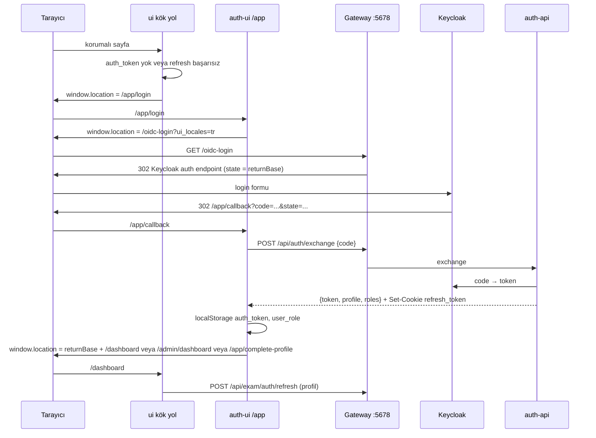

# `ui/` — Ana Angular uygulaması

Bu dosya, ExamApp'in son kullanıcıya dönük ana web uygulamasını (`ui/`) anlatır: Angular sürümü ve build zinciri, SSR/prerender, dizin yapısı, routing ve guard'lar, HTTP interceptor'ları, UI tarafındaki kimlik akışı (token'ın nerede saklandığı, `auth-ui`'ye nasıl yönlendirildiği), SignalR bağlantıları, environment dosyaları, i18n, tema, önemli servisler, testler ve bilinen test tuzakları, ayrıca whiteboard (Excalidraw), takvim (FullCalendar) ve video (Jitsi) entegrasyonlarının yerleri. Giriş/kayıt ekranları bu uygulamada değil, ayrı `auth-ui/` uygulamasındadır (bkz. [auth-ui.md](auth-ui.md)).

## İçindekiler

1. [Özet tablo](#1-özet-tablo)
2. [Sürümler ve bağımlılıklar](#2-sürümler-ve-bağımlılıklar)
3. [Build, dev server, SSR / prerender](#3-build-dev-server-ssr--prerender)
4. [Çalıştırma: docker-compose, Aspire, prod](#4-çalıştırma-docker-compose-aspire-prod)
5. [Dizin yapısı](#5-dizin-yapısı)
6. [Uygulama yapılandırması (`app.config.ts`)](#6-uygulama-yapılandırması-appconfigts)
7. [Routing tablosu](#7-routing-tablosu)
8. [Guard'lar](#8-guardlar)
9. [HTTP interceptor'ları](#9-http-interceptorları)
10. [UI tarafında kimlik akışı](#10-ui-tarafında-kimlik-akışı)
11. [API adresleri ve environment dosyaları](#11-api-adresleri-ve-environment-dosyaları)
12. [SignalR bağlantıları](#12-signalr-bağlantıları)
13. [i18n (Transloco)](#13-i18n-transloco)
14. [Tema, Material ve SCSS token'ları](#14-tema-material-ve-scss-tokenları)
15. [Önemli servisler](#15-önemli-servisler)
16. [Entegrasyon komponentleri: Excalidraw, FullCalendar, Jitsi, soru tespiti](#16-entegrasyon-komponentleri-excalidraw-fullcalendar-jitsi-soru-tespiti)
17. [`stubs/` ve `scripts/` klasörleri](#17-stubs-ve-scripts-klasörleri)
18. [Testler (Karma/Jasmine) ve bilinen tuzaklar](#18-testler-karmajasmine-ve-bilinen-tuzaklar)
19. [Agent hafızalarından non-obvious kararlar](#19-agent-hafızalarından-non-obvious-kararlar)
20. [Doğrulanmadı](#20-doğrulanmadı)
21. [Ayrı issue adayları](#21-ayrı-issue-adayları)

---

## 1. Özet tablo

| Konu | Değer | Kaynak |
|---|---|---|
| Paket adı | `exam-app` | `ui/package.json:2` |
| Angular | 19.1.4 (core/router/forms…), CLI 19.1.5, SSR 19.1.8 | `ui/package.json:15-28`, `ui/package.json:62-64` |
| Builder | `@angular-devkit/build-angular:application` (esbuild) | `ui/angular.json:22` |
| Paket yöneticisi | yarn (CLI ayarı); Docker/Aspire/prod `npm` kullanır | `ui/angular.json:5`, `ui/package.json:80` |
| Dev port | 4200 (`ng serve --host 0.0.0.0 --disable-host-check`) | `ui/package.json:6` |
| Gateway üzerinden erişim | `http://localhost:5678/` (catch-all `/{everything}` → `angular-app:4200`) | `Services/Gateway/ocelot.json:301-307` |
| Render modu | `outputMode: static` + `prerender: true`; yalnızca `welcome`, `privacy-policy`, `terms` prerender | `ui/angular.json:72-77`, `ui/src/app/app.routes.server.ts:3-11` |
| State | NgRx store kayıtlı ama **boş** (`reducers = {}`) | `ui/src/app/state/app.state.ts:3-7`, `ui/src/app/app.config.ts:68` |
| i18n | `@jsverse/transloco` 8.4, `tr` (varsayılan) + `en` | `ui/package.json:35`, `ui/src/app/models/locale.ts:36-58` |
| Test | Karma + Jasmine (`ng test`), ~164 spec dosyası | `ui/angular.json:119`, `ui/package.json:9` |

## 2. Sürümler ve bağımlılıklar

`ui/package.json` öne çıkanlar (satırlar `ui/package.json:13-51`):

- **Angular 19.1.x** + Material/CDK `^19.1.2`, `@angular/material-date-fns-adapter` (tarih seçiciler için date-fns), `@angular/flex-layout` (deprecated beta, hâlâ bağımlılıkta).
- **NgRx 19** (store/effects/entity/devtools) — store kurulu ama hiç feature state yok (`ui/src/app/state/app.state.ts:3-7`). Yeni kod signal tabanlı servis state'i kullanıyor (bkz. [`angular-conventions.md`](../../../.claude/rules/angular-conventions.md) "State management").
- **@microsoft/signalr 8** — BadgeService ve whiteboard hub'ları.
- **@excalidraw/excalidraw 0.18.1 + react/react-dom 19.3.0** — whiteboard; React yalnızca bu komponent için, ayrı chunk'ta yüklenir (bkz. §16).
- **@fullcalendar/* 6.1.21** — öğretmen müsaitlik grid'i.
- **@jsverse/transloco 8.4** — i18n.
- **@swimlane/ngx-charts 22 alpha** — dashboard heat map'leri.
- **ngx-quill / quill 2**, **xlsx**, **jszip**, **gsap**, **canvas-confetti**, **lightgallery**, **ngx-owl-carousel-o**, **jwt-decode 4**, **express 4** (SSR sunucusu için).
- `@excalidraw/mermaid-to-excalidraw` yerel bir stub'a yönlendirilir (`file:./stubs/...`) — bkz. §17 ve `ui/package.json:30`, `ui/package.json:79-88`.

`package.json` içindeki `"//"` notu (`ui/package.json:79-82`) iki kuralı yazılı tutar: (1) mermaid stub'ı üç yerde (kök bağımlılık + yarn `resolutions` + npm `overrides` `$` referansı) birlikte güncellenmeli, (2) Excalidraw yükseltilirse `angular.json` → `allowedCommonJsDependencies` listesi (`ui/angular.json:56-71`) gözden geçirilmeli.

Kilit dosyası: `ui/yarn.lock` (tracked). `ui/package-lock.json` gitignore'lıdır; `npm install` yarn.lock'u gürültüyle yeniden yazdığı için bağımlılık değişince `npx --yes yarn@1.22.22 install --ignore-scripts --non-interactive` kullanılması agent hafızasında kayıtlı (bkz. §19).

## 3. Build, dev server, SSR / prerender

### `angular.json`

- **build** (`ui/angular.json:21-101`): `application` builder; `browser: src/main.ts`, `server: src/main.server.ts`, `ssr.entry: src/server.ts`, `outputMode: "static"`, `prerender: true` (`ui/angular.json:72-77`).
- **Asset'ler** (`ui/angular.json:31-44`): `public/**` kökten servis edilir (i18n sözlükleri `public/i18n` → `/i18n/...`). Excalidraw fontları `node_modules/@excalidraw/excalidraw/dist/prod/fonts` → `excalidraw-assets/fonts` kopyalanır; **`Xiaolai/**` (CJK) bilinçli olarak hariç** (`ui/angular.json:38-43`).
- **Stiller** (`ui/angular.json:45-54`): `quill.snow.css`, `src/styles.scss` ve Excalidraw CSS'i `bundleName: "excalidraw", inject: false` ile **ayrı ve enjekte edilmeyen** bir bundle olarak üretilir (whiteboard açılınca tembel yüklenir).
- **Bütçe** (`ui/angular.json:80-92`): initial uyarı 3 MB / hata 6 MB. Agent hafızasına göre master'da initial bundle 3 MB uyarı eşiğini zaten aşıyor (uyarı, hata değil).
- **serve** (`ui/angular.json:103-113`): varsayılan `development` konfigürasyonu.
- **test** (`ui/angular.json:118-137`): Karma builder; `karma.conf.js` dosyası yok, CLI varsayılanları kullanılır.

### `vite.config.js`

`ui/vite.config.js:3-10` port 4200, `strictPort`, `allowedHosts: ['angular-app']` tanımlar. Angular CLI'nin `application` dev-server'ının bu dosyayı okuyup okumadığı **Doğrulanmadı** (CLI kendi Vite yapılandırmasını kullanır; host kontrolü zaten `--disable-host-check` ile kapatılıyor, `ui/package.json:6`).

### SSR / prerender

- `ui/src/app/app.routes.server.ts:3-11`: `welcome`, `privacy-policy`, `terms` → `RenderMode.Prerender` (SEO); geri kalan her şey `RenderMode.Client` (SPA).
- `ui/prerender-routes.txt` aynı üç yolu listeler (`/welcome`, `/privacy-policy`, `/terms`). `angular.json` bu dosyaya `routesFile` ile bağlanmıyor; prerender listesi fiilen `app.routes.server.ts`'den gelir. Dosyanın build'de kullanılıp kullanılmadığı **Doğrulanmadı**.
- `ui/src/server.ts:14-61` standart Angular SSR Express sunucusudur (statik dosyalar `browser/` altından, `PORT` yoksa 4000). `outputMode: static` olduğu için prod imajı bu sunucuyu **kullanmaz**; nginx statik dosya sunar (bkz. §4). `serve:ssr:exam-app` script'i (`ui/package.json:10`) static modda üretilmeyen `dist/exam-app/server/server.mjs`'i çağırır — fiilen çalışıp çalışmadığı **Doğrulanmadı**.
- Hydration `provideClientHydration()` ile **`withEventReplay()` olmadan** açıktır (`ui/src/app/app.config.ts:70`). Bu bilinçli bir karar: `withEventReplay()` Angular/CDK 19.1'de Material datepicker gibi overlay tetikleyicilerinin ilk tıklamasını yutuyordu (issue #43; `ui/.claude/agent-memory/angular-dev/feedback-event-replay-material.md`). Geri eklemeyin.
- SSR/prerender'da `localStorage`, `window`, `navigator`, `location` yoktur. Kod bu yüzden koruma kullanır: `AuthService` okumaları `readStoredValue()` (`ui/src/app/services/auth.service.ts:415-430`), `isCrossOriginUrl()` (`ui/src/app/shared/utils/request-url.util.ts:26-35`), `TranslocoHttpLoader` sunucuda sözlüğü build'e gömülü JSON'dan okur (`ui/src/app/services/transloco-http.loader.ts:17-34`).

## 4. Çalıştırma: docker-compose, Aspire, prod

| Ortam | Nasıl | Kaynak |
|---|---|---|
| docker-compose (dev) | `angular-app` servisi: `dockerfiles/ui/Dockerfile.ui` (yalnız Node 20 + global Angular CLI, `CMD sleep infinity`), kaynak `./ui:/app` bind mount, override'da `yarn install && yarn start`; host portu 4200 | `docker-compose.yml:250-265`, `docker-compose.override.yml:24-25`, `dockerfiles/ui/Dockerfile.ui` |
| Aspire | `AddJavaScriptApp("angular-app", "../ui", "start")` + `WithNpm(install: false)` — **`node_modules`'ü elle güncel tutmalısınız** (Aspire'ın npm install adımı Windows'ta takılıyordu). Endpoint bilerek tanımlanmaz; gateway'e `ANGULAR_APP_HOST=localhost`, `ANGULAR_APP_PORT=4200` verilir | `AppHost/AppHost.cs:768-840` |
| Prod | `deploy/dockerfiles/angular-spa.Dockerfile` (`APP_DIR=ui`): `npm install` + `npm run build`, `browser/` çıktısı nginx'e kopyalanır, `index.csr.html` varsa `index.html` üzerine yazılır; nginx 4200 | `deploy/docker-compose.prod.yml:422-431`, `deploy/dockerfiles/angular-spa.Dockerfile` |

Uygulamaya **her zaman gateway üzerinden** (`http://localhost:5678`) girin. Sebep: `auth-ui` (`/app/*`) ile `ui` (`/*`) aynı origin'de olmalı ki `localStorage`'daki `auth_token` paylaşılsın (bkz. §10). `localhost:4200`'e doğrudan girmek API çağrılarını da kırar, çünkü tüm servisler göreli `/api/...` kullanır ve dev-server'da proxy yoktur (`angular.json`'da `proxyConfig` yok). Ortam kurulumunun ayrıntısı: [`../02-ortam-kurulumu.md`](../02-ortam-kurulumu.md), [`../../../.claude/rules/local-dev.md`](../../../.claude/rules/local-dev.md).

## 5. Dizin yapısı

```
ui/
├── angular.json, package.json, yarn.lock, vite.config.js, prerender-routes.txt
├── tsconfig.json / tsconfig.app.json / tsconfig.spec.json
├── public/                 # kökten servis edilen statik dosyalar
│   ├── i18n/               # tr.json, en.json + 33 scope klasörü (<scope>/<lang>.json)
│   ├── achievements/, badge_templates/, ribbons/, icons/ …   # rozet görselleri
│   └── robots.txt, sitemap.xml
├── stubs/mermaid-to-excalidraw/   # boş yerel paket (§17)
├── scripts/verify-excalidraw-assets.mjs   # build sonrası Excalidraw asset kontrolü (§17)
├── .devcontainer/, .agents/skills/frontend-design, skills-lock.json, .claude/agent-memory/
└── src/
    ├── main.ts, main.server.ts, server.ts, index.html, styles.scss
    ├── environments/environment.ts, environment.prod.ts
    ├── app.zip             # 450 KB, tracked, kodda referans yok (§21)
    └── app/
        ├── app.config.ts, app.config.server.ts, app.routes.ts, app.routes.server.ts
        ├── components/     # enhanced-layout (ana kabuk), study-*, theme-switcher, user-theme-switcher
        ├── core/core.module.ts      # CacheService + OnlineStatusService sağlayıcıları
        ├── pages/          # route komponentleri (admin/, public/, test-solve/, lesson-video/ …)
        ├── services/       # HTTP + durum servisleri (§15)
        ├── models/         # DTO/arayüzler (locale.ts dil listesinin tek kaynağı)
        ├── shared/
        │   ├── components/ # ~55 paylaşılan komponent (whiteboard, availability-week-grid, comment-*, …)
        │   ├── guards/     # auth, role, admin, student, approved-teacher
        │   ├── interceptors/   # cache, locale, auth, auth-error, teacher-not-approved
        │   ├── resolvers/worksheet-resolver.ts
        │   ├── directives/ # has-role, is-student, auto-focus
        │   ├── utils/      # request-url, booking-format, pii-detect, css-color, whiteboard-link …
        │   ├── styles/     # _admin-list.scss, _moderation-dialog.scss
        │   └── testing/    # transloco-testing.ts, whiteboard-testing.ts, booking-time-testing.ts
        ├── state/app.state.ts       # boş NgRx kök state
        └── home/           # eski HomeComponent (route'ta yok)
```

Kabuk komponenti `ui/src/app/components/enhanced-layout/` altındadır (shared değil). `ui/src/app/pages/layout/` (`LayoutComponent`) eski kabuktur; hiçbir yerden import edilmiyor (grep: `app.routes.ts` yalnız `EnhancedLayoutComponent`'i kullanır, `ui/src/app/app.routes.ts:23`) — ölü kod, §21.

Komponent yerleşim kuralları (standalone, signal, `inject()`, dosya yerleri) için: [`../../../.claude/rules/angular-conventions.md`](../../../.claude/rules/angular-conventions.md).

## 6. Uygulama yapılandırması (`app.config.ts`)

`ui/src/app/app.config.ts:53-102`:

| Sağlayıcı | Not | Satır |
|---|---|---|
| `provideHttpClient(withInterceptors([...]))` | Sıra: `cacheInterceptor`, `localeInterceptor`, `authInterceptor`, `authErrorInterceptor`, `teacherNotApprovedInterceptor` | `:55-64` |
| `provideRouter(routes, withRouterConfig({ onSameUrlNavigation: 'reload' }))` | Aynı URL'e navigasyon yeniden yükler | `:66` |
| `provideStore(reducers)` | Boş store | `:68` |
| `importProvidersFrom(ReactiveFormsModule, CoreModule)` | `CoreModule` = `CacheService`, `OnlineStatusService` (`ui/src/app/core/core.module.ts:5-8`) | `:69` |
| `provideClientHydration()` | `withEventReplay()` YOK (§3) | `:70` |
| `provideTransloco(...)` | `defaultLang: readStoredLocale()`, `fallbackLang: 'tr'`, `reRenderOnLangChange`, `scopes.keepCasing: true` (scope öneki klasör adıyla birebir; issue #183) | `:71-86` |
| `provideAppInitializer` | Aktif dil sözlüğü bootstrap'tan önce yüklenir; hata uygulamayı durdurmaz | `:90-96` |
| `provideDateFnsAdapter(TR_DATE_FORMATS)` | Tüm datepicker'lar `dd/MM/yyyy` | `:41-51`, `:97` |
| `LOCALE_ID`, `MAT_DATE_LOCALE` | `LocaleService.localeDefinition()`'dan türer | `:99-100` |

Tüm desteklenen diller için `registerLocaleData` modül yüklenirken çalışır (`ui/src/app/app.config.ts:38`, NG0701'in kalıcı çözümü).

## 7. Routing tablosu

Kaynak: `ui/src/app/app.routes.ts`. Korumalı rotaların hepsi tek bir `EnhancedLayoutComponent` örneğinin `children`'ıdır (`ui/src/app/app.routes.ts:54-274`), böylece sidenav her navigasyonda yeniden oluşturulmaz. "LC" = `loadComponent` (lazy).

### Public / yönlendirmeler

| Route | Komponent | Guard | Satır |
|---|---|---|---|
| `welcome` | `LandingComponent` (LC, prerender) | — | `:34-37` |
| `privacy-policy` | `PrivacyPolicyComponent` (LC, prerender) | — | `:38-42` |
| `terms` | `TermsComponent` (LC, prerender) | — | `:43-46` |
| `''` | → `welcome` | — | `:47` |
| `student-register` / `teacher-register` / `parent-register` | → `/register?role=student|teacher|parent` (geri uyumluluk) | — | `:49-51` |
| `**` | → `welcome` | — | `:275` |

`pages/public/` altında `about`, `contact`, `faq`, `features`, `pricing` klasörleri de var ama route tablosunda yoklar (ulaşılamaz).

### Kabuk altındaki rotalar

| Route | Komponent | Guard / rol | Satır |
|---|---|---|---|
| `dashboard` | `DashboardSwitchComponent` (Teacher → TeacherDashboard, diğerleri → Dashboard; issue #53) | `authGuard`, `approvedTeacherGuard` | `:60` |
| `teacher-approval-pending` | `TeacherApprovalPendingComponent` (LC) | `authGuard`, `roleGuard('Teacher')` | `:61-69` |
| `tests` | `WorksheetListComponent` + `worksheetListResolver` | `authGuard`, `approvedTeacherGuard` | `:70-76` |
| `register` | `RegisterWizardComponent` (rol seçimi + rol formu; guard yok) | — | `:79` |
| `question/:id`, `question` | `QuestionComponent` | `authGuard` | `:80`, `:89` |
| `questioncanvas`, `questioncanvas/:id` | `QuestionCanvasComponent` | `authGuard` | `:81`, `:88` |
| `questioncanvas/preview`, `questioncanvas/preview/:testId` | `QuestionCanvasPreviewComponent` | `authGuard` | `:82-87` |
| `imageselect` | `ImageSelectorComponent` (soru tespiti / etiketleme, §16) | `authGuard` | `:90` |
| `tests-enhanced` | `WorksheetListEnhancedComponent` + resolver | `authGuard`, `approvedTeacherGuard` | `:91-97` |
| `questions/view` | `QuestionViewComponent` | `authGuard` | `:98` |
| `testsolve/:testInstanceId` | `TestSolveCanvasComponentv3` | `authGuard`, `approvedTeacherGuard` | `:99` |
| `testsolve/v2/:testInstanceId` | `TestSolveCanvasComponentv2` | `authGuard`, `approvedTeacherGuard` | `:100-104` |
| `test/:testId` | `WorksheetDetailComponent` | `authGuard`, `approvedTeacherGuard` | `:105` |
| `student-profile` | `StudentProfileComponent` | `authGuard` | `:106` |
| `exam`, `exam/:id` | `TestCreateEnhancedComponent` | `authGuard`, `roleGuard('Teacher')`, `approvedTeacherGuard` | `:107-108` |
| `programs`, `programs/:id/detail` (LC), `program-create` | `MyPrograms`, `ProgramDetail`, `ProgramCreate` | `authGuard`, `roleGuard('Student')` | `:109-116` |
| `certificates` | `BadgeThropyComponent` | `authGuard` | `:117` |
| `notifications` | `NotificationsComponent` (LC; issue #146) | `authGuard` | `:118-124` |
| `study` | `StudyPageComponent` | `authGuard`, `roleGuard('Student')` | `:125` |
| `study-pages`, `study-pages/new`, `study-pages/:id` | `StudyPages`, `StudyPageEditor` | `authGuard`, `roleGuard('Teacher')`, `approvedTeacherGuard` | `:126-128` |
| `study-links` | `StudyLinksComponent` (LC; issue #61) | Teacher + onaylı | `:129-135` |
| `question-transfer` | `QuestionTransferComponent` | Teacher + onaylı | `:136-140` |
| `assignment-permission-requests` | LC (issue #13) | Teacher + onaylı | `:141-148` |
| `admin` | `AdminHomeComponent` (LC) | `authGuard`, `adminGuard` | `:149-153` |
| `admin/dashboard` | `AdminDashboardComponent` (#86) | admin | `:154-160` |
| `admin/teacher-approvals` | `TeacherApprovalsComponent` (#94) | admin | `:161-167` |
| `admin/teachers`, `admin/students` | `AdminTeachers` (#152), `AdminStudents` (#153) | admin | `:168-181` |
| `admin/schools` | `SchoolManagerComponent` (#150) | admin | `:182-188` |
| `admin/badge-definitions` | `BadgeDefinitionsComponent` (#148) | admin | `:189-195` |
| `admin/comment-reports` | `AdminCommentReportsComponent` (#305) | admin | `:196-204` |
| `practice` | `PracticeSolveComponent` (#63) | `authGuard`, `studentGuard` | `:205-211` |
| `tutor-profile` | `TutorProfileComponent` (#95; onaysız öğretmene de açık) | `authGuard`, `roleGuard('Teacher')` | `:212-219` |
| `tutors`, `tutors/:id` | `TutorSearch`, `TutorPublicProfile` (#95) | `authGuard`, `studentGuard` | `:220-233` |
| `my-calendar` | `MyCalendarComponent` (#96) | `authGuard`, `roleGuard('Student','Teacher')`, `approvedTeacherGuard` | `:234-240` |
| `availability` | `TeacherAvailabilityComponent` (#96, FullCalendar) | Teacher + onaylı | `:241-249` |
| `booking-requests` | `TeacherBookingRequestsComponent` | Teacher + onaylı | `:250-258` |
| `my-bookings` | `StudentBookingsComponent` | `authGuard`, `studentGuard` | `:259-265` |
| `lessons/:bookingId/video` | `LessonVideoComponent` (#97; Jitsi + whiteboard) | Student/Teacher + onaylı | `:266-272` |

Rol modelinin backend tarafı ve Parent / okul yöneticisi / bağımsız öğretmen ayrımı için [`../05-kimlik-yetki.md`](../05-kimlik-yetki.md).

## 8. Guard'lar

Hepsi fonksiyonel `CanActivateFn`, `ui/src/app/shared/guards/` altında:

| Guard | Davranış | Kaynak |
|---|---|---|
| `authGuard` | `AuthService.isAuthenticated()` (BehaviorSubject; ilk değer `localStorage`'da `auth_token` var mı) false ise `/login`'e `UrlTree` döner | `auth.guard.ts:7-14` |
| `roleGuard(...roles)` | JWT'deki `realm_access.roles` içinde rollerden biri yoksa `/dashboard`'a yönlendirir | `role.guard.ts:10-20` |
| `adminGuard` / `studentGuard` | `roleGuard('Admin')` / `roleGuard('Student')` | `admin.guard.ts:8`, `student.guard.ts:8` |
| `approvedTeacherGuard` | Teacher olmayan veya muaf (Admin/SuperAdmin) kullanıcıyı geçirir; onayı bilinen öğretmeni geçirir; aksi halde profili (tek uçuş) yeniler ve onaysızsa `/teacher-approval-pending`'e yönlendirir. Resolver'lar guard'dan sonra çalıştığı için yönlendirilen öğretmen için öğretmen uçları hiç çağrılmaz (issue #287) | `approved-teacher.guard.ts:17-36` |

Dikkat: `authGuard`'ın hedefi olan `/login` `ui` route tablosunda **yok**; `**` kuralıyla `/welcome`'a düşer (`ui/src/app/app.routes.ts:275`). Gerçek giriş sayfası `auth-ui`'nin `/app/login`'idir (`AuthService.goLogin()`, `ui/src/app/services/auth.service.ts:130-133`). §21'e bakın.

Rol bilgisi **istemci tarafında yalnızca UX içindir**; asıl yetki kontrolü gateway ve API'dedir (bkz. [`../03-servisler/gateway.md`](gateway.md), [`../05-kimlik-yetki.md`](../05-kimlik-yetki.md)).

## 9. HTTP interceptor'ları

`ui/src/app/shared/interceptors/`, kayıt sırası `ui/src/app/app.config.ts:56-63`:

| Interceptor | Ne yapar | Kaynak |
|---|---|---|
| `cacheInterceptor` | Yalnız GET; `/api/exam/worksheet/grades`, `/api/exam/subject`, `/api/exam/subject/by-grade/*`, `/api/exam/subject/topics/*` yanıtlarını modül düzeyinde `Map`'te 24 saat tutar (sayfa yenilenince sıfırlanır) | `cache.interceptor.ts:8-84` |
| `localeInterceptor` | `/api/` altındaki isteklere aktif dili `Accept-Language` olarak ekler (oturumsuz kullanıcı için backend kültürü buradan çözer; issue #181). Elle verilmiş header'ı ezmez | `locale.interceptor.ts:15-35` |
| `authInterceptor` | Cross-origin isteklere dokunmaz (Jitsi, MinIO presigned vb. — token sızmaz). `/i18n/` isteklerine dokunmaz. Kimlik uçları (`/api/auth/refresh-token`, `/api/auth/login`, `/api/auth/exchange`, `/api/exam/auth/logout`) için yalnız `withCredentials`. Diğerlerinde `localStorage['auth_token']` yoksa `logout()`; süresi 100 sn içinde doluyorsa önce `refreshToken()`; sonra `Authorization: Bearer` + `withCredentials: true` | `auth.interceptor.ts:19-87` |
| `authErrorInterceptor` | 401'de (cross-origin ve kimlik uçları hariç) `refreshToken()` (tek uçuş) ile yeni token alır, isteği bir kez tekrarlar; tekrar da 401 ise `clearLocalStorage()` → login | `auth-error.interceptor.ts:15-76` |
| `teacherNotApprovedInterceptor` | 403 `{ errorCode: "TeacherNotApproved" }` görürse `AuthService.handleTeacherNotApproved()` (durum sayfasına bir kez yönlendir + profil yenile); hata çağırana yine iletilir (issue #287) | `teacher-not-approved.interceptor.ts:13-24` |

Exclude listeleri **pathname tam eşleşmesiyle** çalışır (`pathnameOf`, `ui/src/app/shared/utils/request-url.util.ts:9-18`). Eskiden `url.includes(...)` kullanılıyordu ve `'/'` girdisi yüzünden 401 akışı fiilen ölüydü (issue #241, #255; yorumlar `auth-error.interceptor.ts:7-14`, `auth.interceptor.ts:10-18`). Yeni anonim/kimlik ucu eklerken listeye **pathname** olarak ekleyin. `auth-ui`'de bu util'in ayrı bir kopyası var; ikisini birlikte güncelleyin (`auth-ui/src/app/shared/utils/request-url.util.ts`).

Agent hafızasındaki uyarı: backend bazı uçlarda uygulama-mantığı 401'i dönüyor (ör. "user == null" durumları); bu yanıtlar artık refresh + retry sonrası logout'a götürür, backend'de 403/404'e çevrilmesi önerilmiş (`auth-error-interceptor-exclude` hafızası; **Doğrulanmadı**: hangi uçların hâlâ böyle olduğu).

## 10. UI tarafında kimlik akışı

### Token nerede?

| Anahtar | İçerik | Yazan |
|---|---|---|
| `localStorage['auth_token']` | Keycloak access token (JWT) | `auth-ui` callback (`exchangeCodeForToken`), `ui` interceptor'ları refresh sonrası |
| `localStorage['user_role']` | Tek rol adı | `auth-ui`, `ui` login/exchange |
| `localStorage['user']` | `UserProfile` JSON (schoolId, student/teacher alt nesneleri, onay durumu) | `AuthService.setUser()` — doğrudan yazmayın (`ui/src/app/services/auth.service.ts:55-60`, `:89-101`) |
| `localStorage['user_avatar']`, `['student']` | Önbellek | — |
| `localStorage['app-locale']` | Dil tercihi (oturumdan bağımsız) | `LocaleService` (`ui/src/app/services/locale.service.ts:13`, `:62`) |
| `localStorage['color-scheme']` | Renk şeması | `ColorSchemeService`, `ui/src/index.html:33-38` |
| Cookie `refresh_token` | HttpOnly, Secure, SameSite=Strict, Path=/ | auth-api `exchange` / `refresh-token` (`auth-api/Controllers/AuthController.cs:505`, `:582`) |

Access token JS'ten okunabilir `localStorage`'dadır (XSS'e açık); refresh token ise HttpOnly cookie'dedir. CSP sertleştirmesi açık issue'lardır: #316, #333.

### Akış



Ayrıntılar:

- `ui` login ekranı göstermez: `AuthService.goLogin()` → `window.location.href = '/app/login'` (`ui/src/app/services/auth.service.ts:130-133`). `clearLocalStorage()` (`:172-175`) ve `logout()` (`:177-198`) sonunda buraya gider. `logout()` yerel oturumu önce senkron temizler, sonra `POST /api/exam/auth/logout`'u Authorization başlığını elle taşıyarak best-effort dener (2 sn timeout).
- `ui/src/app/services/auth.service.ts:297-310`'daki `exchangeCodeForToken()` ve `:115-128`'deki `login()` `ui` içinde çağrılmıyor (grep); kod değişimi `auth-ui`'de yapılır.
- **Profil yenileme:** `EnhancedLayoutComponent.ngOnInit` önbellekteki `user` başka kullanıcıya aitse (`isCachedUserCurrent()`, JWT `sub` ↔ `keycloakId`) temizler; profil eksikse veya öğretmen onayı bilinmiyorsa `refreshProfile()` (`POST /api/exam/auth/refresh`) çağırır. Yanıt boşsa `/register`, Student/Teacher profil kaydı yoksa `/register?role=...`'e gider; hata olursa `goLogin()` (`ui/src/app/components/enhanced-layout/enhanced-layout.component.ts:338-386`).
- **Token yenileme:** `refreshToken()` `POST /api/auth/refresh-token` (cookie ile) yapar; `shareReplay` ile tek uçuş, 10 sn timeout, hata/boş token'da `clearLocalStorage()` (`ui/src/app/services/auth.service.ts:381-412`). `isExpiringSoon` eşiği 100 sn (`:312-322`).
- **Roller:** `getRealmRoles()` JWT'yi `jwt-decode` ile çözer, `realm_access.roles` okur (`ui/src/app/services/auth.service.ts:218-234`). Eski `hasRole()` `user_role` anahtarını kullanır ve `console.log` basar (`:212-215`).
- **Öğretmen onayı (issue #287):** `handleTeacherNotApproved()` (`ui/src/app/services/auth.service.ts:360-375`), `refreshProfile()` tek uçuş (`:335-354`).

Keycloak client'ları, realm rolleri ve gateway yetkilendirmesi: [`../05-kimlik-yetki.md`](../05-kimlik-yetki.md), [`auth-ui.md`](auth-ui.md), [`auth-api.md`](auth-api.md).

## 11. API adresleri ve environment dosyaları

- **Tüm HTTP çağrıları göreli yollarla yapılır** (`/api/exam/...` → exam-dotnet-api, `/api/auth/...` → auth-api, `/api/badge/...` → BadgeService, `/question-detector-dev/...` → question-detector, `/hub/...` → SignalR). Yönlendirme gateway'in işidir (`Services/Gateway/ocelot.json`; bkz. [gateway.md](gateway.md)). Servis örnekleri: `ui/src/app/services/test.service.ts:43`, `booking.service.ts:37`, `notification.service.ts:16`.
- `ui/src/environments/environment.ts:1-6` (`apiUrl: http://localhost:5079/api`, `reportsApiUrl`, `worksheetCardTheme: 'enhanced'`) ve `environment.prod.ts:1-6` (`apiUrl: http://exam_dotnet_8_api:8005/api`, `worksheetCardTheme: 'standard'`). **`apiUrl` ve `reportsApiUrl` HTTP'de hiç kullanılmıyor** (grep; agent hafızası da doğruluyor). Kullanılan tek alan `worksheetCardTheme` (`ui/src/app/services/user-theme.service.ts:49`, `:180`). `cache.service.ts:5` dosyayı import eder ama `environment` kullanmaz.
- `angular.json`'da `fileReplacements` yok; yani prod build'de de `environment.ts` kullanılıyor olabilir — **Doğrulanmadı** (Angular 19'da `fileReplacements` olmadan `environment.prod.ts` devreye girmez).
- Aspire notu: AppHost, Angular uygulamalarına ortam değişkeni vermenin tarayıcı bundle'ına ulaşmadığını, bu yüzden adreslerin sabit kaldığını yazar (`AppHost/AppHost.cs:768-780`).

## 12. SignalR bağlantıları

| Bağlantı | URL | Kullanan | Ayrıntı | Kaynak |
|---|---|---|---|---|
| BadgeService hub | `/hub/badges` → `exam-badge-api:8006` | `SignalRService.startConnection()`; `EnhancedLayoutComponent.ngOnInit` çağırır | Yalnız WebSocket, `skipNegotiation: true`, token `localStorage['auth_token']`'dan (`accessTokenFactory`). **`withAutomaticReconnect` yok** | `ui/src/app/services/signalr.service.ts:91-101`, `enhanced-layout.component.ts:293`, `Services/Gateway/ocelot.json:22-30` |
| Whiteboard hub | `/hub/whiteboard` → `exam-dotnet-api:5079` | `WhiteboardSyncService` (komponent düzeyi) | WebSocket only, negotiate atlanır (gateway `/negotiate`'i eşlemez), `withAutomaticReconnect([0,2000,5000,10000])`, sonra servisin kendi sınırsız döngüsü | `ui/src/app/services/whiteboard-hub-connection.ts:22-45`, `ui/src/app/models/whiteboard.model.ts:11`, `Services/Gateway/ocelot.json:4-12` |

`/hub/badges` üzerinde dinlenen olaylar (`ui/src/app/services/signalr.service.ts:108-196`): `BadgeEarned`, `AccessRequestUpdate`, `ReminderDue`, `TeacherApplicationSubmitted`, `TeacherSchoolRequestSubmitted`, `TeacherApplicationDecided`, iki yorum olayı (`WORKSHEET_COMMENT_CREATED_TYPE`, `WORKSHEET_COMMENT_REPLIED_TYPE`), `BookingUpdate`. Kalıcı bildirim üreten her push `notificationsChanged$`'i tetikler; zil sayacı 1 sn debounce ile tazelenir (polling yok). Yeni bir hub olayı kalıcı bildirim yazıyorsa handler'da `notificationsChangedSubject.next()` çağırın. Olayların kaynağı (outbox → RabbitMQ → BadgeService) için [`../06-asenkron-akislar.md`](../06-asenkron-akislar.md).

WebSocket upgrade isteklerinde gateway auth'u Ocelot'tan önce `UseHubWebSocketAuth()` ile yapılır (`Services/Gateway/Program.cs:229`; açık takip issue'su #311).

## 13. i18n (Transloco)

- Kütüphane: **`@jsverse/transloco` 8.4** (`ui/package.json:35`). Angular'ın kendi `$localize`/`extract-i18n` mekanizması kullanılmıyor (builder tanımlı ama boş, `ui/angular.json:115-117`).
- Dil listesinin **tek tanım noktası** `SUPPORTED_LOCALES` (`ui/src/app/models/locale.ts:36-58`): `tr` (varsayılan) ve `en`. Transloco `availableLangs`, `registerLocaleData`, `LOCALE_ID`, `MAT_DATE_LOCALE` ve dil seçici hep buradan türer.
- Sözlükler: kök `ui/public/i18n/<lang>.json` + sayfa/alan scope'ları `ui/public/i18n/<scope>/<lang>.json` (33 scope klasörü). Loader: `TranslocoHttpLoader` (`ui/src/app/services/transloco-http.loader.ts:35`); SSR'da JSON'lar build'e gömülü `import()` ile okunur.
- `scopes.keepCasing: true` — scope adı camelCase'e çevrilmez; aksi halde önek uyuşmazlığı ekranda ham anahtar olarak sessizce görünür (`ui/src/app/app.config.ts:80-83`).
- Dil tercihi: `localStorage['app-locale']` → tarayıcı dili → `tr` (`ui/src/app/services/locale.service.ts:19-23`, `:116`); profilde `preferredLocale` gelirse `syncFromProfile` uygular. `auth-ui` aynı anahtarı okuyarak Keycloak'ı `ui_locales` ile açar (bkz. [auth-ui.md](auth-ui.md)).
- Yeni dil eklerken üç yer elle senkron tutulur: `ui/src/app/models/locale.ts`, `auth-ui/src/app/services/locale-hint.service.ts:11`, backend `ExamApp.Foundation.Localization.SupportedLocales`.

Sayfa taşıma adımları, anahtar adlandırma, şablon desenleri, test ve SSR notları: [`../../i18n-migration.md`](../../i18n-migration.md). Testlerde `ui/src/app/shared/testing/transloco-testing.ts` kullanılır.

## 14. Tema, Material ve SCSS token'ları

Kurallar [`../../../.claude/rules/angular-conventions.md`](../../../.claude/rules/angular-conventions.md) "UI library" ve "Styling" bölümlerindedir; burada yalnız yerleri ve tuzakları özetliyoruz:

- **Global renk şeması (dark/light, issue #81):** `<html>` üzerindeki `.dark-theme` / `.light-theme` sınıfı. Token setleri `ui/src/styles.scss:33` (`.dark-theme`) ve `:120` (`.light-theme`); Material `mat.theme` her sınıf için ayrı `theme-type` ile üretilir (`ui/src/styles.scss:477-492`), yüzey eşlemesi ortak `$ms-material-surface-overrides` haritasında (`:454`). Tercih `localStorage['color-scheme']`, ilk paint'ten önce `ui/src/index.html:33-38`'deki inline script uygular (FOUC önleme; varsayılan dark).
- **Material token eşlemesi (issue #46):** `--mat-sys-*` token'ları Material'ın jenerik dark tonlarına bırakılmaz, `mat.theme-overrides` ile projenin `--ms-*` / `--main-*` paletine eşlenir. Yeni Material bileşeni yanlış tonda görünürse komponent SCSS'ine renk yazmayın; `styles.scss`'teki override haritasına eksik sistem token'ını ekleyin.
- **Yeni token** eklerken her iki tema sınıfına da ekleyin; tek sınıfa eklenen token diğer temada tanımsız kalır.
- **Worksheet kart teması** ayrı bir sistemdir: `ThemeConfigService` (`ui/src/app/services/theme-config.service.ts:21`), `UserThemeService` (`user-theme.service.ts:22`), `components/theme-switcher`, `components/user-theme-switcher`; varsayılanı `environment.worksheetCardTheme`. Ayrıntı: `ui/src/app/THEME_SYSTEM_README.md`, `ui/src/app/THEME_INTEGRATION_SPEC.md`.
- `--main-foreground-color` bir arka plan tonudur; koyu yüzeyde başlık için `--heading-on-dark` kullanılır (agent hafızası `heading-on-dark-token`).

## 15. Önemli servisler

Hepsi `providedIn: 'root'` ve `ui/src/app/services/` altında (aksi belirtilmedikçe):

| Servis | Sorumluluk | Taban URL / not | Kaynak |
|---|---|---|---|
| `AuthService` | Oturum, token, profil signal'ı (`user`), roller, refresh, öğretmen onayı | `/api/exam/auth`, `/api/auth/*` | `auth.service.ts:41` |
| `SignalRService` | `/hub/badges` bağlantısı, bildirim/olay subject'leri | — | `signalr.service.ts:58` |
| `NotificationService` | Kalıcı bildirimler, `unreadCount` signal | `/api/badge/notifications` | `notification.service.ts:14-16` |
| `TestService` | Worksheet/test CRUD, görünürlük, çözüm | `/api/exam/worksheet` | `test.service.ts:42-43` |
| `QuestionService` | Soru CRUD | `/api/exam/questions` | `question.service.ts:9-10` |
| `QuestionDetectorService` | YOLO tespiti, QR, eğitim verisi gönderimi | `/question-detector-dev/*` | `question-detector.service.ts:9-40` |
| `QuestionTransferService` | Soru paket aktarımı | `/api/exam/question-transfer` | `question-transfer.service.ts:30-31` |
| `BookingService` | Müsaitlik slotları, randevu talepleri, video oturumu | `/api/exam/booking`; `requests/{id}/video-session` | `booking.service.ts:34-37`, `:158` |
| `WhiteboardSyncService` | Excalidraw sahne senkronu (komponent düzeyi sağlayıcı) | `/hub/whiteboard` | `whiteboard-sync.service.ts:95` |
| `JitsiScriptLoaderService` | Jitsi `external_api.js`'i çalışma anında (backend'in verdiği `baseUrl`'den) bir kez yükler | — | `jitsi-script-loader.service.ts:37-45` |
| `WorksheetCommentService` | Yorum thread'i, şikayet/gizleme | `/api/exam/worksheet` | `worksheet-comment.service.ts:22-24` |
| `WorksheetAccessRequestService` | Atama izin talepleri | `/api/exam/worksheet/access-requests` | `worksheet-access-request.service.ts:15-17` |
| `AdminService` | Admin listeleri, şifre sıfırlama, askı, okul bağlama | `/api/exam/admin` | `admin.service.ts:55-57` |
| `BadgeDefinitionAdminService` | Rozet tanımları | `/api/badge/admin/badge-definitions` | `badge-definition-admin.service.ts:18-20` |
| `LeaderboardService` | Liderlik (global/school) | `/api/exam/leaderboard` | `leaderboard.service.ts:17-19` |
| `PracticeService` | "Soru Çöz" pratik akışı, günün soruları | `/api/exam/practice` | `practice.service.ts:25-27` |
| `StudentService`, `TeacherService`, `SchoolService`, `SubjectService`, `StudyService`, `StudyPageService`, `StudyLinkService`, `ProgramService`, `BookService` | Alan servisleri | `/api/exam/<alan>` | ilgili dosyalar |
| `LocaleService`, `LocalePreferenceService` | Aktif dil, profile kaydetme | — | `locale.service.ts:31`, `locale-preference.service.ts:27` |
| `ColorSchemeService`, `ThemeConfigService`, `UserThemeService` | Tema | — | §14 |
| `CacheService`, `OnlineStatusService` | `CoreModule` ile sağlanır | — | `ui/src/app/core/core.module.ts:5-8` |

## 16. Entegrasyon komponentleri: Excalidraw, FullCalendar, Jitsi, soru tespiti

### Whiteboard (Excalidraw, issue #98)

- Yer: `ui/src/app/shared/components/whiteboard/` — `whiteboard.component.ts` (Angular kabuk), `excalidraw-canvas.provider.ts` (`provideExcalidrawCanvas()`, `loadExcalidrawCanvas()`), `excalidraw-canvas.ts` (React köprüsü, `createRoot`), `excalidraw-scene.ts` (saf restore/reconcile), `excalidraw-policy.ts` (kütüphane/link politikası), `whiteboard-link-dialog/`.
- React + Excalidraw yalnızca dinamik `import('./excalidraw-canvas')` ile ayrı chunk'ta yüklenir; CSS `<link href="excalidraw.css">` ile tembel eklenir; asset yolu `window.EXCALIDRAW_ASSET_PATH = '/excalidraw-assets/'` modül değerlendirilmeden önce set edilir (`ui/src/app/shared/components/whiteboard/excalidraw-canvas.provider.ts:9`, `:27`, `:53-58`; `excalidraw-canvas.ts:18-32`).
- Kullanıldığı tek yer: ders video sayfası — `LessonVideoComponent` `provideExcalidrawCanvas()` sağlar ve şablonda `<app-whiteboard [bookingId]="id" />` (`ui/src/app/pages/lesson-video/lesson-video.component.ts:33-34`, `:71`; `lesson-video.component.html:55`).
- Senkron: `WhiteboardSyncService` + `/hub/whiteboard` (§12). Link açma kararı Angular'da (`whiteboard-link.util.ts` `classifyWhiteboardLink`; dış link onay dialog'u, hassas aynı-origin yollar da dialog) — issue #332.
- Hub kaynak sınırları ve gateway WebSocket auth takibi: issue #311; CSP: #316/#333.

### FullCalendar

- Yer: `ui/src/app/shared/components/availability-week-grid/` (`FullCalendarModule`, `timeGridWeek`; `availability-week-grid.component.ts:29`). Kullanan sayfa: `pages/teacher-availability/` (`/availability`).
- `dateClick` için `@fullcalendar/interaction` gerekir (core'da yok). `eventInteractive` bilinçli kapalı (a11y: iç içe iki tab durağı oluşmasın). Backend `date`+`startTime`'ı UTC sayar; istemci isteği anın UTC bileşenlerinden üretir. Gece yarısını aşan slotlar (#300) `endUtc`'den okunur (agent hafızası `availability-week-grid`).
- `my-calendar` sayfası FullCalendar değil, kendi `app-month-calendar-grid` komponentini kullanır (`ui/src/app/pages/my-calendar/my-calendar.component.html:39`; `shared/components/month-calendar-grid/`).

### Jitsi (video görüşme, issue #97)

- Yer: `ui/src/app/pages/lesson-video/` + `ui/src/app/services/jitsi-script-loader.service.ts`. Oda bilgisi ve JWT `BookingService.createVideoSession` benzeri çağrı ile `POST /api/exam/booking/requests/{bookingId}/video-session`'dan gelir (`ui/src/app/services/booking.service.ts:158`); script adresi derleme zamanında bilinmediği için `index.html`'e sabit `<script>` konmaz (`jitsi-script-loader.service.ts:37-43`).
- Self-host kurulumu, JWT, moderatör, CORS/CSP notları: [`../../jitsi-video.md`](../../jitsi-video.md). Uçtan uca akış: [`../07-uctan-uca-akislar.md`](../07-uctan-uca-akislar.md).

### Soru tespiti (question-detector)

- Yer: `ui/src/app/pages/image-selector/image-selector.component.ts` (`/imageselect`; ayrıca soru oluşturma ekranı `QuestionCanvasComponent`'e gömülü, `ui/src/app/pages/question/question-canvas.component.html:221`) + `QuestionDetectorService`. Eğitim verisi gönderimi UI'da yalnız Admin'e açık (`ui/src/app/pages/question/question-canvas.component.ts:107-108`; yalnız istemci kontrolü). Görseli base64 olarak `/question-detector-dev/predict` ve `/read-qr`'a gönderir (`image-selector.component.ts:1842-1880`), dönen `predictions` içinden `class_id === 0` kutuları soru, `subpredictions` içindeki `class_id === 0` kutuları şık olarak alır; düzeltilen kutuları eğitim verisi olarak `/send-to-fix` ve `/send-to-fix-for-answers`'a yollar (`:1800`, `:1832`). Servis tarafı: [question-detector.md](question-detector.md).

## 17. `stubs/` ve `scripts/` klasörleri

- **`ui/stubs/mermaid-to-excalidraw/`**: `@excalidraw/mermaid-to-excalidraw` yerine kurulan boş yerel paket (`package.json` sürümü `0.0.0-disabled`). `parseMermaidToExcalidraw` her zaman reddedilen bir Promise döner; Excalidraw iki yerde de bunu yakalar ("Mermaid'den diyagram" dialog'u hata gösterir, Mermaid'e benzeyen yapıştırılan metin düz metin olur). Amaç: gerçek paketin getirdiği mermaid + d3'ün ilk yükleme bundle'ını ~40 KB büyütmesini engellemek (`ui/stubs/mermaid-to-excalidraw/index.js`, `index.d.ts`). Bağlantı üç yerde: `ui/package.json:30` (kök bağımlılık), `:83-85` (yarn `resolutions`), `:86-88` (npm `overrides`, `"$@excalidraw/mermaid-to-excalidraw"`). npm `overrides` içinde `file:` yolu alt paketin dizinine göre çözüldüğü için `$` referansı şarttır; `tsconfig` `paths` node_modules import'larına uygulanmaz.
- **`ui/scripts/verify-excalidraw-assets.mjs`**: `ng build` sonrası `npm run verify:whiteboard-assets` (`ui/package.json:11`). Excalidraw kodunun başvurduğu her `.woff2` dosyasının `dist/exam-app/browser/excalidraw-assets/fonts` altında olduğunu, Xiaolai'nin kopyalanmadığını ve `excalidraw.css`'in ayrı bundle olup `index.html`'e enjekte edilmediğini doğrular; hata varsa çıkış kodu 1 (`ui/scripts/verify-excalidraw-assets.mjs:1-8`).

## 18. Testler (Karma/Jasmine) ve bilinen tuzaklar

- Çalıştırma: `cd ui && npx ng test --watch=false --browsers=ChromeHeadless`. `tsconfig.spec.json` tüm `src/**/*.spec.ts` dosyalarını derler (`ui/tsconfig.spec.json:10-13`) — tek bir kırık spec bütün koşuyu düşürür.
- **Tek spec çalıştırma** (`--include` tek başına yetmez): `ui/` kök dizininde geçici bir tsconfig (`extends: ./tsconfig.spec.json`, `include: [<spec>]`) oluşturup `npx ng test --watch=false --browsers=ChromeHeadless --ts-config=<tmp.json> --include='<spec>'`, iş bitince silin. Dosya `ui/` dışında olursa `types: ["jasmine"]` çözülmez. Üretim kodu tip kontrolü: `npx tsc --noEmit -p tsconfig.app.json`.
- **Agent hafızalarında "kırık" diye kayıtlı spec'ler** (2026-09 tarihli):
  - Derleme hatası: `app.component.spec.ts`, `pages/teacher-register/teacher-register.component.spec.ts`, `shared/components/ms-checkbox/ms-checkbox.component.spec.ts`. Bu worktree'de üçü de mevcut sembollere referans veriyor gibi görünüyor (`app.component.spec.ts` artık `title` beklemiyor; `teacher-register` spec'i `TeacherRegisterComponent`'i, `ms-checkbox` spec'i var olan `CustomCheckboxComponent`'i import ediyor — `ui/src/app/shared/components/ms-checkbox/ms-checkbox.component.ts:11`). Yani derleme kırığı düzelmiş olabilir; tam `ng test`'in geçtiği **Doğrulanmadı** (testler bu doküman için koşturulmadı).
  - Runtime: `student-profile.component.spec.ts` — `BadgeThropyComponent` şablonu `*ngIf/*ngFor` kullanıyor ama `CommonModule`/`NgIf` import etmiyor (`ui/src/app/shared/components/badge-thropy/badge-thropy.component.ts:25`; şablonda 7 kullanım). Bu yalnız test değil üretim sorunu: `/certificates` sayfasının o blokları render olmaz (§21).
  - `register.component.spec.ts` 'should create' — HttpClient provider eksik.
  - `admin-dashboard.component.spec.ts` `trendCards_SuccessfulResponse_UsesLinearSchemeWithOneStopPerNonTopLevel` — Karma'da tema sınıfı olmadığı için CSS token boş (issue #285'te ele alındı; bkz. aşağıdaki token tuzağı). Güncel durumu **Doğrulanmadı**.
- **Tekrarlayan spec tuzakları** (agent hafızalarından):
  - Karma `context.html`'de FOUC script'i yok → `<html>` tema sınıfı yok → `getComputedStyle(...).getPropertyValue('--x')` boş. Token okuyan spec'te `document.documentElement.style.setProperty` ile sabitleyin; renk için `shared/utils/css-color.util.ts` (`readCssToken`, `withAlpha`).
  - ChromeHeadless'ta `LocaleService` tarayıcıdan `en` okur, Transloco `tr` kalır → tarih assert'leri kırılır. `LocaleService` stub'ı verin (`{ locale: signal('tr').asReadonly(), localeDefinition: signal(localeDefinitionOf('tr')).asReadonly() }`).
  - Standalone komponent `imports: [MatDialogModule]` / `[MatSnackBarModule]` kendi örneğini sağlar → spy için `fixture.debugElement.injector.get(MatDialog|MatSnackBar)`, `TestBed.inject` değil.
  - Layout'u render eden spec'lerde `provideHttpClient()+provideHttpClientTesting()` (LanguageSwitcher → LocalePreferenceService → HttpClient); render etmeyenlerde `NotificationService` stub'ı `{ unreadCount: signal(0) }`. `enhanced-layout` spec'inde AuthService stub'ı `hasRealmRole` + `isAuthenticated: () => of(true)` içermeli.
  - Whiteboard: React render eden spec yazmayın; `shared/testing/whiteboard-testing.ts` sahtelerini kullanın. Excalidraw'ın saf fonksiyonları Karma'da import edilebilir (`excalidraw-contract.spec.ts`).
  - Şablon ref adı metotla aynıysa (`#sendAnyway` + `sendAnyway()`) NG9 — `tsc` yakalamaz, yalnız `ng build`.
  - `mat-select`'te `[attr.aria-label]` MatSelect host binding'i tarafından null'lanır → `[aria-label]` input'u kullanın.
- Görsel/headless doğrulama tarifi (Aspire `ng serve` bayat derlemede takılırsa `ng build` + puppeteer request interception ile `dist`'i 5678 origin'inden sunmak) agent hafızası `student-dashboard-responsive`'de.
- Genel test pratikleri: [`../08-gelistirme-pratikleri.md`](../08-gelistirme-pratikleri.md).

## 19. Agent hafızalarından non-obvious kararlar

Kaynaklar (salt okunur): `ui/.claude/agent-memory/`, `ui/src/app/.claude/agent-memory/`, `api/ExamApp.Api/.claude/agent-memory/angular-dev/`, ana çalışma kopyasındaki `.claude/agent-memory/angular-dev/` (31 dosya, worktree'de yok).

| Karar | Neden | Kaynak hafıza |
|---|---|---|
| `withEventReplay()` kullanılmaz | Material overlay ilk tıklamayı yutuyor (CDK 19.1) | `feedback-event-replay-material` |
| Zaman serisi grafikleri: öğrenci dashboard'undaki 52 haftalık ngx-charts heat map deseni; line chart istenmiyor | Kullanıcı #88'de line chart'ı reddetti | `feedback-chart-style` (api/…/angular-dev) |
| Exclude listeleri pathname tam eşleşme; cross-origin'e Bearer yok; refresh tek uçuş | #241/#255 | `auth-error-interceptor-exclude` |
| Bağımlılık değişince yarn.lock `npx yarn@1.22.22` ile güncellenir | `npm install` yarn.lock'u 1500 satır gürültüyle yeniden yazıyor | `availability-week-grid` |
| Material sistem token'ları proje paletine eşlenir | #46 kullanıcı kararı | `material-theme-project-palette` |
| Dark/light iki eşit token seti, `color-scheme` anahtarı, varsayılan dark | #81 | `color-scheme-dark-light` |
| Excalidraw `restoreElements`/`reconcileElements` elemanı yerinde mutate eder; `initializeScene` API'den sonra sahneyi ezer; mount ilk `onChange`'te çözülür | Belgelenmemiş davranış, sessiz sahne ayrışması | `whiteboard-excalidraw` |
| Whiteboard istemci sınırı yalnız ham uzak yükte 5000 eleman (= sunucu `MaxSceneElements`) | Birleşik sahne kontrolü griefing/yanlış red üretiyordu | `whiteboard-excalidraw` |
| Admin listeleri `SchoolPagedList` + `app-school-filter` + `_admin-list.scss` ortak desenini kullanır | #152/#153 | `admin-teacher-list` |
| "Tek seferlik sır" (geçici şifre) yalnız dialog sinyalinde tutulur, servis/store'a çıkmaz | #156 güvenlik kabul kriteri | `admin-password-reset-ui` |
| Liderlik tablosunda okul id istemciden gönderilmez; entry'lerde PII yok | #193 | `leaderboard-scope-toggle` |
| Bildirim sayfasında `markRead` aboneliği `takeUntilDestroyed` kullanmaz | Navigasyon sayfayı yok edince istek iptal oluyordu | `notifications-page` |
| Seed Keycloak hesabı çalışan ortamda geçerli olmayabilir; login gerektiren tarayıcı doğrulaması için kullanıcıdan hesap istenir | — | `material-theme-project-palette` |
| Bash'te uzun heredoc / `node -e` + backtick bu ortamda bozuluyor; uzun içerik için Write aracı | Araç tuzağı | `admin-teacher-school-ui`, `whiteboard-excalidraw` |

## 20. Doğrulanmadı

- `ui/vite.config.js`'in Angular CLI dev-server tarafından okunup okunmadığı (§3).
- `ui/prerender-routes.txt`'nin build'de kullanılıp kullanılmadığı (§3).
- `serve:ssr:exam-app` script'inin `outputMode: static` ile çalışıp çalışmadığı (§3).
- `fileReplacements` olmadığı için prod build'de hangi environment dosyasının derlendiği (§11).
- Agent hafızasında kırık diye kayıtlı spec'lerin güncel durumu; tam `ng test`'in geçip geçmediği (§18). Bu doküman yazılırken testler koşturulmadı.
- Backend'de hâlâ uygulama-mantığı 401'i dönen uçların listesi (§9).

## 21. Ayrı issue adayları

Mevcut issue araması yapıldı (`gh issue list --state all --search ...`); aşağıdakiler için eşleşen issue bulunamadı, aksi belirtilmedikçe.

1. **`BadgeThropyComponent` `*ngIf`/`*ngFor` kullanıyor ama `CommonModule` import etmiyor** — `ui/src/app/shared/components/badge-thropy/badge-thropy.component.ts:25`. `/certificates` sayfasındaki bu bloklar render olmaz (NG0303 / build'de NG8103 uyarısı) ve `student-profile.component.spec.ts` runtime'da kırılır.
2. **`authGuard` var olmayan `/login` rotasına yönlendiriyor** — `ui/src/app/shared/guards/auth.guard.ts:12`; `ui/src/app/pages/register/register.component.ts:117`, `:133` de aynı. `ui`'de `/login` yok, `**` ile `/welcome`'a düşer (`ui/src/app/app.routes.ts:275`). Oturumu düşen kullanıcı giriş sayfası yerine landing'e gider; muhtemelen `AuthService.goLogin()` (`/app/login`) amaçlanmıştı.
3. **BadgeService SignalR bağlantısında otomatik yeniden bağlanma yok** — `ui/src/app/services/signalr.service.ts:92-101` (`withAutomaticReconnect` / `onclose` yok). Bağlantı koparsa (gateway yeniden başlarsa, ağ kesilirse) sayfa yenilenene kadar rozet/bildirim/randevu push'ları gelmez. Whiteboard bağlantısı bunu yapıyor (`whiteboard-hub-connection.ts:41`).
4. **Ölü kod ve repo çöpü** — `ui/src/app/pages/layout/` (`LayoutComponent`, hiçbir yerden import edilmiyor, kendi içinde `signalR.startConnection()` çağırıyor: `layout.component.ts:159`); `ui/src/app.zip` (450 KB, tracked, referans yok); route'u olmayan `pages/public/{about,contact,faq,features,pricing}`; `ui/src/app/home/`. Ayrıca `environment.apiUrl` / `reportsApiUrl` kullanılmıyor ve yanıltıcı (`ui/src/environments/environment.ts:3-4`).
5. **`QuestionDetectorService.getContents()` var olmayan `/headerlist` ucunu çağırıyor** — `ui/src/app/services/question-detector.service.ts:16-18`; `question-detector/main.py`'de böyle bir endpoint yok. Metot şu an çağrılmıyor (grep) ama ölü/yanıltıcı. Ayrıntı: [question-detector.md](question-detector.md).
6. **Dev Dockerfile'larda `npm set strict-ssl false`** — `dockerfiles/ui/Dockerfile.ui` ve `dockerfiles/auth-ui/Dockerfile.auth-ui:8` (ikisinde de `:8`). Global Angular CLI kurulumu TLS doğrulamasız yapılıyor (MITM riski; yalnız dev imajı).
7. **`.devcontainer` var olmayan `docker-compose.yaml`'a işaret ediyor** — `ui/.devcontainer/devcontainer.json:3-5` (`../docker-compose.yaml`; repodaki dosya `docker-compose.yml`). Dev container açılmaz. Aynısı `question-detector/.devcontainer/devcontainer.json:3-5`'te (`../../docker-compose.yaml`).
8. **`AuthService.hasRole()` ve `isExpiringSoon()` her çağrıda `console.log`** — `ui/src/app/services/auth.service.ts:213`, `:316`. `isExpiringSoon` her HTTP isteğinde çağrılır; token kalan süresi konsola basılır.
9. Mevcut issue'larla ilişkili: access token'ın `localStorage`'da tutulması ve `index.html` inline script'i CSP çalışmasını etkiler — #316, #333 (açık). Whiteboard hub WebSocket auth doğrulaması — #311 (açık).
