# 04 — Veri modeli

**Bu dosya neyi anlatır:** ExamApp'in tüm PostgreSQL veritabanları. Her birinin sahibi olan servis, bağlantı anahtarı ve nasıl oluşturulduğu anlatılır. Her `DbContext` için tablo/entity listesi, ilişkiler (Mermaid ER diyagramları) ve `OnModelCreating` içindeki önemli kurallar verilir: tekil index, soft delete filtresi, cascade, check constraint, concurrency token. Ayrıca outbox tablosunun şeması, migration'ların nasıl üretilip uygulandığı ve şemanın evrimi, repodaki elle çalıştırılan `.sql` dosyaları ve ders/konu/alt konu/sınıf taksonomisi burada. Servislerin iç yapısı için [03-servisler/](03-servisler/), olay akışları için [06-asenkron-akislar.md](06-asenkron-akislar.md).

## İçindekiler

- [1. Veritabanları: genel tablo](#1-veritabanları-genel-tablo)
- [2. Veritabanları nasıl oluşturulur](#2-veritabanları-nasıl-oluşturulur)
- [3. Veri sahipliği ve servisler arası referanslar](#3-veri-sahipliği-ve-servisler-arası-referanslar)
- [4. Ortak desenler: BaseEntity, audit, soft delete](#4-ortak-desenler-baseentity-audit-soft-delete)
- [5. `worksheet` DB — exam API `AppDbContext`](#5-worksheet-db--exam-api-appdbcontext)
  - [5.1 DbSet listesi](#51-dbset-listesi)
  - [5.2 Taksonomi: sınıf / ders / konu / alt konu](#52-taksonomi-sınıf--ders--konu--alt-konu)
  - [5.3 Soru, test (worksheet) ve kitap](#53-soru-test-worksheet-ve-kitap)
  - [5.4 Çözüm, atama, pratik ve günün soruları](#54-çözüm-atama-pratik-ve-günün-soruları)
  - [5.5 Kullanıcı rolleri, okul, il/ilçe](#55-kullanıcı-rolleri-okul-ililçe)
  - [5.6 Booking ve müsaitlik](#56-booking-ve-müsaitlik)
  - [5.7 Yorum ve moderasyon](#57-yorum-ve-moderasyon)
  - [5.8 Puan, ödül, eski rozet tabloları](#58-puan-ödül-eski-rozet-tabloları)
  - [5.9 Çalışma programı ve çalışma içerikleri](#59-çalışma-programı-ve-çalışma-içerikleri)
  - [5.10 Denetim kayıtları, soru transferi, tekil tablolar](#510-denetim-kayıtları-soru-transferi-tekil-tablolar)
  - [5.11 `OnModelCreating` önemli konfigürasyon özeti](#511-onmodelcreating-önemli-konfigürasyon-özeti)
- [6. `identity` DB — auth-api `AppDbContext`](#6-identity-db--auth-api-appdbcontext)
- [7. `badge` DB — BadgeService `BadgeDbContext`](#7-badge-db--badgeservice-badgedbcontext)
- [8. Outbox tabloları ve OutboxPublisher `AppDbContext`](#8-outbox-tabloları-ve-outboxpublisher-appdbcontext)
- [9. `finance_db` — finance-api `FinanceDbContext`](#9-finance_db--finance-api-financedbcontext)
- [10. `keycloak` DB ve Hangfire şeması](#10-keycloak-db-ve-hangfire-şeması)
- [11. Migration'lar: üretme, uygulama, koruma](#11-migrationlar-üretme-uygulama-koruma)
- [12. Şemanın evrimi ve son migration'lar](#12-şemanın-evrimi-ve-son-migrationlar)
- [13. Elle çalıştırılan SQL dosyaları](#13-elle-çalıştırılan-sql-dosyaları)
- [14. Testlerde veritabanı](#14-testlerde-veritabanı)
- [Doğrulanmadı](#doğrulanmadı)
- [Ayrı issue adayları](#ayrı-issue-adayları)

---

## 1. Veritabanları: genel tablo

Bütün veritabanları **tek bir PostgreSQL instance'ında** durur. Ayrı instance kullanılmaması bilinçli bir karar ([../data-ownership.md](../data-ownership.md), "What is *not* done" bölümü). Yerelde ve prod'da DB adları farklıdır.

| DB (Aspire / yerel compose) | DB (prod compose) | Sahip servis | DbContext | Bağlantı anahtarı | Migration'lar |
|---|---|---|---|---|---|
| `worksheet` | `worksheet_v2` | exam API (`api/ExamApp.Api`) | `ExamApp.Api.Data.AppDbContext` | `ConnectionStrings:DefaultConnection` | `api/ExamApp.Api/Migrations/` (99 migration) |
| `identity` | `auth_db` | auth-api (`auth-api/`) | `ExamApp.Api.Data.AppDbContext` (aynı namespace, ayrı proje) | `ConnectionStrings:DefaultConnection` | `auth-api/Migrations/` (41 migration) |
| `badge` | `badge` | BadgeService (`Services/BadgeService`) | `BadgeService.BadgeDbContext` | `ConnectionStrings:DefaultConnection` | `Services/BadgeService/Migrations/` (19 migration) |
| `keycloak` | `keycloak` | Keycloak konteyneri | Keycloak kendisi yönetir | `KC_DB_*` env'leri | Keycloak içi |
| — (AppHost'ta yok) | `finance_db` (sadece init script oluşturur) | finance-api (`finance-api/finance-api`) | `FinanceDbContext` | `ConnectionStrings:DefaultConnection` | `finance-api/finance-api/Migrations/` (6 migration) |
| — | `catalog` (sadece init script oluşturur) | Repoda sahibi yok (`deploy/README.md:167` bir `CatalogService`'ten söz ediyor) | — | — | — |

Kanıtlar:
- Aspire DB tanımları: `AppHost/AppHost.cs:17-29` (`AddPostgres("postgres", ...)` → `AddDatabase("examdb", databaseName: "worksheet")`, `identitydb`→`identity`, `badgedb`→`badge`, `keycloakdb`→`keycloak`).
- Aspire servis bağlamaları: exam API `AppHost/AppHost.cs:385` (`WithReference(examDb, connectionName: "DefaultConnection")`), BadgeService `:448`, exam-outbox-publisher `:485`, identity-outbox-publisher `:510`, badge-outbox-publisher `:534`, auth-api `:586`, Keycloak `:336-345`.
- Yerel compose: `docker-compose.yml:17` (exam API, `Database=worksheet`), `:71` (auth-api, `identity`), `:119` (BadgeService, `badge`), `:192` (identity-outbox-publisher), `:227` (badge-outbox-publisher), Keycloak `:431-435`.
- Prod compose: `deploy/docker-compose.prod.yml:175` (`worksheet_v2`), `:231` (`auth_db`), `:282` (`badge`), `:334` (exam-outbox-publisher → `worksheet_v2`), `:366` (identity-outbox-publisher → `auth_db`), `:403` (badge-outbox-publisher → `badge`), Keycloak `:128-132`.
- Varsayılan değerler (parolasız anahtar adları): `api/ExamApp.Api/appsettings.json:9`, `auth-api/appsettings.json:23`, `Services/BadgeService/appsettings.Development.json:10`, `finance-api/finance-api/appsettings.json.example:10`. Parola değerleri `.env` / AppHost parametresi `postgres-password` (`AppHost/AppHost.cs:15`) üzerinden gelir; doküman değer içermez.

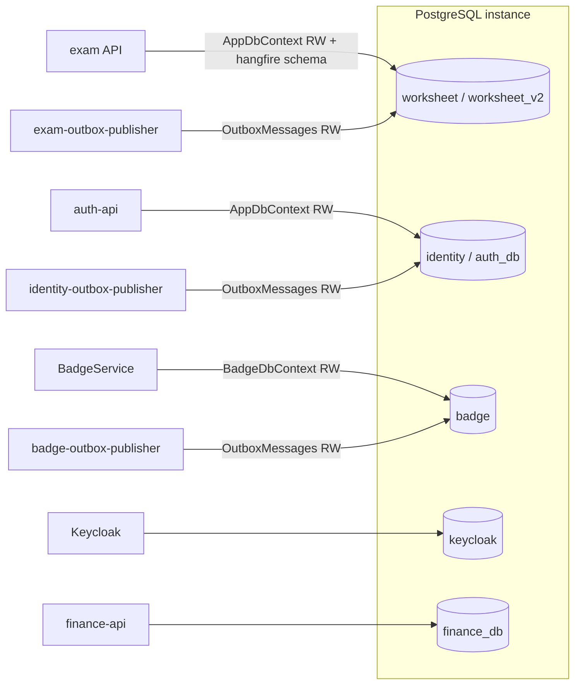

## 2. Veritabanları nasıl oluşturulur

Üç çalışma yolu var, her birinde DB oluşturma farklı:

1. **Aspire (`AppHost`)**: `postgres.AddDatabase(...)` çağrıları (`AppHost/AppHost.cs:24-29`) DB'leri Aspire'a kaynak olarak tanıtır. Postgres verisi `examapp-postgres-data` volume'ünde kalır (`AppHost/AppHost.cs:18`). AppHost yorumuna göre Keycloak DB'si için compose'taki init script'e gerek kalmamıştır (`AppHost/AppHost.cs:27-29`). Aspire'ın `AddDatabase`'in DB'yi kendisinin `CREATE DATABASE` ile oluşturup oluşturmadığı bu sürüm için **Doğrulanmadı**. Uygulama DB'leri her durumda migration sırasında oluşur (aşağıdaki 3. madde).
2. **Yerel docker-compose**: `exam-pg-container` servisi (`docker-compose.yml:284-300`) `POSTGRES_DB=${POSTGRES_DB}` ile yalnızca bir DB açar. `.env.example:9` bu değeri `worksheet` olarak verir. Servis `./postgres/init-scripts`'i `/docker-entrypoint-initdb.d`'ye bağlar (`docker-compose.yml:296`), ama **bu klasör repoda yok** (`postgres/` altında yalnızca üç `.sql` dosyası var, bkz. [§13](#13-elle-çalıştırılan-sql-dosyaları)). Bu yüzden boş bir volume'de `keycloak` DB'sini kimin oluşturduğu belirsiz (bkz. [Ayrı issue adayları](#ayrı-issue-adayları)). Host portu `5433:5432`'dir (`docker-compose.yml:292-293`).
3. **Uygulama DB'leri (worksheet/identity/badge/finance)**: Servisler açılışta `Database.Migrate()` / `MigrateAsync()` çağırır ([§11.3](#113-migrationlar-nasıl-uygulanır)). EF Core'un Npgsql sağlayıcısı, hedef DB yoksa migrate etmeden önce onu oluşturur. Yani bu DB'ler için init script şart değil. Keycloak ise DB'yi kendisi açmaz, DB'nin önceden var olması gerekir.
4. **Prod (`deploy/docker-compose.prod.yml`)**: `deploy/postgres/init`, `/docker-entrypoint-initdb.d`'ye salt okunur bağlanır (`deploy/docker-compose.prod.yml:34`). `deploy/postgres/init/01-create-databases.sql` dosyası `worksheet_v2`, `auth_db`, `badge`, `catalog`, `finance_db` ve `keycloak`'u `\gexec` ile koşullu açar (`deploy/postgres/init/01-create-databases.sql:9-31`). Dosyanın kendi notuna göre bu yalnızca **data volume boşken** çalışır (`:2`).

Tuzak: `docs/data-ownership.md` yalnızca `worksheet`, `badge`, `identity` ve `keycloak`'u listeler. Prod adları (`worksheet_v2`, `auth_db`) ve `finance_db`/`catalog` orada geçmez. Bir ortamda sorun ararken önce o ortamın compose/AppHost dosyasındaki `Database=` değerine bakın.

## 3. Veri sahipliği ve servisler arası referanslar

Kural metni [../data-ownership.md](../data-ownership.md) dosyasındadır. Burada tekrar edilmez, sadece özetlenir:

- Her servis yalnızca **kendi** DB'sine bağlanır. BadgeService exam DB'sine dokunmaz. Exam API'ye HTTP ile (`ExamApi:BaseUrl`) ve RabbitMQ olaylarıyla ulaşır.
- **Tek bilinçli istisna:** OutboxPublisher, üreticinin DB'sindeki `OutboxMessages` tablosunu okur. Bu, transactional outbox deseninin gereğidir. Belge "Do not 'fix' this by giving OutboxPublisher its own database." der. Aynı publisher kodu üç instance olarak worksheet, identity ve badge DB'lerine bakar ([§8](#8-outbox-tabloları-ve-outboxpublisher-appdbcontext)).
- Yeni async iş akışı outbox ile yapılır, servisler birbirinin tablosunu okumaz (`.claude/rules/workflow-rules.md:5-6`, bkz. [../../.claude/rules/workflow-rules.md](../../.claude/rules/workflow-rules.md)).

Sonuç olarak **DB'ler arası foreign key yoktur**. Başka DB'ye ait kimlikler düz kolon olarak taşınır:

| Kolon | Nerede | Anlamı |
|---|---|---|
| `UserId` (int) | worksheet: `Teachers`, `Students`, `Parents` (`api/ExamApp.Api/Data/Teacher.cs:26`, `Student.cs:14`, `Parent.cs:12`) | identity DB'deki `Users.Id`. Exam API bu değeri auth-api'den (Redis cache'li) profil olarak alır: `api/ExamApp.Api/Controllers/BaseController.cs:39-58`, `api/ExamApp.Api/Services/UserProfileProvider.cs:8-34` |
| `KeycloakId` / `*KeycloakId` (string) | identity `Users.KeycloakId` (`auth-api/Data/AppDbContext.cs:27`), worksheet `LoginEvents.KeycloakUserId`, `WorksheetComments.AuthorKeycloakId`, badge `Notifications.UserKeycloakId` vb. | Keycloak `sub` claim'i (`BaseController.cs:21`) |
| `UserId` (int) | badge: tüm aggregate/rozet/bildirim tabloları | identity `Users.Id` (olaylardan gelir) |
| `UserId` (string) | finance: `Transactions`, `Portfolios` vb. | finance-api'nin kendi kullanıcı kimliği. Kaynağı **Doğrulanmadı** |
| `UserProgram.UserId` (string) | worksheet (`api/ExamApp.Api/Data/UserProgram.cs:13`) | Kod yorumu "Keycloak user ID" der. Diğer tablolardaki int `UserId`'den farklı tiptir |

## 4. Ortak desenler: BaseEntity, audit, soft delete

**worksheet** ve **identity** context'leri aynı deseni kullanır. identity, exam API'den kopyalanmıştır ([§6](#6-identity-db--auth-api-appdbcontext)).

- `BaseEntity` alanları: `CreateTime`, `CreateUserId`, `UpdateTime`, `UpdateUserId`, `DeleteTime`, `DeleteUserId`, `IsDeleted` (`api/ExamApp.Api/Data/BaseEntity.cs:6-15`, kopyası `auth-api/Data/AppDbContext.cs:10-19`).
- **Audit:** `SaveChanges`/`SaveChangesAsync` override'ları `ApplyAuditInfo()` çağırır (`api/ExamApp.Api/Data/AppDbContext.cs:20-30`). Added satırda `CreateTime`/`CreateUserId`, Modified satırda `Update*` doldurulur (`:36-47`). Kullanıcı kimliği `SetCurrentUser(int)` ile verilir (`:15-18`). Verilmezse varsayılan `0` olur (`:10`).
- **Soft delete:** `EntityState.Deleted` olan her `BaseEntity` satırı `Modified`'a çevrilir, `IsDeleted = true` ve `DeleteTime`/`DeleteUserId` yazılır (`AppDbContext.cs:48-54`). Yani `Remove()` aslında bir `UPDATE`'tir.
- **Global query filter:** `OnModelCreating` sonunda `BaseEntity`'den türeyen her tipe reflection ile `HasQueryFilter(e => !e.IsDeleted)` eklenir (`api/ExamApp.Api/Data/AppDbContext.cs:828-852`, identity için `auth-api/Data/AppDbContext.cs:143-167`). Silinmiş kayıtlara ancak `IgnoreQueryFilters()` ile erişilir.
- **Sonuçları:**
  - Partial unique index'ler çoğunlukla `HasFilter("NOT \"IsDeleted\"")` taşır, böylece silinen satır tekilliği bozmaz.
  - Soft-delete edilen bir ebeveynin çocuklarının change tracker'da sessizce silinmemesi ya da null'lanmaması için birçok FK `DeleteBehavior.ClientNoAction` ile tanımlıdır. Gerekçe her yerde yorumda yazar, örn. `AppDbContext.cs:199-203`, `:458-460`, `:586-591`.
- `BaseEntity` **olmayan** (soft delete'siz, hard delete) worksheet tabloları: `Provinces`, `Districts`, `TeacherSubjects`, `ClassifierCacheConfigs`, `TopicStudyLinkAudits`, `AdminDataAccessLogs`, `AdminUserActionLogs`, `OutboxMessages`. Örneğin `TeacherSubject` (`api/ExamApp.Api/Data/TeacherSubject.cs:12`) uçlardaki filtrelerle eşleşen ayrı bir filtre alır (`AppDbContext.cs:331-334`).
- **badge** ve **finance** context'lerinde `BaseEntity`, audit ve soft delete **yoktur**.
- **jsonb / owned type:** Hiçbir context `jsonb`, `OwnsOne/OwnsMany` ya da `ToJson` kullanmaz. Dört model snapshot'ında `jsonb` geçmez. JSON içerikler düz `text` kolonlarda tutulur: `PracticeSession.SubjectIdsJson`/`TopicIdsJson`, `DailyQuestionSet.ScopeJson` (max 2000, `AppDbContext.cs:726`), `QuestionTransferJob.RequestJson`, `Teacher/Student.ThemeCustomConfig`, `WorksheetInstanceQuestion.AnswerPayload`, badge `BadgeDefinition.RuleConfigJson`, `Notification.Data`, `OutboxMessage.Content`.
- **Enum saklama:** Varsayılan olarak int. String'e çevrilenler: `WorksheetComment.AuthorRole` / `ResponsibleTeacherSource` (`AppDbContext.cs:206-207`), `WorksheetCommentReport.Reason` (`:225`), `AdminDataAccessLog.Resource/Outcome/StatusFilter` (`:768-775`), `AdminUserActionLog.Action/TargetType/Outcome` (`:784-786`). Partial index filtrelerinde int değerler kullanılır, örn. `"Status" = 0` (`:534`) ve `"Status" IN (0, 1)` (`:639`). Enum sırası değişirse bu filtreler bozulur.
- **`HasSentinel` tuzağı:** DB default'u olan ve CLR default'undan farklı değer taşıyan kolonlarda EF'in "ayarlanmamış" yorumu `HasSentinel` ile düzeltilir. Örnekler: `Worksheet.CommentsEnabled` (`AppDbContext.cs:191-197`), `Teacher.ApprovalStatus` (`:232-239`), `AdminDataAccessLog.Outcome` (`:771-773`). Yeni default'lu kolon eklerken bu yorumları okuyun.

## 5. `worksheet` DB — exam API `AppDbContext`

Dosya: `api/ExamApp.Api/Data/AppDbContext.cs` (859 satır). Entity sınıfları `api/ExamApp.Api/Data/*.cs`. Kayıt: `builder.AddNpgsqlDbContext<AppDbContext>("DefaultConnection")` (`api/ExamApp.Api/Program.cs:377`). Bu Aspire bileşeni retry-on-failure'ı da açar. Uzun açıklama `api/ExamApp.Api/Services/Worksheets/TestSessionService.cs:361` yorumunda.

### 5.1 DbSet listesi

`api/ExamApp.Api/Data/AppDbContext.cs:57-141`. Tablo adları, `Migrations/AppDbContextModelSnapshot.cs` içindeki `ToTable(...)` çağrılarından doğrulandı. **DbSet adı ile tablo adı her zaman aynı değildir:**

| DbSet (satır) | Entity | Tablo | Not |
|---|---|---|---|
| `Students` (:57), `Teachers` (:58), `Parents` (:59) | `Student`, `Teacher`, `Parent` | aynı | |
| `Worksheets` (:60) | `Worksheet` | `Worksheets` | Kod ve UI'da "test" / "çalışma kağıdı" |
| `Questions` (:61), `Answers` (:62) | `Question`, `Answer` | aynı | |
| `TestQuestions` (:63) | `WorksheetQuestion` | `TestQuestions` | FK kolonu `TestId` → `Worksheets.Id` |
| `Grades`, `Subjects`, `GradeSubjects` (:64-66) | | aynı | Taksonomi |
| `TeacherSubjects` (:67) | `TeacherSubject` | aynı | issue #95 |
| `Topics` (:68), `SubTopics` (:69) | `Topic`, `SubTopic` (`Subtopic.cs`) | aynı | |
| `ClassifierCacheConfigs` (:70) | | aynı | Tekil satır |
| `TestInstances` (:71) | `WorksheetInstance` | `TestInstances` | Bir öğrencinin bir testi çözme oturumu |
| `TestInstanceQuestions` (:72) | `WorksheetInstanceQuestion` | `TestInstanceQuestions` | |
| `TestPrototypes` (:73), `TestPrototypeDetail` (:74) | `WorksheetPrototype(Detail)` | `TestPrototypes`, `TestPrototypeDetail` | Kodda kullanılmıyor (grep 0) |
| `WorksheetAssignments` (:75) | | aynı | |
| `StudentPoints`, `StudentPointHistories`, `Rewards`, `StudentRewards`, `Leaderboards`, `SpecialEvents`, `StudentSpecialEvents`, `StudentBadges` (:76-83) | | aynı | [§5.8](#58-puan-ödül-eski-rozet-tabloları) |
| `Books` (:84), `BookTests` (:85) | `Book`, `BookTest` (`Book.cs`) | aynı | |
| `Passage` (:86) | `Passage` | `Passage` (tekil!) | Okuma parçası / "kapsam" |
| `QuestionSubTopics` (:87) | | aynı | Soru ↔ alt konu M:N |
| `OutboxMessages` (:88) | `ExamApp.Foundation.Persistence.OutboxMessage` | aynı | [§8](#8-outbox-tabloları-ve-outboxpublisher-appdbcontext) |
| `ProgramSteps`, `ProgramStepOptions`, `ProgramStepActions`, `UserPrograms`, `UserProgramSchedules`, `UserProgramStudyPageSchedules` (:89-94) | | aynı | Çalışma programı sihirbazı |
| `StudyItems` (:95), `StudyItemImages` (:96) | | aynı | Eski adı StudyPage |
| `TopicStudyLinks` (:97), `TopicStudyLinkAudits` (:98) | `TopicStudyLink.cs` | aynı | issue #61 |
| `LearningOutcomeDetails` (:99), `LearningOutcomes` (:100) | | aynı | Kazanımlar |
| `QuestionTransferJobs`, `QuestionTransferImportMaps`, `QuestionTransferExportBundles`, `QuestionTransferExportMaps` (:102-106) | | aynı | Soru içe/dışa aktarma |
| `WorksheetReminders` (:108) | | aynı | Hangfire job id taşır |
| `WorksheetAccessRequests` (:110), `WorksheetAccessGrants` (:111) | | aynı | issue #13 |
| `WorksheetComments` (:114), `WorksheetCommentReports` (:115) | | aynı | issue #105, #305 |
| `TeacherAvailabilitySlots` (:118), `Bookings` (:119), `RecurringAvailabilityRules` (:122) | | aynı | issue #96, #178 |
| `Schools` (:124), `Provinces` (:127), `Districts` (:128) | | aynı | issue #91 |
| `PracticeSessions` (:131), `PracticeSessionQuestions` (:132) | | aynı | issue #62 |
| `DailyQuestionSets` (:135), `DailyQuestionSetItems` (:136) | | aynı | issue #99 |
| `LoginEvents` (:139), `AdminDataAccessLogs` (:140), `AdminUserActionLogs` (:141) | | aynı | Denetim |
| *(DbSet yok)* | `Badge` | `Badge` (snapshot `:258`) | `StudentBadges` ilişkisiyle modele girer (`AppDbContext.cs:380-383`) |

Modele girmeyen sınıflar: `Exam` (`AppDbContext.cs:855-859`, kullanılmıyor), `UserRole` enum'u (`api/ExamApp.Api/Data/User.cs:5`; worksheet DB'de `Users` tablosu **yoktur**). Seed sınıfları: `TopicSeed`, `CatalogSeed`, `SeedData`, `ProgramStepSeed`, `ReferenceDataSeed`.

### 5.2 Taksonomi: sınıf / ders / konu / alt konu

Hiyerarşi şöyledir:
- **Sınıf** (`Grade`, örn. "3. Sınıf") ile **ders** (`Subject`, örn. "Türkçe") M:N ilişkilidir, ara tablo `GradeSubjects`'tir.
- **Konu** (`Topic`) hem derse (`SubjectId`) hem sınıfa (`GradeId`) bağlıdır (`api/ExamApp.Api/Data/Topic.cs:15-24`). Yani aynı ad farklı sınıflarda ayrı konu satırıdır.
- **Alt konu** (`SubTopic`) tek bir konuya bağlıdır (`Subtopic.cs:14-17`).
- **Kazanım** (`LearningOutcome`) alt konuya bağlıdır ve `Code` ile `GradeId` taşır (`LearningOutcome.cs:11-20`). Kazanımın detay satırları `LearningOutcomeDetail`'dadır.
- Soru, ders ve konuya doğrudan FK ile, alt konulara ise `QuestionSubTopics` M:N ile bağlanır.

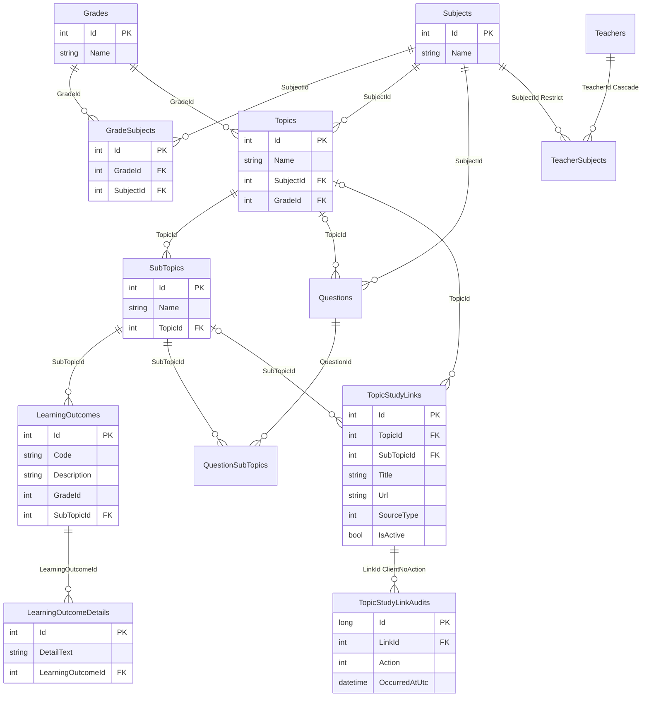

Kurallar ve kanıtlar:
- `GradeSubject` ilişkileri: `AppDbContext.cs:303-312`. `GradeSubjects` için (GradeId, SubjectId) tekil index **yoktur** (Doğrulandı: OnModelCreating'de tanım yok).
- `LearningOutcome → SubTopic`: `AppDbContext.cs:812-815`. `LearningOutcomeDetail → LearningOutcome`: `:817-820`. `LearningOutcome.GradeId` FK değildir, düz int'tir.
- `QuestionSubTopic` M:N: `AppDbContext.cs:414-422`. Ara tablonun kendi `Id`'si vardır ve `BaseEntity`'dir (`QuestionSubTopic.cs:6-14`). Otomatik sınıflandırma bu tabloya yazar (`api/ExamApp.Api/Services/Questions/QuestionClassificationService.cs:141`). Kaynak `Question.ClassificationSource` enum'udur (`Question.cs:72`).
- `TopicStudyLink`: "en az biri dolu" check constraint'i `CK_TopicStudyLinks_TopicOrSubTopic` (`AppDbContext.cs:444-448`), index'ler `:451-456`, audit FK'sı `ClientNoAction` (`:458-468`).
- `TeacherSubject` (bağımsız öğretmenin dersleri): `AppDbContext.cs:314-334`. (TeacherId, SubjectId) tekildir (`:327-329`).
- `ClassifierCacheConfig`: soru sınıflandırıcının (LLM cached content) taksonomi hash'ini tutan tekil satır (`api/ExamApp.Api/Data/ClassifierCacheConfig.cs:13-37`, `Id = SingletonId`).
- **Yönetim:** Admin taksonomi CRUD'u `api/ExamApp.Api/Services/Taxonomy/TaxonomyService.cs`'tedir: ders `:115`, ders-sınıf bağlama `:196-212`, konu `:326`, alt konu `:394`. Controller `api/ExamApp.Api/Controllers/AdminController.cs`. **Sınıf (`Grade`) oluşturan bir servis metodu yoktur.** Sınıflar seed'den gelir.
- **Seed kaynağı:** Taksonomi `HasData` ile migration'lara gömülmüştür. `20250226193226_initial`, `20250314220208_newSeedForMath3`, `20250320145624_SeedDataChanges_1`…`_8`, `20250531195414_newoutcometables` ve özellikle `20250601191702_SeedDataMigration` (eski seed satırlarını `DeleteData` ile siler, yenilerini `InsertData` ile ekler: Grades `:376`, Subjects `:393`, GradeSubjects `:415`, Topics `:483`, SubTopics `:967`). Bugünkü `OnModelCreating`'de seed çağrıları yorum satırıdır (`AppDbContext.cs:822-825`), model snapshot'ında `HasData` yoktur. `TopicSeed.InitializeSeed` (`api/ExamApp.Api/Data/TopicSeed.cs:10`) yalnızca `Program.cs:541`'deki yorum bloğunda geçer, yani çalışmaz. Açılışta çalışan tek referans seed `ReferenceDataSeed.Initialize`'dır (il/ilçe, `api/ExamApp.Api/Program.cs:506-521`). Seed'lerin modelden nasıl kaldırıldığı (snapshot'ta `HasData` yokken sonraki migration'ların neden `DeleteData` üretmediği) **Doğrulanmadı**.
- Yeni konu/alt konu eklemek için elle yazılmış SQL şablonları da var ([§13](#13-elle-çalıştırılan-sql-dosyaları)).

### 5.3 Soru, test (worksheet) ve kitap

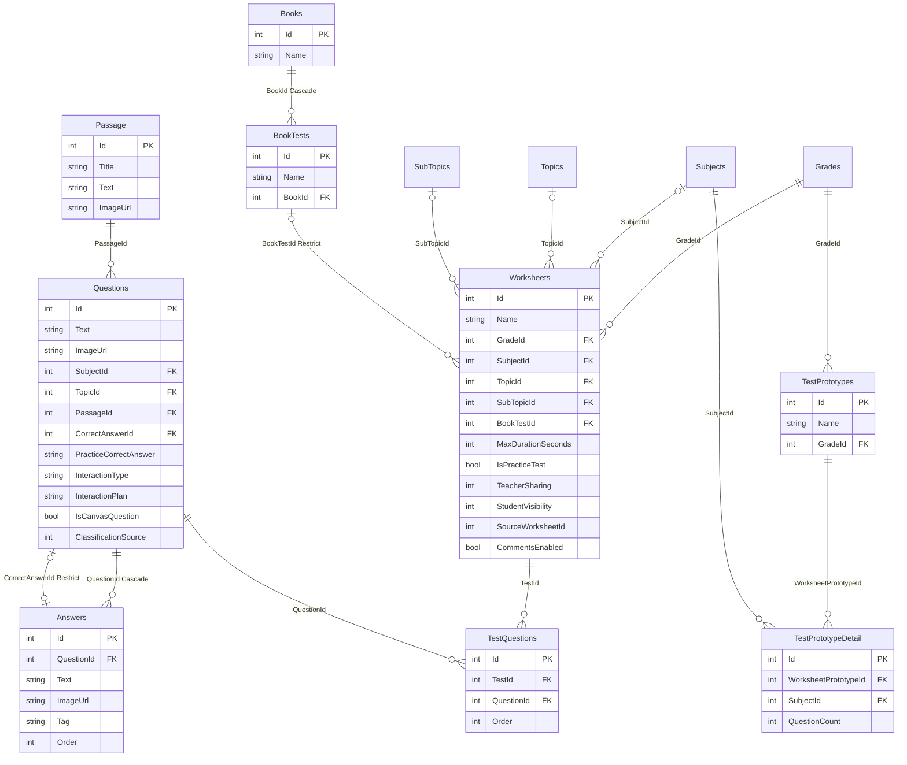

- Soru ↔ şıklar: iki ilişki var. Koleksiyon `Answers` cascade'dir (`AppDbContext.cs:159-162`, `:390-394`). Döngüyü kırmak için doğru şık ayrı ve tek yönlü bir FK'dır (`CorrectAnswerId`, `Restrict`, `:396-400`).
- Canvas/koordinat alanları (`X`, `Y`, `Width`, `Height`, `IsCanvasQuestion`) `Question`, `Answer` ve `Passage`'ta vardır (`Question.cs:59-70`, `Answer.cs:14-22`, `Passage.cs:13-21`). Bunlar question-detector'ın sayfa görüntüsünden çıkardığı bölgeleri taşır (bkz. [03-servisler/question-detector.md](03-servisler/question-detector.md)).
- `Worksheet` ↔ `TestQuestions`: `AppDbContext.cs:164-177`. FK kolonunun adı `TestId`'dir (`WorksheetQuestion.cs:10`).
- Görünürlük eksenleri (issue #9): `TeacherSharing` default `Private`, `StudentVisibility` default `Normal`, bileşik index (TeacherSharing, StudentVisibility, GradeId, CreateUserId) (`AppDbContext.cs:179-189`).
- `Worksheet.BookTestId` `Restrict` (`:402-406`), `BookTest.BookId` `Cascade` (`:408-412`).
- `Worksheet.SourceWorksheetId` (`Worksheet.cs:51`) kopyalanan testin kaynağını tutar. FK değildir.

### 5.4 Çözüm, atama, pratik ve günün soruları

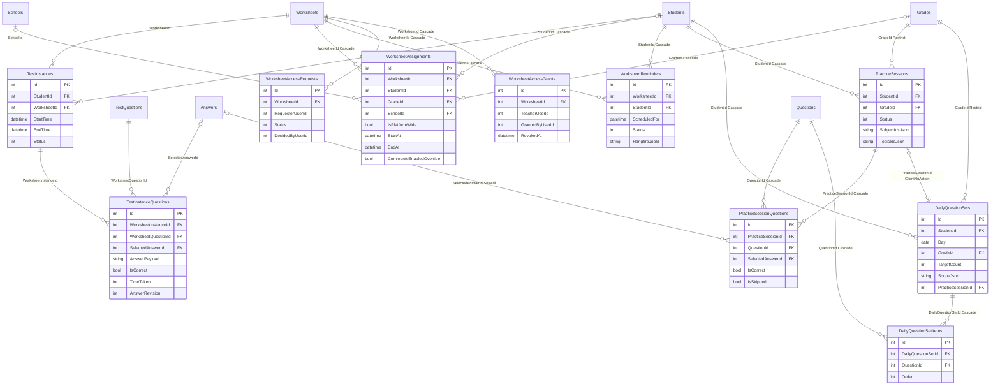

- `TestInstanceQuestions` partial index'i `IX_TestInstanceQuestions_UpdateTime_Answered`: filtre ve INCLUDE kolonları dashboard ve öğretmen aktivite sorguları için ayarlanmıştır (`AppDbContext.cs:647-662`, issue #265). Filtre ifadesi index'e birebir yazıldığı için sorgu yüklemi değişirse index kullanılmaz.
- `AnswerRevision`: cevap değişikliklerini DB'de sıralayan sayaç. BadgeService "son cevap sayılır" kuralı için bunu kullanır (`WorksheetInstanceQuestion.cs:40-44`, karşılığı [§7](#7-badge-db--badgeservice-badgedbcontext) `AnswerPointAward.LastAppliedRevision`).
- `WorksheetAssignment` index'leri (StudentId, WorksheetId, StartAt) ve (GradeId, WorksheetId, StartAt): `AppDbContext.cs:482-504`. Öğrenciye, sınıfa, okula ya da platform geneline (`IsPlatformWide`, `WorksheetAssignment.cs:43`) atama yapılabilir.
- `WorksheetReminder`: (WorksheetId, StudentId) tekildir (`AppDbContext.cs:518-520`).
- Atama izni (issue #13): yalnız bir bekleyen talep olabilir, filtre `"Status" = 0` (`AppDbContext.cs:529-534`). Yalnız bir aktif grant olabilir, filtre `"RevokedAt" IS NULL` (`:542-546`).
- Pratik oturumu: aynı oturumda aynı soru tekrar etmez, (PracticeSessionId, QuestionId) tekildir (`AppDbContext.cs:698-701`).
- Günün soruları (issue #99): öğrenci başına günde bir canlı set (`:728-730`). Bir oturum en fazla bir sete bağlanır (`:733-735`). Set içinde soru ve sıra tekildir (`:751-752`). Yarış durumunda unique ihlali yakalanıp kazananın seti yeniden okunur (`:703-705`).

### 5.5 Kullanıcı rolleri, okul, il/ilçe

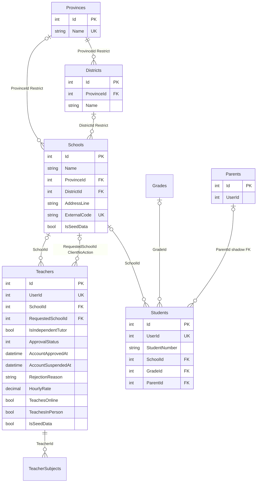

- worksheet DB'de **kullanıcı tablosu yoktur**. Rol satırları (`Teachers`/`Students`/`Parents`) `UserId` ile identity DB'deki kullanıcıyı gösterir ([§3](#3-veri-sahipliği-ve-servisler-arası-referanslar)). Rol modeli için [05-kimlik-yetki.md](05-kimlik-yetki.md).
- Kullanıcı başına tek canlı öğretmen/öğrenci satırı: `UserId` tekil ve `NOT "IsDeleted"` filtreli (`AppDbContext.cs:254-266`, issue #259). İhlal register akışında 409'a çevrilir.
- `Parent.Children` (`Parent.cs:14`) karşı tarafta navigation'sız tanımlıdır. EF `Students` tablosuna gölge `ParentId` FK'sı ekler (snapshot `AppDbContextModelSnapshot.cs:1784`, `:1819`, `:4037`). Yani bir öğrencinin en fazla bir velisi olur.
- `Teacher`: bağımsız öğretmen default'ları (`AppDbContext.cs:232-243`), bekleyen okul talebi için ikinci FK `RequestedSchoolId` (`:245-252`), arama index'i (IsIndependentTutor, ApprovalStatus) (`:336-338`). `HourlyRate` `decimal(10,2)` (`Teacher.cs:111`).
- `Teacher` ve `Student` `ISchoolScoped` uygular (`Teacher.cs:20`, `Student.cs:8`). Bu, okul (tenant) izolasyonu için sorgu düzeyinde `SchoolId` filtresi uygulatan bir arayüzdür ve şemayı etkilemez (`api/ExamApp.Api/Data/ISchoolScoped.cs:3-12`).
- İl/ilçe: `Provinces.Name` tekil (`AppDbContext.cs:270-272`), (ProvinceId, Name) tekil (`:280-282`). Okulların il/ilçe FK'ları `Restrict` (`:284-294`). Açılışta `ReferenceDataSeed` ile doldurulur ([§5.2](#52-taksonomi-sınıf--ders--konu--alt-konu)).
- `Schools.ExternalCode` (MEB kurum kodu) doluysa tekildir. Soft-delete edilmiş satırlar da bu tekilliğe dahildir (`AppDbContext.cs:296-301`). Okul listesini `dotnet run -- seed-schools` aracı yükler (`api/ExamApp.Api/Data/SeedFixtures/README.md`).

### 5.6 Booking ve müsaitlik

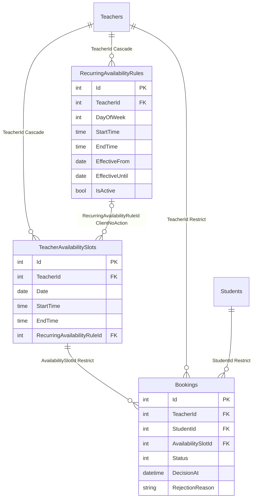

- `BookingStatus`: `Pending=0`, `Approved=1`, `Rejected=2` (`api/ExamApp.Api/Data/Booking.cs:8-13`).
- **Çifte rezervasyon koruması:** bir slotta yalnızca tek aktif booking olabilir. `AvailabilitySlotId` tekil index, filtre `"Status" IN (0, 1) AND NOT "IsDeleted"` (`AppDbContext.cs:634-639`).
- Slot tekilliği (TeacherId, Date, StartTime, EndTime), soft-delete hariç (`:560-564`). Sorgu index'i `:556-558`.
- Tekrarlayan kural tekilliği (TeacherId, DayOfWeek, StartTime, EndTime, EffectiveFrom), filtre `"IsActive" AND NOT "IsDeleted"` (`:578-584`). Kesişen tarih aralıklarını servis katmanı reddeder.
- Kural silinince slot referansını korur (`ClientNoAction`, gerekçe `:586-596`). Sweep index'i (RuleId, Date) `:598-600`.
- **Süre check constraint'leri** (issue #323): `CK_TeacherAvailabilitySlots_Duration` ve `CK_RecurringAvailabilityRules_Duration`. Sıfır süreyi ve 4 saati aşmayı DB seviyesinde reddeder. Yalnız Npgsql'de eklenir (`AppDbContext.cs:602-614`). SQL ve ad sabitleri `api/ExamApp.Api/Services/Bookings/SlotTimeRange.cs:59-65`. Migration `20261005124021_AddAvailabilitySlotDurationCheckConstraints` `Up()` başında ihlal eden satır varsa durur (skill'deki istisna, [§11.4](#114-ef-migration-skilli-ve-protect-migrationssh-hooku)).

### 5.7 Yorum ve moderasyon

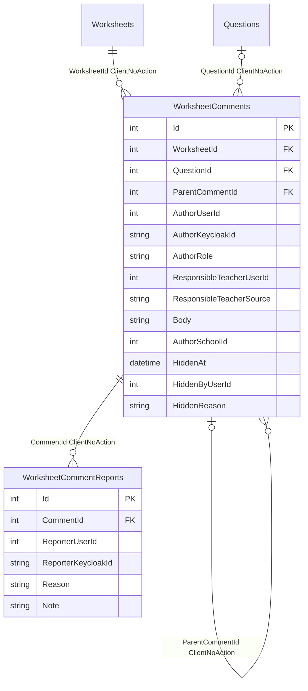

- Thread yapısı: kök yorum `ParentCommentId IS NULL`. Cevaplar kökü gösterir. `QuestionId` null ise yorum test geneline aittir (`WorksheetComment.cs:44-85`).
- Index'ler (`AppDbContext.cs:211-217`):
  - genel (WorksheetId, QuestionId, CreateTime, Id);
  - yalnız kökler için partial `IX_WorksheetComments_Roots` (filtre `"ParentCommentId" IS NULL`);
  - cevaplar için (ParentCommentId, CreateTime, Id).
  
  Sayfalama keyset ile yapılır.
- Moderasyon: gizleme alanları `HiddenAt/HiddenByUserId/HiddenReason` (`WorksheetComment.cs:99-109`). Şikâyetlerde (CommentId, ReporterUserId) tekil ve soft-delete hariçtir (`AppDbContext.cs:220-230`). Eşzamanlı ikinci şikâyet unique ihlaline düşer, servis bunu idempotent 200'e çevirir.
- Yorum açma/kapama: `Worksheet.CommentsEnabled` (sentinel açıklaması `AppDbContext.cs:191-197`) ve atama düzeyinde `WorksheetAssignment.CommentsEnabledOverride` (`WorksheetAssignment.cs:55`).
- Bildirimler BadgeService'teki `Notifications` tablosunda birleştirilir ([§7](#7-badge-db--badgeservice-badgedbcontext)). Akış için [07-uctan-uca-akislar.md](07-uctan-uca-akislar.md).

### 5.8 Puan, ödül, eski rozet tabloları

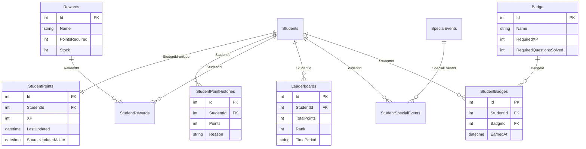

- `StudentPoints` öğrenci başına tek satırdır (`AppDbContext.cs:341-343`). Bugün **BadgeService'teki puan aggregate'inin kopyasıdır**: BadgeService `StudentPointsChangedEvent`'i kendi outbox'ına yazar, exam API tüketip `StudentPoints`'i günceller. `SourceUpdatedAtUtc` sırasız gelen olaylara karşı tazelik korumasıdır (migration `20260923031210_AddStudentPointSourceUpdatedAtUtc`, issue #225, `AppHost/AppHost.cs:525-530` yorumu). Liderlik tablosu bunu okur.
- `Badge`/`StudentBadges`, `Rewards`/`StudentRewards`, `SpecialEvents`/`StudentSpecialEvents`, `Leaderboards` ilk sürümden kalan oyunlaştırma tablolarıdır. Asıl rozet sistemi BadgeService'tedir ([§7](#7-badge-db--badgeservice-badgedbcontext)). Kod kullanımı (grep `.<DbSet>` sayısı): `Rewards` 0, `SpecialEvents` 1, `StudentSpecialEvents` 1, `StudentBadges` 5, `StudentRewards` 4, `Leaderboards` 8. Hangilerinin canlı akışta olduğu **Doğrulanmadı**.
- İlişkiler: `AppDbContext.cs:149-152`, `:341-383`.

### 5.9 Çalışma programı ve çalışma içerikleri

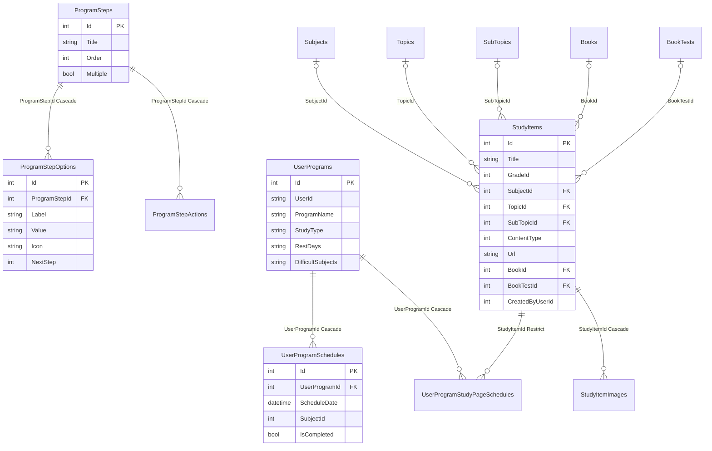

- `ProgramSteps/Options/Actions`: çalışma programı sihirbazının adımlarıdır, migration'larla seed edilir (`20250528075039_InitialProgramStepsMigration`, `20260909175053_FixProgramStepWizardDeadEnd`, `20261005164942_ReplaceProgramStepOptionIconsWithMaterialSymbols`). İlişkiler `AppDbContext.cs:792-803`.
- `UserProgram` ilişkileri `AppDbContext.cs:805-810` ve `:470-480`. `UserProgramSchedule.SubjectId` FK değildir. `RestDays` ve `DifficultSubjects` virgülle ayrılmış metindir (`UserProgram.cs:38-40`).
- `StudyItem` (eski adı StudyPage, migration `20260910111431_RenameStudyPageToStudyItemAndAddContentTypes`): görsel, link ya da kitap sayfa aralığı içerik tipleri (`StudyItem.cs:47-67`). Görseller `StudyItemImages`'tadır (`AppDbContext.cs:436-440`).

### 5.10 Denetim kayıtları, soru transferi, tekil tablolar

Bu tabloların FK'sı yoktur. Önemli index'leri:

| Tablo | Amaç | Index / kural |
|---|---|---|
| `LoginEvents` | Login denemeleri (issue #84). BadgeService servisten servise yazar | (KeycloakUserId, OccurredAtUtc), (OccurredAtUtc, Role, Success) — `AppDbContext.cs:755-761` |
| `AdminDataAccessLogs` | Admin kişisel veri erişim kaydı (issue #246, KVKK saklama #262) | enum'lar string, `Outcome` default `Served`; (ActorKeycloakId, OccurredAtUtc), (OccurredAtUtc) — `:763-778` |
| `AdminUserActionLogs` | Admin hesap aksiyonları (issue #156) | (ActorKeycloakId, OccurredAtUtc), (TargetType, TargetId, OccurredAtUtc), (OccurredAtUtc) — `:780-790` |
| `QuestionTransferJobs` | İçe/dışa aktarma işleri, PK `Guid` | — |
| `QuestionTransferImportMaps` | Dış soru anahtarı → hedef soru | (SourceKey, ExternalQuestionKey) tekil — `:424-426` |
| `QuestionTransferExportBundles` / `...ExportMaps` | Dışa aktarma paketleri | (SourceKey, BundleNo) tekil, (SourceKey, QuestionId) tekil — `:428-434` |
| `ClassifierCacheConfigs` | Sınıflandırıcı cache meta verisi | tekil satır ([§5.2](#52-taksonomi-sınıf--ders--konu--alt-konu)) |
| `OutboxMessages` | Transactional outbox | [§8](#8-outbox-tabloları-ve-outboxpublisher-appdbcontext) |

### 5.11 `OnModelCreating` önemli konfigürasyon özeti

| Tür | Yer (`api/ExamApp.Api/Data/AppDbContext.cs`) |
|---|---|
| Global soft-delete filtresi | `:828-852` |
| Ek query filter (`TeacherSubject`) | `:333-334` |
| Partial unique index'ler | `:227-229`, `:258-266`, `:298-301`, `:531-534`, `:543-546`, `:561-564`, `:581-584`, `:636-639`, `:728-735` |
| Diğer unique index'ler | `:270-272`, `:280-282`, `:327-329`, `:341-343`, `:424-434`, `:518-520`, `:699-701`, `:751-752` |
| Check constraint'ler | `:445-448` (TopicStudyLinks), `:605-614` (süre, yalnız Npgsql) |
| INCLUDE'lu partial index | `:658-662` |
| `ClientNoAction` FK'lar (soft delete gerekçeli) | `:208-210`, `:226`, `:248-252`, `:461-465`, `:592-596`, `:721-724` |
| `Restrict` FK'lar | `:274-294`, `:321-325`, `:396-406`, `:476-480`, `:616-632`, `:671-675`, `:713-716` |
| `Cascade` FK'lar | `:315-319`, `:390-394`, `:408-412`, `:436-440`, `:470-474`, `:482-498`, `:506-516`, `:523-540`, `:550-554`, `:568-572`, `:665-669`, `:680-690`, `:708-711`, `:740-748`, `:793-810` |
| `SetNull` FK | `:692-696` |
| DB default + sentinel | `:180-186`, `:194-197`, `:236-243`, `:771-773` |
| Enum → string | `:206-207`, `:225`, `:768-775`, `:784-786` |

Not: Bazı cascade'ler soft delete yüzünden pratikte çalışmaz. `Remove()` bir `UPDATE`'tir, bu yüzden DB'deki `ON DELETE CASCADE` yalnızca ham SQL ile yapılan fiziksel silmelerde devreye girer. EF tarafında da change tracker'daki çocuklara cascade uygulanır, ama ebeveyn `Modified` olduğu için uygulanmaz. Bu mekaniğin her ilişki için ayrı ayrı test edildiği **Doğrulanmadı**.

## 6. `identity` DB — auth-api `AppDbContext`

Dosya: `auth-api/Data/AppDbContext.cs` (167 satır). `User` entity'si ve `BaseEntity` aynı dosyadadır. Namespace exam API ile aynıdır (`ExamApp.Api.Data`), çünkü proje exam API'den kopyalanmıştır (proje dosyası da `auth-api/ExamApp.Api.csproj`). Kayıt: `auth-api/Program.cs:170-171`.

| DbSet | Satır | Tablo |
|---|---|---|
| `Users` | `auth-api/Data/AppDbContext.cs:83` | `Users` |
| `OutboxMessages` | `:84` | `OutboxMessages` |

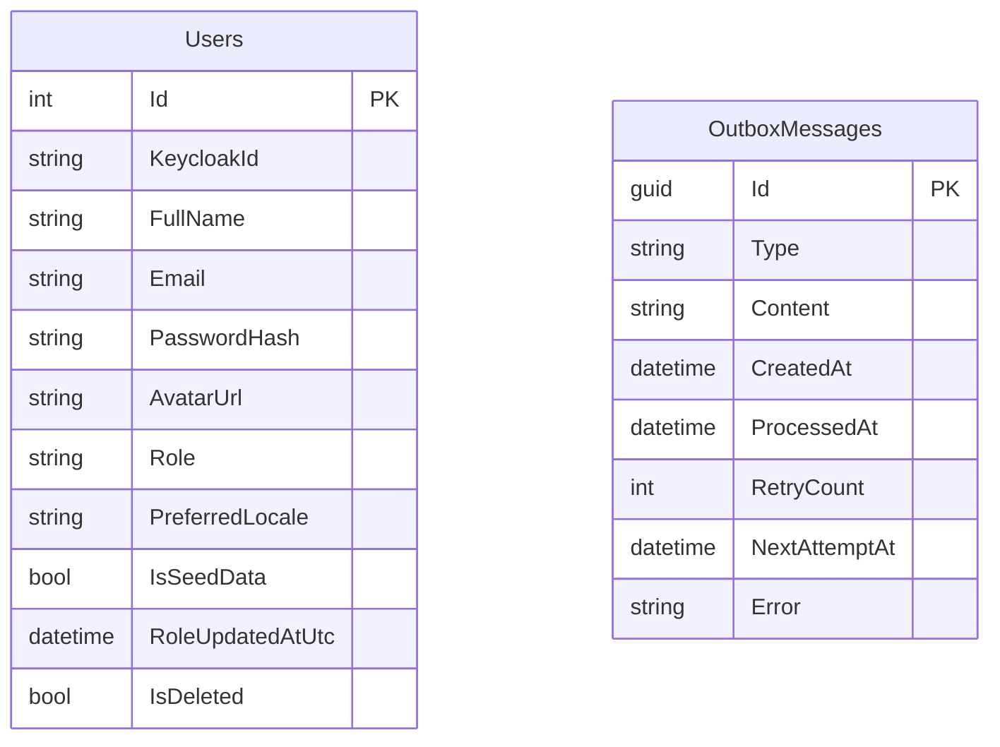

- `User` alanları `auth-api/Data/AppDbContext.cs:21-67`:
  - `Role` string'tir (Student/Teacher/Parent; enum `:69-74` ama kolon string, migration `20250622080900_UpdateRoleToString`).
  - `PreferredLocale` max 8, DB default `tr` (`:135-141`, issue #181).
  - `RoleUpdatedAtUtc`, `UserRoleChangedConsumer`'ın tazelik korumasıdır (`:57-66`, issue #277).
  - `KeycloakId` için tekil index **yoktur** (OnModelCreating'de tanım yok). Tekilliğin uygulama katmanında sağlanıp sağlanmadığı **Doğrulanmadı**.
- Soft delete filtresi `:143-167`.
- `auth-api/Data/Book.cs` modele girmez (DbSet yok), exam API'den kalmış ölü bir kopyadır.
- **Tarihçe tuzağı:** auth-api'nin migration geçmişi exam API'ninkiyle aynı başlar (`20250226193226_initial`… 29 tablo). `20250622080900_UpdateRoleToString` adına rağmen `Up()` içinde 37 alan tablosunu düşürür (`DropTable` ×37). O tarihten beri identity DB'de yalnızca `Users` ve `OutboxMessages` vardır (snapshot `auth-api/Migrations/AppDbContextModelSnapshot.cs:94`, `:128`).

## 7. `badge` DB — BadgeService `BadgeDbContext`

Dosya: `Services/BadgeService/BadgeDbContext.cs` (215 satır). Entity'ler `Services/BadgeService/Entities/*.cs` altındadır (`Data/Entities` değil; `Data/` altında yalnızca `BadgeSeeder.cs` var). Kayıt: `Services/BadgeService/Program.cs:152-155`.

| DbSet | Satır | Tablo | PK |
|---|---|---|---|
| `BadgeDefinitions` | `:12` | `BadgeDefinitions` | `Guid Id` |
| `BadgeEarned` | `:13` | `BadgeEarned` | `Guid Id` |
| `StudentQuestionAggregates` | `:14` | aynı | `Guid Id` |
| `StudentSubjectAggregates` | `:15` | aynı | `Guid Id` |
| `StudentDailyActivities` | `:16` | aynı | `Guid Id` |
| `StudentBadgeProgresses` | `:17` | aynı | `Guid Id` |
| `Notifications` | `:18` | aynı | `int Id` |
| `ProcessedLoginAttempts` | `:19` | aynı | `int Id` |
| `ProcessedAnswerSubmissions` | `:20` | aynı | `Guid EventId` |
| `AnswerPointAwards` | `:21` | aynı | (TestInstanceId, QuestionId) |
| `UserLocalePreferences` | `:22` | aynı | `int UserId` |
| `NotificationEventLogs` | `:23` | aynı | (Type, EventId) |
| `HiddenCommentTombstones` | `:24` | aynı | `int CommentId` |
| `OutboxMessages` | `:31` | aynı | `Guid Id` |

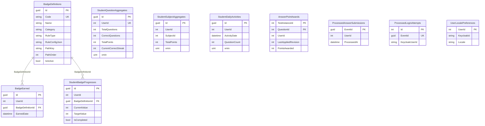

Bildirim tarafı (FK yok, bağlantılar olay kimlikleri üzerinden):

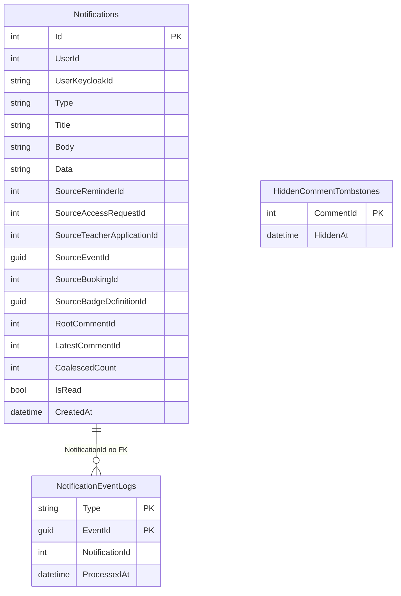

Önemli konfigürasyonlar (`Services/BadgeService/BadgeDbContext.cs`):
- `BadgeDefinition.Code` tekil (`:36-39`, issue #148). Alan uzunlukları `:40-51`, `IsActive` default `true` (`:55`), `CreatedAtUtc` default `now()` yalnız Npgsql'de (`:56-63`).
- Aggregate tekillikleri: `StudentQuestionAggregates.UserId` (`:71-74`), (UserId, SubjectId) (`:76-79`), (UserId, ActivityDate) (`:81-84`), (UserId, BadgeDefinitionId) progress (`:98-105`).
- **Optimistic concurrency:** Üç aggregate tabloda Postgres sistem kolonu `xmin` row version olarak kullanılır, yalnız Npgsql'de (`:86-97`, issue #279). Çakışma `DbUpdateConcurrencyException` olarak yükselir ve sınırlı sayıda yeniden denenir.
- **Bildirim idempotency index'leri** (hepsi partial unique):
  - (Type, SourceReminderId) `:116-119`
  - (Type, SourceAccessRequestId) `:121-124`
  - (Type, SourceTeacherApplicationId), yalnız `TeacherApplicationSubmitted` tipi için `:125-135`
  - (Type, SourceEventId) `:138-141`
  - (UserId, SourceBadgeDefinitionId), yalnız `BadgeEarned` tipi için `:144-148`
  - okunmamış yorum bildirimi birleştirme (UserId, UserKeycloakId, Type, RootCommentId), filtre `IsRead = FALSE` `:150-155`
  
  Liste index'leri `:110-113`, `LatestCommentId` index'i `:157-159`. `CoalescedCount` default 1 (`:108`).
- `NotificationEventLog` bileşik PK (Type, EventId) ve `ProcessedAt` index'i retention içindir (`:161-165`).
- `HiddenCommentTombstone`: PK dışarıdan gelir (`ValueGeneratedNever`, `:167-169`, issue #326).
- `ProcessedLoginAttempt.EventId` tekil (`:171-175`). `ProcessedAnswerSubmission` PK'sı `EventId` (outbox satır Id'si), `UserId` ve `ProcessedAt` index'leri vardır (`:177-193`).
- `AnswerPointAward` bileşik PK (TestInstanceId, QuestionId): "soru başına bir kez, son cevap sayılır" kuralıdır (`:195-199`).
- `UserLocalePreference.UserId` doğal PK, `ValueGeneratedNever` (`:201-213`).
- `StudentHeatMap` sınıfı (`Services/BadgeService/Entities/BadgeEarned.cs:14-18`) DbSet değildir, modele girmez.
- Açılışta `MigrateAsync()` ve ardından `BadgeSeeder.SeedAsync` çalışır (`Services/BadgeService/Program.cs:291-297`). Seeder `Code`'u "üzerine yazmama" anahtarı olarak kullanır.

## 8. Outbox tabloları ve OutboxPublisher `AppDbContext`

Outbox satır tipi ortak projededir: `api/ExamApp.Foundation/Persistence/OutboxMessage.cs:5-28`. Aynı şema üç DB'de `OutboxMessages` tablosu olarak vardır:

| DB | Tabloyu oluşturan migration | Yazan servis |
|---|---|---|
| worksheet | exam API: `20250501203010_outboxpatternchanges` (oluşturma), `20250513093603_outbox_changes`, `20260831120829_OutboxRetryAndDeadLetterColumns` | exam API, örn. `api/ExamApp.Api/Services/Bookings/BookingService.cs:548`, `api/ExamApp.Api/Services/Practice/PracticeSessionService.cs:449`, `api/ExamApp.Api/Services/QuestionService.cs:326` |
| identity | auth-api: `20260908075226_AddOutboxRetryColumns` (tablo daha önceki kopya geçmişinden gelir) | auth-api (`LoginAttemptedEvent`, `UserPreferredLocaleChangedEvent`; `AppHost/AppHost.cs:516-519` yorumu) |
| badge | BadgeService: `20260923030902_AddBadgeOutboxMessages` | BadgeService (`StudentPointsChangedEvent`; `Services/BadgeService/BadgeDbContext.cs:26-31`) |

Şema (snapshot `api/ExamApp.Api/Migrations/AppDbContextModelSnapshot.cs:3136-3166`):

| Kolon | Tip | Anlam |
|---|---|---|
| `Id` | `uuid`, PK | `Guid.NewGuid()`. Tüketiciler bunu `EventId` (idempotency anahtarı) olarak kullanır |
| `Type` | `text`, NOT NULL | Sözleşmenin `Type.FullName`'i. `OutboxEventRegistry` ile çözülür (`OutboxMessage.cs:9-14`) |
| `Content` | `text`, NOT NULL | JSON gövde |
| `CreatedAt` | `timestamptz` | |
| `ProcessedAt` | `timestamptz`, null | Yayınlanınca dolar |
| `RetryCount` | `integer` | Başarısız deneme sayısı |
| `NextAttemptAt` | `timestamptz`, null | Exponential backoff |
| `Error` | `text`, null | Son hata. Dead-letter satırda da kalır |

`OutboxMessages` tablosunda PK dışında index tanımlı **değildir**. Hiçbir context'te `OutboxMessage` için `HasIndex` yoktur.

**OutboxPublisher'ın context'i** (`Services/OutboxPublisher/Data/AppDbContext.cs:6-11`) yalnızca `DbSet<OutboxMessage> OutboxMessages` içerir. **Migration'ı yoktur.** Projede `Migrations/` klasörü bulunmaz ve tabloyu üreten servisin migration'ı oluşturur. Prod compose bu yüzden identity publisher'ı auth-api'ye bağımlı başlatır (`deploy/docker-compose.prod.yml:379-381`). Kayıt: `Services/OutboxPublisher/Program.cs:11-14`.

İşleme mantığı (`Services/OutboxPublisher/Publishers/OutboxProcessor.cs`):
- Bir transaction içinde `FOR UPDATE SKIP LOCKED` ile `ProcessedAt IS NULL AND RetryCount < MaxRetries AND (NextAttemptAt IS NULL OR NextAttemptAt <= now)` satırları `CreatedAt` sırasıyla `BatchSize` kadar alınır (`:72-92`). Bu sayede birden fazla publisher instance'ı aynı satırı almaz.
- İşlenmiş ve `Retention`'dan eski satırlar `ExecuteDeleteAsync` ile silinir (`:176-180`).
- Varsayılanlar: `PollInterval` 5 sn, `BatchSize` 20, `MaxRetries` 10, `Retention` 7 gün (`Services/OutboxPublisher/Publishers/OutboxOptions.cs:9-24`, bölüm adı `Outbox`).
- Olay listesi ve tüketiciler için bkz. [06-asenkron-akislar.md](06-asenkron-akislar.md), servis ayrıntısı için [03-servisler/outbox-publisher.md](03-servisler/outbox-publisher.md).

## 9. `finance_db` — finance-api `FinanceDbContext`

finance-api ExamApp'in AppHost'unda ve compose dosyalarında **yer almaz**. Yalnızca prod init script'i onun DB'sini oluşturur (`deploy/postgres/init/01-create-databases.sql:25-27`). Kısa özet (kapsam için [03-servisler/finance.md](03-servisler/finance.md)):

- Dosya: `finance-api/finance-api/Data/FinanceDbContext.cs` (249 satır). Kayıt: `finance-api/finance-api/Program.cs:36-37`.
- DbSet'ler (`:13-22`): `Assets`, `AllowedCryptos`, `Transactions`, `Portfolios`, `ProfitLossHistories`, `AssetTypeProfitLosses`, `AssetProfitLosses`, `ExchangeRates`, `UserCurrencyPreferences`, `FundTaxRates`. PK'lar string (Guid metni). Soft delete yoktur.

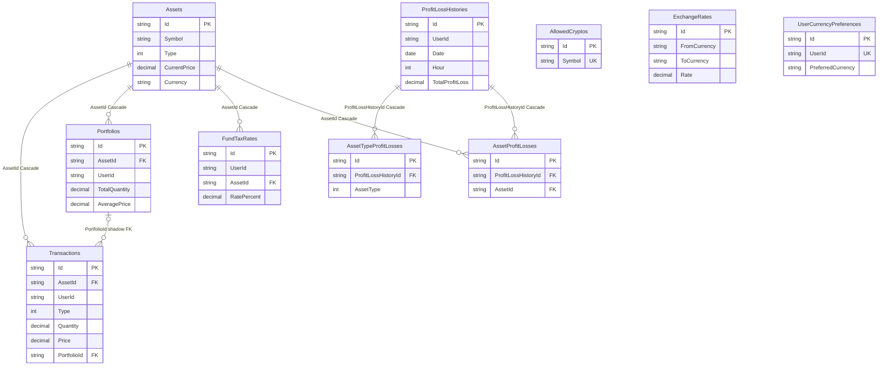

- Tekillikler: (Symbol, Type) `:46`, `AllowedCryptos.Symbol` `:57`, (UserId, AssetId) portföy `:89`, (FromCurrency, ToCurrency) `:156`, `UserCurrencyPreferences.UserId` `:165`, (UserId, AssetId) fon vergi oranı `:181`.
- `AssetType` için geriye uyumlu value converter: eski `3` (Gold/Silver) değeri `PreciousMetals`'a normalize edilir (`:29-34`).
- `Portfolio.Transactions` koleksiyonunun karşılığı olan FK alanı yoktur. EF `Transactions`'a gölge `PortfolioId` ekler (snapshot `finance-api/finance-api/Migrations/FinanceDbContextModelSnapshot.cs:539`, `:559`, `:653`).
- `HasData` seed'leri: `AllowedCryptos` `:218`, `Assets` `:246`.
- Açılışta `MigrateAsync()` çağrılır, ama hata **yutulur** ve uygulama devam eder (`finance-api/finance-api/Program.cs:120-133`). Diğer servislerin fail-fast davranışından farklıdır ([Ayrı issue adayları](#ayrı-issue-adayları)).

## 10. `keycloak` DB ve Hangfire şeması

- **keycloak:** Keycloak kendi şemasını yönetir. EF ile ilgisi yoktur. Bağlantı env'leri:
  - Aspire: `KC_DB=postgres`, host/port Aspire endpoint'inden, `KC_DB_URL_DATABASE=keycloak`, kullanıcı/parola AppHost parametreleri (`AppHost/AppHost.cs:336-345`).
  - Compose: `docker-compose.yml:431-435`.
  - Prod: `deploy/docker-compose.prod.yml:128-132`.
  
  Realm importu için [02-ortam-kurulumu.md](02-ortam-kurulumu.md) ve [05-kimlik-yetki.md](05-kimlik-yetki.md).
- **Hangfire (worksheet DB içinde ayrı şema):** exam API Hangfire storage'ı aynı `DefaultConnection` üzerinde `hangfire` şemasına koyar (`api/ExamApp.Api/Program.cs:379-391`). Bu şema EF migration'larının parçası değildir. Hangfire.PostgreSql kendi tablolarını oluşturur (kütüphane varsayılanı `PrepareSchemaIfNecessary`. Kodda açıkça set edilmediği için davranış kütüphane varsayılanına dayanır, sürüm bazında **Doğrulanmadı**). `WorksheetReminders.HangfireJobId` bu job'lara referans verir. BadgeService Hangfire kullanmaz (`Services/BadgeService/Program.cs:127`).

## 11. Migration'lar: üretme, uygulama, koruma

### 11.1 Hangi projede

| Context | Migration dizini | `dotnet ef` çalıştırılacak dizin | EF paketleri |
|---|---|---|---|
| worksheet `AppDbContext` | `api/ExamApp.Api/Migrations/` | `api/ExamApp.Api/` | `api/ExamApp.Api/ExamApp.Api.csproj:16`, `:25`, `:36` (EF Core 10.0.11, Npgsql 10.0.3; snapshot `ProductVersion` 10.0.11 — `AppDbContextModelSnapshot.cs:20`) |
| identity `AppDbContext` | `auth-api/Migrations/` | `auth-api/` | `auth-api/ExamApp.Api.csproj:23`, `:39` |
| `BadgeDbContext` | `Services/BadgeService/Migrations/` | `Services/BadgeService/` | `Services/BadgeService/BadgeService.csproj:21`, `:25` |
| `FinanceDbContext` | `finance-api/finance-api/Migrations/` | `finance-api/finance-api/` | `finance-api/finance-api/finance-api.csproj:16-17` |
| OutboxPublisher `AppDbContext` | **yok** | — (migration üretilmez) | `Design` paketi referanslı (`Services/OutboxPublisher/OutboxPublisherService.csproj:14`), ama kullanılmaz |

Her proje tek bir context içerir, startup project ile migrations project aynıdır. Bu yüzden `--project`/`--startup-project`/`--context` vermek gerekmez. Repoda `IDesignTimeDbContextFactory` yoktur. `dotnet ef`, uygulamanın host'unu (`Program.cs`) kurarak context'i ve bağlantı dizesini alır. Yerel araç manifesti (`.config/dotnet-tools.json`) yoktur. `dotnet-ef` global araç olarak kurulu olmalıdır, sürümün EF 10 ile uyumlu olması gerekir.

### 11.2 Nasıl üretilir

Resmî prosedür [../../.claude/skills/ef-migration/SKILL.md](../../.claude/skills/ef-migration/SKILL.md) ve [../../.claude/rules/workflow-rules.md](../../.claude/rules/workflow-rules.md) (`:7-14`). Komutlar exam API için yazılmıştır, diğer context'ler için kendi dizinlerinden aynı komutlar çalıştırılır:

```bash
cd api/ExamApp.Api               # veya auth-api / Services/BadgeService / finance-api/finance-api
dotnet ef migrations add <AnlamliAd>
dotnet ef database update        # isteğe bağlı: servis zaten açılışta migrate eder
dotnet ef migrations remove      # yalnızca henüz uygulanmamış son migration
```

Bağlantı dizesi notu: `appsettings.json`'daki varsayılan host compose ağ adıdır (`exam_pg_container`, `api/ExamApp.Api/appsettings.json:9`). Host makineden `database update` çalıştırırken bu ad çözülmeyebilir. Bu durumda `--connection "<dizi>"` verin ya da `ConnectionStrings__DefaultConnection` env'ini ayarlayın. Compose'ta host portu 5433'tür. Aspire'da port dinamiktir, dashboard'dan alınır. `migrations add` DB'ye bağlanmadığı için bu sorunu yaşamaz.

### 11.3 Migration'lar nasıl uygulanır

Ayrı bir migration servisi/job'ı **yoktur**. Her servis açılışta kendi context'ini migrate eder:

| Servis | Kanıt | Davranış |
|---|---|---|
| exam API | `api/ExamApp.Api/Program.cs:485-503` | `context.Database.Migrate()`. Hata olursa `LogCritical` ve `throw`, servis başlamaz (fail-fast). Ardından `ReferenceDataSeed` çalışır, hatası servisi durdurmaz (`:506-521`). Seed komut modunda `--no-migrate` ile atlanır (`:482-483`, `SeedCommands`) |
| auth-api | `auth-api/Program.cs:232-245` | `Database.Migrate()`, fail-fast |
| BadgeService | `Services/BadgeService/Program.cs:291-297` | `await MigrateAsync()` ve `BadgeSeeder.SeedAsync`. Try/catch yok, hata süreci düşürür |
| finance-api | `finance-api/finance-api/Program.cs:120-133` | `MigrateAsync()`, hata yalnızca `Console.WriteLine` ile yazılır, uygulama devam eder |
| OutboxPublisher (×3) | — | Migrate etmez. Tablo, üretici servisin migration'ıyla gelir |

exam API'deki yorum yaklaşımı açıklar: "prod-safe default for single-instance deployments" (`api/ExamApp.Api/Program.cs:485`). Birden fazla instance aynı anda açılırsa migration yarışı olur. EF Core 9+ migration kilidi bunu karşılar mı, **Doğrulanmadı**. Ölçeklemede `.claude/skills/efcore-patterns/SKILL.md`'deki "dedicated migration service" deseni önerilir (skill'in kendi bağlantısı, `SKILL.md:46-47`).

### 11.4 `ef-migration` skill'i ve `protect-migrations.sh` hook'u

- **Skill** (`.claude/skills/ef-migration/SKILL.md`):
  - Üretilmiş dosyalar elle düzenlenmez. Yanlış bir migration `remove` edilir, entity düzeltilir, yeniden `add` edilir (`:19-20`).
  - Tek istisna: issue gerektiriyorsa `Up()` başına doğrulama/backfill için `migrationBuilder.Sql(...)` eklenebilir. İhlal eden satır varsa `RAISE EXCEPTION` ile durulur, veri sessizce değiştirilmez. Üretilen çağrılar, Designer ve snapshot değiştirilmez (`:21-24`). Emsaller: `20260923231622_AddUniqueActiveUserIdToTeachersAndStudents` (#259), `20261005124021_AddAvailabilitySlotDurationCheckConstraints` (#323).
  - İsimler ne yaptığını anlatmalı, `Update1`/`Fix` yasak (`:25-26`). Eski migration'lar bu kuralı çiğner, örn. `newdb`, `makesubjectnullable_2`, finance `precious-met-type`.
  - Uygulanmış migration `remove` edilmez, geri almak için yeni migration yazılır (`:27`).
  - Yıkıcı değişiklik (kolon silme, tip daraltma, rename) için onay alınır ve iki adımlı geçiş yapılır (`:29-35`). Kontrol listesi `:37-42`.
- **Hook** (`.claude/hooks/protect-migrations.sh`): `.claude/settings.json:5-13` içinde `PreToolUse`, `Edit|Write` matcher'ıyla bağlıdır. Yolu `*/Migrations/*.cs` kalıbına uyan her dosyada (Designer ve `ModelSnapshot` dahil, **tüm projelerde**) Claude ajanının Edit/Write'ını `exit 2` ile bloklar (`protect-migrations.sh:17-22`). Yalnızca Claude Code araç çağrılarını etkiler, insan editörünü ya da `dotnet ef`'i engellemez. Skill'deki "Up() başına Sql ekleme" istisnasını uygulamak için de hook engeline takılınır. İstisnanın pratikte nasıl yapıldığı (hook geçici devre dışı mı, insan mı ekliyor) **Doğrulanmadı**. Hook mesajı her projede `cd api/ExamApp.Api` önerir (`:20`).

## 12. Şemanın evrimi ve son migration'lar

**worksheet (exam API, 99 migration):**
- 2025-02 → 2025-06 çekirdek dönemi: `initial`, canvas soruları, `BaseEntityChanges`/`CurrentUserContext`, taksonomi seed'leri (`SeedDataChanges_1..8`, `SeedDataMigration`), `QuestionSubTopic`, outbox (`outboxpatternchanges`, `outbox_changes`), program adımları, kazanım tabloları.
- 2026-08/09 özellik dalgası:
  - outbox retry kolonları;
  - görünürlük eksenleri;
  - atama izni;
  - pratik oturumu;
  - login event;
  - bağımsız öğretmen;
  - okul adresi;
  - booking ve müsaitlik;
  - tekrarlayan kural;
  - admin denetim kayıtları;
  - tekil aktif kullanıcı;
  - çalışma linkleri;
  - yorumlar.

Son 10 (`ls api/ExamApp.Api/Migrations`):

| Migration | Ne yapar (ada göre, ilgili issue) |
|---|---|
| `20260924211121_AddTeacherLastRejectedAt` | Öğretmen son red zamanı |
| `20260924221147_AddAdminUserActionLogSchoolIds` | Admin aksiyon kaydına From/ToSchoolId |
| `20260924224325_AddTestInstanceQuestionsAnsweredUpdateTimeIndex` | #265 INCLUDE'lu partial index |
| `20260929190320_AddTeacherAccountSuspension` | Öğretmen hesabı askıya alma alanları |
| `20260930003404_AddWorksheetCommentsAndCommentsToggle` | #105 yorum tablosu + `CommentsEnabled` |
| `20260930125904_AddWorksheetCommentModerationAndSchoolScope` | Gizleme alanları, `AuthorSchoolId`, şikâyetler (#305) |
| `20260930141459_BackfillWorksheetCommentTeacherAuthorSchool` | Veri backfill |
| `20260930183625_AddWorksheetCommentPinSourceAndClearCrossSchoolOwnerPins` | `ResponsibleTeacherSource` (#326) + temizlik |
| `20261005124021_AddAvailabilitySlotDurationCheckConstraints` | #323 süre check constraint'leri, ön doğrulamalı |
| `20261005164942_ReplaceProgramStepOptionIconsWithMaterialSymbols` | Program sihirbazı ikon verisi |
| `20261005181929_AddDailyQuestionSets` | #99 günün soruları |

**identity (auth-api, 41 migration):** İlk ~30 migration exam API kopyasıdır. `20250622080900_UpdateRoleToString` alan tablolarını düşürür ([§6](#6-identity-db--auth-api-appdbcontext)). Son 10: `InitialProgramStepsMigration`, `UpdateProgramEntitiesWithBaseEntity`, `MakeUserProgramScheduleNotesNullable`, `newoutcometables`, `SeedDataMigration`, `TestTopicsNonMandatory`, `newdb`, `UpdateRoleToString`, `20260908075226_AddOutboxRetryColumns`, `20260913001946_AddUserPreferredLocale` (#181), `20260922125514_AddUserIsSeedData` (#217), `20260924213935_AddUserRoleUpdatedAtUtc` (#277).

**badge (BadgeService, 19 migration):**
- Başlangıç: `20250513125615_InitBadgeSchema`, ardından aggregate modeli (`aggregatemodel`, `aggraget_v2`), `AddBadgePaths`, bildirimler (`20260902184347_AddNotifications`).
- Son 10: `AddProcessedLoginAttempts`, `AddNotificationSourceTeacherApplicationId`, `AddNotificationSourceBookingId`, `AddUserLocalePreference`, `20260923030902_AddBadgeOutboxMessages` (#225), `AddNotificationSourceEventId`, `AddProcessedAnswerSubmissions` (#243), `AddAnswerPointAwardAndConcurrencyTokens` (#279), `AddBadgeDefinitionCodeAndAuditFields` (#148), `AddNotificationSourceBadgeDefinitionId` (#146), `20260930144857_AddNotificationCoalescing` (#305), `20260930152643_AddHiddenCommentTombstoneAndNotificationIndexes` (#326).

**finance_db (6 migration, hepsi):** `20250702194453_InitialCreate`, `AddProfitLossHistory`, `AddProfitLossHistory2`, `20251223075654_AddAllowedCryptos`, `20260116131015_AddFundTaxRates`, `20260204111607_precious-met-type`.

## 13. Elle çalıştırılan SQL dosyaları

Hiçbiri uygulama ya da migration tarafından otomatik çalıştırılmaz. Bunlar geliştiricinin psql/pgAdmin'de elle çalıştırdığı **worksheet DB** betikleridir. Tablo adları EF'in tırnaklı PascalCase adlarıdır.

| Dosya | Ne yapar |
|---|---|
| `api/scripts.sql` | Konu/alt konu ekleme şablonu. `v_topic_name`, `v_subtopic_name`, `v_grade_name`, `v_subject_name` girilir (`:3-7`). `GradeSubjects` üzerinden ders ve sınıf Id'leri bulunur (`:16-33`). Konu yoksa `MAX(Id)+1` ile eklenir (`:44-63`). Alt konu da aynı şekilde eklenir (`:75-96`). Idempotent (önce var mı diye bakar) |
| `subject-insert.sql` (kök) | Tek seferlik: "3. Sınıf / Türkçe / Okuma" konusuna "Olayların Oluş Sırası" alt konusunu ekler (`:4-13`). `TopicId`'yi mevcut bir alt konudan türetir |
| `api/updatePassageId.sql` | Okuma parçası düzeltmesi: `PassageId`'si dolu en büyük soru Id'sini bulur, o soruyu ve `TestQuestions` bağını siler, sonraki tüm sorulara aynı `PassageId`'yi ve `ShowPassageFirst = TRUE` yazar (`:9-20`). Belirli bir içe aktarma sonrası onarım betiği gibi görünür, **koşulsuz** çalışır |
| `api/clear-script.sql` | **Yıkıcı.** Soru/test/çözüm/kitap/transfer tablolarındaki tüm satırları siler (`:2-26`). Not: `DELETE FROM public."X" CASCADE;` sözdiziminde `CASCADE` Postgres'te tablo alias'ı olarak yorumlanır, cascade anlamı taşımaz. Silme zinciri DB FK'larının kendi `ON DELETE` davranışına kalır |
| `postgres/exam-scripts.sql` | Ad hoc sorgular (bir testin doğru cevaplarını listeleme, `:1-15`) ve "Matematik Yolculuğu 3. Sınıf" kitabı için `Books` + `BookTests` + `Worksheets` oluşturan bir `DO $$` bloğu |
| `postgres/3. sınıf türkçe yolculuğu.sql`, `postgres/3. sınıf fen bilimleri yolculuğu.sql` | Aynı kalıp: kitap adı + test adları dizisi ile `Books`/`BookTests`/`Worksheets` satırları üretir (`v_grade_id INT := 3`, `v_duration := 1200`) |

Uyarılar:
- `api/scripts.sql` `Id` değerini `MAX+1` ile açıkça yazar. Kolonlar identity'dir (snapshot'ta `UseIdentityByDefaultColumn`, örn. `AppDbContextModelSnapshot.cs:148`). Açık Id ile yapılan insert, identity sequence'ı ilerletmez ve sonraki EF insert'leri çakışabilir.
- Hem `scripts.sql` hem `subject-insert.sql` `BaseEntity`'nin NOT NULL kolonlarını (`CreateTime`, `IsDeleted`) vermez. Bu kolonların DB default'u olup olmadığı **Doğrulanmadı**. Default yoksa insert başarısız olur.
- Bu betiklerin yerine admin taksonomi ekranı kullanılmalı ([§5.2](#52-taksonomi-sınıf--ders--konu--alt-konu), `TaxonomyService`).

Son değişiklik tarihleri (git log): `api/*.sql`, `subject-insert.sql` ve `postgres/*.sql` en son 2026-02-01'de ("reset student statistics") ve daha önce 2025'te değişmiştir.

## 14. Testlerde veritabanı

- Birim testleri (`tests/ExamApp.Api.Tests`) in-memory SQLite ve `EnsureCreated()` kullanır (`tests/ExamApp.Api.Tests/Support/TestDb.cs:8-26`). Migration çalışmaz. Bu yüzden Npgsql'e özel model parçaları (check constraint'ler `AppDbContext.cs:605`, `xmin` `BadgeDbContext.cs:93`, `now()` default `BadgeDbContext.cs:56`) `Database.IsNpgsql()` koşuluyla eklenir.
- Entegrasyon testleri (`tests/ExamApp.Api.IntegrationTests`) Testcontainers PostgreSQL kullanır (`tests/ExamApp.Api.IntegrationTests/Infrastructure/IntegrationApiFactory.cs:9`). Bazı testler belirli bir migration'a ileri/geri gider (`IMigrator.MigrateAsync(...)`, `tests/ExamApp.Api.IntegrationTests/AvailabilitySlotIntegrityPostgresTests.cs:474-515`). Ayrıntı için [08-gelistirme-pratikleri.md](08-gelistirme-pratikleri.md).

---

## Doğrulanmadı

1. Aspire `AddDatabase`'in bu sürümde DB'yi `CREATE DATABASE` ile kendisinin oluşturup oluşturmadığı (§2).
2. Yerel compose'ta boş volume ile `keycloak` DB'sinin nasıl oluştuğu. `postgres/init-scripts` repoda yok (§2).
3. finance-api `UserId` (string) değerinin kaynağı (§3).
4. Taksonomi `HasData` seed'lerinin modelden nasıl kaldırıldığı. Snapshot'ta `HasData` yokken neden sonraki migration'ların `DeleteData` üretmediği (§5.2).
5. Eski oyunlaştırma tablolarından (`Rewards`, `SpecialEvents`, `Leaderboards`, `StudentBadges`) hangilerinin canlı akışta kullanıldığı (§5.8).
6. Soft delete ile `Cascade` FK'ların her ilişkide beklendiği gibi davrandığı (§5.11).
7. identity `Users.KeycloakId` tekilliğinin uygulama katmanında sağlanıp sağlanmadığı. DB'de unique index yok (§6).
8. Hangfire.PostgreSql'in şemayı varsayılan olarak oluşturduğu (kütüphane varsayılanı, kodda set edilmemiş) (§10).
9. Birden fazla instance aynı anda başlarsa açılış migration'larının yarışı ve EF Core 10 migration kilidinin bunu karşılayıp karşılamadığı (§11.3).
10. Skill'deki "Up() başına Sql ekleme" istisnasının, hook her `Migrations/*.cs` düzenlemesini bloklarken pratikte nasıl uygulandığı (§11.4).
11. `api/scripts.sql` / `subject-insert.sql`'in `CreateTime`/`IsDeleted` vermeden bugün çalışıp çalışmadığı (§13).

## Ayrı issue adayları

`gh issue list --state all --search ...` ile "init-scripts", "postgres init", "keycloak database", "outbox connection string", "outbox index", "finance migration", "data-ownership", "legacy badge" arandı. Eşleşen açık ya da kapalı issue bulunmadı.

1. **Yerel compose olmayan init klasörünü bağlıyor.** `docker-compose.yml:296` `./postgres/init-scripts`'i `/docker-entrypoint-initdb.d`'ye bağlar, ama klasör repoda yok. Keycloak DB'yi kendisi açmadığından temiz bir volume'de Keycloak'ın `keycloak` DB'sine bağlanamaması beklenir. AppHost yorumu da compose'un bu klasöre dayandığını söyler (`AppHost/AppHost.cs:27-29`). Öneri: prod'daki `deploy/postgres/init/01-create-databases.sql` benzeri bir dosya eklemek ya da mount'u ona çevirmek (yerel DB adlarıyla).
2. **Compose'taki `exam-outbox-publisher`'da bağlantı dizesi yok.** `docker-compose.yml:143-173` bloğunda `ConnectionStrings__DefaultConnection` tanımlı değil. Diğer iki publisher'da var (`:192`, `:227`). `Services/OutboxPublisher/appsettings.json` da bağlantı içermez. Çalışması yalnızca `.gitignore`'daki (`.gitignore:131`, `*.Development.json`) `appsettings.Development.json`'ın volume ile (`docker-compose.yml:163`) gelmesine bağlıdır. Temiz bir klonda worksheet outbox'ı yayınlanmaz.
3. **`docs/data-ownership.md` güncel değil.** Prod DB adlarını (`worksheet_v2`, `auth_db`), `finance_db`'yi, sahipsiz `catalog` DB'sini (`deploy/postgres/init/01-create-databases.sql:21-23`) ve identity/badge DB'lerinin de kendi `OutboxMessages` tablosu ve publisher'ı olduğunu (issue #84, #225) içermiyor.
4. **finance-api migration hatasını yutuyor.** `finance-api/finance-api/Program.cs:126-132` hata durumunda yalnızca `Console.WriteLine` yazar ve servis yanlış şemayla devam eder. Diğer servisler fail-fast (`api/ExamApp.Api/Program.cs:498-502`, `auth-api/Program.cs:240-244`).
5. **`OutboxMessages` için poll index'i yok.** Publisher her 5 sn'de `ProcessedAt IS NULL ... ORDER BY CreatedAt` sorgular (`Services/OutboxPublisher/Publishers/OutboxProcessor.cs:78-92`), ama tabloda PK dışında index yok (§8). 7 günlük retention tabloyu küçük tuttuğu için düşük öncelikli. Yüksek hacimde partial index (`WHERE "ProcessedAt" IS NULL`) düşünülebilir.
6. **Elle SQL betikleri sequence ve NOT NULL riski taşıyor.** `api/scripts.sql:44-61`, `:75-90` identity kolonlarına `MAX+1` ile açık Id yazar. Sequence ilerlemez ve sonraki uygulama insert'leri duplicate key alabilir. `subject-insert.sql:4-13` ve `scripts.sql` `CreateTime`/`IsDeleted` vermez. `api/clear-script.sql` her ortamda koşulsuz tüm içerik tablolarını siler ve `CASCADE` kelimesi alias olarak yorumlanır (§13). Öneri: betikleri kaldırmak ya da `TaxonomyService`/admin ekranına yönlendiren bir README ile işaretlemek.
7. **Kullanılmayan/eski model parçaları.** `TestPrototypes`/`TestPrototypeDetail` ve `Rewards` DbSet'leri kodda kullanılmıyor (grep 0). `Exam` sınıfı (`api/ExamApp.Api/Data/AppDbContext.cs:855-859`) ve `auth-api/Data/Book.cs` ölü kod. Worksheet DB'deki `Badge`/`StudentBadges`, BadgeService'in rozet modeliyle çakışan eski bir kavram (§5.8). Temizlik ya da en azından "legacy" işareti için aday.
8. **Migration prosedürü yalnız exam API'yi anlatıyor.** `.claude/skills/ef-migration/SKILL.md:8-15`, `.claude/rules/workflow-rules.md:7-14` ve hook mesajı (`.claude/hooks/protect-migrations.sh:20`) yalnızca `cd api/ExamApp.Api` der. auth-api, BadgeService ve finance-api'nin de kendi migration'ları var ve kendi dizinlerinden üretilmeleri gerekir (§11.1). Belge eksikliği.
