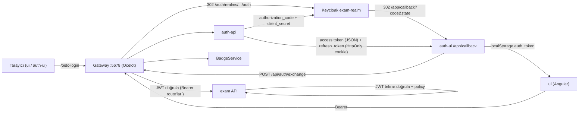
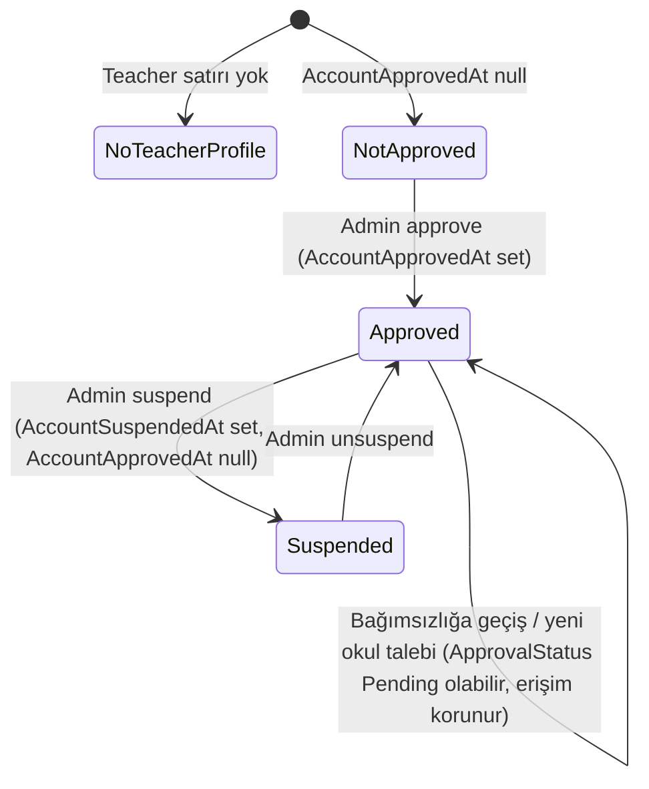
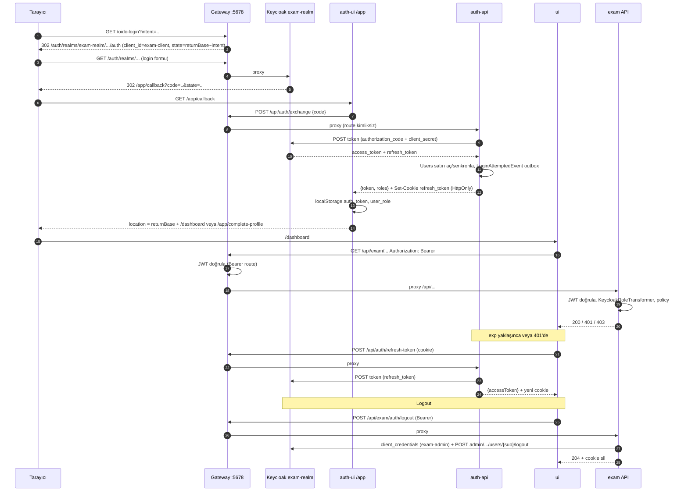
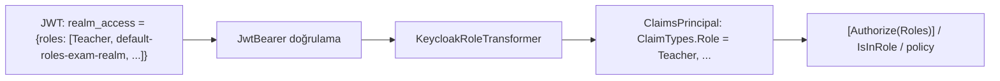
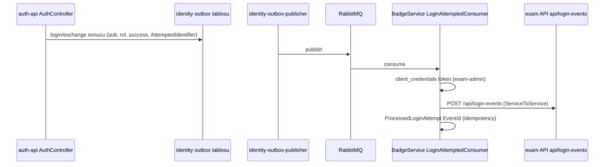

# 05 — Kimlik ve yetki (Keycloak, token akışı, rol ve policy'ler)

**Bu dosya neyi anlatır:** ExamApp'te bir kullanıcının kim olduğunun (kimlik) ve neyi yapabileceğinin (yetki) nasıl belirlendiğini uçtan uca anlatır: Keycloak `exam-realm` yapılandırması (client'lar, realm rolleri, tema), tarayıcıdan başlayan OIDC login akışı ve token'ın `auth-ui` callback'iyle `ui`'ye aktarılması, refresh/logout, gateway'deki (Ocelot) JWT doğrulaması, servislerdeki (`api`, `auth-api`, `BadgeService`) JwtBearer ayarları ve `realm_access.roles` → `ClaimTypes.Role` dönüşümü, authorization policy'leri, SignalR hub token'ı, servisler arası client-credentials çağrıları, Angular guard'ları ve uygulama içi rol ayrımları (veli, bağımsız öğretmen, öğretmen onayı/askısı). Sonunda bir yetki matrisi, doğrulanamayan noktalar ve ayrı issue adayları var.

Sistemin genel haritası için [01-sistem-haritasi.md](01-sistem-haritasi.md), ortam kurulumu (Keycloak realm importu dahil) için [02-ortam-kurulumu.md](02-ortam-kurulumu.md) ve [`../../.claude/rules/local-dev.md`](../../.claude/rules/local-dev.md), servis ayrıntıları için [03-servisler/auth-api.md](03-servisler/auth-api.md), [03-servisler/gateway.md](03-servisler/gateway.md), [03-servisler/auth-ui.md](03-servisler/auth-ui.md), [03-servisler/ui.md](03-servisler/ui.md) dosyalarına bakın. Servisler arası güvenlik sertleştirmesinin tarihçesi [`../../docs/auth-hardening.md`](../../docs/auth-hardening.md) içindedir (bu dosyada [bölüm 10](#10-docsauth-hardeningmd-ile-ilişki-ve-238-clientsecret-fail-fast)'da güncel durumla karşılaştırıldı).

## İçindekiler

1. [Özet: kimlik nerede, yetki nerede](#1-özet-kimlik-nerede-yetki-nerede)
2. [Keycloak realm: `exam-realm`](#2-keycloak-realm-exam-realm)
   - 2.1 [Realm ayarları](#21-realm-ayarları)
   - 2.2 [Client'lar](#22-clientlar)
   - 2.3 [Realm rolleri](#23-realm-rolleri)
   - 2.4 [Kullanıcılar ve servis hesabı](#24-realmde-gelen-kullanıcılar-ve-servis-hesabı)
   - 2.5 [Token içeriği (claim'ler)](#25-token-içeriği-claimler)
   - 2.6 [Realm dosyaları: dev-import ve prod import](#26-realm-dosyaları-dev-import-ve-prod-import)
   - 2.7 [Login teması (`keycloak-themes/`)](#27-login-teması-keycloak-themes)
3. [Uygulama içi roller ve ayrımlar (DB tarafı)](#3-uygulama-içi-roller-ve-ayrımlar-db-tarafı)
4. [Token akışı: login, callback, refresh, logout](#4-token-akışı-login-callback-refresh-logout)
5. [Gateway'de JWT doğrulama (Ocelot)](#5-gatewayde-jwt-doğrulama-ocelot)
6. [Servislerde JwtBearer ve rol eşleme](#6-servislerde-jwtbearer-ve-rol-eşleme)
7. [Authorization policy'leri ve kullanıldıkları yerler](#7-authorization-policyleri-ve-kullanıldıkları-yerler)
8. [SignalR hub token'ı](#8-signalr-hub-tokenı)
9. [Servisler arası çağrılarda token](#9-servisler-arası-çağrılarda-token)
10. [`docs/auth-hardening.md` ile ilişki ve #238 ClientSecret fail-fast](#10-docsauth-hardeningmd-ile-ilişki-ve-238-clientsecret-fail-fast)
11. [Login rate limiting ve `LoginAttemptedEvent`](#11-login-rate-limiting-ve-loginattemptedevent)
12. [UI guard'ları ve rol bazlı route'lar](#12-ui-guardları-ve-rol-bazlı-routelar)
13. [Yetki matrisi](#13-yetki-matrisi)
14. [Security-reviewer hafızalarından öne çıkanlar](#14-security-reviewer-hafızalarından-öne-çıkanlar)
15. [Doğrulanmadı](#15-doğrulanmadı)
16. [Ayrı issue adayları](#16-ayrı-issue-adayları)

---

## 1. Özet: kimlik nerede, yetki nerede

| Katman | Ne tutar | Nerede |
|---|---|---|
| Keycloak `exam-realm` | Kullanıcı hesabı, parola, Google IdP bağlantısı, **realm rolleri** (`Student`, `Teacher`, `Parent`, `Admin`, `exam-service`), `school_id` user attribute'u | `deploy/keycloak/dev-import/realm-export.json` (dev) |
| auth-api `identity` DB | `Users` satırı (`KeycloakId`, `Role` metni, dil tercihi) — Keycloak rolünün gecikmeli kopyası | `auth-api/Data/AppDbContext.cs:21`, `auth-api/Data/AppDbContext.cs:40` |
| exam API `worksheet` DB | `Teacher` (onay/askı/bağımsızlık), `Student`, `Parent`, `School` satırları — **uygulama içi ayrımlar burada** | `api/ExamApp.Api/Data/Teacher.cs:20`, `api/ExamApp.Api/Data/Parent.cs:6` |
| JWT (access token) | `sub`, `email`, `realm_access.roles`, `azp`, `school_id` (yalnız ipucu) | Keycloak üretir, her servis kendisi doğrular |

Temel kural: **rol kapısı JWT'deki realm rolüdür; ince ayrımlar (onaylı öğretmen mi, askıda mı, bağımsız mı, hangi okulda) DB'den çözülür.** Keycloak'ta bu ayrımlar için rol yoktur. `school_id` claim'i bile yalnızca ipucudur (`api/ExamApp.Api/Controllers/BaseController.cs:79-85`).

## 2. Keycloak realm: `exam-realm`

Kaynak dosya: `deploy/keycloak/dev-import/realm-export.json` (2782 satır, Keycloak `26.7.0` ile dışa aktarılmış görünüyor — `deploy/keycloak/dev-import/realm-export.json:2771`). Aspire bu dosyayı `WithRealmImport` ile, docker-compose `--import-realm` ile yükler (bkz. [2.6](#26-realm-dosyaları-dev-import-ve-prod-import)).

> Not: AppHost yorumu realm'in 24.x'e karşı export edildiğini ve 26.x import formatında doğrulanmadığını söylüyor (`AppHost/AppHost.cs:296-297`), oysa dosyadaki `keycloakVersion` `26.7.0`. Yorum eski olabilir.

### 2.1 Realm ayarları

| Ayar | Değer | Kaynak |
|---|---|---|
| `realm` | `exam-realm` | `deploy/keycloak/dev-import/realm-export.json:3` |
| `accessTokenLifespan` | 300 sn (5 dk) | `deploy/keycloak/dev-import/realm-export.json:10` |
| `ssoSessionIdleTimeout` / `ssoSessionMaxLifespan` | 1800 sn / 36000 sn | `deploy/keycloak/dev-import/realm-export.json:12-13` |
| `revokeRefreshToken` | `false` (refresh token rotasyonu zorunlu değil) | `deploy/keycloak/dev-import/realm-export.json:8` |
| `sslRequired` | `external` | `deploy/keycloak/dev-import/realm-export.json:31` |
| `registrationAllowed` / `registrationEmailAsUsername` | `true` / `true` | `deploy/keycloak/dev-import/realm-export.json:32-33` |
| `verifyEmail` | `false` | `deploy/keycloak/dev-import/realm-export.json:35` |
| `resetPasswordAllowed` | `true` | `deploy/keycloak/dev-import/realm-export.json:38` |
| `bruteForceProtected` | **`false`** | `deploy/keycloak/dev-import/realm-export.json:40` |
| `defaultRole` | `default-roles-exam-realm` (composite: `offline_access`, `uma_authorization`, `account` client rolleri) | `deploy/keycloak/dev-import/realm-export.json:495`, `deploy/keycloak/dev-import/realm-export.json:64` |
| `loginTheme` | `my-theme` (account/admin/email teması boş = varsayılan) | `deploy/keycloak/dev-import/realm-export.json:1835-1838` |
| `eventsEnabled` | `false` | `deploy/keycloak/dev-import/realm-export.json:1839` |
| Identity provider | `google` (`trustEmail: false`, `syncMode: IMPORT`) | `deploy/keycloak/dev-import/realm-export.json:1846-1863` |
| i18n | `internationalizationEnabled: true`, `supportedLocales` tr/en, `defaultLocale: tr` | `deploy/keycloak/dev-import/realm-export.json:2045-2050` |
| Flow'lar | `browser`, `registration`, `direct grant`, `first broker login` (stok) | `deploy/keycloak/dev-import/realm-export.json:2749-2755` |
| Parola politikası | Tanımlı değil (`passwordPolicy` anahtarı yok) | `api/ExamApp.Api/Helpers/TemporaryPasswordGenerator.cs:15` yorumu da bunu söyler |

### 2.2 Client'lar

Uygulamaya ait iki client var: **`exam-client`** (kullanıcı login'i) ve **`exam-admin`** (servis hesabı). Diğerleri Keycloak'ın stok client'larıdır.

| clientId | Tür | Flow'lar | Redirect URI / Web origin | Not | Kaynak |
|---|---|---|---|---|---|
| `exam-client` | **confidential** (`publicClient: false`, `client-secret` auth) | Standard flow (authorization code) **açık**, Direct access grants (password) **açık**, implicit kapalı, service account kapalı | `https://www.hedefokul.com/*`, `https://hedefokul.com/*`, `https://hedefokul.com/app/*`, `https://www.hedefokul.com/app/*`, `https://staging.hedefokul.com/*`, `https://staging.hedefokul.com/app/*`, `http://localhost:5678/*`; web origins aynı origin'ler | PKCE attribute'u yok; `school_id` user-attribute mapper'ı token'a `school_id` claim'i koyar; front/back-channel logout session required | `deploy/keycloak/dev-import/realm-export.json:919-978`, mapper `deploy/keycloak/dev-import/realm-export.json:983-994` |
| `exam-admin` | **confidential**, yalnız **service account** | Standard flow kapalı, direct grant kapalı, `serviceAccountsEnabled: true` | `/*` (kullanılmıyor) | Servis hesabı `service-account-exam-admin` (bkz. 2.4); `fullScopeAllowed: true`; clientHost/clientId/clientAddress session-note mapper'ları | `deploy/keycloak/dev-import/realm-export.json:813-850` |
| `account`, `account-console` | public | standard | `/realms/exam-realm/account/*` | Keycloak hesap konsolu | `deploy/keycloak/dev-import/realm-export.json:624`, `:670` |
| `admin-cli` | public | direct grant | — | stok | `deploy/keycloak/dev-import/realm-export.json:727` |
| `broker`, `realm-management` | bearer-only | — | — | stok (secret maskeli `**********`) | `deploy/keycloak/dev-import/realm-export.json:770`, `:1016` |
| `security-admin-console` | public, PKCE S256 | standard | `/admin/exam-realm/console/*` | stok | `deploy/keycloak/dev-import/realm-export.json:1059` |

**Secret'lar:** `exam-client` ve `exam-admin` için dev-only secret değerleri realm-export'un ilgili client bloğundaki `secret` alanında (`deploy/keycloak/dev-import/realm-export.json:929` ve `:823`) ve aynı değerler `.env.example` içindeki `KEYCLOAK_CLIENT_SECRET` / `KEYCLOAK_ADMIN_CLIENT_SECRET` anahtarlarında ve `AppHost/appsettings.json` → `Parameters` → `keycloak-client-secret` / `keycloak-admin-client-secret` anahtarlarında durur. İkisi eşleşmezse login ve servis token istekleri `invalid_client` ile düşer ([`../../.claude/rules/local-dev.md`](../../.claude/rules/local-dev.md) "Issue #238" bölümü). Değerler burada yazılmaz.

Servis tarafında hangi client'ın kullanıldığı konfigürasyondan gelir: `Keycloak:ClientId = exam-client`, `Keycloak:AdminClientId = exam-admin`, secret'lar `""` placeholder (`auth-api/appsettings.json:45-48`, `api/ExamApp.Api/appsettings.json:95-98`).

### 2.3 Realm rolleri

| Rol | Anlamı | Kim atar | Kaynak |
|---|---|---|---|
| `Student` | Öğrenci | auth-api register / complete-profile ya da exam API `student/register` | `deploy/keycloak/dev-import/realm-export.json:103` |
| `Teacher` | Öğretmen (onaylı olup olmadığı **DB'de**) | auth-api register / complete-profile ya da exam API `teacher/register` | `deploy/keycloak/dev-import/realm-export.json:85` |
| `Parent` | Veli | auth-api register / complete-profile ya da exam API `parent/register` | `deploy/keycloak/dev-import/realm-export.json:55` |
| `Admin` | Platform yöneticisi | **Yalnız Keycloak admin konsolundan** elle (uygulamada Admin atayan uç yok; register/complete-profile allowlist'i `Student/Teacher/Parent`) | `deploy/keycloak/dev-import/realm-export.json:121`, allowlist `auth-api/Controllers/AuthController.cs:800` |
| `exam-service` | "Bu çağıran güvenilir servis" işareti | Realm import'unda `service-account-exam-admin`'e atanmış | `deploy/keycloak/dev-import/realm-export.json:130`, `:558-560` |
| `default-roles-exam-realm`, `offline_access`, `uma_authorization` | Keycloak stok | otomatik | `deploy/keycloak/dev-import/realm-export.json:64`, `:112`, `:94` |

`SuperAdmin` rolü kodda geçer (`api/ExamApp.Api/Services/Teachers/Authorization/ApprovedTeacherAuthorization.cs:38`, `api/ExamApp.Api/Controllers/QuestionTransferController.cs:352`, `api/ExamApp.Api/Services/QuestionTransfer/HangfireDashboardAuthFilter.cs:23`, `ui/src/app/services/auth.service.ts:82-83`) ama **realm-export'ta yoktur** — bkz. [Ayrı issue adayları](#16-ayrı-issue-adayları).

Uygulama rolleri **tekil** tutulur: hem auth-api hem exam API'deki `SetRoleAsync`, yeni rolü eklemeden önce kullanıcının diğer `Student/Teacher/Parent` eşlemelerini siler (exam API: `api/ExamApp.Api/Services/KeycloakService.cs:113-175`; auth-api: `auth-api/Services/KeycloakService.cs:240`, davranış `auth-api/Controllers/AuthController.cs:690-697` yorumunda). `Admin` bu temizliğe dahil değildir; Admin + Teacher gibi çift rol mümkündür.

### 2.4 Realm'de gelen kullanıcılar ve servis hesabı

| Kullanıcı | Realm rolleri | Client rolleri | Kaynak |
|---|---|---|---|
| `service-account-exam-admin` | `default-roles-exam-realm`, `exam-service` | `realm-management`: `view-realm`, `query-users`, `view-users`, `manage-users`, **`manage-realm`** | `deploy/keycloak/dev-import/realm-export.json:550-568` |
| `admin` (e-posta `admin@examapp.local`) | `default-roles-exam-realm`, `Admin` | — | `deploy/keycloak/dev-import/realm-export.json:576-596` |

`admin` kullanıcısının parolası realm-export'ta `credentials[0].value` içinde, `temporary: true` ve `requiredActions: ["UPDATE_PASSWORD"]` ile gelir (`deploy/keycloak/dev-import/realm-export.json:583-591`): ilk girişte değiştirilmesi zorunludur. Değer burada yazılmaz. Yetkili hesap denetimi için auth-api'de bir CLI vardır: `auth-api/docs/privileged-user-audit.md` (dev realm'in `admin`'i Admin rolüyle import ettiği orada da not edilmiş, `auth-api/docs/privileged-user-audit.md:119`).

Servis hesabının `realm-management` yetkileri exam API ve auth-api'nin Keycloak Admin REST çağrıları içindir: kullanıcı oluşturma, rol atama, `school_id` attribute'u yazma, hesabı disable/enable etme (#155), parola sıfırlama (#156), oturum kapatma (`users/{id}/logout`).

### 2.5 Token içeriği (claim'ler)

Kodun dayandığı claim'ler:

| Claim | Ne için | Kaynak |
|---|---|---|
| `sub` | Kullanıcı kimliği. JwtBearer'ın varsayılan inbound claim eşlemesi nedeniyle kodda `ClaimTypes.NameIdentifier` olarak okunur | `auth-api/Controllers/AuthController.cs:397`, `api/ExamApp.Api/Controllers/BaseController.cs:21` |
| `realm_access.roles` | Rol listesi; `roles` client scope'unun "realm roles" mapper'ı üretir | mapper `deploy/keycloak/dev-import/realm-export.json:1184-1203` |
| `azp` / `client_id` | Client-credentials token'ında hangi client olduğu; `ServicePrincipal` kullanır | `api/ExamApp.Foundation/Security/ServicePrincipal.cs:39` |
| `preferred_username` | Eski servis tespiti (yedek) | `api/ExamApp.Foundation/Security/ServicePrincipal.cs:44-47` |
| `aud` | Varsayılan `account` (Keycloak'ın `account` client rolleri default role'de olduğundan) — servisler bunu doğrular | `api/ExamApp.Api/Program.cs:137-138` |
| `school_id` | Kullanıcının okul id'si **ipucu**; yetki kararı DB'den | `api/ExamApp.Api/Models/Constants/ExamClaimTypes.cs:16`, `api/ExamApp.Api/Controllers/BaseController.cs:79-85` |
| `email`, `name`, `given_name`, `family_name` | auth-api'nin yerel `Users` satırını açması | `auth-api/Controllers/AuthController.cs:604-610` |

### 2.6 Realm dosyaları: dev-import ve prod import

| Yol | Kim kullanır | Git'te |
|---|---|---|
| `deploy/keycloak/dev-import/realm-export.json` | Aspire (`AppHost/AppHost.cs:331`), docker-compose override (`docker-compose.override.yml:59`) | İzlenir, yalnız dev-only secret'lar |
| `deploy/keycloak/import/` | `deploy/docker-compose.prod.yml:145` (`start --import-realm`, `deploy/docker-compose.prod.yml:123`) ve azure-vm-acr-deploy workflow'u | **Boş** tutulur (yalnız `.gitkeep`); ops gerçek prod realm'ini oraya koyar |

`--import-realm` mevcut bir realm'in üzerine tekrar yazmaz. Realm değişikliğini çalışan bir ortama taşımak için ya admin konsolundan elle uygulamak ya da Keycloak volume'unu + Postgres `keycloak` veritabanını silip yeniden import etmek gerekir ([`../../.claude/rules/local-dev.md`](../../.claude/rules/local-dev.md), [`../../docs/auth-hardening.md`](../../docs/auth-hardening.md) "Apply to a running environment").

Keycloak sürümleri: docker-compose ve prod `quay.io/keycloak/keycloak:24.0.1` (`docker-compose.yml:425`, `deploy/docker-compose.prod.yml:120`), Aspire `26.7.0` (`AppHost/AppHost.cs:298-299`).

**Issuer (iss) ve hostname:** Tüm servisler issuer'ı `{Server:BaseUrl}/realms/{Keycloak:Realm}` olarak bekler. Aspire'da `Server:BaseUrl` gateway'in sabit `:5678` adresidir (`AppHost/AppHost.cs:688-695`) ve Keycloak `KC_HOSTNAME=http://localhost:5678` ile token'ı bu issuer'la damgalar (`AppHost/AppHost.cs:734-757`). Admin konsolu Aspire'da `http://localhost:8082/admin/` (`AppHost/AppHost.cs:313`, `AppHost/AppHost.cs:765`), docker-compose'da `http://localhost:8081` (`docker-compose.yml:443`). Ayrıntı: [`../../docs/aspire-migration-decisions.md`](../../docs/aspire-migration-decisions.md) ve [02-ortam-kurulumu.md](02-ortam-kurulumu.md).

### 2.7 Login teması (`keycloak-themes/`)

İki kopya var ve **yalnız biri gerçek**:

| Dizin | Durum | Kaynak |
|---|---|---|
| `deploy/keycloak/keycloak-themes/my-theme/` | **Kullanılan tema.** Aspire (`AppHost/AppHost.cs:321`), docker-compose override (`docker-compose.override.yml:53`) ve prod (`deploy/docker-compose.prod.yml:146`) buraya bağlanır. `login/` altında kendi `login.ftl`, `template.ftl`, `error.ftl`, `login-reset-password.ftl`, `login-update-password.ftl`, `custom.css`, `messages/` var; `login/theme.properties` `parent=keycloak` (legacy tema sınıfları) | `deploy/keycloak/keycloak-themes/my-theme/login/theme.properties` |
| `keycloak-themes/my-theme/` (repo kökü) | **Eski/yetim kopya.** `login/theme.properties` `parent=keycloak.v2` + yalnız `brand.css`; hiçbir orkestrasyon bağlamıyor | AppHost yorumu `AppHost/AppHost.cs:314-317`, override yorumu `docker-compose.override.yml:47-52` (issue #186) |

Dev'de tema önbelleği kapalıdır (`KC_SPI_THEME_CACHE_*`), `.ftl`/`.properties` değişiklikleri sayfa yenilemesiyle görünür (`AppHost/AppHost.cs:322-324`, `docker-compose.override.yml:41-46`). Prod'a tema, deploy workflow'unda `deploy/keycloak/keycloak-themes/**` tar'lanıp VM'e kopyalanarak gider (`.github/workflows/azure-vm-acr-deploy.yml:442-451`).

Repo kökündeki `sync-theme.sh`, **kök kopyayı** `rsync --delete` ile `deploy/` kopyasının üzerine yazar — yani gerçek temayı yetim kopyayla ezer. Kullanmayın; bkz. [Ayrı issue adayları](#16-ayrı-issue-adayları).

## 3. Uygulama içi roller ve ayrımlar (DB tarafı)

Keycloak'ta yalnız `Student/Teacher/Parent/Admin/exam-service` vardır. Aşağıdaki ayrımların **hiçbiri Keycloak rolü değildir**:

| Ayrım | Nerede tutulur | Nasıl kullanılır | Kaynak |
|---|---|---|---|
| **Veli (Parent)** | Keycloak `Parent` rolü + exam API `Parents` tablosu (`UserId`, `Children` navigasyonu) | Kayıt: `POST api/parent/register` rolü atar, `Parent` satırını açar, refresh cookie ile yeni token alır. Bunun dışında Parent'a özel bir yetenek/uç **yok** (kodda `IsInRole("Parent")` veya `Roles = "...Parent"` geçmiyor). | `api/ExamApp.Api/Data/Parent.cs:6-15`, `api/ExamApp.Api/Controllers/ParentController.cs:33-80`, `api/ExamApp.Api/Services/Parents/ParentService.cs:22-38` |
| **Bağımsız öğretmen (independent tutor)** | `Teacher.IsIndependentTutor` (bool) + `Teacher.ApprovalStatus` | Öğrencinin tutor araması yalnız `IsIndependentTutor && ApprovalStatus == Approved` kayıtları döner; booking'de okul kapsamı yerine bağımsızlık kontrolü | `api/ExamApp.Api/Data/Teacher.cs:49-50`, `api/ExamApp.Api/Data/AppDbContext.cs:336-338`, `api/ExamApp.Api/Services/Bookings/BookingService.cs:378-384`, `api/ExamApp.Api/Controllers/TeacherController.cs:336` |
| **Öğretmen başvurusu / onayı** | `Teacher.ApprovalStatus` (`Pending/Approved/Rejected`, mevcut başvurunun durumu), `Teacher.AccountApprovedAt` (hesabın **ilk** admin onayı, asla temizlenmez), `RequestedSchoolId` (onay bekleyen okul talebi), `RejectionReason`, `LastRejectedAt` | Kayıtta Keycloak `Teacher` rolü **hemen** verilir; öğretmen özellikleri `AccountApprovedAt` dolana kadar kapalıdır (`ApprovedTeacher` policy). Admin onay/ret: `POST api/admin/teacher-applications/{id}/approve|reject` → `TeacherApprovalService.ApproveAsync/RejectAsync` | `api/ExamApp.Api/Data/Teacher.cs:13-18`, `:45`, `:59`, `:68`, `:91`, `:101`; `api/ExamApp.Api/Controllers/AdminController.cs:233`, `:247`; `api/ExamApp.Api/Services/TeacherApprovals/TeacherApprovalService.cs:286`, `:387` |
| **Öğretmen askıya alma** | `Teacher.AccountSuspendedAt`, `Teacher.AccountSuspensionReason` (`[JsonIgnore]`) | Askıdaki öğretmen `Suspended` sayılır → öğretmen özellikleri kapalı (403 `TeacherNotApproved`). Keycloak hesabının `Enabled` bayrağından (#155) bağımsızdır. `POST api/admin/teachers/{id}/suspend|unsuspend` | `api/ExamApp.Api/Data/Teacher.cs:77-87`; `api/ExamApp.Api/Controllers/AdminController.cs:528`, `:546`; `api/ExamApp.Api/Services/AdminUsers/AdminTeacherSuspensionService.cs:70`, `:356` |
| **Hesap disable/enable** | Keycloak user `enabled` | `PATCH api/admin/{teachers|students}/{id}/account-status` | `api/ExamApp.Api/Controllers/AdminController.cs:382`, `:389` |
| **Okul üyeliği** | `Teacher.SchoolId` / `Student.SchoolId` (DB) + Keycloak `school_id` attribute'u (ipucu) | Okul kapsamı kararları DB'den (`GetCurrentSchoolIdAsync`); claim ile DB uyuşmazsa DB kazanır | `api/ExamApp.Api/Controllers/BaseController.cs:79-100`, `api/ExamApp.Api/Services/AdminUsers/AdminSchoolMembershipSync.cs:23` |
| **Okul yöneticisi (school manager)** | **Yok.** Kodda okul bazlı yönetici rolü/alanı bulunmadı (`School` entity'sinde yönetici alanı yok). UI'daki `SchoolManagerComponent` (`/admin/schools`) Admin'in okul CRUD ekranıdır, bir rol değildir. | `api/ExamApp.Api/Data/School.cs:5-38`, `ui/src/app/app.routes.ts:184-187` |
| **Profil rolü (`Users.Role`)** | auth-api `Users.Role` metni; Keycloak rolünün gecikmeli kopyası (login/exchange'te ve `UserRoleChangedEvent` consumer'ında senkronlanır) | Dal kararlarında `EffectiveRole.Resolve`: profil rolü **yalnız JWT'de de varsa** kullanılır, yoksa JWT'deki rol (`Student → Teacher → Parent` sırası) | `auth-api/Data/AppDbContext.cs:40`, `api/ExamApp.Api/Helpers/EffectiveRole.cs:7-40`, `auth-api/Consumers/UserRoleChangedConsumer.cs:58`, `api/ExamApp.Api/Services/UserRoles/UserRoleChangeRecorder.cs:19` |

Onay kararının tek noktası `ApprovedTeacherGuard.CheckAsync` (`api/ExamApp.Api/Services/Teachers/ApprovedTeacherGuard.cs:53-86`):

Uygulama rolünün atanma yolları:

1. **auth-ui kayıt formu** → `POST /api/auth/register` (anonim, rate limitli) → auth-api Keycloak kullanıcısını oluşturur ve allowlist'teki rolü atar (`auth-api/Controllers/AuthController.cs:91-147`, allowlist `:108`).
2. **Keycloak'ın kendi kayıt ekranı / Google ile ilk giriş** → rolsüz kullanıcı → callback `complete-profile` ekranına gider. Bu ekran exam API'nin `student/register`, `teacher/register`, `parent/register` uçlarını çağırır (`auth-ui/src/app/services/auth.service.ts:110-124`); bu uçlar Keycloak rolünü atar ve refresh cookie ile yeni token döner (`api/ExamApp.Api/Controllers/TeacherController.cs:54-118`, `api/ExamApp.Api/Controllers/ParentController.cs:33-80`). auth-api'de ayrıca tek seferlik `POST /api/auth/complete-profile` vardır (`auth-api/Controllers/AuthController.cs:651-729`); auth-ui servisinde de tanımlı (`auth-ui/src/app/services/auth.service.ts:91`).

## 4. Token akışı: login, callback, refresh, logout

### 4.1 Login (authorization code) ve callback

1. auth-ui login sayfası açılır açılmaz `/oidc-login?ui_locales=..`'e yönlenir (`auth-ui/src/app/pages/login/login.component.ts:52-59`, `:92-97`). Kayıt linkleri `?intent=student|teacher|parent` taşır.
2. Gateway `/oidc-login`'i **Ocelot'tan önce kendi middleware'inde** yakalar ve `{Server:BaseUrl}/auth/realms/exam-realm/protocol/openid-connect/{auth|registrations}?client_id=exam-client&redirect_uri={Keycloak:RedirectUri}&response_type=code&scope=openid&state=...`'e 302 verir (`Services/Gateway/Program.cs:176-221`). `state` = `"<returnBase>"` ya da `"<returnBase>~<intent>"`; returnBase `Server:BaseUrl`'dir (`Services/Gateway/Program.cs:204-206`). PKCE (`code_challenge`) ve rastgele `state`/`nonce` **yok**.
3. Keycloak login/kayıt ekranını (`my-theme`) gösterir; başarıda `redirect_uri`'ye (`http://localhost:5678/app/callback`, `auth-api/appsettings.json:44`) `code` ve `state` ile döner. `/auth/realms/{everything}` ve `/realms/{everything}` gateway route'ları Keycloak'a proxy'ler (`Services/Gateway/ocelot.json:245`, `:263`).
4. `/app/callback` auth-ui'ye gider (`Services/Gateway/ocelot.json:295`); `CallbackComponent` `state`'i `~` ile böler, `POST /api/auth/exchange {code}` çağırır (`auth-ui/src/app/pages/callback/callback.component.ts:76-89`).
5. auth-api `ExchangeTokenAsync`: `grant_type=authorization_code`, `client_id=exam-client`, `client_secret`, aynı `redirect_uri` ile Keycloak token endpoint'ine gider (`auth-api/Services/KeycloakService.cs:142-154`). Token'ı doğrulamadan okuyup (`JwtSecurityTokenHandler.ReadJwtToken`) `sub`/`email`/rolleri çıkarır, yerel `Users` satırını açar/rolü senkronlar (`auth-api/Controllers/AuthController.cs:549-575`, `:604-643`), `LoginAttemptedEvent` yazar (`:577-580`), **refresh token'ı `refresh_token` adlı HttpOnly + Secure + SameSite=Strict cookie'ye** koyar (`:582-589`) ve gövdede `{ token, roles }` döner (`:591-597`). Rol listesinden `default-roles*`, `uma_*` ve `Keycloak:ExcludedRoles` çıkarılır (`:561-568`, `auth-api/Helpers/KeycloakSettings.cs:20-25`).
6. auth-ui token'ı `localStorage['auth_token']`, ilk rolü `localStorage['user_role']`'a yazar (`auth-ui/src/app/services/auth.service.ts:237-243`, anahtarlar `:41-43`). Hedef: Admin → `/admin/dashboard`, uygulama rolü varsa → `/dashboard`, yoksa → `/app/complete-profile[?role=intent]`; tarayıcı `window.location.href = returnBase + dest` ile yönlenir (`auth-ui/src/app/pages/callback/callback.component.ts:100-111`). auth-ui ve ui aynı origin'den (gateway `:5678`) servis edildiği için `localStorage` ortaktır; ui token'ı aynı anahtardan okur (`ui/src/app/services/auth.service.ts:46`).

> Not: `state`'in doğrulanmadan yönlendirmede kullanılması (open redirect) ve PKCE eksikliği açık issue **#347**'de takip ediliyor.

### 4.2 Password grant yolu (kullanılmıyor gibi)

`POST /api/auth/login` `exam-client` ile `grant_type=password` (`Keycloak:GrantType` varsayılanı, `auth-api/Helpers/KeycloakSettings.cs:9`) kullanır (`auth-api/Services/KeycloakService.cs:326-339`, `auth-api/Controllers/AuthController.cs:409-476`). Bu uç **refresh cookie set etmez** ve `{ token, roles }` döner. auth-ui'deki `login()` ise yanıtta `res.profile` bekler (`auth-ui/src/app/services/auth.service.ts:76-81`), ayrıca login sayfası `ngOnInit`'te formu göstermeden `/oidc-login`'e gider. Bu yüzden form yolu pratikte devre dışı; yine de `exam-client`'ta direct access grants açık kalıyor. Bkz. [Ayrı issue adayları](#16-ayrı-issue-adayları).

### 4.3 Refresh

- ui'deki `authInterceptor` her istekte token'ı okur; `exp - now < 100` sn ise önce yeniler (`ui/src/app/shared/interceptors/auth.interceptor.ts:55-78`, eşik `ui/src/app/services/auth.service.ts:312-322`). Token yoksa `logout()` çağırır (`auth.interceptor.ts:58-61`).
- `authErrorInterceptor` 401'de bir kez yeniler ve isteği tekrarlar; ikinci 401'de oturumu temizler (`ui/src/app/shared/interceptors/auth-error.interceptor.ts:38-76`).
- Yenileme tek uçuştur (single-flight): `POST /api/auth/refresh-token` + `withCredentials` (`ui/src/app/services/auth.service.ts:387-412`). auth-api cookie'deki refresh token ile `grant_type=refresh_token` yapar, yeni refresh token geldiyse cookie'yi günceller, gövdede `{ accessToken, expiresIn }` döner (`auth-api/Controllers/AuthController.cs:478-520`, `auth-api/Services/KeycloakService.cs:439-445`).
- exam API'de de aynı mantıkta bir `POST api/auth/refresh-token` vardır (`api/ExamApp.Api/Controllers/AuthController.cs:189-217`); UI bunu kullanmaz. `POST api/auth/refresh` ise token değil, Redis'teki **profil önbelleğini** tazeler (`api/ExamApp.Api/Controllers/AuthController.cs:55-67`, UI: `ui/src/app/services/auth.service.ts:324-326`).

### 4.4 Logout

- ui ve auth-ui önce `localStorage`'ı senkron temizler, sonra `POST /api/exam/auth/logout`'u elle eklenen `Authorization` başlığıyla best-effort çağırır (2 sn timeout) (`ui/src/app/services/auth.service.ts:177-198`, `auth-ui/src/app/services/auth.service.ts:132-157`).
- exam API `Logout`, servis hesabıyla Keycloak Admin REST `POST admin/realms/exam-realm/users/{sub}/logout` çağırır (`Keycloak:LogoutUrl`, `api/ExamApp.Api/appsettings.json:93`) ve `refresh_token` cookie'sini siler (`api/ExamApp.Api/Controllers/AuthController.cs:171-184`). Bu çağrı kullanıcının **tüm** Keycloak oturumlarını kapatır (tüm cihazlar). auth-api'de de aynı uç var (`auth-api/Controllers/AuthController.cs:393-406`, `auth-api/Services/KeycloakService.cs:341-357`).
- Access token 5 dk geçerli olduğundan, logout'tan sonra elde kalmış bir access token süresi dolana kadar servislerde geçerli kalır (servisler revocation/introspection yapmaz).

### 4.5 Sequence diyagramı

## 5. Gateway'de JWT doğrulama (Ocelot)

`Services/Gateway/Program.cs:86-129` tek bir `"Bearer"` JwtBearer şeması tanımlar:

- `MetadataAddress = {Keycloak:Host}/realms/{realm}/.well-known/openid-configuration` (iç adres), `Authority` ve `ValidIssuer = {Server:BaseUrl}/realms/{realm}` (public adres) (`Services/Gateway/Program.cs:89-96`).
- `Audience = "account"` (`Services/Gateway/Program.cs:91`); `RequireHttpsMetadata = false`.
- `OnMessageReceived`: `/hub/badges` ve `/hub/whiteboard` yollarında `?access_token=` query'sini token olarak kabul eder (`Services/Gateway/Program.cs:104-116`). Not: servislerdeki aynı mantığın aksine burada `Authorization` başlığı varken de query kazanır.
- `OnAuthenticationFailed` yalnız sebebi Warning olarak loglar, token'ı loglamaz (`Services/Gateway/Program.cs:119-127`).

Middleware sırası: CORS (`SignalRCors`) → `UseAuthentication/UseAuthorization` → `X-Forwarded-*` başlıklarını **üzerine yazan** middleware (`Services/Gateway/Program.cs:166-174`, auth-api rate limit'i bunun üzerine kurulu) → `/oidc-login` middleware → `UseWebSockets` → `UseHubWebSocketAuth` → Ocelot (`Services/Gateway/Program.cs:162-231`).

`UseHubWebSocketAuth` (`Services/Gateway/HubWebSocketAuthExtensions.cs:11-40`): Ocelot'un WebSocket kolu `AuthenticationOptions` uygulamadığı için, Ocelot'tan önce her WebSocket upgrade'ini yakalar; `/hub/badges` ve `/hub/whiteboard` dışını 400 ile reddeder, bu iki yolda Bearer'ı doğrular, başarısızsa challenge (401) (#311 L6).

**Route bazında kimlik doğrulama** (`ocelot.json`; `ocelot.Development.json` ve `ocelot.Production.json` aynı yapıda — yalnız downstream host adları farklı):

| Upstream | Downstream | Gateway'de Bearer | Kaynak |
|---|---|---|---|
| `/hub/whiteboard` (WS) | exam API `/hub/whiteboard` | Evet | `Services/Gateway/ocelot.json:12-19` |
| `/hub/badges` (WS) | BadgeService `/hub/badges` | Evet | `Services/Gateway/ocelot.json:30` |
| `/api/exam/{everything}` | exam API `/api/{everything}` | Evet | `Services/Gateway/ocelot.json:121` |
| `/api/badge/{everything}` | BadgeService `/api/{everything}` | Evet | `Services/Gateway/ocelot.json:173` |
| `/api/auth/{everything}` | auth-api `/api/auth/{everything}` | **Hayır** (auth-api kendi `[Authorize]`'ını uygular; login/exchange/register anonim olmalı) | `Services/Gateway/ocelot.json:95` |
| `/api/auth/dev/{everything}`, `/api/auth/users/lookup[/]` | `/__blocked/...` (bilinçli olarak var olmayan yola) | — | `Services/Gateway/ocelot.json:59`, `:71`, `:83` |
| `/api/school` (GET) | exam API | Hayır (`SchoolController` `[AllowAnonymous]`) | `Services/Gateway/ocelot.json:106` |
| `/hangfire`, `/hangfire/{everything}` | exam API | Hayır (exam API cookie + dashboard filtresi) | `Services/Gateway/ocelot.json:135`, `:154` |
| `/oidc-login`, `/token`, `/userinfo`, `/resources/*`, `/auth/realms/*`, `/realms/*` | Keycloak | Hayır | `Services/Gateway/ocelot.json:187-263` |
| `/question-detector-dev/{everything}` | question-detector | **Hayır** (servisin kendisinde de auth yok) | `Services/Gateway/ocelot.json:48` |
| `/img/{everything}` | MinIO | Hayır | `Services/Gateway/ocelot.json:279` |
| `/app/{everything}` | auth-ui | Hayır | `Services/Gateway/ocelot.json:295` |
| `/{everything}` | ui (angular-app) | Hayır | `Services/Gateway/ocelot.json:307` |

`RouteClaimsRequirement` **hiçbir route'ta kullanılmıyor** — gateway yalnız "geçerli token var mı" diye bakar, rol kararı servislerdedir. Keycloak admin REST'i (`/admin/*`) gateway'den yayınlanmaz (catch-all ui'ye düşer).

## 6. Servislerde JwtBearer ve rol eşleme

| Ayar | exam API | auth-api | BadgeService | Gateway |
|---|---|---|---|---|
| Kaynak | `api/ExamApp.Api/Program.cs:107-168` | `auth-api/Program.cs:87-113` | `Services/BadgeService/Program.cs:159-191` | `Services/Gateway/Program.cs:86-129` |
| Authority / ValidIssuer | `{Server:BaseUrl}/realms/{Keycloak:Realm}` | aynı | aynı | aynı |
| MetadataAddress | `{Keycloak:Host}/realms/{realm}/.well-known/...` | aynı | aynı | aynı |
| ValidateIssuer | `true` | `true` | `true` | `true` |
| Audience | `ValidateAudience = true`, `ValidAudiences = Keycloak:ValidAudiences ?? ["account"]` (`:137-145`) | `options.Audience = "account"` (sabit, `:97`) | `Keycloak:ValidAudiences ?? ["account"]` (`:167-174`) | `options.Audience = "account"` (`:91`) |
| RequireHttpsMetadata | `false` | `false` | `false` | `false` |
| Query token | Yalnız `/hub/whiteboard`, header yokken (`SignalRQueryToken`, `:159-166`) | Yok | Yalnız `/hub/badges`, header yokken (`:181-189`) | `/hub/badges`, `/hub/whiteboard` |
| SaveToken | `true` (`:150`, `CallerAccessToken` için) | varsayılan | varsayılan | varsayılan |
| Varsayılan şema | `smart` policy scheme: `/hangfire` → `HangfireCookie`, diğerleri JwtBearer (`:107-128`) | JwtBearer | JwtBearer | — |
| Rol dönüştürücü | `KeycloakRoleTransformer` (`:230`) | `KeycloakRoleTransformer` (`:166`) | `BadgeService.Security.KeycloakRoleTransformer` (`:197`) | yok (gerekmiyor) |

`Keycloak:ValidAudiences` ve `Keycloak:ServiceClients` hiçbir `appsettings*.json` veya compose dosyasında set edilmiyor; yani fiilen audience `account`, servis client listesi `["exam-admin"]` (ServicePrincipal varsayılanı).

**`realm_access.roles` → `ClaimTypes.Role`:** Keycloak rolleri JWT'de `realm_access` adlı tek bir JSON claim'inde gelir; ASP.NET `[Authorize(Roles=..)]` ve `IsInRole` bunu tanımaz. Her servis bir `IClaimsTransformation` ile bu JSON'u açar ve her rol için bir `ClaimTypes.Role` claim'i ekler:

- exam API: `api/ExamApp.Api/Helpers/KeycloakRoleTransformer.cs:14-50` — "total": bozuk JSON'da fırlatmaz.
- BadgeService: `Services/BadgeService/Security/KeycloakRoleTransformer.cs:26` — exam API'dekinin bilinçli kopyası (Foundation'a ASP.NET framework referansı eklememek için, dosya başı yorumu).
- auth-api: `auth-api/Helpers/KeycloakRoleTransformer.cs:5-30` — daha eski sürüm; `JsonDocument.Parse` için try/catch yok, `JsonDocument` dispose edilmiyor.

## 7. Authorization policy'leri ve kullanıldıkları yerler

### 7.1 Tanımlar

| Policy | Servis | Kural | Kaynak |
|---|---|---|---|
| `ServiceToService` | exam API | `ServicePrincipal.IsService` | `api/ExamApp.Api/Program.cs:173-175` |
| `TeacherOrService` | exam API | `IsInRole("Teacher")` veya servis | `api/ExamApp.Api/Program.cs:177-180` |
| `TeacherAdminOrService` | exam API | Teacher veya Admin veya servis | `api/ExamApp.Api/Services/Questions/QuestionOwnershipGuard.cs:13`, `:21-24` |
| `AdminOrService` | exam API | Admin veya servis | `api/ExamApp.Api/Services/Questions/QuestionOwnershipGuard.cs:16`, `:26-28` |
| `ApprovedTeacher` (`ApprovedTeacherPolicies.TeacherCapability`) | exam API | Authenticated + `ApprovedTeacherRequirement`: çağıran Teacher ise ve Admin/SuperAdmin/servis değilse, `ApprovedTeacherGuard` `Approved` dönmeli | `api/ExamApp.Api/Services/Teachers/Authorization/ApprovedTeacherAuthorization.cs:28`, `:42-57`, `:64-121`; kayıt `ApprovedTeacherAuthorizationServiceCollectionExtensions.cs:12-31` |
| `ApprovedTeacherOrStudent` (`TeacherOrStudentCapability`) | exam API | Davranış `ApprovedTeacher` ile aynı; ad, ucun öğrencilerle paylaşıldığını belgeler. Teacher+Student çift rollü onaysız öğretmen muaf değildir (security review L4) | `ApprovedTeacherAuthorization.cs:36`, `ApprovedTeacherAuthorizationServiceCollectionExtensions.cs:20-23` |
| `Service` | auth-api | `ServicePrincipal.IsService` | `auth-api/Program.cs:120-122` |
| `Service` | BadgeService | `ServicePrincipal.IsService` | `Services/BadgeService/Program.cs:203-205` |
| Rate limit policy'leri (`auth-attempts`, admin liste/hesap/parola, yorum, çalışma linki, günlük soru vb.) | auth-api / exam API | `[EnableRateLimiting]` ile | `auth-api/Helpers/AuthRateLimiting.cs:21`, `api/ExamApp.Api/Helpers/*RateLimiting.cs` |

`ServicePrincipal.IsService` (`api/ExamApp.Foundation/Security/ServicePrincipal.cs:22-48`) sırasıyla: realm rolü `exam-service` → `azp`/`client_id` `Keycloak:ServiceClients` içinde (varsayılan `exam-admin`) → eski `preferred_username` eşleşmesi (`exam-admin` / `service-account-exam-admin`).

`ApprovedTeacher` reddi, yalnız bu gereksinim yüzünden başarısız olduysa `ApprovedTeacherAuthorizationResultHandler` 403 + `{ success:false, errorCode:"TeacherNotApproved", message }` gövdesi yazar; rol eksikliğinde varsayılan gövdesiz 401/403 korunur (`api/ExamApp.Api/Services/Teachers/Authorization/ApprovedTeacherAuthorizationResultHandler.cs:17-56`). UI bunu `teacher-not-approved.interceptor.ts` ile yakalar. Rol attribute'u ile policy attribute'u **birlikte** konur (AND) — policy tek başına rol kapısı değildir (`ApprovedTeacherAuthorization.cs:17-21`).

### 7.2 Controller bazında kullanım

`BaseController` sınıf düzeyinde `[Authorize]` taşır (`api/ExamApp.Api/Controllers/BaseController.cs:17-19`); ondan türeyenler en az "kimlikli" olmayı ister.

| Controller | Sınıf düzeyi | Uç düzeyi (özet) | Kaynak |
|---|---|---|---|
| `AdminController` (`api/admin`) | `Roles = "Admin"` | admin liste uçlarında rate limit | `api/ExamApp.Api/Controllers/AdminController.cs:31-33`, `:186` |
| `ExamController` (`api/worksheet`) | `[Authorize]` (Base) | `Student`, `Student,Teacher`, `Student,Teacher,Admin`, `Teacher`, `Teacher,Admin` + `ApprovedTeacher`/`ApprovedTeacherOrStudent` | `api/ExamApp.Api/Controllers/ExamController.cs:66-842` |
| `QuestionsController` (`api/questions`) | `ApprovedTeacher` | `AuthoringRoles = "Teacher,Admin"`; sınıflandırıcı uçları `TeacherAdminOrService`; classifier-cache işaretçisi `AdminOrService` | `api/ExamApp.Api/Controllers/QuestionsController.cs:29`, `:41`, `:71`, `:198`, `:234` |
| `QuestionTransferController` | `Roles = "Teacher,Admin"` + `ApprovedTeacher` | `hangfire/login|logout`: `Teacher,Admin,SuperAdmin` | `api/ExamApp.Api/Controllers/QuestionTransferController.cs:24-26`, `:351-373` |
| `BookingController` (`api/booking`) | `[Authorize]` | slot/kural/talep yönetimi `Teacher` + `ApprovedTeacher`; talep açma/listeleme `Student`; video oturumu `Teacher,Student` + `ApprovedTeacherOrStudent` | `api/ExamApp.Api/Controllers/BookingController.cs:42-234` |
| `StudyLinksController` | `[Authorize]` | `ManagerRoles = "Admin,Teacher"` + `ApprovedTeacher`; sonuç linki `Student` | `api/ExamApp.Api/Controllers/StudyLinksController.cs:30`, `:45-135` |
| `StudyItemsController` (`api/study-pages`) | `[Authorize]` | `Teacher,Student` + `ApprovedTeacherOrStudent`; `Teacher` + `ApprovedTeacher`; bir uçta `TeacherOrService` | `api/ExamApp.Api/Controllers/StudyItemsController.cs:36-130`, `:102` |
| `WorksheetCommentsController` | `[Authorize]` | okuma `Student,Teacher,Admin`; yazma/rapor `Student,Teacher`; gizle/geri al/raporlar `Teacher,Admin`; admin rapor listesi `Admin`; hepsi `ApprovedTeacherOrStudent` | `api/ExamApp.Api/Controllers/WorksheetCommentsController.cs:41-157` |
| `TeacherController` | `[Authorize]` | `register`, `check-teacher`, `update-theme`: kimlikli; panel uçları `Teacher` + `ApprovedTeacher`; tutor arama/public profil `Student` | `api/ExamApp.Api/Controllers/TeacherController.cs:54-354` |
| `StudentController` | `[Authorize]` | `me/*` `Student`; `register` kimlikli; `lookup` `Teacher` + `ApprovedTeacher` | `api/ExamApp.Api/Controllers/StudentController.cs:78-330` |
| `ParentController` | `[Authorize]` | `register`, `check-parent` kimlikli | `api/ExamApp.Api/Controllers/ParentController.cs:33`, `:86` |
| `PracticeController` (`api/practice`) | `Roles = "Student"` | — | `api/ExamApp.Api/Controllers/PracticeController.cs:22` |
| `ProgramController` | `Roles = "Student"` (ControllerBase) | `GET steps` `[AllowAnonymous]` | `api/ExamApp.Api/Controllers/ProgramController.cs:17`, `:33-34` |
| `LeaderboardController`, `BooksController`, `SubjectController` | `[Authorize]` (Base) | — | `api/ExamApp.Api/Controllers/LeaderboardController.cs:22`, `BooksController.cs:11`, `SubjectController.cs:11` |
| `LoginEventsController` (`api/login-events`) | `ServiceToService` | `POST` | `api/ExamApp.Api/Controllers/LoginEventsController.cs:20`, `:37` |
| `SchoolController` (`api/school`) | `[AllowAnonymous]` | `GET` | `api/ExamApp.Api/Controllers/SchoolController.cs:17` |
| exam API `AuthController` | — | `refresh`, `culture`, `logout`: `[Authorize]`; `refresh-token`: anonim (cookie) | `api/ExamApp.Api/Controllers/AuthController.cs:55`, `:145`, `:171`, `:189` |
| auth-api `AuthController` | — | `refresh`, `user-profile`, `logout`, `complete-profile`, `me/locale`: `[Authorize]`; `users/lookup`: `Service`; `roles`: `Admin`; `register`/`login`/`exchange`: anonim + `auth-attempts` rate limit; `refresh-token`: anonim | `auth-api/Controllers/AuthController.cs:60-806` |
| auth-api `DevSeedController` (`api/auth/dev`) | `Service` (+ yalnız Development/Staging'de servis kayıtlı) | — | `auth-api/Controllers/DevSeedController.cs:17-19`, `auth-api/Program.cs:160-165` |
| BadgeService `ResetController` | `Service` | `DELETE users/{userId}` | `Services/BadgeService/Controllers/ResetController.cs:11`, `:21` |
| BadgeService `BadgeDefinitionsAdminController` | `Roles = "Admin"` | — | `Services/BadgeService/Controllers/BadgeDefinitionsAdminController.cs:21` |
| BadgeService `NotificationsController`, `ReportsController` | `[Authorize]` | Reports'ta `IsInRole("Admin")` kod içi dal | `Services/BadgeService/Controllers/NotificationsController.cs:18`, `ReportsController.cs:15`, `:70` |
| Hub'lar | `WhiteboardHub`: `Roles = "Teacher,Student"` + `ApprovedTeacherOrStudent`; `BadgeNotificationHub`: `[Authorize]`, Admin grubu `IsInRole("Admin")` ile | — | `api/ExamApp.Api/Hubs/WhiteboardHub.cs:48-52`, `Services/BadgeService/Hubs/BadgeNotificationHub.cs:13`, `:32-45` |

**Hangfire dashboard:** `/hangfire` istekleri `HangfireCookie` şemasıyla kimliklenir. Cookie, `POST api/question-transfer/hangfire/login` (`Teacher,Admin,SuperAdmin`) ile 30 dk'lık HttpOnly cookie olarak açılır (`api/ExamApp.Api/Controllers/QuestionTransferController.cs:349-365`, cookie ayarları `api/ExamApp.Api/Program.cs:119-128`). Production filtresi Admin/SuperAdmin'e veya hesabı **onaylı** öğretmene izin verir (`api/ExamApp.Api/Services/QuestionTransfer/HangfireDashboardAuthFilter.cs:9-41`); Development'ta kimlikli herkes (`HangfireDashboardDevAuthFilter.cs:9-14`). Pipeline: `api/ExamApp.Api/Program.cs:576-582`.

## 8. SignalR hub token'ı

WebSocket upgrade isteği `Authorization` başlığı taşıyamadığı için istemci token'ı `?access_token=` query'siyle gönderir.

| Katman | Kural | Kaynak |
|---|---|---|
| Gateway | `/hub/badges`, `/hub/whiteboard` yolunda query token'ı kabul eder; WS upgrade'i Ocelot'tan önce doğrular, diğer WS yollarını 400 ile reddeder | `Services/Gateway/Program.cs:104-116`, `Services/Gateway/HubWebSocketAuthExtensions.cs:14-36` |
| exam API | `SignalRQueryToken.Resolve`: **yalnız** `WhiteboardHub.Path` (`/hub/whiteboard`) altında ve `Authorization` başlığı **yokken** | `api/ExamApp.Api/Helpers/SignalRQueryToken.cs:11-25`, `api/ExamApp.Api/Program.cs:159-166`, `api/ExamApp.Api/Hubs/WhiteboardHub.cs:52` |
| BadgeService | Aynı desen, `/hub/badges` | `Services/BadgeService/Security/SignalRQueryToken.cs:7-13`, `Services/BadgeService/Program.cs:181-189` |

Hub içinden auth-api'ye kullanıcı adına gidilmesi gerektiğinde (ör. `ApprovedTeacher` handler'ının profil yüklemesi) token başlıkta değil query'de olduğundan `CallerAccessToken.ResolveAsync` önce JwtBearer'ın sakladığı (doğruladığı) token'ı kullanır (`SaveToken = true`), yoksa header'a düşer; cookie ile kimliklenen `/hangfire` isteğinde null döner (`api/ExamApp.Api/Helpers/CallerAccessToken.cs:25-55`, kullanım `api/ExamApp.Api/Services/AuthApiClient.cs:51-69`). Whiteboard hub ayrıca her çağrıda booking üyeliğini ve belli aralıkla öğretmen onayını DB'den yeniden doğrular (`api/ExamApp.Api/Hubs/WhiteboardHub.cs:40-45`).

## 9. Servisler arası çağrılarda token

İki desen var:

1. **Kullanıcı adına (token forward):** exam API → auth-api `GET /api/auth/user-profile`, çağıranın kendi token'ıyla (`api/ExamApp.Api/Services/AuthApiClient.cs:45-69`).
2. **Servis kimliğiyle (client credentials, `exam-admin`):** `ServiceTokenProvider` (exam API: `api/ExamApp.Api/Services/StudentReset/ServiceTokenProvider.cs:21-129`, singleton `api/ExamApp.Api/Program.cs:354`; BadgeService: `Services/BadgeService/Services/ServiceTokenProvider.cs`, `Services/BadgeService/Program.cs:116`). `{Keycloak:Host}/{Keycloak:TokenUrl}`'e `grant_type=client_credentials` ile `AdminClientId/AdminClientSecret` gönderir; bunlar boşsa `ClientId/ClientSecret`'a düşer (`ServiceTokenProvider.cs:59-66`). Token `expires_in - 30 sn`'ye kadar önbelleklenir (`:38-50`, `:121-123`).

| Çağıran → hedef | Uç | Hedefteki kapı | Kaynak |
|---|---|---|---|
| exam API → auth-api | `POST /api/auth/users/lookup` (toplu ad/e-posta) | `Service` | `api/ExamApp.Api/Services/AuthApiClient.cs:71-98`, `auth-api/Controllers/AuthController.cs:304-306` |
| exam API → auth-api | `POST /api/auth/dev/seed-users[/cleanup]` | `Service` + ortam guard'ı | `api/ExamApp.Api/Services/Teachers/Seed/AuthApiSeedClient.cs:16-38`, `auth-api/Controllers/DevSeedController.cs:19` |
| exam API → BadgeService | `DELETE /api/reset/users/{userId}` (öğrenci sıfırlama işi) | `Service` | `api/ExamApp.Api/Services/StudentReset/BadgeResetApiClient.cs:20-22`, `Services/BadgeService/Controllers/ResetController.cs:11` |
| BadgeService → exam API | `POST /api/login-events` | `ServiceToService` | `Services/BadgeService/Consumers/LoginAttemptedConsumer.cs:76-92` |
| BadgeService → exam API | soru görseli / sınıflandırma uçları | `TeacherAdminOrService`, `AdminOrService` | `Services/BadgeService/Services/GeminiQuestionClassifier.cs:55-62` |
| exam API / auth-api → Keycloak Admin REST | kullanıcı oluştur, rol ata, attribute, enable/disable, parola, logout | `realm-management` client rolleri | `api/ExamApp.Api/Services/KeycloakService.cs:118-175`, `auth-api/Services/KeycloakService.cs:102-104` |

Gateway, `/api/auth/users/lookup` ve `/api/auth/dev/*`'ı bilinçli olarak kapatır (bkz. [bölüm 5](#5-gatewayde-jwt-doğrulama-ocelot)); servisler auth-api'ye doğrudan `AuthApiBaseUrl` ile gider. `/api/login-events` ise `/api/exam/{everything}` üzerinden gateway'den erişilebilir durumdadır (kapı `ServiceToService` policy'si); `LoginEventsController`'ın "gateway'e route edilmez" yorumu (`api/ExamApp.Api/Controllers/LoginEventsController.cs:14`) bu yüzden tam doğru değil.

## 10. `docs/auth-hardening.md` ile ilişki ve #238 ClientSecret fail-fast

[`../../docs/auth-hardening.md`](../../docs/auth-hardening.md) "exam-admin god client" temizliğini anlatır. Güncel kodla karşılaştırma:

| auth-hardening.md maddesi | Güncel durum |
|---|---|
| `ServicePrincipal.IsService` Foundation'da, tek karar noktası | Geçerli: `api/ExamApp.Foundation/Security/ServicePrincipal.cs:22-48`; exam API, auth-api ve BadgeService kullanır |
| `exam-service` rolü `deploy/keycloak/import/realm-export.json`'a eklendi (`docs/auth-hardening.md:9`) | Rol var ama dosya artık **`deploy/keycloak/dev-import/`** altında (#238 sonrası taşındı); `import/` boş. Doküman yolu eski |
| Audience doğrulaması `Keycloak:ValidAudiences` (varsayılan `account`) | exam API ve BadgeService'te geçerli; auth-api ve Gateway `"account"` sabit kullanıyor |
| `ResetController` → `Service` policy | Geçerli: `Services/BadgeService/Controllers/ResetController.cs:11` |
| Kalan 1: API'ye özel audience (`exam-api`) | **Yapılmadı**: realm'de audience mapper yok, `ValidAudiences` hiçbir yerde set edilmiyor |
| Kalan 2: servis hesabını daralt (`manage-realm` kaldır) | **Yapılmadı**: `deploy/keycloak/dev-import/realm-export.json:568` hâlâ `manage-realm` |
| Kalan 3: BadgeService'e realm-rol transformer'ı (`docs/auth-hardening.md:26`) | **Yapıldı** (`Services/BadgeService/Security/KeycloakRoleTransformer.cs:26`, `Services/BadgeService/Program.cs:197`); doküman güncel değil |
| Kalan 4: `ServicePrincipal` eski yedeklerini kaldır | **Yapılmadı**: `azp` ve `preferred_username` yedekleri duruyor |

**#238 fail-fast:** `Development` dışındaki ortamlarda `Keycloak:ClientSecret` veya `Keycloak:AdminClientSecret` boşsa ya da `devOnly` önekiyle başlıyorsa servis açılışta `InvalidOperationException` fırlatır. Değerler ortam değişkeninden (`Keycloak__ClientSecret`, `Keycloak__AdminClientSecret`) gelmelidir. Üç serviste aynı blok vardır: `api/ExamApp.Api/Program.cs:87-105`, `auth-api/Program.cs:64-82`, `Services/BadgeService/Program.cs:71-91`. Gateway client secret kullanmaz. Aspire bu değerleri AppHost parametrelerinden verir (`AppHost/AppHost.cs:280-287`, `:692-694`). Ayrıntı: [`../../.claude/rules/local-dev.md`](../../.claude/rules/local-dev.md).

## 11. Login rate limiting ve `LoginAttemptedEvent`

**Rate limiting (auth-api):** `auth-attempts` adlı IP bazlı sabit pencere limiter, varsayılan 10 deneme / 60 sn, kuyruk yok, aşımda 429 + `Retry-After` (`auth-api/Helpers/AuthRateLimiting.cs:19-75`). Değerler `RateLimiting:AuthAttempts:PermitLimit|WindowSeconds` ile değişir (`:33-34`). Uygulandığı uçlar: `register`, `login`, `exchange` (`auth-api/Controllers/AuthController.cs:93`, `:410`, `:524`). `refresh-token` limitli değil. Gerçek istemci IP'si için gateway `X-Forwarded-For`'u üzerine yazar (`Services/Gateway/Program.cs:166-174`), auth-api bunu `ForwardedHeaders:KnownNetworks|KnownProxies` ile güvenir; ikisi boşsa her kaynaktan kabul eder ve Production'da açılışı durdurur (`auth-api/Helpers/AuthRateLimiting.cs:77-110`). Neden gateway'de değil: `/api/auth/{everything}` tek wildcard route (`auth-api/Helpers/AuthRateLimiting.cs:12-14`).

Keycloak'ın kendi login formu (`/auth/realms/.../login-actions/...`) bu limiter'dan geçmez ve realm'de `bruteForceProtected: false` (`deploy/keycloak/dev-import/realm-export.json:40`). Yani gerçek giriş yolunda (OIDC formu) deneme sınırı yoktur.

**`LoginAttemptedEvent` (issue #84, #100):**

- Olay sözleşmesi: `api/ExamApp.Foundation/Contracts/LoginAttemptedEvent.cs:5`.
- Yazım: `auth-api/Controllers/AuthController.cs:816-880` — outbox'a aynı DbContext ile eklenir, response'u geciktirmez; şifre/token taşınmaz. Başarısız login'de `KeycloakUserId` boş, doğrulanmamış e-posta ayrı `AttemptedIdentifier` alanında, 256 karaktere kırpılmış (`:31-34`, `:424-428`). Başarılı login/exchange'te `sub` + ilk rol (`:463-466`, `:577-580`). Başarısız exchange'te tanımlayıcı yok (`:536-539`).
- Tüketim: `Services/BadgeService/Consumers/LoginAttemptedConsumer.cs:12-31` (3 immediate retry, sonra `badge-service_error`), kayıt `Services/BadgeService/Program.cs:217`, `:253`.
- Kalıcı kayıt exam API `LoginEvent` tablosunda (`api/ExamApp.Api/Controllers/LoginEventsController.cs:12-21`). Olay akışlarının tam listesi: [06-asenkron-akislar.md](06-asenkron-akislar.md).

## 12. UI guard'ları ve rol bazlı route'lar

ui guard'ları (`ui/src/app/shared/guards/`):

| Guard | Ne yapar | Kaynak |
|---|---|---|
| `authGuard` | `isAuthenticated()` (localStorage'da token var mı) değilse `/login` | `ui/src/app/shared/guards/auth.guard.ts:7-13` |
| `roleGuard(...roles)` | Token'daki `realm_access.roles`'tan en az biri yoksa `/dashboard` | `ui/src/app/shared/guards/role.guard.ts:10-20`, rol okuma `ui/src/app/services/auth.service.ts:217-232` |
| `adminGuard` | `roleGuard('Admin')` | `ui/src/app/shared/guards/admin.guard.ts:8` |
| `studentGuard` | `roleGuard('Student')` | `ui/src/app/shared/guards/student.guard.ts:8` |
| `approvedTeacherGuard` | Teacher olup Admin/SuperAdmin olmayan ve onaysız bilinen kullanıcıyı başvuru durumu sayfasına yönlendirir; bilinmiyorsa profili bir kez yeniler; asıl kapı backend | `ui/src/app/shared/guards/approved-teacher.guard.ts:7-35` |

Guard'lar yalnız UX'tir; token istemcide decode edilir (imza doğrulanmaz). Gerçek yetki her zaman backend'dedir.

Rol bazlı route'lar (`ui/src/app/app.routes.ts`):

| Route grubu | Guard'lar | Satır |
|---|---|---|
| `dashboard`, `tests`, `tests-enhanced`, `testsolve/*`, `test/:testId` | `authGuard` + `approvedTeacherGuard` | `:60`, `:71-74`, `:92-105` |
| Başvuru durumu sayfası (`TEACHER_APPROVAL_PENDING_PATH`) | `authGuard` + `roleGuard('Teacher')` | `:63-64` |
| `exam`, `exam/:id`, `study-pages*`, `study-links`, `question-transfer`, `assignment-permission-requests`, `availability`, `booking-requests` | `authGuard` + `roleGuard('Teacher')` + `approvedTeacherGuard` | `:107-108`, `:126-143`, `:243-253` |
| `tutor-profile` | `authGuard` + `roleGuard('Teacher')` | `:215-216` |
| `programs*`, `program-create`, `study` | `authGuard` + `roleGuard('Student')` | `:109-125` |
| `practice`, `tutors`, `tutors/:id`, `my-bookings` | `authGuard` + `studentGuard` | `:207-208`, `:222-230`, `:261-262` |
| `my-calendar`, `lessons/:bookingId/video` | `authGuard` + `roleGuard('Student','Teacher')` + `approvedTeacherGuard` | `:236-237`, `:268-269` |
| `admin`, `admin/dashboard`, `admin/teacher-approvals`, `admin/teachers`, `admin/students`, `admin/schools`, `admin/badge-definitions`, `admin/comment-reports` | `authGuard` + `adminGuard` | `:150-199` |
| `question*`, `questioncanvas*`, `imageselect`, `student-profile`, `certificates`, `notifications` | yalnız `authGuard` | `:80-90`, `:98`, `:106`, `:117-121` |
| `welcome`, `privacy-policy`, `terms`, `register` | guard yok | `:35-47`, `:79` |

Parent için özel route yoktur; Parent `dashboard`'a düşer (`DashboardSwitchComponent` yalnız Teacher/değil ayrımı yapar, `ui/src/app/pages/dashboard/dashboard-switch.component.ts:25`).

auth-ui route'ları guard'sızdır: `callback`, `logout`, `register`, `login`, `complete-profile` (`auth-ui/src/app/app.routes.ts:9-22`).

## 13. Yetki matrisi

Kısaltmalar: **E** = izinli, **—** = izinsiz, **K** = koşullu (not), **Onaysız T** = Keycloak `Teacher` rolü var ama `AccountApprovedAt` boş ya da askıda.

| Yetenek | Anonim | Student | Onaysız T | Onaylı T | Parent | Admin | Servis (`exam-admin`) | Kapı (kaynak) |
|---|---|---|---|---|---|---|---|---|
| Kayıt (`/api/auth/register`), login/exchange | E | E | E | E | E | E | — | anonim + rate limit (`auth-api/Controllers/AuthController.cs:91-94`, `:409-410`, `:523-524`) |
| Rol seçimi / profil tamamlama | — | K (rol boşken) | K | K | K | — | — | `auth-api/Controllers/AuthController.cs:651-683`; exam API `*/register` |
| Okul listesi (`GET api/school`) | E | E | E | E | E | E | E | `SchoolController.cs:17` |
| Çalışma kağıdı çözme, pratik, program | — | E | — | — | — | K (bazı uçlar) | — | `Student` rolleri (`PracticeController.cs:22`, `ExamController.cs:66`) |
| Çalışma kağıdı / test oluşturma, soru bankası yazma | — | — | — | E (kendi kaydı) | — | E (hepsi) | K (sınıflandırma) | `Teacher,Admin` + `ApprovedTeacher` + sahiplik (`QuestionsController.cs:29-41`, `QuestionOwnershipGuard.cs:40-45`) |
| Çalışma linkleri / sayfaları | — | K (sonuç linki, sayfa okuma) | — | E | — | E (linkler) | K (`TeacherOrService`) | `StudyLinksController.cs:30`, `StudyItemsController.cs:102` |
| Tutor arama, booking talebi | — | E | — | — | — | — | — | `Student` (`TeacherController.cs:338-354`, `BookingController.cs:157`) |
| Slot/kural yönetimi, talep onay/ret, video oturumu | — | — | — | E | — | K (muaf, rol yoksa `Teacher` kapısına takılır) | — | `Teacher` + `ApprovedTeacher` (`BookingController.cs:42-234`) |
| Whiteboard hub | — | E (randevu üyesi) | — | E (randevu üyesi) | — | — | — | `WhiteboardHub.cs:48-49` |
| Yorum okuma / yazma | — | E | — | E | — | E (okuma) | — | `WorksheetCommentsController.cs:41-94` |
| Yorum gizle/geri al, rapor listesi | — | K (gizle) | — | E | — | E | — | `WorksheetCommentsController.cs:112-157` |
| Öğretmen başvuru onay/ret, askı, hesap disable, parola sıfırlama, okul bağlama | — | — | — | — | — | E | — | `AdminController.cs:32` |
| Okul / taksonomi CRUD | — | — | — | — | — | E | — | `AdminController.cs:87-157` |
| Rozet tanımları CRUD | — | — | — | — | — | E | — | `BadgeDefinitionsAdminController.cs:21` |
| Hangfire dashboard (prod) | — | — | — | E | — | E | — | `HangfireDashboardAuthFilter.cs:14-41` |
| Realm rol kataloğu (`GET api/auth/roles`) | — | — | — | — | — | E | — | `auth-api/Controllers/AuthController.cs:804` |
| `users/lookup`, dev seed, badge reset, `login-events` yazma | — | — | — | — | — | — | E | `Service` / `ServiceToService` |
| question-detector (`/question-detector-dev/*`) | **E** | E | E | E | E | E | E | auth yok (`Services/Gateway/ocelot.json:48`) |
| Parent'a özel yetenek | — | — | — | — | yok | — | — | kodda yok (bkz. [bölüm 3](#3-uygulama-içi-roller-ve-ayrımlar-db-tarafı)) |

Notlar: Bağımsız öğretmen yetki açısından "Onaylı T" sütunudur; farkı veri kapsamındadır (okul yerine onaylı booking'lerdeki öğrenciler, tutor aramada listelenme). Okul bazlı veri kapsamı (hangi öğrenciyi/okulu görebilir) bu tablonun dışındadır; `ISchoolAccessPolicy` ve `BaseController.GetCurrentSchoolIdAsync` üzerinden işler ([03-servisler/api.md](03-servisler/api.md)).

## 14. Security-reviewer hafızalarından öne çıkanlar

Kaynaklar: `ui/.claude/agent-memory/security-reviewer/` (yalnız practice review answer gating notu) ve ana çalışma kopyasındaki `.claude/agent-memory/security-reviewer/MEMORY.md` + ~80 inceleme notu (salt okunur okundu). Kimlik/yetkiyle ilgili kalıcı temalar:

- **Token forward ile kimlik bağlama:** forward edilen token, kimliği belirleyen token olmalı; profil önbelleği `sub`'a bağlanmalı (hafıza `gateway-hub-ws-caller-token.md`). Güncel kodda `CallerAccessToken` doğrulanmış token'ı önceliyor ve `UserProfileSubjectMismatchException` var (`api/ExamApp.Api/Services/Teachers/Authorization/ApprovedTeacherAuthorization.cs:124-130`).
- **Rol atama yarışları:** `SetRoleAsync` eskiden additive'di (rol yığılması); artık her iki serviste exclusive (`complete-profile-self-role-grant.md`, `complete-profile-two-step-split-brain.md`).
- **question-detector'da sunucu tarafı auth yok** ve gateway route'u kimliksiz (`question-detector-admin-gate-issue78.md`); hâlâ geçerli (`question-detector/main.py:169`, `:246`, `:347`, `:352` uçlarında auth yok).
- **realm-export'un prod'a gitmesi riski** (`secret-cleanup-issue238.md`): o not yazıldığında dosya `deploy/keycloak/import/` altındaydı; #238 ile `dev-import/`'a taşındı ve prod yolu boş. Prod realm'in ops tarafından ayrı yönetildiği varsayılıyor.
- **Kayıt enumeration / e-posta doğrulaması yok** (`register-enumeration-roles-issue240.md`): `verifyEmail: false` nedeniyle "kaydol + giriş yap" doğal bir oracle; yalnız rate limit var.
- **Yetkili hesap denetimi** (`privileged-user-audit-issue267.md`): CLI yalnız doğrudan rol üyelerini kontrol eder (grup/composite değil).

## 15. Doğrulanmadı

- docker-compose yolunda token `iss` değerinin servislerin beklediği `{Server:BaseUrl}/realms/exam-realm` ile nasıl eşleştiği: compose'da `KC_HOSTNAME=localhost`, `KC_HOSTNAME_PORT=8081` (`docker-compose.yml:437-438`), override `--hostname-strict=false` (`docker-compose.override.yml:36`), exam API dev appsettings'inde `Server:BaseUrl` yok. AppHost yorumu bunu "önceden var olan bir boşluk" olarak anıyor (`AppHost/AppHost.cs:745-749`). **Doğrulanmadı.**
- `default-roles-exam-realm` composite'i nedeniyle client-credentials (servis hesabı) token'ında `aud: account` bulunduğu ve servislerin `ValidAudiences=["account"]` ile bu token'ı kabul ettiği — kod çalıştığına göre öyle, ama token örneğiyle **Doğrulanmadı.**
- `ui_locales`'in Keycloak'a ulaşıp ulaşmadığı: auth-ui `/oidc-login?ui_locales=..` gönderiyor ama gateway'in `/oidc-login` middleware'i (Ocelot'tan önce çalışır) yönlendirme URL'ine `ui_locales` eklemiyor (`Services/Gateway/Program.cs:213-217`); ocelot'taki `AddQueriesToRequest` route'u (`Services/Gateway/ocelot.json:187-191`) bu yüzden devreye girmiyor gibi. Çalışma zamanında **Doğrulanmadı.**
- exam API `KeycloakService` ve auth-api `KeycloakService`'te `_http.DefaultRequestHeaders.Authorization`'ın paylaşılan `HttpClient` örneğinde set edilmesinin (`api/ExamApp.Api/Services/KeycloakService.cs:127-128`, `auth-api/Services/KeycloakService.cs:348-349`) eşzamanlı isteklerde sorun yaratıp yaratmadığı (servisler scoped; client `CreateClient()` ile örnek başına üretiliyor, auth-api `auth-api/Services/KeycloakService.cs:35`). **Doğrulanmadı.**
- Bir öğrencinin `POST api/parent/register` ile rolünü Parent'a çevirebildiği (ParentService'te mevcut öğrenci/öğretmen kaydı kontrolü yok, `api/ExamApp.Api/Services/Parents/ParentService.cs:22-38`); `TeacherService.Save`'in öğrenci kaydı olan kullanıcıyı reddettiği yorumdan biliniyor (`api/ExamApp.Api/Controllers/TeacherController.cs:97-98`) ama Parent → Teacher/Student geçişleri uçtan uca **Doğrulanmadı.**
- Prod realm'in (ops'un `deploy/keycloak/import/`'a koyduğu) içeriği ve prod'da `bruteForceProtected`, `verifyEmail`, PKCE ayarları repo dışında olduğu için **Doğrulanmadı.**

## 16. Ayrı issue adayları

`gh issue list --label security --state all` ile ve anahtar kelime aramalarıyla karşılaştırıldı (#347, #311, #333, #316 açık; #238, #240, #267, #287, #289 kapalı).

1. **Keycloak brute force koruması kapalı** — `deploy/keycloak/dev-import/realm-export.json:40` `bruteForceProtected: false`. Gerçek giriş yolu Keycloak'ın OIDC formu olduğu için auth-api'nin IP limiter'ı (`auth-api/Helpers/AuthRateLimiting.cs:62-71`) bu yolu korumaz; formdan sınırsız parola denemesi yapılabilir. Mevcut issue bulunamadı ("brute", "bruteForce" araması boş).
2. **auth-ui callback open redirect + PKCE/state yok** — `auth-ui/src/app/pages/callback/callback.component.ts:82`, `:84`, `:111`; `Services/Gateway/Program.cs:204-217`. **Zaten açık: #347.**
3. **`SuperAdmin` rolü kodda var, realm'de yok** — `api/ExamApp.Api/Services/Teachers/Authorization/ApprovedTeacherAuthorization.cs:38`, `api/ExamApp.Api/Controllers/QuestionTransferController.cs:352`, `api/ExamApp.Api/Services/QuestionTransfer/HangfireDashboardAuthFilter.cs:23`, `ui/src/app/services/auth.service.ts:83`. Ölü/yanıltıcı muafiyet; birisi Keycloak'ta bu adla rol açarsa öğretmen onay kapısını ve Hangfire filtresini sessizce atlar. Mevcut issue bulunamadı.
4. **Servis hesabı fazla yetkili ve audience geniş** (`docs/auth-hardening.md` "Remaining" 1, 2, 4) — `service-account-exam-admin` `manage-realm` taşıyor (`deploy/keycloak/dev-import/realm-export.json:568`); tüm servisler `aud=account` kabul ediyor (`api/ExamApp.Api/Program.cs:137-138`, `auth-api/Program.cs:97`, `Services/BadgeService/Program.cs:167-168`, `Services/Gateway/Program.cs:91`), yani aynı realm'deki herhangi bir client'ın kullanıcı token'ı API'lerde geçerli; `ServicePrincipal` eski `preferred_username` yedeğini koruyor (`api/ExamApp.Foundation/Security/ServicePrincipal.cs:44-47`). Ayrı issue bulunamadı ("audience", "manage-realm" aramaları; #155 kapalı ve ilgisiz).
5. **`docs/auth-hardening.md` güncel değil** — `docs/auth-hardening.md:9` eski realm yolu (`deploy/keycloak/import/`), `docs/auth-hardening.md:26` BadgeService transformer'ı "yok" diyor ama var (`Services/BadgeService/Security/KeycloakRoleTransformer.cs:26`). Dokümantasyon düzeltmesi.
6. **`sync-theme.sh` gerçek temayı yetim kopyayla eziyor** — `sync-theme.sh` `keycloak-themes/my-theme/` → `deploy/keycloak/keycloak-themes/my-theme/` `rsync --delete`; oysa AppHost ve compose kökteki kopyanın eski olduğunu söylüyor (`AppHost/AppHost.cs:314-317`, `docker-compose.override.yml:47-52`). Çalıştırılırsa özel `login.ftl`/`template.ftl` vb. silinir. Kök kopya ve script kaldırılmalı ya da yön çevrilmeli. Mevcut issue bulunamadı.
7. **Gateway query token'ı header'a rağmen kabul ediyor** — `Services/Gateway/Program.cs:107-113`, servislerdeki "yalnız header yokken" kuralından (`api/ExamApp.Api/Helpers/SignalRQueryToken.cs:20-21`) farklı. Gateway'de doğrulanan token ile backend'e iletilen header farklı olabilir (iki kimlik). Etki düşük (backend yeniden doğruluyor); tutarlılık için. Hafıza `gateway-hub-ws-caller-token.md` ile ilişkili, #311 kapsamına eklenebilir.
8. **question-detector tamamen kimliksiz** — `Services/Gateway/ocelot.json:48` `AuthenticationOptions` yok; `question-detector/main.py:169`, `:246`, `:347`, `:352` uçlarında auth yok. Herkes gateway üzerinden eğitim verisi gönderebilir (`/send-to-fix`), disk doldurabilir. Hafıza `question-detector-admin-gate-issue78.md`'de "pre-existing" olarak not edilmiş; ayrı issue bulunamadı.
9. **Ölü password-grant login yolu ve açık direct access grants** — `auth-ui/src/app/pages/login/login.component.ts:52` yanlış anahtarı (`access_token`; doğrusu `auth_token`) okuyor ve her durumda `/oidc-login`'e gidiyor; `auth-ui/src/app/services/auth.service.ts:76-81` `res.profile` bekliyor ama `auth-api/Controllers/AuthController.cs:469-475` `profile` dönmüyor ve refresh cookie set etmiyor. Kullanılmıyorsa `/api/auth/login` ve `exam-client`'ın `directAccessGrantsEnabled: true`'su (`deploy/keycloak/dev-import/realm-export.json:950`) saldırı yüzeyi olarak kalıyor (Keycloak brute force korumasının dışından parola denemesi).
10. **`ui_locales` gateway'de düşüyor (olası)** — `Services/Gateway/Program.cs:213-217` yönlendirme URL'ine gelen `ui_locales`'i eklemiyor; #186'da hedeflenen login dili seçimi yalnız tarayıcı diline kalıyor olabilir. Çalışma zamanında doğrulanmalı (bkz. [Doğrulanmadı](#15-doğrulanmadı)). Mevcut issue bulunamadı ("ui_locales" araması boş).
11. **auth-api `KeycloakRoleTransformer` "total" değil** — `auth-api/Helpers/KeycloakRoleTransformer.cs:9-25`: `realm_access` bozuksa `JsonDocument.Parse` fırlatır (her kimlikli istekte 500), `roles` dizi değilse `EnumerateArray` fırlatır, `JsonDocument` dispose edilmez. exam API/BadgeService sürümüyle (`api/ExamApp.Api/Helpers/KeycloakRoleTransformer.cs:25-47`) hizalanmalı. Düşük.
12. **Logout tüm cihazlardaki oturumları kapatıyor** — `api/ExamApp.Api/Controllers/AuthController.cs:179` → `admin/realms/exam-realm/users/{0}/logout` (`api/ExamApp.Api/appsettings.json:93`) kullanıcının bütün Keycloak oturumlarını sonlandırır; tek oturum kapatma (refresh token ile `/protocol/openid-connect/logout`) değil. Ürün kararı olabilir; ayrıca logout'tan sonra 5 dk'lık access token geçerli kalır. Düşük/tasarım.
13. **`LoginEventsController` yorumu yanlış** — `api/ExamApp.Api/Controllers/LoginEventsController.cs:14` "gateway'e route edilmez" diyor, ama `/api/exam/{everything}` (`Services/Gateway/ocelot.json:121`) bu ucu dışarı açıyor (kapı `ServiceToService` olduğundan güvenlik açığı değil). Yorum düzeltmesi.
14. **auth-ui callback'te `console.log` ile `code`/`state` loglanıyor** — `auth-ui/src/app/pages/callback/callback.component.ts:84`. **Zaten #347 kabul kriterlerinde.**
15. **Hangfire dashboard onaylı her öğretmene açık (prod)** — `api/ExamApp.Api/Services/QuestionTransfer/HangfireDashboardAuthFilter.cs:23-41`. Dashboard tüm işleri (diğer öğretmenlerin iş argümanları dahil) gösterir ve yeniden deneme/silme sağlar. #287 security review L3'te bilinçli karar; yine de veri minimizasyonu açısından Admin'e daraltma değerlendirilebilir. Mevcut ayrı issue bulunamadı.
