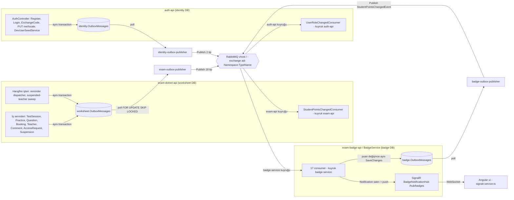
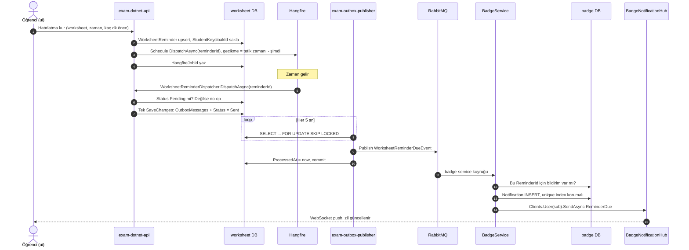
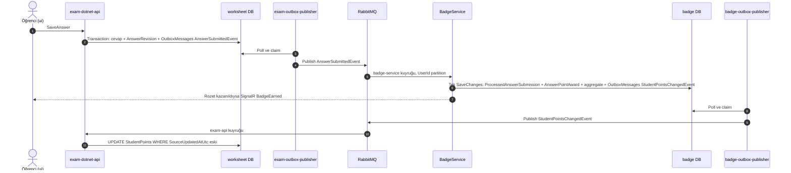

# 06 — Asenkron akışlar (outbox → RabbitMQ → consumer)

Bu dosya ExamApp'teki tüm asenkron mekanizmaları anlatır: transactional outbox deseninin uçtan uca işleyişi (event'in iş verisiyle aynı transaction'da `OutboxMessages` tablosuna yazılması → `OutboxPublisher`'ın polling'i → MassTransit publish → RabbitMQ exchange'i → consumer kuyruğu → consumer), sistemdeki **20 event'in tam kataloğu** (alanlar, yayınlayan kod, hangi publisher instance'ı, tüketen consumer, yan etki), RabbitMQ kullanıcı/izin matrisi ve izinlerin tüm event'leri kapsayıp kapsamadığının kontrolü, retry/error/`_skipped` kuyrukları, idempotency ve sıra garantileri, SignalR anlık bildirimleri, Hangfire/HostedService zamanlanmış işleri ve yeni event ekleme reçetesi. Mimari kurallar [../../.claude/rules/architecture.md](../../.claude/rules/architecture.md) ve [../../.claude/rules/workflow-rules.md](../../.claude/rules/workflow-rules.md) dosyalarındadır, RabbitMQ'nun yerel kurulumu [../../.claude/rules/local-dev.md](../../.claude/rules/local-dev.md) içindedir. Bu dosya onları tekrar etmez, kodla doğrulayıp ayrıntılandırır. Servis envanteri için [01-sistem-haritasi.md](01-sistem-haritasi.md), ortam kurulumu için [02-ortam-kurulumu.md](02-ortam-kurulumu.md), outbox publisher servisinin iç yapısı için [03-servisler/outbox-publisher.md](03-servisler/outbox-publisher.md), BadgeService için [03-servisler/badge-service.md](03-servisler/badge-service.md), akışların kullanıcı gözünden anlatımı için [07-uctan-uca-akislar.md](07-uctan-uca-akislar.md).

## İçindekiler

1. [Kısa özet ve değişmez kurallar](#1-kısa-özet-ve-değişmez-kurallar)
2. [Genel akış diyagramı](#2-genel-akış-diyagramı)
3. [Outbox hattı adım adım](#3-outbox-hattı-adım-adım)
   - 3.1 [`OutboxMessage` tablosu](#31-outboxmessage-tablosu)
   - 3.2 [Üretici: aynı transaction kuralı](#32-üretici-aynı-transaction-kuralı)
   - 3.3 [`OutboxEventRegistry`: tip adı sözleşmesi](#33-outboxeventregistry-tip-adı-sözleşmesi)
   - 3.4 [`OutboxProcessor`: polling, retry, dead-letter, temizlik](#34-outboxprocessor-polling-retry-dead-letter-temizlik)
   - 3.5 [Üç publisher instance'ı](#35-üç-publisher-instanceı)
   - 3.6 [RabbitMQ topolojisi: exchange ve kuyruk adları](#36-rabbitmq-topolojisi-exchange-ve-kuyruk-adları)
   - 3.7 [Consumer tarafı: üç receive endpoint](#37-consumer-tarafı-üç-receive-endpoint)
4. [Event kataloğu (tam liste)](#4-event-kataloğu-tam-liste)
5. [Yayıncı/tüketici eşleşme kontrolü](#5-yayıncıtüketici-eşleşme-kontrolü)
6. [RabbitMQ kullanıcıları ve izinler](#6-rabbitmq-kullanıcıları-ve-izinler)
7. [Retry, `_error` ve `_skipped` kuyrukları](#7-retry-_error-ve-_skipped-kuyrukları)
8. [Idempotency (tekrar teslimde güvenlik)](#8-idempotency-tekrar-teslimde-güvenlik)
9. [Sıra garantisi](#9-sıra-garantisi)
10. [Diğer asenkron mekanizmalar: SignalR, Hangfire, HostedService, Redis](#10-diğer-asenkron-mekanizmalar-signalr-hangfire-hostedservice-redis)
11. [Örnek sequence diyagramları](#11-örnek-sequence-diyagramları)
12. [Yeni event ekleme reçetesi](#12-yeni-event-ekleme-reçetesi)
13. [İzleme ve sorun giderme](#13-izleme-ve-sorun-giderme)
14. [Ayrı issue adayları](#14-ayrı-issue-adayları)
15. [Doğrulanmadı](#15-doğrulanmadı)

---

## 1. Kısa özet ve değişmez kurallar

- Servisler birbirine **senkron çağrıyla iş devretmez**. Async iş akışı, iş verisiyle **aynı transaction'da** yazılan bir outbox satırıyla başlar ([../../.claude/rules/workflow-rules.md](../../.claude/rules/workflow-rules.md) satır 6).
- Üç veritabanında `OutboxMessages` tablosu var: worksheet (exam API, `api/ExamApp.Api/Data/AppDbContext.cs:88`), identity (auth-api, `auth-api/Data/AppDbContext.cs:84`), badge (BadgeService, `Services/BadgeService/BadgeDbContext.cs:31`). Her biri için **aynı** `Services/OutboxPublisher` kodu ayrı bir instance olarak çalışır.
- Tüketici varsayılan olarak **BadgeService**'tir (ismi yanıltıcı, tüm bildirim/puan/sınıflandırma işleri orada). İstisna: event'in yazdığı veri başka servisin DB'sindeyse consumer o serviste olur ([../../.claude/rules/architecture.md](../../.claude/rules/architecture.md) satır 13). Bugün iki istisna var: `StudentPointsChangedEvent` → exam API, `UserRoleChangedEvent` → auth-api.
- Exam API ile OutboxPublisher'ın aynı worksheet DB'ye bağlanması bilinçlidir, "düzeltilmez" ([../../docs/data-ownership.md](../../docs/data-ownership.md) "The one shared-table relationship" bölümü).
- Mesajlaşma kütüphanesi MassTransit 8.4.1 (`Services/OutboxPublisher/OutboxPublisherService.csproj:11-12`, `Services/BadgeService/BadgeService.csproj:15-16`, `api/ExamApp.Api/ExamApp.Api.csproj:20-21`, `auth-api/ExamApp.Api.csproj:36-37`), taşıyıcı RabbitMQ, tek vhost `/` (`rabbitmq/definitions.json:58-60`).
- Teslim garantisi **en az bir kez** (at-least-once). Her consumer tekrar teslime karşı kendi idempotency kontrolünü yapar (bkz. [§8](#8-idempotency-tekrar-teslimde-güvenlik)).

## 2. Genel akış diyagramı



Not: exam-outbox-publisher'ın yetkili olduğu tip sayısı 18'dir, ama exam DB'ye fiilen 17 tip yazılır (`UserPreferredLocaleChangedEvent` izni fazlalık; bkz. [§6.3](#63-kapsama-kontrolü)).

## 3. Outbox hattı adım adım

### 3.1 `OutboxMessage` tablosu

Tek bir entity, üç DB'de aynı şemayla kullanılır: `api/ExamApp.Foundation/Persistence/OutboxMessage.cs:5-28`.

| Alan | Tip | Anlam | Kaynak |
|---|---|---|---|
| `Id` | `Guid` | Varsayılan `Guid.NewGuid()`. Bazı üreticiler bunu event'in `EventId`'si ile eşitler (AnswerSubmitted, LoginAttempted) | `OutboxMessage.cs:7` |
| `Type` | `string` | Event'in `Type.FullName`'i (namespace + sınıf, assembly yok). `OutboxEventRegistry.NameFor<T>()` ile üretilir | `OutboxMessage.cs:9-14` |
| `Content` | `string` | `System.Text.Json` ile serileştirilmiş payload | `OutboxMessage.cs:16` |
| `CreatedAt` | `DateTime` | Varsayılan `DateTime.UtcNow`. Publisher bu sütuna göre sıralar | `OutboxMessage.cs:17` |
| `ProcessedAt` | `DateTime?` | Publish başarılıysa doldurulur. `NULL` = bekliyor | `OutboxMessage.cs:18` |
| `RetryCount` | `int` | Başarısız publish denemesi sayısı | `OutboxMessage.cs:21` |
| `NextAttemptAt` | `DateTime?` | Üstel geri çekilme (backoff) sonrası en erken deneme zamanı | `OutboxMessage.cs:24` |
| `Error` | `string?` | Son hata mesajı (4000 karaktere kırpılır, `OutboxProcessor.cs:22`) | `OutboxMessage.cs:27` |

Retry/dead-letter sütunları exam DB'de `api/ExamApp.Api/Migrations/20260831120829_OutboxRetryAndDeadLetterColumns.cs` ile eklendi. Badge DB'deki tablo `Services/BadgeService/Migrations/20260923030902_AddBadgeOutboxMessages.cs` ile oluştu (dosya adı Glob ile doğrulandı, içeriği okunmadı). Identity DB tarafındaki migration: **Doğrulanmadı**. Veri modeli ayrıntısı: [04-veri-modeli.md](04-veri-modeli.md).

### 3.2 Üretici: aynı transaction kuralı

Kural: outbox satırı, iş değişikliğiyle **aynı commit**'te kalıcı olmalı. Ayrı transaction, kaybolan event demektir (`.claude/skills/outbox-event/SKILL.md:20-21`). Kodda üç geçerli desen var:

1. **Tek `SaveChanges`**: iş entity'si ve outbox satırı aynı `ChangeTracker`'a eklenip tek `SaveChangesAsync` çağrılır. EF bunu tek transaction'da yazar. Örnekler: `WorksheetReminderDispatcher.DispatchAsync` (`api/ExamApp.Api/Services/Worksheets/IWorksheetReminderDispatcher.cs:75-85`), worksheet erişim talebi onay/ret (`api/ExamApp.Api/Services/Worksheets/WorksheetAccessRequestService.cs:266-269`, `:297-300`), auth-api `PUT me/locale` (`auth-api/Controllers/AuthController.cs:781-795`), BadgeService `StudentPointsOutbox.Enqueue` (SaveChanges çağırmaz, çağıranın SaveChanges'ine katılır, `Services/BadgeService/Services/StudentPointsOutbox.cs:8-12`).
2. **Açık transaction + execution strategy + iki `SaveChanges`**: identity değeri (yeni satırın `Id`'si) event'e lazım olduğunda önce entity kaydedilir, sonra outbox eklenir, ikisi tek `BeginTransactionAsync`/`CommitAsync` içinde. Npgsql retry stratejisi açık olduğu için bu blok `Database.CreateExecutionStrategy().ExecuteAsync(...)` içinde çalışır (`api/ExamApp.Api/Program.cs:368-375` yorumu). Örnekler: `BookingService.CreateBookingAsync` (`api/ExamApp.Api/Services/Bookings/BookingService.cs:520-556`), `TeacherService.Save` (`api/ExamApp.Api/Services/TeacherService.cs:327-417`), `WorksheetCommentService` yorum ekleme (`api/ExamApp.Api/Services/Worksheets/WorksheetCommentService.cs:397-407`), auth-api `Register` (`auth-api/Controllers/AuthController.cs:162-185`).
3. **Koşullu `ExecuteUpdate` + outbox**: durum geçişi tek SQL `UPDATE ... WHERE Status = Pending` ile yapılır, etkilenen satır 0 ise rollback, değilse outbox eklenip commit. Örnekler: `BookingService.DecideAsync` (`BookingService.cs:780-807`), öğretmen askıya alma (`api/ExamApp.Api/Services/AdminUsers/AdminTeacherSuspensionService.cs:130-150`), yorum gizleme (`WorksheetCommentService.cs:585-610`).

Bilinçli istisnalar:

- `UserRoleChangedEvent` Keycloak `SetRoleAsync` **başarıyla** döndükten sonra kendi `SaveChanges`'inde yazılır, kayıt transaction'ına dahil değildir. Gerekçe ve hata senaryoları: `api/ExamApp.Api/Services/UserRoles/UserRoleChangeRecorder.cs:6-18`. Parent kaydında ise Parent satırıyla aynı `SaveChanges`'tedir (`api/ExamApp.Api/Services/Parents/ParentService.cs:31-35`).
- `LoginAttemptedEvent` yazımı hata verirse login yanıtı bozulmasın diye yutulur ve loglanır (`auth-api/Controllers/AuthController.cs:876-886`). Yani başarısız bir outbox yazımında login audit kaydı kaybolur. Bu bilinçli bir tercih.
- `TeacherApplicationDecidedEvent` başvuru sahibinin Keycloak sub'ı çözülemezse hiç yazılmaz, karar yine commit edilir (`api/ExamApp.Api/Services/TeacherApprovals/TeacherApprovalService.cs:468-471` yorum, `:349`). Askıdaki öğretmenin onayında da bastırılır (`:351-367`).
- **Kuralı çiğneyen yer:** `QuestionService.CreateOrUpdateQuestion` yeni soruyu `:311`'de, `QuestionCreatedEvent` outbox satırını `:333`'te ayrı `SaveChanges` ile yazar ve metotta açık transaction yoktur (`api/ExamApp.Api/Services/QuestionService.cs:42-335` aralığında `BeginTransaction` yok). İkinci yazım başarısız olursa soru kalır, sınıflandırma event'i kaybolur. Toplu kayıt yolu (`SaveBulkQuestion`) ise transaction içindedir (`:427`, `:839`). Bkz. [§14](#14-ayrı-issue-adayları).

### 3.3 `OutboxEventRegistry`: tip adı sözleşmesi

`api/ExamApp.Foundation/Contracts/OutboxEventRegistry.cs` yayınlanabilir event'lerin **tek listesidir** (`:17-39`, 20 tip). Kurallar:

- Üretici `Type` sütununa `OutboxEventRegistry.NameFor<TEvent>()` (= `Type.FullName`) yazar (`:44-52`). Elle string yazılmaz.
- Publisher `Resolve(storedType)` ile CLR tipine çevirir. Sırası: tam ad eşleşmesi, eski (assembly-qualified) formatın virgül öncesi kısmı, son çare `Type.GetType` (`:59-74`). `null` dönerse satır **hemen dead-letter** edilir (`Services/OutboxPublisher/Publishers/OutboxProcessor.cs:111-116`), sonsuz döngüye girmez.
- Yeni event bu listeye eklenmezse publisher onu tanımaz ve satır ilk denemede dead-letter olur. Bu nedenle registry "bir rename derleme hatası olarak görünsün" diye vardır (`OutboxEventRegistry.cs:10-13`).
- Testler: `tests/ExamApp.Foundation.Tests/Contracts/OutboxEventRegistryTests.cs` (round-trip, legacy ad, bilinmeyen tip).

Tüm contract sınıfları `ExamApp.Foundation.Contracts` namespace'indedir ve hem üretici hem tüketici aynı `ExamApp.Foundation` projesini referans alır. Bu yüzden RabbitMQ exchange adları tek bir önekle başlar (bkz. [§3.6](#36-rabbitmq-topolojisi-exchange-ve-kuyruk-adları)).

### 3.4 `OutboxProcessor`: polling, retry, dead-letter, temizlik

`Services/OutboxPublisher/Program.cs` saf bir worker'dır (HTTP endpoint yok): `AddDbContext` ile `ConnectionStrings:DefaultConnection`'a bağlanır (`:11-14`), MassTransit RabbitMQ'yu `RabbitMQ:Host/Username/Password` ile kurar (`:16-26`, port verilmez, 5672 varsayılır; AppHost portu bu yüzden sabitler, `AppHost/AppHost.cs:66-70`), `Outbox` config bölümünü bağlar ve `OutboxProcessor`'ı hosted service olarak ekler (`:28-29`). `Worker.cs` şablondan kalma, kayıtlı değil (ölü kod).

Döngü (`Services/OutboxPublisher/Publishers/OutboxProcessor.cs`):

1. `ExecuteAsync` sürekli döner. Tam batch işlendiyse beklemeden devam eder, eksik batch'te `PollInterval` kadar bekler. Beklenmeyen hata loglanır ve `PollInterval` sonra yeniden denenir (`:46-66`).
2. `ProcessBatchAsync` yeni scope + transaction açar (`:71-75`) ve şu SQL ile satır **talep eder** (`:78-91`): `ProcessedAt IS NULL AND RetryCount < MaxRetries AND (NextAttemptAt IS NULL OR NextAttemptAt <= now) ORDER BY CreatedAt LIMIT BatchSize FOR UPDATE SKIP LOCKED`. `SKIP LOCKED` sayesinde aynı DB'ye bağlı birden fazla publisher instance'ı aynı satırı almaz (`:14-18`).
3. Her satır için `TryPublishAsync`: tip çözülür, `JsonSerializer.Deserialize(Content, eventType)`, `IPublishEndpoint.Publish(event, eventType)` (`:109-132`). Başarıda `ProcessedAt = now`, `Error = null`.
4. Hata `RecordFailure`'a gider: `RetryCount++`, `Error` yazılır. `RetryCount >= MaxRetries` ise `NextAttemptAt = null` ve satır artık seçilmez (dead-letter, satır **yerinde kalır**). Değilse `NextAttemptAt = now + backoff` (`:134-153`).
5. Batch sonunda tek `SaveChangesAsync` + `CommitAsync` (`:104-105`).
6. `PurgeIfDueAsync`: `PurgeInterval`'de bir, `ProcessedAt < now - Retention` olan **işlenmiş** satırları `ExecuteDeleteAsync` ile siler (`:165-184`). Dead-letter satırları (ProcessedAt null) silinmez.

`OutboxOptions` (`Services/OutboxPublisher/Publishers/OutboxOptions.cs`, config bölümü `Outbox`, `:6`). Hiçbir ortamda (AppHost, docker-compose, `appsettings.json`) bu bölüm set edilmiyor, yani varsayılanlar geçerli (`Services/OutboxPublisher/appsettings.json` yalnız Logging içerir; AppHost ve compose'da `Outbox__` araması sonuç vermedi):

| Anahtar | Varsayılan | Kaynak |
|---|---|---|
| `Outbox:PollInterval` | 5 sn | `OutboxOptions.cs:9` |
| `Outbox:BatchSize` | 20 | `OutboxOptions.cs:12` |
| `Outbox:MaxRetries` | 10 | `OutboxOptions.cs:15` |
| `Outbox:RetryBackoffBase` | 10 sn (deneme n için 10 sn × 2^(n-1)) | `OutboxOptions.cs:18`, `:33-40` |
| `Outbox:RetryBackoffMax` | 30 dk | `OutboxOptions.cs:21` |
| `Outbox:Retention` | 7 gün (0 = temizlik kapalı) | `OutboxOptions.cs:24` |
| `Outbox:PurgeInterval` | 1 saat | `OutboxOptions.cs:27` |

Teslim semantiği: publish, DB transaction'ı commit edilmeden **önce** yapılır. Publish başarılı olup commit başarısız olursa (ya da süreç çökerse) satır tekrar seçilir ve aynı event ikinci kez yayınlanır. Bu, consumer'ların idempotent olmasını zorunlu kılan ana nedendir (`Services/BadgeService/Consumers/LoginAttemptedConsumer.cs:19-21` bunu açıkça yazar). Batch boyunca satır kilitleri RabbitMQ publish süresince tutulur. Publisher confirm davranışı MassTransit varsayılanına bırakılmıştır, kodda ayrıca ayarlanmamış (**Doğrulanmadı**: MassTransit 8.4.1'de RabbitMQ publisher confirm varsayılanının açık olduğu).

Testler: `tests/OutboxPublisher.Tests/OutboxProcessorTests.cs`, `tests/OutboxPublisher.Tests/OutboxOptionsTests.cs`, `tests/OutboxPublisher.Tests/RecordingPublishEndpoint.cs`.

### 3.5 Üç publisher instance'ı

Aynı `OutboxPublisherService` projesi üç kez çalışır; yalnızca bağlantı dizesi ve RabbitMQ kullanıcısı farklıdır.

| Instance | Okuduğu DB | RabbitMQ kullanıcısı | Aspire kaynağı | docker-compose servisi | Prod compose |
|---|---|---|---|---|---|
| `exam-outbox-publisher` | worksheet (exam API) | `exam_outbox_pub` | `AppHost/AppHost.cs:484-497` | `docker-compose.yml:143-174` | `deploy/docker-compose.prod.yml:323` |
| `identity-outbox-publisher` | identity (auth-api) | `identity_outbox_pub` | `AppHost/AppHost.cs:509-523` | `docker-compose.yml:179-210` | `deploy/docker-compose.prod.yml:355` |
| `badge-outbox-publisher` | badge (BadgeService) | `badge_outbox_pub` | `AppHost/AppHost.cs:533-550` (BadgeService'i de bekler: migration'ı o uygular) | `docker-compose.yml:216-247` | `deploy/docker-compose.prod.yml:392` |

docker-compose'daki publisher container'ları `dockerfiles/outboxpub/Dockerfile.outboxpub` ile kurulur ve `CMD ["sleep", "infinity"]` ile açılır, yani bir devcontainer'dır, uygulama içeride elle (`dotnet run` vb.) başlatılır. compose'da `exam-outbox-publisher` için `ConnectionStrings__DefaultConnection` tanımlı değil (`docker-compose.yml:151-161`), diğer ikisinde tanımlı (`:192`, `:227`). Bağlantı dizesinin nereden geldiği **Doğrulanmadı** (muhtemelen git-ignored `appsettings.Development.json`, bkz. `.gitignore`). Port ayrıntıları: [../../.claude/rules/local-dev.md](../../.claude/rules/local-dev.md) "Port map" bölümü ve [02-ortam-kurulumu.md](02-ortam-kurulumu.md).

### 3.6 RabbitMQ topolojisi: exchange ve kuyruk adları

- **Message-type exchange:** MassTransit'in varsayılan RabbitMQ entity name formatter'ı kullanılır: `<Namespace>:<TypeName>` (iki nokta, nokta değil), örn. `ExamApp.Foundation.Contracts:AnswerSubmittedEvent`. Kodda `SetEntityNameFormatter`/özel `MessageTopology` yok (repo genelinde arama sonuç vermedi; ayrıca `rabbitmq/definitions.json:70` yorumu ve [../../.claude/rules/local-dev.md](../../.claude/rules/local-dev.md) aynı şeyi söyler).
- **Publisher** yalnızca exchange'i declare eder ve publish eder, kuyruk açmaz.
- **Consumer** `ReceiveEndpoint("<ad>")` ile kendi kuyruğunu ve aynı adlı endpoint exchange'ini oluşturur, tükettiği her message-type exchange'ini endpoint exchange'ine bağlar. MassTransit ayrıca `<ad>_error` (dead-letter) ve `<ad>_skipped` (endpoint'e gelen ama consumer'ı olmayan mesaj) kuyruk/exchange'lerini kullanır. Bağlama izin semantiği `rabbitmq/definitions.json:94` yorumunda anlatılır.
- `definitions.json`'da `queues`, `exchanges`, `bindings` boştur (`rabbitmq/definitions.json:122-124`). Topolojiyi uygulamalar çalışma anında kurar.

Üç endpoint:

| Kuyruk | Sahibi | Tanım | Tükettiği event'ler |
|---|---|---|---|
| `badge-service` (+ `_error`, `_skipped`) | BadgeService | `Services/BadgeService/Program.cs:238-265` | 18 event (StudentPointsChanged ve UserRoleChanged hariç hepsi) |
| `exam-api` (+ `_error`, `_skipped`) | exam API | `api/ExamApp.Api/Program.cs:437-444` | `StudentPointsChangedEvent` |
| `auth-api` (+ `_error`, `_skipped`) | auth-api | `auth-api/Program.cs:207-214` | `UserRoleChangedEvent` |

### 3.7 Consumer tarafı: üç receive endpoint

- **BadgeService** bus'ı koşulsuz kurar (`Services/BadgeService/Program.cs:210-268`). 17 consumer sınıfı `AddConsumer` ile kaydedilir (`:212-228`; `WorksheetAccessDecisionConsumer` iki event'i karşılar, toplam 18 event). Kullanıcı adı/parola yoksa **`guest`'e düşer** (`:234-235`), diğer iki servisin aksine fail-fast değildir (bkz. [§14](#14-ayrı-issue-adayları)). Her consumer'ın `ConfigureConsumer` ile aynı endpoint'e bağlanmasını `tests/BadgeService.Tests/ProgramConsumerWiringTests.cs:25` doğrular.
- **exam API** bus'ı yalnızca `RabbitMQ:Host` tanımlıysa kurar. Production'da Host yoksa başlangıçta exception atar; Host varsa Username/Password zorunlu (`api/ExamApp.Api/Program.cs:398-446`). Host yoksa başlangıçta uyarı loglanır (`:588-592`).
- **auth-api** aynı opt-in/fail-fast desenini kullanır (`auth-api/Program.cs:173-216`, uyarı `:273-281`).
- Üç endpoint'te de `e.PublishFaults = false` (`Services/BadgeService/Program.cs:243`, `api/ExamApp.Api/Program.cs:441`, `auth-api/Program.cs:211`). Böylece consumer'lar `MassTransit:Fault...` exchange'lerine yazma izni istemez. Son hata yalnızca `_error` kuyruğuna gider, `Fault<T>` yayınlanmaz.
- Retry politikası endpoint düzeyinde değil, her consumer'ın `ConsumerDefinition`'ında tanımlıdır (bkz. [§7](#7-retry-_error-ve-_skipped-kuyrukları)).

## 4. Event kataloğu (tam liste)

Kısaltmalar: **exam-pub** = exam-outbox-publisher, **identity-pub** = identity-outbox-publisher, **badge-pub** = badge-outbox-publisher. Tüm event'ler `api/ExamApp.Foundation/Contracts/` altındadır. Consumer yolu `Services/BadgeService/Consumers/` ise yalnız dosya adı yazıldı. "SignalR" sütunundaki ad, `BadgeNotificationHub` üzerinden gönderilen istemci metodudur (bkz. [§10.1](#101-signalr-badgenotificationhub-hubbadges)).

`UserId` alanları auth-api identity DB'sindeki `Users.Id`'yi taşır: exam DB'de yerel bir `Users` tablosu yoktur (`api/ExamApp.Api/Helpers/UserRoleChangeOutbox.cs:19`, exam `AppDbContext`'te `DbSet<User>` yok). `UserRoleChangedEvent.cs`'in XML yorumu bunun tersini söylüyor (bkz. [§14](#14-ayrı-issue-adayları)).

| # | Event ve alanları | Yayınlayan (kod yeri) | Publisher | Tüketen (consumer) | Consumer ne yapar (yan etki) |
|---|---|---|---|---|---|
| 1 | **`AnswerSubmittedEvent`** (`AnswerSubmittedEvent.cs:5`): `EventId`, `UserId`, `QuestionId`, `SubjectId`, `Subject`, `TopicId`, `SubTopicId`, `TestInstanceId`, `TestInstanceQuestionId`, `ClientId` (Keycloak sub), `SelectedAnswerId`, `IsCorrect`, `QuestionPoint`, `DifficultyLevel`, `TimeTakenInSeconds`, `SubmittedAt`, `Revision` | exam API: `TestSessionService.SaveAnswer` (`api/ExamApp.Api/Services/Worksheets/TestSessionService.cs:492-499`, transaction `:455-504`, `EventId = outbox Id`); günlük sorular `PracticeSessionService.SubmitDailyAnswerAsync` (`api/ExamApp.Api/Services/Practice/PracticeSessionService.cs:448-449`, builder `:523-556`, `TestInstanceId = -sessionId` `:558`) | exam-pub | BadgeService `AnswerSubmittedConsumer` (`AnswerSubmittedConsumer.cs:37`) | `AnswerSubmissionAggregationService.ProcessAsync` ile soru/ders/günlük aggregate'leri, `AnswerPointAward`, `ProcessedAnswerSubmission` güncellenir. Puan değiştiyse aynı SaveChanges'te `StudentPointsChangedEvent` badge outbox'ına yazılır (`Services/BadgeService/Services/AnswerSubmissionAggregationService.cs:127`). Ardından `BadgeEvaluator` rozet kazanımı varsa `BadgeEarned` satırı + SignalR `BadgeEarned` (`Services/BadgeService/Services/BadgeEvaluator.cs:149`) |
| 2 | **`QuestionCreatedEvent`** (`QuestionCreatedEvent.cs:5`): `QuestionId`, `SubjectId`, `TopicId`, `ClassificationSource` ("Human"/"AI"), `CreatedAt`, `Text` | exam API: `QuestionService.CreateOrUpdateQuestion` yalnız yeni soruda (`api/ExamApp.Api/Services/QuestionService.cs:313-333`, transaction yok, bkz. §3.2); `SaveBulkQuestion` (`:826-832`, transaction içinde) | exam-pub | BadgeService `QuestionCreatedConsumer` (`QuestionCreatedConsumer.cs:8`) | `QuestionAnalyzer:AIActive` false ise (`:21`, `:31`) ya da kaynak zaten "AI" ise (`:38`) atlar. Değilse `GeminiQuestionClassifier.ClassifyAndPersistAsync` (`:46`): exam API'den görsel alır, Gemini'ye sorar, sonucu exam API'ye `PUT /api/questions/{id}/classification` ile yazar (`Services/BadgeService/Services/GeminiQuestionClassifier.cs:258-262`). Bu senkron HTTP geri yazımı eski (legacy) bir istisnadır, örnek alınmaz |
| 3 | **`WorksheetReminderDueEvent`** (`WorksheetReminderDueEvent.cs:13`): `ReminderId`, `WorksheetId`, `StudentId`, `UserId`, `UserKeycloakId`, `WorksheetName`, `ScheduledFor`, `RemindBeforeMinutes` | exam API Hangfire işi `WorksheetReminderDispatcher.DispatchAsync` (`api/ExamApp.Api/Services/Worksheets/IWorksheetReminderDispatcher.cs:42-90`), `WorksheetReminderService.UpsertAsync` tarafından zamanlanır (`api/ExamApp.Api/Services/Worksheets/WorksheetReminderService.cs:76-78`). Ayrıntı §10.3 | exam-pub | BadgeService `WorksheetReminderDueConsumer` (`WorksheetReminderDueConsumer.cs:21`) | `WorksheetReminderDue` tipinde `Notification` (alıcının diline göre metin) + SignalR `ReminderDue` (`:101`). `UserKeycloakId` boşsa satır yazılır, push atlanır |
| 4 | **`WorksheetAccessRequestedEvent`** (`WorksheetAccessRequestedEvent.cs:13`): `RequestId`, `WorksheetId`, `WorksheetName`, `RequesterUserId`, `RequesterName`, `OwnerUserId`, `TargetKeycloakId` (sahibin sub'ı), `Note`, `RequestedAt` | exam API `WorksheetAccessRequestService.CreateRequestAsync` (`api/ExamApp.Api/Services/Worksheets/WorksheetAccessRequestService.cs:140-160`) | exam-pub | BadgeService `WorksheetAccessRequestedConsumer` (`WorksheetAccessRequestedConsumer.cs:21`) | Sınav sahibine `WorksheetAccessRequested` bildirimi + SignalR `AccessRequestUpdate` (`kind=requested`, `:103`) |
| 5 | **`WorksheetAccessRequestApprovedEvent`** (`WorksheetAccessRequestApprovedEvent.cs:13`): `RequestId`, `WorksheetId`, `WorksheetName`, `RequesterUserId`, `TargetKeycloakId`, `DecidedAt` | exam API `WorksheetAccessRequestService` onay (`:266`) → `AddDecisionOutboxAsync` (`:339-394`, sub yoksa auth-api'den best-effort çözer `:343-356`) | exam-pub | BadgeService `WorksheetAccessDecisionConsumer` (`WorksheetAccessDecisionConsumer.cs:25-27`) | Talep eden öğretmene `WorksheetAccessApproved` bildirimi + SignalR `AccessRequestUpdate` (`kind=approved`, `:131`) |
| 6 | **`WorksheetAccessRequestRejectedEvent`** (`WorksheetAccessRequestRejectedEvent.cs:13`): #5 ile aynı alanlar | exam API `WorksheetAccessRequestService` ret (`:297`) → `AddDecisionOutboxAsync` | exam-pub | BadgeService `WorksheetAccessDecisionConsumer` (aynı sınıf, ikinci `Consume` overload'ı `:59-64`) | `WorksheetAccessRejected` bildirimi + `AccessRequestUpdate` (`kind=rejected`) |
| 7 | **`LoginAttemptedEvent`** (`LoginAttemptedEvent.cs:5`): `EventId`, `KeycloakUserId` (başarısızda null), `AttemptedIdentifier` (yalnız başarısızda, PII), `Role`, `OccurredAtUtc`, `Success` | auth-api `AuthController.WriteLoginAttemptedEventAsync` (`auth-api/Controllers/AuthController.cs:824-847`), `Login` (`:424`, `:463`) ve `EchangeCode` (`:536`, `:577`) içinden `TryWriteLoginAttemptedEventAsync` (`:876`) ile çağrılır | identity-pub | BadgeService `LoginAttemptedConsumer` (`LoginAttemptedConsumer.cs:31`) | Exam API'ye servis token'ıyla `POST /api/login-events` (`:92`); başarıdan sonra `ProcessedLoginAttempts` defterine `EventId` yazar (`:103`). BadgeService bu event için yalnız köprüdür, kalıcı kayıt exam API'dedir |
| 8 | **`TeacherApplicationSubmittedEvent`** (`TeacherApplicationSubmittedEvent.cs:15`): `TeacherId`, `UserId`, `ApplicantName`, `SubmittedAt` | exam API `TeacherService.Save`, öğretmen bağımsız (özel ders) öğretmen olunca (`api/ExamApp.Api/Services/TeacherService.cs:389` → `:488-505`; koşul `:260-261`, `:284-285`) | exam-pub | BadgeService `TeacherApplicationSubmittedConsumer` (`TeacherApplicationSubmittedConsumer.cs:26`) | Admin bildirimi (`UserId=0`, sub yok, dil sabit `tr`) + SignalR grup `role:Admin` → `TeacherApplicationSubmitted` (`:103`) |
| 9 | **`TeacherApplicationDecidedEvent`** (`TeacherApplicationDecidedEvent.cs:18`): `EventId`, `TeacherId`, `TargetKeycloakId`, `Approved`, `IsIndependentTutor`, `DecidedAtUtc` | exam API `TeacherApprovalService.AddDecisionOutbox` (`api/ExamApp.Api/Services/TeacherApprovals/TeacherApprovalService.cs:448-469`); onay (`:365`, askıdaysa ya da sub yoksa yazılmaz `:349-367`) ve ret (`:429`) | exam-pub | BadgeService `TeacherApplicationDecisionConsumer` (`TeacherApplicationDecisionConsumer.cs:28`) | Başvuru sahibine `TeacherApplicationApproved/Rejected` bildirimi (ret gerekçesi yok) + SignalR `TeacherApplicationDecided` (`:122`) |
| 10 | **`TeacherSchoolRequestSubmittedEvent`** (`TeacherSchoolRequestSubmittedEvent.cs:23`): `EventId`, `TeacherId`, `UserId`, `RequestedSchoolId`, `RequestedSchoolName`, `ApplicantName`, `IsNewRegistration`, `SubmittedAtUtc` | exam API `TeacherService.Save`, okul bağlantı talebi açılınca (`TeacherService.cs:392-409`; koşul `:262`, `:286`) | exam-pub | BadgeService `TeacherSchoolRequestSubmittedConsumer` (`TeacherSchoolRequestSubmittedConsumer.cs:31`) | Admin bildirimi + SignalR grup `role:Admin` → `TeacherSchoolRequestSubmitted` (`:118`) |
| 11 | **`IndependentTeacherRegisteredEvent`** (`IndependentTeacherRegisteredEvent.cs:15`): `TeacherId`, `UserId`, `IsNewRegistration`, `RegisteredAt` | exam API `TeacherService.Save` (`TeacherService.cs:377-388`), #8 ile aynı anda | exam-pub | BadgeService `IndependentTeacherRegisteredConsumer` (`IndependentTeacherRegisteredConsumer.cs:29`) | **Yalnız log.** Bilinçli olarak minimal; admin hedefleme altyapısı gelince genişletilecek (`:12-18`). Admin bildirimini #8 üretir |
| 12 | **`BookingRequestCreatedEvent`** (`BookingRequestCreatedEvent.cs:13`): `BookingId`, `TeacherId`, `TeacherUserId`, `TargetKeycloakId` (öğretmen sub), `StudentId`, `StudentName`, `AvailabilitySlotId`, `Date`, `StartTime`, `EndTime`, `RequestedAt` | exam API `BookingService.CreateBookingAsync` (`api/ExamApp.Api/Services/Bookings/BookingService.cs:534-554`) | exam-pub | BadgeService `BookingRequestCreatedConsumer` (`BookingRequestCreatedConsumer.cs:22`) | Öğretmene `BookingRequestCreated` bildirimi + SignalR `BookingUpdate` (`kind=requested`, `:102`) |
| 13 | **`BookingDecisionEvent`** (`BookingDecisionEvent.cs:18`): `BookingId`, `TeacherId`, `TeacherName`, `StudentId`, `StudentUserId`, `TargetKeycloakId` (öğrenci sub), `Approved`, `RejectionReason`, `Date`, `StartTime`, `EndTime`, `DecidedAt`, `TeacherUnavailable` | exam API (3 yer): öğretmen kararı `BookingService.DecideAsync` (`BookingService.cs:800-805`); öğretmen askıya alınınca bekleyen talepleri otomatik reddeden `TeacherUnavailableBookingRejection.RejectAsync` (`api/ExamApp.Api/Services/Bookings/TeacherUnavailableBookingRejection.cs:98-103`), bunu çağıran `AdminTeacherSuspensionService` (`api/ExamApp.Api/Services/AdminUsers/AdminTeacherSuspensionService.cs:264`) ve Hangfire `SuspendedTeacherBookingSweepJob` (`api/ExamApp.Api/Services/Bookings/SuspendedTeacherBookingSweepJob.cs:122`, varsayılan 5 dk) | exam-pub | BadgeService `BookingDecisionConsumer` (`BookingDecisionConsumer.cs:22`) | Öğrenciye `BookingApproved/BookingRejected` bildirimi (otomatik retse "öğretmen müsait değil" metni, `:82`) + SignalR `BookingUpdate` (`:119`). Sub event'te yoksa `NotificationRecipientResolver` ile badge verisinden çözülür, çözülemezse exception (`:69-70`) |
| 14 | **`BookingTeacherUnavailableEvent`** (`BookingTeacherUnavailableEvent.cs:18`): `EventId`, `TeacherId`, `StudentUserId`, `TargetKeycloakId`, `BookingIds`, `UnavailableSinceUtc` | exam API `AdminTeacherSuspensionService.AddTeacherUnavailableNotificationsAsync` (`AdminTeacherSuspensionService.cs:289-310`, `AddOutbox` `:313-319`), askıya alma transaction'ında, öğrenci başına bir event (`:147`) | exam-pub | BadgeService `BookingTeacherUnavailableConsumer` (`BookingTeacherUnavailableConsumer.cs:27`) | Öğrenciye "öğretmen geçici olarak müsait değil" bildirimi (öğretmen adı/askı nedeni yok) + SignalR `BookingUpdate` (`kind=teacherUnavailable`, `:106`) |
| 15 | **`UserPreferredLocaleChangedEvent`** (`UserPreferredLocaleChangedEvent.cs:20`): `UserId`, `KeycloakId`, `PreferredLocale`, `ChangedAtUtc` | auth-api: `Register` (`auth-api/Controllers/AuthController.cs:171-180`), `UpdatePreferredLocale` yalnız değer değişince (`:781-792`), dev seed `DevUserSeedService.UpsertIdentityUsersAsync` `EmitLocaleEvents` açıksa (`auth-api/Services/DevUserSeedService.cs:690-705`; exam API seed komutları bu bayrağı auth-api'ye geçirir, `api/ExamApp.Api/Services/Teachers/Seed/TeacherSeedService.cs:253`) | identity-pub | BadgeService `UserPreferredLocaleChangedConsumer` (`UserPreferredLocaleChangedConsumer.cs:26`) | `UserLocalePreference` upsert (PK `UserId`). Bu tablo bildirim dilini (`IUserLocaleResolver`) ve sub'sız event'lerde alıcı sub'ını (`NotificationRecipientResolver.cs:20-27`) besler |
| 16 | **`StudentPointsChangedEvent`** (`StudentPointsChangedEvent.cs:15`): `UserId`, `TotalPoints` (mutlak değer), `UpdatedAtUtc` (versiyon, `EventVersion.Normalize` ile mikrosaniyeye yuvarlanır) | BadgeService `StudentPointsOutbox.Enqueue` (`Services/BadgeService/Services/StudentPointsOutbox.cs:15-32`); çağıranlar: `AnswerSubmissionAggregationService.ProcessOnceAsync` (`:127`), `UserResetService.ResetAsync` (`Services/BadgeService/Services/UserResetService.cs:63`, puan 0), backfill CLI `StudentPointsBackfillCommand.RunAsync` (`Services/BadgeService/Commands/StudentPointsBackfillCommand.cs:133`) | badge-pub | exam API `StudentPointsChangedConsumer` (`api/ExamApp.Api/Consumers/StudentPointsChangedConsumer.cs:24`) | `StudentPointsSyncService.ApplyAsync`: versiyonlu koşullu tek `UPDATE` (`WHERE SourceUpdatedAtUtc IS NULL OR < @v`) ya da ilk kayıtta insert (`api/ExamApp.Api/Services/StudentPoints/StudentPointsSyncService.cs:44`, `:93-137`). Liderlik tablosunu besler. `MaxTotalPoints` üstü değer atılır (`StudentPointsChangedConsumer.cs:46-52`) |
| 17 | **`UserRoleChangedEvent`** (`UserRoleChangedEvent.cs:36`): `EventId`, `KeycloakId`, `UserId` (yalnız log), `NewRole` (yalnız log), `ChangedAtUtc` | exam API: `UserRoleChangeOutbox.Create` (`api/ExamApp.Api/Helpers/UserRoleChangeOutbox.cs:35-48`); çağıranlar `UserRoleChangeRecorder.RecordIfChangedAsync` (`api/ExamApp.Api/Services/UserRoles/UserRoleChangeRecorder.cs:33`) ← `TeacherController` (`api/ExamApp.Api/Controllers/TeacherController.cs:103-104`), `StudentController` (`api/ExamApp.Api/Controllers/StudentController.cs:200-201`); `ParentService.RegisterAsync` (`api/ExamApp.Api/Services/Parents/ParentService.cs:31-32`). Yalnız rol gerçekten değişiyorsa (`UserRoleChangeOutbox.cs:26-29`) | exam-pub | auth-api `UserRoleChangedConsumer` (`auth-api/Consumers/UserRoleChangedConsumer.cs:58`) | Event'i yalnız tetikleyici sayar: rolü Keycloak'tan **taze okur**, `Student/Teacher/Parent` allowlist'iyle süzüp identity `Users.Role`'e yazar (`:92-128`). Keycloak'ta app rolü yoksa `Role`'e dokunmaz, yalnız `RoleUpdatedAtUtc` damgalar |
| 18 | **`WorksheetCommentCreatedEvent`** (`WorksheetCommentCreatedEvent.cs:18`): `EventId`, `CommentId`, `RootCommentId`, `WorksheetId`, `QuestionId`, `QuestionOrder`, `WorksheetTitle`, `AuthorRole`, `AuthorDisplayName`, `RecipientUserId`, `RecipientKeycloakId`, `CreatedAtUtc` | exam API `WorksheetCommentService.AddNotificationOutbox` (`api/ExamApp.Api/Services/Worksheets/WorksheetCommentService.cs:1056-1117`), öğretmen alıcı (`TeacherNotice`) için, **alıcı başına bir event** (`:1070-1088`); çağıran `:404` | exam-pub | BadgeService `WorksheetCommentCreatedConsumer` (`WorksheetCommentCreatedConsumer.cs:21`) | `CommentNotificationCoalescer.WriteAsync` ile (alıcı, Type, RootCommentId) başına okunmamış tek satırda birleştirir (`CommentNotificationCoalescer.cs:29-84`). Yorum önceden gizlendiyse metni nötrler (`WorksheetCommentCreatedConsumer.cs:94-100`). SignalR `WorksheetCommentCreated` (`:102`) |
| 19 | **`WorksheetCommentRepliedEvent`** (`WorksheetCommentRepliedEvent.cs:13`): #18 ile aynı alanlar | exam API `WorksheetCommentService.AddNotificationOutbox`, öğrenci alıcı için (`WorksheetCommentService.cs:1089-1108`) | exam-pub | BadgeService `WorksheetCommentRepliedConsumer` (`WorksheetCommentRepliedConsumer.cs:18`) | Kök yorumun öğrenci yazarına bildirim (öğretmen mi öğrenci mi cevapladı, metin farklı `:69-80`), birleştirme ve gizleme kontrolü #18 ile aynı, SignalR `WorksheetCommentReplied` (`:114`) |
| 20 | **`WorksheetCommentHiddenEvent`** (`WorksheetCommentHiddenEvent.cs:12`): `EventId`, `CommentId`, `RootCommentId`, `WorksheetId` | exam API `WorksheetCommentService.SetHiddenAsync`, yalnız gizlemede (göstermede değil), gizleme ile aynı transaction (`WorksheetCommentService.cs:594-610`) | exam-pub | BadgeService `WorksheetCommentHiddenConsumer` (`WorksheetCommentHiddenConsumer.cs:21`) | Önce `HiddenCommentTombstones`'a işaret yazar (`:46`), sonra o yoruma işaret eden tek-yorumlu bildirimlerin (okunmuşlar dahil) başlık/gövdesini nötr metne çevirir (`:47`, `CommentHiddenNeutralizer.cs:35-63`). SignalR push yok |

## 5. Yayıncı/tüketici eşleşme kontrolü

Yöntem: `OutboxEventRegistry.KnownEvents` (20 tip) ile (a) `OutboxEventRegistry.NameFor<...>` kullanan tüm yazma yerleri (`grep NameFor|new OutboxMessage|OutboxMessages.Add`, Migrations/bin/obj hariç) ve (b) tüm `IConsumer<...>` uygulamaları (`grep IConsumer<`) karşılaştırıldı. Sonuç:

- **Yayıncısı olup tüketicisi olmayan event: yok.** 20 event'in her birinin en az bir consumer'ı var.
- **Tüketicisi olup yayıncısı olmayan event: yok.** Her `IConsumer<T>`'nin `T`'si registry'de ve en az bir üretici tarafından yazılıyor.
- **Registry dışında yazılan event: yok.** Tüm yazımlar `NameFor<T>()` ile, `T` registry'deki tiplerden biri. (`AdminTeacherSuspensionService.AddOutbox<TEvent>` ve `WorksheetAccessRequestService.AddDecisionOutboxAsync<TEvent>` generic'tir ama çağrıldıkları tipler sırasıyla `BookingTeacherUnavailableEvent` ve Approved/Rejected event'leridir.)
- **Outbox dışından doğrudan publish: yok.** `IPublishEndpoint`/`.Publish(` yalnızca `Services/OutboxPublisher/Publishers/OutboxProcessor.cs:73,123`'te kullanılır.
- **Zayıf tüketici:** `IndependentTeacherRegisteredEvent` yalnız loglanır (`IndependentTeacherRegisteredConsumer.cs:38-47`). Yayın/tüketim çalışıyor ama iş etkisi yok. Bilinçli (`:12-18`).
- **Fazla izin:** `UserPreferredLocaleChangedEvent` exam DB'ye hiç yazılmadığı halde `exam_outbox_pub` bu exchange'e configure/write iznine sahip (bkz. [§6.3](#63-kapsama-kontrolü)).

## 6. RabbitMQ kullanıcıları ve izinler

### 6.1 Dosyalar ve nasıl yüklendikleri

| Dosya | Görev | Nerede kullanılır |
|---|---|---|
| `rabbitmq/definitions.json` | Kullanıcılar (dev-only parola **hash**'leriyle), vhost `/`, izin matrisi. Tek doğruluk kaynağı (dev) | docker-compose bind mount (`docker-compose.yml:393-395`), Aspire bind mount (`AppHost/AppHost.cs:81-84`) |
| `rabbitmq/rabbitmq.conf` | Tek satır: `management.load_definitions = /etc/rabbitmq/definitions.json` (`rabbitmq/rabbitmq.conf:11`). Her node açılışında kullanıcı/izinleri upsert eder, silmez; çalışan node dosya değişince yeniden okumaz (`:5-10`) | Aynı bind mount'lar |
| `rabbitmq/sync-permissions.sh` | Çalışan RabbitMQ'ya yalnızca `permissions` bloğunu (admin hariç, `_comment` alanları silinerek) `POST /api/definitions` ile yeniden uygular. İdempotent, kullanıcı/parola/kuyruklara dokunmaz, silinen izinleri geri almaz (`rabbitmq/sync-permissions.sh:1-17`, `:42`, `:57-73`). Admin kimliği curl'e 0600 config dosyasıyla geçer, argv'ye yazılmaz (`:34-38`) | docker-compose `rabbitmq-permission-sync` tek seferlik container'ı, her `up -d`'de (`docker-compose.yml:399-423`). Tüm RabbitMQ istemcisi servisler `service_completed_successfully` ile onu bekler (örn. `:170-171`). Aspire'da gerekmez: RabbitMQ'nun kalıcı volume'u yok, her AppHost açılışı temiz (`AppHost/AppHost.cs:87-91`) |
| `rabbitmq/generate-password-hashes.py` | Dev-only parolalardan RabbitMQ `rabbit_password_hashing_sha256` hash'i üretir: 4 bayt salt + SHA256(salt + parola), base64 (`rabbitmq/generate-password-hashes.py:5-12`, `:42-45`). Argümanla tek kullanıcı da üretir (`:49-51`). Parolaları dosya içindeki `DEV_PASSWORDS` sözlüğünde tutar (`:31-39`), bunlar `.env.example` ve `AppHost/appsettings.json` `Parameters` ile eşleşmelidir | Elle çalıştırılır, çıktı `definitions.json`'daki `password_hash` alanlarına yapıştırılır |
| `deploy/scripts/rabbitmq-init.sh` | **Prod** karşılığı: kullanıcıları ve izinleri management API ile `PUT` eder. İzin regex'leri dev matrisinin elle tutulan aynasıdır, **ortak kaynak yok**, ikisi birlikte güncellenmeli (`deploy/scripts/rabbitmq-init.sh:12-16`, event listeleri `:50-62`) | `deploy/docker-compose.prod.yml:84` (`rabbitmq-init`), K8s Job (`deploy/gcp/k8s/`, **Doğrulanmadı**) |

Parolalar: dev-only değerler `.env.example` içindeki `RABBITMQ_EXAM_OUTBOX_PASSWORD`, `RABBITMQ_IDENTITY_OUTBOX_PASSWORD`, `RABBITMQ_BADGE_OUTBOX_PASSWORD`, `RABBITMQ_BADGE_SERVICE_PASSWORD`, `RABBITMQ_EXAM_API_PASSWORD`, `RABBITMQ_AUTH_API_PASSWORD` anahtarlarında ve `AppHost/appsettings.json` `Parameters` altındaki `rabbitmq-*-password` anahtarlarında durur (AppHost parametreleri `AppHost/AppHost.cs:39-64`; compose zorunlu değişkenleri örn. `docker-compose.yml:161`, `:85`). Admin `rabbituser`'ın parolası `.env`'deki `RABBITMQ_DEFAULT_PASS` ile **ve** `definitions.json`'daki hash ile eşleşmeli. Rotasyon prosedürü: [../../.claude/rules/local-dev.md](../../.claude/rules/local-dev.md) "Issue #279" ve "Issue #328" paragrafları. Kullanıcı adları sabit literal'lerdir (`AppHost/AppHost.cs:51-64`).

### 6.2 İzin matrisi

Kaynak: `rabbitmq/definitions.json:61-117`. `NS` = `ExamApp\.Foundation\.Contracts` (regex'te nokta kaçışlı). İzin semantiği: `configure` = exchange/kuyruk declare; `write` = exchange'e publish ya da bind **hedefi**; `read` = bind **kaynağı** ve kuyruktan tüketme. Consumer'lar message-type exchange'lerine asla `write` almaz, aksi halde event taklit edebilirler (`definitions.json:94`).

| Kullanıcı | Servis | `configure` | `write` | `read` | Kaynak |
|---|---|---|---|---|---|
| `rabbituser` | Yönetim (admin, UI `:15672`) | `.*` | `.*` | `.*` | `definitions.json:62-68` |
| `exam_outbox_pub` | exam-outbox-publisher | `^NS:(AnswerSubmittedEvent\|QuestionCreatedEvent\|WorksheetReminderDueEvent\|WorksheetAccessRequestedEvent\|WorksheetAccessRequestApprovedEvent\|WorksheetAccessRequestRejectedEvent\|TeacherApplicationSubmittedEvent\|TeacherApplicationDecidedEvent\|TeacherSchoolRequestSubmittedEvent\|IndependentTeacherRegisteredEvent\|BookingRequestCreatedEvent\|BookingDecisionEvent\|BookingTeacherUnavailableEvent\|UserPreferredLocaleChangedEvent\|UserRoleChangedEvent\|WorksheetCommentCreatedEvent\|WorksheetCommentRepliedEvent\|WorksheetCommentHiddenEvent)$` (18 tip) | `configure` ile aynı | `^$` (hiçbir şey) | `definitions.json:69-76` |
| `identity_outbox_pub` | identity-outbox-publisher | `^NS:(LoginAttemptedEvent\|UserPreferredLocaleChangedEvent)$` | aynı | `^$` | `definitions.json:77-84` |
| `badge_outbox_pub` | badge-outbox-publisher | `^NS:StudentPointsChangedEvent$` (bu exchange'e yazabilen **tek** kullanıcı) | aynı | `^$` | `definitions.json:85-92` |
| `badge_service` | BadgeService (consumer) | `^(badge-service(_error\|_skipped)?\|NS:(...18 tip...))$`: kendi kuyruk/exchange'leri + StudentPointsChanged ve UserRoleChanged dışındaki 18 event | `^badge-service(_error\|_skipped)?$` (yalnız kendi endpoint'i) | `configure` ile aynı | `definitions.json:93-100` |
| `exam_api` | exam API (consumer) | `^(exam-api(_error\|_skipped)?\|NS:StudentPointsChangedEvent)$` | `^exam-api(_error\|_skipped)?$` | `configure` ile aynı | `definitions.json:101-108` |
| `auth_api` | auth-api (consumer) | `^(auth-api(_error\|_skipped)?\|NS:UserRoleChangedEvent)$` | `^auth-api(_error\|_skipped)?$` | `configure` ile aynı | `definitions.json:109-116` |

`topic_permissions`, `policies`, `queues`, `exchanges`, `bindings` boş (`definitions.json:118-124`). Prod'daki `rabbitmq-init.sh` aynı listeleri kullanır (`deploy/scripts/rabbitmq-init.sh:55-62`). Satır satır karşılaştırıldı, **fark yok**.

### 6.3 Kapsama kontrolü

Her registry event'i için `ExamApp.Foundation.Contracts:<Tip>` exchange adı definitions.json regex'leriyle Python `re.search` ile denendi (C = configure, W = write, R = read; listelenmeyen kullanıcılarda erişim yok):

| Event | Yazan publisher (C/W) | Tüketen kullanıcı (C/R, W yok) | Kod ile tutarlı mı |
|---|---|---|---|
| AnswerSubmitted, QuestionCreated, WorksheetReminderDue, WorksheetAccessRequested/Approved/Rejected, TeacherApplicationSubmitted/Decided, TeacherSchoolRequestSubmitted, IndependentTeacherRegistered, BookingRequestCreated, BookingDecision, BookingTeacherUnavailable, WorksheetCommentCreated/Replied/Hidden (16 tip) | `exam_outbox_pub` CW | `badge_service` C-R | Evet |
| LoginAttempted | `identity_outbox_pub` CW | `badge_service` C-R | Evet |
| UserPreferredLocaleChanged | `identity_outbox_pub` CW **ve** `exam_outbox_pub` CW | `badge_service` C-R | Kısmen: exam DB bu tipi hiç yazmaz (§4 satır 15), `exam_outbox_pub` izni fazlalık |
| StudentPointsChanged | yalnız `badge_outbox_pub` CW | yalnız `exam_api` C-R | Evet |
| UserRoleChanged | `exam_outbox_pub` CW | yalnız `auth_api` C-R | Evet |

Kendi kuyrukları: `badge-service`, `badge-service_error`, `badge-service_skipped` yalnız `badge_service`'e CWR; `exam-api*` yalnız `exam_api`'ye; `auth-api*` yalnız `auth_api`'ye açık.

Sonuç:
- **Kapsanmayan event yok.** 20 event'in hepsinin doğru publisher'ında W, doğru consumer'ında C+R var. Hiçbir consumer bir message exchange'ine W almıyor.
- **Fazla izin:** `exam_outbox_pub` → `UserPreferredLocaleChangedEvent`. `definitions.json:70`'teki yorum "List matches OutboxEventRegistry entries actually written by api/ExamApp.Api" diyor ama bu tip exam API'de yazılmıyor (yalnız seed komutu bayrağı auth-api'ye taşıyor, `TeacherSeedService.cs:253`). Aynı fazlalık prod'da `rabbitmq-init.sh:55`'te de var. Bkz. [§14](#14-ayrı-issue-adayları).
- **Doküman sapması:** [../../.claude/rules/local-dev.md](../../.claude/rules/local-dev.md) içindeki izin tablosunda `auth_api` satırı yok, `exam_outbox_pub` listesinde `TeacherSchoolRequestSubmittedEvent` ve `UserRoleChangedEvent` eksik, parola listesinde `RABBITMQ_AUTH_API_PASSWORD` yok. Kod tarafı (definitions.json) doğru, local-dev.md geride kalmış.
- İzinlerin event listesiyle tutarlılığını kontrol eden otomatik bir test bulunamadı (`tests/` altında `definitions.json` araması sonuç vermedi).

## 7. Retry, `_error` ve `_skipped` kuyrukları

İki ayrı retry katmanı var:

**Katman 1, outbox → broker (publisher):** RabbitMQ'ya publish başarısızsa satır DB'de kalır, üstel backoff ile en çok `MaxRetries` (10) kez denenir, sonra dead-letter olur (`ProcessedAt NULL`, `RetryCount >= 10`, `Error` dolu). Tip çözülemezse ilk denemede dead-letter (§3.4). Dead-letter satırlarını yeniden oynatan bir araç ya da uyarı yok. Elle `RetryCount`'u sıfırlamak gerekir (bkz. §13).

**Katman 2, broker → consumer (MassTransit):** Her consumer'ın `ConsumerDefinition`'ındaki `UseMessageRetry` uygulanır. Denemeler tükenince mesaj o endpoint'in `_error` kuyruğuna taşınır. `PublishFaults=false` olduğu için `Fault<T>` yayınlanmaz (§3.7).

| Consumer | Retry politikası | Kaynak | Son durak |
|---|---|---|---|
| `AnswerSubmittedConsumer` | 1 sn / 5 sn / 15 sn aralıklı 3 deneme + UserId'ye göre 8 partition | `Services/BadgeService/Consumers/AnswerSubmittedConsumerDefinition.cs:29`, `:36-40` | `badge-service_error` |
| `QuestionCreatedConsumer` | **Tanımsız** (definition'sız kayıt, `Services/BadgeService/Program.cs:213`). MassTransit varsayılanında retry yok, ilk hatada `_error` (**Doğrulanmadı**: varsayılan davranış MassTransit dokümanına göre). Kod yorumu "Let MassTransit retry" diyor (`QuestionCreatedConsumer.cs:51`) | `Program.cs:213` | `badge-service_error` |
| `WorksheetReminderDueConsumer` | `Immediate(3)` | `WorksheetReminderDueConsumerDefinition.cs:20` | `badge-service_error` |
| `WorksheetAccessRequestedConsumer` | `Immediate(3)` | `WorksheetAccessRequestedConsumerDefinition.cs:19` | `badge-service_error` |
| `WorksheetAccessDecisionConsumer` | `Immediate(3)` | `WorksheetAccessDecisionConsumerDefinition.cs:19` | `badge-service_error` |
| `LoginAttemptedConsumer` | `Immediate(3)` | `LoginAttemptedConsumerDefinition.cs:19` | `badge-service_error` |
| `TeacherApplicationSubmittedConsumer` | `Immediate(3)` | `TeacherApplicationSubmittedConsumerDefinition.cs:19` | `badge-service_error` |
| `TeacherApplicationDecisionConsumer` | `Immediate(3)` | `TeacherApplicationDecisionConsumerDefinition.cs:19` | `badge-service_error` |
| `TeacherSchoolRequestSubmittedConsumer` | `Immediate(3)` (definition consumer dosyasının içinde) | `TeacherSchoolRequestSubmittedConsumer.cs:144-152` | `badge-service_error` |
| `IndependentTeacherRegisteredConsumer` | `Immediate(3)` | `IndependentTeacherRegisteredConsumerDefinition.cs:19` | `badge-service_error` |
| `BookingRequestCreatedConsumer` | `Immediate(3)` | `BookingRequestCreatedConsumerDefinition.cs:19` | `badge-service_error` |
| `BookingDecisionConsumer` | `Immediate(3)` | `BookingDecisionConsumerDefinition.cs:19` | `badge-service_error` |
| `BookingTeacherUnavailableConsumer` | `Immediate(3)` | `BookingTeacherUnavailableConsumerDefinition.cs:16` | `badge-service_error` |
| `UserPreferredLocaleChangedConsumer` | `Immediate(3)` | `UserPreferredLocaleChangedConsumerDefinition.cs:19` | `badge-service_error` |
| `WorksheetCommentCreatedConsumer` | `Immediate(3)` | `WorksheetCommentCreatedConsumerDefinition.cs:17` | `badge-service_error` |
| `WorksheetCommentRepliedConsumer` | `Immediate(3)` | `WorksheetCommentRepliedConsumerDefinition.cs:17` | `badge-service_error` |
| `WorksheetCommentHiddenConsumer` | `Immediate(3)` | `WorksheetCommentHiddenConsumerDefinition.cs:17` | `badge-service_error` |
| `StudentPointsChangedConsumer` (exam API) | 1 sn / 5 sn / 15 sn | `api/ExamApp.Api/Consumers/StudentPointsChangedConsumer.cs:75-85` | `exam-api_error` |
| `UserRoleChangedConsumer` (auth-api) | 1 sn / 5 sn / 15 sn | `auth-api/Consumers/UserRoleChangedConsumer.cs:167-177` | `auth-api_error` |

Bilinçli olarak **ack edilip atılan** (retry yok, error kuyruğuna gitmez) durumlar:
- `StudentPointsChangedConsumer`: `TotalPoints > MaxTotalPoints` ise Warning + ack (`StudentPointsChangedConsumer.cs:46-52`). Öğrenci kaydı yoksa sync servis atlar (`StudentPointsSyncService.cs:88`).
- `UserRoleChangedConsumer`: `KeycloakId` boşsa atlar (`UserRoleChangedConsumer.cs:84-90`). Kullanıcı auth-api'de yoksa ise **exception** atar ve retry/dead-letter'a düşer (`:92-98`).
- `TeacherApplicationDecisionConsumer`: `TargetKeycloakId` boşsa atlar (`TeacherApplicationDecisionConsumer.cs:73-81`).
- `LoginAttemptedConsumer`: `ExamApi:BaseUrl` yapılandırılmamışsa Warning ile atlar (`LoginAttemptedConsumer.cs:69-74`). Bu durumda login audit kaydı sessizce kaybolur (bkz. §14).
- `QuestionCreatedConsumer`: AI kapalıysa ya da kaynak "AI" ise atlar (§4 satır 2).

**`_error` kuyruğundaki mesajı yeniden oynatma:** kodda bir araç yok. `NotificationRecipientResolver.cs:9-10` "sub gelince mesaj error kuyruğundan yeniden oynatılabilir" diyor. Bunun yolu RabbitMQ yönetim arayüzünden mesajı ana kuyruğa taşımaktır (Shovel/"Move messages"). Bu ortamlarda kurulu olup olmadığı **Doğrulanmadı**.

**`_skipped` kuyruğu:** MassTransit, endpoint'e gelen ama o endpoint'te consumer'ı olmayan tipteki mesajları `<endpoint>_skipped`'e taşır. Normal akışta boş kalmalı. Bir consumer kaldırılıp exchange bağlantısı (binding) broker'da kalırsa dolmaya başlar. İzinler bu kuyruğa yer açar (`definitions.json:97-99`).

## 8. Idempotency (tekrar teslimde güvenlik)

Tekrar teslim kaynakları: (1) publisher'ın publish sonrası commit edemeyip yeniden yayınlaması (§3.4), (2) RabbitMQ redelivery, (3) MassTransit retry, (4) `_error`'dan elle yeniden oynatma. MassTransit `MessageId`'si her publish'te yeni üretildiği için dedup **event içindeki** bir anahtarla yapılır.

| Consumer | Dedup anahtarı / yöntem | Eşzamanlı ikinci teslim | Kaynak | Değerlendirme |
|---|---|---|---|---|
| `AnswerSubmittedConsumer` | (1) `EventId` → `ProcessedAnswerSubmission` defteri, aynı SaveChanges'te; (2) EventId'den bağımsız (TestInstanceId, QuestionId) başına `Revision` (yoksa `SubmittedAt`) karşılaştırması `AnswerPointAward` ile, yalnız puan farkı uygulanır | PK ihlali (23505) no-op. Çoklu instance için aggregate'lerde `xmin` concurrency token (`BadgeDbContext.cs:96-98`) | `AnswerSubmissionAggregationService.cs:29-55`; `AnswerSubmittedConsumer.cs:6-36` | Güvenli. Rozet değerlendirmesi duplicate'te de çalışır, kendisi idempotent (`AnswerSubmittedConsumer.cs:13-22`, `:54-57`). Puan dışı sayaçlar varış sırasına bağlıdır (`AnswerSubmissionAggregationService.cs:57-60`) |
| `QuestionCreatedConsumer` | Açık dedup yok. "AI" kaynaklıysa atlar | — | `QuestionCreatedConsumer.cs:38` | Kısmen: tekrar teslimde sınıflandırma (Gemini çağrısı + PUT) yeniden yapılabilir. Sonuç aynı soruya üzerine yazılır, maliyet tekrarlanır |
| `WorksheetReminderDueConsumer` | `(Type, SourceReminderId)` önce `AnyAsync` | Filtreli unique index `BadgeDbContext.cs:119-121` | `WorksheetReminderDueConsumer.cs:52`, `:90` | Güvenli |
| `WorksheetAccessRequestedConsumer` / `WorksheetAccessDecisionConsumer` | `(Type, SourceAccessRequestId)` | Unique index `BadgeDbContext.cs:124-126` | `WorksheetAccessRequestedConsumer.cs:52`, `WorksheetAccessDecisionConsumer.cs:80` | Güvenli |
| `LoginAttemptedConsumer` | `EventId` → `ProcessedLoginAttempts` (unique), POST başarılı olduktan **sonra** yazılır | Unique ihlali no-op, ama exam API'de satır iki kez oluşabilir (kod yorumu kabul ediyor) | `LoginAttemptedConsumer.cs:58-67`, `:103-127` | Kabul edilmiş zayıflık: POST başarılı + defter yazımı başarısız olursa tekrar POST edilir |
| `TeacherApplicationSubmittedConsumer` | `(Type, SourceTeacherApplicationId = TeacherId)` | Unique index yalnız bu Type için `BadgeDbContext.cs:134-136` | `TeacherApplicationSubmittedConsumer.cs:54` | Güvenli, ama aynı öğretmenin **ikinci** bağımsız başvurusu da duplicate sayılır (bkz. §14) |
| `TeacherApplicationDecisionConsumer`, `TeacherSchoolRequestSubmittedConsumer`, `BookingTeacherUnavailableConsumer` | `(Type, SourceEventId = EventId)` | Unique index `BadgeDbContext.cs:140-142` | `TeacherApplicationDecisionConsumer.cs:64`, `TeacherSchoolRequestSubmittedConsumer.cs:59`, `BookingTeacherUnavailableConsumer.cs:60` | Güvenli. Bu index global olduğu için event başına **tek alıcı** kuralı var (bildirim event'i çok alıcılıysa alıcı başına ayrı event yazılır) |
| `BookingRequestCreatedConsumer` / `BookingDecisionConsumer` | `(Type, SourceBookingId)` yalnız `AnyAsync` ile | **Unique index yok.** `Notification.SourceBookingId` için `BadgeDbContext`'te index tanımı yok, migration `20260911070045_AddNotificationSourceBookingId.cs` yalnız kolon ekler. `catch (IsUniqueViolation)` blokları (`BookingRequestCreatedConsumer.cs:91`, `BookingDecisionConsumer.cs:109`) bu yüzden hiç tetiklenmez | `BookingRequestCreatedConsumer.cs:53`, `BookingDecisionConsumer.cs:58` | Sıralı tekrar teslimde güvenli, **eşzamanlı** iki teslimde çift bildirim olabilir (bkz. §14) |
| `UserPreferredLocaleChangedConsumer` | Doğal anahtar `UserId` (PK) upsert + `ChangedAtUtc > UpdatedAtUtc` tazelik koşulu. 5 dk'dan ileri tarihli zaman şimdiye kırpılır | PK ihlali no-op | `UserPreferredLocaleChangedConsumer.cs:42-91` | Güvenli, sırasız teslime de dayanıklı |
| `WorksheetCommentCreatedConsumer` / `WorksheetCommentRepliedConsumer` | `NotificationEventLog (Type, EventId)` PK + `(Type, SourceEventId)`. Birleştirme ve log aynı transaction'da, `INSERT ... ON CONFLICT DO NOTHING` | Log çakışmasıyla rollback, no-op | `CommentNotificationCoalescer.cs:37-44`, `:51-84`, `:160-166`; PK `BadgeDbContext.cs:162` | Güvenli. Defter 30 günde temizlenir (`NotificationEventLogRetentionService.cs:18`) |
| `WorksheetCommentHiddenConsumer` | Doğal: tombstone `ON CONFLICT DO NOTHING`, aynı nötr metin tekrar yazılır | — | `WorksheetCommentHiddenConsumer.cs:16`, `CommentHiddenNeutralizer.cs:26-32` | Güvenli |
| `IndependentTeacherRegisteredConsumer` | Gerek yok (yan etki yok, yalnız log) | — | `IndependentTeacherRegisteredConsumer.cs:20-22` | Güvenli |
| `StudentPointsChangedConsumer` (exam API) | Mutlak değer + versiyon (`UpdatedAtUtc`) ile koşullu `UPDATE ... WHERE SourceUpdatedAtUtc IS NULL OR < @v` | Tek SQL ifadesi | `StudentPointsSyncService.cs:44`, `:93-137`; normalizasyon `api/ExamApp.Foundation/Contracts/EventVersion.cs:17-26` | Güvenli, sırasız teslime dayanıklı |
| `UserRoleChangedConsumer` (auth-api) | Event'in değerine güvenilmez, her seferinde Keycloak'tan taze okunur (yakınsayan, idempotent). Tazelik kısayolu bilinçli olarak yok | — | `UserRoleChangedConsumer.cs:24-49` | Güvenli |

Ortak zayıflık (bildirim consumer'ları): `Notification` satırı kaydedildikten **sonra** SignalR push yapılır (örn. `WorksheetReminderDueConsumer.cs:90-101`). Push exception atarsa retry gelir, idempotency kontrolü satırı görüp çıkar, yani push bir daha denenmez. Bildirim kaybolmaz (zil/liste DB'den okunur), yalnız anlık push kaybolur. Bu kabul edilebilir bir davranış ama hiçbir yerde açıkça yazılmamış.

Defter temizliği: `ProcessedAnswerSubmission` 30 gün (`Services/BadgeService/Services/ProcessedAnswerSubmissionRetentionService.cs:16-17`), `NotificationEventLog` 30 gün, 6 saatte bir (`NotificationEventLogRetentionService.cs:18`, `:24`). Outbox satırları 7 gün (§3.4). 30 günden eski bir mesajı `_error`'dan yeniden oynatmak EventId defterini atlar. AnswerSubmitted'da ikinci (revizyon) katman yine korur, yorum bildirimlerinde `(Type, SourceEventId)` satırı silinmediği sürece korur.

## 9. Sıra garantisi

**Global sıra garantisi yoktur.** Nedenleri:
- Publisher `ORDER BY CreatedAt` ile batch alır (`OutboxProcessor.cs:86`) ve batch içinde sırayla publish eder. Ancak başarısız bir satır backoff ile ertelenir, sonraki satırlar önce gider (`:148-149`). Birden fazla publisher instance'ı `SKIP LOCKED` ile paralel batch alabilir.
- Üç ayrı DB/publisher olduğu için DB'ler arası sıra yoktur (örn. identity'den gelen `UserPreferredLocaleChangedEvent`, exam'dan gelen bir bildirim event'inden sonra varabilir).
- Consumer'lar MassTransit'in varsayılan eşzamanlılığıyla paralel tüketir. `PrefetchCount`/`ConcurrentMessageLimit` hiçbir endpoint'te ayarlanmamış (arama sonuç vermedi).

Sıranın önemli olduğu yerlerde alınan önlemler:

| Akış | Önlem | Kaynak |
|---|---|---|
| AnswerSubmitted (aynı öğrenci) | UserId'ye göre partition, aynı instance içinde aynı kullanıcı sıralı. Instance'lar arası `xmin` + concurrency retry. Puan için revizyon karşılaştırması | `AnswerSubmittedConsumerDefinition.cs:8-18`, `:36-37`; `BadgeDbContext.cs:88-98` |
| StudentPointsChanged | Mutlak değer + versiyon, geç gelen eski değer yeniyi ezmez | `StudentPointsSyncService.cs:44` |
| UserPreferredLocaleChanged | `ChangedAtUtc` tazelik koşulu | `UserPreferredLocaleChangedConsumer.cs:16-20`, `:67` |
| UserRoleChanged | Her teslimde Keycloak'tan yeniden okuma, son durum her zaman Keycloak'a yakınsar | `UserRoleChangedConsumer.cs:38-49` |
| WorksheetCommentHidden, Created/Replied'dan önce gelirse | Tombstone yazılır, Created/Replied yazdıktan sonra tombstone'a bakıp metni nötrler | `WorksheetCommentHiddenConsumer.cs:18-19`, `:45-46`; `WorksheetCommentCreatedConsumer.cs:93-100` |
| Bildirim sub'ı henüz yoksa (locale event'i gecikti) | `NotificationRecipientResolver` badge verisinden çözer, çözemezse exception → retry → `_error` | `NotificationRecipientResolver.cs:5-40` |

## 10. Diğer asenkron mekanizmalar: SignalR, Hangfire, HostedService, Redis

### 10.1 SignalR: `BadgeNotificationHub` (`/hub/badges`)

- Hub: `Services/BadgeService/Hubs/BadgeNotificationHub.cs:13-14`, `[Authorize]`. Bağlanan Admin rolündeki kullanıcı `role:Admin` grubuna eklenir (`:20`, `:43-46`). Map: `Services/BadgeService/Program.cs:316`. WebSocket'te JWT query string'den okunur (`Program.cs:181-184`, `SignalRQueryToken.Resolve`).
- Hedefleme: özel `IUserIdProvider` yok, `Clients.User(x)` JWT `NameIdentifier` (= Keycloak sub) ile eşleşir. Bu yüzden bildirim event'leri alıcının **Keycloak sub**'ını taşır ya da BadgeService onu kendi verisinden çözer. (Kaynak: event-integration-dev agent hafızası `project_signalr-user-targeting.md`; kodda `AddSignalR()` özelleştirmesiz, `Program.cs:271`.)
- Gateway yolu: `Services/Gateway/ocelot.json` (`/hub/badges` route'u `:22`, `:30`), ayrıntı [03-servisler/gateway.md](03-servisler/gateway.md).
- İstemci: `ui/src/app/services/signalr.service.ts:92-93` bağlantı, dinlenen metotlar `:108-193`.

| SignalR metodu | Gönderen | Hedef | UI dinleyici |
|---|---|---|---|
| `BadgeEarned` | `BadgeEvaluator` (`Services/BadgeService/Services/BadgeEvaluator.cs:149`), AnswerSubmitted akışında | `Clients.User(sub)` | `signalr.service.ts:108` |
| `AccessRequestUpdate` | `WorksheetAccessRequestedConsumer.cs:103`, `WorksheetAccessDecisionConsumer.cs:131` | User | `:115` |
| `ReminderDue` | `WorksheetReminderDueConsumer.cs:101` | User | `:123` |
| `TeacherApplicationSubmitted` | `TeacherApplicationSubmittedConsumer.cs:103` | Group `role:Admin` | `:133` |
| `TeacherSchoolRequestSubmitted` | `TeacherSchoolRequestSubmittedConsumer.cs:118` | Group `role:Admin` | `:150` |
| `TeacherApplicationDecided` | `TeacherApplicationDecisionConsumer.cs:122` | User | `:167` |
| `WorksheetCommentCreated` / `WorksheetCommentReplied` | `WorksheetCommentCreatedConsumer.cs:102`, `WorksheetCommentRepliedConsumer.cs:114` (metot adı `NotificationType` sabiti) | User | `:188` (döngüyle) |
| `BookingUpdate` | `BookingRequestCreatedConsumer.cs:102`, `BookingDecisionConsumer.cs:119`, `BookingTeacherUnavailableConsumer.cs:106` | User | `:193` |

### 10.2 SignalR: `WhiteboardHub` (`/hub/whiteboard`)

Exam API'de ders oturumu ortak çizim tahtası (`api/ExamApp.Api/Hubs/WhiteboardHub.cs:50-52`, `[Authorize(Roles = "Teacher,Student")]` + ApprovedTeacher policy). Outbox ile ilgisi yok: istemciler arası doğrudan gerçek zamanlı senkron. Durum tek süreçte tutulur, Redis backplane yok, çoklu replikada çalışmaz (`api/ExamApp.Api/Services/Whiteboard/WhiteboardStore.cs:111-116`). Ayrıntı [07-uctan-uca-akislar.md](07-uctan-uca-akislar.md) whiteboard bölümü ve [03-servisler/api.md](03-servisler/api.md).

### 10.3 Hangfire (exam API) ve `WorksheetReminderDueEvent`'in üretimi

Hangfire PostgreSQL storage'ı worksheet DB'nin `hangfire` şemasında (`api/ExamApp.Api/Program.cs:379-391`), sunucu kuyrukları `default` ve `question-transfer` (`:393-396`). Dashboard `/hangfire` (`:576-581`).

**"Planla ve Hatırlat" (WorksheetReminderDueEvent) adımları:**
1. Öğrenci hatırlatma kurar: `WorksheetReminderService.UpsertAsync` (`api/ExamApp.Api/Services/Worksheets/WorksheetReminderService.cs:49-93`). Tarih/aralık doğrulanır (`:51-58`), `WorksheetReminder` satırı yazılır. İstek anındaki öğrenci sub'ı `StudentKeycloakId` olarak saklanır (exam API'nin users tablosu olmadığı için arka plan işi sub'ı sonradan çözemez).
2. Eski Hangfire işi varsa iptal edilir (`:66-67`), yeni iş `ScheduledFor - RemindBeforeMinutes` anına `IBackgroundJobClient.Schedule<IWorksheetReminderDispatcher>(d => d.DispatchAsync(reminderId, null, ...))` ile kurulur (`:70-78`), job id satıra yazılır (`:81-90`). Silmede satır `Cancelled` olur ve iş iptal edilir (`:95-111`).
3. Zamanı gelince Hangfire `WorksheetReminderDispatcher.DispatchAsync`'i çağırır (`api/ExamApp.Api/Services/Worksheets/IWorksheetReminderDispatcher.cs:42`). `[AutomaticRetry(Attempts = 3)]` (`:41`). Satır yoksa ya da `Pending` değilse no-op (`:49-61`). Bu, Hangfire retry'ını idempotent yapar.
4. `WorksheetReminderDueEvent` outbox'a eklenir ve satır `Sent` yapılır, **tek** `SaveChanges` (`:63-85`).
5. exam-outbox-publisher yayınlar → `badge-service` kuyruğu → `WorksheetReminderDueConsumer` → `Notification` + SignalR `ReminderDue` (§4 satır 3). Sequence diyagramı §11.1.

Diğer Hangfire işleri:

| İş | Tetik | Asenkron etkisi | Kaynak |
|---|---|---|---|
| `suspended-teacher-pending-booking-sweep` | Recurring, varsayılan `*/5 * * * *` | Askıdaki öğretmende kalmış Pending talepleri reddeder, her biri için `BookingDecisionEvent` (TeacherUnavailable) yazar | `api/ExamApp.Api/Program.cs:607-611`; `api/ExamApp.Api/Services/Bookings/SuspendedTeacherBookingSweepJob.cs:26`, `:110-130` |
| `classifier-cache-reconcile` | Recurring, `Classifier:ReconcileCron` (varsayılan saat başı) | Event yok | `Program.cs:596-599` |
| `admin-data-access-log-retention` | Recurring, `AdminDataAccessLog:Cron` | Event yok (KVKK temizliği) | `Program.cs:602-605` |
| Taxonomy değişince classifier cache yenileme | `Schedule` | Event yok | `api/ExamApp.Api/Services/Taxonomy/TaxonomyService.cs:460` |
| Soru dışa/içe aktarma | `Enqueue` (`question-transfer` kuyruğu) | Event yok | `api/ExamApp.Api/Services/QuestionTransfer/QuestionTransferService.cs:83`, `:106` |
| Öğrenci sıfırlama | `Enqueue<StudentResetJob>` | BadgeService'e **senkron HTTP** (`IBadgeResetApiClient`). BadgeService tarafı `UserResetService` puanı 0'lar ve `StudentPointsChangedEvent` yazar | `api/ExamApp.Api/Services/StudentReset/StudentResetScheduler.cs:104`; `Services/BadgeService/Services/UserResetService.cs:63` |
| Profil önbelleği ikinci geçersizleme | `Schedule` | Event yok | `api/ExamApp.Api/Services/AdminUsers/AdminSchoolMembershipSync.cs:94` |

### 10.4 HostedService / BackgroundService'ler

| Servis | Nerede | Ne yapar | Kaynak |
|---|---|---|---|
| `OutboxProcessor` | OutboxPublisher (3 instance) | Outbox polling/publish/purge | `Services/OutboxPublisher/Program.cs:29` |
| `ProcessedAnswerSubmissionRetentionService` | BadgeService | Idempotency defterini 30 günde temizler | `Services/BadgeService/Program.cs:133`; `Services/BadgeService/Services/ProcessedAnswerSubmissionRetentionService.cs:96` |
| `NotificationEventLogRetentionService` | BadgeService | Yorum bildirimi defterini temizler (PeriodicTimer, Hangfire yok) | `Program.cs:141`; `NotificationEventLogRetentionService.cs:91-125` |
| `WhiteboardCleanupService` | exam API | Geçersiz tahtaları kapatır | `api/ExamApp.Api/Services/Whiteboard/WhiteboardCleanupService.cs:19`, kayıt `WhiteboardServiceCollectionExtensions.cs:43` |
| `JsonLocalizationStartupValidator` | Foundation (tüm servisler) | Başlangıçta sözlük doğrulaması, async iş değil | `api/ExamApp.Foundation/Localization/JsonLocalizationServiceCollectionExtensions.cs:55-60` |

### 10.5 Redis

Redis yalnız **dağıtık önbellek** olarak kullanılır (`AddStackExchangeRedisCache`: `api/ExamApp.Api/Program.cs:189`, `auth-api/Program.cs:132`; ayrıca rate limit sayaçları, `Program.cs:324`). **Pub/sub kullanımı yok**: `ISubscriber`/`.Subscribe(`/`PublishAsync(` araması yalnız outbox publisher'ı buldu. SignalR Redis backplane'i de yok (§10.2).

## 11. Örnek sequence diyagramları

### 11.1 Hatırlatma: Hangfire → outbox → BadgeService → SignalR



### 11.2 Cevap → puan → liderlik: iki outbox arka arkaya



## 12. Yeni event ekleme reçetesi

Bu reçete [`.claude/skills/outbox-event/SKILL.md`](../../.claude/skills/outbox-event/SKILL.md) ile [`.claude/agents/event-integration-dev.md`](../../.claude/agents/event-integration-dev.md)'nin kod tabanındaki güncel karşılığıdır. Skill dosyası çekirdek kuralları (aynı transaction, küçük payload, idempotency, hata yolu) doğru anlatır ama registry, izin dosyaları, `ConsumerDefinition` ve exam-api/auth-api consumer istisnası adımlarını içermez (bkz. §14). Bu işi `event-integration-dev` agent'ı yürütür ([../../.claude/CLAUDE.md](../../.claude/CLAUDE.md) agent tablosu).

1. **Contract.** `api/ExamApp.Foundation/Contracts/<Ad>Event.cs`, namespace `ExamApp.Foundation.Contracts`, geçmiş zaman adı. Minimum payload: id'ler + yönlendirme alanları. Bildirim gönderecekse alıcının numeric `UserId`'si **ve** Keycloak sub'ı. Hassas veri yok. `EventId` (Guid) koyun, idempotency için en kolay anahtar budur. Bildirim event'iyse **alıcı başına bir event** yazın (`(Type, SourceEventId)` index'i global). Event kalıtımı kullanmayın: MassTransit base tip exchange'lerine de yayınlar ve ek izin ister (agent hafızası `project_notification-event-single-recipient.md`).
2. **Registry.** `OutboxEventRegistry.KnownEvents`'e `typeof(<Ad>Event)` ekleyin (`api/ExamApp.Foundation/Contracts/OutboxEventRegistry.cs:17-39`). Eklemezseniz publisher satırı ilk denemede dead-letter eder. `OutboxEventRegistryTests`'e bir `Resolve` testi ekleyin (örnek `tests/ExamApp.Foundation.Tests/Contracts/OutboxEventRegistryTests.cs:48`).
3. **Üretici.** İş değişikliğiyle aynı transaction'da `OutboxMessages.Add(new OutboxMessage { Type = OutboxEventRegistry.NameFor<T>(), Content = JsonSerializer.Serialize(evt), CreatedAt = ... })`. §3.2'deki üç desenden birini seçin. Açık transaction açıyorsanız `CreateExecutionStrategy().ExecuteAsync` içine alın, EventId'yi lambda dışında üretin ki retry'da aynı kalsın (`UserRoleChangeOutbox.cs:31-34`). Dış HTTP çağrılarını (auth-api'den isim/sub çözme) transaction ve retry lambdası dışında yapın (`TeacherService.cs:289-290`).
4. **Consumer'ın yeri.** Event'in yazdığı veri hangi servisin DB'sindeyse consumer orada. Varsayılan `Services/BadgeService/Consumers/<Ad>Consumer.cs`. Exam DB'ye yazıyorsa `api/ExamApp.Api/Consumers/`, identity DB'ye yazıyorsa `auth-api/Consumers/`. Consumer'dan başka servise senkron HTTP yazmayın (`GeminiQuestionClassifier`'ın PUT'u legacy, örnek değil).
5. **Idempotency.** EventId defteri / doğal unique key / versiyonlu upsert'ten birini seçin ve **DB'de unique index ile** destekleyin. Yalnız `AnyAsync` yeterli değil (Booking consumer'larındaki açık, §8). Bildirim yazıyorsanız mevcut `Notification` `Source*` kolonlarını ve filtreli index'leri (`BadgeDbContext.cs:110-160`) kullanın. Birleştirilecek bildirimler `CommentNotificationCoalescer.WriteAsync` üzerinden gider. Şema değişikliği gerekiyorsa `ef-migration` skill'i ([../../.claude/skills/ef-migration/](../../.claude/skills/ef-migration/)). Çalışan Aspire Debug bin'lerini kilitlediği için `--configuration Release` kullanın (agent hafızası `feedback_ef-release-config.md`).
6. **Hata yolu.** `<Ad>ConsumerDefinition : ConsumerDefinition<<Ad>Consumer>` yazın, `UseMessageRetry` ekleyin (bildirimlerde `Immediate(3)`, DB/ağ geçici hatalarında `Intervals(1s,5s,15s)`). Exception'ı yutmayın. Kalıcı olarak anlamsız mesajı (bozuk/limit dışı) Warning ile ack edin. Korelasyon için EventId/MessageId loglayın.
7. **Kayıt.** BadgeService'te `x.AddConsumer<<Ad>Consumer, <Ad>ConsumerDefinition>()` (`Services/BadgeService/Program.cs:212-228`) **ve** `e.ConfigureConsumer<<Ad>Consumer>(context)` (`:246-264`). `ProgramConsumerWiringTests` ikincisini unutursanız kırılır. Exam API/auth-api'de ilgili `AddMassTransit` bloğu (`api/ExamApp.Api/Program.cs:425-445`, `auth-api/Program.cs:195-215`).
8. **RabbitMQ izinleri (unutulursa `ACCESS_REFUSED`).** `rabbitmq/definitions.json`:
   - Yayınlayan DB'nin publisher kullanıcısına (`exam_outbox_pub` / `identity_outbox_pub` / `badge_outbox_pub`) `configure` **ve** `write` regex'ine tip adını ekleyin.
   - Tüketen kullanıcıya (`badge_service` / `exam_api` / `auth_api`) `configure` **ve** `read` regex'ine ekleyin. `write`'a **eklemeyin**.
   - İlgili `_comment` alanını güncelleyin.
   - Aynı değişikliği prod için `deploy/scripts/rabbitmq-init.sh:55-62`'deki listelere elle yapın.
   - Yeni bir consumer servisi/kullanıcısı açıyorsanız: `users[]` girdisi + `generate-password-hashes.py` ile hash, `.env.example` + `AppHost/appsettings.json` parametresi, `AppHost.cs` ve `docker-compose.yml`'de `RabbitMQ__Username/Password`, `rabbitmq-init.sh`'te `create_user`/`set_perms`, compose'da `rabbitmq-permission-sync` bağımlılığı.
   - [../../.claude/rules/local-dev.md](../../.claude/rules/local-dev.md) izin tablosunu da güncelleyin.
9. **Çalışan ortama uygulama.** docker-compose: `docker compose up -d` `rabbitmq-permission-sync`'i yeniden çalıştırır. Aspire: AppHost çalışırken `definitions.json`'u değiştirdiyseniz `aspire resource rabbitmq restart` (`AppHost/AppHost.cs:87-91`). İzin kaldırma geri alınmaz, volume silmek gerekir ([../../.claude/rules/local-dev.md](../../.claude/rules/local-dev.md) "Removals are not reverted").
10. **Testler.** Üretici: outbox satırının aynı transaction'da yazıldığını doğrulayan servis testi (örn. `tests/ExamApp.Api.Tests/Services/TeacherServiceOutboxTests.cs`, `UserRoleChangedOutboxTests.cs`). Consumer: duplicate teslim testi (örn. `tests/BadgeService.Tests/AnswerSubmittedIdempotencyTests.cs`). Gerçek eşzamanlılık testleri Postgres ister (Testcontainers, agent hafızası `project_comment-notification-coalescing.md`). Exam API entegrasyon testleri `AddMassTransitTestHarness` kullanır (agent hafızası `project_exam-api-consumer-exception.md`). Test çalıştırma: [08-gelistirme-pratikleri.md](08-gelistirme-pratikleri.md).
11. **Elle doğrulama.** RabbitMQ UI'da (`http://localhost:15672`, admin `rabbituser`) exchange'in oluştuğunu, consumer kuyruğuna bağlandığını ve mesajın tüketildiğini görün. Publisher poll aralığı 5 sn (`.claude/skills/outbox-event/SKILL.md:37-40`). §13'teki SQL ile outbox satırının `ProcessedAt` aldığını kontrol edin.

## 13. İzleme ve sorun giderme

| Belirti | Olası neden | Bakılacak yer |
|---|---|---|
| Outbox satırı `ProcessedAt NULL` kalıyor, `RetryCount` artıyor | RabbitMQ'ya erişim yok / `ACCESS_REFUSED` (izin eksik) / yanlış parola | Publisher logu `failed (attempt n/10)` (`OutboxProcessor.cs:150-152`); `definitions.json` regex'i; compose'da `rabbitmq-permission-sync` çıktısı |
| `Error = "Unresolved event type"` | Event `OutboxEventRegistry`'ye eklenmemiş | `OutboxEventRegistry.cs:17-39` |
| Mesaj exchange'e gidiyor ama consumer çalışmıyor | `ConfigureConsumer` eksik ya da consumer kullanıcısında `read` yok | `Program.cs` endpoint bloğu, `ProgramConsumerWiringTests` |
| `badge-service_error` dolu | Consumer exception (sub çözülemedi, exam API HTTP hatası, DB) | Mesaj header'larındaki exception bilgisi (RabbitMQ UI), BadgeService logu |
| Liderlik puanı güncellenmiyor | exam API'de `RabbitMQ:Host` yok (bus kurulmadı) | Başlangıç uyarısı `api/ExamApp.Api/Program.cs:588-592` |
| auth-api `Users.Role` eski | auth-api'de bus kurulmadı ya da `auth-api_error` | `auth-api/Program.cs:273-281` |

Dead-letter outbox satırlarını görmek (her DB'de aynı tablo):

```sql
SELECT "Id", "Type", "CreatedAt", "RetryCount", "Error"
FROM "OutboxMessages"
WHERE "ProcessedAt" IS NULL AND "RetryCount" >= 10
ORDER BY "CreatedAt";
```

Kök neden düzeldikten sonra yeniden denemek için `RetryCount = 0, NextAttemptAt = NULL` yapmak yeterli (seçim koşulu `OutboxProcessor.cs:83-85`). Bunun için resmi bir araç yok, işlem elle yapılır.

## 14. Ayrı issue adayları

`gh issue list --state all --search` ile "QuestionCreated", "outbox transaction", "guest", "dead-letter", "LoginAttempted", "UserPreferredLocaleChangedEvent", "exam_outbox_pub", "local-dev.md", "outbox-event skill" arandı. Aşağıdakilerin hiçbiri için açık ya da kapalı issue bulunmadı. İlgili kapalı issue'lar: #328 (izin senkronu, çözüldü), #279 (kullanıcı başına izin), #225 (puan senkronu).

1. **`QuestionCreatedEvent` iş verisiyle aynı transaction'da yazılmıyor.** `api/ExamApp.Api/Services/QuestionService.cs:311` (soru kaydı) ve `:333` (outbox) ayrı `SaveChanges`, `CreateOrUpdateQuestion` içinde açık transaction yok. İkinci yazım başarısız olursa soru kalır, AI sınıflandırma event'i kaybolur. Outbox kuralını çiğner (`.claude/skills/outbox-event/SKILL.md:20-21`).
2. **`QuestionCreatedConsumer` için retry politikası yok.** `Services/BadgeService/Program.cs:213` definition'sız kayıt. Gemini/exam API'nin geçici bir hatası doğrudan `badge-service_error`'a düşer. Kod yorumu (`QuestionCreatedConsumer.cs:51`) retry olduğunu varsayıyor. Ayrıca açık bir dedup yok, tekrar teslimde Gemini yeniden çağrılır.
3. **Booking bildirimlerinde unique index eksik.** `Notification.SourceBookingId` (`Services/BadgeService/Entities/Notification.cs:68`) için `BadgeDbContext`'te filtreli unique index yok, migration `20260911070045_AddNotificationSourceBookingId.cs` yalnız kolon ekliyor. `BookingRequestCreatedConsumer.cs:53` / `BookingDecisionConsumer.cs:58` yalnız `AnyAsync` ile kontrol ediyor. Eşzamanlı çift teslimde çift bildirim ve çift push oluşabilir. `catch (IsUniqueViolation)` blokları (`:91`, `:109`) ölü kod.
4. **`exam_outbox_pub` için fazla izin.** `rabbitmq/definitions.json:73-74` ve `deploy/scripts/rabbitmq-init.sh:55` exam publisher'a `UserPreferredLocaleChangedEvent` için configure/write veriyor. Exam DB bu tipi hiç yazmıyor (yazanlar yalnız auth-api: `AuthController.cs:171`, `:781`, `DevUserSeedService.cs:695`). Least-privilege ihlali, ayrıca `definitions.json:70` yorumuyla çelişiyor.
5. **BadgeService RabbitMQ kimliğinde `guest` fallback'i.** `Services/BadgeService/Program.cs:234-235`. Exam API ve auth-api Host varken Username/Password yoksa fail-fast yapıyor (`api/ExamApp.Api/Program.cs:419-423`, `auth-api/Program.cs:189-193`). BadgeService'te yapılandırma eksikliği sessizce `guest` denemesine dönüşüyor.
6. **`LoginAttemptedConsumer` yapılandırma eksikliğinde mesajı sessizce atıyor.** `Services/BadgeService/Consumers/LoginAttemptedConsumer.cs:69-74`: `ExamApi:BaseUrl` yoksa Warning + return (ack). Login audit kaydı geri dönüşsüz kaybolur. Skill'in "sessizce yutma" kuralına (`.claude/skills/outbox-event/SKILL.md:26-27`) aykırı.
7. **`.claude/rules/local-dev.md` RabbitMQ izin tablosu güncel değil.** `auth_api` kullanıcısı satırı yok. `exam_outbox_pub` listesinde `TeacherSchoolRequestSubmittedEvent` ve `UserRoleChangedEvent` eksik. Parola listesinde `RABBITMQ_AUTH_API_PASSWORD` yok. "six RabbitMQ consumers/publishers" ifadesi. Kaynak gerçeği `rabbitmq/definitions.json:61-117`.
8. **`outbox-event` skill'i ve `event-integration-dev` agent tanımı eksik/eski.** `.claude/skills/outbox-event/SKILL.md` registry (`OutboxEventRegistry`), `definitions.json` + `rabbitmq-init.sh` izin güncellemesi, `ConsumerDefinition` retry'ı, `ConfigureConsumer` kaydı ve consumer'ın exam API/auth-api'de olabileceği istisnasını anlatmıyor. "Tüm consumer'lar BadgeService'te" diyor (`:22-23`, agent `.claude/agents/event-integration-dev.md:18-22`). Yeni event'te `ACCESS_REFUSED` ya da dead-letter riski doğuruyor.
9. **`UserRoleChangedEvent` XML yorumu kodla çelişiyor.** `api/ExamApp.Foundation/Contracts/UserRoleChangedEvent.cs` yorumu exam API'nin "yerel Users.Id / worksheet DB Users.Role kopyası" olduğunu söylüyor. `api/ExamApp.Api/Helpers/UserRoleChangeOutbox.cs:19` ve exam `AppDbContext` (DbSet<User> yok) exam DB'de Users tablosu olmadığını gösteriyor. Event'lerdeki `UserId`'nin hangi id uzayında olduğu konusunda yanıltıcı.
10. **Dead-letter outbox satırları için görünürlük/yeniden oynatma yok.** `OutboxProcessor.cs:139-145`, `:155-161`: satır kalıcı olarak bekler, yalnız log. Purge yalnız işlenmişleri siler (`:178-180`). Metrik, alarm ya da admin aracı yok. `_error` kuyrukları için de yeniden oynatma aracı yok.
11. **İzin matrisinin event listesiyle tutarlılığı test edilmiyor.** Dev (`definitions.json`) ve prod (`rabbitmq-init.sh`) listeleri elle senkron tutuluyor (`rabbitmq-init.sh:12-16`). Registry'ye eklenip izinlere eklenmeyen bir event ancak çalışma anında `ACCESS_REFUSED` ile fark edilir. Registry × definitions.json × rabbitmq-init.sh karşılaştıran basit bir test önerilir.
12. **(Olası) İkinci bağımsız öğretmen başvurusunda admin bildirimi bastırılıyor.** `TeacherApplicationSubmittedConsumer.cs:54` dedup'u `(Type, TeacherId)` ile yapıyor, unique index de öyle (`BadgeDbContext.cs:134-136`). `TeacherService.Save` güncelleme yolunda `becomesIndependent` ile ikinci kez `TeacherApplicationSubmittedEvent` üretilebiliyor (`TeacherService.cs:260-261`). Reddedilip yeniden başvuran öğretmenin başvurusu admin'e bildirilmeyebilir. Akışın gerçekten mümkün olup olmadığı **Doğrulanmadı**.
13. **(Küçük) Ölü kod:** `Services/OutboxPublisher/Worker.cs` şablondan kalma ve kayıtlı değil (`Program.cs:29` yalnız `OutboxProcessor`'ı ekliyor).

## 15. Doğrulanmadı

- Identity DB'de `OutboxMessages` tablosunu ve retry sütunlarını oluşturan migration'ın adı (auth-api `Migrations/` okunmadı).
- Badge DB outbox migration'ının (`Services/BadgeService/Migrations/20260923030902_AddBadgeOutboxMessages.cs`) içeriği. Yalnız dosya adı görüldü.
- docker-compose'da `exam-outbox-publisher`'ın `ConnectionStrings:DefaultConnection`'ı nereden aldığı (`docker-compose.yml:151-161`'de yok, git-ignored `appsettings.Development.json` olduğu tahmin ediliyor).
- MassTransit 8.4.1 varsayılanları: RabbitMQ publisher confirm'in açık olduğu; `ConsumerDefinition`'sız consumer'da (QuestionCreated) retry olmadığı; `_skipped` davranışı. Bunlar kütüphane bilgisine dayanıyor, repo içinde kanıtı yok (yalnız `definitions.json:94` yorumu `_error`/`_skipped` adlarını doğruluyor).
- `_error` kuyruğundaki mesajları yeniden oynatmak için RabbitMQ Shovel/"Move messages" eklentisinin bu ortamlarda kurulu olduğu.
- `deploy/gcp/k8s/` altındaki RabbitMQ init Job'unun `rabbitmq-init.sh` ile aynı olduğu (okunmadı).
- §14 madde 12'deki ikinci başvuru senaryosunun ürün akışında gerçekten oluşup oluşamadığı.
- SignalR `Clients.User` eşleşmesinin JWT `NameIdentifier` = Keycloak sub olduğu: özel `IUserIdProvider` olmadığı kodda görüldü (`Program.cs:271`), eşleşme kuralı agent hafızasına ve ASP.NET Core varsayılanına dayanıyor.
