# 07 — Uçtan uca akışlar

**Bu dosya neyi anlatır:** Bu dosya, ExamApp'teki ana kullanıcı senaryolarının sistemin içinden nasıl geçtiğini anlatır. Her akış tarayıcıdaki Angular komponentinden başlar ve sırayla şunlardan geçer: UI servisi, Ocelot gateway route'u, controller/action, servis katmanı, veritabanı tablosu, outbox satırı, RabbitMQ, consumer, son olarak da bildirim veya SignalR push'u. Her adımın yanında kodun yerini `path:line` biçiminde veriyoruz. Yollar repo köküne göredir. Servislerin iç yapısı [03-servisler/](03-servisler/) altında, olayların tam kataloğu ve RabbitMQ izinleri [06-asenkron-akislar.md](06-asenkron-akislar.md) içinde. Bu dosya akışa odaklanır ve gerektiği yerde o dosyalara bağlantı verir. Kimlik ayrıntısı için [05-kimlik-yetki.md](05-kimlik-yetki.md), tablolar için [04-veri-modeli.md](04-veri-modeli.md) okunabilir.

> Satır numaraları `docs/issue-352-devir-dokumani` branch'inde (HEAD `84b39b2c`) `grep -n` / `sed -n` ile doğrulandı. Kod değiştikçe birkaç satır kayabilir. Aralık verilen yerlerde (`:568-597`) ilk satır genellikle attribute satırıdır.

## İçindekiler

- [0. Ortak altyapı: her akışın geçtiği yollar](#0-ortak-altyapı-her-akışın-geçtiği-yollar)
- [1. Kayıt ve giriş](#1-kayıt-ve-giriş)
- [2. Öğretmenin çalışma kağıdı (worksheet) oluşturması](#2-öğretmenin-çalışma-kağıdı-worksheet-oluşturması)
- [3. Öğrencinin çözmesi, puan ve rozet kazanması](#3-öğrencinin-çözmesi-puan-ve-rozet-kazanması)
- [4. Soru tespiti (question-detector)](#4-soru-tespiti-question-detector)
- [5. Özel ders / booking](#5-özel-ders--booking)
- [6. Video görüşme (Jitsi)](#6-video-görüşme-jitsi)
- [7. Whiteboard (Excalidraw)](#7-whiteboard-excalidraw)
- [8. Yorum ve moderasyon](#8-yorum-ve-moderasyon)
- [9. Bildirimler](#9-bildirimler)
- [10. Ek akışlar: günün soruları, pratik modu, hatırlatma, dil değişimi](#10-ek-akışlar-günün-soruları-pratik-modu-hatırlatma-dil-değişimi)
- [Ayrı issue adayları](#ayrı-issue-adayları)
- [Doğrulanmadı](#doğrulanmadı)

---

## 0. Ortak altyapı: her akışın geçtiği yollar

Aşağıdaki parçalar hemen her akışta tekrar ettiği için burada bir kez özetleniyor.

### 0.1 Gateway route'ları

Tarayıcı yalnızca gateway ile konuşur. UI, API'leri göreli URL'lerle çağırır, örneğin `/api/exam/...`. Örnek: `ui/src/app/services/admin.service.ts:57`. Route tablosu `Services/Gateway/ocelot.json` dosyasındadır; `ocelot.Development.json` ve `ocelot.Production.json` aynı route'ları taşır. Ayrıntısı [03-servisler/gateway.md](03-servisler/gateway.md) içinde.

| Upstream (tarayıcı) | Downstream | Auth (gateway) | Satır |
|---|---|---|---|
| `/hub/whiteboard` (WS) | `exam-dotnet-api:5079/hub/whiteboard` | Bearer | `Services/Gateway/ocelot.json:3-19` |
| `/hub/badges` (WS) | `exam-badge-api:8006/hub/badges` | Bearer | `Services/Gateway/ocelot.json:21-37` |
| `/question-detector-dev/{everything}` | `question-detector-dev:8080/{everything}` | **yok** | `Services/Gateway/ocelot.json:39-49` |
| `/api/auth/dev/*`, `/api/auth/users/lookup` | `/__blocked/...` (kapalı) | — | `Services/Gateway/ocelot.json:51-84` |
| `/api/auth/{everything}` | `auth-api:5079/api/auth/{everything}` | yok (auth-api kendi `[Authorize]`'ını uygular) | `Services/Gateway/ocelot.json:87-95` |
| `/api/school` (GET, anonim) | `exam-dotnet-api/api/school` | yok | `Services/Gateway/ocelot.json:98-110` |
| `/api/exam/{everything}` | `exam-dotnet-api:5079/api/{everything}` (`/exam` kırpılır) | Bearer | `Services/Gateway/ocelot.json:113-124` |
| `/api/badge/{everything}` | `exam-badge-api:8006/api/{everything}` | Bearer | `Services/Gateway/ocelot.json:165-176` |
| `/oidc-login`, `/token`, `/userinfo`, `/realms/*`, `/auth/realms/*` | Keycloak `:8080` | yok | `Services/Gateway/ocelot.json:179-269` |
| `/img/{everything}` | `minio:9000` | yok | `Services/Gateway/ocelot.json:270-285` |
| `/app/{everything}` | `auth-ui:4200` | yok | `Services/Gateway/ocelot.json:287-296` |
| `/{everything}` | `angular-app:4200` (ana ui) | yok | `Services/Gateway/ocelot.json:299-308` |

WebSocket upgrade istekleri Ocelot'a ulaşmadan önce `Services/Gateway/HubWebSocketAuthExtensions.cs:16-40` içindeki middleware'den geçer. Bu middleware yalnız iki hub yoluna izin verir (`:14`), diğer WS isteklerini 400 ile reddeder (`:22-26`) ve Bearer'ı doğrular (`:28-35`). Token'ı query'den okuma `Services/Gateway/Program.cs:104-115` içinde yapılır. Middleware sırası `UseWebSockets` (`:226`) → `UseHubWebSocketAuth` (`:229`) → `UseOcelot` (`:231`).

### 0.2 Outbox → RabbitMQ → consumer

Servisler bir olayı doğrudan RabbitMQ'ya göndermez. İş değişikliğiyle **aynı transaction'da** kendi veritabanlarındaki `OutboxMessages` tablosuna bir satır yazarlar. Satırın şekli `api/ExamApp.Foundation/Persistence/OutboxMessage.cs:5-28` içinde tanımlı. `Type` alanına `OutboxEventRegistry.NameFor<T>()` yazılır (`api/ExamApp.Foundation/Contracts/OutboxEventRegistry.cs:45-52`). Yayınlanabilir olayların listesi aynı dosyada, `:17-39`.

Aynı `Services/OutboxPublisher` projesi üç ayrı instance olarak çalışır:

| Instance | Okuduğu DB | AppHost |
|---|---|---|
| `exam-outbox-publisher` | worksheet (exam API) | `AppHost/AppHost.cs:484` |
| `identity-outbox-publisher` | identity (auth-api) | `AppHost/AppHost.cs:509` |
| `badge-outbox-publisher` | badge (BadgeService) | `AppHost/AppHost.cs:533` |

`Services/OutboxPublisher/Publishers/OutboxProcessor.cs` şu adımları izler:
- İşlenmemiş satırları `FOR UPDATE SKIP LOCKED` ile alır (`:78-91`).
- Tipi registry üzerinden çözer (`:111`).
- MassTransit ile publish eder (`:123`) ve `ProcessedAt` alanını doldurur (`:125`).
- Hata olursa backoff ve dead-letter uygular (`:134-161`).
- İşlenmiş satırları 7 gün sonra siler (`:165-184`).

`Services/OutboxPublisher/Worker.cs` kullanılmayan bir şablon sınıfıdır. Ayrıntı için [03-servisler/outbox-publisher.md](03-servisler/outbox-publisher.md) ve [06-asenkron-akislar.md](06-asenkron-akislar.md).

Olayların çoğunu **BadgeService** tüketir. Consumer'lar `Services/BadgeService/Consumers/` altındadır ve `Services/BadgeService/Program.cs:212-225` içinde kayıtlıdır. Tek receive endpoint `badge-service` adını taşır (`:238-247`). Exam API yalnızca `StudentPointsChangedEvent` olayını tüketir (`api/ExamApp.Api/Program.cs:405-446`). auth-api yalnızca `UserRoleChangedEvent` olayını tüketir (`auth-api/Program.cs:197,207-213`).

### 0.3 SignalR

Sistemde iki hub vardır:

| Hub | Servis | Map | İstemci |
|---|---|---|---|
| `BadgeNotificationHub` (`/hub/badges`), bildirim push'ları | BadgeService | `Services/BadgeService/Program.cs:316` | `ui/src/app/services/signalr.service.ts:91-105` |
| `WhiteboardHub` (`/hub/whiteboard`), whiteboard senkronu | exam API | `api/ExamApp.Api/Program.cs:585` | `ui/src/app/services/whiteboard-hub-connection.ts:36-41` |

Hedefleme `Clients.User(keycloakSub)` ile yapılır. Özel bir `IUserIdProvider` tanımlı değildir, bu yüzden kullanıcı kimliği JWT'deki `sub` değeridir.

---

## 1. Kayıt ve giriş

**Özet:** Giriş, OIDC authorization code akışıyla yapılır. Ana ui kullanıcıyı auth-ui'ye gönderir. auth-ui gateway'in `/oidc-login` ucunu açar ve oradan Keycloak'a gidilir. Keycloak kullanıcıyı `/app/callback` adresine geri yollar. auth-api `/exchange` ucunda kodu token'a çevirir, identity DB'deki `Users` satırını oluşturur ve refresh cookie'sini yazar. Ana ui access token'ı `localStorage.auth_token` altında tutar.

**Kayıt için kritik ve sezgisel olmayan nokta:** Kullanılan kayıt yolu auth-api'deki `POST /api/auth/register` **değildir**. Kullanıcı Keycloak'ın kendi kayıt sayfasında hesap açar. Ardından auth-ui'deki "profil tamamlama" ekranı exam API'nin `student|teacher|parent/register` uçlarını çağırır. Profil satırı (`Students`/`Teachers`/`Parents`) ve Keycloak uygulama rolü bu çağrıda oluşur. Eski uçlar için bkz. [1.5](#15-kullanılmayan--eski-auth-api-uçları).

### 1.1 Giriş adımları

1. **ui → auth-ui.** Navbar'daki `/app/login` linki (`ui/src/app/pages/public/landing/navbar/navbar.component.html:54`) ya da `goLogin()` (`ui/src/app/services/auth.service.ts:130`) kullanıcıyı auth-ui'ye götürür.
2. **auth-ui → gateway.** `LoginComponent.ngOnInit` (`auth-ui/src/app/pages/login/login.component.ts:51-58`) kullanıcıyı `/oidc-login?ui_locales=<x>` adresine yönlendirir. Dil şu sırayla seçilir: `localStorage['app-locale']`, tarayıcı dili, `tr` (`auth-ui/src/app/services/locale-hint.service.ts:40`).
3. **Gateway → Keycloak.** `/oidc-login` isteği Ocelot'a ulaşmadan bir middleware tarafından karşılanır (`Services/Gateway/Program.cs:176-221`). Middleware `{Server:BaseUrl}/auth/realms/{realm}/protocol/openid-connect/{auth|registrations}` adresine 302 döner. Yönlendirmede `client_id`, `redirect_uri` (varsayılan `{host}/app/callback`, `:196`), `response_type=code`, `scope=openid` ve `state=<host>[~intent]` (`:204-217`) parametreleri bulunur. `ocelot.json:179-191` içindeki `/oidc-login` route'u pratikte hiç devreye girmez.
4. **Keycloak → auth-ui callback.** Route `auth-ui/src/app/app.routes.ts:14` içinde tanımlı. `CallbackComponent.ngOnInit` (`auth-ui/src/app/pages/callback/callback.component.ts:76-128`) `state` değerini ayrıştırır (`:82`) ve `exchangeCodeForToken` metodunu çağırır (`:89`).
5. **auth-ui → auth-api.** İstek `POST /api/auth/exchange` ucuna gider (`auth-ui/src/app/services/auth.service.ts:237-246`). Bu çağrıya Bearer eklenmez (`auth-ui/src/app/shared/interceptors/auth.interceptor.ts:12-23`).
6. **auth-api `EchangeCode`** (`auth-api/Controllers/AuthController.cs:523-598`; metot adındaki yazım hatası koddaki haliyle bırakıldı):
   - Kodu token'a çevirir: `KeycloakService.ExchangeTokenAsync` (`auth-api/Services/KeycloakService.cs:142`).
   - Realm rollerini filtreler (`:554-570`).
   - `EnsureLocalUserAsync` (`:604-643`) identity DB'deki **`Users`** satırını ekler veya `Role` değerini senkronlar. Entity tanımı: `auth-api/Data/AppDbContext.cs:21`.
   - **`LoginAttemptedEvent`** için outbox satırı yazar (`:577`, yardımcı metot `:824-845`).
   - `refresh_token` cookie'sini yazar: HttpOnly, Secure, SameSite=Strict (`:582-589`).
   - `{Token, Roles}` döner (`auth-api/Models/Dtos/LoginDto.cs:47-51`).
7. **Callback hedef seçer** (`callback.component.ts:100-111`):
   - Admin → `/admin/dashboard`
   - Uygulama rolü varsa → `/dashboard`
   - Yoksa → `/app/complete-profile?role=<intent>`
8. **Ana ui oturumu.**
   - Interceptor zinciri `ui/src/app/app.config.ts:55-62` içinde kurulur.
   - Bearer ekleme ve süresi dolmak üzere olan token'ı erken yenileme: `ui/src/app/shared/interceptors/auth.interceptor.ts:56-68`.
   - 401 alınırsa bir kez refresh yapılıp istek tekrarlanır: `ui/src/app/shared/interceptors/auth-error.interceptor.ts:43-66`.
   - Refresh çağrısı `ui/src/app/services/auth.service.ts:387` içinden `/api/auth/refresh-token` ucuna gider (`auth-api/Controllers/AuthController.cs:478-520`).
   - Profil bilgisi `POST /api/exam/auth/refresh` (`ui/src/app/services/auth.service.ts:324`) ile alınır. Exam API tarafında `api/ExamApp.Api/Controllers/AuthController.cs:55-67` Redis'teki kaydı siler, ardından `UserProfileProvider.GetAsync` çalışır (`api/ExamApp.Api/Services/UserProfileProvider.cs:35`). Bu metot auth-api'nin `GET /api/auth/user-profile` ucunu çağırır (`api/ExamApp.Api/Services/AuthApiClient.cs:60` → `auth-api/Controllers/AuthController.cs:70-78`).
9. **Login olayı.**
   - `identity-outbox-publisher` olayı RabbitMQ'ya yayınlar.
   - BadgeService'teki `LoginAttemptedConsumer` olayı alır (`Services/BadgeService/Consumers/LoginAttemptedConsumer.cs:53`). Mükerrer teslimi `ProcessedLoginAttempts` tablosuyla eler (`:58`, `:103`).
   - Consumer, service token ile exam API'nin `/api/login-events` ucuna POST yapar (`:92` → `api/ExamApp.Api/Controllers/LoginEventsController.cs:20,37`).
10. **Çıkış.**
    - ui → `/app/logout` (`ui/src/app/components/enhanced-layout/enhanced-layout.component.ts:526`).
    - auth-ui `LogoutComponent` (`auth-ui/src/app/pages/logout/logout.component.ts:60`) çalışır.
    - İstek `POST /api/exam/auth/logout` ucuna gider (`auth-ui/src/app/services/auth.service.ts:132-157`).
    - Exam API `api/ExamApp.Api/Controllers/AuthController.cs:171-181` Keycloak oturumunu kapatır (`api/ExamApp.Api/Services/KeycloakService.cs:239`) ve cookie'yi siler.

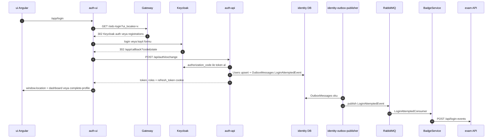

### 1.2 Kayıt (öğrenci / öğretmen / veli)

1. Kayıt linkleri `/oidc-login?intent=student|teacher|parent` biçimindedir (`ui/src/app/pages/public/landing/navbar/navbar.component.html:48-50`). Gateway, `intent` değeri gelince Keycloak'ın `registrations` ucuna yönlendirir ve `state=host~intent` yazar (`Services/Gateway/Program.cs:204-211`).
2. Keycloak kayıt formu doldurulduktan sonra 1.1'deki 4-7. adımlar aynen çalışır. Fark şudur: `EnsureLocalUserAsync`, `Users` satırını `Role=""` ile ekler (`auth-api/Controllers/AuthController.cs:618-634`). Callback de kullanıcıyı `/app/complete-profile?role=<intent>` adresine yollar.
3. **auth-ui `CompleteProfileComponent`** (`auth-ui/src/app/pages/complete-profile/complete-profile.component.ts`):
   - Rolü belirler (`:93-109`).
   - Sınıf listesini `/api/exam/worksheet/grades`, okul listesini `/api/school` ucundan alır (`auth-ui/src/app/services/auth.service.ts:99-106`).
   - `onSubmit` (`:158`) → `buildRequest` (`:251-270`) → `POST /api/exam/{student|teacher|parent}/register` (`auth-ui/src/app/services/auth.service.ts:109,118,123`).
   - `applySession` (`:272-297`) yeni access token'ı saklar.
   - Yönlendirme (`:184-197`): öğretmen onay bekliyorsa `/teacher-approval-pending`, veli ise `/dashboard`, diğerleri `/tests`.
   - Ana ui'de aynı uçları çağıran bir sihirbaz da var: `ui/src/app/pages/register/register-wizard.component.ts:194-254`, route `ui/src/app/app.routes.ts:79`. Eski `/student-register`, `/teacher-register` ve `/parent-register` route'ları bu sihirbaza yönlenir (`ui/src/app/app.routes.ts:49-51`).
4. **Öğrenci** (`api/ExamApp.Api/Controllers/StudentController.cs:165-252`):
   - Refresh cookie'si zorunlu (`:172`).
   - `StudentService.Save` çağrılır (`:179` → `api/ExamApp.Api/Services/StudentService.cs:102-227`):
     - Teacher kaydı varsa 409 döner (`:117`).
     - Kayıt kilidi alınır (`:209`).
     - **`Students`** tablosuna satır eklenir (`:218`).
   - `SetRoleAsync(Student)` (`:196`) rolü atar. Bu atama dışlayıcıdır, diğer uygulama rollerini siler (`api/ExamApp.Api/Services/KeycloakService.cs:118`).
   - `UserRoleChangeRecorder` (`:201` → `api/ExamApp.Api/Services/UserRoles/UserRoleChangeRecorder.cs:28-36`) **`UserRoleChangedEvent`** outbox satırını yazar.
   - Keycloak'a `school_id` attribute'u yazılır (`:220`).
   - Token yenilenir ve cookie döndürülür (`:232-236`).
5. **Öğretmen** (`api/ExamApp.Api/Controllers/TeacherController.cs:55-165` → `api/ExamApp.Api/Services/TeacherService.cs:115-466`):
   - Students kaydı varsa 409 döner (`:143`).
   - Yeni satır `ApprovalStatus=Pending`, `SchoolId=null`, `RequestedSchoolId=dto` ile oluşur (`:271-279`). Reddedilmiş bir başvurudan sonra bekleme süresi dolmadıysa 429 döner (`:210-227`).
   - **`Teachers`** tablosuna satır eklenir (`:364`).
   - Outbox satırları:
     - Bağımsız özel ders öğretmeniyse **`IndependentTeacherRegisteredEvent`** (`:377-379`) ve **`TeacherApplicationSubmittedEvent`** (`:389`).
     - Okul talep edildiyse **`TeacherSchoolRequestSubmittedEvent`** (`:394-410`).
   - Ardından rol (`TeacherController.cs:99`), `UserRoleChangedEvent` (`:104`), `school_id` (`:124`) ve refresh (`:136`) adımları gelir.
6. **Veli** (`api/ExamApp.Api/Controllers/ParentController.cs:33-83`): `SetRoleAsync(Parent)` (`:46`), ardından `ParentService.RegisterAsync` (`api/ExamApp.Api/Services/Parents/ParentService.cs:22-38`). Bu servis **`Parents`** satırını ve `UserRoleChangedEvent` olayını tek `SaveChanges` içinde yazar.
7. **`UserRoleChangedEvent` tüketimi.** `exam-outbox-publisher` olayı yayınlar, auth-api'deki `UserRoleChangedConsumer` tüketir (`auth-api/Consumers/UserRoleChangedConsumer.cs:79-134`). Consumer rolleri Keycloak'tan yeniden okur (`:103`) ve `Users.Role` ile `RoleUpdatedAtUtc` alanlarını günceller (`:125-128`).

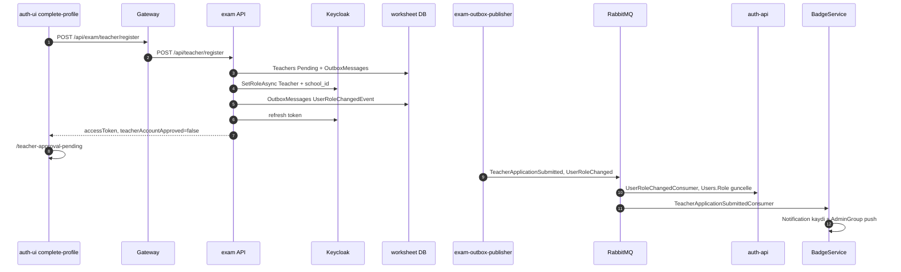

### 1.3 Öğretmen başvurusunun onayı

1. **Admin bildirimi.** Bu iş için iki consumer var: `TeacherApplicationSubmittedConsumer` (`Services/BadgeService/Consumers/TeacherApplicationSubmittedConsumer.cs:47-103`) ve `TeacherSchoolRequestSubmittedConsumer` (`Services/BadgeService/Consumers/TeacherSchoolRequestSubmittedConsumer.cs:52-118`). İkisi de bir `Notifications` satırı yazar ve hub'daki `AdminGroup` grubuna push yapar (`Services/BadgeService/Hubs/BadgeNotificationHub.cs:18-20`). `IndependentTeacherRegisteredConsumer` ise yalnızca log yazar.
2. **Admin UI.** `ui/src/app/pages/admin/teacher-approvals/teacher-approvals.component.ts` → `ui/src/app/services/admin.service.ts:152-172` → `/api/exam/admin/teacher-applications[/{id}/approve|reject]`.
3. **API.**
   - `api/ExamApp.Api/Controllers/AdminController.cs:31-32` sınıf düzeyinde `[Authorize(Roles="Admin")]` taşır. Onay ucu `:233-243`, ret ucu `:247-255` aralığında.
   - `TeacherApprovalService.ApproveAsync` (`api/ExamApp.Api/Services/TeacherApprovals/TeacherApprovalService.cs:286-385`) koşullu bir `ExecuteUpdate` çalıştırır (`:335-346`) ve **`TeacherApplicationDecidedEvent`** outbox satırını yazar (`:365`).
   - `RejectAsync` `:387-440` aralığında.
4. **Öğretmene bildirim.** `TeacherApplicationDecisionConsumer` (`Services/BadgeService/Consumers/TeacherApplicationDecisionConsumer.cs:53-122`) olayı alır ve `Clients.User(TargetKeycloakId)` ile push yapar.
5. **UI kapısı.**
   - Route guard: `approvedTeacherGuard` (`ui/src/app/shared/guards/approved-teacher.guard.ts:17`).
   - Bekleme sayfası durumu `refreshProfile` ile yeniden okur (`ui/src/app/pages/teacher-approval-pending/teacher-approval-pending.component.ts:63,86`).
   - Sunucu tarafında `ApprovedTeacher` policy'leri uygulanır (`api/ExamApp.Api/Services/Teachers/Authorization/ApprovedTeacherAuthorization.cs:28,36`).

Ayrıntılı rol modeli için bkz. [05-kimlik-yetki.md](05-kimlik-yetki.md).

### 1.4 Dil tercihi

Dil değişimi [10.4](#104-dil-locale-değişimi) bölümünde anlatılıyor.

### 1.5 Kullanılmayan / eski auth-api uçları

| Uç | Satır | Durum |
|---|---|---|
| `POST /api/auth/register` | `auth-api/Controllers/AuthController.cs:91-221` | Keycloak'ta kullanıcı oluşturur (`:144`), `Users` satırını ve `UserPreferredLocaleChangedEvent` olayını yazar (`:163-185`). Tek çağıran `auth-ui/src/app/pages/register/register.component.ts:68`, ama ekranda bu sayfaya giden bir link yok. |
| `POST /api/auth/complete-profile` | `auth-api/Controllers/AuthController.cs:651-729` | Servis sarmalayıcısı var (`auth-ui/src/app/services/auth.service.ts:90`), çağıran komponent yok. |
| `POST /api/auth/login` (password grant) | `auth-api/Controllers/AuthController.cs:409-476` | auth-ui şablonu bu formu render etmiyor. |
| `POST /api/auth/logout` | `auth-api/Controllers/AuthController.cs:393-406` | Çağıran yok. Çıkış exam API üzerinden yapılıyor. |

---

## 2. Öğretmenin çalışma kağıdı (worksheet) oluşturması

**Özet:** Öğretmen önce worksheet'in başlık bilgisini oluşturur (`POST /api/exam/worksheet`). Sonra soru kanvasında bir sayfa görseli yükler. Görsel tarayıcıdan doğrudan question-detector'a gönderilir ve soru/şık kutuları otomatik tespit edilir. Öğretmen kutuları düzeltip kaydeder (`POST /api/exam/questions/save`). API görselleri kırpar, MinIO'ya yükler, soruları yazar ve her yeni soru için bir **`QuestionCreatedEvent`** üretir. BadgeService bu olayı alır ve, açıksa, Gemini ile soruyu sınıflandırıp sonucu exam API'ye geri yazar. Ayrı bir "yayınla" adımı yoktur: worksheet'in görünürlüğünü iki enum belirler. Öğretmen worksheet'i atamayla öğrencilere açar. Paylaşılmış bir worksheet'i atamak isteyen başka bir öğretmen de erişim talebi açar.

### 2.1 Worksheet başlığının oluşturulması

1. **UI.** Route'lar `/exam` ve `/exam/:id`, guard'lar `roleGuard('Teacher')` ve `approvedTeacherGuard` (`ui/src/app/app.routes.ts:107-108`).
   - `TestCreateEnhancedComponent.onSubmit()` (`ui/src/app/pages/test-create-enhanced/test-create-enhanced.component.ts:650`) `TestService.create` metodunu çağırır. Bu metot `POST /api/exam/worksheet` gönderir (`ui/src/app/services/test.service.ts:217-218`, baseUrl `:43`).
   - Kanvas içinde bir "mini form" modu da var: `@Input mode='miniform'` (`test-create-enhanced.component.ts:86`) ve `createAndContinue()` (`:97`). Bu mod `ui/src/app/pages/question/question-canvas.component.html:271` içine gömülüdür.
2. **Gateway.** `/api/exam/worksheet` → `/api/worksheet` (`Services/Gateway/ocelot.json:113-124`).
3. **Controller.** `ExamController`, `[Route("api/worksheet")]` (`api/ExamApp.Api/Controllers/ExamController.cs:20`). `[HttpPost] CreateOrUpdateAsync` `:658-683` aralığında ve `TeacherCapability` policy'si gerektirir.
4. **Servis.** `WorksheetAuthoringService.CreateOrUpdateAsync` (`api/ExamApp.Api/Services/Worksheets/WorksheetAuthoringService.cs:149`):
   - Gerekirse Book ve BookTest kaydı oluşturur (`:245-288`).
   - Kapak görselini MinIO'ya yükler (`:354`, `:372`).
   - Aynı Name+BookTestId ile kayıt varsa onu günceller (`:363`).
   - Yeni kayıt: `Worksheets.Add` (`:444`), `SaveChanges` (`:450`).
5. **Tablolar ve varsayılanlar.** Yazılan tablolar `Worksheets`, `Books`, `BookTests`. Yeni kayıtta `TeacherSharing=Private`, `StudentVisibility=Normal`, `CommentsEnabled=true` olur (`api/ExamApp.Api/Data/Worksheet.cs:47-48,59`). Bu adımda **olay üretilmez**.

### 2.2 Soru yükleme, kırpma ve kaydetme

1. **UI.** Route'lar `/questioncanvas`, `/questioncanvas/:id` ve `/imageselect` (`ui/src/app/app.routes.ts:80-90`).
   - `QuestionCanvasComponent`, `<app-image-selector>` komponentini barındırır (`ui/src/app/pages/question/question-canvas.component.html:221`).
   - Görsel `handleFileInput` (`ui/src/app/pages/image-selector/image-selector.component.ts:846`) ile base64 olarak okunur.
   - Görsel yüklenince `predict()` (`:1842`) çağrılır ve question-detector'a gider. Ayrıntı [Akış 4](#4-soru-tespiti-question-detector) içinde.
2. **Kaydet.**
   - `onSave()` (`ui/src/app/pages/question/question-canvas.component.ts:804`) önce başlığı kurar: `{testId, topicId, subjectId}` (`:814-818`).
   - `imageSelector.getRegions(header)` (`image-selector.component.ts:2016`) tam sayfa görseli, pasajları ve soru kutularını toplar.
   - `QuestionService.saveBulk` bunları `POST /api/exam/questions/save` ile gönderir (`ui/src/app/services/question.service.ts:10,34-35`).
3. **Controller.** `QuestionsController`, `[Route("api/questions")]` (`api/ExamApp.Api/Controllers/QuestionsController.cs:23`). Sınıf düzeyinde `TeacherCapability` policy'si (`:29`) ve `Teacher,Admin` rolleri (`:39`) var. `[HttpPost("save")]` (`:130`) worksheet sahipliğini kontrol eder (`:142`) ve `SaveBulkQuestion` metodunu çağırır (`:145`).
4. **Servis.** `QuestionService.SaveBulkQuestion` (`api/ExamApp.Api/Services/QuestionService.cs:415`) tüm işi execution strategy içinde ve tek transaction'da yapar (`:424`, `:427`):
   - Tam sayfayı decode eder (`:565`).
   - Pasajları kırpar ve MinIO'ya `passages/{guid}.jpg` olarak yükler (`:578`).
   - Her soru için `questions/{guid}/question.jpg` (`:630`) ve şık bloğunun üstünden kırpılmış `question-v2.jpg` (`:652`) dosyalarını yükler.
   - `ClassificationSource` alanı varsayılan olarak `Human` olur (`:703`).
   - Tablolara yazar: `Questions.Add` (`:741`), `Answers` (doğru şık yoksa hata fırlatır, `:766`; şık görselleri `:783`), `TestQuestions` (`Order = count+1`, `:806`).
   - Her yeni soru için **`QuestionCreatedEvent`** outbox satırı yazar (`:813-834`).
   - Commit `:839`, rollback `:849`.
5. **MinIO.** `api/ExamApp.Api/Services/MinIOService.cs` kullanılır. Config bölümü `MinioConfig`, anahtarları `Endpoint`, `AccessKey`, `SecretKey`, `BucketName`, `BaseUrl` (`:28-35`). `UploadFileAsync` (`:104`) bucket'ı yoksa oluşturur (`:131-158`) ve `/img/{bucket}/{object}` biçiminde bir URL döner (`:170`). Bu URL'yi gateway'in `/img/*` route'u sunar.
6. **Olay sözleşmesi.** `api/ExamApp.Foundation/Contracts/QuestionCreatedEvent.cs:5-13`. Alanlar: `QuestionId`, `SubjectId`, `TopicId`, `ClassificationSource`, `CreatedAt`, `Text`.
7. **Admin yan etkisi (eğitim verisi).** Kayıt başarılıysa ve kullanıcı admin ise detector'a `/send-to-fix` gönderilir (`question-canvas.component.ts:832-833`). Bu kontrol yalnızca istemcide yapılır.

### 2.3 QuestionCreatedEvent → Gemini sınıflandırma

1. `exam-outbox-publisher` olayı RabbitMQ'ya yayınlar.
2. Consumer BadgeService'tedir, exam API'de değil: `Services/BadgeService/Consumers/QuestionCreatedConsumer.cs:8`. Kayıt `Services/BadgeService/Program.cs:213` içinde.
   - Kapatma anahtarı `QuestionAnalyzer:AIActive` (`:21`). Değer okunamazsa koddaki varsayılan `true` olur. `Services/BadgeService/appsettings.json:14-16` içinde `false`, prod compose'da ise `${BADGE_AI_ACTIVE:-true}` (`deploy/docker-compose.prod.yml:307`). Yani yerelde AI kapalı, prod'da açık.
   - `ClassificationSource=="AI"` olan soruları atlar (`:38-42`). Ardından `ClassifyAndPersistAsync` çağrılır (`:46`).
3. `GeminiQuestionClassifier` (`Services/BadgeService/Services/GeminiQuestionClassifier.cs:17`) şu adımları izler:
   1. Service token alır (`:88`).
   2. Cache pointer'ı exam API'nin `GET /api/questions/classifier-cache` ucundan okur (`:126`).
   3. Soru görselini `GET /api/questions/{id}/image?variant=v1` ile alır (`:153`).
   4. Gemini `generateContent` çağrısını yapar (`:192-195`).
   5. Sonucu `PUT /api/questions/{id}/classification` ile geri yazar, `classificationSource="AI"` olarak (`:258-262`). Exam API tarafında bu uç `api/ExamApp.Api/Controllers/QuestionsController.cs:197` → `api/ExamApp.Api/Services/Questions/QuestionClassificationService.cs:83`.
4. **Config anahtarları** (yalnız adları):
   - BadgeService: `Gemini:BaseUrl`, `Gemini:Model`, `Gemini:ApiKey`, `Gemini:CachedContent`, `Gemini:TimeoutSeconds` (`Services/BadgeService/Services/GeminiOptions.cs:6-21`), ayrıca `ExamApi:BaseUrl`.
   - Exam API cache tarafı: `Gemini` bölümü (`api/ExamApp.Api/Services/Classifier/GeminiCacheOptions.cs:10-22`) ve `Classifier:ReconcileCron` (`api/ExamApp.Api/Program.cs:596-599`).

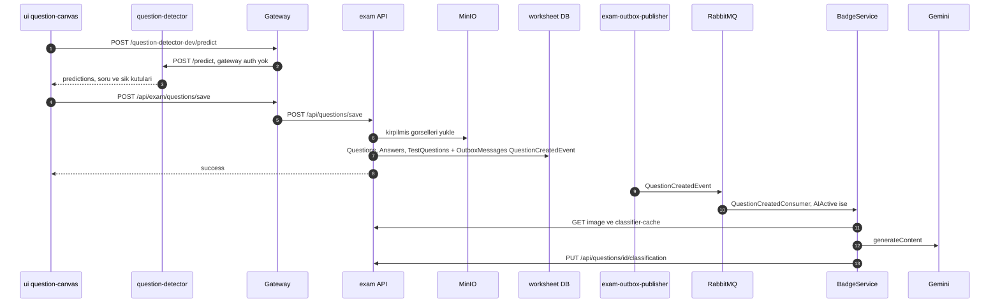

### 2.4 Görünürlük ("yayınlama")

Ayrı bir publish bayrağı **yoktur**. Görünürlüğü iki eksen belirler:
- Öğretmenler arası paylaşım, enum `TeacherSharing` (`api/ExamApp.Api/Data/WorksheetTeacherSharing.cs:8-20`): `Private=0`, `PublicView=1`, `PublicAssignable=2`, `SchoolOnly=3`.
- Öğrenci görünürlüğü, enum `StudentVisibility` (`api/ExamApp.Api/Data/WorksheetStudentVisibility.cs:7-11`): `Normal=0`, `Restricted=1`.

Adımlar:
- **UI.** `onVisibilityChange` (`test-create-enhanced.component.ts:416`) → `updateVisibility` (`ui/src/app/services/test.service.ts:242-246`) → `PUT /api/exam/worksheet/{id}/visibility`.
- **API.** `ExamController.cs:840` → `WorksheetAuthoringService.UpdateVisibilityAsync` (`WorksheetAuthoringService.cs:590`):
  - Worksheet'in sahibi değilse 403 döner.
  - `SchoolOnly` seçildi ama sahibinin okulu yoksa 400 döner (`:620-631`).
  - `Private` veya `SchoolOnly` seçilince verilmiş izinler ve bekleyen talepler **olay üretilmeden** iptal edilir (`:639-674`).
- **Kurallar.** Tamamı `api/ExamApp.Api/Helpers/WorksheetAccess.cs` içinde: `CanModify` `:22`, `CanAssign` `:37`, `CanView` `:58`, `CanCopy` `:82`, `VisibleToTeacherPredicate` `:113`, `CanStudentStartTest` `:138`, `ActiveAssignmentsFor` `:159`.
- **Öğrenci listesi** (`api/ExamApp.Api/Services/ExamService.cs:344-348`): öğrenci, aktif ataması olan worksheet'leri **veya** `Normal` görünürlükte olup sınıfı eşleşen worksheet'leri görür. Yani yeni bir worksheet, sınıfı eşleşen öğrencilere hemen görünür.

### 2.5 Atama

- **UI.** `WorksheetDetailComponent`, route `test/:testId` (`ui/src/app/app.routes.ts:105`). Aktif şablon `worksheet-detail.component-dlms.html`.
  - `openAssignmentDialog` (`ui/src/app/pages/worksheet-detail/worksheet-detail.component.ts:694`) diyaloğu açar. Ardından `assignWorksheet` (`:727`) → `POST /api/exam/worksheet/assignments` (`test.service.ts:213-214`).
- **API.** `ExamController.cs:277-298`, yalnız `Teacher` rolü. Servis `WorksheetAssignmentService.AssignWorksheetAsync` (`api/ExamApp.Api/Services/Worksheets/WorksheetAssignmentService.cs:36`):
  - Önce `CanView` kontrol edilir (`:77-82`), sonra `CanAssign`.
  - Bağımsız özel ders öğretmeni sınıfa atama yapamaz (`:125`).
  - Çakışan atama kontrolü (`:204`).
  - **`WorksheetAssignments`** satırı eklenir (`:228`). Bu adımda **olay üretilmez**.

### 2.6 Erişim (atama izni) talebi

Senaryo: paylaşılmış bir worksheet'i yalnızca görüntüleyebilen bir öğretmen, onu atayabilmek için sahibinden izin ister.

1. **Talep eden UI.**
   - Butonun görünme koşulu `isSharedReadOnlyForTeacher && !canAssignWorksheet` (`worksheet-detail.component.ts:213-214`).
   - Diyalog: `ui/src/app/pages/worksheet-detail/components/assignment-permission-dialog/assignment-permission-dialog.component.ts:81`.
   - Servis: `ui/src/app/services/worksheet-access-request.service.ts:17-57`, base `/api/exam/worksheet/access-requests`.
2. **API.** Tüm uçlar `[Authorize(Roles="Teacher")]` taşır:
   - `POST access-requests` (`ExamController.cs:330`)
   - `GET incoming` (`:352`) ve `GET incoming/count` (`:365`)
   - `POST {id}/approve` (`:378`) ve `POST {id}/reject` (`:391`)
   - `DELETE access-grants` (`:404`)
3. **Servis** (`api/ExamApp.Api/Services/Worksheets/WorksheetAccessRequestService.cs`):
   - `CreateRequestAsync` (`:49`):
     - Worksheet `Private` ise talep reddedilir (`:85`).
     - Zaten bekleyen bir talep varsa 409 döner (`:95`).
     - **`WorksheetAccessRequests`** satırını ve **`WorksheetAccessRequestedEvent`** olayını tek transaction'da yazar (`:124-158`).
   - `ApproveAsync` (`:226`): **`WorksheetAccessGrants`** satırını (`:257`) ve **`WorksheetAccessRequestApprovedEvent`** olayını (`:266`) yazar.
   - `RejectAsync` (`:274`): **`WorksheetAccessRequestRejectedEvent`** olayını yazar (`:297`).
4. **Consumer'lar.**
   - `Services/BadgeService/Consumers/WorksheetAccessRequestedConsumer.cs:21` `Notification` kaydı yazar ve `AccessRequestUpdate` push'unu `kind:"requested"` ile gönderir (`:103`).
   - `WorksheetAccessDecisionConsumer.cs:25` aynı işi `kind: approved|rejected` ile yapar (`:131-134`).
5. **Sahibin UI'ı.**
   - Sayfa `/assignment-permission-requests` (`ui/src/app/app.routes.ts:142-148`) → `ui/src/app/pages/assignment-permission-requests/assignment-permission-requests.component.ts:82,95,99`.
   - Menüdeki rozet sayacı `enhanced-layout.component.ts:281-285` içinde.
   - SignalR handler `ui/src/app/services/signalr.service.ts:115`.

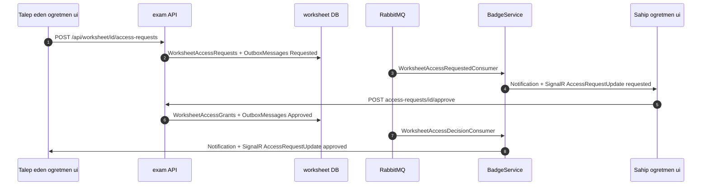

---

## 3. Öğrencinin çözmesi, puan ve rozet kazanması

**Özet:** Öğrenci teste başlar ve sunucuda bir `WorksheetInstance` oluşur. Her cevap kaydedildiğinde exam API, aynı transaction içinde bir **`AnswerSubmittedEvent`** outbox satırı yazar. BadgeService bu olayla puanı ve aggregate'leri günceller, rozet kurallarını değerlendirir, yeni rozet varsa `Notification` yazar ve SignalR'la `BadgeEarned` push'u gönderir. Toplam puan değiştiyse BadgeService kendi outbox'ına **`StudentPointsChangedEvent`** yazar. Exam API bu olayla `StudentPoints` tablosunu günceller. Leaderboard verisini bu tablodan okur. Testi bitirmek (`end-test`) **olay üretmez**: puan ve rozetler yalnızca cevap olaylarından gelir.

### 3.1 Teste başlama

1. Worksheet detay sayfasındaki `StartTest(id)` (`ui/src/app/pages/worksheet-detail/worksheet-detail.component.ts:348`) → `POST /api/exam/worksheet/start-test/{id}` (`ui/src/app/services/test.service.ts:112-113`). Başarılı olursa `/testsolve/{instanceId}` sayfasına gidilir (`:355`).
2. API: `ExamController.cs:568-597`. Roller `Student,Teacher,Admin`, ayrıca `TeacherOrStudentCapability` policy'si.
3. `TestSessionService.StartTestAsync` (`api/ExamApp.Api/Services/Worksheets/TestSessionService.cs:88`):
   - Erişimi `WorksheetAccess.CanStudentStartTest` ile kontrol eder (`:107`).
   - Açık bir instance varsa onu kullanır (`:112-114`).
   - Yoksa **`TestInstances`** ve **`TestInstanceQuestions`** satırlarını oluşturur (`:138-167`). Bu adımda olay üretilmez.

### 3.2 Çözüm ekranı ve cevap kaydı

1. Route `testsolve/:testInstanceId` → `TestSolveCanvasComponentv3` (`ui/src/app/app.routes.ts:99`). Mantığın tamamı üst sınıf `ui/src/app/pages/test-solve/test-solve-canvas-enhanced.component.ts` içinde. Yükleme `loadTest` (`:338`) ile yapılır ve `GET .../test-canvas-instance/{id}` çağırır.
2. Cevap: `persistAnswer` (`:940`) → `POST /api/exam/worksheet/save-answer` (`test.service.ts:104-105`) → `ExamController.cs:639-647`.
3. `TestSessionService.SaveAnswer` (`TestSessionService.cs:358`):
   - Doğruluğu hesaplar (`:417-421`).
   - Explicit transaction açar (`:455`).
   - `AnswerRevision` alanını atomik olarak artırır (`:457-464`).
   - **`AnswerSubmittedEvent`** olayını kurar (`:470-489`): `EventId` = outbox satırının Id'si, `ClientId` = Keycloak `sub` (`:481`), `Revision` (`:487`).
   - Outbox satırını ekler (`:492-499`), ardından commit (`:503-504`).
4. Bitirme: `completeTest()` (`test-solve-canvas-enhanced.component.ts:853`) → `PUT .../end-test/{id}` → `TestSessionService.EndTest` (`:513`). Durum Completed olur ve `EndTime` dolar (`:536-538`). Olay üretilmez.

### 3.3 BadgeService: puan, aggregate ve rozet

1. **Kayıt.** Consumer `Services/BadgeService/Program.cs:212` içinde kayıtlı. `AnswerSubmittedConsumerDefinition` mesajları `UserId` anahtarlı 8'li bir partitioner'dan geçirir; böylece aynı kullanıcının cevapları sırayla işlenir. Retry aralıkları 1, 5 ve 15 saniyedir.
2. **Consumer.** `AnswerSubmittedConsumer` (`Services/BadgeService/Consumers/AnswerSubmittedConsumer.cs:37`) önce `ProcessAsync` (`:52`), sonra `EvaluateAnswerSubmittedAsync` (`:57`) çağırır.
3. **Puan toplama.** `AnswerSubmissionAggregationService.ProcessAsync` (`Services/BadgeService/Services/AnswerSubmissionAggregationService.cs:72`):
   - `ProcessedAnswerSubmissions` defteriyle mükerrer teslimi eler (`:74-83`).
   - `ResolvePointAwardAsync` (`:167`) `AnswerPointAwards` satırını (TestInstanceId, QuestionId) çifti üzerinden bulur. Revision ile eskimiş olayları ayırt eder (`:188-206`). Puan farkını (delta) uygular, yani "son cevap kazanır" (`:222-224`).
   - Güncellenen tablolar: `StudentQuestionAggregates` (`TotalPoints`, `:307`), `StudentSubjectAggregates` (`:359`), `StudentDailyActivities` (`:364-366`).
   - Toplam puan değiştiyse `StudentPointsOutbox.Enqueue` çalışır (`:125-128`). Bu adım ledger satırıyla aynı `SaveChanges` içindedir.
4. **Rozet değerlendirme.** `BadgeEvaluator.EvaluateAnswerSubmittedAsync` (`Services/BadgeService/Services/BadgeEvaluator.cs:40`):
   - Her tanım için kuralı değerlendirir (`:87`; kural tipleri `Services/BadgeService/Services/BadgeRuleEvaluator.cs:38-125`).
   - **`StudentBadgeProgresses`** satırlarını günceller (`:94-117`).
   - Kazanılan rozet için **`BadgeEarned`** satırı yazar (`:120-130`).
   - `Notification` kaydı yazar, Type `BadgeEarned` (`:158-188`).
   - Commit `:144`.
   - Commit'ten sonra `Clients.User(clientId).SendAsync("BadgeEarned", …)` çağrısı yapılır (`:147-155`). Bu push best-effort'tur.
5. **StudentPointsChangedEvent.** `Services/BadgeService/Services/StudentPointsOutbox.cs:15-31` olayı badge DB'deki `OutboxMessages` tablosuna yazar. Olay mutlak `TotalPoints` ve sürüm bilgisi olarak `UpdatedAtUtc` taşır. Sözleşme `api/ExamApp.Foundation/Contracts/StudentPointsChangedEvent.cs:15`.

### 3.4 Exam API: StudentPoints ve leaderboard

1. Olayı `badge-outbox-publisher` yayınlar (`AppHost/AppHost.cs:533`).
2. Exam API'nin bus'ı `api/ExamApp.Api/Program.cs:405-446` içinde kurulur. Consumer `:427`'de kayıtlı, endpoint adı `exam-api` (`:437-444`).
3. `StudentPointsChangedConsumer` (`api/ExamApp.Api/Consumers/StudentPointsChangedConsumer.cs:40-68`) `MaxTotalPoints` üstündeki değerleri atar (`:46-52`) ve `StudentPointsSyncService.ApplyAsync` metodunu çağırır (`api/ExamApp.Api/Services/StudentPoints/StudentPointsSyncService.cs:71`).
4. `ApplyAsync`, **`StudentPoints`** tablosunda sürüm kontrollü bir güncelleme yapar: `WHERE SourceUpdatedAtUtc IS NULL OR < version` (`:98-106`). Satır yoksa ekler (`:132-142`).
5. **Leaderboard.**
   - API: `GET /api/exam/leaderboard?scope&skip&take` → `api/ExamApp.Api/Controllers/LeaderboardController.cs:20-69` → `api/ExamApp.Api/Services/Leaderboards/LeaderboardService.cs:43`.
   - UI: `ui/src/app/services/leaderboard.service.ts:19-24` → `ui/src/app/shared/components/leaderboard/leaderboard.component.ts`. Bu komponentin tek kullanıldığı yer `ui/src/app/pages/student-profile/student-profile.component.html:126`.
   - Leaderboard'a push gelmez. Yeni puan sayfa yeniden yüklenince görünür.
6. **SignalR istemcisi.** `ui/src/app/services/signalr.service.ts:91-105` yalnız WebSocket'le ve `skipNegotiation` ile bağlanır. `BadgeEarned` handler'ı snackbar gösterir ve `notificationsChanged$` olayını tetikler (`:108-113`). Bağlantı `enhanced-layout.component.ts:293` içinden başlatılır.

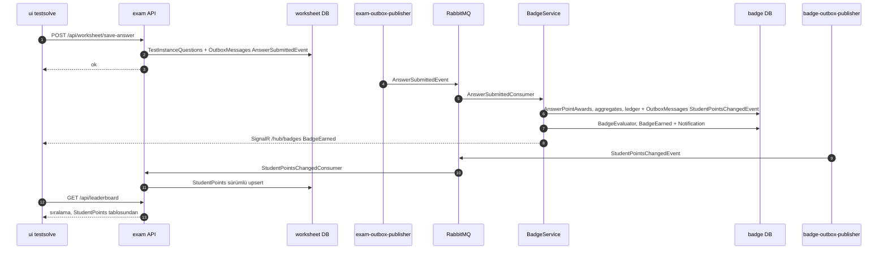

---

## 4. Soru tespiti (question-detector)

**Özet:** question-detector, Python FastAPI ile yazılmış bir servistir. İki adet Ultralytics YOLO modeli kullanır: biri soru kutularını, diğeri şık kutularını bulur. Bu servisi **tarayıcı doğrudan gateway üzerinden çağırır, exam API hiç çağırmaz**. Ayrı bir config anahtarı da yoktur: istemci servisi koda gömülü `/question-detector-dev/...` yolundan çağırır. Servis ayrıntısı [03-servisler/question-detector.md](03-servisler/question-detector.md) içinde.

1. **İstemci.** `ui/src/app/services/question-detector.service.ts:12-40`. Tüm çağrılar göreli `/question-detector-dev/...` yolunu kullanır.
2. **Tetikleme.** `ImageSelectorComponent.predict()` (`ui/src/app/pages/image-selector/image-selector.component.ts:1842`):
   - Önce `readQrData` çağrılır ve `/read-qr` ucuna gider. Sonuç yalnızca console'a yazılır (`:1848`).
   - Ardından `/predict` çağrılır (`:1852`).
   - Yanıttaki kutular şöyle işlenir (`:1877` civarı): `class_id===0` olanlar alınır, önce sol sütun sonra sağ sütun olmak üzere y koordinatına göre sıralanır ve `subpredictions` şıklara eşlenir.
3. **Gateway.** `/question-detector-dev/{everything}` → `question-detector-dev:8080` (`Services/Gateway/ocelot.json:39-49`). Bu route'ta **auth yok**. Aspire altında host ve port `QUESTION_DETECTOR_HOST/PORT` ile ezilir (`Services/Gateway/Program.cs:43`, `AppHost/AppHost.cs:878-880`). Container tanımı `AppHost/AppHost.cs:867-870` içinde.
4. **Servis** (`question-detector/main.py`):
   - FastAPI uygulaması `:15`, CORS `*` (`:71-77`).
   - **Model yolları:**
     - Soru modeli sırayla şuralarda aranır: `QUESTION_MODEL_PATH` env, `/app/models/question-best.pt`, eski `data/questions/runs/train5/weights/best.pt` (`:99-104`).
     - Şık modeli sırayla: `ANSWER_MODEL_PATH` env, `/app/models/answer-best.pt`, `train-answers-v10` (`:105-109`).
     - Modeller `:111-112`'de yüklenir. Prod imajının kopyaladığı ağırlıklar `deploy/dockerfiles/question-detector.Dockerfile:22-23` içinde.
   - **`POST /predict`** (`:169`):
     - Girdi `{image_base64}`.
     - Soru modelini conf 0.25 ile çalıştırır. Her class-0 kutuyu kırpıp şık modeline verir ve şık koordinatlarını sayfa koordinatına geri taşır.
     - Çıktı `{success, predictions:[{class_id,x,y,width,height,subpredictions?}]}` biçimindedir (`:196-240`).
     - Hata durumunda da HTTP 200 döner, gövde `{success:false,error}` olur (`:242-243`).
   - **`POST /send-to-fix`** (`:246`): eğitim verisi toplar. Görseli ve kırpıntıları `data/` altına, kayıtları `data/json/questions.json` dosyasına yazar (`:261-330`).
   - **`POST /send-to-fix-for-answers`** (`:347`) ve **`POST /read-qr`** (`:352`, pyzbar).
5. Tespit edilen kutular yalnızca UI'da düzenleme için kullanılır. Kalıcı kayıt 2.2'deki `questions/save` çağrısıyla yapılır. Kırpma da API tarafında, UI'dan gelen koordinatlarla tekrar yapılır.

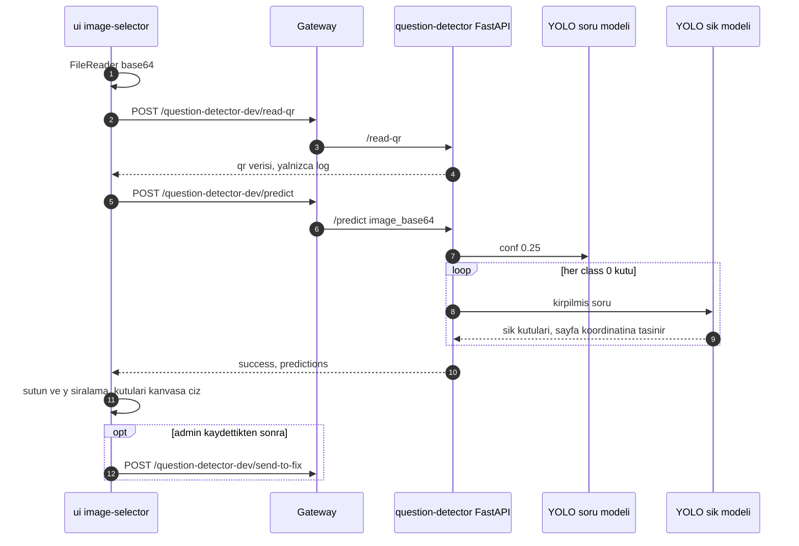

---

## 5. Özel ders / booking

**Özet:** Öğretmen müsaitlik slotları açar. Slotlar tek tek veya tekrarlayan kuralla oluşturulabilir. Öğrenci özel ders öğretmenini arar, profilini açar ve bir slot için talep gönderir. Öğretmen talebi onaylar veya reddeder. Admin bir öğretmeni askıya alırsa o öğretmenin bekleyen talepleri reddedilir ve onaylı derslerin öğrencilerine "öğretmen uygun değil" bildirimi gider. Her durum değişikliği outbox üzerinden BadgeService'e ulaşır, o da bildirim yazar ve `BookingUpdate` push'u gönderir.

### 5.1 Müsaitlik

1. **UI.** Route `/availability`, guard'lar authGuard, Teacher rolü ve approvedTeacherGuard (`ui/src/app/app.routes.ts:243-249`). Sayfa `ui/src/app/pages/teacher-availability/teacher-availability.component.ts`: `createSlot` `:137-138`, `createRecurringRule` `:176-177`, `deleteSlot` `:222-223`. UI servisi `ui/src/app/services/booking.service.ts`, base `/api/exam/booking` (`:37`).
2. **API.** `BookingController`, `[Route("api/booking")]` (`api/ExamApp.Api/Controllers/BookingController.cs:18`):

| Satır | Uç | Yetki |
|---|---|---|
| `:41-44` | POST `slots` | Teacher + `ApprovedTeacher` |
| `:58-61` | GET `slots/mine` | Teacher + policy |
| `:72-75` | DELETE `slots/{id}` | Teacher + policy |
| `:91-94` | POST `recurring-rules` | Teacher + policy |
| `:127-130` | DELETE `recurring-rules/{id}` | Teacher + policy |
| `:143-145` | GET `teachers/{teacherId}/slots` | `[Authorize]`, okul kapsamı |
| `:156-158` | POST `requests` | Student |
| `:172-175` | GET `requests/teacher` | Teacher + policy |
| `:186-188` | GET `requests/student` | Student |
| `:199-202` | POST `requests/{id}/approve` | Teacher + policy |
| `:213-216` | POST `requests/{id}/reject` | Teacher + policy |
| `:232-235` | POST `requests/{id}/video-session` | Teacher,Student + `TeacherOrStudentCapability` |

3. **Servis.** `api/ExamApp.Api/Services/Bookings/BookingService.cs`:
   - `CreateSlotAsync` (`:108`): öğretmen başına advisory lock alır ve transaction içinde çakışma kontrolü yapar (`:176-221`).
   - `GetMySlotsAsync` (`:267`): tekrarlayan kural slotlarını burada tembel olarak üretir (`TopUpAsync`, `:281`).
   - **Tablolar:** `TeacherAvailabilitySlots`, `RecurringAvailabilityRules`, `Bookings` (`api/ExamApp.Api/Data/AppDbContext.cs:118-122`). Slot başına tek aktif booking kuralını filtreli unique index sağlar (`:636-639`).

### 5.2 Öğretmen arama ve talep

1. **Arama.** Route'lar `/tutors` ve `/tutors/:id` (`ui/src/app/app.routes.ts:222,229`). `ui/src/app/pages/tutor-search/tutor-search.component.ts:99` → `GET /api/exam/teacher/search` (`api/ExamApp.Api/Controllers/TeacherController.cs:339-340` → `TeacherService.SearchTutorsAsync`, `api/ExamApp.Api/Services/TeacherService.cs:1269`).
2. **Talep.**
   - `tutor-public-profile.component.ts:111` slot diyaloğunu açar (`ui/src/app/shared/components/booking-slot-dialog/booking-slot-dialog.component.ts`). Diyalog açık slotları `:91`'de çeker, talebi `:116`'da gönderir.
   - Açık slotlar `BookingService.GetTeacherOpenSlotsAsync` (`:371`) ile gelir.
   - Talep `BookingService.CreateBookingAsync` (`:425`) ile oluşur:
     - Öğretmen onaylı ve askıda değil mi diye bakar (`:458-460`).
     - Mükerrer talepte 409 döner (`:465-475`).
     - Öğretmenin Keycloak `sub` değerini auth-api'den bulmaya çalışır (`:484`).
     - Transaction içinde (`:513-557`) öğretmen satırını `FOR SHARE` ile kilitler (`:525`), **`Bookings`** satırını ekler (`:531`) ve **`BookingRequestCreatedEvent`** outbox satırını yazar (`:534-553`).
3. **Consumer.** `Services/BadgeService/Consumers/BookingRequestCreatedConsumer.cs:22`. (Type, SourceBookingId) çifti üzerinden idempotent çalışır (`:52`). `Notification` kaydı yazar (`:68-89`) ve `BookingUpdate` push'unu `kind:"requested"` ile gönderir (`:102`).
4. **Öğrencinin listesi.** Route `/my-bookings` (`app.routes.ts:261`) → `ui/src/app/pages/student-bookings/student-bookings.component.ts:124-125`.

### 5.3 Onay / red

1. **UI.** Route `/booking-requests` (`app.routes.ts:252`) → `ui/src/app/pages/teacher-booking-requests/teacher-booking-requests.component.ts`: onay `:142`, red `:157`.
2. **Servis.** `ApproveBookingAsync` (`:696`) ve `RejectBookingAsync` (`:699`) ikisi de `DecideAsync` metoduna gider (`:703`):
   - Talep öğretmene ait değilse 403 (`:724`), Pending değilse 400 döner (`:727`).
   - `BookingDecisionEvent` kurulur (`:758`).
   - Koşullu bir `ExecuteUpdate WHERE Status==Pending` çalışır ve outbox satırı aynı transaction'da yazılır (`:785-805`).
3. **Consumer.** `Services/BadgeService/Consumers/BookingDecisionConsumer.cs:22`. Türler `BookingApproved` ve `BookingRejected` (`:24-25`). Alıcıyı `NotificationRecipientResolver` ile bulur (`:69`) ve push yapar (`:119`).

### 5.4 "Öğretmen uygun değil" (askıya alma)

1. **Admin.** `POST /api/exam/admin/teachers/{id}/suspend` (`api/ExamApp.Api/Controllers/AdminController.cs:528`) → `AdminTeacherSuspensionService.SuspendAsync` (`api/ExamApp.Api/Services/AdminUsers/AdminTeacherSuspensionService.cs:70`). Tek transaction'da (`:123-151`) şunları yapar:
   - Öğretmen satırını koşullu olarak günceller (`:132-138`).
   - Bekleyen talepleri reddeder: `RejectPendingBookingsAsync` (`:146`) → `api/ExamApp.Api/Services/Bookings/TeacherUnavailableBookingRejection.cs:57`. Bu adım `BookingDecisionEvent{TeacherUnavailable=true}` yazar (`:82-103`).
   - Onaylı gelecek dersi olan her öğrenci için bir **`BookingTeacherUnavailableEvent`** yazar (`:147`, `:289-299`).
   - Commit'ten sonra açık whiteboard'ları kapatır (`:176`).
2. **Güvenlik ağı.** Hangfire job'ı `SuspendedTeacherBookingSweepJob` (`api/ExamApp.Api/Services/Bookings/SuspendedTeacherBookingSweepJob.cs:59`), cron `*/5 * * * *` (`:26`). Kayıt `api/ExamApp.Api/Program.cs:608-611` içinde.
3. **Consumer.** `Services/BadgeService/Consumers/BookingTeacherUnavailableConsumer.cs:27`. `SourceEventId` üzerinden idempotent çalışır (`:59`) ve `BookingUpdate` push'unu `kind:"teacherUnavailable"` ile gönderir (`:106`).
4. **Canlı derse giriş kapısı.** `BookingService.GetLiveSessionAccessAsync` (`:841`) öğretmenin uygunluğunu kontrol eder (`:857`, `:875-876`). UI'da hata `ui/src/app/models/booking.model.ts:193` (`isTeacherUnavailableError`) ile tanınır.

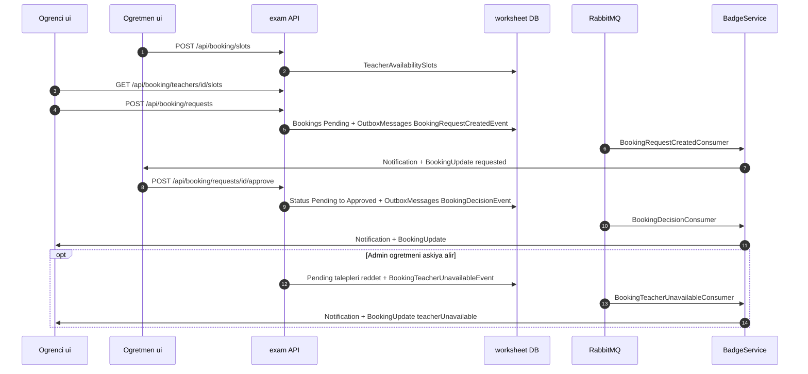

---

## 6. Video görüşme (Jitsi)

**Özet:** Jitsi container'larının kurulumu, JWT claim'leri, moderatör yetkisi ve prod notları zaten [../../docs/jitsi-video.md](../../docs/jitsi-video.md) içinde anlatılıyor. Burada tekrarlanmıyor. Kısaca akış şöyle: onaylı bir booking'in katılım penceresi açıkken öğrenci veya öğretmen `video-session` ucunu çağırır. API, booking'e özgü ve tahmin edilemeyen bir oda adıyla imzalı bir Jitsi JWT'si üretir. UI, Jitsi'yi iframe içinde açar. Tarayıcı Jitsi'ye gateway'den geçmeden, doğrudan bağlanır.

1. **UI.**
   - Route `lessons/:bookingId/video` (`ui/src/app/app.routes.ts:268-272`). Komponent `ui/src/app/pages/lesson-video/lesson-video.component.ts`.
   - `load()` (`:160`) içinde `getVideoSession` çağrılır (`:171-172`), yani `POST /api/exam/booking/requests/{id}/video-session` (`ui/src/app/services/booking.service.ts:157`).
   - `joinUrl` ile beklenen base URL'nin aynı origin'de olduğu kontrol edilir (`:189`).
   - https'te IFrame API kullanılır (`embedWithIframeApi`, `:244`, `jwt: session.token` `:252`). Diğer durumlarda düz iframe açılır (`:195`).
   - Aynı sayfada whiteboard `@defer` ile yüklenir (`lesson-video.component.html:53-55`).
2. **API.**
   - `BookingController.cs:232-243` → `BookingService.GetVideoSessionAsync` (`api/ExamApp.Api/Services/Bookings/BookingService.cs:887`).
   - Reddetme eşlemeleri (`:894-912`): NotFound 404, NotParticipant 403. NotApproved, TeacherUnavailable, WindowNotOpen ve WindowClosed 409 döner.
   - Provider config eksikse yine 409 döner (`:935-942`).
3. **Erişim kuralı.** `GetLiveSessionAccessAsync` (`:841`) whiteboard ile ortaktır. Kontrol sırası: katılımcı mı → Approved mı → öğretmen uygun mu → zaman penceresi (`:873-882`). Pencere hesabı `api/ExamApp.Api/Services/Bookings/BookingSessionWindow.cs:35,54` içinde.
4. **Token.**
   - `api/ExamApp.Api/Services/Video/JitsiVideoSessionProvider.cs`:
     - `CreateOrJoinSessionAsync` (`:55`).
     - Öğretmen moderatör olur (`:67`).
     - Token ömrü `min(lifetime, pencere kapanışı)` (`:72-76`).
     - Secret uzunluk kontrolü (`:104-110`). "ChangeMe" değeri Development dışında reddedilir (`:117-123`).
     - Oda adı `BuildRoomName` ile HMAC'tan türetilir (`:130`). Token `CreateToken` ile üretilir (`:142-175`).
   - Config: bölüm `Video` (`api/ExamApp.Api/Services/Video/VideoOptions.cs:11`). `JoinWindowBeforeMinutes`=15 (`:20`), `JoinWindowAfterMinutes`=30 (`:24`), `Jitsi:*` anahtarları (`:40-73`). Secret değerleri [02-ortam-kurulumu.md](02-ortam-kurulumu.md) ve `docs/jitsi-video.md` içindeki parametre tablosunda anlatılıyor.
   - DI: `api/ExamApp.Api/Services/Video/VideoServiceCollectionExtensions.cs:16`, `ValidateOnStart` (`:46`).
5. **İstemci tarafı pencere.** `ui/src/app/shared/utils/booking-join-window.ts:10,13`. Değerler 15/30 olarak koda gömülü.
6. Bu akışta **outbox olayı yoktur**.

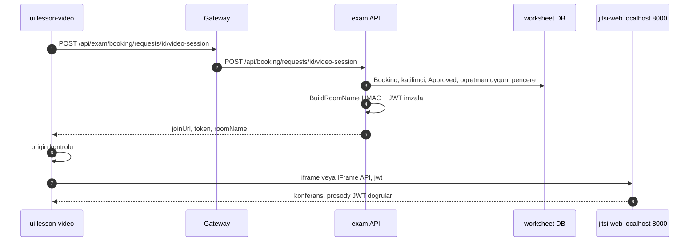

---

## 7. Whiteboard (Excalidraw)

**Özet:** Whiteboard, video dersin yanında açılan bir Excalidraw kanvasıdır. Gerçek zamanlı senkronizasyon exam API içindeki **`WhiteboardHub`** ile yapılır. Bu bir SignalR hub'ıdır ve `/hub/whiteboard` yolunda, yalnız WebSocket üzerinden çalışır. Her booking için `board-{bookingId}` adlı bir SignalR grubu vardır. Sahne yalnız **bellekte** tutulur (`WhiteboardStore`), veritabanına yazılmaz. Erişim kuralı video ile aynıdır (`GetLiveSessionAccessAsync`). Outbox olayı yoktur.

1. **UI.**
   - Komponent `ui/src/app/shared/components/whiteboard/whiteboard.component.ts`. `WhiteboardSyncService` burada provide edilir (`:63`). Kanvas her `onChange` olayında `sync.notifyLocalChange()` çağırır (`:202`).
   - Sahne birleştirme: `excalidraw-scene.ts:20,29`.
   - Tombstone temizliği: `ui/src/app/shared/utils/whiteboard-sync.util.ts:213`.
2. **Bağlantı.**
   - `ui/src/app/services/whiteboard-hub-connection.ts:36-41`: `accessTokenFactory`, yalnız WebSocket, `skipNegotiation`, otomatik yeniden bağlanma.
   - Hub yolu `ui/src/app/models/whiteboard.model.ts:11` içinde.
3. **Senkron servisi** (`ui/src/app/services/whiteboard-sync.service.ts`):
   - Throttle süreleri: flush 80 ms (`:44`), pointer 50 ms (`:46`).
   - Sunucudan gelen olaylar: `ElementsUpdated`, `PointerUpdated`, `BoardClosed`, `PeerPresenceChanged` (`:179-182`).
   - Yeniden bağlanınca tekrar `JoinBoard` çağrılır (`:189`, `:315`).
   - Sunucuya giden çağrılar: `SendElements` (`:637`) ve `SendPointer` (`.send`, `:745`).
4. **Gateway.** `/hub/whiteboard` → `ws://exam-dotnet-api:5079` (`Services/Gateway/ocelot.json:3-19`). WS auth için bkz. [0.1](#01-gateway-routeları).
5. **API.**
   - `api/ExamApp.Api/Program.cs`: query token'ı `SignalRQueryToken.Resolve` ile okur (`:159-163`; `api/ExamApp.Api/Helpers/SignalRQueryToken.cs:16`). `AddWhiteboard()` `:250`'de, `MapWhiteboardHub()` `:585`'te çağrılır.
   - `api/ExamApp.Api/Services/Whiteboard/WhiteboardServiceCollectionExtensions.cs`:
     - Hub'a özgü ayarlar `AddHubOptions<WhiteboardHub>` ile verilir (`:31`). Mesaj sınırı 128 KB (`:35`).
     - Store singleton olarak kayıtlı (`:40`).
     - Hub `CloseOnAuthenticationExpiration` ile map edilir (`:54-61`).
6. **Hub** (`api/ExamApp.Api/Hubs/WhiteboardHub.cs`):
   - Yetki `Teacher,Student` + `ApprovedTeacherOrStudent` (`:48-49`).
   - Grup adı `board-{bookingId}` (`:72`).
   - İstemci arayüzü `:17-36` aralığında.
   - `JoinBoard` (`:83`):
     - Rate limit uygular.
     - `WhiteboardAccessService.AuthorizeAsync` çağırır (`:88`; `api/ExamApp.Api/Services/Whiteboard/WhiteboardAccessService.cs:69` → `GetLiveSessionAccessAsync`, `:80`).
     - `store.Join` (`:98`), ardından gruba ekleme (`:111`).
     - Sahneyi, sürümü, rolü ve pencere kapanışını döner (`:127`).
   - `SendElements` (`:136`): store'da birleştirir (`:146`), `OthersInGroup` ile yayınlar (`:156`) ve düzeltmeleri döner (`:158`).
   - Diğer metotlar: `SendPointer` (`:162`), `LeaveBoard` (`:180`), `OnDisconnectedAsync` (`:191`).
   - `EnsureMemberAsync` (`:204-249`) erişimi her `RevalidateSeconds` (30 sn) aralığında DB'den yeniden doğrular.
7. **Kalıcılık ve temizlik.**
   - `WhiteboardStore.cs` veriyi `ConcurrentDictionary` içinde tutar (`:131-135`). Kalıcılık olmadığı ve tek instance varsayımı `:103-116`'daki notlarda yazıyor.
   - Sınırlar `WhiteboardOptions.cs:16-28` içinde.
   - `WhiteboardCleanupService.cs:42,67` penceresi kapanan board'ları kapatır.
   - Askıya alma sırasında board'ları `AdminTeacherSuspensionService.CloseOpenWhiteboardsAsync` kapatır (bkz. 5.4).

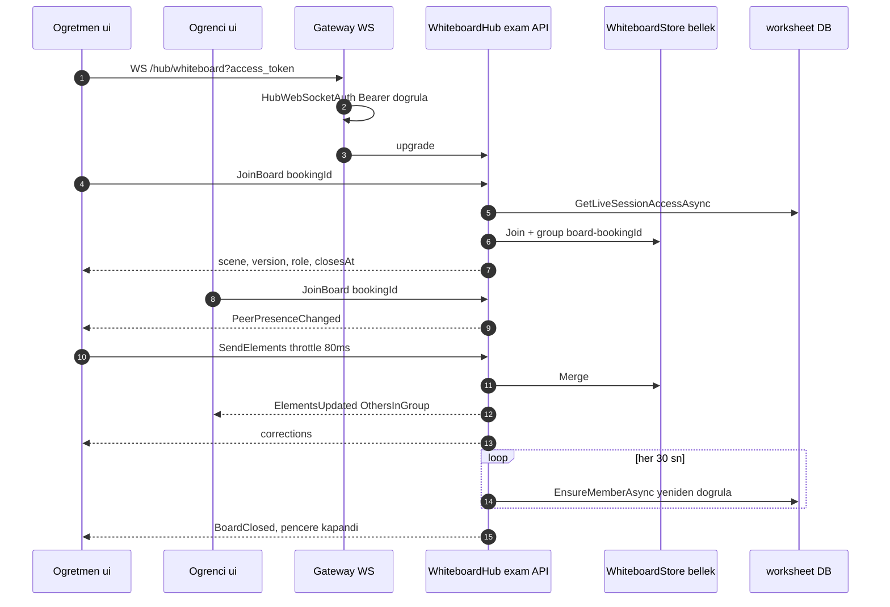

---

## 8. Yorum ve moderasyon

**Özet:** Öğrenciler ve öğretmenler worksheet altına yorum ve yanıt yazar. Yeni yorum ve yanıtlar, alıcı başına birer outbox olayı üretir: **`WorksheetCommentCreatedEvent`** (öğretmene "yeni yorum") ve **`WorksheetCommentRepliedEvent`** (konu katılımcılarına "yanıt"). BadgeService bu bildirimleri bir kök yorum etrafında **birleştirir** (coalescing). Öğretmen veya admin bir yorumu gizlediğinde **`WorksheetCommentHiddenEvent`** üretilir ve BadgeService o yorumun bildirim metnini nötrler. Kullanıcıların yaptığı raporlar yalnızca kayıt olarak tutulur: olay üretilmez ve otomatik gizleme yapılmaz.

1. **API.** `WorksheetCommentsController`, `[Route("api/worksheet/{worksheetId:int}/comments")]` (`api/ExamApp.Api/Controllers/WorksheetCommentsController.cs:27`):

| Satır | Uç | Roller |
|---|---|---|
| `:40-44` | GET (thread) | Student,Teacher,Admin |
| `:55-59` | GET `{rootId}/replies` | Student,Teacher,Admin |
| `:70-74` | POST (oluştur) | Student,Teacher |
| `:93-97` | POST `{commentId}/report` | Student,Teacher |
| `:111-115` | POST `{commentId}/hide` | Teacher,Admin |
| `:126-130` | POST `{commentId}/unhide` | Teacher,Admin |
| `:141-145` | GET `reports` | Teacher,Admin |
| `:156-159` | GET `~/api/admin/comments/reports` | Admin |

2. **Servis** (`api/ExamApp.Api/Services/Worksheets/WorksheetCommentService.cs`):
   - `CreateAsync` (`:274`):
     - Gövdeyi temizler (`:291`).
     - Üst yorumu kontrol eder; gizli bir köke yanıt yazılamaz (`:310-327`).
     - Öğrenci kilidini ve öğretmen iznini kontrol eder (`:333-364`).
     - Alıcıları bulur (`:381` → `:818`).
     - Tek transaction'da (`:389-409`) yorumu ekler ve `AddNotificationOutbox` (`:1056`) ile alıcı başına bir `Created` (`:1072-1087`) veya `Replied` (`:1091-1106`) olayı yazar.
   - `ReportAsync` (`:439`): **`WorksheetCommentReports`** satırı ekler (`:500`). Olay yok.
   - `SetHiddenAsync` (`:531`):
     - `CanModerate` ile yetkiyi kontrol eder (`:568`, tanım `:1383`).
     - Koşullu `ExecuteUpdate` çalıştırır (`:585-589`).
     - Yalnız gizlemede **`WorksheetCommentHiddenEvent`** yazar (`:596-610`).
     - `AdminUserActionLogs` tablosuna audit kaydı ekler (`:612-620`).
   - **Tablolar:** `WorksheetComments`, `WorksheetCommentReports` (`api/ExamApp.Api/Data/AppDbContext.cs:114-115`).
3. **Consumer'lar** (BadgeService):
   - `WorksheetCommentCreatedConsumer.cs:21`:
     - `NotificationEventLog` ile idempotent çalışır (`:50`).
     - Bildirimleri `CommentNotificationCoalescer.WriteAsync` ile birleştirir (`:78`). Aynı kök için okunmamış bir bildirim varsa yeni satır açılmaz; `CoalescedCount` artırılır (`CommentNotificationCoalescer.cs:107-108`).
     - Yorum zaten gizlenmişse metni nötrler (`:94-97`).
     - Push `WorksheetCommentCreated` (`:102`).
   - `WorksheetCommentRepliedConsumer.cs:18` aynı deseni izler (push `:114`).
   - `WorksheetCommentHiddenConsumer.cs:21`:
     - Tombstone yazar (`:46`; `CommentHiddenNeutralizer.cs:26`, `ON CONFLICT DO NOTHING`).
     - Bildirim metnini nötrler (`:47`; yalnız `CoalescedCount == 1` olan satırlar, `CommentHiddenNeutralizer.cs:41,56`).
     - Push göndermez.
4. **UI.**
   - Servis `ui/src/app/services/worksheet-comment.service.ts:24-109`.
   - Thread `ui/src/app/shared/components/comment-thread/comment-thread.component.ts`: `create` `:628`, rapor diyaloğu `:712`, gizle diyaloğu `:739`, `unhideComment` `:752`.
   - Bağlandığı yerler `ui/src/app/pages/worksheet-detail/worksheet-detail.component-dlms.html:356,700,721` (thread'ler) ve `:752` (rapor listesi).
   - Admin sayfası: route `ui/src/app/app.routes.ts:198`, şablon `pages/admin/admin-comment-reports/admin-comment-reports.component.html:17`.
   - SignalR handler'ları `signalr.service.ts:187-188` → `onWorksheetCommentPush` (`:199`).

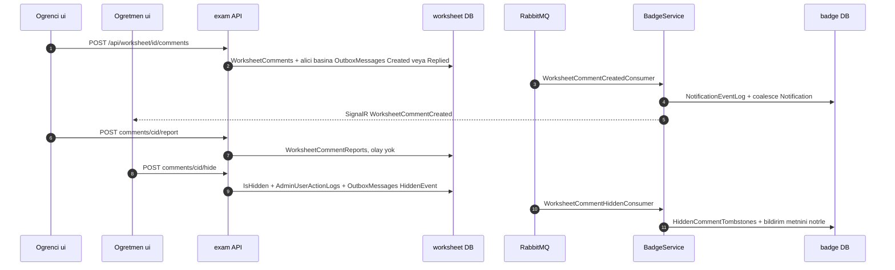

---

## 9. Bildirimler

**Özet:** Uygulama içi bildirimlerin tamamını **BadgeService**'teki consumer'lar üretir. Her consumer önce badge DB'deki `Notifications` tablosuna bir satır yazar, ardından `IHubContext<BadgeNotificationHub>` ile `Clients.User(keycloakSub)`'a push yapar. UI zil sayacını REST'ten okur. Push gelince sayacı yeniler ve gerekiyorsa snackbar gösterir. **E-posta gönderimi yoktur.**

1. **Üreticiler.** Bildirim yazan consumer'lar ve tetikleyen olaylar:

| Consumer | Olay | Push adı |
|---|---|---|
| `BadgeEvaluator` (consumer değil, `AnswerSubmittedConsumer` içinden çağrılır) | `AnswerSubmittedEvent` | `BadgeEarned` |
| `WorksheetAccessRequestedConsumer`, `WorksheetAccessDecisionConsumer` | `WorksheetAccessRequest*Event` | `AccessRequestUpdate` |
| `WorksheetReminderDueConsumer` | `WorksheetReminderDueEvent` | `ReminderDue` |
| `TeacherApplicationSubmittedConsumer`, `TeacherSchoolRequestSubmittedConsumer` | başvuru olayları | Admin grubu |
| `TeacherApplicationDecisionConsumer` | `TeacherApplicationDecidedEvent` | öğretmene |
| `BookingRequestCreatedConsumer`, `BookingDecisionConsumer`, `BookingTeacherUnavailableConsumer` | booking olayları | `BookingUpdate` |
| `WorksheetCommentCreatedConsumer`, `WorksheetCommentRepliedConsumer` | yorum olayları | `WorksheetCommentCreated` / `…Replied` |

   Bildirim metinleri kullanıcının diline göre üretilir: `Services/BadgeService/Services/NotificationTextFactory.cs` ve `UserLocaleResolver.cs`. Dil bilgisi `UserLocalePreferences` tablosundan gelir (bkz. 10.4).
2. **Saklama** (badge DB):
   - Tablo `Notifications` (`Services/BadgeService/BadgeDbContext.cs:18`), entity `Services/BadgeService/Entities/Notification.cs:9`.
   - Index'ler: (UserKeycloakId, IsRead, CreatedAt) (`:115-116`), unique (Type, SourceEventId) (`:139-142`), yorum birleştirme için unique-unread (`:152-155`).
   - Yardımcı tablolar `NotificationEventLogs` (`:23`) ve `HiddenCommentTombstones` (`:24`).
   - Eski kayıtları silen servis: `Services/BadgeService/Services/NotificationEventLogRetentionService.cs`.
3. **REST.** `Services/BadgeService/Controllers/NotificationsController.cs`, `[Route("api/notifications")]` (`:17`), gateway'de `/api/badge/notifications/...`:
   - `GET me?unreadOnly&take` (`:34-57`)
   - `GET me/unread-count` (`:61`)
   - `POST {id}/read` (`:73`)
   - Tüm sorgular `UserKeycloakId == sub` ile filtrelenir (`:46`, `:68`, `:82`). "Tümünü okundu yap" ucu ve sayfalama yoktur.
4. **Realtime.** Hub `Services/BadgeService/Hubs/BadgeNotificationHub.cs:14` (`[Authorize]`, admin grubu `:20`). Map `Services/BadgeService/Program.cs:316`. Query token okuma `:181-188`.
5. **UI.**
   - `ui/src/app/services/signalr.service.ts`: `BadgeEarned` `:108`, `AccessRequestUpdate` `:115`, `ReminderDue` `:123`, `TeacherApplication*` `:133,167`, `TeacherSchoolRequestSubmitted` `:150`, yorum olayları `:187-188`, `BookingUpdate` `:193` (bu sonuncusu yalnızca sayacı yeniler).
   - `ui/src/app/services/notification.service.ts`: `list` `:23`, `refreshUnreadCount` `:29`, `markRead` (iyimser güncelleme) `:39-48`.
   - Zil: `enhanced-layout.component.ts:404-416`, şablon `enhanced-layout.component.html:192`.
   - Sayfa: route `/notifications` (`ui/src/app/app.routes.ts:120`) → `ui/src/app/pages/notifications/notifications.component.ts:96,138`. Metin ve derin link `notification-format.ts:79`.
6. **E-posta.** Exam API, auth-api, BadgeService ve Gateway'de SMTP/MailKit/`IEmailSender` kullanımı yoktur (grep ile doğrulandı). Tek SMTP ayarı Keycloak realm'inin kendi e-postaları içindir: `smtpServer`, `deploy/keycloak/dev-import/realm-export.json:1822-1830`. `finance-api/finance-api/Services/EmailService.cs` ayrı bir ürüne aittir.

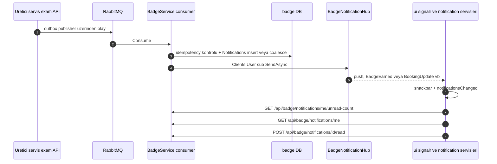

---

## 10. Ek akışlar: günün soruları, pratik modu, hatırlatma, dil değişimi

### 10.1 Günün soruları (#99)

**Özet:** Her öğrenciye, her gün için deterministik bir soru seti seçilir. Gün sınırı Europe/Istanbul saatine göredir. Set çözülürken her cevap, worksheet'teki gibi bir `AnswerSubmittedEvent` üretir. Yani günün soruları da puan ve rozet kazandırır.

1. **UI.**
   - Dashboard kartı `ui/src/app/pages/dashboard/dashboard.component.html:10-11`. Veri `dashboard.component.ts:282-296` içinde yüklenir. "Başla" butonu `/practice?daily=1` adresine gider (`:298-299`).
   - `practice-solve` komponenti `?daily=1` modunu tanır (`ui/src/app/pages/practice-solve/practice-solve.component.ts:293-296`). Ardından sırayla `loadDaily` (`:793`), `startDaily` (`:828`) ve `finishDaily` (`:912`) çalışır.
2. **API.** `api/ExamApp.Api/Controllers/PracticeController.cs:70-79` (`GET daily`) ve `:85-96` (`POST daily/start`). Rate limit `api/ExamApp.Api/Program.cs:367` içinde.
3. **Set servisi.** `api/ExamApp.Api/Services/Practice/DailyQuestionSetService.cs`:
   - `GetTodayAsync` (`:41`) ve `StartTodayAsync` (`:68`).
   - Set öğrenci ve gün bazlı bir seed ile seçilir (`:158-170`).
   - Varsayılanlar: N=5 soru, 14 günlük dışlama penceresi (`DailyQuestionsOptions.cs:12,19`). Gün hesabı `api/ExamApp.Api/Services/Dashboard/LocalDayCalendar.cs:18` içinde.
   - **Tablolar:** `DailyQuestionSets`, `DailyQuestionSetItems`.
4. **Cevap olayı.** `PracticeSessionService.SubmitDailyAnswerAsync` (`api/ExamApp.Api/Services/Practice/PracticeSessionService.cs:401`):
   - Olay yalnız şu üç koşul birlikte sağlanınca üretilir: cevap atlanmamış, set bugüne ait, soru setin canlı listesinde (`:405-407`).
   - Koşullu yazma `WHERE AnsweredAt IS NULL` (`:430-445`).
   - Outbox satırını `BuildDailyAnswerOutbox` kurar (`:521-555`). Bu olayda **`TestInstanceId = -sessionId`** olur (`:536`). Negatif değer, BadgeService'teki (TestInstanceId, QuestionId) anahtarında worksheet instance'larıyla çakışmayı önler. `Revision = 1` (`:545`).

### 10.2 Pratik modu

- **UI.** Route `/practice` (`ui/src/app/app.routes.ts:207-210`). Servis `ui/src/app/services/practice.service.ts:27-72`.
- **API.** `api/ExamApp.Api/Controllers/PracticeController.cs:20-22` (`api/practice`, yalnız Student): oturum `:48`, sonraki soru `:145`, cevap `:166-186`, bitirme `:188`.
- **Servis.** `PracticeSessionService.SubmitAnswerAsync` (`:264`):
  - `TimeTaken` değerini 3600 ile sınırlar (`:305`).
  - **Serbest pratik olay üretmez** (`:308-317`). Bu yüzden puan ve rozet kazandırmaz. Yalnızca günlük sete bağlı cevaplar olay üretir (10.1).
- **Tablolar:** `PracticeSessions`, `PracticeSessionQuestions`.

### 10.3 Hatırlatma (WorksheetReminderDueEvent)

1. **UI.** `worksheet-detail.component.ts:535` → `PUT /api/exam/worksheet/{id}/reminder` (`ui/src/app/services/test.service.ts:72-73`).
2. **API.** `ExamController.cs:82-96` → `WorksheetReminderService.UpsertAsync` (`api/ExamApp.Api/Services/Worksheets/WorksheetReminderService.cs:50`). Servis **Hangfire** ile bir job planlar: `_jobs.Schedule<IWorksheetReminderDispatcher>(…)` (`:76-78`), çalışma zamanı `ScheduledFor - RemindBeforeMinutes`. Önceki job varsa iptal edilir (`:66-67`). Hangfire kurulumu `api/ExamApp.Api/Program.cs:381-393` içinde.
3. **Dispatcher.** `api/ExamApp.Api/Services/Worksheets/IWorksheetReminderDispatcher.cs:41-90`, `[AutomaticRetry(Attempts = 3)]`:
   - Hatırlatma `Pending` değilse çıkar (`:55-61`).
   - **`WorksheetReminderDueEvent`** outbox satırını yazar (`:75-80`).
   - Durumu `Sent` yapar (`:82`).
   - Hepsi tek `SaveChanges` içinde (`:85`).
4. **Consumer.** `Services/BadgeService/Consumers/WorksheetReminderDueConsumer.cs:45`:
   - (Type, SourceReminderId) üzerinden idempotent çalışır (`:51-57`).
   - `Notification` yazar (`:84-88`).
   - `ReminderDue` push'unu gönderir (`:101`).
5. **UI.** `signalr.service.ts:123-131` bir snackbar gösterir. Snackbar'daki aksiyon `/test/{worksheetId}` sayfasına gider.

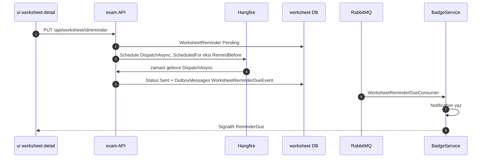

### 10.4 Dil (locale) değişimi

1. **Saklama.**
   - Sunucu tarafı: identity DB'deki `Users.PreferredLocale` (`auth-api/Data/AppDbContext.cs:48`). DB varsayılanı `tr` (`:135-138`).
   - İstemci tarafı: `localStorage['app-locale']` (`ui/src/app/services/locale.service.ts:13,62`).
2. **Değişim.**
   - Dil seçici `ui/src/app/shared/components/language-switcher/language-switcher.component.ts:40` → `LocalePreferenceService.persistPreference` (`ui/src/app/services/locale-preference.service.ts:36-62`) → `PUT /api/auth/me/locale` (`:44`).
   - auth-api tarafında `UpdatePreferredLocale` çalışır (`auth-api/Controllers/AuthController.cs:736-798`). Değeri `SupportedLocales` ile normalize eder (`api/ExamApp.Foundation/Localization/SupportedLocales.cs:19`; desteklenenler `tr` ve `en`).
   - Değer gerçekten değiştiyse **`UserPreferredLocaleChangedEvent`** outbox satırını yazar (`:774-793`).
   - UI ardından `POST /api/exam/auth/refresh` ile Redis'teki profili tazeler.
3. **Consumer.** `identity-outbox-publisher` olayı yayınlar. BadgeService'teki `UserPreferredLocaleChangedConsumer` (`Services/BadgeService/Consumers/UserPreferredLocaleChangedConsumer.cs:37-90`) **`UserLocalePreferences`** tablosunda upsert yapar ve eski sürüm olayları yok sayar. Bildirim metinleri bu tercihle üretilir (bkz. 9).
4. **İstek dili.** `/api/` çağrılarının hepsi `Accept-Language` başlığı taşır (`ui/src/app/shared/interceptors/locale.interceptor.ts:20-31`). Giriş sırasında Keycloak'a da `ui_locales` gönderilmesi amaçlanmıştı (1.1 adım 2), ama bu parametre yolda düşüyor (aşağıdaki issue adaylarına bakın).

i18n çalışma biçimi için bkz. [../../docs/i18n-migration.md](../../docs/i18n-migration.md) ve [08-gelistirme-pratikleri.md](08-gelistirme-pratikleri.md).

---

## Ayrı issue adayları

Bu bölümdeki bulgular akışları izlerken çıktı. Hiçbiri düzeltilmedi. `gh issue list --state all --search` ile önceden açılmış bir issue arandı. Bulunanların numarası yazıldı, bulunamayanlar "yok" olarak işaretlendi.

| # | Ne | Nerede | Neden sorun | Mevcut issue |
|---|---|---|---|---|
| 1 | Tamamlanmış testte cevap değiştirilebiliyor | `api/ExamApp.Api/Services/Worksheets/TestSessionService.cs:376-384` | `SaveAnswer` instance'ın `Status` alanına bakmıyor. Test bitince doğru cevaplar gösteriliyor (`:268-271`). Öğrenci bunları görüp yeniden `save-answer` gönderirse `AnswerRevision` artar ve BadgeService puan farkını uygular. Sonuç: puan ve rozet istismarı. | yok |
| 2 | Yeniden planlanan hatırlatma bildirim üretmiyor | `api/ExamApp.Api/Services/Worksheets/WorksheetReminderService.cs:148`, `Services/BadgeService/Consumers/WorksheetReminderDueConsumer.cs:51-57` | Aynı `ReminderId` tekrar kullanılıyor, consumer ise (Type, SourceReminderId) ile tekilleştiriyor. İkinci hatırlatma sessizce düşüyor. | yok |
| 3 | Tamamlanmış worksheet'e tekrar başlanınca yeni instance açılıyor | `TestSessionService.cs:112-127` | `EndTime == null` filtresi "alreadyCompleted" dalına hiç girilmemesine yol açıyor. Puanlar instance bazlı olduğu için tekrar çözmek yeniden puan kazandırıyor. Bu davranışın kasıtlı olup olmadığı belli değil. | yok |
| 4 | Worksheet cevabında `TimeTaken` ve `SelectedAnswerId` sınırsız | `api/ExamApp.Api/Models/Dtos/SaveAnswerDto.cs:11`, `TestSessionService.cs:480` | Pratik modunda bu değerler kontrol ediliyor (`PracticeSessionService.cs:299,305`), worksheet yolunda edilmiyor. | yok |
| 5 | question-detector'a gateway'de auth yok | `Services/Gateway/ocelot.json:39-49`, `question-detector/main.py:246-330` | `/send-to-fix` diske yazıyor ve kilitsiz JSON'a ekliyor. Anonim istekler diski doldurabilir ve eğitim verisini kirletebilir. Admin kontrolü yalnızca istemcide (`question-canvas.component.ts:832`). | yok |
| 6 | `/img/*` route'unda auth yok ve POST açık, bucket'lar anonim okunabilir | `Services/Gateway/ocelot.json:270-285`, `api/ExamApp.Api/Services/MinIOService.cs:142-157` | Herkese açık okuma ve yazma yüzeyi oluşuyor. Ayrıca `api/ExamApp.Api/appsettings.json:81-82` içinde MinIO kimlik bilgileri literal olarak duruyor (değer burada yazılmadı). | #238'e bakılmalı, kapsamı belirsiz |
| 7 | AI sınıflandırması öğretmenin etiketini ezebiliyor | `api/ExamApp.Api/Services/QuestionService.cs:703`, `Services/BadgeService/Consumers/QuestionCreatedConsumer.cs:38-42`, `api/ExamApp.Api/Services/Questions/QuestionClassificationService.cs:176-180` | UI hiç `ClassificationSource` göndermiyor, bu yüzden her soru "Human" oluyor. Consumer yalnız "AI" olanları atlıyor. Gemini boş `subTopicIds` dönerse mevcut alt konu eşlemeleri siliniyor. | yok |
| 8 | Gemini API anahtarı URL query'sinde | `Services/BadgeService/Services/GeminiQuestionClassifier.cs:192`, `api/ExamApp.Api/Services/Classifier/ClassifierCacheService.cs:185` | Anahtar HttpClient veya proxy loglarına düşebilir. | yok |
| 9 | Detector hata döndürünce UI'da TypeError oluşuyor | `ui/src/app/pages/image-selector/image-selector.component.ts:1852-1854`; olmayan uç `ui/src/app/services/question-detector.service.ts:17` (`/headerlist`) | Detector hatada 200 ve `{success:false}` döner. UI `predictions.map` okumaya çalışıp çöker ve `inProgress` true olarak kalır. | yok |
| 10 | Worksheet "create" isteği aynı adlı kaydı sessizce güncelliyor, UI `success` alanına bakmıyor | `api/ExamApp.Api/Services/Worksheets/WorksheetAuthoringService.cs:363-421,466`, `ui/src/app/pages/test-create-enhanced/test-create-enhanced.component.ts:656-670` | Kullanıcı `/exam/undefined` adresine yönlenebiliyor. `ex.Message` istemciye dönüyor. | yok |
| 11 | Görünürlük daraltılınca talep eden öğretmene bildirim gitmiyor | `WorksheetAuthoringService.cs:639-674`, `WorksheetAccessRequestService.cs:304-329` | İzinler ve bekleyen talepler olay üretilmeden iptal ediliyor. Talep eden öğretmen durumu öğrenemiyor. | yok |
| 12 | `ui_locales` gateway'de düşüyor | `Services/Gateway/Program.cs:213-217` | `/oidc-login` middleware'i gelen query'yi taşımıyor. Keycloak giriş ekranı kullanıcının dilinde açılmıyor (#186 amacı). | yok |
| 13 | Okul talebi olmayan, bağımsız da olmayan yeni öğretmen admin'e hiç bildirilmiyor | `api/ExamApp.Api/Services/TeacherService.cs:285-286` | Üç publish bayrağı da false kalıyor, öğretmen ise Pending'de bekliyor. | yok |
| 14 | Veli kaydında dışlayıcılık kontrolü yok | `api/ExamApp.Api/Controllers/ParentController.cs:46,60` | Öğrenci veya öğretmen Parent rolüne geçebiliyor (`SetRoleAsync` diğer rolleri siliyor). Rol, cookie kontrolünden önce atanıyor. | yok |
| 15 | Kayıt yanıtında `profileId` tutarsız | `StudentController.cs:246-251`, `TeacherController.cs:155`, `ParentController.cs:82`, `auth-ui/src/app/pages/complete-profile/complete-profile.component.ts:289-290` | Öğrenci ve öğretmen auth user id dönüyor, veli Parents id dönüyor. auth-ui ikisini aynı alana yazıyor. | yok |
| 16 | Login yanıtında olmayan `profile` alanı okunuyor | `auth-ui/src/app/services/auth.service.ts:79-84`, `ui/src/app/services/auth.service.ts:119-125,301-307` | Sunucudaki dil tercihi yeni cihazda istemciye uygulanmıyor. | yok |
| 17 | Keycloak üzerinden kayıt olan kullanıcı için dil olayı yazılmıyor | `auth-api/Controllers/AuthController.cs:604-634` | Kullanıcı dilini değiştirene kadar BadgeService'te `UserLocalePreferences` satırı oluşmuyor. | yok |
| 18 | Booking talebi bildirimi öğretmene ulaşmayabilir | `Services/BadgeService/Consumers/BookingRequestCreatedConsumer.cs:71`, `api/ExamApp.Api/Services/Bookings/BookingService.cs:488` | auth-api lookup'ı başarısız olursa `UserKeycloakId=null` yazılıyor. `NotificationsController` `sub` ile filtrelediği için bildirim görünmüyor. Diğer booking consumer'ları `NotificationRecipientResolver` kullanıyor. | yok |
| 19 | "Onaylı öğretmen" tanımı yerden yere farklı | `BookingService.cs:377`, `TeacherService.cs:1278,1342` ile `BookingService.cs:458-460` karşılaştırması | Slot listesi, arama ve profil `AccountApprovedAt` alanına bakmıyor, booking oluşturma bakıyor. Öğrenci slotu görüyor ama talepte 404 alıyor. | yok |
| 20 | Tekrarlayan slotlar yalnızca öğretmen kendi listesini açınca üretiliyor | `BookingService.cs:281` ile `:371` karşılaştırması | Öğretmen sayfasını açmazsa öğrenciler bir süre sonra slot görmez. | yok |
| 21 | Geçmiş tarihli talep onaylanabiliyor | `BookingService.cs:703-835` | `DecideAsync` zaman kontrolü yapmıyor. | yok |
| 22 | İstemcideki katılım penceresi koda gömülü | `ui/src/app/shared/utils/booking-join-window.ts:10,13` ile `api/ExamApp.Api/Services/Video/VideoOptions.cs:20,24` karşılaştırması | Config değişirse "Katıl" butonu ile sunucu farklı davranır. | yok |
| 23 | Whiteboard yalnız bellekte ve tek instance'ta | `api/ExamApp.Api/Services/Whiteboard/WhiteboardStore.cs:103-135` | Restart'ta sahne kayboluyor. Backplane olmadığı için yatay ölçeklenmiyor. | #311 (kaynak sınırları) ile ilişkili |
| 24 | Hub allowlist'i prefix eşlemesi yapıyor | `Services/Gateway/HubWebSocketAuthExtensions.cs:22` | `/hub/badges/x` middleware'den geçip catch-all route'a düşüyor. Ocelot route'ları ise tam eşleme yapıyor. | #311 |
| 25 | Yorum gizliliği kaldırılınca (unhide) BadgeService tarafı geri alınmıyor, rapor eşiği yok | `api/ExamApp.Api/Services/Worksheets/WorksheetCommentService.cs:596` | Nötrlenmiş bildirim ve tombstone kalıyor. Raporlar otomatik moderasyonu tetiklemiyor. | yok |
| 26 | SignalR bildirim istemcisi yeniden bağlanmıyor | `ui/src/app/services/signalr.service.ts:91-105` | `withAutomaticReconnect` yok. Ağ kopunca push'lar sayfa yenilenene kadar kayboluyor. `pages/layout/layout.component.ts:159` de `startConnection` çağırıyor. | yok |
| 27 | BadgeService'te RabbitMQ `guest` fallback'i duruyor | `Services/BadgeService/Program.cs:234-235` | Exam API'de fallback yok, eksik ayarda hızlıca hata veriyor. BadgeService ise sessizce `guest` ile devam ediyor. | yok |
| 28 | Gün sınırı tutarsız | `Services/BadgeService/Services/AnswerSubmissionAggregationService.cs:366` ile `api/ExamApp.Api/Services/Dashboard/LocalDayCalendar.cs:18` karşılaştırması | Günün soruları Istanbul gününü, seri (streak) hesabı UTC gününü kullanıyor. | yok |
| 29 | auth-ui callback `state` ile açık yönlendirme yapıyor, PKCE yok | `auth-ui/src/app/pages/callback/callback.component.ts:82` | — | #347 |

Not: Agent hafızalarındaki bazı notlar koddan geride kalmış. Örnekler: `dotnet-api-dev/leaderboard-points-source.md` "StudentPoints'i kimse yazmıyor" diyor, oysa #225 ile consumer eklendi. `practice-answer-event-negative-instance-id.md` metot adlarını eski haliyle veriyor. Bu dosyadaki referanslar koda göre yazıldı.

## Doğrulanmadı

- Jitsi moderatör affiliation'ının (`mod_auth_token`) gerçek bir odada çalıştığı test edilmedi. `docs/jitsi-video.md` de bunu doğrulanmamış olarak işaretliyor.
- Akışlar çalışma zamanında (Aspire/compose ayağa kaldırılarak) uçtan uca denenmedi. Adımlar koddan okundu. Keycloak kayıt sayfasının `registrations` ucuyla açıldığı ve kayıttan sonra callback'e döndüğü realm ayarına bağlıdır, canlı olarak doğrulanmadı.
- Gemini sınıflandırmasının gerçek yanıt biçimi ve `cachedContents` davranışı canlı olarak doğrulanmadı.
- Satır referanslarının büyük kısmı paralel arama agent'ları tarafından `grep -n` ile toplandı. Örneklem olarak yaklaşık 40 tanesi elle yeniden kontrol edildi ve tutarlı çıktı. Geri kalanlarda ±birkaç satırlık kayma olabilir: aralık verilen yerlerde ilk satır çoğu zaman attribute satırıdır.
