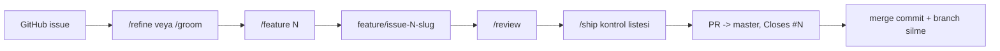
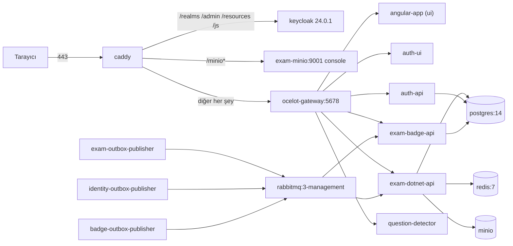

# 08 — Geliştirme pratikleri

**Bu dosya neyi anlatır:** Kodu değiştirmeye başlamadan önce bilmen gereken günlük çalışma düzeni:
branch/PR akışı (gerçek git geçmişinden çıkarıldı), `.claude/` agent ekibi (agent'lar, komutlar,
skill'ler, hook'lar, izinler), `.github/` (Copilot talimatları ve CI/CD workflow'ları), testlerin
nasıl çalıştırıldığı ve bilinen tuzakları (xUnit, IntegrationTests, Karma, k6), `deploy/` altındaki
prod topolojisi, i18n (yeni metin ekleme reçetesi) ve kod stili. Ortamı ayağa kaldırma
[02-ortam-kurulumu.md](02-ortam-kurulumu.md)'de, port haritası
[`.claude/rules/local-dev.md`](../../.claude/rules/local-dev.md)'de; burada tekrar edilmez.

## İçindekiler

1. [Branch ve PR akışı](#1-branch-ve-pr-akışı)
2. [`.claude/` — agent ekibi](#2-claude--agent-ekibi)
   - [2.1 CLAUDE.md ve rules/](#21-claudemd-ve-rules)
   - [2.2 Agent'lar](#22-agentlar)
   - [2.3 Slash komutları](#23-slash-komutları)
   - [2.4 Skill'ler](#24-skilller)
   - [2.5 Hook'lar](#25-hooklar)
   - [2.6 graft yardımcıları, statusline ve MCP](#26-graft-yardımcıları-statusline-ve-mcp)
   - [2.7 settings.json izinleri](#27-settingsjson-izinleri)
   - [2.8 Agent hafızaları](#28-agent-hafızaları)
3. [`.github/` — Copilot ve CI/CD](#3-github--copilot-ve-cicd)
4. [Test çalıştırma](#4-test-çalıştırma)
   - [4.1 xUnit birim testleri](#41-xunit-birim-testleri)
   - [4.2 IntegrationTests (Testcontainers)](#42-integrationtests-testcontainers)
   - [4.3 Karma (ui, auth-ui)](#43-karma-ui-auth-ui)
   - [4.4 Kilitli bin/ tuzağı ve diğer tuzaklar](#44-kilitli-bin-tuzağı-ve-diğer-tuzaklar)
   - [4.5 k6 yük testleri ve automation/](#45-k6-yük-testleri-ve-automation)
5. [Deploy](#5-deploy)
6. [i18n](#6-i18n)
7. [Kod stili](#7-kod-stili)
8. [Doğrulanmadı](#8-doğrulanmadı)
9. [Ayrı issue adayları](#9-ayrı-issue-adayları)

---

## 1. Branch ve PR akışı

### Gerçek pratik (git geçmişinden)

`git log --merges` 1738 satır üretiyor; bunların 177'si GitHub PR merge commit'i
(`Merge pull request #N from mustafa-sahin-tr/<branch>`), geri kalanı branch'e master'ı çeken
"Merge branch 'master' into feature/..." commit'leri. PR branch öneklerinin dağılımı:

| Önek | Adet | Örnek |
|---|---|---|
| `feature/issue-<N>-<slug>` | 136 | `feature/issue-99-gunun-sorulari-ui` (PR #350) |
| `fix/...` | 11 | `fix/gateway-hub-websocket-scheme` (PR #325) |
| `feat/...` | 9 | `feat/test-list-redesign` (eski) |
| `claude/<rastgele>` | 9 | `claude/blissful-pasteur-kkcc5o` (PR #283–#296, web oturumundan) |
| `chore/...` | 1 | `chore/graft-init` (PR #297) |

Kurallar (son 15 merge edilmiş PR'dan, `gh pr list --state merged`):

- **Hedef branch her zaman `master`.** Repo'nun varsayılan branch'i `master`; `main` yok.
- **Branch adı:** `feature/issue-<N>-<türkçe-karaktersiz-kısa-slug>`. Bir issue birden fazla PR'a
  bölünürse aynı numara farklı slug'la tekrar kullanılır (`feature/issue-99-gunun-sorulari-api` →
  PR #349, `...-ui` → PR #350). Takip issue'ları bazen ana issue'nun numarasıyla açılır
  (`feature/issue-305-bildirim-birlestirme`, PR #329, aslında #105'in takibi).
- **PR başlığı:** Türkçe, conventional-commit önekli, sonunda issue numarası:
  `fix(booking): askıdaki öğretmende Pending talep kalmasın #331`. Dilimlenmiş işlerde
  `(#99 dilim 1)` gibi not düşülür.
- **Commit mesajı:** İngilizce conventional commit + `#N` (ör. `fix(availability): DB duration check
  constraints and per-teacher write lock #323`).
- **PR gövdesinde `Closes #N`:** son 15 PR'ın 11'inde var. Dilimli işlerin ara PR'larında (ör. #349,
  #346, #330, #329, #327) bilerek konmamış — issue son dilimde kapanır.
- **Merge yöntemi:** merge commit (squash/rebase değil); `gh pr merge --merge --delete-branch`.

### `/feature` komutunun tarif ettiği akış

[`.claude/commands/feature.md`](../../.claude/commands/feature.md) akışı adım adım tanımlar:
plan → `grilling` ile planı sorgulama (`feature.md:41`) → onay → branch
(`feature.md:46-55`: worktree kullanılmaz, `git checkout -b feature/issue-$ARGUMENTS-<slug>`) →
backend → frontend → test → paralel review → rapor → onaylı PR (`feature.md:87-93`, gövdenin son
satırı `Closes #$ARGUMENTS`; açık bulgu varsa `--draft`).

> Dikkat: `feature.md:87` PR'ı `gh pr create --base main` ile açmayı söylüyor ama repoda `main`
> yok; gerçek PR'ların hepsi `master`'a. Komutu kullanırken `--base master` ver (bkz. Ayrı issue adayları).

### `scripts/ship_branch.sh`

Tek komutla commit + push + PR + merge + yerel master güncelleme yapar
([`scripts/ship_branch.sh`](../../scripts/ship_branch.sh), 140 satır). Adımlar:

1. Branch'e geç (yoksa hata) → değişiklik varsa onaylı stage + commit.
2. `git push -u origin <branch>`.
3. `gh pr create --fill` (`ship_branch.sh:113`) — başlık/gövde commit'lerden türetilir.
4. Branch adından issue numarasını çıkarıp gövdede yoksa `Closes #N` ekler (`ship_branch.sh:117-125`).
5. Onayla `gh pr merge --merge --delete-branch` (`ship_branch.sh:133`), sonra `git checkout master && git pull origin master`.

`-y/--yes` tüm onayları atlar. Kullanım: `scripts/ship_branch.sh [-y] [branch] [mesaj]`.

> Tuzak: numara çıkarma regex'i `^issue-[0-9]+` (`ship_branch.sh:119`); branch'ler
> `feature/issue-N-...` olduğundan eşleşmez ve `Closes #N` **eklenmez**. Ayrıca dosyanın içindeki
> başlık yorumu `ship-branch.sh` diyor (`ship_branch.sh:2`), gerçek dosya adı `ship_branch.sh`.
> `scripts/` altındaki diğer iki betik (`compare_folders.sh`, `remove_small_folders.sh`) geliştirme
> akışıyla ilgili değil.



---

## 2. `.claude/` — agent ekibi

Genel tasarım [`.claude/README.md`](../../.claude/README.md)'de anlatılıyor: *bilgi* → `rules/`,
*prosedür* → `skills/`, *rol ve izolasyon* → `agents/`, *asla ihlal edilmemesi gereken* → `hooks/`.
Ana oturum "tech lead"dir, kod yazmaz, devreder. README'deki sayılar (11 agent, 18 skill, 7 komut,
3 hook — `.claude/README.md:3-4`) bugün kısmen eski: 11 agent, **21** skill klasörü, 7 komut, 3 hook
script'i + 5 graft hook kaydı var.

### 2.1 CLAUDE.md ve rules/

Repo kökünde `CLAUDE.md` **yok**; tek dosya [`.claude/CLAUDE.md`](../../.claude/CLAUDE.md) (53 satır).
İçeriği: rules dosyalarının listesi (`.claude/CLAUDE.md:5-10`), agent tablosu (`:16-28`), "yazan agent
ile inceleyen agent aynı olmaz" kuralı (`:30-31`), hangi komutun ne zaman kullanılacağı (`:33-37`),
proje-özel ve üçüncü parti skill listeleri (`:41-53`).

| Dosya | Satır | İçerik | `alwaysApply` |
|---|---|---|---|
| [`architecture.md`](../../.claude/rules/architecture.md) | 13 | Servis haritası; BadgeService isim uyarısı (`:9`), `StudentPointsChangedEvent` istisnası (`:12`) | true |
| [`stack.md`](../../.claude/rules/stack.md) | 12 | Teknoloji yığını | true |
| [`workflow-rules.md`](../../.claude/rules/workflow-rules.md) | 15 | Outbox zorunlu (`:6`), BadgeService'e handler ekleme (`:7`), EF migration komutları (`:8-14`), gateway route (`:15`) | true |
| [`local-dev.md`](../../.claude/rules/local-dev.md) | 202 | Docker-compose başlatma, port haritası (`:162`), servisleri Docker'sız çalıştırma | — |
| [`project-structure.md`](../../.claude/rules/project-structure.md) | 41 | Servis içi dizin yapısı | — |
| [`angular-conventions.md`](../../.claude/rules/angular-conventions.md) | 47 | Standalone, `inject()`, signal, Material, CSS token; yalnız `ui/**` glob'unda (`:4-7`) | false |

### 2.2 Agent'lar

Hepsi `.claude/agents/<ad>.md` frontmatter'ından okundu.

| Agent | Rol | Araçlar | Model | `memory` | Önyüklenen skill'ler |
|---|---|---|---|---|---|
| `dotnet-api-dev` | C# backend: controller, service, DTO, EF entity | Read, Edit, Write, Grep, Glob, Bash | opus | project | dotnet-endpoint, ef-migration, efcore-patterns, database-performance, csharp-coding-standards, microsoft-extensions-dependency-injection |
| `angular-dev` | `ui/` ve `auth-ui/` sayfa/komponent/servis | Read, Edit, Write, Grep, Glob, Bash | opus | project | angular-feature, angular-developer |
| `event-integration-dev` | Outbox, RabbitMQ, BadgeService consumer'ları | Read, Edit, Write, Grep, Glob, Bash | sonnet | project | outbox-event, ef-migration |
| `devops-aspire` | AppHost, docker-compose, port/env, deploy | Read, Edit, Write, Grep, Glob, Bash | sonnet | project | aspire-migration, aspire-integration-testing, aspire-configuration, aspire-service-defaults |
| `test-engineer` | xUnit + frontend testleri yazar/çalıştırır, yalnız başarısızları raporlar | Read, Edit, Write, Grep, Glob, Bash | haiku | — | testcontainers |
| `code-reviewer` | Kalite/mimari incelemesi, düzeltmez | Read, Grep, Glob, Bash | inherit | project | — |
| `security-reviewer` | authz, secret, injection, upload, event payload | Read, Grep, Glob, Bash | inherit | project | security-review-checklist |
| `ui-tester` | Tarayıcıda uçtan uca akış (Puppeteer) | `disallowedTools: Edit, Write` (geri kalan her şey) + inline `puppeteer` MCP | haiku | — | — |
| `business-analyst` | Issue detaylandırma, epic → alt issue | Read, Grep, Glob, Bash | sonnet | — | issue-refinement, issue-breakdown |
| `product-owner` | Önceliklendirme, MVP/kapsam kararı (YAP ŞİMDİ / SONRA / YAPMA) | Read, Grep, Glob, Bash | sonnet | — | — |
| `product-designer` | Maket/wireframe (Claude Design canvas), tasarım notu | Read, Grep, Glob, Bash, Write, Edit | sonnet | — | design-mockup |

Notlar:

- "Salt okunur" reviewer'larda `Edit`/`Write` yok ama `Bash` var; yani yapısal bir yazma engeli
  değil, talimat düzeyinde bir kural.
- `ui-tester` Puppeteer MCP'yi kendi frontmatter'ında tanımlar (`.claude/agents/ui-tester.md`,
  `mcpServers:` bloğu); böylece Puppeteer araçları ana oturumun context'ine girmez.
- Orkestrasyon sırası (`.claude/README.md` "Orkestrasyon deseni"): backend ve frontend **sıralı**
  (frontend gerçek DTO'ları bekler), iki reviewer **aynı turda paralel**.

### 2.3 Slash komutları

| Komut | Satır | Ne yapar | GitHub'a yazar mı |
|---|---|---|---|
| [`/feature <issue>`](../../.claude/commands/feature.md) | 97 | Issue → plan (+grilling) → onay → branch → `dotnet-api-dev` / `event-integration-dev` → `angular-dev` → `test-engineer` → iki reviewer paralel → rapor → onaylı commit/push/PR | Yalnız onayla (`gh pr create`, `gh issue comment`) |
| [`/review [odak]`](../../.claude/commands/review.md) | 15 | `git diff HEAD --stat` ile yüzeyi çıkarır, `code-reviewer` + `security-reviewer` paralel; çıktı Bloklayıcı → Düzeltilmeli → Öneri → Karar | Hayır, kod da düzeltmez |
| [`/ship`](../../.claude/commands/ship.md) | 23 | PR öncesi kontrol listesi: `dotnet build` (api) + `npx tsc --noEmit` (ui), testler (`test-engineer`), migration (yıkıcı mı), gateway route, config senkronu (`.env.example`, compose, ocelot, environment, local-dev.md), secret taraması, gerekirse security review; sonunda PR taslağı | Hayır; "commit veya push yapma" |
| [`/refine <issue>`](../../.claude/commands/refine.md) | 31 | `business-analyst` + `issue-refinement`: problem, hikaye, kabul kriteri, kapsam dışı, açık sorular; gerekirse `issue-breakdown` | Onayla `gh issue edit` / `create` |
| [`/mockup <issue>`](../../.claude/commands/mockup.md) | 30 | `product-designer` + `design-mockup`: `ui/src/styles.scss` token'larına uyan artboard'lar (dolu/boş/yükleniyor/hata) + tasarım notu | Onayla `gh issue comment` |
| [`/groom <issue>`](../../.claude/commands/groom.md) | 43 | PO önceliklendirir → BA detaylandırır/böler → tasarımcı maket → rapor; onaydan sonra epic gövdesi güncellenir, alt issue'lar `Part of #N` ile açılır. Kod yazılmaz | Onayla |
| [`/onboard <servis>`](../../.claude/commands/onboard.md) | 17 | `Explore` ile servis brifingi: sorumluluk, giriş noktaları, bağımlılıklar, veri akışı, riskli yerler; kalıcı bilgiyi `rules/`'a öneri olarak çıkarır | Hayır |

`/ship` adım 4 ve `workflow-rules.md:15` yalnız `ocelot.json`'u anar; gerçekte üç ocelot dosyası
var (bkz. [09-bilinen-sorunlar.md](09-bilinen-sorunlar.md) "Teknik borç").

### 2.4 Skill'ler

`.claude/skills/` altında 21 klasör var. Kaynak ve lisans:
[`.claude/skills/THIRD_PARTY_NOTICES.md`](../../.claude/skills/THIRD_PARTY_NOTICES.md).

**Projeye özel (bu repoya göre yazılmış):**

| Skill | Ne için | Kullanan |
|---|---|---|
| `dotnet-endpoint` | exam API'ye endpoint ekleme: controller, service, DTO, DI, gateway route | dotnet-api-dev |
| `ef-migration` | Migration üretme/uygulama/geri alma; migration'ı elle düzenlemeden önce okunur | dotnet-api-dev, event-integration-dev |
| `outbox-event` | Yeni domain event: outbox kaydı → OutboxPublisher → RabbitMQ → BadgeService consumer | event-integration-dev |
| `gateway-route` | Ocelot route ekleme/değiştirme, 404/401 araştırma | (ana oturum) |
| `angular-feature` | `ui/`'ye sayfa/komponent/servis: routing, signal state, Material, SCSS token | angular-dev |
| `aspire-migration` | docker-compose → Aspire taşıma stratejisi ve kırılma noktaları | devops-aspire |
| `security-review-checklist` | Keycloak authz, secret, upload, EF sorgusu, event payload, gateway | security-reviewer |
| `issue-refinement` | Ham issue'yu geliştirilebilir hale getirme | business-analyst |
| `issue-breakdown` | Epic'i dikey dilimlere bölme, alt issue açma | business-analyst |
| `design-mockup` | Token sistemine uyan maket + tasarım notu | product-designer |

**Araç/dış kaynaklı ama THIRD_PARTY_NOTICES'te listelenmeyen:**

| Skill | Not |
|---|---|
| `graft` | `@nanonets/graft` aracının kendi skill'i; repo `graft/` grafiği ile indekslenmiş varsayar. `graft/` klasörü `.gitignore:141-142` ile takip dışı, `graft build` ile yerelde üretilir |
| `grilling` | Planı soru turlarıyla sorgulama; `/feature` adım 1'de kullanılır (`feature.md:41`). Kaynağı Doğrulanmadı |

**Üçüncü parti referans (upstream'den aynen kopyalandı, otomatik güncellenmez):**

| Klasör | Frontmatter `name` | Kaynak / lisans | Kullanan |
|---|---|---|---|
| `angular-developer` | angular-developer | angular/skills (Google), MIT | angular-dev |
| `efcore-patterns` | efcore-patterns | Aaronontheweb/dotnet-skills, MIT | dotnet-api-dev |
| `database-performance` | database-performance | aynı | dotnet-api-dev |
| `csharp-coding-standards` | **modern-csharp-coding-standards** | aynı | dotnet-api-dev |
| `microsoft-extensions-dependency-injection` | **dependency-injection-patterns** | aynı | dotnet-api-dev |
| `aspire-integration-testing` | aspire-integration-testing | aynı | devops-aspire |
| `aspire-configuration` | aspire-configuration | aynı | devops-aspire |
| `aspire-service-defaults` | aspire-service-defaults | aynı | devops-aspire |
| `testcontainers` | **testcontainers-integration-tests** | aynı | test-engineer |

Kalın yazılan üç skill'de klasör adı ile frontmatter `name` farklı; agent frontmatter'ları klasör
adını kullanıyor (ör. `test-engineer` → `testcontainers`). Önyüklemenin hangi ada göre çözüldüğü
Doğrulanmadı. Üçüncü parti skill ile proje kuralı çakışırsa **proje kuralı önceliklidir**
(`.claude/rules/angular-conventions.md:40-47`, örn. upstream Tailwind önerir, biz Material + CSS
custom property kullanıyoruz).

### 2.5 Hook'lar

Kayıtlar [`.claude/settings.json`](../../.claude/settings.json) içinde (`PreToolUse` `:6`,
`PostToolUse` `:21`, `UserPromptSubmit` `:52`, `SessionStart` `:63`, `Stop` `:74`). Üç hook script'i
JSON'u `jq` ile, yoksa `python3` ile okur; ikisi de yoksa sessizce geçer.

| Hook | Olay / matcher | Ne zaman tetiklenir | Davranış |
|---|---|---|---|
| [`protect-migrations.sh`](../../.claude/hooks/protect-migrations.sh) | PreToolUse `Edit\|Write` | Yol `*/Migrations/*.cs` ise (`:17-22`) | exit 2 ile **bloklar**; `dotnet ef migrations remove` → entity düzelt → `migrations add` önerir |
| [`secret-guard.sh`](../../.claude/hooks/secret-guard.sh) | PreToolUse `Edit\|Write` | Dosya adı `.env`, `.env.local`, `.env.production` (`:19-25`); içerikte private key bloğu (`:30`); `password/secret/api_key/client_secret/access_token/connectionstring` + `=`/`:` + 8+ karakter (`:37-40`, placeholder'lar muaf) | exit 2 ile **bloklar**. `.env.example` serbest |
| [`dotnet-format.sh`](../../.claude/hooks/dotnet-format.sh) | PostToolUse `Edit\|Write` | Dosya `*.cs` ise (`:14`), en yakın `.csproj` bulunur | `dotnet format <proj> --include <dosya> --no-restore` (`:27`); hiçbir zaman bloklamaz |
| `graft-hooks.cjs post-edit` | PostToolUse `Write\|Edit\|MultiEdit` | Her düzenleme | graft grafiğini günceller (timeout 10 sn) |
| `graft-hooks.cjs tool-savings` | PostToolUse `Bash\|mcp__graft__\|Read\|Grep\|Glob` | Okuma araçları | graft istatistiği |
| `graft-hooks.cjs prompt` / `session-start` / `stop` | UserPromptSubmit / SessionStart / Stop | — | graft bağlamı enjekte eder |

`secret-guard.sh` isim tabanlıdır ve meşru kodda da tetiklenir (ör. `AccessToken = tokenData.AccessToken`,
test URL'lerinde `access_token=`). Agent hafızasındaki tavsiye: hook'u atlatma, değişkeni yeniden adlandır
veya URL'yi `QueryString.Create(...)` ile kur (`C:/Users/mustafa.sahin/examapp/.claude/agent-memory/dotnet-api-dev/secret-guard-accesstoken-false-positive.md`, repo dışı yerel hafıza).
`protect-migrations` ve `secret-guard` `MultiEdit`'i matcher'a almıyor.

### 2.6 graft yardımcıları, statusline ve MCP

- [`.claude/helpers/graft-hooks.cjs`](../../.claude/helpers/graft-hooks.cjs) ve
  [`graft-statusline.cjs`](../../.claude/helpers/graft-statusline.cjs) (67'şer satır): global
  `@nanonets/graft` paketinin `dist/claude/{hooks,statusline}.js` modülünü bulup çalıştırır; bulamazsa
  no-op. Arama sırası: sabit yol → proje `node_modules` → node'un `lib`'i → `npm root -g`
  (`graft-hooks.cjs:56-65`). İlk aday, önceki geliştiricinin makinesine ait mutlak bir Windows yolu
  (`graft-hooks.cjs:7`); başka makinede o aday boşa düşer, diğerleri denenir.
- `statusLine` ve `subagentStatusLine` (`settings.json:98-105`) graft statusline'ını kullanır.
- MCP: kök [`.mcp.json`](../../.mcp.json) yalnız `graft` sunucusunu (`npx -y @nanonets/graft mcp`)
  tanımlar. `settings.json:2-4` `enabledMcpjsonServers: ["puppeteer"]` diyor, ama `puppeteer` yalnızca
  [`.claude/.mcp.json`](../../.claude/.mcp.json)'da tanımlı. `ui-tester` zaten kendi inline tanımını
  kullanıyor.

### 2.7 settings.json izinleri

`settings.json:86-96`:

- **deny:** `Read(./.env)`, `Read(./**/appsettings.Production.json)` — agent'lar gerçek secret
  dosyalarını okuyamaz.
- **allow:** `Bash(graft:*)`, `Bash(npx graft:*)`, `Bash(graft-dev:*)`, `Bash(node dist/cli.js:*)`.

Komutların kendi `allowed-tools` listeleri de vardır (ör. `/feature` yalnız `gh issue view/comment`,
`git status/fetch/checkout/pull/add/commit/push`, `gh pr create` — `feature.md:4`).

### 2.8 Agent hafızaları

`memory: project` olan agent'lar öğrendiklerini `.claude/agent-memory/<agent>/` altında biriktirir.
Repoda üç yerde dağınık kopyalar var (agent'ın çalışma dizinine göre oluşmuşlar):
`ui/.claude/agent-memory/`, `ui/src/app/.claude/agent-memory/`, `api/ExamApp.Api/.claude/agent-memory/`.
Asıl ve en güncel set önceki geliştiricinin yerel klonundaki `.claude/agent-memory/` (repo kökünde,
commit'lenmemiş). Test tuzakları (bölüm 4.4) bu hafızalardan derlendi.

---

## 3. `.github/` — Copilot ve CI/CD

### Copilot dosyaları

| Dosya | İçerik | Durum |
|---|---|---|
| [`copilot-instructions.md`](../../.github/copilot-instructions.md) (55 satır) | Proje özeti, servis sınırları, geliştirici komutları | Kısmen eski: backend test komutu `cd api/ExamApp.Tests && dotnet test` (`:27`) — böyle bir klasör yok, testler `tests/` altında |
| [`copilot/context.md`](../../.github/copilot/context.md), [`conventions.md`](../../.github/copilot/conventions.md), [`project-overview.md`](../../.github/copilot/project-overview.md) | Dizin yapısı; Angular kuralları (`ms-` CSS öneki, `on` önekli output'lar) | Bilgi amaçlı |
| [`copilot/study.md`](../../.github/copilot/study.md) | "Ders Çalışma" feature backlog tablosu (FEAT10…) | Tarihî |
| [`agents/front-end-designer.agent.md`](../../.github/agents/front-end-designer.agent.md) | Copilot custom agent; `.agents/skills/front-end-designer/SKILL.md`'yi izler | — |
| [`agents/Reviewer.agent.md`](../../.github/agents/Reviewer.agent.md) | Copilot review agent'ı (description şablon metni kalmış) | — |

### Workflow'lar

> **Önemli:** Repoda **build/test çalıştıran bir CI yok.** PR'larda yalnızca `gitleaks` koşar;
> iki deploy workflow'u da yalnız elle (`workflow_dispatch`) tetiklenir. Testler yerelde koşulur.

| Workflow | Tetikleyici | Ne yapar | Secret adları |
|---|---|---|---|
| [`gitleaks.yml`](../../.github/workflows/gitleaks.yml) | `push` → `master`, her `pull_request`, `workflow_dispatch` (`:4-8`) | `fetch-depth: 0` ile tüm geçmişi tarar (`gitleaks/gitleaks-action` v3, `:20`); kurallar [`.gitleaks.toml`](../../.gitleaks.toml) (varsayılan kurallar + dar allowlist). Issue #238 ile eklendi | `GITHUB_TOKEN` (otomatik) |
| [`azure-vm-acr-deploy.yml`](../../.github/workflows/azure-vm-acr-deploy.yml) (1111 satır) | Yalnız `workflow_dispatch` (`:3-4`); girdiler `mode`, `target` (staging/prod), `service`, `image_tag` | Aşağıda | `AZURE_CLIENT_ID`, `AZURE_TENANT_ID`, `AZURE_SUBSCRIPTION_ID` (OIDC), `ACR_NAME`, `ACR_LOGIN_SERVER`, `ACR_USERNAME`, `ACR_PASSWORD`, `VM_HOST`, `VM_USER`, `VM_SSH_KEY`, `VM_DEPLOY_DIR`, `VM_ENV_FILE` |
| [`gcp-gke-deploy.yml`](../../.github/workflows/gcp-gke-deploy.yml) (266 satır) | Yalnız `workflow_dispatch`; `mode` build_and_deploy / build_only / deploy_only | Artifact Registry'ye build+push, `deploy/gcp/scripts/deploy-gke.sh` ile GKE'ye uygular | `GCP_WORKLOAD_IDENTITY_PROVIDER`, `GCP_SERVICE_ACCOUNT`, `GCP_PROJECT_ID`, `GCP_REGION`, `GCP_ARTIFACT_REPO`, `GKE_CLUSTER`, `GKE_LOCATION`, `GKE_NAMESPACE` |

`azure-vm-acr-deploy.yml` modları ve job'ları:

| `mode` | Job (satır) | Adımlar |
|---|---|---|
| `build_and_deploy` / `build_only` | `build_and_push` (`:61`) | Checkout → seçilen servis (`:75-87`, "Manual-only workflow: always use the selected input service") → runner disk temizliği → secret kontrolü → Azure OIDC login → ACR login → Buildx → `docker buildx build --push` (`:233-329`) |
| `build_and_deploy` | `deploy_after_build` (`:331`) | VM klasörleri, disk kontrolü, `deploy/` + Keycloak temalarını tar-over-SSH ile kopyalama, SSH ile `scripts/vm-update.sh <servisler>` (`:454-491`) |
| `deploy_only` | `deploy_only` (`:558`) | Build olmadan config senkronu + yeniden başlatma |
| `update_keycloak_theme` | `:492` | Temaları kopyala, Keycloak'ı yeniden başlat |
| `bootstrap_minimal` | `:694` | Postgres init + realm import + temaları kopyala; uygulama volume'larını temizle; yalnız `postgres redis rabbitmq keycloak`'ı başlat |
| `diagnose_tls` | `:1001` | VM'de TLS teşhisi |

Build edilen image'lar (her iki workflow'da aynı servis listesi): `exam-dotnet-api`, `auth-api`,
`exam-badge-api`, `ocelot-gateway`, `exam-outbox-publisher`, `ui`, `auth-ui`, `exam-question-detector`.
`identity-outbox-publisher` ve `badge-outbox-publisher` ayrı image değildir; aynı
`exam-outbox-publisher` image'ını farklı konfigürasyonla çalıştırır
(`deploy/docker-compose.prod.images.yml:22-28`) ve `vm-update.sh:48-63` tek-servis deploy'unda ikisini
de otomatik ekler. Finance servisleri, Jitsi ve question-detector dışındaki Python araçları CI'da yok.

Fark: Azure workflow gateway'i genel `dotnet-web.Dockerfile` ile (`azure-vm-acr-deploy.yml:289-296`),
GCP workflow (`gcp-gke-deploy.yml:146-150`) ve prod compose (`deploy/docker-compose.prod.yml:444-452`)
ise `ocelot.Production.json`'u `ocelot.json` olarak kopyalayan `gateway.Dockerfile` ile build ediyor
(`deploy/dockerfiles/gateway.Dockerfile:13-18`). Gateway runtime'da `ocelot.{Environment}.json` varsa
onu seçtiği için (`Services/Gateway/Program.cs:21-23`) iki yol da Production dosyasına düşüyor olmalı;
bu Doğrulanmadı.

---

## 4. Test çalıştırma

Genel rehber: [`tests/README.md`](../../tests/README.md). Ortak paket sürümleri ve `global using`'ler:
[`tests/Directory.Build.props`](../../tests/Directory.Build.props) — `net10.0`, xUnit **v3** 1.0.0,
NSubstitute 5.3.0, Shouldly 4.2.1, coverlet.collector 6.0.2 (`:16-27`); `Xunit`, `Shouldly`,
`NSubstitute` global using (`:30-34`); `xUnit1051` uyarısı kapalı (`:12`).

### 4.1 xUnit birim testleri

| Proje | Kaba test sayısı (`[Fact]`+`[Theory]`) | Ne test eder | `ExamApp.slnx`'te mi |
|---|---|---|---|
| `tests/ExamApp.Api.Tests` | ~2190 | exam API servisleri; in-memory SQLite `TestDb` (`Support/TestDb.cs`), `StubHttp` | Evet |
| `tests/BadgeService.Tests` | ~340 | Consumer'lar, `BadgeEvaluator`, `ActivityAnalytics`, bildirim metinleri | Evet |
| `tests/AuthApi.Tests` | ~220 | auth-api controller/servisleri | **Hayır** |
| `tests/ExamApp.Foundation.Tests` | ~70 | `ServicePrincipal`, `OutboxEventRegistry`, JSON localization | Evet |
| `tests/OutboxPublisher.Tests` | ~10 | `OutboxOptions.ComputeBackoff` | Evet |
| `tests/Gateway.Tests` | 6 | Gateway WebSocket auth; üç ocelot dosyasındaki her WebSocket route'unun Bearer auth taşıdığını doğrular (`GatewayWebSocketAuthTests.cs:95-100`) | Evet |

`tests/README.md:38` "96 tests" diyor; bu sayı eski (yukarıdaki sayım `grep` ile kaba sayımdır).

Komutlar:

```bash
# tüm .NET suite (IntegrationTests dahil -> Docker gerekir, AuthApi.Tests HARİÇ)
dotnet test ExamApp.slnx

# tek proje
dotnet test tests/ExamApp.Api.Tests
dotnet test tests/AuthApi.Tests          # slnx'te olmadığı için ayrıca çalıştır

# tek sınıf
dotnet test tests/ExamApp.Api.Tests -c Release --filter "FullyQualifiedName~TaxonomyServiceTests"
```

Coverage: [`tests/coverage.ps1`](../../tests/coverage.ps1) `dotnet test ExamApp.slnx --collect:"XPlat Code Coverage" --settings tests/coverage.runsettings --results-directory coverage`
çalıştırır, `reportgenerator` (global tool, bir kez `dotnet tool install --global dotnet-reportgenerator-globaltool`)
ile `coverage/report/index.html` üretip açar (`coverage.ps1:12-27`).
[`coverage.runsettings`](../../tests/coverage.runsettings) migration'ları, `*.Designer.cs`,
ModelSnapshot, seed dosyalarını, `Program`'ı ve ServiceDefaults'u paydadan çıkarır (`:10-11`);
`CompilerGeneratedAttribute` bilerek dışlanmaz, yoksa async metot gövdeleri kaybolur (`:12-14`).

### 4.2 IntegrationTests (Testcontainers)

[`tests/ExamApp.Api.IntegrationTests`](../../tests/ExamApp.Api.IntegrationTests) — 34 test dosyası, ~190 test.

- **Docker gerekir.** `IntegrationApiFactory` (`Infrastructure/IntegrationApiFactory.cs:19-22`) bir
  `WebApplicationFactory<Program>` ve `Testcontainers.PostgreSql` ile `postgres:16-alpine` container'ı
  başlatır. Docker Desktop kapalıysa testler koşamaz.
- Aspire testing (`Aspire.Hosting.Testing`) **kullanılmıyor**; yalnız exam API'nin kendisi in-process
  host edilir. Keycloak, MinIO, auth-api ve kullanıcı dizini sahtelerle değiştirilir
  (`Infrastructure/FakeKeycloakAccounts.cs`, `FakeMinIoService.cs`, `FakeAuthApiProfiles.cs`,
  `FakeUserDirectory.cs`); kimlik `TestAuthHandler` ile.
- Testler arası DB sıfırlama **Respawn** ile (`Infrastructure/IntegrationTestBase.cs:22-33`). Sahte
  dizinler Respawn ile sıfırlanmaz; testler benzersiz `sub`/büyük `UserId` kullanmalı
  (`FakeKeycloakAccounts.cs:32`, `FakeUserDirectory.cs:10`).
- Paketler: `Microsoft.AspNetCore.Mvc.Testing`, `Microsoft.AspNetCore.SignalR.Client` (whiteboard hub e2e),
  `Testcontainers.PostgreSql` 4.0.0, `Respawn` 6.2.1 (csproj).
- csproj'daki yorum "uzun süren container testleri, varsayılanda hızlı suite ile birlikte koşmasın"
  diyor ama proje `ExamApp.slnx`'e ekli; `dotnet test ExamApp.slnx` onları da koşar.
- Süre: tam suite ~11 dk, sınıf başına ~45 sn (agent hafızası).
- **Bilinen kırıklar (master):** `ExamEndpointsTests.Latest_worksheets_lists_newest_first` ve
  `TeacherActivityEndpointsTests.Days_outside_1_to_90_is_rejected_with_400` (3 vaka) — issue
  [#341](https://github.com/mustafa-sahin-tr/examapp/issues/341). İlkinin nedeni: seed
  `CreateUserId` vermiyor, `/latest` öğretmen için sahip kapsamlı. Diff'ini suçlamadan önce temiz bir
  master worktree'sinde doğrula.
- `Factory.WithWebHostBuilder(...)` ile ikinci host açma: Hangfire statik `JobStorage.Current`'ı
  dispose eder, başka testler kırılır. Config'e bağlı davranışı paylaşılan factory'de env ile ayarla.

### 4.3 Karma (ui, auth-ui)

| Uygulama | Komut | Spec sayısı | Test yığını |
|---|---|---|---|
| `ui/` | `npm test` (= `ng test`) | 164 | Angular 19.1.4, Karma 6.4, Jasmine 5.5, ChromeHeadless |
| `auth-ui/` | `npm test` | 12 | aynı |

CI'da koşmak için: `npx ng test --watch=false --browsers=ChromeHeadless`.
Sadece üretim kodunun tip kontrolü: `npx tsc --noEmit -p tsconfig.app.json` (`/ship` `npx tsc --noEmit` kullanır).

Tek spec çalıştırma: `--include` tek başına yetmez, çünkü `ui/tsconfig.spec.json` tüm
`src/**/*.spec.ts`'leri derler. Bir spec kırıksa tüm koşu "load error" ile düşer. Hafızadaki yöntem:

```bash
cd ui
# ui/ KÖKÜNDE geçici tsconfig (dışarıda olursa types: ["jasmine"] çözülmez)
cat > tsconfig.spec.tmp.json <<'EOF'
{ "extends": "./tsconfig.spec.json", "include": ["src/app/pages/x/x.component.spec.ts", "src/**/*.d.ts"] }
EOF
npx ng test --watch=false --browsers=ChromeHeadless --ts-config=tsconfig.spec.tmp.json --include='src/app/pages/x/x.component.spec.ts'
rm tsconfig.spec.tmp.json
```

Bilinen kırık spec'ler (agent hafızalarından; `ui/src/app/.claude/agent-memory/angular-dev/project-karma-broken-specs.md`,
`api/ExamApp.Api/.claude/agent-memory/angular-dev/project_ng_test_broken_specs.md` ve yerel `isolated-spec-run.md`):

| Spec | Belirti | Bugünkü durum |
|---|---|---|
| `app.component.spec.ts`, `teacher-register.component.spec.ts`, `ms-checkbox.component.spec.ts` | 2026-09-08'de derlenmiyordu | Bugünkü dosyalarda import'lar doğru görünüyor (`app.component.spec.ts` 2026-09-15'te değişmiş); düzeldiği **Doğrulanmadı** (çalıştırılmadı) |
| `student-profile.component.spec.ts` | `BadgeThropyComponent` `NgIf/NgFor` import etmiyordu (NG0303) | `badge-thropy.component.ts:25` artık farklı import listesi taşıyor; Doğrulanmadı |
| `register.component.spec.ts` 'should create' | HttpClient provider yok (NullInjectorError) | Doğrulanmadı |
| `admin-dashboard.component.spec.ts` trendCards | Karma'da tema token'ı boş | #285 ile düzeltildi (kapalı); token okuyan spec'lerde `document.documentElement.style.setProperty` kullan |

Diğer Karma notları: Karma rastgele sıralı çalışır (flaky test'te seed sabitlemek için geçici karma
config); Excalidraw saf fonksiyonları Karma'da import edilebilir ama React render eden spec yazma,
`shared/testing/whiteboard-testing.ts` sahtelerini kullan. Transloco'lu komponentlerde gerçek sözlüğü
yükleyen `TranslocoTestingModule` kullanılır ([`docs/i18n-migration.md`](../i18n-migration.md) "4. Test").

`finance-app/` altında da spec'ler var; ana ürünün parçası değil.
`question-detector/` için test yok.

### 4.4 Kilitli bin/ tuzağı ve diğer tuzaklar

Aspire veya `dotnet run` ile çalışan servisler `bin/Debug/net10.0/*.dll`'leri kilitler. Sonuç:
`dotnet build` / `dotnet test` / `dotnet ef migrations add` MSB3021/MSB3027 ile düşer (derleme
hatası değil, kopyalama hatası). [`tests/README.md:16-18`](../../tests/README.md) de bunu söyler.

| Yöntem | Ne zaman | Yan etki |
|---|---|---|
| **`-c Release`** (önerilen) | `dotnet build/test/ef migrations add --configuration Release` | Kilit yalnız `bin/Debug`'ta olduğu için sorun çıkmaz; migration dosyaları aynı yere yazılır |
| `--artifacts-path <geçici dizin>` | Tek proje test | Repo kökünü `AppContext.BaseDirectory`'den yukarı yürüyerek bulan testler (ör. `ResourcesIntegrityTests`, `StartupConfigDump` testi, bazı BadgeService testleri) "Could not find repository root" ile **yanlış** düşer |
| `dotnet build -t:Compile` | Yalnız derleme doğrulama | Migration için yetmez |
| Süreci durdurmak | Son çare | VS / VS Code debug oturumunu çökertir |

Ek tuzak: `auth-api/ExamApp.Api.csproj` ile `api/ExamApp.Api/ExamApp.Api.csproj` **aynı proje adını**
taşır. İkisini aynı `--artifacts-path`'e build etmek obj/ dizinlerini karıştırır, yüzlerce sahte CS0246
üretir. Güvenli varsayılan `-c Release`.

Diğerleri:

- `dotnet add package` makinede iç NuGet feed'leri (VPN dışı erişilemez) yüzünden ~15 dk takılabiliyor;
  `<PackageReference>`'ı elle ekleyip `dotnet restore` çalıştırmak daha hızlı.
- Tam `ExamApp.Api.Tests` suite `-c Release --no-build` ile ~1,5 dk; yavaş olan build.

### 4.5 k6 yük testleri ve automation/

- [`k6/k6-script.js`](../../k6/k6-script.js): `http://exam-dotnet-api:5079/api/worksheet/list` uç
  noktasına 30 sn'de 500, 2 dk'da 1500 VU'ya çıkan bir yük; token `k6 run --env TOKEN=... k6-script.js`
  ile verilir (`:15-21`, #238 sonrası). Host adı compose ağı içinden çalıştırmayı varsayıyor. Yorumlar
  (`:7-9`, "10 users") hedef sayılarla uyuşmuyor.
- [`api/k6-test.js`](../../api/k6-test.js): `localhost:5079`'a 10 VU / 30 sn, `p(95)<200ms` eşiği.
  `http.get(url, payload, params)` (`:25`) tanımsız `payload` değişkenine başvuruyor; betik bu haliyle
  çalışmaz.
- [`automation/n8n-finance-sheets/`](../../automation/n8n-finance-sheets/README.md): ExamApp'le ilgisi
  yok. Google Sheets'teki işlem bazlı portföyü n8n ile okuyup `finance-api`'nin
  `POST /api/AssetPrices/bulk` uç noktasından fiyat alarak kâr/zarar maili atan bir n8n tarifidir;
  iki CSV şablonu içerir.

---

## 5. Deploy

Ayrıntı: [`deploy/README.md`](../../deploy/README.md) (genel prod compose),
[`deploy/AZURE.md`](../../deploy/AZURE.md) (Azure VM + ACR), [`deploy/gcp/README.md`](../../deploy/gcp/README.md) (GKE).
Henüz canlı bir prod ortamı yok (issue #238'in kapanış yorumu: "Henüz GKE/prod ortamı yok (yalnız
yerel Aspire dev)"). İlk prod çıkışında tüm secret'lar yeniden üretilmeli.

### Azure VM topolojisi (docker compose)

`deploy/docker-compose.prod.yml` (487 satır) tek bir `exam-net` ağında çalışır; dışarıya yalnız Caddy
80/443 açılır (`deploy/README.md:17`).



- Servisler (`deploy/docker-compose.prod.yml`): `caddy` (`:2`), `postgres` (`:23`, image `postgres:14`),
  `redis` (`:43`), `rabbitmq` (`:53`), `rabbitmq-init` (`:84`, `deploy/scripts/rabbitmq-init.sh`),
  `minio` (`:106`), `keycloak` (`:119`, `quay.io/keycloak/keycloak:24.0.1`), `question-detector`
  (`:153`), `exam-dotnet-api` (`:162`), `auth-api` (`:218`), `exam-badge-api` (`:269`),
  `exam-outbox-publisher` (`:323`), `identity-outbox-publisher` (`:355`), `badge-outbox-publisher`
  (`:392`), `angular-app` (`:422`), `auth-ui` (`:433`), `ocelot-gateway` (`:444`).
- **Prod compose'da Jitsi ve finance servisleri yok.** `deploy/README.md:167` `finance-api` ve
  `CatalogService`'ten bahsediyor ama compose'da karşılıkları yok.
- [`deploy/Caddyfile`](../../deploy/Caddyfile): Keycloak yolları doğrudan Keycloak'a
  (`:16-28`, `X-Forwarded-Proto https` zorlanır), `/minio*` MinIO console'una (`:32-34`), `/` →
  `/welcome` rewrite (`:37-40`), kalan her şey gateway'e (`:43-45`). Ayrıca `minio.`, `pgadmin.`,
  `rabbitmq.` alt alan adları yönetim panellerine açılır (`:50-73`).
- Dockerfile'lar: `deploy/dockerfiles/{dotnet-web,dotnet-worker,gateway,angular-spa,question-detector}.Dockerfile`;
  SPA'lar `deploy/nginx/angular-spa.conf` ile nginx'te servis edilir.
- `deploy/docker-compose.prod.images.yml`: build yerine `${ACR_LOGIN_SERVER}/<image>:${IMAGE_TAG}`
  kullanan overlay. `deploy/docker-compose.pgadmin.yml`: opsiyonel pgAdmin.
- [`deploy/scripts/vm-update.sh`](../../deploy/scripts/vm-update.sh): VM'de ACR'ye login olur,
  `compose up -d --no-build --no-deps --pull always <servisler>` çalıştırır (`:76-90`). Altyapı
  servislerini (DB, broker, Keycloak) normal deploy'da yeniden başlatmaz (`:37-40`).
- `deploy/scripts/local-build-push-acr.sh`: CI'sız elle build + ACR push.
- Postgres veritabanları ilk boot'ta `deploy/postgres/init/01-create-databases.sql` ile oluşur;
  volume doluysa tekrar çalışmaz (`deploy/README.md:166`).
- Realm import: `deploy/keycloak/import/*.json` + Keycloak'ı `--force-recreate`
  (`deploy/README.md` "5) Keycloak Realm / Client Ayarı"). Ortam değişkenleri şablonu:
  `deploy/.env.prod.example` (değerleri buraya yazılmaz).

### GCP (GKE + Artifact Registry)

`deploy/gcp/k8s/`: `namespace.yaml`, `apps.yaml` (Deployment'lar: exam-dotnet-api, auth-api,
exam-badge-api, exam-outbox-publisher, identity-outbox-publisher, badge-outbox-publisher,
question-detector, angular-app, auth-ui, ocelot-gateway), `stateful-services.yaml` (postgres, redis,
rabbitmq, minio, keycloak), `configmap.yaml`, `ingress.yaml`, `managed-certificate.yaml` ve `*.example.yaml`
şablonları. `secret.yaml` `.gitignore:82` ile takip dışı (yalnız `secret.example.yaml` var).
Betikler: `deploy/gcp/scripts/{bootstrap-gcp,prepare-config,deploy-gke,local-build-push-gar}.sh`.
`gcp/README.md` managed servisleri (Cloud SQL vb.) öneriyor; stateful manifestler geçiş içindir.

---

## 6. i18n

Ana rehber: [`docs/i18n-migration.md`](../i18n-migration.md) (UI sayfası taşıma: scope, anahtar
adlandırma, şablon desenleri, test, kontrol listesi, SSR, yeni dil). Epic: #159 (açık).

### Backend

- `.resx` **kullanılmıyor**. JSON sözlük altyapısı `api/ExamApp.Foundation/Localization/` altında
  (issue #184): `JsonResourceStore`, `JsonStringLocalizer`, `JsonStringLocalizerFactory`, marker tip
  `Messages` (`Messages.cs:11`). Gerekçe: dil ekleme/metin düzeltme derleme gerektirmesin
  (`JsonLocalizationServiceCollectionExtensions.cs:11-15`).
- `AddJsonLocalization()` `Resources/**/<alan>.<dil>.json` dosyalarını açılışta bir kez okur, dil
  başına **tek sözlükte** birleştirir; aynı anahtar iki dosyada varsa açılışta hata fırlatır
  (`JsonLocalizationOptions.cs:14-21`), hatalı dosya için hosted service fail-fast yapar
  (`JsonLocalizationServiceCollectionExtensions.cs:53-55`). Çalışırken yeniden yükleme yok.
- Kayıt yerleri: exam API `api/ExamApp.Api/Program.cs:209` + `UseRequestLocalization` (`:569`);
  auth-api `auth-api/Helpers/AuthLocalization.cs:17` + `auth-api/Program.cs:263`; BadgeService
  `Services/BadgeService/Program.cs:147`.
- Kültür çözümleme (exam API, `Program.cs:458-475`): önce normalize `Accept-Language`, sonra
  kullanıcının kayıtlı `PreferredLocale`'i. auth-api yalnız `Accept-Language` kullanır (anonim uçlar).
- Desteklenen diller tek kaynakta: `ExamApp.Foundation.Localization.SupportedLocales`
  (`SupportedLocales.cs:16-19`: `tr` varsayılan, `tr`/`en`). UI karşılığı `ui/src/app/models/locale.ts`
  **elle senkron** tutulur (`SupportedLocales.cs:11`).
- Sözlük dosyaları: `api/ExamApp.Api/Resources/*.{tr,en}.json` (15 alan: admin, auth, booking,
  classifier, common, exam, loginEvents, practice, program, questions, school, student, study,
  studyLinks, taxonomy), `auth-api/Resources/auth.{tr,en}.json`,
  `Services/BadgeService/Resources/notifications.{tr,en}.json`. Ayrıntılı kurallar:
  [`api/ExamApp.Api/Resources/README.md`](../../api/ExamApp.Api/Resources/README.md),
  [`Services/BadgeService/Resources/README.md`](../../Services/BadgeService/Resources/README.md)
  (consumer'larda HTTP bağlamı olmadığından kültür açık parametreyle verilir).
- csproj: `<Content Update="Resources\**\*.json" CopyToOutputDirectory="PreserveNewest" />`
  (`api/ExamApp.Api/ExamApp.Api.csproj:48`).
- Bütünlük testleri: `tests/ExamApp.Api.Tests/Localization/ResourcesIntegrityTests.cs` — her alanın
  tüm dillerde dosyası var (`:44`), düzleştirilmiş anahtar setleri birebir eşit (`:77`), alanlar arası
  çift anahtar yok (`:131`), placeholder söz dizimi eşleşiyor (`:173`), geçerli JSON (`:221`). Bu test
  yalnız `api/ExamApp.Api/Resources`'u tarar (`:28`); auth-api ve BadgeService sözlükleri için eşdeğer
  parite testi bulunamadı (Doğrulanmadı).
- Log mesajları çevrilmez, Türkçe kalır.

### UI

- `ui/`: **Transloco** (`@jsverse/transloco` ^8.4.0). `app.config.ts:73-83` (`availableLangs`
  `SUPPORTED_LOCALE_CODES`'tan, `defaultLang` localStorage'dan, `scopes: { keepCasing: true }`),
  `services/transloco-http.loader`. Sözlükler `ui/public/i18n/{tr,en}.json` (kök: yalnız `common.*`,
  `layout.*`) ve sayfa başına scope klasörleri (`ui/public/i18n/<scope>/{tr,en}.json`, ~33 scope).
- `auth-ui/`: Transloco bağımlılığı **yok** (`auth-ui/package.json`); metinler şablonda.
  auth-ui'de `locale-hint.service.ts` var, ne yaptığı bu bölümde incelenmedi.

### Yeni metin ekleme reçetesi

**Backend (hata/başarı mesajı):**

1. Alanın dosyasını bul (`api/ExamApp.Api/Resources/<alan>.tr.json`), yoksa `<alan>.tr.json` +
   `<alan>.en.json` oluştur.
2. Anahtarı **her iki** dile aynı yolla ekle: `"booking": { "slot": { "busy": "..." } }` →
   `booking.slot.busy`. Anahtar başka bir dosyada olmamalı.
3. Controller/servise `IStringLocalizer<Messages>` enjekte et, `_localizer["booking.slot.busy"].Value`
   kullan (örnek: `api/ExamApp.Api/Controllers/AdminController.cs:94`).
4. Placeholder'lar iki dilde aynı olmalı.
5. `dotnet test tests/ExamApp.Api.Tests --filter "FullyQualifiedName~ResourcesIntegrityTests"`.
6. BadgeService bildirim metniyse `Services/BadgeService/Resources/notifications.{tr,en}.json` +
   `NotificationTextFactory` (README'ye bak).

**UI (sayfa metni):**

1. Sayfanın scope'u yoksa `ui/public/i18n/<scope>/{tr,en}.json` oluştur, kök komponente
   `providers: [provideTranslocoScope('<scope>')]` ekle.
2. Anahtar `<scope>.<bölüm>.<anahtar>` (scope kebab-case, gerisi camelCase). İki dosyaya aynı anahtarı ekle.
3. Şablonda `*transloco="let t; prefix: '<scope>'"` veya `| transloco` pipe.
4. Spec'te gerçek sözlükle `TranslocoTestingModule`.
5. Kontrol listesi: [`docs/i18n-migration.md`](../i18n-migration.md) "5. Kontrol listesi".

**Yeni dil:** `SupportedLocales.All` + `CultureNames`, tüm backend `Resources/*.<yeni>.json`
dosyaları, `ui/src/app/models/locale.ts` `SUPPORTED_LOCALES` + tüm `ui/public/i18n/**/<yeni>.json`
([`docs/i18n-migration.md`](../i18n-migration.md) "7. Yeni dil ekleme").

---

## 7. Kod stili

| Araç / dosya | Kapsam | İçerik |
|---|---|---|
| [`.editorconfig`](../../.editorconfig) (17 satır) | Tüm dosyalar | `[*]` utf-8, space, `indent_size = 2`, final newline, trailing whitespace temizliği (`:4-9`); `[*.ts]` tek tırnak (`:11-13`); `[*.md]` (`:15-17`). **C# için ayrı bölüm ve analyzer kuralı yok** |
| [`.prettierrc`](../../.prettierrc) | TS/HTML/SCSS | `printWidth 120`, `tabWidth 2`, `singleQuote`, `trailingComma es5`, `arrowParens always` |
| [`.gitattributes`](../../.gitattributes) | Satır sonları | `* text=auto`; `*.sh`, `*.cs`, `Dockerfile*`, `*.yml`, `*.yaml` için `eol=lf` |
| `dotnet format` | C# | Yalnız `dotnet-format.sh` hook'u üzerinden, agent düzenlemelerinde. CI'da format kontrolü yok |
| ESLint | — | `ui/` ve `auth-ui/`'de ESLint yapılandırması bulunamadı |
| [`angular-conventions.md`](../../.claude/rules/angular-conventions.md) | `ui/**` | Standalone (`:12`), `inject()` (`:13`), signal/`toSignal` (`:18-20`), Material (`:24-25`), CSS custom property, hex yasak (`:29-30`), dosya yerleşimi (`:35-38`) |
| [`.github/copilot/conventions.md`](../../.github/copilot/conventions.md) | Angular | `ms-` CSS sınıf öneki, `on` önekli output'lar, tipli reactive form |

C# dosyaları fiilen 4 boşluk girintili (ör. `api/ExamApp.Api/Controllers/PracticeController.cs`).
`.editorconfig`'in `[*]` bölümündeki `indent_size = 2` C#'a da uygulanır; `dotnet format` bunu
okursa C# dosyalarını 2 boşluğa çevirebilir. Hook'un fiilen çalışıp çalışmadığı (Windows'ta `jq` /
`python3` varlığı) Doğrulanmadı. Yerleşik pratik: mevcut dosyanın stiline uy, C#'ta 4 boşluk,
file-scoped namespace (ör. `AdminController.cs:23`).

---

## 8. Doğrulanmadı

- `.claude/skills/grilling` skill'inin kaynağı (THIRD_PARTY_NOTICES'te yok).
- Agent frontmatter'larındaki `skills:` listesinin klasör adına mı yoksa skill `name` alanına mı göre
  çözüldüğü (`csharp-coding-standards`, `microsoft-extensions-dependency-injection`, `testcontainers`).
- `dotnet-format.sh` hook'unun Windows makinede fiilen çalışıp çalışmadığı ve `.editorconfig`
  `indent_size = 2`'nin C# dosyalarına uygulanıp uygulanmadığı.
- Azure workflow'unda `dotnet-web.Dockerfile` ile build edilen gateway image'ının runtime'da
  `ocelot.Production.json`'u seçtiği.
- `ui/` Karma'daki eski kırık spec'lerin (`app.component`, `teacher-register`, `ms-checkbox`,
  `student-profile`, `register`) bugünkü durumu; `node_modules` olmadığı için `ng test` çalıştırılmadı.
- Test sayıları `grep` ile kaba sayıldı; gerçek koşu sayısı (Theory vakaları dahil) farklıdır.
- auth-api ve BadgeService sözlükleri için TR/EN anahtar paritesi testinin olup olmadığı.
- auth-ui `locale-hint.service.ts`'in işlevi.

## 9. Ayrı issue adayları

<!-- Bu dosyadan çıkan adaylar 09-bilinen-sorunlar.md "Ayrı issue adayları" bölümünde de toplanmıştır. -->

| # | Ne | Nerede | Neden sorun |
|---|---|---|---|
| 1 | `/feature` PR'ı `--base main` ile açıyor | `.claude/commands/feature.md:87` | Repoda `main` yok; komut harfiyen izlenirse `gh pr create` başarısız olur |
| 2 | `ship_branch.sh` issue numarasını bulamıyor | `scripts/ship_branch.sh:119` | Regex `^issue-` ama branch'ler `feature/issue-N-...`; `Closes #N` hiç eklenmez, issue merge'de kapanmaz |
| 3 | Build/test CI'ı yok | `.github/workflows/` (yalnız gitleaks + iki manuel deploy) | Kırık testler (#341) ve Karma kırıkları PR'da yakalanmıyor |
| 4 | `AuthApi.Tests` solution'da yok | `ExamApp.slnx` (tests klasörü) | `dotnet test ExamApp.slnx` ve `coverage.ps1` auth-api testlerini atlıyor |
| 5 | IntegrationTests varsayılan suite'te | `ExamApp.slnx`, `tests/ExamApp.Api.IntegrationTests/*.csproj` yorumu | Yorum "hızlı suite ile koşmasın" diyor; Docker yoksa `dotnet test ExamApp.slnx` düşer |
| 6 | `tests/README.md` eski | `tests/README.md:38-45` | "96 tests" ve proje tablosu güncel değil (AuthApi/Gateway/IntegrationTests yok) |
| 7 | `.editorconfig`'te C# bölümü yok | `.editorconfig:4-9` | `indent_size = 2` C#'a da uygulanır; `dotnet format` hook'u 4 boşluklu dosyaları bozabilir |
| 8 | `api/k6-test.js` çalışmaz | `api/k6-test.js:25` | Tanımsız `payload` değişkeni |
| 9 | Copilot talimatı yanlış test yolu | `.github/copilot-instructions.md:27` | `api/ExamApp.Tests` yok |
| 10 | Skill `name` ≠ klasör adı | `.claude/skills/{csharp-coding-standards,microsoft-extensions-dependency-injection,testcontainers}/SKILL.md` | Agent önyüklemesi klasör adıyla yapılıyor; ada göre çözülüyorsa skill yüklenmez |
| 11 | graft helper'ında mutlak kullanıcı yolu | `.claude/helpers/graft-hooks.cjs:7`, `graft-statusline.cjs:7` | Başka makinede çalışmaz (fallback'ler var), kişisel yol repoda |
| 12 | `enabledMcpjsonServers: puppeteer` kök `.mcp.json`'da yok | `.claude/settings.json:2-4`, `.mcp.json` | Etkisiz ayar; puppeteer yalnız `.claude/.mcp.json`'da |
| 13 | Azure ve GCP gateway image'ı farklı Dockerfile ile | `.github/workflows/azure-vm-acr-deploy.yml:289-296` vs `gcp-gke-deploy.yml:146-150` | Aynı servis iki farklı yolla paketleniyor |
| 14 | Prod Caddy Keycloak `/admin`'i ve yönetim panellerini dışarı açıyor | `deploy/Caddyfile:16`, `:32-34`, `:50-73` | Keycloak admin console, MinIO console, RabbitMQ management ve pgAdmin internete açık; IP kısıtı yok (prod öncesi) |
| 15 | `deploy/README.md` olmayan servisleri anıyor; Jitsi prod'da yok | `deploy/README.md:167`, `deploy/docker-compose.prod.yml` | `finance-api`/`CatalogService` compose'da yok; video görüşme prod'da çalışmaz |
| 16 | `.claude/CLAUDE.md` bağlantıları kırık | `.claude/CLAUDE.md:5-10` | `.claude/rules/x.md` göreli yolu `.claude/` içinden `.claude/.claude/rules/` olur |
